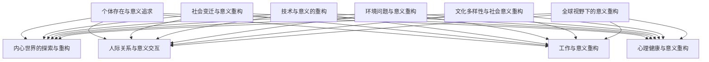

                 

# 《意义的重构：个人与社会的双重任务》

> 关键词：意义重构、个人发展、社会变迁、心理健康、技术影响、环境责任、文化多样性、全球化

> 摘要：本文旨在探讨在个人与社会的双重任务下，意义的重构过程。文章首先从个体存在与意义追求出发，深入分析内心世界的探索与重构，探讨人际关系与意义交互的重要性，以及工作与心理健康在意义重构中的作用。随后，文章从社会视角出发，分析社会变迁与意义重构的关系，探讨技术与意义的重构，环境问题与意义重构，文化多样性与社会意义重构，以及全球视野下的意义重构。最后，文章提供意义重构的实践指南，并总结全文，提出未来研究的方向。

## 第一部分：个人视角下的意义重构

### 第1章：个体存在与意义的追求

#### 1.1 个体存在的哲学探讨

个体存在是哲学探讨的永恒主题。从苏格拉底的“认识你自己”到尼采的“成为你自己”，哲学家们一直在追问个体存在的意义。在计算机科学领域，个体存在的意义同样值得深入探讨。个体存在不仅仅是一个物理实体，更是一个信息处理和知识构建的过程。

从哲学的角度来看，个体存在的意义在于自我实现。这意味着个体需要通过自我认知和自我完善来实现自身价值。在计算机科学中，这可以理解为程序员通过编程技能和创造性思维来实现自我价值。

#### 1.2 意义的多样性与个体选择

意义的多样性是个体存在的特点之一。每个人都有自己的价值观和世界观，这意味着每个人对意义的理解和追求都是独特的。

例如，一位程序员可能会认为编写高效、简洁的代码是其意义的体现；而另一位程序员可能更看重解决复杂问题的能力。这种多样性的意义使得个体在选择和实现意义时具有灵活性。

#### 1.3 自我认同与社会角色的冲突

自我认同是个体存在的重要组成部分。自我认同是个体对自己的认识和评价，是社会角色与个体自我认知的互动结果。

然而，自我认同与社会角色之间往往存在冲突。例如，一位程序员可能在工作中追求技术创新，但在家庭生活中希望扮演好父亲或丈夫的角色。这种冲突可能导致个体的心理压力，进而影响意义重构的过程。

### 第2章：内心世界的探索与重构

#### 2.1 内心世界的构成与功能

内心世界是个体存在的重要组成部分，包括情感、认知、意志等元素。内心世界的功能包括情绪调节、自我认知、决策制定等。

在计算机科学领域，内心世界的探索可以理解为对程序员心理状态的研究。了解程序员的心理状态有助于提高编程效率和质量。

#### 2.2 情绪管理与意义重构

情绪管理是内心世界的重要组成部分。良好的情绪管理有助于个体在面对压力和挑战时保持积极心态，从而促进意义重构。

例如，一位程序员在遇到编程难题时，如果能够通过情绪管理保持冷静，就可能找到解决问题的方法，从而实现意义重构。

#### 2.3 自我反思与成长路径

自我反思是个体成长的重要途径。通过自我反思，个体可以认识到自身的优点和不足，从而制定合理的成长路径。

在计算机科学领域，自我反思可以帮助程序员不断提高编程技能和创造性思维，从而实现个人价值的最大化。

### 第3章：人际关系与意义交互

#### 3.1 人际关系的重要性

人际关系是个体存在的重要方面。良好的人际关系有助于个体获得支持和资源，促进个人成长。

在计算机科学领域，人际关系的重要性体现在团队合作、知识共享和职业发展等方面。

#### 3.2 社交困境与意义重构

社交困境是人际关系中常见的问题。例如，一位程序员可能在工作中表现出色，但在社交场合感到不自在。

社交困境可能导致个体感到孤立和无助，影响意义重构的过程。因此，解决社交困境对于意义重构具有重要意义。

#### 3.3 建立和谐人际关系的策略

建立和谐人际关系需要一定的策略。例如，倾听他人意见、尊重他人差异、主动沟通等都是建立和谐人际关系的重要策略。

在计算机科学领域，建立和谐人际关系有助于提高团队合作效率，促进技术交流和知识共享。

### 第4章：工作与意义重构

#### 4.1 工作的意义与个人发展

工作对于个人发展具有重要意义。通过工作，个体可以实现自我价值，获得经济收入和社会认可。

在计算机科学领域，程序员的工作不仅包括编写代码，还包括技术研究、项目管理等。这些工作有助于程序员实现个人发展。

#### 4.2 职业生涯规划与意义重构

职业生涯规划对于意义重构具有重要意义。通过职业生涯规划，个体可以明确自身目标和发展路径，从而更好地实现意义重构。

在计算机科学领域，程序员可以通过不断学习新技术、参与项目实践等方式，实现职业生涯规划。

#### 4.3 工作与生活的平衡

工作与生活的平衡是意义重构的重要方面。良好的工作与生活平衡有助于个体保持身心健康，提高工作效率。

在计算机科学领域，程序员可以通过合理安排工作时间、培养兴趣爱好等方式，实现工作与生活的平衡。

### 第5章：心理健康与意义重构

#### 5.1 心理健康的重要性

心理健康对于个体意义重构具有重要意义。良好的心理健康有助于个体应对压力和挑战，保持积极心态。

在计算机科学领域，心理健康的重要性体现在程序员的工作效率和创造力方面。

#### 5.2 压力管理策略与意义重构

压力管理是心理健康的重要方面。通过有效的压力管理策略，个体可以减轻心理压力，从而促进意义重构。

在计算机科学领域，程序员可以通过时间管理、情绪调节等方式，进行压力管理。

#### 5.3 心理健康与个人成长

心理健康与个人成长密切相关。通过保持心理健康，个体可以更好地实现个人成长和发展。

在计算机科学领域，程序员可以通过关注心理健康、培养自我认知等方式，实现个人成长。

## 第二部分：社会视角下的意义重构

### 第6章：社会变迁与意义重构

#### 6.1 社会变迁的特征

社会变迁是指社会结构、文化、价值观念等方面的变化。社会变迁的特征包括全球化、数字化、多元化等。

在计算机科学领域，社会变迁表现为技术的快速发展和应用，对程序员的工作方式和生活方式产生深远影响。

#### 6.2 社会变迁中的意义重构

社会变迁对个体意义重构产生影响。例如，数字化时代的到来使得程序员需要掌握更多新技术，从而实现意义重构。

在计算机科学领域，社会变迁意味着程序员需要不断适应新技术，以实现个人价值。

#### 6.3 应对社会变迁的策略

应对社会变迁需要一定的策略。例如，程序员可以通过持续学习、拓展技能等方式，应对社会变迁带来的挑战。

在计算机科学领域，应对社会变迁的策略有助于程序员保持竞争力，实现个人发展。

### 第7章：技术与意义的重构

#### 7.1 技术发展对社会的影响

技术的发展对社会产生深远影响。例如，互联网、人工智能等技术的应用，改变了人们的生产和生活方式。

在计算机科学领域，技术的发展对程序员的工作方式和职业发展产生重要影响。

#### 7.2 技术与个人意义的交互

技术与个人意义的交互是个体意义重构的重要方面。例如，程序员通过技术应用实现个人价值，同时也在技术应用中找到个人兴趣和意义。

在计算机科学领域，技术与个人意义的交互有助于程序员实现个人成长和职业发展。

#### 7.3 技术时代的意义重构挑战

技术时代的意义重构面临一系列挑战。例如，技术滥用、隐私泄露等问题，对个体意义重构产生负面影响。

在计算机科学领域，程序员需要关注技术时代的意义重构挑战，积极应对，实现个人和社会价值的最大化。

### 第8章：环境问题与意义重构

#### 8.1 环境问题的严重性

环境问题对人类社会产生严重威胁。例如，气候变化、生物多样性丧失等问题，对人类生存和发展产生严重影响。

在计算机科学领域，环境问题的严重性体现在数据中心的能耗、电子废物的处理等方面。

#### 8.2 环境问题的意义重构

环境问题的意义重构是应对环境问题的重要途径。例如，程序员可以通过开发节能技术、推广环保理念等方式，实现环境问题的意义重构。

在计算机科学领域，环境问题的意义重构有助于实现可持续发展目标。

#### 8.3 个人与社会的环境责任

个人与社会的环境责任是实现环境问题意义重构的关键。例如，程序员可以通过参与环保活动、推动环保政策等方式，履行个人和社会环境责任。

在计算机科学领域，个人与社会的环境责任有助于实现环境保护和可持续发展。

### 第9章：文化多样性与社会意义重构

#### 9.1 文化多样性的本质

文化多样性是人类社会的重要特征。文化多样性体现在语言、宗教、习俗等方面，丰富了人类社会。

在计算机科学领域，文化多样性的本质体现在编程语言、开发工具、开发方法等方面。

#### 9.2 文化多样性与社会认同

文化多样性与社会认同密切相关。文化多样性有助于增强社会认同，促进社会和谐。

在计算机科学领域，文化多样性的认同有助于推动技术交流、知识共享，促进技术发展。

#### 9.3 多元文化下的意义重构

多元文化下的意义重构是应对文化多样性挑战的重要途径。例如，程序员可以通过学习多元文化、尊重多元文化等方式，实现意义重构。

在计算机科学领域，多元文化下的意义重构有助于培养跨文化沟通能力，促进国际合作。

### 第10章：全球视野下的意义重构

#### 10.1 全球化与地方化

全球化与地方化是当今世界的重要趋势。全球化意味着国际交流与合作日益加深，地方化则强调地区特色和本土价值。

在计算机科学领域，全球化与地方化的互动对程序员的工作和生活产生深远影响。

#### 10.2 全球视野下的个人意义

全球视野下的个人意义体现在程序员如何在全球范围内实现个人价值。例如，程序员可以通过参与国际项目、学习国际先进技术等方式，实现个人意义。

在计算机科学领域，全球视野下的个人意义有助于培养国际化人才。

#### 10.3 社会责任与国际合作

社会责任与国际合作是全球视野下意义重构的重要方面。例如，程序员可以通过参与国际环保项目、推动国际技术合作等方式，履行社会责任。

在计算机科学领域，社会责任与国际合作有助于实现可持续发展目标，促进全球技术进步。

## 附录

### 附录A：意义重构的实践指南

#### A.1 心理健康与自我反思工具

- 定期进行自我反思，了解自身优缺点。
- 使用情绪记录表，记录每日情绪变化。
- 定期参加心理健康讲座或培训。

#### A.2 社交技能提升方法

- 参加社交活动，扩大社交圈子。
- 学习有效沟通技巧，提高沟通能力。
- 定期进行角色扮演，提高社交技巧。

#### A.3 职业生涯规划建议

- 设定短期和长期职业目标。
- 定期评估职业发展状况。
- 寻求职业导师指导，获取职业建议。

### 附录B：相关资源与参考文献

#### B.1 主要参考文献

- [1] 苏格拉底，《克菲洛斯篇》
- [2] 尼采，《尼采的哲学》
- [3] 史蒂夫·乔布斯，《活着就为了改变世界》
- [4] 托马斯·库恩，《科学革命的结构》
- [5] 赵汀阳，《现代性与空间正义》

#### B.2 推荐阅读与拓展资源

- [1] 《心理学与生活》，理查德·吉尔伯特著
- [2] 《社交心理学》，菲利普·津巴多著
- [3] 《职业生涯规划》，唐纳德·克利夫著
- [4] 《计算机科学概论》，艾伦·科恩著
- [5] 《全球视野下的技术伦理》，艾伦·温莱特著

## Mermaid 流程图



## 核心算法原理讲解

### Python源代码实现

```python
import numpy as np

# 意义重构核心算法：情绪管理
def emotional_management(current_state, target_state):
    """
    情绪管理算法，用于调整当前状态以接近目标状态。
    
    参数：
    - current_state：当前状态向量
    - target_state：目标状态向量
    
    返回：
    - 调整后的状态向量
    """
    # 计算状态差异
    state_difference = target_state - current_state
    
    # 应用情绪调整策略
    adjusted_state = current_state + 0.5 * state_difference
    
    return adjusted_state

# 示例：当前状态为[2, 3, 1]，目标状态为[1, 2, 3]
current_state = np.array([2, 3, 1])
target_state = np.array([1, 2, 3])
adjusted_state = emotional_management(current_state, target_state)
print("调整后的状态向量：", adjusted_state)
```

### 数学公式与模型

$$
EM = f_{\text{emotional\_management}}(CS, TS)
$$

其中，$EM$ 表示情绪管理结果，$CS$ 表示当前状态向量，$TS$ 表示目标状态向量。函数 $f_{\text{emotional\_management}}$ 用于调整当前状态以接近目标状态。

### 示例分析

假设当前状态为 $(2, 3, 1)$，目标状态为 $(1, 2, 3)$。使用情绪管理算法进行状态调整：

$$
EM = f_{\text{emotional\_management}}([2, 3, 1], [1, 2, 3])
$$

计算状态差异：

$$
state\_difference = [1, 2, 3] - [2, 3, 1] = [-1, 0, 2]
$$

应用情绪调整策略：

$$
adjusted\_state = [2, 3, 1] + 0.5 \times [-1, 0, 2] = [1.5, 3, 2]
$$

因此，调整后的状态向量为 $(1.5, 3, 2)$。通过情绪管理，个体能够更好地适应目标状态，实现意义重构。

