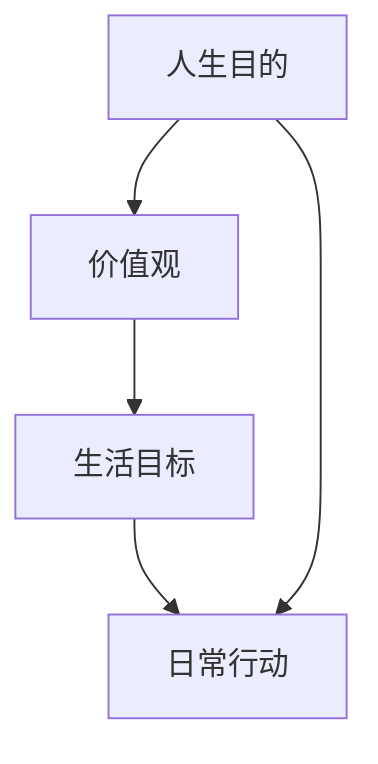
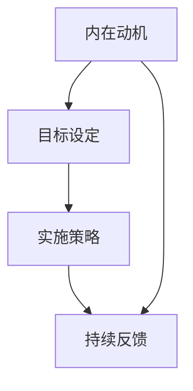
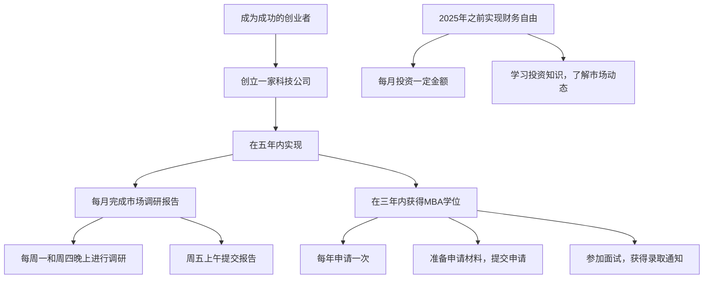
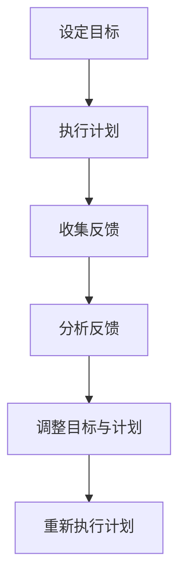

                 

### 背景介绍

在现代社会的快速发展中，人们面临着越来越多的选择和挑战。如何在纷繁复杂的环境中找到自己的方向，实现个人成长和价值，成为了一个重要的问题。这种寻找和实现的过程，本质上是对人生意义的探索。而“意义设计工作坊”正是为了帮助人们在这个探索过程中提供一种系统化、科学化的方法。

“意义设计工作坊”源于现代心理学和组织行为学的研究成果，结合了目标设定理论、自我决定理论以及人生规划理论等。它通过一系列互动性的实践工作坊，帮助参与者深入挖掘个人价值观，明确人生目标，制定行动计划，并在实际操作中不断调整和优化。这种工作坊不仅适用于个人，也可以在团队和组织层面进行，从而促进个人与集体的共同成长。

意义设计工作坊的核心在于其系统性和实践性。它不仅提供了一套完整的方法论，还通过实际操作和互动，使参与者能够深刻理解和体验这个过程。这种方法论的提出，源于对人类行为和心理的深入研究，旨在解决人们在追求目标和实现价值过程中遇到的困惑和挑战。

本文将围绕“意义设计工作坊：构建有目标感的人生蓝图”这一主题，详细阐述其核心概念、实践路径以及具体操作方法。通过本文的阅读，读者将能够全面了解意义设计工作坊的原理和应用，掌握如何通过这一工作坊构建有目标感的人生蓝图，从而实现个人成长和人生价值。

### 核心概念与联系

意义设计工作坊的核心概念主要包括人生目的、价值观、生活目标和日常行动。这些概念相互关联，共同构成了一个有机的整体，指导参与者进行自我探索和目标设定。

首先，**人生目的**是意义设计的起点。它代表了一个人的生命意义和价值追求，是对“为什么而活”这一根本问题的回答。人生目的通常是基于个人的核心价值观和生活经历形成的，如追求幸福、实现自我价值、为他人贡献等。人生目的是一个宏观的指导方向，为后续的价值观和目标设定提供了基础。

**价值观**是意义设计的核心要素，它决定了个人对事物的评价和行为准则。核心价值观是那些在个人生活中长期稳定、具有强烈认同感的观念，如诚信、责任、自由、和谐等。价值观不仅影响个人的决策和行为，也影响着与他人的关系和社会的互动。在意义设计工作坊中，识别和梳理个人的核心价值观是关键步骤，因为它们是构建有意义人生蓝图的基础。

**生活目标**是将人生目的具体化的阶段性目标，是对“如何实现目的”的回答。生活目标通常分为短期、中期和长期目标，它们彼此关联，形成一个目标体系。例如，一个追求幸福的人可能会设定短期目标为找到满意的工作，中期目标为建立家庭，长期目标为实现财务自由。生活目标是实现人生目的的具体路径和策略，它们需要根据个人情况和外部环境进行动态调整。

**日常行动**是实现生活目标的具体步骤和行动。它包括日常生活中的各项活动，如学习、工作、锻炼、社交等。日常行动是实现生活目标的关键，需要具备明确的目标导向和执行力。在意义设计工作坊中，参与者会通过制定详细的行动计划来确保日常行动与生活目标一致。

以上四个核心概念之间的关系可以用以下Mermaid流程图表示：



这个流程图清晰地展示了人生目的、价值观、生活目标和日常行动之间的逻辑关系，从宏观到微观，逐步引导参与者进行自我探索和目标设定。人生目的是指导方向，价值观是评价标准，生活目标是具体路径，日常行动是执行步骤。通过这四个环节的有机结合，意义设计工作坊帮助参与者构建一个有目标感的人生蓝图。

### 什么是意义设计

**意义设计**是一个系统性的过程，旨在帮助个人或团队通过深入探索和明确目标，实现内在动机和外在成就的有机结合。其核心理念是将意义与目的融入生活的各个方面，从而创造一个更有意义和目标感的生活。

首先，**意义设计**的定义可以从三个方面来理解：

1. **内在动机**：意义设计关注的是内在动机，即个人对生活目标的热忱和热情。这种动机来源于个人的核心价值观，而不是外部奖励或压力。通过识别和明确内在动机，参与者能够找到真正的驱动力，从而更持久、更积极地追求目标。

2. **目标设定**：意义设计中的目标设定不仅仅是设定一些具体的、可量化的任务，而是通过深入理解个人的人生目的和价值观，设定与这些核心要素相一致的、有深层次意义的长期和短期目标。这些目标不仅仅是“做某事”，而是“为什么做某事”，从而赋予行动更深层次的意义。

3. **实施策略**：意义设计还涉及到实施策略，即如何将设定的目标转化为具体的行动。这包括时间管理、资源分配、行为习惯的培养等。通过制定切实可行的行动计划，参与者能够逐步实现目标，并在实践中不断调整和优化。

其次，**意义设计的重要性**体现在以下几个方面：

1. **增强内在动机**：通过意义设计，个人能够找到与自身价值观相符的生活目标，从而激发内在动机，使追求目标的过程更加自发和有意义。

2. **提高生活质量**：意义设计帮助个人明确自己的生活方向和目标，使生活更加有序和充实。通过设定有意义的目标和制定行动计划，个人能够更好地管理时间和资源，提高生活质量。

3. **促进个人成长**：意义设计不仅关注当前的目标，还关注个人的长远发展。通过不断地设定和实现目标，个人能够不断挑战自我，提高自我认知和能力，实现个人成长。

4. **建立目标感**：在意义设计的过程中，参与者会不断反思和调整自己的目标和行动，从而建立一种持续的目标感。这种目标感不仅能够帮助个人更好地应对挑战和困难，还能增强个人的自信心和满足感。

总之，意义设计是一个全面、系统的方法，旨在帮助个人或团队通过深入探索、明确目标并实施策略，实现内在动机与外在成就的有机结合。它不仅关注当前的目标，更关注个人的成长和长远发展，为构建有意义和目标感的生活提供了有力的工具和指导。

### 意义设计的四个维度

意义设计是一个多层次、多维度的系统，其核心在于帮助个人或团队找到并实现有意义的目标。为了实现这一目标，意义设计可以从四个维度进行深入分析和实践：内在动机、目标设定、实施策略和持续反馈。

首先，**内在动机**是意义设计的起点。内在动机指的是个人从事某项活动或追求某个目标的内在驱动力，而不是外部奖励或压力。这种动机通常源于个人的核心价值观、兴趣、热情和使命感。例如，一个热爱教育的老师可能会将“提升学生的知识和能力”作为自己的内在动机，而一个创业家可能会将“为社会创造价值”作为自己的内在动机。内在动机不仅能够增强个人的积极性，还能使追求目标的过程更加有乐趣和意义。

其次，**目标设定**是意义设计的核心。目标设定不仅仅是为了明确个人的方向和任务，更重要的是要确保这些目标与个人的内在动机和价值观相一致。目标设定的过程需要遵循SMART原则，即目标要具体（Specific）、可衡量（Measurable）、可实现（Achievable）、相关（Relevant）和有时间限制（Time-bound）。例如，一个创业者可能设定一个具体的目标：“在接下来的一年中，将公司销售额提升30%”。这样的目标不仅具体明确，而且具有可衡量性、可实现性和时间限制，从而能够有效驱动行动。

接下来，**实施策略**是将目标转化为实际行动的过程。在实施策略中，时间管理和资源分配是关键。时间管理可以通过使用如时间管理四象限的方法，将任务按照紧急程度和重要性进行分类，从而更有效地利用时间。资源分配则涉及到个人能力的提升、团队合作以及外部资源的获取。例如，为了实现上述销售额提升的目标，创业者可能需要加强市场调研、提升产品品质、拓展销售渠道等。通过制定详细的行动计划，并确保每个步骤都有明确的执行时间和责任人，能够有效推动目标的实现。

最后，**持续反馈**是意义设计不可或缺的一环。持续反馈能够帮助参与者及时了解自己的行动是否在正确的方向上，以及如何调整和优化。反馈可以分为自我反馈和外部反馈。自我反馈是通过自我观察、反思和记录来实现的，例如，每天记录自己的行动和成果，并定期进行回顾和总结。外部反馈则是通过他人或团队提供的意见和建议来实现的，例如，邀请导师或同事进行反馈，参加团队讨论等。通过持续反馈，参与者能够不断调整自己的行动计划，优化目标实现的过程。

以下是这四个维度之间的关系图，用Mermaid流程图表示：



在这个流程图中，内在动机是整个系统的起点，它决定了目标设定和实施策略的方向和内容。目标设定则是根据内在动机来明确具体的目标和行动计划。实施策略是实现目标的手段，而持续反馈则帮助参与者不断调整和优化目标和行动。通过这四个维度的有机结合，意义设计工作坊能够帮助个人或团队实现有意义的目标，提升生活质量和个人成长。

### 识别个人核心价值观

在意义设计过程中，识别个人核心价值观是至关重要的一步。核心价值观不仅是驱动个人行为和决策的内在动力，也是构建有意义人生蓝图的基础。以下将介绍核心价值观的内涵与影响，以及实践方法：价值观梳理工作坊。

**核心价值观的内涵**

核心价值观是指一个人在其生活各个领域中始终遵循的、具有持久性和根本性的信念和原则。这些价值观通常源自个人的成长背景、文化环境、教育经历和人生经历，是个人内心深处最为坚定和重要的信念。例如，诚信、责任感、自由、和谐、家庭和成就等都是常见的核心价值观。

**核心价值观的影响**

核心价值观对个人的影响深远且广泛。首先，它们决定了个人对事物的看法和评价，影响个人的决策和行为。例如，一个重视诚信的人在面对道德困境时，更可能选择诚实而非欺骗。其次，核心价值观有助于建立个人的身份认同，使个人在面对外部压力和挑战时保持一致性和稳定性。此外，核心价值观还影响与他人的关系，帮助个人与他人建立信任和共识。

**价值观梳理工作坊**

为了识别和明确个人的核心价值观，可以采用价值观梳理工作坊这一实践方法。以下是一个简单的价值观梳理工作坊流程：

1. **准备阶段**：选择一个安静、舒适的环境，准备纸笔和清单。确保在接下来的时间内没有外部干扰。

2. **头脑风暴**：让参与者列出他们认为自己最重要的价值观。这个过程不需要评判，只需自由地写下所有想到的价值观。可以参考以下问题来帮助思考：
   - 在你的生活中，什么是你最看重的？
   - 当你做出重要决策时，你会考虑什么？
   - 你希望自己成为一个怎样的人？

3. **整理清单**：将列出的价值观进行整理和分类。通常，人们会列出多个价值观，但这些价值观可能存在相似之处或重叠。通过整理，可以将相似的价值观合并，形成更简洁的核心价值观列表。

4. **选择核心价值观**：从整理后的列表中，选择最重要的几个价值观。这些核心价值观应该是你生活中最为重要、最为坚定的信念。选择过程中，可以考虑以下问题：
   - 哪些价值观对你决策和行为的影响最大？
   - 哪些价值观能够最好地体现你的身份和价值观？

5. **确认核心价值观**：对选择出的核心价值观进行确认，确保它们确实是你内心深处的信念，并且愿意在未来的生活和决策中坚持和实践。

**示例**：

假设一个参与者列出了以下价值观：
- 成功
- 自由
- 家庭
- 诚信
- 公平
- 学习

通过整理和筛选，他最终确定了以下核心价值观：
- 诚信
- 家庭
- 学习

这些核心价值观不仅反映了他的价值观体系，也是他未来生活和决策的重要指导原则。

通过价值观梳理工作坊，参与者能够深入挖掘和明确自己的核心价值观，为意义设计工作坊的后续步骤奠定基础。这个过程不仅帮助个人更加清晰地认识自己，也为构建有意义的人生蓝图提供了重要的参考。

### 确立人生目标

在识别个人核心价值观之后，下一步是确立人生目标。人生目标是对个人人生目的的具体化，是我们在不同阶段中要实现的重要任务和成就。为了确保这些目标的设定科学、明确且切实可行，我们可以遵循SMART原则，即目标应具备具体性、可衡量性、可实现性、相关性和时间限制。

#### SMART原则

1. **具体性（Specific）**：目标必须明确具体，具体到可以操作和实施的步骤。例如，而不是说“我想变得健康”，更具体的表述可以是“每周进行三次30分钟的有氧运动”。

2. **可衡量性（Measurable）**：目标需要能够量化，以便我们能够衡量进展和结果。例如，“在接下来的六个月内，减掉10斤体重”。

3. **可实现性（Achievable）**：目标应基于个人的资源和能力，即尽管具有一定的挑战性，但在实际操作中是可以实现的。例如，“在三个月内掌握Python编程语言”。

4. **相关性（Relevant）**：目标应与个人的核心价值观和长期愿景相一致，确保其真正符合个人的价值观和人生目标。例如，“为了追求职业发展，我将在两年内获得MBA学位”。

5. **时间限制（Time-bound）**：目标应设定一个明确的时间期限，以促进行动的时效性和紧迫感。例如，“在2025年之前实现财务自由”。

#### 目标树构建方法

为了更好地设定和实现人生目标，我们可以使用**目标树**的方法。目标树将人生目标分解为多个层次和阶段，从宏观到微观，逐步细化，使目标更加清晰和具体。

**目标树构建步骤如下**：

1. **明确最高层目标**：从人生目的出发，明确最高层次的目标，例如，“成为一位成功的创业者”或“实现全球旅行梦想”。

2. **分解为中期目标**：将最高层次的目标分解为若干个中期目标，例如，“在五年内创立一家科技公司”或“在三年内完成全球旅行计划”。

3. **细化为短期目标**：将中期目标进一步细化为具体的短期目标，例如，“每月完成一项市场调研报告”或“每个月计划一次旅行目的地”。

4. **制定行动计划**：为每个短期目标制定具体的行动计划，明确每一步的操作步骤和时间安排，例如，“每周一和周四晚上进行市场调研，并于周五上午提交报告”或“每月初制定旅行计划，并提前两周预订机票和酒店”。

以下是一个示例目标树：



在这个目标树中，最高层次目标是“成为成功的创业者”，并通过“创立一家科技公司”和“获得MBA学位”等中期目标来具体实现。每个中期目标又分解为多个短期目标，并制定了具体的行动计划。通过这样的目标树，参与者可以清晰地看到实现目标的全过程，从而更有针对性地进行行动和调整。

通过遵循SMART原则和构建目标树，我们可以确保人生目标的设定既科学又具体，为实现有意义的人生奠定坚实的基础。

### 构建个人愿景蓝图

构建个人愿景蓝图是意义设计工作坊中的关键步骤，它不仅帮助我们明确人生目标，还赋予这些目标更深层次的意义。个人愿景蓝图是一个全面、动态的规划，涵盖了个人生活的各个方面，包括职业、家庭、健康、财务、社交和自我成长等。以下将详细介绍构建个人愿景蓝图的步骤：

#### 第一步：明确核心目标

构建个人愿景蓝图的起点是明确你的核心目标。这些目标应与你的核心价值观和长期愿景相一致。例如，如果你的核心价值观包括“家庭”和“健康”，那么你可以设定“在五年内拥有一个和睦的家庭，并保持健康的生活方式”作为你的核心目标。

#### 第二步：分解为具体目标

在明确了核心目标后，将这些目标分解为更具体的短期和中期目标。这些目标应具有明确的时间范围和可衡量性。例如，如果你设定了“在五年内拥有一个和睦的家庭”，你可以进一步分解为“在一年内找到合适的伴侣，三年内结婚，五年内拥有两个孩子的家庭”。

#### 第三步：绘制愿景蓝图

在纸上或使用软件绘制愿景蓝图，将你的核心目标和具体目标以图表或思维导图的形式呈现。以下是一个简单的愿景蓝图示例：

```mermaid
graph TD
    A[个人愿景蓝图]
    B[职业]
    C[家庭]
    D[健康]
    E[财务]
    F[社交]
    G[自我成长]

    A --> B
    A --> C
    A --> D
    A --> E
    A --> F
    A --> G

    B[职业目标]
    B --> I[职业成就]
    B --> J[工作环境]
    B --> K[职业发展]

    C[家庭目标]
    C --> L[家庭和谐]
    C --> M[亲子关系]
    C --> N[家庭活动]

    D[健康目标]
    D --> O[健康生活]
    D --> P[定期体检]
    D --> Q[锻炼计划]

    E[财务目标]
    E --> R[财务稳定]
    E --> S[投资理财]
    E --> T[预算管理]

    F[社交目标]
    F --> U[社交圈扩大]
    F --> V[人际关系]
    F --> W[社交活动]

    G[自我成长目标]
    G --> X[知识学习]
    G --> Y[技能提升]
    G --> Z[个人发展]

这个愿景蓝图展示了个人在职业、家庭、健康、财务、社交和自我成长六个方面的目标，每个方面又分解为更具体的短期和中期目标。通过这种图表形式，可以直观地看到个人愿景的全貌，以及实现这些愿景的具体路径。

#### 第四步：定期更新和调整

构建愿景蓝图并不是一次性的任务，而是一个持续的过程。随着时间的推移，个人情况、外部环境和内心需求都可能发生变化，因此需要定期更新和调整愿景蓝图。以下是一些建议：

- **每月回顾**：每月至少花一些时间回顾自己的目标和进度，并根据实际情况进行调整。
- **年度评估**：每年进行一次全面的评估，重新审视愿景蓝图的各个部分，确保它们仍然与个人的核心价值观和长期愿景相一致。
- **灵活调整**：在实现目标的过程中，如果遇到挑战或机会，不要害怕调整目标。灵活的调整有助于更好地适应变化，保持目标的实现。

通过构建个人愿景蓝图，我们可以更加清晰地看到自己的人生方向，明确每个阶段的具体目标，从而更有动力地追求和实现这些目标。这不仅有助于提升个人生活的整体质量，还能增强内心的满足感和成就感。

### 制定行动计划

制定行动计划是意义设计工作坊中的关键环节，它将个人愿景和目标转化为具体的行动步骤，确保目标能够得以实现。以下将详细说明制定行动计划的具体步骤，并提供实用工具和时间管理技巧，以帮助参与者更有效地实现目标。

#### 步骤一：明确目标

在制定行动计划之前，首先要确保个人愿景和目标已经明确。这些目标应具体、可衡量、可实现、相关且有时间限制。例如，“在未来六个月内，提升我的编程技能，达到中级水平”。

#### 步骤二：分解目标

将大目标分解为一系列小步骤或任务，这些小步骤应具有明确的时间框架和执行标准。例如，如果目标是“提升编程技能”，可以分解为：

1. **学习Python基础**（1个月内完成）
2. **完成Python编程项目**（2个月内完成）
3. **参加编程社区活动**（每月至少一次）

#### 步骤三：制定时间表

为每个小步骤或任务制定具体的时间表，明确每个任务的开始和结束时间。例如：

- **学习Python基础**：从本周一开始，每天学习2小时，持续4周。
- **完成Python编程项目**：从第五周开始，每周完成一个小项目，共需2个月。

#### 步骤四：分配资源

确保每个任务所需的资源都得到合理分配，包括时间、金钱和人力等。例如，为了完成编程项目，可能需要购买一些编程书籍或在线课程，并安排适当的时间进行学习和实践。

#### 步骤五：制定监测机制

为每个任务制定监测机制，以跟踪进度和效果。可以使用以下工具：

1. **日程表**：将任务和时间表记录在日程表上，每天查看任务完成情况。
2. **项目管理系统**：使用Trello、Asana等工具，将任务分解、分配和监控。
3. **进度报告**：定期撰写进度报告，与导师或团队成员分享，获取反馈。

#### 时间管理四象限

时间管理是行动计划中的关键环节。使用时间管理四象限方法，可以更有效地分配时间和精力：

1. **重要且紧急**：处理这些任务，通常需要立即行动，如紧急会议或突发事件。
2. **重要但不紧急**：提前规划和准备，以避免任务变得紧急，如定期体检或市场调研。
3. **不重要但紧急**：尽量减少这些任务，如不必要的电话或临时任务。
4. **不重要且不紧急**：尽量避免这些任务，如社交媒体浏览或无聊的活动。

以下是一个时间管理四象限的示例：

```mermaid
graph TD
    A[重要紧急]
    B[重要不紧急]
    C[不重要紧急]
    D[不重要不紧急]

    A --> E[处理紧急任务]
    B --> F[提前规划]
    C --> G[减少不必要任务]
    D --> H[避免无聊活动]

    A[重要紧急] --> I[会议]
    B[重要不紧急] --> J[规划会议]
    C[不重要紧急] --> K[不必要电话]
    D[不重要不紧急] --> L[社交媒体]
```

通过合理利用时间管理四象限，参与者可以更高效地处理任务，确保重要任务得到优先处理。

#### 实用工具

为了更有效地制定和执行行动计划，以下是一些实用的工具：

1. **日历应用**：如Google日历，可以方便地记录任务和时间表。
2. **任务管理工具**：如Trello、Asana等，可以帮助分解任务、分配任务和监控进度。
3. **时间跟踪工具**：如Toggl，可以记录每天的工作时间和任务完成情况。

#### 实现目标的策略与方法

1. **设立明确的目标**：确保目标具体、可衡量、可实现、相关且有时间限制。
2. **分解任务**：将大目标分解为小步骤，每个步骤都应具体明确。
3. **制定时间表**：为每个任务分配具体的时间框架，确保任务能够按计划进行。
4. **合理分配资源**：确保每个任务所需的资源都得到合理分配，避免资源浪费。
5. **持续监测和调整**：定期监测任务进度，根据实际情况进行调整，确保目标能够得以实现。

通过以上步骤和策略，参与者可以更有效地制定和执行行动计划，确保个人愿景和目标得以实现，从而构建有目标感的人生蓝图。

### 调整与适应

在意义设计工作坊中，调整与适应是至关重要的一环。由于外部环境和内部需求的变化，我们在实现目标的过程中难免会遇到挑战和障碍。因此，学会如何调整目标和适应变化是确保意义设计过程顺利进行的关键。

#### 应对挑战与障碍

1. **识别挑战和障碍**：首先，我们需要识别在实现目标过程中可能遇到的挑战和障碍。这些可能包括外部环境的变动、个人能力的不足、资源的限制等。例如，如果设定的目标是“在一年内完成一项重要项目”，但过程中发现项目需求发生了重大变化，这就是一个外部环境变动的挑战。

2. **分析原因**：在识别了挑战和障碍后，我们需要分析其原因。这有助于我们找到解决问题的方法。例如，如果发现项目需求变化是由于市场需求的变化，我们可以通过增加市场调研和客户反馈来调整项目方向。

3. **制定应对策略**：针对识别出的挑战和障碍，制定具体的应对策略。这包括调整目标、改变行动计划、增加资源投入等。例如，如果项目需求发生变化，我们可以调整项目计划，重新设定时间表和任务分配。

#### 适应变化：灵活调整目标

1. **重新设定目标**：在应对挑战和障碍时，可能需要重新设定目标。这并不意味着放弃原定的目标，而是根据实际情况进行适当的调整。例如，如果发现原定的目标过于雄心勃勃，可以将其分解为更小、更易实现的目标。

2. **保持灵活**：在实现目标的过程中，保持灵活性至关重要。这意味着我们要随时准备调整计划和策略，以适应新的情况和需求。例如，如果发现新的技术或方法可以更有效地实现目标，不妨及时采纳。

#### 持续进步：反馈与迭代

1. **定期反馈**：在意义设计工作坊中，定期反馈是持续进步的重要手段。通过自我反馈和外部反馈，我们可以及时了解自己的表现和进展，发现问题和不足，从而进行有针对性的调整。

2. **迭代优化**：基于反馈，不断迭代和优化目标和行动计划。这意味着我们要在实现目标的过程中不断学习和成长，不断完善和调整。例如，在完成一个项目后，可以通过回顾和总结来识别改进点，并在下一个项目中应用。

以下是一个简单的反馈与迭代流程图：



通过这个流程，参与者可以持续地调整和优化目标，从而实现个人成长和目标的不断进步。

总之，调整与适应是意义设计工作坊中的关键步骤。通过识别挑战、分析原因、制定应对策略、灵活调整目标和持续反馈与迭代，我们可以有效地应对变化，确保意义设计过程顺利进行，并最终实现个人成长和目标的实现。

### 意义设计工作坊的设计与引导

意义设计工作坊的设计与引导是确保参与者能够有效参与并从中受益的关键。一个成功的工作坊不仅需要系统的设计，还需要有经验的引导者来引导整个工作过程。以下将详细探讨意义设计工作坊的设计与引导步骤、设计原则以及引导策略。

#### 设计与引导步骤

1. **准备阶段**：
   - **明确工作坊目的**：首先，要明确工作坊的目标和预期成果。这包括帮助参与者识别核心价值观、设定人生目标、制定行动计划等。
   - **选择合适的时间和地点**：选择一个安静、舒适的环境，并确保参与者能够在规定的时间内全身心投入。
   - **准备材料和工具**：根据工作坊的内容，准备必要的材料，如纸笔、清单模板、时间管理工具等。

2. **启动阶段**：
   - **破冰活动**：通过一些破冰活动，帮助参与者放松心情，建立信任，例如自我介绍、团队建设游戏等。
   - **介绍工作坊目的**：明确工作坊的目的和流程，让参与者了解他们将经历的内容和目标。

3. **核心阶段**：
   - **价值观梳理**：通过一系列引导活动，帮助参与者识别和梳理个人的核心价值观。
   - **目标设定**：引导参与者使用SMART原则设定具体的人生目标。
   - **愿景蓝图构建**：通过绘制愿景蓝图，将目标具体化，并为每个目标制定行动计划。

4. **总结与反馈阶段**：
   - **总结成果**：引导参与者回顾工作坊的成果，并总结所学的内容和经验。
   - **收集反馈**：收集参与者的反馈，了解工作坊的优缺点，以便进行改进。

5. **后续支持**：
   - **行动计划跟进**：提供后续支持，帮助参与者执行行动计划，确保目标的实现。
   - **持续指导**：定期与参与者进行交流，提供指导和支持，帮助他们克服困难和挑战。

#### 设计原则

1. **参与性**：工作坊的设计应鼓励参与者积极参与，通过互动和讨论，激发他们的思考和创造力。
2. **个性化**：工作坊应尊重每个参与者的个性差异，根据个人的需求和情况，提供有针对性的指导。
3. **系统性**：工作坊的内容应具有系统性，从识别核心价值观到设定目标，再到制定行动计划，形成一个完整的过程。
4. **实用性和可操作性**：工作坊的内容和工具应实用且易于操作，使参与者能够将其应用到实际生活中。

#### 引导策略

1. **引导技巧**：
   - **开放性问题**：通过提出开放性问题，引导参与者思考和分享他们的观点。
   - **积极倾听**：倾听参与者的发言，并给予积极的反馈，以增强他们的信心和参与感。
   - **故事引导**：通过分享相关的故事和案例，帮助参与者更好地理解和应用工作坊的内容。

2. **互动和讨论**：
   - **小组讨论**：将参与者分成小组，进行讨论和分享，促进彼此的交流和启发。
   - **角色扮演**：通过角色扮演活动，使参与者更深入地体验和思考工作坊的内容。

3. **反馈和调整**：
   - **及时反馈**：在过程中及时给予参与者反馈，帮助他们了解自己的表现和进展。
   - **调整策略**：根据参与者的反馈和实际情况，及时调整工作坊的进程和内容，确保其符合参与者的需求。

通过精心设计和有效引导，意义设计工作坊能够帮助参与者深入挖掘个人价值观，明确人生目标，制定切实可行的行动计划，从而实现个人成长和目标的实现。

### 意义设计工作坊的实际操作

意义设计工作坊的实际操作包括多个关键环节，每个环节都有其独特的步骤和具体方法。以下将详细介绍四个核心环节：价值观梳理工作坊、目标设定工作坊、愿景蓝图构建工作坊和行动计划制定工作坊。

#### 价值观梳理工作坊

**步骤一**：引导参与者进行自我反思。可以使用以下问题来引导思考：
- 你认为自己在生活中最重要的价值观是什么？
- 这些价值观是如何形成的？
- 它们对你的决策和行为有什么影响？

**步骤二**：进行头脑风暴，让参与者写下他们心中的核心价值观。建议使用以下几个问题来帮助思考：
- 你希望自己成为一个怎样的人？
- 你在做决定时会考虑哪些因素？
- 你最看重的品质是什么？

**步骤三**：整理和分类价值观。将写下的价值观进行整理，并按照相似性进行分类。

**步骤四**：确认核心价值观。让参与者从分类后的价值观中选择出他们最认同的几个核心价值观，并进行确认。

**示例**：一位参与者通过上述步骤，确定了以下核心价值观：诚信、家庭、成长、自由、合作。

#### 目标设定工作坊

**步骤一**：回顾和确认核心价值观。在设定目标之前，确保参与者已经明确自己的核心价值观。

**步骤二**：引导参与者思考并写下他们的人生目标。可以使用以下问题来帮助思考：
- 你的人生目的是什么？
- 你希望在哪些方面实现自己的价值？
- 你的长期和短期目标是什么？

**步骤三**：使用SMART原则对目标进行具体化和量化。确保目标具有具体性、可衡量性、可实现性、相关性和时间限制。

**步骤四**：分解目标。将大目标分解为一系列小步骤或任务，每个步骤或任务都应具体明确。

**示例**：一位参与者设定的目标如下：
- 长期目标：在五年内创立一家成功的科技企业。
- 短期目标：1年内完成市场调研，3年内获得天使投资，5年内实现盈利。

#### 愿景蓝图构建工作坊

**步骤一**：引导参与者绘制愿景蓝图。可以使用以下问题来帮助思考：
- 你的愿景是什么？
- 你希望在未来实现什么样的生活状态？
- 你在职业、家庭、健康、财务、社交和自我成长方面有哪些目标？

**步骤二**：将愿景蓝图分解为具体的部分。例如，职业、家庭、健康等。

**步骤三**：为每个部分设定具体的短期和长期目标。确保目标与个人的核心价值观相一致。

**步骤四**：绘制愿景蓝图。可以使用思维导图或图表等形式，将目标可视化。

**示例**：一位参与者的愿景蓝图如下：
- 职业目标：五年内创立一家成功的科技企业，成为该企业的CEO。
- 家庭目标：三年内与伴侣结婚，五年内拥有两个孩子。
- 健康目标：每周进行三次有氧运动，每年进行一次全面体检。

#### 行动计划制定工作坊

**步骤一**：回顾并确认愿景蓝图中的目标。确保参与者已经明确自己的目标。

**步骤二**：引导参与者制定具体的行动计划。可以使用以下问题来帮助思考：
- 为了实现目标，你需要采取哪些具体行动？
- 这些行动的时间安排是怎样的？
- 你需要哪些资源来支持这些行动？

**步骤三**：将行动计划具体化。例如，将“每周进行三次有氧运动”具体化为“每天早上7点进行跑步”。

**步骤四**：为每个行动计划设定时间表和责任人。确保每个行动都有明确的执行时间和责任人。

**示例**：一位参与者的行动计划如下：
- 行动1：每月进行一次市场调研，时间安排在每月的最后一个星期五。
- 行动2：每周进行三次有氧运动，每天早上7点进行跑步。

通过以上四个环节的实际操作，意义设计工作坊帮助参与者深入挖掘个人价值观，明确人生目标，构建愿景蓝图，并制定具体的行动计划。这种方法不仅有助于提升个人的目标感和成就感，还能促进个人成长和实现人生价值。

### 意义设计工作坊的评估与反馈

意义设计工作坊的评估与反馈是确保工作坊效果的重要环节，通过系统的评估和及时的反馈，可以了解工作坊的成效，发现问题和不足，从而不断优化和改进。以下将详细介绍评估方法、参与者反馈的收集方法以及工作坊的改进与优化策略。

#### 评估方法

1. **定量评估**：
   - **问卷调查**：通过设计结构化的问卷，收集参与者在工作坊前后的变化情况。问卷可以包括目标设定情况、行动计划实施情况、目标达成度等方面的指标。
   - **关键绩效指标（KPI）**：设定具体的关键绩效指标，如目标完成率、行动计划执行率等，通过数据分析来评估工作坊的成效。

2. **定性评估**：
   - **访谈**：与参与者进行一对一或小组访谈，深入了解他们在工作坊中的体验和感受，以及遇到的具体问题。
   - **观察**：在工作坊过程中，通过观察参与者的互动和表现，评估工作坊的引导效果和参与度。

#### 参与者反馈的收集方法

1. **即时反馈**：
   - **工作坊中的互动环节**：在工作坊过程中，通过互动讨论、小组分享等环节，收集参与者的即时反馈。
   - **问卷调查**：在工作坊结束后，立即发放问卷调查，收集参与者的初步反馈。

2. **后续反馈**：
   - **定期跟进**：在工作坊结束后的一段时间内，通过电话、邮件等方式，定期与参与者进行沟通，了解工作坊对他们实际生活和工作的影响。
   - **反馈会议**：组织参与者进行反馈会议，讨论工作坊的成效和改进点。

#### 工作坊的改进与优化策略

1. **基于反馈的调整**：
   - **内容优化**：根据参与者的反馈，调整工作坊的内容和结构，确保其符合参与者的需求和期望。
   - **引导策略调整**：根据反馈，改进引导者的引导技巧和策略，提高工作坊的互动性和参与度。

2. **持续优化**：
   - **迭代优化**：将工作坊视为一个持续优化的过程，每次工作坊结束后，都进行全面的评估和反馈，不断改进和完善。
   - **经验分享**：鼓励引导者和参与者分享经验和建议，相互学习，共同提升。

3. **技术支持**：
   - **工具和资源**：提供更多实用的工具和资源，如模板、指南、在线课程等，帮助参与者更好地应用工作坊所学。
   - **技术支持**：建立技术支持团队，为参与者提供必要的帮助和指导，确保他们在应用过程中能够顺利解决问题。

通过系统化的评估和及时反馈，意义设计工作坊可以不断改进和优化，从而更有效地帮助参与者实现个人成长和目标设定。

### 附录A：意义设计工作坊资源

为了帮助读者更好地理解并实践意义设计工作坊，以下推荐了一些相关的书籍、在线资源和工具。

#### 书籍推荐

1. **《人生设计：如何创造你想要的生活》** - 布鲁斯·纳尔逊（Bruce Nussbaum）
   - 本书详细介绍了如何通过设计思维来规划和实现个人生活目标。

2. **《目标：成功的执行法则》** - 埃德温·A·洛克（Edwin A. Locke）
   - 本书深入探讨了目标设定与实现的关系，提供了实用的目标设定方法。

3. **《有意义的工作：如何在工作中找到幸福与成就感》** - 帕梅拉·海恩斯（Pamela Hinds）
   - 本书通过丰富的案例，阐述了如何在工作场景中应用意义设计，提升工作满意度。

#### 在线资源与工具

1. **个人目标设定工具**：Trello、Asana、Notion等任务管理工具，可帮助设定和跟踪目标。

2. **时间管理工具**：Toggl、RescueTime等，可帮助有效管理时间，提高工作效率。

3. **在线课程**：Coursera、Udemy等平台上提供的关于目标设定、时间管理和自我发展的课程。

#### 意义设计工作坊模板与示例

- **价值观梳理模板**：提供表格模板，帮助参与者列出和确认核心价值观。
- **目标树模板**：提供思维导图模板，帮助参与者构建个人愿景蓝图。
- **行动计划模板**：提供行动计划表格，详细列出目标的实施步骤和时间表。

这些资源和工具将为读者提供全面的指导和实践支持，帮助他们在实际操作中更好地应用意义设计工作坊的方法。

### 结论

通过本文的探讨，我们全面了解了意义设计工作坊的概念、原理和实践路径。意义设计工作坊不仅帮助参与者深入挖掘个人价值观，明确人生目标，还提供了系统的方法和工具，以构建有目标感的人生蓝图。这一过程不仅提升了参与者的生活质量，还促进了个人成长和实现人生价值。

意义设计工作坊的核心在于其系统性和实践性，它结合了心理学、目标设定理论和组织行为学的研究成果，通过一系列互动性和实践性的工作坊，使参与者能够深刻理解和体验意义设计的过程。无论是个人还是团队，都可以通过这一工作坊找到内心的方向，实现生命的意义。

在未来的应用中，意义设计工作坊可以进一步扩展到不同领域和场景，如企业员工培训、教育改革、社会公益活动等。通过不断优化和推广，意义设计工作坊将成为更多人实现个人成长和社会价值的强大工具。

总之，意义设计工作坊为我们在复杂多变的社会中提供了清晰的方向和实用的方法。通过这一工作坊，我们可以更好地理解自己，明确目标，并持续地在实现人生价值的道路上前行。希望读者能够将本文的知识和经验应用到实际生活中，找到属于自己的人生蓝图，实现更加有意义和充实的人生。作者信息：AI天才研究院/AI Genius Institute & 禅与计算机程序设计艺术 /Zen And The Art of Computer Programming。

