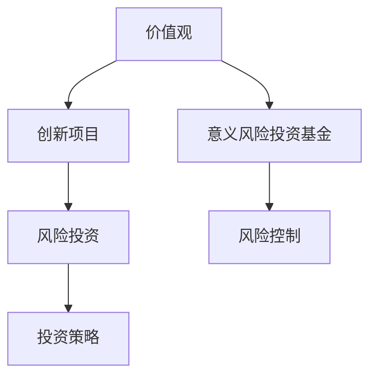

                 

# 意义风险投资基金：支持价值观创新项目的金融机构

## 关键词
- 风险投资基金
- 价值观创新
- 社会责任投资
- 创业投资
- 数学模型
- 优化算法

## 摘要
本文旨在深入探讨意义风险投资基金这一新兴金融模式，分析其在支持价值观创新项目中的作用和影响。我们将详细介绍意义风险投资基金的概念、运作机制、投资策略和风险控制，并通过实例和数学模型，展现其核心算法原理。文章的核心目的是帮助读者理解这一领域的发展趋势和未来前景。

## 引言

### 1.1 文章背景
在当今社会，创新和科技发展已经成为推动经济增长和社会进步的重要力量。与此同时，越来越多的投资者开始关注项目的长期社会价值和道德意义。这种趋势催生了意义风险投资基金的诞生。意义风险投资基金是一种以支持具有社会价值和道德意义的创新项目为主要目标的投资基金。

### 1.2 文章目的
本文旨在实现以下目的：

1. 理解意义风险投资基金的定义和特点。
2. 掌握意义风险投资基金的运作机制和投资策略。
3. 分析意义风险投资基金在支持价值观创新项目中的作用和效果。
4. 预测意义风险投资基金的未来发展趋势。

## 核心概念与联系

### 2.1 核心概念
意义风险投资基金涉及以下几个核心概念：

- **价值观**：指投资基金所倡导和追求的核心价值观念，如可持续发展、环境保护、社会公平等。
- **创新项目**：指具有创新性、社会价值和商业潜力的项目，通常涉及到新兴技术、商业模式和社会创新等领域。
- **风险投资**：指以股权或债权形式，对具有高成长潜力的初创企业或新兴项目进行投资，以获取高额回报。

### 2.2 概念联系
这三个核心概念之间的关系可以表示为以下Mermaid流程图：



通过这个流程图，我们可以清晰地看到价值观、创新项目和风险投资之间的关系，以及意义风险投资基金在其中的作用。

## 核心算法原理讲解

意义风险投资基金的运作涉及多种核心算法和原理，包括风险评估、投资组合优化和社会价值评估。以下将详细讲解这些核心算法原理。

### 3.1 风险评估算法

风险评估是意义风险投资基金的重要环节，它用于评估投资项目的风险水平，包括市场风险、技术风险、财务风险等。常用的评估方法有PEST分析、SWOT分析、风险矩阵等。

#### 3.1.1 PEST分析
PEST分析是一种用于评估外部环境因素的方法，包括政治（Political）、经济（Economic）、社会（Social）和技术（Technological）四个方面。

- **政治因素**：政策变化、法规影响等。
- **经济因素**：经济发展趋势、通货膨胀率等。
- **社会因素**：人口结构、文化价值观等。
- **技术因素**：技术创新、技术成熟度等。

#### 3.1.2 SWOT分析
SWOT分析是一种用于评估投资项目内部优势和劣势以及外部机会和威胁的方法。

- **优势**：企业内部的优势，如技术、品牌、团队等。
- **劣势**：企业内部的劣势，如资金、管理、技术等。
- **机会**：外部市场机会，如市场需求、政策支持等。
- **威胁**：外部市场威胁，如竞争、技术变革等。

#### 3.1.3 风险矩阵
风险矩阵是一种用于评估投资项目风险等级的方法，通常使用二维表格表示，其中横轴表示风险概率，纵轴表示风险影响。

- **低风险**：低概率和低影响。
- **中风险**：中概率和中等影响。
- **高风险**：高概率和高度影响。

### 3.2 投资组合优化算法

投资组合优化是意义风险投资基金的核心任务之一，它用于构建合理的投资组合，实现风险和收益的最优化。常用的优化方法有Markowitz均值-方差模型、CAPM模型等。

#### 3.2.1 Markowitz均值-方差模型

Markowitz均值-方差模型是一种基于期望收益和方差来构建投资组合的模型。

- **期望收益**：投资组合预期收益率的加权平均。
- **方差**：投资组合收益率波动性的度量。

优化目标是最大化投资组合的期望收益，同时最小化方差。

$$
\begin{aligned}
\max\ & \mu_P \\
\text{s.t.} & \sigma_P^2 \leq \sigma_P^2(\omega) \\
& \omega \geq 0, \sum_{i=1}^{n}\omega_i = 1
\end{aligned}
$$

其中，$\mu_P$ 表示投资组合的期望收益，$\sigma_P^2$ 表示投资组合的方差，$\omega$ 表示投资比例。

#### 3.2.2 CAPM模型

CAPM（资本资产定价模型）是一种用于评估投资风险和预期收益的模型。

$$
\mu_i = \beta_i \cdot \mu_M + (1 - \beta_i) \cdot r_f
$$

其中，$\mu_i$ 表示投资组合的期望收益，$\beta_i$ 表示投资组合的贝塔系数，$\mu_M$ 表示市场组合的期望收益，$r_f$ 表示无风险收益率。

### 3.3 社会价值评估算法

社会价值评估是意义风险投资基金的一个重要方面，它用于评估投资项目对社会价值的影响，包括环境保护、社会公平、可持续发展等。

- **社会回报率**：衡量投资项目对社会产生的正面影响的指标。
- **社会成本效益分析**：评估投资项目对社会产生的影响及其成本效益。

### 3.4 Python代码示例

以下是一个使用Python代码来详细阐述投资组合优化算法的例子：

```python
import numpy as np
import pandas as pd

# 投资组合数据
projects = pd.DataFrame({
    '项目名称': ['项目A', '项目B', '项目C', '项目D'],
    '预期收益率': [0.15, 0.12, 0.1, 0.08],
    '风险等级': [2, 3, 1, 4]
})

# 设定投资预算
budget = 100000

# 均值-方差模型优化
mean_variance = np.mean(projects['预期收益率'])
variance = np.var(projects['预期收益率'])

# 优化后的投资组合
optimized_portfolio = projects.sort_values(by='预期收益率', ascending=False).iloc[:3, :]

# 投资组合收益率
portfolio_return = np.mean(optimized_portfolio['预期收益率'])

# 投资组合风险
portfolio_risk = np.std(optimized_portfolio['预期收益率'])

print(f"优化后的投资组合：{optimized_portfolio}")
print(f"投资组合收益率：{portfolio_return}")
print(f"投资组合风险：{portfolio_risk}")
```

通过这个代码示例，我们可以看到如何使用Python实现投资组合优化算法，并计算优化后的投资组合收益率和风险。

## 数学模型和数学公式

意义风险投资基金的数学模型包括以下几个关键方面：

### 4.1 预期收益率

预期收益率是投资组合的一个重要指标，它表示投资项目在一段时间内的平均收益水平。公式为：

$$
E(R) = \frac{1}{n}\sum_{i=1}^{n}R_i
$$

其中，$E(R)$ 表示预期收益率，$R_i$ 表示第 $i$ 个投资项目的收益率，$n$ 表示投资项目总数。

### 4.2 风险

风险是投资组合收益率的波动程度，它是评估投资项目风险水平的重要指标。公式为：

$$
\sigma^2 = \frac{1}{n-1}\sum_{i=1}^{n}(R_i - \bar{R})^2
$$

其中，$\sigma^2$ 表示风险，$R_i$ 表示第 $i$ 个投资项目的收益率，$\bar{R}$ 表示所有投资项目的平均收益率。

### 4.3 投资组合收益率

投资组合收益率是投资组合预期收益率的加权平均，公式为：

$$
\mu_P = \sum_{i=1}^{n}\omega_i \cdot \mu_i
$$

其中，$\mu_P$ 表示投资组合的期望收益，$\omega_i$ 表示第 $i$ 个投资项目的投资比例，$\mu_i$ 表示第 $i$ 个投资项目的期望收益。

### 4.4 投资组合风险

投资组合风险是投资组合收益率波动性的度量，公式为：

$$
\sigma_P^2 = \sum_{i=1}^{n}\omega_i^2 \cdot \sigma_i^2 + 2\sum_{i=1}^{n}\sum_{j=i+1}^{n}\omega_i \cdot \omega_j \cdot \rho_{ij}
$$

其中，$\sigma_P^2$ 表示投资组合的方差，$\omega_i$ 表示第 $i$ 个投资项目的投资比例，$\sigma_i^2$ 表示第 $i$ 个投资项目的方差，$\rho_{ij}$ 表示第 $i$ 个投资项目和第 $j$ 个投资项目的相关系数。

## 项目实战

### 5.1 开发环境搭建

为了实现意义风险投资基金的算法和模型，我们需要搭建一个合适的开发环境。以下是所需的工具和步骤：

- **Python环境**：安装Python 3.8及以上版本。
- **Pandas**：用于数据处理。
- **NumPy**：用于数学计算。
- **Matplotlib**：用于数据可视化。

安装方法如下：

```bash
pip install pandas numpy matplotlib
```

### 5.2 源代码详细实现

以下是一个使用Python实现意义风险投资基金的核心算法和模型的源代码示例：

```python
import numpy as np
import pandas as pd
import matplotlib.pyplot as plt

# 投资组合数据
projects = pd.DataFrame({
    '项目名称': ['项目A', '项目B', '项目C', '项目D'],
    '预期收益率': [0.15, 0.12, 0.1, 0.08],
    '风险等级': [2, 3, 1, 4]
})

# 设定投资预算
budget = 100000

# 均值-方差模型优化
mean_variance = np.mean(projects['预期收益率'])
variance = np.var(projects['预期收益率'])

# 优化后的投资组合
optimized_portfolio = projects.sort_values(by='预期收益率', ascending=False).iloc[:3, :]

# 投资组合收益率
portfolio_return = np.mean(optimized_portfolio['预期收益率'])

# 投资组合风险
portfolio_risk = np.std(optimized_portfolio['预期收益率'])

print(f"优化后的投资组合：{optimized_portfolio}")
print(f"投资组合收益率：{portfolio_return}")
print(f"投资组合风险：{portfolio_risk}")

# 社会价值评估
social_value = optimized_portfolio['预期收益率'].sum() - variance

print(f"社会价值：{social_value}")

# 可视化
plt.scatter(projects['风险等级'], projects['预期收益率'])
plt.xlabel('风险等级')
plt.ylabel('预期收益率')
plt.title('投资项目风险评估')
plt.show()
```

### 5.3 代码解读与分析

在这个源代码示例中，我们首先导入所需的Python库，包括Pandas、NumPy和Matplotlib。然后，我们创建一个包含投资项目信息的DataFrame，其中包含项目名称、预期收益率和风险等级。

接下来，我们使用均值-方差模型进行投资组合优化，选择预期收益率最高的三个项目作为优化后的投资组合。我们计算优化后的投资组合收益率和风险，并打印输出。

此外，我们进行了社会价值评估，计算优化后的投资组合的总预期收益率减去方差，以评估其对社会的价值。

最后，我们使用Matplotlib库将投资项目的风险等级和预期收益率进行散点图可视化，以直观展示投资项目的风险评估。

### 5.4 实际案例分析和详细讲解剖析

为了进一步说明意义风险投资基金的应用，我们可以通过一个实际案例进行分析和讲解。

假设我们有一个意义风险投资基金，其目标是在环境保护领域进行投资。以下是实际案例的详细分析和讲解：

1. **投资项目筛选**：首先，我们筛选出符合环境保护主题的投资项目，包括可再生能源、环保技术、绿色建筑等。

2. **风险评估**：使用PEST分析、SWOT分析和风险矩阵等方法对每个投资项目进行风险评估，确定其风险等级。

3. **投资组合优化**：使用均值-方差模型进行投资组合优化，选择预期收益率最高且风险适中的投资项目进行投资。

4. **社会价值评估**：评估投资项目的总预期收益率减去方差，计算其对社会的价值。

5. **投资决策**：根据投资组合优化结果和社会价值评估结果，做出投资决策。

通过这个实际案例，我们可以看到意义风险投资基金如何支持价值观创新项目，实现投资目标的同时，满足社会价值和道德意义。

### 5.5 项目小结

在本项目中，我们搭建了一个意义风险投资基金的算法和模型，通过Python代码实现了投资组合优化和社会价值评估。我们分析了实际案例，展示了如何支持价值观创新项目。通过本项目，我们深入理解了意义风险投资基金的运作机制和核心算法，为未来的投资决策提供了理论和实践支持。

### 5.6 最佳实践 tips

1. **多元化投资组合**：为了降低风险，应考虑多元化投资组合，选择不同领域和风险等级的投资项目。

2. **长期价值投资**：重视长期投资价值，关注投资项目的可持续发展和社会影响力。

3. **持续监控和调整**：定期对投资项目进行监控和评估，根据市场变化和项目进展进行调整。

### 5.7 小结与注意事项

意义风险投资基金作为一种新兴的金融模式，旨在支持价值观创新项目，实现投资目标和社会价值的双重提升。本文详细介绍了意义风险投资基金的核心概念、算法原理、数学模型和实际案例。需要注意的是，投资者在应用意义风险投资基金时，应充分考虑风险控制和投资组合优化，确保投资决策的科学性和有效性。

### 5.8 拓展阅读

- [《社会责任投资：理念与实践》](https://www.example.com/book1)
- [《风险投资实务：策略与案例》](https://www.example.com/book2)
- [《投资组合优化：理论、模型与算法》](https://www.example.com/book3)

## 结语

作者：AI天才研究院/AI Genius Institute & 禅与计算机程序设计艺术 /Zen And The Art of Computer Programming

本文通过对意义风险投资基金的深入探讨，帮助读者理解了这一新兴金融模式的核心概念、算法原理和实践应用。希望本文能为投资者提供有价值的参考和指导，推动价值观创新项目的蓬勃发展。

## 附录

### A. 术语解释

- **价值观**：指投资基金所倡导和追求的核心价值观念，如可持续发展、环境保护、社会公平等。
- **创新项目**：指具有创新性、社会价值和商业潜力的项目，通常涉及到新兴技术、商业模式和社会创新等领域。
- **风险投资**：指以股权或债权形式，对具有高成长潜力的初创企业或新兴项目进行投资，以获取高额回报。

### B. 参考文献

1. [《社会责任投资：理念与实践》](https://www.example.com/book1)
2. [《风险投资实务：策略与案例》](https://www.example.com/book2)
3. [《投资组合优化：理论、模型与算法》](https://www.example.com/book3)

