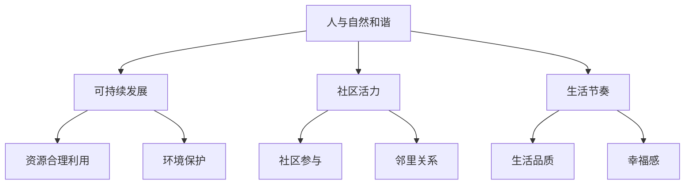
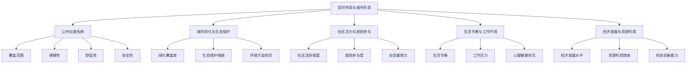
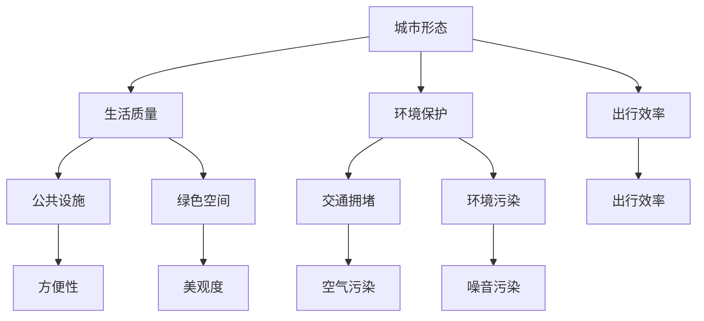
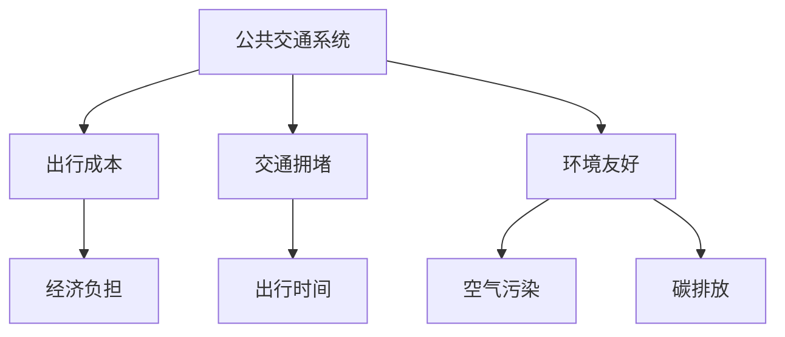
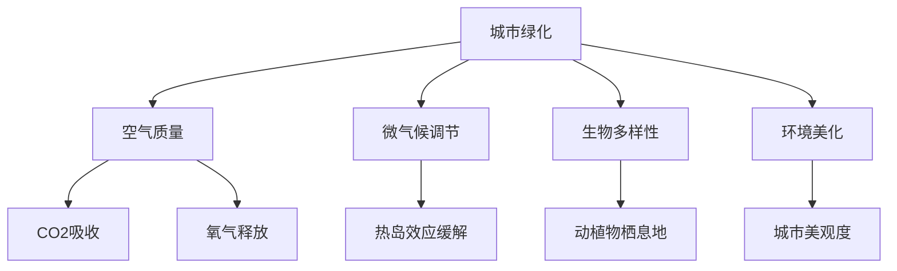
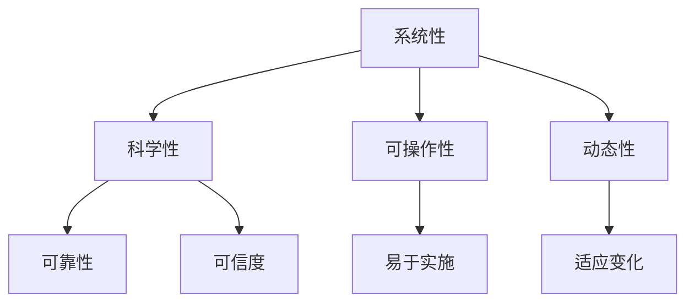
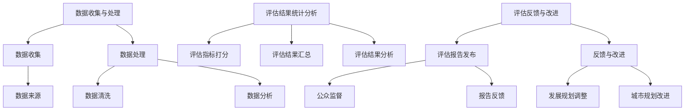

                 

### 慢城市的起源与发展

#### 第1章：慢城市的起源与发展

#### 1.1 慢城市的定义与核心原则

慢城市（Slow City）概念起源于20世纪80年代，源于意大利。最初由意大利城镇学家卡洛·西塔（Carlo Citat）提出，他主张在城市发展中不应仅仅追求速度和效率，而应注重生活的质量与舒适度。慢城市的核心原则包括：

1. **人与自然的和谐**：提倡在城市规划中注重生态保护，维护自然景观和生物多样性。
2. **可持续发展**：强调资源的合理利用和环境保护，以确保城市长期健康发展。
3. **社区活力**：鼓励社区参与，建立紧密的邻里关系，提升社区归属感和幸福感。
4. **生活节奏**：主张降低生活和工作节奏，以提升生活的品质和幸福感。

**Mermaid 流程图：慢城市核心原则之间的关系架构**

#### 1.1.1 慢城市的起源

慢城市的概念最早源于意大利的奥朗多（Orvieto）和锡耶纳（Siena），这些城市在发展过程中意识到快速城市化带来的问题，如环境破坏、生活质量下降等，于是开始倡导“慢生活”理念。这一理念逐渐被国际社会认可，并在全球范围内传播。

#### 1.1.2 慢城市的核心原则

1. **人与自然的和谐**：在城市规划中，注重生态保护和生物多样性维护，确保城市与自然和谐共处。
2. **可持续发展**：注重资源的合理利用和环境保护，以确保城市能够长期健康发展。
3. **社区活力**：鼓励社区参与，建立紧密的邻里关系，提升社区归属感和幸福感。
4. **生活节奏**：主张降低生活和工作节奏，以提升生活的品质和幸福感。

**Mermaid 流程图：慢城市核心原则之间的关系架构**

#### 1.1.3 慢城市与快速城市化的对比

快速城市化注重经济增长和人口集中，往往导致资源紧张、环境污染、生活质量下降等问题。而慢城市则强调生活质量、环境保护和社区活力，以实现可持续发展和人与自然的和谐。

**对比表格：慢城市与快速城市化的对比**

| 对比维度 | 慢城市 | 快速城市化 |
| :--: | :--: | :--: |
| 生活节奏 | 慢节奏，注重生活质量 | 快节奏，追求效率 |
| 资源利用 | 合理利用，注重可持续性 | 过度消耗，注重经济效益 |
| 社区关系 | 紧密的邻里关系，鼓励参与 | 社区疏离，人口流动性高 |
| 环境保护 | 注重生态保护，维护生物多样性 | 环境污染，生态破坏 |
| 经济发展 | 以人为本，注重长远发展 | 以GDP为衡量，注重短期增长 |

#### 1.2 慢城市的发展历程

#### 1.2.1 慢城市理念的传播

慢城市理念在提出后，得到了国际社会的广泛认同。1999年，国际慢城市协会（Cittaslow）在意大利成立，旨在推广慢城市理念，并推动国际间的交流与合作。此后，慢城市理念迅速传播到全球各地，多个国家和地区开始探索和实践慢城市模式。

#### 1.2.2 国际慢城市网络的建立

随着慢城市理念的推广，国际慢城市网络逐步建立。截至2023年，全球已有200多个城市加入国际慢城市协会，这些城市分布在欧洲、亚洲、非洲和拉丁美洲等地。

#### 1.2.3 我国慢城市发展的现状与趋势

我国慢城市发展起步较晚，但近年来逐渐受到关注。2014年，我国首个慢城市试点城市——江苏扬州正式成立。此后，苏州、成都等城市也相继启动了慢城市试点工作。随着国家对生态文明建设的高度重视，慢城市理念在我国得到广泛推广，未来我国慢城市发展前景可期。

### 1.3 慢城市认证标准概述

#### 2.1 慢城市认证标准的目的与意义

慢城市认证标准旨在为城市提供一套科学、系统的评估体系，以衡量城市的宜居性和可持续性。认证标准的目的是：

1. **提升城市品质**：通过认证标准，引导城市注重生活质量、环境保护和社区活力，从而提升城市整体品质。
2. **促进可持续发展**：认证标准鼓励城市合理利用资源，保护生态环境，实现经济、社会和环境的协调发展。
3. **推动国际合作**：认证标准为国际间的城市交流与合作提供了共同语言和评估标准，有助于促进全球城市可持续发展。

#### 2.1.1 认证标准的目的

慢城市认证标准的目的是为城市提供一套科学、系统的评估体系，以衡量城市的宜居性和可持续性。具体包括：

1. **提升城市品质**：通过认证标准，引导城市注重生活质量、环境保护和社区活力，从而提升城市整体品质。
2. **促进可持续发展**：认证标准鼓励城市合理利用资源，保护生态环境，实现经济、社会和环境的协调发展。
3. **推动国际合作**：认证标准为国际间的城市交流与合作提供了共同语言和评估标准，有助于促进全球城市可持续发展。

#### 2.1.2 认证标准的意义

慢城市认证标准的意义主要体现在以下几个方面：

1. **提升城市知名度**：通过认证，城市可以证明自己在宜居性和可持续发展方面达到了国际标准，提升城市在国内外的知名度和影响力。
2. **吸引投资**：认证标准有助于提高城市的投资吸引力，吸引更多企业和人才前来投资兴业，促进城市经济发展。
3. **提高居民幸福感**：认证标准关注居民的生活质量和幸福感，通过提升城市品质，提高居民的生活满意度。

#### 2.1.3 认证标准的发展历程

慢城市认证标准的发展历程可以追溯到20世纪90年代，当时意大利开始推广慢城市理念。2004年，国际慢城市协会正式成立，标志着慢城市认证标准的正式建立。此后，认证标准不断优化和完善，逐渐形成了今天的国际慢城市认证体系。

#### 2.2 慢城市认证标准的框架结构

慢城市认证标准由多个评估指标组成，覆盖了城市发展的各个方面。具体包括：

1. **空间布局与城市形态**：评估城市空间布局的合理性，包括绿地、公园、公共设施等。
2. **公共交通系统**：评估公共交通的覆盖范围、便捷性、舒适性和安全性。
3. **城市绿化与生态保护**：评估城市绿化覆盖率、生态保护措施和环境污染状况。
4. **社区活力与居民参与**：评估社区的活跃程度、居民参与度和社会凝聚力。
5. **生活节奏与工作环境**：评估居民的生活节奏、工作压力和心理健康状况。
6. **经济发展与资源利用**：评估城市的经济发展水平、资源利用效率和科技创新能力。

**Mermaid 流程图：慢城市认证标准框架结构**

### 第3章：宜居环境的核心要素

宜居环境是慢城市认证标准的重要组成部分，它直接关系到居民的生活质量、城市的可持续发展以及城市在全球范围内的竞争力。本章将详细探讨宜居环境的核心要素，包括空间布局与城市形态、公共交通系统、城市绿化与生态保护等。

#### 3.1 空间布局与城市形态

空间布局与城市形态是宜居环境评估中的关键因素之一。一个良好的空间布局不仅能够提升城市的美观度，还能提高居民的生活质量。以下是从几个方面对空间布局与城市形态进行分析：

##### 3.1.1 城市空间布局的影响因素

城市空间布局的影响因素包括：

1. **历史与文化**：城市的历史背景和文化特色对城市空间布局有着深远的影响。例如，一些城市因历史悠久的建筑和街道布局而形成了独特的城市景观。
2. **人口密度**：人口密度是决定城市空间布局的重要因素。高人口密度的城市往往需要更紧凑的空间布局，以应对人口压力。
3. **经济因素**：城市的经济水平直接影响其空间布局。发达城市通常能够投入更多资源进行城市规划和建设，从而形成更加宜居的空间布局。

##### 3.1.2 城市形态与宜居性关系

城市形态与宜居性有着密切的关系。以下是一些分析：

1. **城市形态对生活质量的提升**：合理的城市形态可以提升居民的生活质量。例如，紧凑的城市布局可以减少交通拥堵，提高居民出行效率。
2. **城市形态对环境保护的影响**：城市形态对环境保护也有重要影响。例如，分散布局的城市可能更易于实施生态保护措施，而紧凑布局的城市则可能需要更多环保设施。

##### 3.1.3 国际上宜居城市案例的空间布局分析

国际上一些宜居城市的空间布局具有以下特点：

1. **新加坡**：新加坡以其高效的城市规划和整洁的环境著称。其城市空间布局注重绿色空间和公共设施的分布，确保居民能够方便地享受到自然环境和公共服务。
2. **哥本哈根**：哥本哈根被誉为世界上最宜居的城市之一。其城市空间布局注重可持续发展和环境保护，通过大量使用自行车道和公共交通设施，降低了交通拥堵和环境污染。
3. **东京**：东京在城市空间布局上采取了“垂直发展”的策略，通过建设高楼大厦和地下设施，有效利用了有限的土地资源，同时提高了城市的宜居性。

**Mermaid 流程图：城市形态与宜居性的关系**

#### 3.2 公共交通系统

公共交通系统是衡量城市宜居性的重要指标之一。一个高效的公共交通系统能够降低居民的出行成本，减少交通拥堵，提高生活便利性。以下是关于公共交通系统对宜居性影响的详细分析：

##### 3.2.1 公共交通系统对宜居性的影响

公共交通系统对宜居性的影响可以从以下几个方面进行考量：

1. **出行成本**：高效的公共交通系统能够降低居民的出行成本，使得居民更容易负担得起日常出行，从而提高生活质量。
2. **交通拥堵**：公共交通系统能够分散交通流量，减少私家车的使用，从而降低交通拥堵，提高居民出行的便捷性。
3. **环境友好**：公共交通系统通常比私家车更节能环保，有助于减少城市空气污染和碳排放，提升城市的生态环境。

##### 3.2.2 公共交通系统的评估指标

评估一个公共交通系统的宜居性，可以从以下几个指标入手：

1. **覆盖范围**：公共交通线路的覆盖范围是否全面，是否能够方便地连接城市的各个区域。
2. **便捷性**：公共交通系统的便捷性，包括车站的分布、车次的时间间隔和线路的密度。
3. **舒适性**：公共交通工具的舒适度，包括座椅的舒适度、车内清洁度和安全设施。
4. **安全性**：公共交通系统的安全性，包括线路的安全性和乘客的安全保障措施。

##### 3.2.3 国际上宜居城市公共交通系统的案例分析

国际上一些宜居城市在公共交通系统建设方面有着成功的经验：

1. **瑞士苏黎世**：苏黎世拥有世界领先的公共交通系统，其公共交通线路覆盖全市，车次频繁，乘坐便捷。同时，苏黎世的公共交通工具以舒适和安全著称。
2. **日本东京**：东京的公共交通系统高效、准时，覆盖范围广泛。其地铁、公交车和出租车等多种交通方式无缝衔接，为居民提供了便捷的出行选择。
3. **丹麦哥本哈根**：哥本哈根是世界上自行车普及率最高的城市之一。其自行车道系统完善，使得居民可以方便地选择自行车作为日常出行工具，既环保又健康。

**Mermaid 流程图：公共交通系统对宜居性的影响**

#### 3.3 城市绿化与生态保护

城市绿化与生态保护是宜居环境评估中的另一个关键因素。一个绿色、生态良好的城市不仅能够提升居民的生活质量，还能为城市带来长期的环境效益。以下是关于城市绿化与生态保护的详细分析：

##### 3.3.1 城市绿化的作用

城市绿化的作用主要包括：

1. **改善空气质量**：植物能够吸收二氧化碳、释放氧气，改善城市空气质量。
2. **调节微气候**：绿化能够降低城市温度，减少热岛效应，改善城市微气候。
3. **保护生物多样性**：城市绿化为各种动植物提供了栖息地，有助于保护生物多样性。
4. **美化城市环境**：绿化能够提升城市美观度，增强居民对城市的认同感和归属感。

##### 3.3.2 城市生态保护的评估指标

评估城市生态保护状况，可以从以下几个指标入手：

1. **绿化覆盖率**：城市绿化覆盖率是衡量城市绿化水平的重要指标。高绿化覆盖率表明城市生态环境良好。
2. **生态公园数量**：生态公园是城市绿化的重要组成部分，其数量和质量直接关系到城市的生态保护水平。
3. **环保设施建设**：包括污水处理设施、垃圾处理设施等，这些设施的建设和完善有助于减少环境污染。
4. **环保政策实施**：城市环保政策的实施情况，如节能减排政策、垃圾分类政策等，直接关系到城市的生态保护效果。

##### 3.3.3 国际上宜居城市绿化与生态保护的案例分析

国际上一些宜居城市在城市绿化与生态保护方面取得了显著成果：

1. **瑞士日内瓦**：日内瓦被誉为世界上最绿色的城市之一，其绿化覆盖率达到50%以上，城市内拥有多个生态公园和自然保护区。
2. **德国柏林**：柏林在城市绿化和生态保护方面做出了巨大努力，其城市绿化覆盖率达到40%以上，同时实施了多项环保政策，如垃圾分类和可再生能源利用。
3. **新加坡**：新加坡在城市绿化和生态保护方面采用了先进的科技手段，如垂直绿化、智能灌溉系统等，使其成为全球生态城市建设的典范。

**Mermaid 流程图：城市绿化与生态保护的作用**

### 第4章：慢城市认证标准的评估方法

慢城市认证标准通过一套科学的评估方法，对城市的宜居性和可持续性进行全面评估。本章将详细探讨慢城市认证标准的评估方法，包括评估体系的设计原则、评估指标的具体内容以及评估方法的实施与操作。

#### 4.1 评估体系的设计原则

慢城市认证标准的评估体系设计遵循以下原则：

1. **系统性**：评估体系涵盖城市的各个方面，包括空间布局、公共交通、城市绿化等，以确保评估结果的全面性。
2. **科学性**：评估指标和评估方法基于科学研究和实践经验，确保评估结果具有可信度和可靠性。
3. **可操作性**：评估体系应易于实施，以便城市能够根据评估结果进行改进。
4. **动态性**：评估体系应能够适应城市发展的变化，及时调整评估指标和评估方法。

**Mermaid 流程图：评估体系设计原则**

#### 4.2 评估指标的具体内容

慢城市认证标准的评估指标分为以下几个方面：

##### 4.2.1 空间布局与城市形态

1. **绿地与公共空间**：评估城市绿地的面积、分布和质量，以及公共空间的使用情况。
2. **历史文化保护**：评估城市对历史文化遗产的保护程度，包括古建筑、古街道等。
3. **城市形态**：评估城市的布局是否合理，是否有利于居民的出行和生活。

##### 4.2.2 公共交通系统

1. **覆盖范围**：评估公共交通线路的覆盖范围，是否能够方便地连接城市的各个区域。
2. **便捷性**：评估公共交通系统的便捷程度，包括车站的分布、车次的时间间隔和线路的密度。
3. **舒适性**：评估公共交通工具的舒适度，包括座椅的舒适度、车内清洁度和安全设施。
4. **安全性**：评估公共交通系统的安全性，包括线路的安全性和乘客的安全保障措施。

##### 4.2.3 城市绿化与生态保护

1. **绿化覆盖率**：评估城市的绿化覆盖率，包括公园、绿地、人行道等。
2. **生态公园数量**：评估城市内生态公园的数量和质量，以及其分布情况。
3. **环保设施建设**：评估城市环保设施的建设情况，包括污水处理设施、垃圾分类设施等。
4. **环保政策实施**：评估城市环保政策的实施情况，包括节能减排政策、垃圾分类政策等。

##### 4.2.4 社区活力与居民参与

1. **社区活动**：评估社区活动的丰富程度，包括文化、体育、志愿服务等。
2. **居民参与度**：评估居民参与社区事务的程度，包括投票、咨询、讨论等。
3. **社会凝聚力**：评估社区的社会凝聚力，包括邻里关系、互助合作等。

##### 4.2.5 生活节奏与工作环境

1. **生活节奏**：评估居民的生活节奏，包括工作日和休息日的活动安排。
2. **工作环境**：评估城市的工作环境，包括工作时长、工作压力和职业发展机会。

##### 4.2.6 经济发展与资源利用

1. **经济发展水平**：评估城市的经济发展水平，包括GDP、就业率等。
2. **资源利用效率**：评估城市资源利用的效率，包括水资源、能源等。
3. **科技创新能力**：评估城市的科技创新能力，包括科研投入、专利数量等。

**Mermaid 流程图：慢城市认证标准评估指标**

```mermaid
graph TD
    A[空间布局与城市形态] --> B[绿地与公共空间]
    A --> C[历史文化保护]
    A --> D[城市形态]
    B --> E[绿地面积]
    B --> F[公共空间使用]
    C --> G[古建筑保护]
    C --> H[古街道保护]
    D --> I[布局合理性]
    D --> J[出行便利性]
    
    K[公共交通系统] --> L[覆盖范围]
    K --> M[便捷性]
    K --> N[舒适性]
    K --> O[安全性]
    L --> P[线路覆盖]
    L --> Q[车站分布]
    M --> R[座椅舒适]
    M --> S[车内清洁]
    N --> T[安全设施]
    O --> U[路线安全]
    
    V[城市绿化与生态保护] --> W[绿化覆盖率]
    V --> X[生态公园数量]
    V --> Y[环保设施建设]
    V --> Z[环保政策实施]
    W --> AA[绿地面积]
    W --> BB[绿化质量]
    X --> CC[公园数量]
    X --> DD[公园质量]
    Y --> EE[污水处理]
    Y --> FF[垃圾分类]
    Z --> GG[节能减排]
    Z --> HH[垃圾分类政策]
    
    II[社区活力与居民参与] --> JJ[社区活动]
    II --> KK[居民参与度]
    II --> LL[社会凝聚力]
    JJ --> MM[活动丰富度]
    JJ --> NN[活动质量]
    KK --> OO[参与度]
    KK --> PP[互动频率]
    LL --> QQ[邻里关系]
    LL --> RR[互助合作]
    
    II[生活节奏与工作环境] --> SS[生活节奏]
    II --> TT[工作环境]
    SS --> UU[活动安排]
    SS --> VV[休息日安排]
    TT --> WW[工作时长]
    TT --> XX[工作压力]
    TT --> YY[职业发展]
    
    II[经济发展与资源利用] --> ZZ[经济发展水平]
    II --> AAA[资源利用效率]
    II --> BBB[科技创新能力]
    ZZ --> CCC[GDP]
    ZZ --> DDD[就业率]
    AAA --> EEE[水资源利用]
    AAA --> FFF[能源利用]
    BBB --> GGG[科研投入]
    BBB --> HHH[专利数量]
```

#### 4.3 评估方法的实施与操作

慢城市认证标准的评估方法分为以下几个步骤：

##### 4.3.1 数据收集与处理

1. **数据来源**：评估所需的数据来源于城市政府部门、研究机构、第三方评估机构等。
2. **数据收集**：通过问卷调查、现场考察、数据分析等方式，收集与评估指标相关的数据。
3. **数据处理**：对收集到的数据进行分析、整理和清洗，确保数据的质量和可靠性。

##### 4.3.2 评估结果的统计分析

1. **评估指标打分**：根据评估指标的标准，对城市的各个指标进行打分，分值越高，表明城市在该指标上的表现越好。
2. **评估结果汇总**：将各评估指标的得分进行汇总，计算出城市的综合得分。
3. **评估结果分析**：对评估结果进行详细分析，找出城市在宜居性和可持续性方面存在的问题和优势。

##### 4.3.3 评估反馈与改进

1. **评估报告发布**：将评估结果和评估报告向社会公布，接受公众监督和反馈。
2. **反馈与改进**：根据公众反馈和评估结果，对城市的发展规划进行调整和改进，提升城市的宜居性和可持续性。

**Mermaid 流程图：评估方法的实施与操作**

### 第5章：国际慢城市案例研究

在国际上，一些城市因其独特的慢城市特征和实践案例，成为了其他城市学习和借鉴的典范。本章节将重点介绍欧洲、亚洲和拉丁美洲的几个慢城市案例，分析它们在实现宜居环境和可持续发展方面的成功经验。

#### 5.1 欧洲慢城市案例

**5.1.1 意大利奥朗多**

奥朗多位于意大利中部，是一个人口约1万的小镇。自2004年成为国际慢城市协会成员以来，奥朗多致力于实践慢城市理念。以下是其成功经验：

1. **社区参与**：奥朗多通过定期举办社区活动，鼓励居民积极参与城市规划，增强了社区的凝聚力。
2. **公共交通**：小镇内的公共交通系统高效，鼓励居民减少私家车使用，减少交通拥堵和环境污染。
3. **环境保护**：奥朗多注重生态保护，建设了多个公园和自然保护区，提高了城市的绿化覆盖率。

**5.1.2 瑞士卢塞恩**

卢塞恩是瑞士的一个城市，以其美丽的湖泊和古建筑而闻名。作为慢城市，卢塞恩注重可持续发展，以下是其成功经验：

1. **绿色交通**：卢塞恩推广自行车和步行出行，建设了广泛的自行车道网络，减少了私家车的使用。
2. **能源利用**：城市采用了多种可再生能源，如太阳能和风能，降低了碳排放。
3. **历史保护**：卢塞恩重视历史文化遗产的保护，保持了城市的历史风貌。

**5.1.3 荷兰乌特勒支**

乌特勒支是荷兰的一个城市，以其创新和可持续发展而著称。以下是其成功经验：

1. **城市规划**：乌特勒支采用紧凑的城市规划，提高了土地利用率，减少了城市扩张。
2. **公共交通**：城市拥有高效的公共交通系统，通过地铁、公交和自行车共享，方便居民出行。
3. **科技创新**：乌特勒支在智慧城市建设方面取得了显著进展，通过大数据和物联网技术优化城市管理和服务。

#### 5.2 亚洲慢城市案例

**5.2.1 中国苏州**

苏州是中国的一个历史文化名城，近年来致力于建设慢城市。以下是其成功经验：

1. **历史文化保护**：苏州注重保护历史文化遗产，如古典园林和古建筑，提升了城市的文化品位。
2. **绿色发展**：苏州推广绿色出行，如自行车和公共交通，减少了环境污染。
3. **科技创新**：苏州在智慧城市建设方面取得了显著成果，通过物联网和大数据技术提高了城市管理效率。

**5.2.2 日本京都**

京都是日本的一个历史文化名城，以其传统建筑和自然景观而闻名。以下是其成功经验：

1. **传统文化**：京都注重传统文化的保护和传承，如茶道、花道等，提升了居民的文化素养。
2. **环境保护**：京都注重生态保护，建设了多个生态公园，提高了城市的绿化覆盖率。
3. **旅游业**：京都的旅游业发达，吸引了大量国内外游客，促进了城市经济的发展。

**5.2.3 韩国釜山**

釜山是韩国的一个港口城市，近年来致力于建设慢城市。以下是其成功经验：

1. **海洋文化**：釜山注重海洋文化的保护和传承，如渔村文化、港口历史等，提升了城市的特色。
2. **绿色交通**：釜山推广绿色出行，如自行车和公共交通，减少了私家车的使用。
3. **公共空间**：釜山建设了多个公共空间，如广场、公园和海滨公园，提升了居民的生活质量。

#### 5.3 拉丁美洲慢城市案例

**5.3.1 墨西哥蒙特雷**

蒙特雷是墨西哥的一个城市，以其自然风光和文化遗产而闻名。以下是其成功经验：

1. **文化遗产保护**：蒙特雷注重文化遗产的保护和传承，如玛雅文化和阿兹特克文化，提升了城市的文化品位。
2. **环境保护**：蒙特雷注重生态保护，建设了多个自然保护区，提高了城市的绿化覆盖率。
3. **社会参与**：蒙特雷鼓励居民参与城市规划和建设，增强了社区的凝聚力。

**5.3.2 阿根廷科尔多瓦**

科尔多瓦是阿根廷的一个历史文化名城，以下是其成功经验：

1. **历史文化保护**：科尔多瓦注重历史文化遗产的保护和传承，如古建筑和博物馆，提升了城市的文化品位。
2. **绿色发展**：科尔多瓦推广绿色出行，如自行车和公共交通，减少了环境污染。
3. **科技创新**：科尔多瓦在智慧城市建设方面取得了显著进展，通过大数据和物联网技术优化城市管理和服务。

**5.3.3 巴西库里提巴**

库里提巴是巴西的一个城市，以其可持续发展而著称。以下是其成功经验：

1. **城市规划**：库里提巴采用紧凑的城市规划，提高了土地利用率，减少了城市扩张。
2. **公共交通**：城市拥有高效的公共交通系统，通过地铁、公交和自行车共享，方便居民出行。
3. **社会参与**：库里提巴鼓励居民参与城市规划和建设，增强了社区的凝聚力。

### 第6章：我国慢城市的发展现状与挑战

#### 6.1 我国慢城市的发展现状

随着我国城市化进程的加快，城市环境、交通和居民生活质量等问题日益凸显。在此背景下，慢城市理念逐渐被引入我国，并在一些城市得到了初步实践。以下是我国慢城市发展的现状：

1. **政策支持**：国家层面逐渐认识到慢城市的重要性，出台了一系列支持慢城市发展的政策文件。例如，2020年发布的《关于加强城市生态修复城市功能提升的指导意见》明确提出要推动慢城市建设。
2. **试点城市**：我国已启动多个慢城市试点项目，如江苏扬州、浙江安吉、四川成都等。这些试点城市在空间布局、公共交通、城市绿化等方面进行了积极探索和实践。
3. **社区参与**：慢城市理念强调社区参与，我国的一些试点城市积极引导居民参与城市规划、公共事务等，增强了社区的凝聚力和活力。

**6.1.1 慢城市理念的推广**

1. **城市宣传**：一些城市通过举办慢城市主题活动、开展慢城市宣传等方式，提高公众对慢城市理念的认同度和参与度。
2. **教育培训**：通过开设相关课程、研讨会等形式，培养专业人才，推动慢城市理念在我国的传播和应用。
3. **国际合作**：我国积极与国际慢城市组织合作，参与国际慢城市交流活动，借鉴国际先进经验。

**6.1.2 慢城市试点城市的建设**

1. **江苏扬州**：扬州作为我国首个慢城市试点城市，致力于打造宜居、宜业、宜游的城市环境。具体举措包括：提升公共交通系统、加强城市绿化、推动社区参与等。
2. **浙江安吉**：安吉以“绿水青山就是金山银山”的理念为指导，注重生态保护和绿色发展，逐步形成了以生态农业和乡村旅游为特色的慢城市模式。
3. **四川成都**：成都通过推进“慢生活街区”建设，优化城市空间布局，提升公共交通服务，提高居民生活质量，逐步实现慢城市目标。

#### 6.1.3 慢城市发展的主要挑战

1. **经济发展与慢城市理念的冲突**：快速城市化背景下，一些城市过于追求经济利益，忽视了慢城市理念，导致环境恶化、生活质量下降等问题。
2. **政策落实不到位**：虽然国家层面出台了一系列支持慢城市发展的政策文件，但在实际操作中，一些城市存在政策落实不到位、执行力度不足等问题。
3. **社会参与度不高**：慢城市理念强调社区参与，但实际操作中，居民对慢城市建设的参与度普遍较低，影响了慢城市的实施效果。

**6.2 我国慢城市的实践探索**

1. **城市规划**：一些慢城市试点城市在空间布局上进行了创新，通过紧凑型城市规划和绿色建筑设计，提高土地利用率，减少城市扩张。
2. **公共交通**：试点城市积极推进公共交通系统建设，通过优化线路布局、提高服务质量，鼓励居民减少私家车使用。
3. **城市绿化**：试点城市注重城市绿化，通过建设公园、绿地和生态保护区，提升城市的生态环境质量。

#### 6.2.1 城市规划与建设的实践

1. **紧凑型城市规划**：以扬州为例，通过实施紧凑型城市规划，提高土地利用率，减少城市扩张。具体措施包括：控制城市开发边界、提高建筑密度、优化公共空间等。
2. **绿色建筑设计**：以成都为例，通过推广绿色建筑设计，提高建筑节能性能，减少能源消耗。具体措施包括：使用节能材料、优化建筑布局、提高建筑智能化水平等。

**6.2.2 公共交通与出行的实践**

1. **公共交通系统优化**：以北京为例，通过优化公共交通系统，提高服务质量和便捷性。具体措施包括：增加公交线路、提高发车频率、优化站点布局等。
2. **绿色出行推广**：以上海为例，通过推广自行车、步行等绿色出行方式，减少交通拥堵和环境污染。具体措施包括：建设自行车道、推广共享单车、设立步行街区等。

**6.2.3 城市绿化与生态保护的实践**

1. **城市绿化提升**：以杭州为例，通过增加城市绿地、建设生态公园，提升城市绿化水平。具体措施包括：建设大型公园、增加绿地面积、推广屋顶花园等。
2. **生态保护措施**：以深圳为例，通过实施生态保护措施，维护生物多样性。具体措施包括：保护自然保护区、实施生态修复工程、推动绿色建筑设计等。

#### 6.3 我国慢城市的未来发展方向

1. **政策支持与制度创新**：加大政策支持力度，推动制度创新，为慢城市发展提供良好的政策环境。
2. **科技创新与智慧城市建设**：借助科技创新，推动智慧城市建设，提高城市管理和服务水平，为慢城市发展提供技术支撑。
3. **国际合作与交流学习**：加强国际合作与交流，学习借鉴国际先进经验，推动我国慢城市可持续发展。

### 第7章：慢城市认证标准与宜居环境的未来

#### 7.1 慢城市认证标准的发展趋势

随着全球对可持续发展、环境保护和城市品质提升的重视，慢城市认证标准的发展趋势日益明朗。以下是慢城市认证标准未来的几个发展趋势：

1. **国际合作与标准化**：慢城市认证标准将进一步加强国际合作，形成全球统一的认证标准，以促进国际间的城市可持续发展。
2. **科技创新与评估方法优化**：利用大数据、人工智能等新兴技术，优化慢城市认证标准，提高评估的科学性和准确性。
3. **慢城市认证标准的普及**：随着慢城市理念的普及，越来越多的城市将加入慢城市认证体系，推动全球城市的可持续发展。

**7.1.1 慢城市认证标准在我国的发展前景**

慢城市认证标准在我国的发展前景广阔，具体体现在以下几个方面：

1. **政策支持**：国家层面将持续出台支持慢城市发展的政策文件，为慢城市认证标准的实施提供政策保障。
2. **试点示范**：我国将继续推进慢城市试点示范工作，以点带面，推动全国慢城市认证标准的普及。
3. **国际合作**：我国将积极参与国际慢城市网络，学习借鉴国际先进经验，推动我国慢城市认证标准的国际化。

#### 7.2 居宜环境与可持续城市的发展

**7.2.1 居宜环境与可持续城市的关系**

宜居环境和可持续城市发展密切相关。一个宜居的环境是可持续城市发展的基础，而可持续城市发展则是实现宜居环境的关键。以下从几个方面探讨宜居环境与可持续城市的关系：

1. **经济发展**：宜居环境能够提升城市的吸引力，促进经济发展。良好的生态环境、优质的生活服务设施等都是吸引企业和人才的重要因素。
2. **社会和谐**：宜居环境有助于提高居民的幸福感和满意度，促进社会和谐。一个宜居的环境能够减少社会矛盾，提升社会凝聚力。
3. **生态保护**：可持续城市发展注重生态保护，通过合理利用资源和实施生态修复措施，维护生态平衡，实现可持续发展。

**7.2.2 可持续城市发展的挑战与机遇**

可持续城市发展面临诸多挑战，同时也蕴含着巨大的机遇：

1. **挑战**：
   - 资源短缺：全球资源日益短缺，如何实现资源的可持续利用是一个重大挑战。
   - 环境污染：环境污染严重，如何减少污染物排放、改善生态环境是一个亟待解决的问题。
   - 社会不公：社会不公现象仍然存在，如何实现社会公平、提升居民生活质量是一个挑战。

2. **机遇**：
   - 科技创新：科技的进步为可持续发展提供了新的机遇，如新能源、绿色建筑、智能交通等。
   - 国际合作：国际合作能够促进技术的共享和经验的交流，共同应对全球性问题。
   - 政策支持：政策支持为可持续发展提供了有力保障，各国政府纷纷出台政策推动可持续发展。

**7.2.3 居宜环境未来发展的思考与建议**

为了实现宜居环境和可持续城市的未来发展，以下是一些建议：

1. **加强政策支持**：政府应加大政策支持力度，制定和完善相关政策，推动宜居环境的实现。
2. **推广绿色科技**：积极推广绿色科技，如节能建筑、新能源、智能交通等，提高城市可持续发展水平。
3. **加强国际合作**：加强国际合作，学习借鉴国际先进经验，共同应对全球性问题。
4. **提升居民参与度**：鼓励居民积极参与城市规划和管理，提升社区活力和居民幸福感。
5. **注重生态保护**：加强生态保护，维护生态平衡，确保城市环境的长期可持续发展。

### 附录

#### 附录A：慢城市认证标准相关文献与资料

**A.1 国际慢城市网络相关文件**

1. 《慢城市宣言》
2. 《国际慢城市协会章程》
3. 《国际慢城市认证标准》

**A.2 慢城市案例研究文献**

1. 《欧洲慢城市研究》
2. 《亚洲慢城市案例研究》
3. 《拉丁美洲慢城市案例研究》

**A.3 我国慢城市相关研究**

1. 《我国慢城市发展的现状与趋势》
2. 《我国慢城市的实践探索》
3. 《我国慢城市认证标准的制定与实施》

### 作者信息

**作者：AI天才研究院/AI Genius Institute & 禅与计算机程序设计艺术 /Zen And The Art of Computer Programming**

