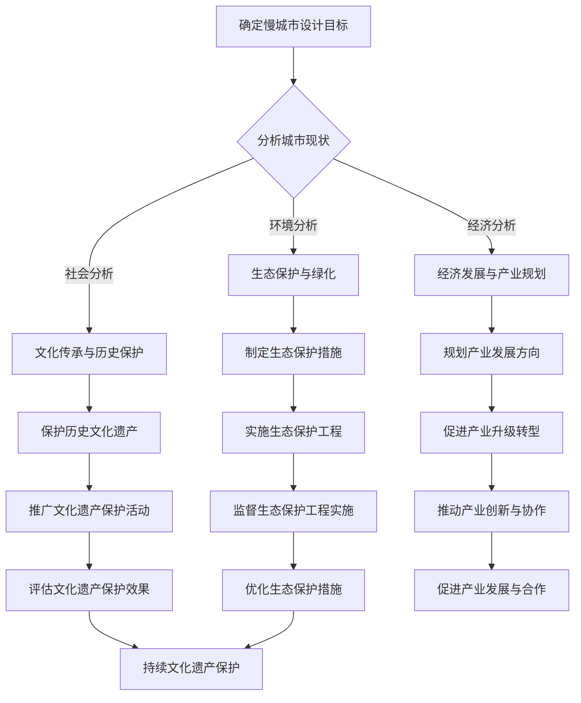

                 

# 《慢城市设计：宜居环境的城市规划》

> 关键词：慢城市设计、宜居环境、城市规划、可持续发展、人本主义、可达性

> 摘要：本文深入探讨了慢城市设计的概念、核心价值、城市规划原则及关键要素，通过具体案例分析，展示了慢城市设计在实现宜居环境方面的实践方法与趋势。文章旨在为城市规划者和研究者提供有价值的参考，以推动慢城市设计的发展。

## 第一部分：慢城市设计与宜居环境

### 第1章：慢城市的概念与价值

#### 1.1 慢城市的起源与发展

慢城市的概念起源于意大利，20世纪70年代由意大利建筑师恩里科·纳塔（Enrico Natale）提出。纳塔在《慢城宣言》（Manifesto of the Slow City）中强调，慢城市是一种反对过度商业化和城市扩张的生活方式。它主张放慢生活节奏，关注生活质量，追求人与自然的和谐共处。

随着全球城市化的加速，慢城市的理念逐渐传播到世界各地。它不仅在欧洲受到广泛关注，也在亚洲、非洲和拉丁美洲等地逐渐得到认可和应用。慢城市设计已成为一种新兴的城市规划趋势，旨在创造一个更加宜居、可持续的城市环境。

#### 1.2 慢城市的核心价值

慢城市的核心价值主要体现在以下几个方面：

1. **提升居民生活质量**：慢城市强调减少城市化进程带来的压力，通过合理的城市规划，提高居民的居住环境和生活舒适度，从而提升居民的生活质量。

2. **促进社会和谐**：慢城市倡导和谐共处，鼓励居民积极参与社区活动，促进社会和谐。

3. **保护生态环境**：慢城市注重生态保护，通过合理的城市规划，减少城市对环境的负面影响，保护生态环境。

4. **鼓励文化传承**：慢城市重视传统文化的保护和传承，通过城市规划，营造具有文化特色的城市环境。

#### 1.3 慢城市与宜居环境的关系

慢城市与宜居环境是相辅相成的。宜居环境是慢城市的基础，而慢城市则是实现宜居环境的重要手段。慢城市通过合理规划，营造宜居环境，提高居民的生活质量和幸福感。同时，宜居环境也为慢城市的实施提供了良好的基础。

宜居环境的核心要素包括：

1. **安全与舒适**：城市环境应保证居民的人身安全和生活的舒适度。

2. **生态与美观**：城市环境应具有良好的生态环境和美观的景观。

3. **便捷与高效**：城市交通和公共服务设施应便捷高效，满足居民的需求。

4. **多样性与包容性**：城市应提供多样化的居住选择，同时包容不同背景和文化的人群。

### 第2章：宜居环境的城市规划原则

#### 2.1 可持续发展原则

可持续发展的城市规划原则要求城市在发展的同时，注重资源的合理利用和保护环境。具体包括：

1. **资源利用**：优化城市资源利用，提高资源利用效率，减少浪费。

2. **环境保护**：减少城市对环境的负面影响，保护生态系统。

3. **能源节约**：推广可再生能源，降低能源消耗，提高能源利用效率。

#### 2.2 人本主义原则

人本主义原则强调城市规划应以人为中心，关注人的需求和行为习惯。具体包括：

1. **居住舒适**：提高居住环境的舒适度，满足居民的基本生活需求。

2. **公共参与**：鼓励居民参与城市规划，提高居民的获得感和认同感。

3. **人文关怀**：关注居民的心理健康，提供多样化的文化娱乐活动。

#### 2.3 可达性原则

可达性原则要求城市内部交通和公共服务设施具有良好的可达性，提高居民出行的效率。具体包括：

1. **交通规划**：合理规划城市交通系统，提高交通流畅性。

2. **公共交通**：优化公共交通系统，提高公共交通的覆盖率和便捷性。

3. **步行和自行车**：鼓励步行和自行车出行，提高城市的可持续性。

## 第二部分：慢城市设计的实践方法

### 第3章：慢城市设计的关键要素

#### 3.1 城市空间布局

城市空间布局是慢城市设计的基础。合理的城市空间布局可以提高城市的生活质量，减少交通拥堵，保护生态环境。具体包括：

1. **功能区划分**：合理划分城市功能区，确保城市交通流畅、居住舒适、环境宜居。

2. **生态廊道**：建设生态廊道，保护自然生态系统，提高城市生态多样性。

3. **绿色空间**：增加城市绿色空间，提供休闲、健身和社交的场所。

#### 3.2 交通系统设计

交通系统设计是慢城市设计的关键。通过优化交通系统，可以实现绿色出行，减少城市交通污染，提高城市生活质量。具体包括：

1. **非机动车交通**：建设非机动车交通系统，鼓励居民步行、骑行，减少汽车出行。

2. **公共交通**：优化公共交通系统，提高公共交通的覆盖率和便捷性。

3. **智能交通**：应用智能交通技术，提高交通管理效率，减少交通拥堵。

#### 3.3 公共服务设施规划

公共服务设施规划是慢城市设计的重要组成部分。通过合理的公共服务设施规划，可以满足居民的基本需求，提高居民的生活质量。具体包括：

1. **社区服务中心**：建设社区服务中心，提供居民所需的各类服务。

2. **文化体育设施**：建设文化体育设施，提供居民休闲、娱乐和健身的场所。

3. **医疗和教育设施**：建设医疗和教育设施，提高居民的健康水平和教育水平。

## 第三部分：案例研究

### 第4章：国内外慢城市设计案例

#### 4.1 国外慢城市设计案例

国外慢城市设计案例主要包括意大利的奥尔维耶托（Orvieto）、法国的蒙彼利埃（Montpellier）和日本的京都（Kyoto）等。

- **奥尔维耶托**：奥尔维耶托是一座典型的慢城市，城市空间布局合理，交通系统优化，公共服务设施完善。居民生活质量高，社会和谐，生态环境良好。

- **蒙彼利埃**：蒙彼利埃通过推广公共交通和非机动车出行，减少汽车污染，提高城市生活质量。同时，蒙彼利埃还注重文化保护和生态保护，实现了可持续发展。

- **京都**：京都以其悠久的历史和文化著称，慢城市设计注重保护城市历史遗产和自然环境。京都的公共交通系统发达，居民出行便捷，生活舒适。

#### 4.2 国内慢城市设计案例

国内慢城市设计案例主要包括中国的南京、苏州和成都等。

- **南京**：南京通过推广绿色出行，建设生态廊道，提高居民生活质量。同时，南京还注重历史文化遗产的保护，营造具有江南特色的城市环境。

- **苏州**：苏州以其优美的园林和运河闻名，慢城市设计注重生态保护和历史文化传承。苏州的公共交通系统发达，居民出行便捷，生活舒适。

- **成都**：成都通过推广慢生活理念，建设社区公园和公共文化设施，提高居民生活质量。成都还注重科技创新，推动智慧城市建设。

#### 4.3 案例分析与启示

国内外慢城市设计案例表明，慢城市设计需要综合考虑城市发展、生态环境保护、历史文化传承和居民生活质量等方面。以下是一些主要的启示：

1. **以人为本**：慢城市设计应以人为中心，关注人的需求和行为习惯，提高居民的生活质量。

2. **可持续发展**：慢城市设计应遵循可持续发展原则，注重资源的合理利用和保护环境。

3. **文化传承**：慢城市设计应注重历史文化传承，营造具有地域特色的城市环境。

4. **科技创新**：慢城市设计应充分利用科技创新，提高城市规划和管理效率。

### 第5章：慢城市设计趋势与未来展望

#### 5.1 慢城市设计的发展趋势

随着全球城市化的加速，慢城市设计正成为城市规划的新趋势。以下是慢城市设计的发展趋势：

1. **绿色出行**：推广公共交通和非机动车出行，减少汽车污染，提高城市生活质量。

2. **智慧城市**：利用大数据、物联网、人工智能等技术，提高城市规划和管理效率。

3. **生态保护**：加强生态保护，建设生态廊道，提高城市生态多样性。

4. **历史文化传承**：注重历史文化传承，营造具有地域特色的城市环境。

#### 5.2 慢城市设计面临的挑战与机遇

慢城市设计面临的挑战主要包括：

1. **城市规划和管理经验不足**：慢城市设计需要综合考虑多个方面，城市规划和管理经验不足可能导致设计效果不佳。

2. **资金和人力资源不足**：慢城市设计需要大量的资金和人力资源支持，资金和人力资源不足可能影响设计实施。

3. **文化差异**：不同地区和文化背景下，慢城市设计的实施可能面临文化差异的挑战。

慢城市设计面临的机遇主要包括：

1. **政策支持**：随着全球对环境保护和可持续发展的重视，政府加大对慢城市设计的支持力度。

2. **科技进步**：大数据、物联网、人工智能等技术的进步为慢城市设计提供了新的工具和方法。

3. **公众参与**：公众对慢城市设计的关注度和参与度提高，为慢城市设计提供了更多的资源和支持。

#### 5.3 未来慢城市设计的展望

未来慢城市设计的发展将更加注重以下几个方面：

1. **人与自然的和谐共生**：通过合理的城市规划，实现人与自然的和谐共生，提高居民生活质量。

2. **智慧城市的建设**：利用大数据、物联网、人工智能等技术，提高城市规划和管理效率。

3. **文化传承与创新**：注重历史文化传承，同时融入现代元素，实现文化传承与创新。

4. **可持续发展**：遵循可持续发展原则，注重资源的合理利用和保护环境。

## 附录

### 附录1：慢城市设计相关资源与工具

1. **慢城市设计指南与法规**：各国政府发布了慢城市设计的指南和法规，为慢城市设计提供了参考依据。

2. **慢城市设计软件与平台**：如城市仿真软件、GIS平台等，为慢城市设计提供了技术支持。

### 附录2：慢城市设计流程图

### 作者：AI天才研究院/AI Genius Institute & 禅与计算机程序设计艺术 /Zen And The Art of Computer Programming

文章完。希望本文能够为慢城市设计的研究和实践提供有益的启示和指导。慢城市设计不仅是一种城市规划的理念，更是一种生活态度和价值观的体现。让我们共同努力，创造一个更加宜居、可持续的城市环境。

