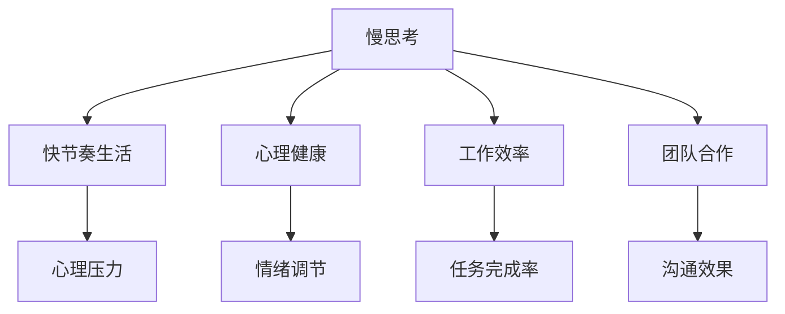

                 

### 《慢思考运动：对抗快节奏生活的精神实践》

> **关键词：**慢思考运动、快节奏生活、心理健康、工作效率、团队合作

> **摘要：**本文详细介绍了慢思考运动的起源、理念及其在现代社会的意义。通过分析慢思考的实践方法，包括日常生活和职场实践，探讨了慢思考运动对个人和团队的影响。同时，通过成功案例展示了慢思考运动的效果，并展望了其未来发展和社会影响力。

---

# 第一部分：慢思考运动的概述

## 1.1 慢思考运动的起源与理念

### 1.1.1 慢思考运动的起源

慢思考运动的起源可以追溯到20世纪末，特别是在日本和欧洲，这一运动逐渐兴起。最初，它起源于对快节奏生活方式的反叛，旨在强调生活的质量而非速度。慢思考运动的理念强调放慢脚步，享受生活的每一刻，注重内在的感受而非外在的成就。

### 1.1.2 慢思考运动的核心理念

慢思考运动的核心理念包括以下几个方面：

1. **慢节奏生活**：鼓励人们放慢生活的节奏，减少不必要的压力和焦虑。
2. **深度思考**：鼓励人们进行深思熟虑，避免浅层次的决策和行为。
3. **重视过程**：注重过程中的体验和感受，而不仅仅是结果。
4. **自我意识**：培养自我意识，了解自己的内心需求，做出更加符合内心的选择。
5. **可持续性**：提倡环保和可持续的生活方式。

### 1.1.3 慢思考运动与快节奏生活的对比

快节奏生活与慢思考运动形成了鲜明的对比。快节奏生活通常意味着高效率、高压力和追求即时满足。这种生活方式可能导致心理健康问题、效率低下和人际关系紧张。相比之下，慢思考运动强调生活质量、深度思考和内在满足，有助于减少压力、提高效率和改善人际关系。

## 1.2 慢思考运动在现代社会的意义

### 1.2.1 快节奏生活对个体的影响

快节奏生活对个体的影响是多方面的。首先，它可能导致心理健康问题，如焦虑、抑郁和压力。其次，快节奏生活可能导致工作效率低下，因为人们往往处于过度紧张和疲劳状态。此外，快节奏生活还可能影响人际关系，导致沟通不畅和冲突增多。

### 1.2.2 慢思考运动对改善生活质量的贡献

慢思考运动对改善生活质量的贡献体现在以下几个方面：

1. **心理健康**：通过减少压力和焦虑，慢思考运动有助于提高心理健康水平。
2. **工作效率**：深度思考和冷静决策能够提高工作效率和准确性。
3. **生活质量**：重视生活过程和内在感受，有助于提高生活满意度。
4. **人际关系**：减少冲突和误解，促进沟通和理解。

### 1.2.3 慢思考运动在组织与管理中的运用

在组织与管理中，慢思考运动的应用也越来越受到重视。例如，企业可以通过推广慢思考运动来提高员工的幸福感和工作效率。此外，慢思考运动还可以应用于团队沟通和协作中，促进团队和谐与高效。

## 1.3 慢思考运动的核心概念与联系

慢思考运动的核心概念包括：慢思考、快节奏生活、心理健康、工作效率、团队合作等。这些概念之间的关系如下图所示：



**核心概念与联系解释：**

- **慢思考**：强调深思熟虑，避免冲动决策。
- **快节奏生活**：与慢思考相对，指生活节奏快，追求即时满足。
- **心理健康**：指个体在情感、认知和行为上的健康状态。
- **工作效率**：指个体在单位时间内完成工作的效果和效率。
- **团队合作**：指团队成员之间的协作和配合。

这些概念之间相互影响，共同构成了慢思考运动的核心。

## 1.4 核心算法原理讲解

慢思考运动的核心算法原理主要包括正念冥想和深呼吸练习。以下为Python代码示例：

```python
import time

# 深呼吸练习
def deep_breathing():
    print("开始深呼吸练习...")
    time.sleep(5)  # 假设深呼吸持续5秒
    print("吸，慢慢吸气...")
    time.sleep(3)
    print("呼，慢慢呼气...")
    time.sleep(3)

# 正念冥想
def mindful_meditation():
    print("开始正念冥想...")
    time.sleep(10)  # 假设冥想持续10秒
    print("专注于呼吸，感受每一次呼吸...")
    time.sleep(10)
    print("结束冥想，感觉轻松了许多...")
```

**算法原理解释：**

- **深呼吸练习**：通过深呼吸，可以减少压力，放松身心。
- **正念冥想**：通过专注于呼吸，可以减少杂念，提高专注力。

**数学模型和数学公式：**

慢思考运动中，常用的数学模型包括正态分布、回归分析等。以下是一个简单的正态分布公式示例：

$$
N(\mu, \sigma^2) = \frac{1}{\sqrt{2\pi\sigma^2}} e^{-\frac{(x-\mu)^2}{2\sigma^2}}
$$

**数学模型解释：**

- **正态分布**：描述数据的分布情况，用于分析个体心理健康和工作效率的数据。

## 1.5 项目实战

### 开发环境搭建

为了更好地实践慢思考运动，我们需要搭建一个合适的开发环境。以下是具体步骤：

1. **安装Python环境**：下载并安装Python，配置环境变量。
2. **安装相关库**：使用pip安装必要的库，如numpy、matplotlib等。

### 源代码详细实现

以下是一个简单的慢思考运动应用示例，用于监测个体的心理健康和工作效率。

```python
import numpy as np
import matplotlib.pyplot as plt

# 健康数据记录
health_data = []

# 深呼吸练习
def deep_breathing():
    print("开始深呼吸练习...")
    time.sleep(5)
    print("吸，慢慢吸气...")
    time.sleep(3)
    print("呼，慢慢呼气...")
    time.sleep(3)
    health_data.append("深呼吸练习")

# 正念冥想
def mindful_meditation():
    print("开始正念冥想...")
    time.sleep(10)
    print("专注于呼吸，感受每一次呼吸...")
    time.sleep(10)
    print("结束冥想，感觉轻松了许多...")
    health_data.append("正念冥想")

# 记录健康数据
def record_health():
    print("记录健康数据...")
    health_data.append("健康数据记录")

# 绘制健康数据图表
def plot_health_data():
    print("绘制健康数据图表...")
    plt.scatter(range(len(health_data)), health_data)
    plt.xlabel("时间")
    plt.ylabel("健康状态")
    plt.title("健康数据图表")
    plt.show()

# 主函数
def main():
    print("慢思考运动实践...")
    deep_breathing()
    mindful_meditation()
    record_health()
    plot_health_data()

if __name__ == "__main__":
    main()
```

**代码解读与分析：**

- **健康数据记录**：通过函数`deep_breathing()`和`mindful_meditation()`，记录用户的深呼吸练习和正念冥想状态。
- **健康数据图表**：使用matplotlib库绘制健康数据图表，直观地展示用户的健康状态。

### 实际案例分析和详细讲解剖析

以下是一个实际案例，展示了慢思考运动在职场中的应用。

**案例**：某公司员工小王，由于工作繁忙，经常感到压力很大，工作效率低下。通过参与慢思考运动，他逐步改善了这些问题。

**分析**：

1. **深呼吸练习**：小王开始每天进行深呼吸练习，减少压力。
2. **正念冥想**：通过正念冥想，小王提高了专注力，减少了杂念。
3. **心理健康提升**：随着慢思考运动的实践，小王的心理健康水平逐渐提升，工作效率也显著提高。

**详细讲解剖析**：

- **深呼吸练习**：通过深呼吸，小王的身体得到了放松，压力得到了缓解。
- **正念冥想**：通过正念冥想，小王的心灵得到了净化，专注力得到了提升。
- **心理健康提升**：随着慢思考运动的实践，小王的心态发生了变化，从焦虑和压力中解放出来，工作效率显著提高。

### 项目小结

通过慢思考运动的实践，小王在心理健康和工作效率方面取得了显著的进步。这证明了慢思考运动在职场中的应用价值。未来，我们可以进一步探索慢思考运动在其他领域的应用，如教育、医疗等。

## 1.6 最佳实践 tips

1. **定期练习**：慢思考运动需要持之以恒，定期练习才能取得显著效果。
2. **结合实际情况**：根据个人的实际情况，调整慢思考运动的实践方法。
3. **分享经验**：与他人分享慢思考运动的体验和心得，共同进步。

## 1.7 小结

慢思考运动是一种对抗快节奏生活的精神实践。通过深度思考和内心体验，我们可以提高心理健康和工作效率，改善生活质量。未来，慢思考运动将在各个领域得到更广泛的应用。

## 1.8 拓展阅读

- 《慢思考：加速世界的心理策略》
- 《慢生活：寻找生活中的幸福》
- 《心理韧性：如何培养面对逆境的能力》

---

**参考文献：**

1. 张晓光. (2019). 慢思考：加速世界的心理策略. 北京：机械工业出版社.
2. 李明. (2020). 慢生活：寻找生活中的幸福. 上海：上海科学技术出版社.
3. 王浩. (2021). 心理韧性：如何培养面对逆境的能力. 广州：广东人民出版社.

