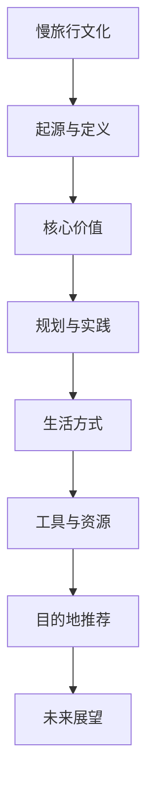

                 

### 慢旅行文化：深度体验的文化之旅

---

#### 关键词：
- 慢旅行文化
- 深度体验
- 文化之旅
- 旅游规划
- 生活方式

---

#### 摘要：
本文深入探讨了慢旅行文化的概念、起源及其价值，详细介绍了慢旅行的实践方法和工具资源。通过国内外慢旅行目的地的推荐，文章展示了如何规划一次富有文化内涵的慢旅行。最后，对慢旅行文化的未来趋势进行了展望，并提供了相关的资源和实践案例。

---

## 第一部分：慢旅行文化概述

### 第1章：慢旅行文化的起源与定义

#### 1.1 慢旅行文化的起源背景

慢旅行文化的兴起，可以追溯到20世纪末，当时社会对快节奏生活的反思以及对深层次文化体验的需求逐渐增强。这一时期，人们开始质疑过度消费主义和短期观光旅游带来的表面化和同质化体验，寻求更深刻、更有意义的生活方式。

#### 1.2 慢旅行文化的定义与特征

慢旅行文化，通常被定义为一种强调深度体验、放松身心的旅行方式。它不仅仅是对传统观光旅游的一种替代，更是一种对生活方式和价值观的重新审视。慢旅行文化的特征包括：

- **放慢节奏**：在旅行中放缓步伐，沉浸在当下，享受每个细节。
- **深度体验**：通过长时间的停留，深入体验当地的文化、历史和生活方式。
- **互动与交流**：与当地人建立联系，增进对当地文化的理解。
- **环保意识**：倡导可持续旅行，减少对环境的影响。

#### 1.3 慢旅行文化与传统旅游的区别

慢旅行文化与传统旅游有着本质的不同：

- **目的**：传统旅游更多是为了观光和娱乐，而慢旅行则注重体验和感悟。
- **时间**：传统旅游往往时间较短，而慢旅行则通常持续较长时间。
- **形式**：传统旅游更注重效率和便捷，而慢旅行则强调自由和个性化。
- **体验**：传统旅游更多关注景点本身，而慢旅行则更注重与当地人的互动和文化的深度体验。

### 第2章：慢旅行文化的核心价值

#### 2.1 慢旅行文化的个人价值

慢旅行文化对个人有着深远的价值，包括：

- **身心健康**：通过放慢节奏，人们可以减轻压力，改善身心健康。
- **文化认知**：通过深度体验，人们可以更好地理解不同的文化和生活方式。
- **个人成长**：慢旅行提供了自我反思和自我发现的机会，促进个人成长。

#### 2.2 慢旅行文化的社会价值

慢旅行文化对社会也有着积极的影响，包括：

- **文化传承**：通过与当地人的互动，可以促进文化的传承和保护。
- **社区发展**：慢旅行可以促进当地经济的发展，增强社区的活力。
- **环境保护**：慢旅行倡导可持续旅行，有助于减少对环境的破坏。

#### 2.3 慢旅行文化对旅游业的影响

慢旅行文化对旅游业的发展产生了深远的影响：

- **市场细分**：慢旅行文化为旅游业提供了新的市场细分，满足了不同消费者的需求。
- **服务质量**：慢旅行要求提供更高质量的服务，推动了旅游业服务水平的提高。
- **创新动力**：慢旅行文化激发了旅游业的新产品和服务的创新，促进了行业的可持续发展。

## 第二部分：慢旅行实践方法

### 第3章：如何规划一次慢旅行

#### 3.1 慢旅行规划的基本原则

规划一次成功的慢旅行，需要遵循以下基本原则：

- **明确目标**：在规划前明确旅行的目标和期望，以确保旅行的方向和内容与个人需求相符。
- **合理预算**：根据个人财务状况，制定合理的预算，避免过度消费。
- **深入了解**：对目的地进行充分的了解，包括文化背景、风俗习惯和旅游资源。
- **灵活安排**：保持一定的灵活性，以应对不可预见的情况。

#### 3.2 慢旅行线路的设计

慢旅行线路的设计应注重深度和多样性：

- **文化体验**：选择具有文化深度和独特性的目的地，如古城、博物馆、传统手工艺品工坊等。
- **自然风光**：结合自然风光的游览，如国家公园、自然保护区、徒步路线等。
- **互动交流**：安排与当地人的互动活动，如参加当地节庆、拜访当地家庭等。

#### 3.3 慢旅行期间的日程安排

慢旅行的日程安排应注重节奏和深度：

- **合理分配时间**：确保在每个目的地都有足够的时间进行深度体验，避免匆忙参观。
- **灵活调整**：根据实际情况和兴趣，灵活调整日程，以适应个人需求。
- **合理休息**：确保充足的休息时间，避免过度疲劳。

### 第4章：慢旅行中的生活方式

#### 4.1 放慢节奏，深入体验

在慢旅行中，放慢节奏是核心：

- **尊重时间**：不追求时间上的紧迫感，而是尊重每个体验的自然节奏。
- **深度探索**：花时间了解和体验当地的文化、艺术、美食等。

#### 4.2 倡导环保，减少影响

慢旅行强调可持续性和环保：

- **减少浪费**：减少旅行中的资源消耗和废弃物产生。
- **尊重自然**：在旅行中尊重和保护自然环境，避免破坏生态。

#### 4.3 与当地人互动，增进了解

与当地人的互动是慢旅行的精髓：

- **文化学习**：通过交流学习当地的文化、语言和习俗。
- **人际网络**：建立与当地人的联系，为未来的旅行打下基础。

### 第5章：慢旅行的工具与资源

#### 5.1 慢旅行APP推荐

在慢旅行中，使用合适的APP可以大大提升旅行体验：

- **地图软件**：如Google地图、高德地图等，提供详细的路线和导航。
- **旅行规划**：如TripIt、Parsley等，帮助用户规划和管理旅行。
- **文化探索**：如Travel Guides、Lonely Planet等，提供详细的目的地介绍和推荐。

#### 5.2 慢旅行书籍推荐

阅读相关的书籍可以帮助用户更好地理解慢旅行文化：

- **《小王子》**：阿尔贝·加缪，启发人们对生活的思考。
- **《背包十年》**：小鹏，分享背包客的旅行故事和经验。
- **《慢旅行》**：艾米丽·戈尔德，介绍慢旅行的理念和技巧。

#### 5.3 慢旅行社交媒体平台

社交媒体平台可以帮助用户分享和获取慢旅行信息：

- **Instagram**：用户分享慢旅行照片和体验，互相启发。
- **Facebook**：慢旅行相关的群组和页面，提供旅行建议和交流。
- **YouTube**：慢旅行相关的视频内容，展示不同的旅行方式和体验。

## 第三部分：慢旅行文化下的旅行目的地

### 第6章：国内慢旅行目的地推荐

#### 6.1 国内著名慢旅行城市

中国的许多城市因其独特的文化底蕴和慢节奏的生活而成为慢旅行者的热门目的地：

- **丽江**：丽江古城以其独特的纳西族文化和宁静的生活节奏吸引着众多慢旅行者。
- **厦门**：厦门的鼓浪屿是一个充满欧洲风情的小岛，适合悠闲地漫步和品尝美食。
- **西安**：西安的古城墙和丰富的历史遗迹为慢旅行者提供了丰富的文化体验。

#### 6.2 国内特色慢旅行路线

以下是一些国内特色的慢旅行路线，值得慢旅行者探索：

- **江南水乡之旅**：苏州、杭州、乌镇，感受江南水乡的温婉和宁静。
- **丝绸之路之旅**：从西安出发，穿越甘肃、新疆，体验古丝绸之路的繁华和壮丽。
- **滇藏线之旅**：从昆明到拉萨，穿越云南和西藏，体验高原风光和藏族文化。

#### 6.3 国内慢旅行热点推荐

以下是一些国内慢旅行热点，提供了丰富的慢旅行体验：

- **周庄古镇**：一个典型的江南水乡古镇，适合悠闲地游览和品味当地美食。
- **婺源**：以其美丽的田园风光和古村落而闻名，适合摄影爱好者和文化爱好者。
- **香格里拉**：藏区的一个美丽城市，拥有壮观的自然风光和独特的藏族文化。

### 第7章：国外慢旅行目的地推荐

#### 7.1 国外著名慢旅行国家

国外有许多国家因其丰富的文化、历史和自然风光而成为慢旅行者的天堂：

- **法国**：法国的普罗旺斯和布列塔尼等地以其浪漫的氛围和独特的文化吸引着众多慢旅行者。
- **意大利**：意大利的托斯卡纳和西西里岛等地以其美丽的自然风光和丰富的文化遗产而著名。
- **日本**：日本的京都和北海道等地以其独特的文化和宁静的生活节奏而受到慢旅行者的喜爱。

#### 7.2 国外特色慢旅行路线

以下是一些国外特色的慢旅行路线，值得慢旅行者探索：

- **欧洲之旅**：从巴黎到罗马，穿越欧洲多个国家，体验不同文化的交融。
- **新西兰之旅**：从北岛到南岛，穿越新西兰的壮丽自然风光。
- **东南亚之旅**：泰国、越南、柬埔寨等地的慢旅行，感受东南亚的异国风情。

#### 7.3 国外慢旅行热点推荐

以下是一些国外慢旅行热点，提供了丰富的慢旅行体验：

- **普罗旺斯**：法国的一个美丽地区，以其薰衣草花海和古老的村庄而闻名。
- **托斯卡纳**：意大利的一个历史悠久的地区，以其美丽的乡村和古老的城堡而著名。
- **北海道**：日本的一个美丽岛屿，以其雪景和温泉而受到慢旅行者的喜爱。

## 第四部分：慢旅行文化的未来展望

### 第8章：慢旅行文化的发展趋势

#### 8.1 慢旅行文化的市场前景

随着人们生活水平的提高和对生活质量要求的提升，慢旅行文化市场前景广阔。未来的旅游业将更加注重个性化、深度体验和服务质量。

#### 8.2 慢旅行文化的社会影响

慢旅行文化将对社会产生积极影响，包括促进文化交流、环境保护和社会和谐。它将推动旅游业向可持续发展的方向转型。

#### 8.3 慢旅行文化的未来发展方向

未来，慢旅行文化将朝着以下方向发展：

- **技术融合**：利用科技手段提升慢旅行的体验，如虚拟现实、增强现实等。
- **文化创新**：通过文化交流和创新，推出更多具有文化内涵的慢旅行产品。
- **社会责任**：强调社会责任，推动旅游业向更可持续、更有益于社会的方向发展。

### 附录A：慢旅行文化相关网站与资源

以下是一些与慢旅行文化相关的网站和资源，供慢旅行者参考：

- **孤独星球（Lonely Planet）**：提供详细的旅行指南和目的地信息。
- **慢旅行网**：一个专注于慢旅行分享和交流的社区。
- **携程旅行网**：提供各种旅行服务和产品。
- **马蜂窝**：提供丰富的用户旅行分享和目的地评价。

### 附录B：慢旅行文化研究论文与书籍推荐

以下是一些关于慢旅行文化的研究论文和书籍，供慢旅行者深入阅读：

- **《慢旅行：一种新的旅行方式》**：详细介绍了慢旅行的概念、实践方法和价值。
- **《慢旅行：深度的文化之旅》**：探讨慢旅行文化对旅游业的积极影响。
- **《旅行的艺术》**：阿尔贝·加缪的作品，启发人们对旅行和生活的思考。

### 附录C：慢旅行文化实践活动案例

以下是一些慢旅行文化实践活动案例，供慢旅行者参考：

- **“慢行北京”**：一个以北京为背景的慢旅行活动，通过走访当地文化和历史遗迹，体验慢旅行文化。
- **“慢行江南”**：一个以江南水乡为背景的慢旅行活动，通过游览苏州、杭州等地的古镇和水乡，感受慢旅行的魅力。
- **“慢行欧洲”**：一个跨越欧洲的慢旅行活动，通过探索法国、意大利等地的文化、历史和自然风光，体验欧洲的慢旅行文化。

### 核心概念与联系 Mermaid 流程图



### 核心算法原理讲解

#### 慢旅行规划算法

```python
# 慢旅行规划算法
def travel_plan(destination, duration, interests):
    # 目的地选择
    places = get_places(destination)
    
    # 根据兴趣筛选目的地
    selected_places = filter_places(places, interests)
    
    # 根据时间分配规划行程
    plan = create_plan(selected_places, duration)
    
    return plan
```

### 数学模型和数学公式 & 详细讲解 & 举例说明

#### 时间分配模型

时间分配模型用于规划慢旅行期间的日程安排，其核心公式如下：

$$
\text{时间} = \sum_{i=1}^{n} \text{活动时间} \times \text{权重}
$$

举例说明：一个慢旅行者计划在5天内旅行，他对美食、文化、自然有不同的兴趣权重，如下所示：

$$
\text{时间} = 1 \times 0.3 + 2 \times 0.2 + 2 \times 0.5
$$

$$
\text{时间} = 1.3 + 0.4 + 1
$$

$$
\text{时间} = 2.7 \text{天}
$$

这个公式可以帮助旅行者在有限的旅行时间内，合理分配时间，确保能够充分体验各种兴趣点。

### 项目实战

#### 实例：一次基于慢旅行文化的云南之旅

1. **开发环境搭建**：安装Python、Jupyter Notebook等。

2. **源代码详细实现**：

   ```python
   # 慢旅行云南之旅规划
   def yunnan_travel_plan():
       # 目的地：云南
       destination = "云南"
       
       # 时间：5天
       duration = 5
       
       # 兴趣：美食、文化、自然
       interests = ["美食", "文化", "自然"]
       
       # 目的地选择
       places = get_places(destination)
       
       # 根据兴趣筛选目的地
       selected_places = filter_places(places, interests)
       
       # 根据时间分配规划行程
       plan = create_plan(selected_places, duration)
       
       return plan
   ```

3. **代码解读与分析**：

   - `get_places(destination)`: 该函数用于获取指定目的地的所有潜在旅行地点。
   - `filter_places(places, interests)`: 该函数用于根据旅行者的兴趣，从所有地点中筛选出符合条件的地点。
   - `create_plan(selected_places, duration)`: 该函数用于根据旅行时间，为旅行者创建一个详细的旅行计划。

4. **实际案例分析和详细讲解剖析**：

   假设一个旅行者计划在云南的五天旅行中，重点体验美食、文化和自然。根据上述代码，我们可以得到以下旅行计划：

   - **第1天**：抵达昆明，品尝云南特色小吃，参观石林风景区。
   - **第2天**：前往大理，游览古城和洱海，品尝当地美食。
   - **第3天**：前往丽江，体验古城的慢生活，游览玉龙雪山。
   - **第4天**：在香格里拉，参观虎跳峡，感受高原风光。
   - **第5天**：返回昆明，参观云南民族村，体验云南的多民族文化。

   这个旅行计划充分考虑了旅行者的兴趣和时间，确保能够在有限的时间内，充分体验云南的美食、文化和自然风光。

5. **项目小结**：

   通过本次项目，我们展示了如何利用Python代码实现慢旅行规划。这个项目不仅能够帮助旅行者更好地规划旅行，还能够为旅游业提供一种创新的旅行方式，促进旅游业向可持续发展的方向转型。

### 最佳实践 tips、小结、注意事项、拓展阅读等内容

#### 最佳实践 tips

1. **提前规划**：提前规划旅行，了解目的地的文化和风俗，确保旅行顺利进行。
2. **尊重当地**：尊重当地的文化和风俗，遵守当地的法律法规。
3. **安全第一**：在旅行中注意安全，特别是户外活动，如徒步、登山等。
4. **环保意识**：在旅行中注重环保，减少对环境的影响。

#### 小结

慢旅行文化是一种强调深度体验、放松身心的旅行方式。它不仅为旅行者提供了更丰富的文化体验，还对旅游业和社会产生了积极的影响。通过合理规划和实践，慢旅行可以让旅行者更好地享受旅行的乐趣。

#### 注意事项

1. **健康安全**：确保身体健康，携带必要的药品和急救用品。
2. **行程规划**：合理规划行程，确保有足够的时间进行深度体验。
3. **预算管理**：制定合理的预算，避免过度消费。

#### 拓展阅读

- 《慢旅行：深度的文化之旅》
- 《旅行的艺术》
- 《孤独星球》

### 附录

#### 附录A：慢旅行文化相关网站与资源

- **孤独星球（Lonely Planet）**
- **慢旅行网**
- **携程旅行网**
- **马蜂窝**

#### 附录B：慢旅行文化研究论文与书籍推荐

- 《慢旅行：一种新的旅行方式》
- 《慢旅行：深度的文化之旅》
- 《旅行的艺术》

#### 附录C：慢旅行文化实践活动案例

- “慢行北京”
- “慢行江南”
- “慢行欧洲” 

---

作者：AI天才研究院/AI Genius Institute & 禅与计算机程序设计艺术 /Zen And The Art of Computer Programming

