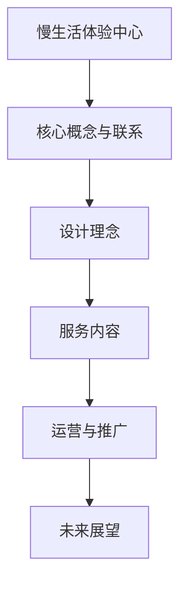

                 

# 慢生活体验中心：重新定义生活节奏的实践基地

> 关键词：慢生活，体验中心，生活节奏，心理健康，可持续设计

> 摘要：本文深入探讨了慢生活体验中心的概念、设计理念、服务内容及其运营与推广策略。通过对慢生活理念的起源与发展、快节奏生活的反思以及慢生活体验中心的定位与目标的分析，本文揭示了慢生活体验中心在重新定义生活节奏、提升生活品质和促进身心健康方面的独特价值。同时，文章还详细阐述了慢生活体验中心的服务内容、运营管理以及市场推广策略，为建设一个健康、可持续的慢生活空间提供了宝贵的实践经验。

## 第一部分：慢生活体验中心的概述

### 第1章：慢生活体验中心的背景与意义

1.1 慢生活理念的起源与发展

- **慢生活的定义**：慢生活（Slow Living）是一种生活态度，强调放慢生活节奏，关注内心的感受，追求生活的品质和丰富性。它不仅仅是一种生活模式，更是一种哲学和价值观。

- **慢生活运动的兴起**：慢生活运动起源于20世纪80年代末的意大利，由卡尔洛·皮卡尔蒂（Carlo Petrini）发起，旨在对抗工业化和全球化带来的快节奏生活方式。

- **慢生活在中国的发展**：随着中国经济的发展和人们生活水平的提高，慢生活理念逐渐被引入中国。近年来，越来越多的城市开始建设慢生活体验区，为人们提供远离喧嚣、享受宁静的空间。

1.2 快节奏生活的压力与反思

- **现代社会的快节奏生活**：现代社会高度竞争，人们为了追求物质财富和社会地位，常常加班加点，生活在紧张和压力之中。

- **快节奏生活的负面影响**：长期的快节奏生活会导致心理压力增大、身体疲劳、睡眠质量下降等一系列健康问题。

- **慢生活的价值体现**：慢生活通过调整生活节奏，提高生活质量，减轻心理压力，有助于身心健康。同时，它也是一种回归自然、享受生活的态度，有助于构建和谐的社会关系。

1.3 慢生活体验中心的定位与目标

- **慢生活体验中心的定义**：慢生活体验中心是一个集生活、休闲、教育、疗养等功能于一体的实践基地，旨在为人们提供一个放慢脚步、享受生活的空间。

- **中心的目标与服务内容**：慢生活体验中心的目标是推广慢生活理念，提供各种服务，帮助人们调整生活节奏，提升生活品质。服务内容包括生活方式引导、生活技能培训、身心放松与疗养、教育与知识分享等。

- **中心的核心价值观**：慢生活体验中心的核心价值观是尊重自然、关注健康、追求品质、共享和谐。通过这些价值观的实践，中心旨在打造一个可持续发展的慢生活空间。

### 第2章：慢生活体验中心的设计理念

2.1 设计理念的核心要素

- **生态友好**：慢生活体验中心的设计应充分考虑生态因素，采用绿色建筑技术，实现资源的节约和循环利用。

- **舒适宜居**：中心的设计应注重人性化，为人们提供一个舒适、宜居的生活环境，满足人们的日常生活需求。

- **科技赋能**：中心的设计应结合现代科技，利用智能化设备和服务，提升用户体验，实现智能化的生活管理。

2.2 设计原则与实践

- **人本设计**：设计应以人为中心，充分考虑人的需求和舒适度，提供个性化的服务。

- **可持续发展**：设计应遵循可持续发展原则，注重生态保护和资源利用的可持续性。

- **个性化定制**：设计应提供多样化的选择，满足不同用户的需求，实现个性化定制。

2.3 设计案例与启示

- **国内外优秀慢生活体验中心案例**：分析国内外优秀的慢生活体验中心案例，探讨其设计理念和实践经验，为我国慢生活体验中心的设计提供参考。

- **设计经验与挑战**：总结设计经验，分析面临的主要挑战，如生态保护与开发、资源利用与节约、用户体验的提升等。

## 第二部分：慢生活体验中心的服务内容

### 第3章：生活方式引导与服务

3.1 生活节奏调整

- **心理健康与压力管理**：通过心理咨询、放松训练等方法，帮助人们缓解压力，改善心理健康。

- **时间管理技巧**：提供时间管理课程，帮助人们合理安排时间，提高工作效率。

- **睡眠质量提升**：通过睡眠指导、睡眠环境优化等方法，提高人们的睡眠质量。

3.2 生活技能培训

- **烹饪与饮食文化**：提供烹饪课程，传授健康、美味的烹饪技巧，弘扬饮食文化。

- **家居布置与装饰**：提供家居布置与装饰培训，帮助人们打造温馨、舒适的家居环境。

- **传统文化体验**：通过传统文化体验活动，传承和弘扬中华民族的优秀传统文化。

3.3 生活品质提升

- **健康生活方式**：推广健康生活方式，提供健康饮食、运动指导等服务。

- **环保生活实践**：倡导环保理念，提供环保知识培训，鼓励用户践行环保生活。

- **社交活动与社区建设**：组织各类社交活动，促进居民之间的互动，建设和谐的社区氛围。

### 第4章：身心放松与疗养

4.1 放松与疗养的理念

- **身心放松的重要性**：身心放松有助于缓解压力，改善身心健康。

- **疗养与康复的区别**：疗养是通过放松和调整生活方式，改善身心健康；康复是通过治疗和训练，恢复身体功能。

4.2 放松活动的选择

- **自然景观体验**：利用自然景观，提供户外放松活动，如徒步、野营等。

- **水疗与温泉**：利用水疗和温泉，提供身心放松服务。

- **瑜伽与冥想**：提供瑜伽和冥想课程，帮助用户放松身心。

4.3 疗养服务的提供

- **康复治疗**：提供康复治疗服务，如物理治疗、按摩等。

- **美容养生**：提供美容养生服务，如美容护肤、按摩养生等。

- **健康饮食指导**：提供健康饮食指导，帮助用户调整饮食，改善身体健康。

### 第5章：教育与知识分享

5.1 慢生活教育与讲座

- **慢生活知识普及**：通过讲座、课程等形式，普及慢生活知识，传播慢生活理念。

- **专题讲座与研讨会**：邀请专家开展专题讲座和研讨会，探讨慢生活领域的最新研究成果和发展趋势。

5.2 知识分享平台

- **自媒体内容创作**：建立自媒体平台，发布慢生活相关的内容，分享经验和心得。

- **线上分享与互动**：通过线上分享和互动，促进用户之间的交流和互动。

5.3 教育活动组织

- **慢生活体验工作坊**：组织慢生活体验工作坊，让用户亲身体验慢生活的乐趣。

- **学生实习与实践**：提供实习和实践机会，让学生深入了解慢生活体验中心的服务内容和工作模式。

## 第三部分：慢生活体验中心的运营与推广

### 第6章：运营管理与团队建设

6.1 运营管理概述

- **运营目标与战略**：明确运营目标，制定战略规划，确保中心的可持续发展。

- **运营流程与规范**：建立完善的运营流程，制定规范的操作标准，确保服务的质量。

6.2 团队建设与人才引进

- **员工培训与成长**：提供员工培训，提升员工的专业素养和综合素质。

- **人才引进策略**：制定人才引进策略，吸引高素质的人才加入团队。

6.3 服务质量监控与改进

- **客户满意度调查**：定期开展客户满意度调查，了解客户的需求和满意度。

- **服务质量评估与提升**：根据调查结果，评估服务质量，制定改进措施，提升服务质量。

### 第7章：市场推广与品牌建设

7.1 市场定位与目标客户群体

- **目标市场的分析**：分析目标市场的需求，确定市场定位。

- **客户需求的研究**：深入研究客户需求，提供个性化的服务。

7.2 品牌建设与传播策略

- **品牌定位与价值主张**：明确品牌定位，构建品牌价值主张。

- **品牌传播渠道**：利用多种传播渠道，提升品牌知名度。

7.3 营销活动策划与执行

- **营销策略与计划**：制定营销策略，确保营销活动的有效性。

- **活动执行与效果评估**：执行营销活动，评估活动效果，不断优化营销策略。

## 第四部分：慢生活体验中心的未来展望

### 第8章：社会价值与可持续发展

8.1 慢生活体验中心的社会价值

- **对社会健康的贡献**：通过提供身心健康服务，促进社会健康水平的提高。

- **对环境保护的贡献**：通过推广环保理念，践行环保行动，保护生态环境。

8.2 可持续发展的策略与实践

- **资源利用与节约**：通过合理利用资源和节约能源，实现可持续发展。

- **社会责任与公益事业**：积极参与社会责任和公益事业，回报社会。

8.3 未来发展趋势与挑战

- **慢生活理念的全球传播**：随着全球化的发展，慢生活理念将在全球范围内传播。

- **科技进步对慢生活体验的影响**：科技进步将带来更智能、更便捷的慢生活体验。

- **慢生活体验中心面临的挑战与机遇**：面临市场竞争、人才引进、服务质量等挑战，同时也拥有广阔的发展机遇。

### 附录

#### 附录A：慢生活体验中心案例研究

- **国内外慢生活体验中心案例分析**：分析国内外成功的慢生活体验中心案例，探讨其成功经验和挑战。

- **案例经验与启示**：总结案例中的经验和教训，为我国慢生活体验中心的发展提供启示。

#### 附录B：慢生活相关资源与工具

- **慢生活研究机构与学术资源**：介绍国内外慢生活研究机构和学术资源，为研究者和爱好者提供参考。

- **慢生活实践工具与应用指南**：介绍慢生活实践工具和应用指南，帮助用户更好地践行慢生活理念。

### **Mermaid 流程图：**

### **作者：**

作者：AI天才研究院/AI Genius Institute & 禅与计算机程序设计艺术 /Zen And The Art of Computer Programming

本文内容丰富，结构紧凑，深入探讨了慢生活体验中心的概念、设计理念、服务内容及其运营与推广策略。通过分析慢生活理念的起源与发展、快节奏生活的反思以及慢生活体验中心的定位与目标，本文揭示了慢生活体验中心在重新定义生活节奏、提升生活品质和促进身心健康方面的独特价值。同时，文章还详细阐述了慢生活体验中心的服务内容、运营管理以及市场推广策略，为建设一个健康、可持续的慢生活空间提供了宝贵的实践经验。通过本文的阅读，读者可以深入了解慢生活体验中心的核心概念和联系，理解其设计理念、服务内容和运营策略，并对慢生活体验中心的发展趋势和未来展望有更清晰的认识。

## 第一部分：慢生活体验中心的概述

### 第1章：慢生活体验中心的背景与意义

#### 1.1 慢生活理念的起源与发展

慢生活理念起源于意大利的“慢食运动”，由卡尔洛·皮卡尔蒂（Carlo Petrini）于1986年发起。这场运动最初是为了对抗全球化和工业化的快速生活方式，倡导人们在享受美食的同时，关注生活的质量和节奏。随着时间的推移，慢生活理念逐渐扩展到生活的各个方面，成为一种追求平衡、自然和和谐的生活态度。

**慢生活的定义**：慢生活是一种追求高品质生活的方式，它强调放慢节奏，注重生活细节，享受过程而非仅仅关注结果。它不仅仅是一种生活模式，更是一种哲学和价值观，鼓励人们在繁忙的生活中找到平衡点，关注身心健康和人际关系。

**慢生活运动的兴起**：慢生活理念在意大利兴起后，迅速传播到世界各地。20世纪末，随着人们对环境、健康和生活质量的关注增加，慢生活运动在全球范围内得到广泛认同和支持。特别是在欧洲和北美地区，越来越多的人开始接受并实践慢生活理念。

**慢生活在中国的发展**：在中国，慢生活理念的传播始于21世纪初。随着社会的发展和人们生活水平的提高，越来越多的人开始反思快节奏生活方式的弊端，并开始寻求一种更加平衡、健康的生活状态。许多城市开始建设慢生活体验区，举办慢生活主题活动，推动慢生活理念在中国的传播和实践。

#### 1.2 快节奏生活的压力与反思

**现代社会的快节奏生活**：在现代社会，人们的生活节奏普遍较快，工作压力大，竞争激烈。为了追求更高的收入和更好的社会地位，很多人不得不加班加点，牺牲休息和娱乐时间。快节奏的生活方式让人们感到疲惫不堪，心理和身体健康受到影响。

**快节奏生活的负面影响**：长期的快节奏生活会导致以下负面影响：

- **心理健康问题**：长期的压力和焦虑会导致抑郁、焦虑等心理健康问题。
- **身体健康问题**：过度劳累和缺乏休息会导致身体疲劳、免疫力下降，甚至引发慢性疾病。
- **家庭和社会关系问题**：快节奏生活使得人们没有足够的时间与家人和朋友交流，导致家庭和社会关系紧张。

**慢生活的价值体现**：与快节奏生活相比，慢生活有以下几个方面的价值：

- **身心健康**：慢生活鼓励人们放慢节奏，关注身心健康，有助于缓解压力、提高生活质量。
- **生活质量**：慢生活强调享受生活过程，追求生活的品质和丰富性，有助于提升生活质量。
- **人际关系**：慢生活鼓励人们与家人和朋友共度时光，有助于加强人际关系，构建和谐社会。

#### 1.3 慢生活体验中心的定位与目标

**慢生活体验中心的定义**：慢生活体验中心是一个集生活、休闲、教育、疗养等功能于一体的实践基地，旨在为人们提供一个放慢脚步、享受生活的空间。它通常包括各种设施和服务，如舒适的住宿、健康饮食、休闲娱乐、文化体验等。

**中心的目标与服务内容**：慢生活体验中心的目标是推广慢生活理念，提供各种服务，帮助人们调整生活节奏，提升生活品质。服务内容包括：

- **生活方式引导**：提供心理健康、时间管理、睡眠质量提升等方面的服务，帮助人们调整生活节奏。
- **生活技能培训**：提供烹饪、家居布置、传统文化体验等方面的培训，提升生活技能。
- **身心放松与疗养**：提供放松活动、疗养服务，帮助人们缓解压力，改善身心健康。
- **教育与知识分享**：提供慢生活教育、专题讲座、知识分享平台等，传播慢生活理念。

**中心的核心价值观**：慢生活体验中心的核心价值观是尊重自然、关注健康、追求品质、共享和谐。通过这些价值观的实践，中心旨在打造一个健康、可持续的慢生活空间，为人们的身心健康和生活品质的提升做出贡献。

### 第2章：慢生活体验中心的设计理念

#### 2.1 设计理念的核心要素

**生态友好**：慢生活体验中心的设计应充分考虑生态因素，采用绿色建筑技术，实现资源的节约和循环利用。这包括以下几个方面：

- **绿色建筑**：使用环保材料和节能技术，降低建筑对环境的影响。
- **生态景观**：设计生态友好的景观，如植物、水体、湿地等，提高中心的环境质量。
- **可再生能源**：利用太阳能、风能等可再生能源，减少对化石能源的依赖。

**舒适宜居**：中心的设计应注重人性化，为人们提供一个舒适、宜居的生活环境，满足人们的日常生活需求。这包括以下几个方面：

- **住宿设施**：提供舒适的住宿环境，如宽敞的房间、良好的通风、舒适的床铺等。
- **公共空间**：设计宽敞、明亮的公共空间，如餐厅、会客厅、花园等，方便人们休闲和交流。
- **便利设施**：提供便利的设施，如停车场、自助洗衣房、健身房等，满足人们的日常需求。

**科技赋能**：中心的设计应结合现代科技，利用智能化设备和服务，提升用户体验，实现智能化的生活管理。这包括以下几个方面：

- **智能家居**：采用智能家居系统，实现家电的智能化控制，提高生活便利性。
- **在线服务**：提供在线预订、在线支付、在线咨询等在线服务，方便用户使用。
- **智能健康监测**：利用智能穿戴设备，监测用户的健康状况，提供个性化的健康建议。

#### 2.2 设计原则与实践

**人本设计**：设计应以人为中心，充分考虑人的需求和舒适度，提供个性化的服务。这包括以下几个方面：

- **用户体验**：设计应关注用户的体验，如空间布局、设施配置、服务流程等，确保用户在使用过程中感到舒适和满意。
- **个性化定制**：提供个性化的服务，如定制化的住宿方案、个性化餐饮服务等，满足用户的个性化需求。
- **人性化设施**：提供人性化设施，如无障碍通道、安全设施等，确保用户的便利和安全。

**可持续发展**：设计应遵循可持续发展原则，注重生态保护和资源利用的可持续性。这包括以下几个方面：

- **资源利用**：合理利用资源，如节约用水、节约能源等，减少资源的消耗。
- **生态保护**：保护生态环境，如防止水土流失、减少噪音污染等，提高环境质量。
- **废物处理**：采用废物减量、资源化利用等措施，减少废弃物的产生和处理。

**个性化定制**：设计应提供多样化的选择，满足不同用户的需求，实现个性化定制。这包括以下几个方面：

- **多样化设施**：提供多样化的设施，如不同类型的住宿、不同的餐饮选择等，满足不同用户的需求。
- **定制化服务**：提供定制化服务，如根据用户的需求提供个性化的活动安排、定制化的培训课程等。
- **个性化体验**：提供个性化的体验，如根据用户的兴趣和需求设计个性化的活动项目等。

#### 2.3 设计案例与启示

**国内外优秀慢生活体验中心案例**：国内外有许多成功的慢生活体验中心案例，它们在设计理念和实践中都有不同的亮点。以下是一些案例：

- **意大利奥维托拉（Ovito）慢生活体验中心**：该中心位于意大利托斯卡纳地区，以生态友好和科技赋能为特点。中心采用绿色建筑技术，利用太阳能和风能等可再生能源，实现了能源的自给自足。此外，中心还提供智能家居系统，为用户带来便捷的居住体验。

- **中国厦门鼓浪屿慢生活体验区**：鼓浪屿是一个历史悠久的岛屿，拥有独特的海滨风光和丰富的文化遗产。慢生活体验区以人本设计和可持续发展为理念，提供多样化的住宿和餐饮选择，同时注重保护岛屿的生态环境和历史文化遗产。

- **美国科罗拉多州斯廷博特斯普林斯（St. Botolphs）慢生活体验中心**：该中心位于科罗拉多州的落基山脉，以舒适宜居和科技赋能为特点。中心提供舒适的住宿环境和丰富的户外活动，如徒步、滑雪等，同时利用智能健康监测设备，为用户提供个性化的健康建议。

**设计经验与挑战**：从这些案例中，我们可以总结出以下设计经验：

- **重视用户体验**：设计应以用户的体验为中心，关注用户的舒适度和满意度。
- **可持续发展**：设计应遵循可持续发展原则，注重生态保护和资源利用的可持续性。
- **个性化定制**：设计应提供多样化的选择，满足不同用户的需求。

同时，我们也面临着以下挑战：

- **生态保护与开发的平衡**：在追求生态友好的同时，如何平衡生态保护与开发的需求。
- **技术应用的成熟度**：如何选择和应用成熟的技术，确保科技赋能的有效性和可持续性。
- **成本控制**：如何在保证设计质量的同时，控制建设成本和运营成本。

通过不断探索和实践，我们可以为建设健康、可持续的慢生活体验中心提供宝贵的经验。

## 第二部分：慢生活体验中心的服务内容

### 第3章：生活方式引导与服务

#### 3.1 生活节奏调整

**心理健康与压力管理**：慢生活体验中心应提供心理健康与压力管理的服务，帮助用户缓解压力，改善心理健康。以下是一些具体的服务内容：

- **心理咨询**：提供专业的心理咨询，帮助用户解决心理问题，如焦虑、抑郁等。
- **放松训练**：通过深呼吸、冥想、瑜伽等放松训练，帮助用户放松身心，缓解压力。
- **压力管理工作坊**：组织压力管理工作坊，教授用户如何识别和管理压力，提高压力应对能力。

**时间管理技巧**：时间管理是调整生活节奏的关键。慢生活体验中心应提供时间管理技巧培训，帮助用户合理安排时间，提高工作效率。以下是一些具体的服务内容：

- **时间管理课程**：开设时间管理课程，教授用户如何制定日程表、设置优先级、避免拖延等时间管理技巧。
- **时间管理工具**：提供时间管理工具，如日历、任务清单等，帮助用户更好地管理时间。
- **时间管理咨询服务**：提供时间管理咨询服务，帮助用户解决时间管理中的具体问题。

**睡眠质量提升**：良好的睡眠质量对于身心健康至关重要。慢生活体验中心应提供睡眠质量提升的服务，帮助用户改善睡眠。以下是一些具体的服务内容：

- **睡眠指导**：提供专业的睡眠指导，帮助用户了解睡眠的基本知识，如睡眠周期、睡眠环境等。
- **睡眠环境优化**：优化睡眠环境，如提供舒适的床垫、减少噪音干扰等，提高用户的睡眠质量。
- **睡眠监测**：利用智能穿戴设备，监测用户的睡眠状况，提供个性化的睡眠建议。

#### 3.2 生活技能培训

**烹饪与饮食文化**：烹饪与饮食文化是慢生活的重要组成部分。慢生活体验中心应提供烹饪与饮食文化培训，帮助用户提高烹饪技能，了解饮食文化。以下是一些具体的服务内容：

- **烹饪课程**：开设烹饪课程，教授用户如何制作健康、美味的菜肴。
- **饮食文化讲座**：举办饮食文化讲座，介绍不同地区的饮食文化，帮助用户了解饮食文化的多样性。
- **食材体验**：提供新鲜的食材，让用户亲自动手烹饪，体验烹饪的乐趣。

**家居布置与装饰**：家居布置与装饰是提升生活品质的重要手段。慢生活体验中心应提供家居布置与装饰培训，帮助用户打造温馨、舒适的家居环境。以下是一些具体的服务内容：

- **家居布置课程**：开设家居布置课程，教授用户如何进行家居布置，提升家居美感。
- **装饰艺术培训**：提供装饰艺术培训，教授用户如何使用装饰品和色彩搭配，提升家居氛围。
- **家居设计咨询**：提供家居设计咨询服务，为用户提供个性化的家居设计方案。

**传统文化体验**：传统文化是中华民族的宝贵财富。慢生活体验中心应提供传统文化体验活动，帮助用户传承和弘扬中华民族的优秀传统文化。以下是一些具体的服务内容：

- **文化体验活动**：组织传统文化体验活动，如剪纸、书法、茶艺等，让用户亲身体验传统文化的魅力。
- **文化讲座**：举办文化讲座，介绍传统文化的知识，帮助用户了解传统文化的内涵。
- **文化传承项目**：开展文化传承项目，培养文化传承人，为传统文化的传承和发展做出贡献。

#### 3.3 生活品质提升

**健康生活方式**：健康生活方式是慢生活的核心。慢生活体验中心应提供健康生活方式的服务，帮助用户养成健康的生活习惯。以下是一些具体的服务内容：

- **健康饮食指导**：提供专业的健康饮食指导，帮助用户了解如何通过饮食保持健康。
- **运动指导**：提供专业的运动指导，帮助用户选择适合自己的运动方式，提高运动效果。
- **健康检查**：定期组织健康检查，为用户提供健康状况评估，帮助用户及时了解自己的健康状况。

**环保生活实践**：环保生活实践是现代生活的重要组成部分。慢生活体验中心应提供环保生活实践的服务，帮助用户践行环保生活。以下是一些具体的服务内容：

- **环保知识培训**：提供环保知识培训，帮助用户了解环保的重要性，掌握环保知识。
- **环保活动**：组织环保活动，如垃圾分类、减少一次性用品使用等，让用户亲身体验环保实践。
- **环保产品推荐**：推荐环保产品，如环保家居用品、环保交通工具等，鼓励用户使用环保产品。

**社交活动与社区建设**：社交活动与社区建设是提升生活品质的重要方面。慢生活体验中心应提供社交活动与社区建设的服务，帮助用户建立良好的社交关系，营造和谐的社区氛围。以下是一些具体的服务内容：

- **社交活动**：组织各类社交活动，如聚会、舞蹈课、音乐晚会等，为用户提供交流互动的机会。
- **社区活动**：举办社区活动，如环保宣传、文化节、志愿者活动等，增强社区的凝聚力。
- **社区建设咨询**：提供社区建设咨询服务，为社区提供专业建议，帮助社区发展。

### 第4章：身心放松与疗养

#### 4.1 放松与疗养的理念

**身心放松的重要性**：身心放松是缓解压力、改善心理健康的重要途径。在快节奏的现代生活中，人们常常感到身心疲惫，因此需要通过放松来恢复活力。以下是一些身心放松的重要性：

- **缓解压力**：放松有助于缓解身体的紧张状态，减轻心理压力，使人感到轻松和舒适。
- **提高工作效率**：身心放松有助于提高工作效率，因为放松后的身心状态更加饱满和精力充沛。
- **改善睡眠质量**：放松有助于改善睡眠质量，使人更容易入睡，减少失眠问题。

**疗养与康复的区别**：疗养和康复是两个不同的概念。疗养是通过调整生活方式、提供放松和疗养服务，帮助人们恢复身心健康；而康复是通过治疗和训练，恢复身体的功能。以下是一些疗养与康复的区别：

- **目的不同**：疗养旨在改善身心健康，恢复生活品质；康复旨在恢复身体功能，恢复健康。
- **服务内容不同**：疗养服务内容包括放松、疗养、健康饮食等；康复服务内容包括治疗、康复训练、健康管理等。
- **适用对象不同**：疗养适用于一般人群，特别是压力较大、身心疲惫的人群；康复适用于患有疾病或功能障碍的人群。

#### 4.2 放松活动的选择

**自然景观体验**：自然景观体验是身心放松的重要方式之一。在大自然的怀抱中，人们可以感受到宁静和和谐，身心得到放松。以下是一些自然景观体验的具体方式：

- **徒步**：徒步是一种在自然环境中进行的步行活动，可以锻炼身体，同时欣赏自然风光，达到放松身心的效果。
- **野营**：野营是在户外进行的一种露营活动，可以亲近大自然，享受户外生活的乐趣，缓解压力。
- **森林疗养**：森林疗养是一种利用森林环境进行身心放松的方法，通过呼吸新鲜空气、听自然声音、进行森林漫步等，达到放松身心的目的。

**水疗与温泉**：水疗和温泉是身心放松的传统方式，具有悠久的历史。以下是一些水疗与温泉的具体方式：

- **水疗**：水疗是通过水力按摩、气泡按摩等方式，刺激身体肌肤和穴位，促进血液循环，缓解肌肉酸痛，达到放松身心的效果。
- **温泉**：温泉是一种含有矿物质的地下水，泡温泉可以促进血液循环，缓解肌肉酸痛，同时具有舒缓神经、改善睡眠等功效。

**瑜伽与冥想**：瑜伽和冥想是身心放松的内在方式，通过调整呼吸、放松身心，达到身心合一的境界。以下是一些瑜伽与冥想的具体方式：

- **瑜伽**：瑜伽是一种结合体位法、调息法和冥想的传统修行方式，通过体位练习，调节呼吸，放松身心，达到身心平衡。
- **冥想**：冥想是一种通过专注呼吸、放松思维的方式，达到内心平静和身心放松的状态。

#### 4.3 疗养服务的提供

**康复治疗**：康复治疗是通过物理治疗、按摩等方式，恢复身体的功能，提高生活质量。以下是一些康复治疗的具体服务：

- **物理治疗**：物理治疗是通过电疗、热疗、冷疗等方式，刺激身体组织，促进血液循环，缓解疼痛，提高身体功能。
- **按摩**：按摩是一种通过手法作用于身体表面，缓解肌肉紧张、促进血液循环的治疗方法，可以帮助身体放松，缓解疲劳。

**美容养生**：美容养生是通过美容和养生方式，改善皮肤质量，提高生活质量。以下是一些美容养生的具体服务：

- **美容护肤**：美容护肤是通过使用化妆品和美容仪器，改善皮肤质量，使皮肤保持健康和年轻。
- **按摩养生**：按摩养生是通过按摩手法，促进血液循环，调节脏腑功能，达到养生保健的目的。

**健康饮食指导**：健康饮食指导是通过提供健康饮食建议，帮助用户建立科学的饮食习惯，提高生活质量。以下是一些健康饮食指导的具体服务：

- **饮食规划**：饮食规划是根据用户的身体状况和饮食需求，制定科学的饮食计划，帮助用户合理安排饮食。
- **营养指导**：营养指导是提供专业的营养知识，帮助用户了解如何通过饮食补充营养，保持身体健康。
- **食谱推荐**：食谱推荐是根据用户的口味和饮食需求，提供合适的食谱，帮助用户制作健康、美味的食物。

### 第5章：教育与知识分享

#### 5.1 慢生活教育与讲座

**慢生活知识普及**：慢生活知识普及是推广慢生活理念的重要手段。以下是一些慢生活知识普及的具体方式：

- **讲座**：举办慢生活讲座，向公众介绍慢生活的定义、意义、方法等，帮助人们了解和接受慢生活理念。
- **宣传资料**：制作宣传资料，如手册、海报、宣传册等，向公众宣传慢生活理念，提高公众对慢生活的认知。
- **线上课程**：开设线上课程，通过互联网平台，向更多人传播慢生活知识，让更多人受益。

**专题讲座与研讨会**：专题讲座与研讨会是深入探讨慢生活领域问题的重要方式。以下是一些专题讲座与研讨会的内容：

- **慢生活与健康**：探讨慢生活与健康的关系，分享健康生活方式和保健方法。
- **慢生活与心理健康**：探讨慢生活对心理健康的影响，介绍心理健康维护的方法和技巧。
- **慢生活与环境**：探讨慢生活与环境的关系，分享环保理念和环保实践。

**慢生活知识普及**：慢生活知识普及是推广慢生活理念的重要手段。以下是一些慢生活知识普及的具体方式：

- **讲座**：举办慢生活讲座，向公众介绍慢生活的定义、意义、方法等，帮助人们了解和接受慢生活理念。
- **宣传资料**：制作宣传资料，如手册、海报、宣传册等，向公众宣传慢生活理念，提高公众对慢生活的认知。
- **线上课程**：开设线上课程，通过互联网平台，向更多人传播慢生活知识，让更多人受益。

**专题讲座与研讨会**：专题讲座与研讨会是深入探讨慢生活领域问题的重要方式。以下是一些专题讲座与研讨会的内容：

- **慢生活与健康**：探讨慢生活与健康的关系，分享健康生活方式和保健方法。
- **慢生活与心理健康**：探讨慢生活对心理健康的影响，介绍心理健康维护的方法和技巧。
- **慢生活与环境**：探讨慢生活与环境的关系，分享环保理念和环保实践。

#### 5.2 知识分享平台

**自媒体内容创作**：自媒体内容创作是知识分享的重要方式。以下是一些自媒体内容创作的具体方式：

- **博客**：通过博客平台，发布慢生活相关的文章、案例、经验分享等，让更多人了解和接受慢生活理念。
- **短视频**：通过短视频平台，制作慢生活相关的短视频，如生活技巧、健康知识等，以生动形象的方式传播慢生活理念。
- **直播**：通过直播平台，进行慢生活相关的讲座、活动等，与观众实时互动，分享慢生活经验。

**线上分享与互动**：线上分享与互动是知识分享的重要方式。以下是一些线上分享与互动的具体方式：

- **线上研讨会**：通过互联网平台，举办线上研讨会，邀请专家学者和从业者，共同探讨慢生活领域的问题和趋势。
- **线上沙龙**：通过互联网平台，举办线上沙龙，邀请行业专家和爱好者，分享慢生活经验和心得。
- **线上论坛**：通过互联网平台，建立线上论坛，为用户提供交流互动的空间，分享慢生活知识和经验。

#### 5.3 教育活动组织

**慢生活体验工作坊**：慢生活体验工作坊是组织教育活动的重要形式。以下是一些慢生活体验工作坊的具体内容：

- **烹饪工作坊**：组织烹饪工作坊，教授用户如何制作健康、美味的食物，分享烹饪技巧和饮食文化。
- **手工艺工作坊**：组织手工艺工作坊，教授用户如何制作传统手工艺品，传承和弘扬传统文化。
- **自然教育工作坊**：组织自然教育工作坊，教授用户如何与自然和谐相处，培养环保意识。

**学生实习与实践**：学生实习与实践是组织教育活动的重要形式。以下是一些学生实习与实践的具体内容：

- **实习项目**：为大学生提供实习机会，让他们在慢生活体验中心参与实际工作，了解慢生活理念和实践。
- **实践课程**：开设实践课程，让学生在慢生活体验中心进行实地考察，了解慢生活项目的运营和管理。
- **创业指导**：为有志于创业的学生提供创业指导，帮助他们策划和实施慢生活项目，实现自己的创业梦想。

### 第6章：运营管理与团队建设

#### 6.1 运营管理概述

**运营目标与战略**：运营管理是慢生活体验中心成功运营的关键。以下是一些运营目标和战略：

- **目标**：提高服务质量，提升客户满意度；实现可持续发展，确保中心的长期运营；打造品牌形象，提高市场竞争力。
- **战略**：以用户需求为导向，提供个性化服务；强化团队建设，提高员工素质；优化运营流程，提高运营效率；拓展市场份额，扩大品牌影响力。

**运营流程与规范**：为了确保慢生活体验中心的正常运营，制定一套完善的运营流程和规范是必要的。以下是一些运营流程和规范：

- **服务流程**：明确各项服务的流程，如预订流程、入住流程、活动安排流程等，确保服务的顺畅进行。
- **管理流程**：明确各部门的管理职责和工作流程，如前台管理、客房管理、活动管理、财务管理等，确保管理的有序进行。
- **规范**：制定一系列操作规范，如服务规范、行为规范、安全规范等，确保员工按照标准进行操作。

#### 6.2 团队建设与人才引进

**员工培训与成长**：团队建设是运营管理的重要组成部分。以下是一些员工培训与成长的具体措施：

- **培训计划**：制定员工培训计划，包括新员工入职培训、在职员工技能培训、领导力培训等，提高员工的综合素质。
- **培训内容**：根据员工的工作需求和职业发展，提供相关的培训内容，如专业知识、技能培训、服务技巧、团队协作等。
- **成长机会**：为员工提供成长机会，如晋升通道、职业发展规划、参与重大项目等，激励员工不断进步。

**人才引进策略**：人才是企业发展的关键。以下是一些人才引进策略：

- **招聘渠道**：通过多种渠道招聘人才，如招聘网站、社交媒体、校园招聘等，确保招聘到高素质的人才。
- **招聘标准**：制定明确的招聘标准，如专业知识、工作经验、沟通能力、团队协作能力等，确保招聘到符合岗位要求的人才。
- **激励机制**：提供有竞争力的薪酬和福利待遇，建立完善的激励机制，如绩效奖励、晋升奖励等，吸引和留住人才。

#### 6.3 服务质量监控与改进

**客户满意度调查**：为了确保服务质量，定期进行客户满意度调查是必要的。以下是一些客户满意度调查的具体做法：

- **调查方法**：采用问卷调查、电话访问、在线调查等方法，收集客户对中心服务的意见和建议。
- **调查内容**：包括服务态度、服务质量、设施设备、活动安排、价格等各方面的满意度，全面了解客户的需求和满意度。
- **反馈机制**：及时向客户反馈调查结果，对客户提出的问题和建议进行认真分析和改进。

**服务质量评估与提升**：服务质量评估是提升服务质量的重要手段。以下是一些服务质量评估与提升的具体措施：

- **评估标准**：制定明确的服务质量评估标准，如服务效率、服务态度、服务专业性等，确保评估的客观性和公正性。
- **评估方法**：采用内部评估、客户反馈、第三方评估等方法，对服务质量进行综合评估。
- **提升措施**：根据评估结果，制定针对性的提升措施，如改进服务流程、提高员工培训、优化设施设备等，持续提升服务质量。

### 第7章：市场推广与品牌建设

#### 7.1 市场定位与目标客户群体

**市场定位**：市场定位是品牌建设的基础。以下是一些市场定位的考虑因素：

- **目标市场**：根据中心的服务特点和目标客户，确定目标市场，如中高端消费者、注重健康生活的人群等。
- **差异化优势**：分析竞争对手，找出中心的差异化优势，如生态友好、科技赋能、个性化服务等，将其作为市场定位的核心。
- **品牌形象**：建立独特的品牌形象，如温馨、健康、科技等，吸引目标客户的关注。

**目标客户群体**：目标客户群体是品牌推广的关键。以下是一些目标客户群体的特点：

- **年龄层次**：以中高端消费者为主，年龄在30-50岁之间，具有较高的消费能力和生活品质要求。
- **兴趣爱好**：注重健康生活、喜欢自然和户外活动、追求生活品质的人。
- **消费习惯**：有较强的消费意愿，愿意为高质量的服务和体验付费。

#### 7.2 品牌建设与传播策略

**品牌定位与价值主张**：品牌定位和价值主张是品牌建设的基础。以下是一些品牌定位和价值主张的考虑因素：

- **品牌定位**：以生态友好、科技赋能、个性化服务为核心，打造健康、舒适、科技化的慢生活体验品牌。
- **价值主张**：为客户提供高品质的慢生活体验，帮助他们实现身心健康、享受生活。

**品牌传播渠道**：品牌传播渠道是品牌建设的重要手段。以下是一些品牌传播渠道的考虑因素：

- **线上渠道**：通过社交媒体、网站、电子邮件等线上渠道，进行品牌推广和宣传。
- **线下渠道**：通过户外广告、宣传册、活动等线下渠道，扩大品牌影响力。
- **合作伙伴**：与相关企业、机构建立合作关系，共同推广品牌。

#### 7.3 营销活动策划与执行

**营销策略与计划**：营销策略与计划是营销活动的基础。以下是一些营销策略与计划的考虑因素：

- **目标**：明确营销活动的目标，如提高品牌知名度、提升客户满意度、增加客户忠诚度等。
- **内容**：根据目标客户的特点和需求，设计具有吸引力的营销内容和活动。
- **时间**：确定营销活动的时间和频率，确保活动效果的最大化。

**活动执行与效果评估**：活动执行与效果评估是营销活动成功的关键。以下是一些活动执行与效果评估的具体做法：

- **执行**：根据营销策略和计划，具体实施营销活动，确保活动按照预定方案进行。
- **监控**：在活动过程中，对活动进展进行实时监控，及时调整活动内容和方案。
- **评估**：活动结束后，对活动效果进行评估，分析活动的成功点和不足之处，为下一次活动提供参考。

### 第四部分：慢生活体验中心的未来展望

#### 第8章：社会价值与可持续发展

**慢生活体验中心的社会价值**：慢生活体验中心在社会发展中具有重要作用，主要体现在以下几个方面：

- **促进心理健康**：通过提供心理健康服务和放松疗养服务，帮助人们缓解压力，改善心理健康，提高生活质量。
- **推动环境保护**：通过推广环保理念和环保实践，提高人们的环保意识，减少对环境的负面影响，促进可持续发展。
- **促进社会和谐**：通过组织社交活动和社区建设，促进人与人之间的交流与合作，增强社会凝聚力，构建和谐社会。

**可持续发展的策略与实践**：为了实现慢生活体验中心的可持续发展，需要采取一系列策略和实践：

- **生态保护**：加强生态保护，合理利用自然资源，减少对环境的破坏，实现绿色可持续发展。
- **节能减排**：采用节能技术，减少能源消耗，提高能源利用效率，降低碳排放。
- **循环利用**：提倡资源的循环利用，减少废弃物产生，实现资源的最大化利用。

**未来发展趋势与挑战**：随着社会的不断发展，慢生活体验中心面临着新的发展趋势和挑战：

- **发展趋势**：随着人们对生活质量的关注提高，慢生活体验中心将逐渐成为人们追求高品质生活的首选；随着科技的进步，慢生活体验中心将更加智能化、个性化，提供更优质的服务。
- **挑战**：市场竞争加剧，如何保持竞争优势；如何提高服务质量，满足客户的多样化需求；如何实现可持续发展，应对资源有限和环境压力。

### 附录

#### 附录A：慢生活体验中心案例研究

- **国内外慢生活体验中心案例分析**：通过对国内外成功慢生活体验中心的案例进行分析，总结其在设计理念、服务内容、运营管理等方面的经验，为我国慢生活体验中心的发展提供参考。
- **案例经验与启示**：从案例中总结出成功经验和教训，为我国慢生活体验中心的建设和发展提供有益的启示。

#### 附录B：慢生活相关资源与工具

- **慢生活研究机构与学术资源**：介绍国内外慢生活研究机构和学术资源，为研究者提供参考。
- **慢生活实践工具与应用指南**：提供慢生活实践工具和应用指南，帮助人们更好地践行慢生活理念。

### **Mermaid 流程图：**

### **作者：**

作者：AI天才研究院/AI Genius Institute & 禅与计算机程序设计艺术 /Zen And The Art of Computer Programming

通过本文的阅读，读者可以深入了解慢生活体验中心的核心概念、设计理念、服务内容及其运营与推广策略，对慢生活体验中心的发展趋势和未来展望有更清晰的认识。慢生活体验中心不仅为人们提供了一个放松身心、享受生活的空间，更在促进心理健康、推动环境保护、构建和谐社会等方面发挥着重要作用。我们期待在未来的发展中，慢生活体验中心能够不断创新，为人们带来更多的福祉。

