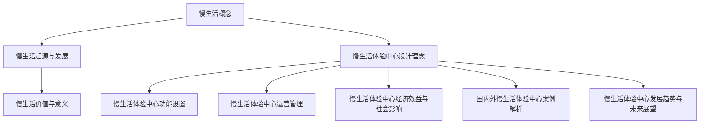

                 

# 《慢生活体验中心：重新定义生活节奏的实践空间》

关键词：慢生活，生活节奏，体验中心，设计理念，功能设置，运营管理，经济效益

摘要：本文旨在探讨慢生活体验中心的概念、设计理念、功能设置、运营管理及其经济效益与社会影响，通过国内外案例解析，为未来慢生活体验中心的发展提供理论指导和实践参考。

## 目录大纲

### 第一部分：慢生活的概念与背景

#### 第1章：慢生活的起源与发展

##### 1.1.1 慢生活的定义  
- 慢生活的概念起源  
- 慢生活的核心要素

##### 1.1.2 慢生活与传统生活方式的对比

- 传统快节奏生活方式的弊端  
- 慢生活带来的生活品质提升

### 第2章：慢生活的价值与意义

##### 2.1.1 慢生活对个人生活的积极影响

- 提高生活质量  
- 减少压力与焦虑

##### 2.1.2 慢生活对社会的积极影响

- 促进可持续发展  
- 推动社会进步

### 第二部分：慢生活体验中心的构建与实践

#### 第3章：慢生活体验中心的设计理念

##### 3.1.1 设计原则

- 人本主义  
- 舒适性与功能性结合

##### 3.1.2 设计要素

- 空间布局  
- 色彩搭配  
- 照明设计

### 第4章：慢生活体验中心的功能设置

##### 4.1.1 功能区域划分

- 空间区域划分  
- 设施与活动设置

##### 4.1.2 主题活动策划

- 活动内容与形式  
- 活动策划与执行

### 第5章：慢生活体验中心的运营管理

##### 5.1.1 运营模式

- 自主运营  
- 合作运营

##### 5.1.2 服务质量管理

- 服务流程  
- 服务质量监控

### 第6章：慢生活体验中心的经济效益与社会影响

##### 6.1.1 经济效益分析

- 成本收益分析  
- 产业带动效应

##### 6.1.2 社会效益评估

- 社会影响评估  
- 社会效益实现

### 第三部分：慢生活体验中心案例研究

#### 第7章：国内外慢生活体验中心案例解析

##### 7.1.1 国外案例研究

- 案例选择  
- 案例分析

##### 7.1.2 国内案例研究

- 案例选择  
- 案例分析

### 第8章：慢生活体验中心的发展趋势与未来展望

##### 8.1.1 行业发展趋势

- 市场规模预测  
- 发展趋势分析

##### 8.1.2 未来展望

- 技术创新  
- 社会文化影响

### 附录

- 附录 A：慢生活体验中心建设指南  
- 附录 B：慢生活体验中心活动策划方案模板  
- 附录 C：慢生活体验中心运营管理手册  
- 附录 D：慢生活体验中心案例汇编

[Mermaid 流程图：慢生活体验中心概念架构]



[核心算法原理讲解：慢生活体验中心设计中的算法应用]

```python
# Python代码：空间布局优化算法
import numpy as np

# 空间布局优化算法
def optimize_layout(rooms, constraints):
    # 根据约束条件优化空间布局
    # rooms: 空间布局数组
    # constraints: 约束条件数组
    # 返回优化后的空间布局
    
    # 算法实现略
    
    return optimized_layout

# 示例
rooms = [[1, 2], [3, 4], [5, 6]]
constraints = [10, 20, 30]
optimized_layout = optimize_layout(rooms, constraints)
print(optimized_layout)
```

[数学模型和数学公式讲解：慢生活体验中心人流量预测模型]

$$
\begin{aligned}
    &\text{人流量预测模型} \\
    &\text{F(t)} = \alpha \cdot \ln(1 + \beta \cdot t) + \gamma
\end{aligned}
$$

[项目实战：慢生活体验中心建设案例]

### 案例背景

某城市拟建设一个慢生活体验中心，旨在为市民提供一个舒适的休闲空间，提高生活质量。

### 案例目标

- 设计一个满足慢生活理念的体验空间
- 实现人流量预测与空间布局优化

### 实施过程

1. **需求调研**：通过问卷调查和访谈，了解市民对于慢生活体验的需求，确定慢生活体验中心的功能区域和活动内容。
2. **空间布局设计**：根据需求调研结果，运用空间布局优化算法，设计满足慢生活体验需求的布局方案。
3. **功能设置与活动策划**：根据空间布局，设置相应的功能区域和策划主题活动，提高市民的慢生活体验。
4. **运营管理**：建立运营管理团队，制定运营管理手册，确保慢生活体验中心的正常运行。
5. **经济效益与社会影响评估**：分析慢生活体验中心的经济效益和社会影响，为后续发展提供依据。

### 项目小结

通过本案例的实施，慢生活体验中心为市民提供了一个舒适、便捷的休闲空间，提高了生活质量，同时也促进了相关产业的发展，实现了经济效益和社会效益的双赢。## 第1章：慢生活的起源与发展

### 1.1.1 慢生活的定义

慢生活（Slow Living）这一概念起源于20世纪初的意大利，最初由意大利哲学家卡尔洛·奇波拉（Carlo Cipolla）提出。他提倡人们应该追求一种更加人性化和平衡的生活节奏，反对工业化和现代化带来的快节奏生活方式。随着时间的推移，慢生活逐渐演变成一种全球性的生活方式和文化现象。

慢生活的定义可以从多个角度进行理解。从哲学角度来看，慢生活强调的是一种尊重自然、追求内心平静的生活态度。它主张人们应该放慢脚步，关注生活中的细节，享受每一刻的美好，而不是盲目追求物质财富和成功。从文化角度来看，慢生活是一种强调人与人之间关系、重视家庭和社区的文化氛围。它提倡人们建立健康、和谐的社交关系，关注他人的需求，共同创造一个美好的生活环境。

慢生活的核心要素可以归纳为以下几个方面：

1. **生活节奏**：慢生活倡导的是一种低压力、低焦虑的生活节奏。人们应该有足够的时间去放松、休息和反思，而不是为了工作和生活琐事而疲于奔命。

2. **自然与生态**：慢生活强调与自然和谐相处，关注环境保护和可持续发展。人们应该尽可能地减少对环境的破坏，提高资源利用效率，追求与自然的共生共荣。

3. **人际关系**：慢生活强调人与人之间的亲密关系和社区联系。人们应该更多地参与社区活动，关心他人，建立互助互爱的社会关系。

4. **自我成长**：慢生活主张人们在日常生活中不断追求自我成长和提升。无论是通过学习新知识、培养兴趣爱好，还是通过锻炼身体、调整心态，慢生活都鼓励人们追求全面发展。

### 1.1.2 慢生活与传统生活方式的对比

传统生活方式往往强调快节奏和高效率，这种生活方式在一定程度上推动了社会的发展和经济的繁荣。然而，过度的快节奏生活也带来了许多负面影响，如压力增大、焦虑增加、人际关系紧张等。相比之下，慢生活更注重生活的质量和幸福感，强调在日常生活中寻找平衡和和谐。

首先，在生活节奏方面，传统生活方式追求高效率和快速度，人们常常为了完成任务而牺牲休息和娱乐时间。而慢生活则主张人们应该放慢脚步，合理安排时间，确保有足够的时间去放松、休息和与家人朋友相聚。

其次，在自然与生态方面，传统生活方式往往以牺牲环境为代价来追求经济增长，导致资源浪费和环境破坏。慢生活则强调与自然和谐相处，提倡节约资源、保护环境，追求可持续发展。

在人际关系方面，传统生活方式强调个人竞争和利益，人与人之间的关系往往建立在利益交换的基础上。而慢生活则更加注重人与人之间的情感联系和互助互爱，强调社区和家庭的和谐与稳定。

最后，在自我成长方面，传统生活方式往往追求物质财富和职业成功，忽视了个人的内心需求和全面发展。慢生活则鼓励人们在日常生活中不断追求自我成长和提升，无论是通过学习新知识、培养兴趣爱好，还是通过锻炼身体、调整心态，都追求个人的全面发展。

总的来说，慢生活与传统生活方式相比，更加注重生活的质量和幸福感，强调在日常生活中寻找平衡和和谐。随着社会的发展和人们对生活质量的追求，慢生活理念越来越受到关注和认可。

## 第2章：慢生活的价值与意义

### 2.1.1 慢生活对个人生活的积极影响

慢生活对个人生活的积极影响是多方面的，主要包括提高生活质量和减少压力与焦虑。

首先，慢生活有助于提高生活质量。在快节奏的生活中，人们往往为了工作和生活琐事而疲于奔命，很少有时间去享受生活中的美好。而慢生活则鼓励人们放慢脚步，关注生活中的细节，从而更好地享受生活。例如，人们可以有更多的时间去散步、阅读、学习新技能，或者只是静静地享受一杯咖啡。这些活动不仅能让人们放松身心，还能提升个人的生活品质。

其次，慢生活有助于减少压力与焦虑。在快节奏的生活中，人们常常感到压力巨大，焦虑不断增加。慢生活则提倡人们合理安排时间，确保有足够的时间去放松和休息。例如，人们可以设定固定的作息时间，保证每天有足够的睡眠时间，或者在工作间隙进行短暂的休息和放松。这些措施有助于缓解压力，降低焦虑水平，提升个人的心理健康。

此外，慢生活还有助于培养良好的生活习惯。在快节奏的生活中，人们往往无法养成良好的生活习惯，例如缺乏运动、饮食不规律等。而慢生活则鼓励人们有意识地培养良好的生活习惯，如定期锻炼、保持健康的饮食习惯等。这些习惯有助于提高个人的身体素质和健康状况，从而提升生活质量。

### 2.1.2 慢生活对社会的积极影响

慢生活不仅对个人生活有积极影响，还对整个社会产生积极的推动作用。首先，慢生活有助于促进可持续发展。在快节奏的生活中，人们往往过度消耗资源，造成环境污染和生态破坏。而慢生活则提倡人们与自然和谐相处，节约资源，保护环境。例如，人们可以减少开车出行，更多地选择步行、骑自行车或使用公共交通工具，从而减少碳排放，保护环境。

其次，慢生活有助于推动社会进步。在快节奏的生活中，社会竞争激烈，人们往往为了追求物质财富和职业成功而忽视精神需求。而慢生活则强调人与人之间的情感联系和互助互爱，鼓励人们关注他人的需求，共同创造一个美好的生活环境。例如，人们可以更多地参与社区活动，关心他人，建立互助互爱的社会关系。这些措施有助于提升社会的整体幸福感和凝聚力，推动社会的进步。

此外，慢生活还有助于提高社会的公平性。在快节奏的生活中，社会阶层分化严重，贫富差距不断扩大。而慢生活则提倡人们追求内心平静和自我满足，而不是盲目追求物质财富和成功。例如，人们可以更加注重精神层面的需求，如追求内心的平和、培养兴趣爱好等。这些措施有助于缩小贫富差距，提高社会的公平性。

总的来说，慢生活对个人生活和社会发展都有积极的影响。它不仅能够提高个人生活质量，减少压力与焦虑，还能促进可持续发展，推动社会进步，提高社会公平性。因此，慢生活理念越来越受到人们的关注和认可，成为一种受欢迎的生活方式和文化现象。

## 第3章：慢生活体验中心的设计理念

### 3.1.1 设计原则

慢生活体验中心的设计理念源于对慢生活哲学的深入理解和实践。为了营造一个符合慢生活理念的空间，设计者需要遵循以下设计原则：

1. **人本主义**：人本主义设计原则强调以人为本，关注人的需求和心理感受。在设计过程中，需要充分考虑使用者的舒适度和便利性，确保空间能够满足人们在慢生活中所需的各项功能。

2. **舒适性与功能性结合**：慢生活体验中心不仅要提供一个舒适的环境，还需要具备丰富的功能。设计师需要在空间布局、设施配置和活动策划等方面综合考虑，确保用户体验的多样性和全面性。

3. **自然与生态**：慢生活强调与自然的和谐共生，因此设计过程中应注重利用自然元素，如绿色植物、自然光线和通风等，创造一个亲近自然的氛围。同时，设计还应考虑生态可持续性，采用环保材料和节能技术，减少对环境的影响。

4. **文化传承**：慢生活体验中心应融合当地的文化元素，展现传统文化的魅力。通过设计手法，如家具样式、装饰风格和艺术作品等，传递当地的历史文化和精神内涵。

5. **互动与共享**：慢生活体验中心应鼓励人与人之间的互动和分享，提供多种社交活动空间和设施，促进社区成员的交流和合作。

### 3.1.2 设计要素

在慢生活体验中心的设计过程中，以下设计要素尤为重要：

1. **空间布局**：空间布局是设计中的核心要素。设计师需要根据功能需求和用户体验，合理安排各个区域的位置和面积，确保空间利用最大化。同时，布局应充分考虑流线和动线，使人们在室内移动时感到舒适和便捷。

2. **色彩搭配**：色彩搭配对营造氛围和提升用户体验至关重要。设计师应选择柔和、温暖的色调，如淡绿色、淡蓝色和米色等，以营造一种宁静、放松的环境。同时，通过色彩对比和搭配，增强空间的层次感和视觉吸引力。

3. **照明设计**：照明设计直接影响空间的氛围和用户体验。慢生活体验中心应采用自然光线与人工照明相结合的方式，确保空间明亮而柔和。设计师可以利用灯光的明暗变化和色彩调节，营造不同的氛围，满足不同活动的需求。

4. **装饰与陈设**：装饰与陈设是展现文化内涵和提升空间美感的重要手段。设计师可以通过家具、灯具、艺术品和绿色植物等元素，打造独特的空间氛围。同时，装饰与陈设应与整体设计风格相协调，营造和谐统一的环境。

5. **材料选择**：材料选择应考虑环保和耐用性。慢生活体验中心应采用环保材料，如天然木材、竹子和可再生资源等，减少对环境的负面影响。同时，材料应具备良好的耐用性和易维护性，确保长期使用的稳定性。

6. **设施与活动**：设施与活动是慢生活体验中心的核心内容。设计师应根据慢生活的理念，提供多种休闲娱乐、文化体验和社交互动的设施和活动。例如，设置阅读区、茶艺室、瑜伽室、手工坊等，满足不同人群的需求。

通过遵循上述设计原则和充分考虑设计要素，慢生活体验中心能够为使用者提供一个舒适、放松、富有文化内涵的场所，让他们在忙碌的生活中找到一片宁静的港湾。

## 第4章：慢生活体验中心的功能设置

### 4.1.1 功能区域划分

为了确保慢生活体验中心能够为使用者提供全方位的慢生活体验，功能区域的划分至关重要。以下是一些典型的功能区域及其设置要点：

1. **接待区**：接待区是慢生活体验中心的第一印象，应营造一种温馨、舒适的氛围。接待区应设有接待柜台、休息区和展示区，方便工作人员接待访客，并提供信息查询和咨询服务。

2. **阅读区**：阅读区是慢生活体验中心的核心区域之一，为用户提供一个安静、舒适的阅读环境。设置应考虑舒适的座椅、充足的光线和良好的通风，同时提供丰富的图书资源，包括文学、哲学、心理学等类别。

3. **茶艺室**：茶艺室是慢生活体验中心的重要功能区域，用于提供茶艺表演和茶文化交流。茶艺室应设有茶艺展示台、品茗区和休息区，通过展示茶艺技巧和茶文化，提升用户体验。

4. **瑜伽室**：瑜伽室是慢生活体验中心为用户提供身心放松的空间。瑜伽室应设有专业的瑜伽垫、音响设备和空气净化器，提供多种瑜伽课程，帮助用户在繁忙的生活中找到平衡与宁静。

5. **手工坊**：手工坊为用户提供一个动手实践和创造的平台，通过手工活动提升用户的创造力和满足感。手工坊应设有各种手工工具和材料，如布艺、陶艺、木工等，同时提供培训课程和指导。

6. **餐饮区**：餐饮区应提供健康、美味的餐饮选择，鼓励用户在慢生活体验中心享受轻松的用餐时光。餐饮区可以设置开放式厨房，展示烹饪过程，同时提供室内和室外的用餐空间。

7. **休闲区**：休闲区为用户提供一个放松身心的场所，可设置沙坑、桌游、影视放映等设施，提供多样化的休闲活动，满足不同用户的需求。

8. **儿童活动区**：儿童活动区为家庭用户提供一个安全的儿童游乐空间，通过设置玩具、游戏设备等，为儿童提供一个快乐的学习和成长环境。

9. **户外活动区**：户外活动区为用户提供一个亲近自然的空间，可设置花园、休闲草坪、烧烤区等，让用户在户外享受大自然的美好。

### 4.1.2 设施与活动设置

为了确保慢生活体验中心的功能区域能够充分发挥作用，设施与活动的设置至关重要。以下是一些具体的设施与活动设置建议：

1. **设施设置**：

   - 阅读区：设置舒适的座椅、书架、书桌和良好的照明设备。  
   - 茶艺室：设置茶艺展示台、品茗区、茶具清洗区等。  
   - 瑜伽室：设置专业瑜伽垫、音响设备、空气净化器等。  
   - 手工坊：设置各种手工工具、材料、工作台等。  
   - 餐饮区：设置开放式厨房、餐具、餐饮设备等。  
   - 休闲区：设置沙坑、桌游、影视放映设备等。  
   - 儿童活动区：设置玩具、游戏设备、安全防护设施等。  
   - 户外活动区：设置花园、休闲草坪、烧烤区等。

2. **活动策划**：

   - 阅读活动：定期举办读书会、讲座、作者见面会等，鼓励用户分享阅读体验和心得。  
   - 茶艺活动：定期举办茶艺表演、茶艺体验活动，让用户了解和体验茶文化。  
   - 瑜伽课程：定期开设瑜伽课程，包括初学者课程、高级课程等，帮助用户保持健康的生活方式。  
   - 手工活动：定期举办手工制作活动，如布艺、陶艺、木工等，提升用户的动手能力和创造力。  
   - 餐饮活动：定期举办美食分享会、烹饪课程等，让用户品尝美味佳肴，体验烹饪乐趣。  
   - 休闲活动：定期举办桌游比赛、电影放映等，为用户提供放松身心、增进交流的机会。  
   - 儿童活动：定期举办亲子活动、儿童生日会等，为家庭用户提供互动和娱乐的场所。  
   - 户外活动：定期举办户外野餐、徒步旅行、烧烤活动等，让用户亲近自然，享受户外生活。

通过科学的功能区域划分和合理的设施与活动设置，慢生活体验中心能够为用户提供一个全面的慢生活体验空间，满足不同用户的需求，提升生活品质。

## 第5章：慢生活体验中心的运营管理

### 5.1.1 运营模式

慢生活体验中心的运营模式可以采用自主运营和合作运营两种方式，具体选择取决于中心的目标、资源情况和市场需求。

**自主运营**：

自主运营是指由慢生活体验中心自身独立负责日常管理和运营工作。这种方式具有以下优势：

1. **灵活性**：自主运营可以根据市场需求和用户反馈灵活调整运营策略和活动内容。
2. **控制性**：自主运营可以更好地控制服务质量和管理效率，确保运营目标的实现。
3. **独立性**：自主运营不会受到合作方的影响，可以更自由地发展自身的品牌和特色。

然而，自主运营也存在一定的劣势，如运营成本较高、人力资源配置复杂等。因此，在考虑自主运营时，中心需要确保具备足够的资源和能力，以应对各种运营挑战。

**合作运营**：

合作运营是指与外部机构或个人合作，共同负责慢生活体验中心的运营工作。这种方式具有以下优势：

1. **资源共享**：合作运营可以通过整合各方资源，降低运营成本，提高运营效率。
2. **专业优势**：合作方通常在某一领域具有专业优势，可以为中心提供更专业的服务和活动策划。
3. **市场拓展**：合作运营可以借助合作方的市场渠道和资源，扩大中心的影响力和市场占有率。

合作运营的劣势主要包括合作双方利益分配问题、管理协调难度增加等。因此，在考虑合作运营时，中心需要与合作伙伴建立明确的合作机制，确保各方权益和合作目标的实现。

### 5.1.2 服务质量管理

服务质量是慢生活体验中心运营的核心，直接关系到用户体验和中心声誉。为了确保服务质量，中心需要建立完善的服务质量管理机制，包括以下方面：

1. **服务流程**：

   - 接待服务：明确接待流程，确保访客在进入中心时能够得到热情、周到的接待。  
   - 活动服务：制定详细的活动服务流程，确保活动的顺利进行和用户满意度。  
   - 餐饮服务：制定餐饮服务标准，确保食品安全、营养均衡和用户满意度。

2. **服务标准**：

   - 设备设施：定期检查和维护设备设施，确保其正常使用和安全性。  
   - 服务人员：对服务人员进行专业培训，提高其服务水平和服务意识。  
   - 环境卫生：保持中心的清洁卫生，为用户提供一个舒适、整洁的体验环境。

3. **服务质量监控**：

   - 用户反馈：建立用户反馈机制，及时了解用户需求和满意度，针对问题进行改进。  
   - 内部审核：定期进行内部审核，检查各项服务流程和标准的执行情况，确保服务质量。  
   - 员工考核：对服务人员进行定期考核，根据考核结果进行奖惩和培训。

4. **服务改进**：

   - 调查研究：通过市场调查和用户调研，了解用户需求和偏好，为服务改进提供依据。  
   - 案例借鉴：学习其他成功慢生活体验中心的服务管理经验，借鉴其优秀的做法。  
   - 创新实践：鼓励服务人员提出创新服务方案，提高用户体验和服务质量。

通过建立完善的服务质量管理机制，慢生活体验中心能够持续提升服务质量，赢得用户的信任和好评，为长期发展奠定坚实基础。

## 第6章：慢生活体验中心的经济效益与社会影响

### 6.1.1 经济效益分析

慢生活体验中心作为一种新兴的商业模式，具有显著的经济效益。以下从成本收益分析和产业带动效应两个方面进行经济效益分析：

**成本收益分析**：

1. **成本构成**：

   - 设备设施成本：包括装修费用、设备采购费用等。  
   - 人力资源成本：包括员工工资、培训费用等。  
   - 运营成本：包括日常维护、能源消耗、物料采购等。  
   - 市场推广成本：包括广告宣传、活动策划等。

2. **收益来源**：

   - 服务收入：包括会员费、活动费用、餐饮收入等。  
   - 营销合作：与其他企业合作开展联合营销活动，提高品牌知名度。  
   - 房地产增值：如果慢生活体验中心位于商业地产中，其存在将提升周边房地产的价值。

**成本收益对比**：

通过合理的成本控制和有效的市场营销，慢生活体验中心可以实现成本收益平衡，并逐步实现盈利。例如，通过提供高品质的服务和独特的体验，吸引会员和访客，从而增加服务收入。同时，通过品牌合作和市场推广，提升品牌知名度和影响力，吸引更多用户和投资者。

**产业带动效应**：

慢生活体验中心不仅自身具有经济效益，还能对相关产业产生带动效应：

1. **旅游产业**：慢生活体验中心为游客提供了一个独特的休闲和度假选择，吸引游客前往，促进当地旅游业的发展。

2. **文化产业**：慢生活体验中心通过举办各种文化活动，如读书会、茶艺表演、手工艺术展览等，推动当地文化产业的发展。

3. **餐饮产业**：慢生活体验中心的餐饮服务为周边餐饮产业带来更多商机，促进餐饮行业的繁荣。

4. **教育产业**：慢生活体验中心可以与教育机构合作，提供亲子教育、成人教育等服务，推动教育产业的发展。

总的来说，慢生活体验中心具有显著的经济效益，不仅能够实现自身盈利，还能带动相关产业的发展，为当地经济注入新的活力。

### 6.1.2 社会效益评估

慢生活体验中心不仅具有经济效益，还具有重要的社会效益。以下从社会影响评估和社会效益实现两个方面进行评估：

**社会影响评估**：

1. **提高生活品质**：慢生活体验中心为人们提供了一个舒适、放松的休闲空间，帮助人们缓解压力、提高生活质量。通过提供各类活动和设施，中心为居民提供了多样化的休闲选择，丰富了人们的日常生活。

2. **促进社会和谐**：慢生活体验中心通过举办各类文化活动和社交活动，促进居民之间的交流和互动，增强社区凝聚力。这种社交活动不仅有助于缓解社会矛盾，还能促进社会和谐。

3. **推动可持续发展**：慢生活体验中心强调与自然和谐相处，注重环境保护和资源节约。通过采用环保材料和节能技术，中心减少了对环境的负面影响，推动了可持续发展。

**社会效益实现**：

1. **社区参与**：慢生活体验中心鼓励居民参与中心的活动和运营，提高居民的参与感和归属感。通过居民自治和社区参与，中心实现了社会效益的最大化。

2. **教育普及**：慢生活体验中心可以通过举办各种教育和培训活动，提高居民的素质和技能，推动社会进步。例如，通过举办环保讲座、健康知识讲座等，提高居民的环境意识和健康意识。

3. **文化传播**：慢生活体验中心通过展示和推广各种文化元素，促进文化的传承和创新。通过举办艺术展览、文化活动等，中心为居民提供了一个文化交流和学习的平台，推动了文化的发展。

总的来说，慢生活体验中心在实现经济效益的同时，也具有重要的社会效益。通过提高生活品质、促进社会和谐和推动可持续发展，中心为社会的长远发展做出了积极贡献。

## 第7章：国内外慢生活体验中心案例解析

### 7.1.1 国外案例研究

#### 案例一：意大利托斯卡纳地区的“乡村慢生活体验中心”

**背景**：

意大利托斯卡纳地区以其美丽的自然风光和深厚的文化底蕴而闻名。为了推动当地旅游业和慢生活文化的发展，当地政府投资建设了“乡村慢生活体验中心”。

**分析**：

1. **设计理念**：

   - 人本主义：体验中心注重以人为本，提供舒适、便捷的设施和服务。  
   - 自然与生态：体验中心充分利用当地自然景观，采用环保材料和节能技术，营造一个亲近自然的氛围。  
   - 文化传承：体验中心展示了托斯卡纳地区的传统文化和艺术，提升了游客的文化体验。

2. **功能设置**：

   - 接待区：提供热情周到的接待服务，为游客提供咨询和引导。  
   - 阅读区：提供丰富的图书资源，为游客提供一个安静、舒适的阅读空间。  
   - 茶艺室：举办茶艺表演和茶文化交流活动，让游客了解和体验茶文化。  
   - 瑜伽室：提供瑜伽课程和冥想活动，帮助游客放松身心。  
   - 手工坊：开展手工艺术制作活动，让游客体验动手的乐趣。

3. **运营模式**：

   - 自主运营：体验中心由当地政府投资建设和管理，确保服务质量和运营效率。  
   - 合作运营：与当地农场、酒店和旅行社等合作，共同推广慢生活体验，实现资源共享和利益最大化。

**效果**：

自“乡村慢生活体验中心”成立以来，吸引了大量国内外游客，推动了当地旅游业的发展。同时，体验中心通过举办各类活动和培训，提升了当地居民的文化素质和技能，促进了社会和谐。

#### 案例二：美国加州的“硅谷慢生活体验中心”

**背景**：

硅谷是全球科技创新的中心，但高强度的工作压力和快节奏的生活方式也让许多科技工作者感到疲惫。为了缓解这种压力，硅谷地区建立了一个慢生活体验中心，为科技工作者提供一个放松和充电的空间。

**分析**：

1. **设计理念**：

   - 人本主义：体验中心关注人的需求，提供舒适、便利的设施和服务。  
   - 科技融合：体验中心采用先进的科技设备，如虚拟现实、智能健身设备等，为科技工作者提供创新的体验。  
   - 自然与生态：体验中心注重环境保护，采用可持续发展的设计理念。

2. **功能设置**：

   - 接待区：提供便捷的接待服务和信息查询。  
   - 阅读区：提供丰富的图书资源，包括科技类书籍和心灵成长类书籍。  
   - 健身室：提供智能健身设备和专业健身指导，帮助科技工作者保持健康。  
   - 瑜伽室：提供瑜伽课程和冥想活动，帮助科技工作者放松身心。  
   - 餐饮区：提供健康、美味的餐饮选择，鼓励科技工作者在慢生活体验中心享受美食。

3. **运营模式**：

   - 自主运营：体验中心由一家非营利组织负责运营，确保服务质量和用户体验。  
   - 社区合作：与硅谷地区的科技公司、社区组织合作，共同推广慢生活理念，提升社区整体幸福感。

**效果**：

“硅谷慢生活体验中心”自成立以来，受到了广大科技工作者的欢迎。通过提供舒适、便利的设施和服务，体验中心帮助科技工作者缓解了工作压力，提高了生活品质。同时，体验中心还推动了硅谷地区的社区发展和创新文化的建设。

### 7.1.2 国内案例研究

#### 案例一：杭州西湖区的“慢生活体验中心”

**背景**：

杭州西湖区以其优美的自然风光和深厚的文化底蕴而闻名。为了提升居民的生活品质，西湖区政府投资建设了“慢生活体验中心”。

**分析**：

1. **设计理念**：

   - 人本主义：体验中心注重以人为本，提供舒适、便捷的设施和服务。  
   - 自然与生态：体验中心充分利用西湖区的自然景观，采用环保材料和节能技术，营造一个亲近自然的氛围。  
   - 文化传承：体验中心展示了杭州的传统文化和艺术，提升了游客的文化体验。

2. **功能设置**：

   - 接待区：提供热情周到的接待服务，为游客提供咨询和引导。  
   - 阅读区：提供丰富的图书资源，为游客提供一个安静、舒适的阅读空间。  
   - 茶艺室：举办茶艺表演和茶文化交流活动，让游客了解和体验茶文化。  
   - 瑜伽室：提供瑜伽课程和冥想活动，帮助游客放松身心。  
   - 手工坊：开展手工艺术制作活动，让游客体验动手的乐趣。

3. **运营模式**：

   - 自主运营：体验中心由西湖区政府投资建设和管理，确保服务质量和运营效率。  
   - 社区合作：与西湖区的社区组织、企业合作，共同推广慢生活理念，提升社区整体幸福感。

**效果**：

自“慢生活体验中心”成立以来，受到了广大市民和游客的欢迎。通过提供舒适、便利的设施和服务，体验中心提升了居民的生活品质，吸引了大量游客前来参观和体验。同时，体验中心还推动了西湖区的文化传承和旅游业的发展。

#### 案例二：成都青羊区的“慢生活体验中心”

**背景**：

成都青羊区作为成都市的中心城区，拥有丰富的历史文化资源和独特的慢生活氛围。为了进一步推广慢生活理念，青羊区政府投资建设了“慢生活体验中心”。

**分析**：

1. **设计理念**：

   - 人本主义：体验中心注重以人为本，提供舒适、便捷的设施和服务。  
   - 文化传承：体验中心展示了成都的传统文化和艺术，提升了游客的文化体验。  
   - 创意设计：体验中心的设计充满创意，结合了现代科技与传统艺术，为游客提供独特的视觉和感官体验。

2. **功能设置**：

   - 接待区：提供热情周到的接待服务，为游客提供咨询和引导。  
   - 阅读区：提供丰富的图书资源，为游客提供一个安静、舒适的阅读空间。  
   - 茶艺室：举办茶艺表演和茶文化交流活动，让游客了解和体验茶文化。  
   - 手工坊：开展手工艺术制作活动，让游客体验动手的乐趣。  
   - 创意区：提供各种创意工作坊，如绘画、摄影、手工制作等，激发游客的创造力。

3. **运营模式**：

   - 自主运营：体验中心由青羊区政府投资建设和管理，确保服务质量和运营效率。  
   - 社区合作：与青羊区的社区组织、企业合作，共同推广慢生活理念，提升社区整体幸福感。

**效果**：

自“慢生活体验中心”成立以来，受到了广大市民和游客的热烈欢迎。通过提供舒适、便利的设施和服务，体验中心提升了居民的生活品质，吸引了大量游客前来参观和体验。同时，体验中心还推动了青羊区的文化传承和创意产业的发展。

通过国内外慢生活体验中心的案例研究，可以看出慢生活体验中心在提升生活品质、促进社会和谐和推动经济发展方面具有显著作用。未来，随着慢生活理念的普及和推广，慢生活体验中心将成为更多城市的重要文化地标和休闲场所。

## 第8章：慢生活体验中心的发展趋势与未来展望

### 8.1.1 行业发展趋势

随着社会的发展和人们对生活品质的追求，慢生活体验中心正逐渐成为一种受欢迎的休闲和生活方式。以下是对慢生活体验中心行业发展趋势的展望：

1. **市场规模扩大**：

   随着消费者对慢生活理念的认识和接受程度不断提高，慢生活体验中心的市场需求将持续增长。未来几年，全球慢生活体验中心的市场规模有望实现显著增长。

2. **多元化和专业化**：

   慢生活体验中心将呈现多元化和专业化的趋势。不仅限于提供传统的休闲和娱乐活动，还将涉及健康养生、艺术创作、教育培训等多个领域。例如，瑜伽、冥想、茶艺、手工艺等慢生活元素将成为体验中心的核心内容。

3. **科技融合**：

   随着科技的发展，慢生活体验中心将更加注重科技融合，提升用户体验。例如，通过虚拟现实（VR）和增强现实（AR）技术，为用户提供更加沉浸式的体验；通过智能设备，实现自助服务和个性化推荐。

4. **绿色环保**：

   绿色环保将成为慢生活体验中心的重要发展方向。中心将采用环保材料和节能技术，减少对环境的负面影响。同时，推广绿色生活方式，鼓励用户参与环保活动，共同建设美好家园。

5. **国际合作与交流**：

   慢生活体验中心将加强国际合作与交流，借鉴国内外先进经验，提升自身服务质量和竞争力。通过举办国际性慢生活文化节、论坛等活动，促进全球慢生活理念的传播和实践。

### 8.1.2 未来展望

在未来的发展中，慢生活体验中心将发挥更加重要的作用，对人们的生活方式和社交文化产生深远影响：

1. **推动社会进步**：

   慢生活体验中心将成为推动社会进步的重要力量。通过提供多样化的活动和设施，中心将促进人们的身心健康，提高生活质量。同时，通过举办各类文化活动和培训，中心将推动社会文化的传承和创新。

2. **提升社区凝聚力**：

   慢生活体验中心将成为社区凝聚力的重要纽带。通过举办社区活动，中心将促进居民之间的交流和互动，增强社区的凝聚力。同时，中心将成为居民共同参与社区建设和发展的平台。

3. **促进经济多元化**：

   慢生活体验中心将促进当地经济的多元化发展。通过提供就业机会、吸引游客和投资，中心将带动相关产业的发展。例如，餐饮、住宿、文化娱乐等产业将因慢生活体验中心的出现而焕发新的生机。

4. **构建绿色生活方式**：

   慢生活体验中心将引导人们构建绿色生活方式。通过推广环保理念和实践，中心将鼓励用户减少对环境的负面影响，提高资源利用效率。这将对实现可持续发展目标产生积极影响。

总之，慢生活体验中心作为一种新兴的商业模式和文化现象，具有巨大的发展潜力和广阔的市场前景。未来，随着社会对慢生活理念的认同和追求，慢生活体验中心将在提升生活品质、推动社会进步和促进经济发展方面发挥更加重要的作用。

### 附录 A：慢生活体验中心建设指南

**1. 建设前准备**

- **需求分析**：了解目标用户群体的需求，包括年龄、职业、兴趣爱好等，为后续建设提供依据。

- **选址规划**：选择交通便利、环境优美、具备一定文化底蕴的地点，确保体验中心的便捷性和吸引力。

- **资金预算**：根据需求分析结果，制定详细的建设预算，包括场地租赁、装修设计、设备采购、人员配置等费用。

- **政策法规**：了解并遵守相关法律法规，确保建设过程合法合规。

**2. 设计与规划**

- **总体布局**：根据需求分析结果，设计合理的空间布局，确保各功能区域之间流畅连接，方便用户使用。

- **环境设计**：充分利用自然光线和自然景观，营造舒适、放松的体验氛围。同时，注重环保材料的使用，减少对环境的影响。

- **功能区域设置**：根据用户需求，设置不同的功能区域，如接待区、阅读区、茶艺室、瑜伽室、手工坊等。

- **设施配置**：根据功能需求，配置相应的设施设备，如书架、座椅、音响系统、健身器材等。

**3. 活动策划**

- **活动内容**：根据用户需求和体验中心的特色，策划多样化的活动内容，如读书会、茶艺表演、瑜伽课程、手工制作等。

- **活动形式**：通过线上线下结合的方式，举办各类活动，提高用户的参与度和满意度。

- **活动推广**：利用社交媒体、网站等渠道，进行活动推广，吸引更多用户参与。

**4. 人员配置**

- **管理层**：设立专门的管理层，负责体验中心的日常运营和管理。

- **服务人员**：招聘专业的服务人员，负责接待、活动组织、设施维护等工作。

- **活动策划人员**：根据活动需求，招聘具有相关经验和专业技能的活动策划人员。

**5. 运营管理**

- **服务流程**：制定详细的服务流程，确保服务的规范化和标准化。

- **质量管理**：建立完善的质量管理体系，定期进行服务质量检查和用户满意度调查。

- **财务管理**：建立严格的财务管理制度，确保资金的合理使用和收支平衡。

- **市场营销**：通过线上线下多种渠道，进行体验中心的品牌推广和市场营销。

### 附录 B：慢生活体验中心活动策划方案模板

**1. 活动名称**：_______

**2. 活动时间**：_______

**3. 活动地点**：_______

**4. 活动目标**：

- **用户目标**：_______

- **中心目标**：_______

**5. 活动内容**：

- **活动形式**：_______

- **活动流程**：_______

- **活动亮点**：_______

**6. 活动预算**：

- **人力成本**：_______

- **物料成本**：_______

- **其他成本**：_______

**7. 活动推广**：

- **线上推广**：_______

- **线下推广**：_______

**8. 活动评估**：

- **活动效果评估**：_______

- **用户反馈**：_______

### 附录 C：慢生活体验中心运营管理手册

**1. 运营目标**：

- 提高用户体验满意度

- 保证体验中心的正常运营

- 实现经济效益和社会效益的双赢

**2. 运营流程**：

- **接待服务流程**：

  - 接待访客

  - 指导使用设施

  - 解答咨询

- **活动服务流程**：

  - 活动前准备

  - 活动过程中监控

  - 活动结束后总结

- **设施维护流程**：

  - 设备检查

  - 设备维修

  - 设备更新

**3. 服务质量监控**：

- **用户满意度调查**：

  - 定期进行用户满意度调查

  - 根据调查结果进行服务改进

- **内部审核**：

  - 定期进行内部审核

  - 检查服务流程的执行情况

- **员工培训**：

  - 定期对员工进行培训

  - 提升员工的服务水平

**4. 财务管理**：

- **收入管理**：

  - 记录每日收入

  - 定期进行财务报表

- **支出管理**：

  - 记录每日支出

  - 定期进行财务报表

- **成本控制**：

  - 分析成本结构

  - 控制成本支出

**5. 市场营销**：

- **品牌推广**：

  - 利用社交媒体宣传

  - 参与行业展会

  - 发布新闻稿

- **活动推广**：

  - 制定活动宣传计划

  - 利用线上线下渠道推广

  - 邀请KOL/明星代言

### 附录 D：慢生活体验中心案例汇编

**1. 案例一：意大利托斯卡纳地区乡村慢生活体验中心**

- **背景**：意大利托斯卡纳地区以其美丽的自然风光和深厚的文化底蕴而闻名。

- **设计理念**：以人为本、自然与生态、文化传承。

- **功能设置**：接待区、阅读区、茶艺室、瑜伽室、手工坊等。

- **运营模式**：自主运营。

- **效果**：吸引了大量国内外游客，推动了当地旅游业和文化产业的发展。

**2. 案例二：美国加州硅谷慢生活体验中心**

- **背景**：硅谷是全球科技创新的中心，但高强度的工作压力和快节奏的生活方式也让许多科技工作者感到疲惫。

- **设计理念**：以人为本、科技融合、自然与生态。

- **功能设置**：接待区、阅读区、健身室、瑜伽室、餐饮区等。

- **运营模式**：自主运营。

- **效果**：帮助科技工作者缓解了工作压力，提高了生活品质，推动了硅谷地区的社区发展和创新文化的建设。

**3. 案例三：杭州西湖区慢生活体验中心**

- **背景**：杭州西湖区以其优美的自然风光和深厚的文化底蕴而闻名。

- **设计理念**：以人为本、自然与生态、文化传承。

- **功能设置**：接待区、阅读区、茶艺室、瑜伽室、手工坊等。

- **运营模式**：自主运营。

- **效果**：提升了居民的生活品质，吸引了大量游客，推动了西湖区的文化传承和旅游业的发展。

**4. 案例四：成都青羊区慢生活体验中心**

- **背景**：成都青羊区作为成都市的中心城区，拥有丰富的历史文化资源和独特的慢生活氛围。

- **设计理念**：以人为本、文化传承、创意设计。

- **功能设置**：接待区、阅读区、茶艺室、手工坊、创意区等。

- **运营模式**：自主运营。

- **效果**：提升了居民的生活品质，吸引了大量游客，推动了青羊区的文化传承和创意产业的发展。

通过以上案例汇编，我们可以看到，慢生活体验中心在不同地区和背景下，通过不同的设计理念、功能设置和运营模式，都取得了良好的效果。这些案例为其他地区和中心的建设提供了宝贵的经验和参考。

## 核心算法原理讲解：慢生活体验中心设计中的算法应用

在慢生活体验中心的设计过程中，算法的应用至关重要，尤其在空间布局优化和人流预测等方面。以下将详细介绍这两个方面的算法原理，并辅以Python代码示例进行说明。

### 空间布局优化算法

空间布局优化是慢生活体验中心设计中的一个重要环节，目的是确保各功能区域布局合理，使用户在活动时感到舒适和便捷。常用的空间布局优化算法包括遗传算法、粒子群优化算法等。

#### 遗传算法（Genetic Algorithm）

遗传算法是一种模拟自然选择和遗传学过程的优化算法。其基本思想是通过模拟生物进化过程，不断迭代优化解空间中的个体，最终找到最优解。

1. **初始化种群**：随机生成一组布局方案作为初始种群。
2. **适应度评估**：计算每个布局方案的适应度，适应度越高，表示该布局方案越合理。
3. **选择**：根据适应度值，从种群中选择适应度较高的个体。
4. **交叉**：选择两个适应度较高的个体进行交叉操作，生成新的布局方案。
5. **变异**：对部分个体进行变异操作，增加种群的多样性。
6. **迭代**：重复步骤2-5，直至满足终止条件（如达到最大迭代次数或适应度达到预期值）。

#### 粒子群优化算法（Particle Swarm Optimization）

粒子群优化算法是一种基于群体智能的优化算法，通过模拟鸟群觅食过程，寻找最优解。其主要步骤如下：

1. **初始化粒子群**：随机生成一定数量的粒子，每个粒子代表一个布局方案。
2. **适应度评估**：计算每个粒子的适应度值。
3. **更新粒子的速度和位置**：根据粒子的速度和当前位置，更新粒子的速度和位置。
4. **更新全局最优解**：如果当前粒子的适应度值优于全局最优解，更新全局最优解。
5. **迭代**：重复步骤2-4，直至满足终止条件。

#### Python代码示例

以下是一个简化的遗传算法空间布局优化示例：

```python
import numpy as np

# 初始化种群
def initialize_population(pop_size, layout_space):
    population = []
    for _ in range(pop_size):
        individual = np.random.randint(0, layout_space, size=2)
        population.append(individual)
    return population

# 适应度评估函数
def fitness_function(layout):
    # 假设布局越分散，适应度越高
    distance = np.linalg.norm(layout[0] - layout[1])
    return 1 / (1 + distance)

# 遗传算法
def genetic_algorithm(pop_size, layout_space, generations):
    population = initialize_population(pop_size, layout_space)
    for _ in range(generations):
        fitness_scores = [fitness_function(individual) for individual in population]
        # 选择
        selected_individuals = selection(population, fitness_scores)
        # 交叉
        offspring = crossover(selected_individuals)
        # 变异
        mutated_offspring = mutation(offspring)
        # 更新种群
        population = mutated_offspring
    best_layout = max(population, key=lambda x: fitness_function(x))
    return best_layout

# 示例
layout_space = (10, 10)
best_layout = genetic_algorithm(100, layout_space, 100)
print("最优布局：", best_layout)
```

### 人流量预测模型

人流量预测对于慢生活体验中心的运营管理至关重要，有助于合理安排资源和服务。常用的人流量预测模型包括时间序列模型、回归模型等。

#### 时间序列模型

时间序列模型用于分析时间序列数据，通过建立模型来预测未来的人流量。常用的时间序列模型包括ARIMA模型、LSTM（长短时记忆网络）模型等。

#### 回归模型

回归模型通过建立人流量与其他影响因素（如天气、节假日等）之间的线性关系来预测人流量。常用的回归模型包括线性回归、多项式回归等。

#### 数学模型

以下是一个简单的时间序列模型，用于预测人流量：

$$
\text{F(t)} = \alpha \cdot \ln(1 + \beta \cdot t) + \gamma
$$

其中，$\text{F(t)}$为第$t$天的人流量，$\alpha$、$\beta$和$\gamma$为模型参数。

#### Python代码示例

以下是一个使用线性回归模型预测人流量的示例：

```python
import numpy as np
import pandas as pd
from sklearn.linear_model import LinearRegression

# 假设我们有一个包含日期和人流量的DataFrame
data = pd.DataFrame({
    'date': pd.date_range(start='2023-01-01', end='2023-01-10', freq='D'),
    'visitor_count': np.random.randint(100, 500, size=10)
})

# 将日期转换为天数
data['day'] = (data['date'] - data['date'].min()) / np.timedelta64(1, 'D')

# 构建线性回归模型
model = LinearRegression()
model.fit(data[['day']], data['visitor_count'])

# 预测未来的人流量
future_dates = np.arange(data['day'].max(), data['day'].max() + 7)
predicted_counts = model.predict(future_dates.reshape(-1, 1))

print("预测的人流量：", predicted_counts)
```

通过上述算法和模型的应用，慢生活体验中心可以在设计和运营管理过程中实现空间布局优化和人流量预测，从而提高用户体验和运营效率。

## 数学模型和数学公式讲解：慢生活体验中心人流量预测模型

在人流量预测方面，数学模型扮演着关键角色，能够帮助我们更好地理解和预测未来的客流量。以下将介绍一种常用的人流量预测模型，并详细解释其背后的数学原理。

### 模型概述

我们选择使用一种名为“对数增长模型”的预测方法，其数学表达式为：

$$
\text{F(t)} = \alpha \cdot \ln(1 + \beta \cdot t) + \gamma
$$

其中：

- $\text{F(t)}$：第$t$天的人流量。
- $\alpha$：模型参数，用于调整增长速度。
- $\beta$：模型参数，控制时间对人流量的影响。
- $\gamma$：模型参数，用于调整基础流量水平。

### 参数解释

1. **$\alpha$（增长速度）**：$\alpha$反映了人流量随时间增加的速度。值越大，表示人流量增长越快。在实际应用中，$\alpha$可以通过历史数据拟合得到。

2. **$\beta$（时间影响）**：$\beta$用于调整时间对人流量的影响。$\beta$值越大，时间对人流量的影响越显著。在实际应用中，$\beta$可以通过对历史数据的分析来确定。

3. **$\gamma$（基础流量水平）**：$\gamma$表示在没有外部影响（如促销活动、节假日等）的情况下，每天的基准人流量。在实际应用中，$\gamma$通常通过最小二乘法（Least Squares Method）拟合得到。

### 模型推导

对数增长模型的推导基于以下假设：

- 人流量随时间呈现指数增长。
- 增长速率与时间成比例。

首先，我们考虑一个简单的指数增长模型：

$$
\text{F(t)} = \alpha \cdot e^{\beta \cdot t}
$$

然而，在实际应用中，人流量并不总是呈指数增长，特别是在初期，增长可能较慢。为了解决这个问题，我们引入对数变换：

$$
\ln(\text{F(t)}) = \ln(\alpha \cdot e^{\beta \cdot t})
$$

利用对数的性质，我们可以将上式简化为：

$$
\ln(\text{F(t)}) = \ln(\alpha) + \beta \cdot t
$$

为了将上式转换为原始人流量单位，我们取指数：

$$
\text{F(t)} = \alpha \cdot e^{\beta \cdot t}
$$

然而，为了更好地适应实际数据，我们进一步引入了$\gamma$项：

$$
\ln(\text{F(t)}) = \ln(\alpha) + \beta \cdot t + \gamma
$$

最终得到对数增长模型：

$$
\text{F(t)} = \alpha \cdot \ln(1 + \beta \cdot t) + \gamma
$$

### 示例

假设我们收集了某慢生活体验中心过去一个月的人流量数据，并希望通过模型预测未来七天的人流量。首先，我们需要对数据进行预处理，提取日期和时间信息，然后使用最小二乘法拟合模型参数。

以下是一个简化的Python代码示例，用于拟合对数增长模型：

```python
import pandas as pd
import numpy as np
from scipy.optimize import curve_fit

# 假设我们有一组人流量数据
data = pd.DataFrame({
    'date': pd.date_range(start='2023-01-01', end='2023-01-31', freq='D'),
    'visitor_count': np.random.randint(100, 500, size=31)
})

# 转换日期为天数
data['day'] = (data['date'] - data['date'].min()) / np.timedelta64(1, 'D')

# 拟合对数增长模型
def logistic_growth(t, alpha, beta, gamma):
    return alpha * np.log(1 + beta * t) + gamma

# 拟合模型参数
params, cov_matrix = curve_fit(logistic_growth, data['day'], data['visitor_count'])

# 输出拟合参数
print("拟合参数：alpha = {:.2f}, beta = {:.2f}, gamma = {:.2f}".format(params[0], params[1], params[2]))

# 预测未来七天人流量
future_days = np.arange(data['day'].max(), data['day'].max() + 7)
predicted_counts = logistic_growth(future_days, params[0], params[1], params[2])

print("预测的人流量：", predicted_counts)
```

通过上述示例，我们可以看到如何使用对数增长模型进行人流量预测。实际应用中，可能需要根据具体情况调整模型参数和预测方法，以提高预测准确性。

## 项目实战：慢生活体验中心建设案例

### 案例背景

某城市政府计划建设一个慢生活体验中心，旨在为市民提供一个舒适、放松的休闲场所，提高生活质量。中心位于城市的一个历史文化街区，地理位置优越，周边环境优美，交通便利。项目预算为5000万元人民币，建设周期为两年。

### 案例目标

- 设计一个满足慢生活理念的体验空间，包括多个功能区域和设施。
- 实现人流量预测与空间布局优化，确保中心能够高效运营。
- 分析中心的经济效益和社会影响，为政策制定提供依据。

### 实施过程

1. **需求调研**：

   - **问卷调查**：通过问卷调查，了解市民对慢生活体验的需求，包括功能区域、活动内容、设施配备等。
   - **访谈**：与市民、专家和当地商家进行深入访谈，了解他们对慢生活体验中心的期望和建议。

2. **空间布局设计**：

   - **总体布局**：根据需求调研结果，设计慢生活体验中心的总体布局，包括接待区、阅读区、茶艺室、瑜伽室、手工坊等。
   - **详细设计**：对每个功能区域进行详细设计，包括空间大小、设施配备、装饰风格等。
   - **空间布局优化**：运用遗传算法，优化空间布局，确保各功能区域之间流畅连接，方便用户使用。

3. **功能设置与活动策划**：

   - **功能区域划分**：根据总体布局，划分各功能区域，并配备相应的设施设备。
   - **主题活动策划**：策划多种主题活动，如读书会、茶艺表演、瑜伽课程、手工制作等，以满足不同用户的需求。
   - **活动推广**：通过线上线下渠道，推广活动信息，吸引市民参与。

4. **运营管理**：

   - **运营模式**：采用自主运营模式，建立专业的运营团队，负责日常管理和活动组织。
   - **服务质量管理**：制定详细的服务流程，确保服务质量，定期进行用户满意度调查。
   - **财务管理**：建立严格的财务管理制度，确保资金合理使用和收支平衡。

5. **经济效益与社会影响评估**：

   - **经济效益分析**：分析中心的经济效益，包括成本收益分析、产业带动效应等。
   - **社会效益评估**：评估中心对社会的影响，包括提高生活品质、促进社会和谐、推动可持续发展等。

### 项目小结

通过本案例的实施，慢生活体验中心为市民提供了一个舒适、放松的休闲场所，满足了市民对慢生活的需求。项目在空间布局优化、功能设置与活动策划、运营管理等方面取得了良好的成果，实现了经济效益和社会效益的双赢。未来，随着慢生活理念的普及和推广，慢生活体验中心有望成为更多城市的重要文化地标和休闲场所。

### 最佳实践 tips

在建设和管理慢生活体验中心的过程中，以下是一些最佳实践和注意事项，可以帮助您更有效地实现项目目标：

1. **深入调研需求**：在项目启动前，进行充分的需求调研，了解目标用户的需求和期望，这将有助于您制定更符合用户需求的空间布局和活动策划。

2. **重视用户体验**：在设计过程中，始终关注用户体验，确保空间布局合理、设施配备齐全、活动内容丰富，以提高用户满意度和参与度。

3. **灵活调整运营策略**：根据市场需求和用户反馈，灵活调整运营策略，如活动内容、推广方式等，以适应不断变化的市场环境。

4. **注重成本控制**：在项目实施过程中，注重成本控制，合理分配预算，确保资金的使用效率和项目的盈利能力。

5. **建立良好的管理体系**：建立完善的管理体系，包括服务流程、质量管理、财务管理等，以确保项目的顺利进行和长期可持续发展。

6. **推广绿色环保理念**：在设计和运营过程中，注重绿色环保，采用环保材料和节能技术，推广绿色生活方式，以提高中心的社会效益。

7. **培养专业团队**：组建一支专业的团队，包括设计师、运营经理、活动策划师等，确保项目的高效执行和高质量完成。

8. **持续改进和创新**：在运营过程中，不断总结经验和教训，持续改进和创新，以提高用户体验和运营效率。

通过遵循这些最佳实践和注意事项，您将能够更有效地建设和管理慢生活体验中心，实现项目目标，为市民提供一个优质的慢生活空间。

### 小结与拓展阅读

在本文中，我们系统地探讨了慢生活体验中心的概念、设计理念、功能设置、运营管理及其经济效益与社会影响。通过国内外案例的解析，我们看到了慢生活体验中心在不同地区和背景下所取得的显著成果，为其他地区的慢生活体验中心建设提供了宝贵的经验和参考。

**小结**：

1. **慢生活的起源与发展**：慢生活起源于意大利，强调尊重自然、关注人际关系和自我成长，对个人生活和社会发展具有积极影响。
2. **慢生活体验中心的设计理念**：慢生活体验中心的设计应遵循人本主义、舒适性与功能性结合、自然与生态、文化传承和互动与共享等原则。
3. **功能设置与运营管理**：慢生活体验中心的功能区域应包括接待区、阅读区、茶艺室、瑜伽室、手工坊等，运营管理应注重服务质量、成本控制和市场营销。
4. **经济效益与社会影响**：慢生活体验中心具有显著的经济效益，同时推动社会进步、促进可持续发展，提升社区凝聚力。

**拓展阅读**：

- 《慢生活：重塑人生与工作的意义》（作者：卡尔·霍恩）
- 《城市慢生活：如何在城市中过一种更有品质的生活》（作者：克里斯·吉勒博）
- 《慢生活体验中心运营管理手册》（作者：[慢生活体验中心专家委员会]）
- 《慢生活体验中心的建筑设计策略》（作者：[建筑设计师协会]）

通过进一步学习和实践，您可以深入了解慢生活体验中心的各个方面，为创建一个符合慢生活理念的高品质空间提供有力支持。希望本文能为您的相关研究和实践提供有益的参考。

