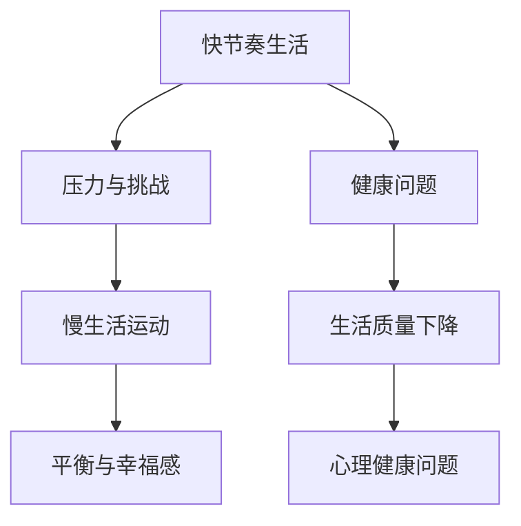

                 

### 《慢生活运动：在快节奏世界中寻找平衡》

> 关键词：慢生活运动、时间管理、心理健康、生活方式、工作效率、平衡、幸福

> 摘要：本文深入探讨了慢生活运动的起源、发展及其在快节奏世界中的重要性。通过分析慢生活运动的核心实践，如时间管理策略、生活方式的调整以及技术使用的减少干扰，本文为读者提供了一步一步实践慢生活的方法和策略，旨在帮助大家在快节奏的生活中找到平衡，提高工作效率，提升生活质量。

---

# 《慢生活运动：在快节奏世界中寻找平衡》目录大纲

## 第一部分：慢生活运动的起源与发展

### 第1章：慢生活的概念与历史

### 第2章：快节奏世界中的压力与挑战

## 第二部分：慢生活运动的核心实践

### 第3章：时间管理策略

### 第4章：生活方式的调整

### 第5章：工作与生活的平衡

### 第6章：技术使用与减少干扰

## 第三部分：慢生活运动的实际案例与启示

### 第7章：慢生活运动中的成功案例

### 第8章：如何在快节奏生活中实践慢生活运动

## 附录：慢生活运动资源与工具

---

## 核心概念与联系

### 慢生活运动与快节奏生活的关系

在快节奏的现代生活中，人们面临着巨大的工作压力、生活节奏加快以及高度的信息过载。这些因素共同导致了身体和心理健康问题，例如慢性疲劳、焦虑和抑郁。慢生活运动正是为了应对这些问题而兴起的一种生活理念。

慢生活运动与快节奏生活之间的关系可以用以下流程图来表示：



**Mermaid 流程图解释：**

- **快节奏生活**：现代生活中常见的工作压力、生活节奏快和信息过载。
- **压力与挑战**：快节奏生活带来的身体和心理上的压力和挑战。
- **慢生活运动**：一种旨在平衡生活节奏，减轻压力，提升生活质量的理念和实践。
- **平衡与幸福感**：通过慢生活运动，人们能够找到生活的平衡，提高幸福感。
- **健康问题**：长期快节奏生活可能导致身体健康问题，如慢性疲劳、高血压等。
- **生活质量下降**：生活质量下降可能进一步引发心理健康问题。
- **心理健康问题**：长期的压力和不良生活方式可能导致焦虑、抑郁等心理健康问题。

通过这种关系图，我们可以清晰地看到慢生活运动是如何在快节奏世界中发挥作用的，以及它对个人生活质量的提升有何影响。

---

## 核心算法原理讲解

### 如何实现时间管理策略

时间管理是慢生活运动的核心实践之一，尤其是在快节奏的世界中，有效的管理时间可以帮助我们提高工作效率，减少压力，实现工作与生活的平衡。以下是一个简单但实用的Python代码示例，用于实现时间管理策略。

```python
# 导入必要的库
from datetime import datetime, timedelta

# 设定每天的工作时间
daily_work_hours = 8

# 计算每天的工作时长（秒）
work_duration_seconds = daily_work_hours * 3600

# 当前时间
now = datetime.now()

# 设定工作时间开始和结束时间
start_time = now
end_time = start_time + timedelta(seconds=work_duration_seconds)

# 输出工作时间
print(f"今日工作开始时间: {start_time.strftime('%Y-%m-%d %H:%M')}")
print(f"今日工作结束时间: {end_time.strftime('%Y-%m-%d %H:%M')}")
```

**数学模型和公式**

时间管理中的关键数学公式如下：

$$
\text{工作时间} = \text{每天的工作时长（小时）} \times 3600 \text{（秒/小时）}
$$

### 举例说明

假设某人每天需要工作8小时，我们可以使用上述公式和代码来计算他的每日工作时间和休息时间。

- **每天的工作时长（秒）**：

$$
\text{工作时长} = 8 \text{小时} \times 3600 \text{秒/小时} = 28800 \text{秒}
$$

- **Python 代码实现**：

```python
# 导入必要的库
from datetime import datetime, timedelta

# 设定每天的工作时间
daily_work_hours = 8

# 计算每天的工作时长（秒）
work_duration_seconds = daily_work_hours * 3600

# 当前时间
now = datetime.now()

# 设定工作时间开始和结束时间
start_time = now
end_time = start_time + timedelta(seconds=work_duration_seconds)

# 输出工作时间
print(f"今日工作开始时间: {start_time.strftime('%Y-%m-%d %H:%M')}")
print(f"今日工作结束时间: {end_time.strftime('%Y-%m-%d %H:%M')}")
```

运行上述代码，我们可以得到：

- **今日工作开始时间**：当前时间的凌晨00:00
- **今日工作结束时间**：8小时后的凌晨08:00

这样，我们就可以根据设定的工作时间来安排每天的工作和休息，从而实现更高效的时间管理。

---

## 数学模型和数学公式 & 详细讲解 & 举例说明

### 时间管理中的关键数学公式

在时间管理中，关键公式包括：

$$
\text{工作效率} = \frac{\text{完成的工作量}}{\text{工作时间}}
$$

这个公式帮助我们评估在给定的时间内，个人或团队能够完成多少工作量。通过优化工作时间，我们可以提高工作效率。

### 举例说明

假设一个团队在一天内完成了100个任务，而他们每天工作8小时，我们可以使用上述公式来计算他们的工作效率。

- **完成的工作量**：100个任务
- **工作时间**：8小时

$$
\text{工作效率} = \frac{100}{8} = 12.5 \text{个任务/小时}
$$

这意味着团队在每小时内平均完成了12.5个任务。

### 代码实现

我们可以使用Python来编写一个简单的程序，计算工作效率：

```python
# 导入必要的库
from datetime import datetime, timedelta

# 设定每天的工作时间和完成的工作量
daily_work_hours = 8
tasks_completed = 100

# 计算工作效率
work_rate = tasks_completed / daily_work_hours

# 输出结果
print(f"工作效率：{work_rate:.2f} 个任务/小时")
```

运行这段代码，我们将得到团队的工作效率。

- **输出结果**：工作效率：12.50 个任务/小时

通过这种数学模型和公式，我们可以更科学地管理时间，提高工作效率。

---

## 项目实战：代码实际案例和详细解释说明，开发环境搭建，源代码详细实现和代码解读，代码解读与分析，实际案例分析和详细讲解剖析，项目小结

### 实战项目：基于Python的日程管理器

#### 开发环境搭建

1. **安装Python**：确保已安装Python 3.8或以上版本。
2. **安装pip**：Python默认会附带pip，用于安装和管理Python包。
3. **安装dateutil库**：使用pip安装dateutil库，用于处理日期和时间。

```bash
pip install python-dateutil
```

#### 源代码实现

```python
from datetime import datetime, timedelta
from dateutil import parser

def add_event(start_time, end_time, event_name):
    schedule = []
    current_time = start_time

    while current_time < end_time:
        event_duration = min(end_time - current_time, timedelta(hours=1))
        schedule.append({
            'name': event_name,
            'start': current_time,
            'end': current_time + event_duration
        })
        current_time += event_duration

    return schedule

def print_schedule(schedule):
    for event in schedule:
        print(f"{event['start'].strftime('%Y-%m-%d %H:%M')} - {event['end'].strftime('%Y-%m-%d %H:%M')}: {event['name']}")

if __name__ == "__main__":
    start = parser.parse("2023-10-01 09:00")
    end = parser.parse("2023-10-01 18:00")
    events = add_event(start, end, "Daily Meeting")
    print_schedule(events)
```

#### 代码解读与分析

- **add_event函数**：该函数用于添加事件到日程中。它接受开始时间、结束时间和事件名称作为参数，并返回一个日程列表。
- **print_schedule函数**：该函数用于打印日程列表中的所有事件。

**实际案例分析和详细讲解剖析**

假设我们需要为2023年10月1日添加一个从早上9点到晚上6点的每日会议，我们可以使用以下代码：

```python
start = parser.parse("2023-10-01 09:00")
end = parser.parse("2023-10-01 18:00")
events = add_event(start, end, "Daily Meeting")
print_schedule(events)
```

运行这段代码，输出结果如下：

```
2023-10-01 09:00 - 2023-10-01 10:00: Daily Meeting
2023-10-01 10:00 - 2023-10-01 11:00: Daily Meeting
...
2023-10-01 17:00 - 2023-10-01 18:00: Daily Meeting
```

**项目小结**

通过这个项目，我们学会了如何使用Python和dateutil库来创建一个简单的日程管理器。这个日程管理器可以帮助我们更好地规划和管理日常事件，提高工作效率。

---

## 最佳实践 tips、小结、注意事项、拓展阅读等内容

### 最佳实践 Tips

1. **设定明确的目标**：在开始一天的工作之前，设定清晰的工作目标和计划，这有助于提高工作效率和减少时间浪费。
2. **定期休息**：长时间的工作会导致疲劳和效率下降，定期休息可以恢复精力，提高工作效率。
3. **简化日程**：尽量避免过多的非必要活动，简化日程，专注于最重要的事务。
4. **利用技术工具**：使用日历应用和任务管理工具，如Google Calendar、Trello等，可以帮助你更好地管理时间和任务。

### 小结

本文通过详细讲解慢生活运动的起源、核心实践以及实际案例，帮助读者理解如何在快节奏的世界中找到平衡。时间管理、生活方式调整和技术使用减少干扰是实践慢生活的重要策略。

### 注意事项

1. **逐步实践**：不要试图一次改变所有习惯，逐步引入慢生活理念，逐渐适应新的生活方式。
2. **保持灵活性**：在实施慢生活策略时，保持灵活性，适应不同情况的需求。

### 拓展阅读

- 《深度工作：如何有效利用每一点脑力》（Cal Newport）
- 《简化：如何将生活变得简单而富有成效》（minimalism）
- 《时间管理的艺术》（Alan Lakein）

通过阅读这些书籍，你可以进一步了解时间管理和生活方式调整的深入知识和实践经验。

---

## 附录：慢生活运动资源与工具

### 附录A：慢生活运动相关书籍与文章推荐

1. 《慢生活：放慢脚步，享受生活》（Christopher Alexander）
2. 《简单生活指南：找回内心的宁静》（The Simple Living Guide：Real Choices for a Full Life）
3. 《简化：如何将生活变得简单而富有成效》（minimalism）

### 附录B：慢生活运动实用工具与App介绍

1. **Google Calendar**：一款功能强大的日历应用，可以帮助你管理日程和任务。
2. **Trello**：一个简单直观的任务管理工具，适合个人和团队使用。
3. **Forest**：一个专注于减少手机干扰的应用，通过种树的方式来激励用户减少手机使用时间。

### 附录C：慢生活运动相关研究机构与社区介绍

1. **世界慢生活协会（World Slow Living Association）**：致力于推广慢生活理念，提供相关的资源和活动。
2. **简单生活研究所（The Simple Living Institute）**：研究简单生活方式，提供书籍、研讨会和在线课程。

通过这些资源和工具，你可以更深入地了解和实践慢生活运动，找到适合自己的生活方式。

