                 


# 《慢生活运动：在快节奏中寻找内心的平静》

## 关键词
慢生活运动，内心平静，快节奏生活，心理健康，生活品质，社会文化。

## 摘要
本文深入探讨了慢生活运动，这是一种旨在帮助人们在快节奏生活中找到内心平静和幸福感的生活方式。通过定义慢生活运动、分析其起源与发展、探讨其对身心健康的影响、介绍具体实践方法以及案例分析，本文为读者提供了一幅全面、系统的慢生活蓝图，旨在引导读者在繁忙的生活中寻找内心的宁静。

## 第一部分：慢生活运动的定义与起源

### 1.1 慢生活运动的定义

**核心概念与联系：**

在探讨慢生活运动之前，我们需要明确其定义和核心概念。慢生活运动不仅仅是一种生活态度，更是一种追求高质量生活的理念。以下是慢生活运动中几个核心概念的Mermaid流程图表示：

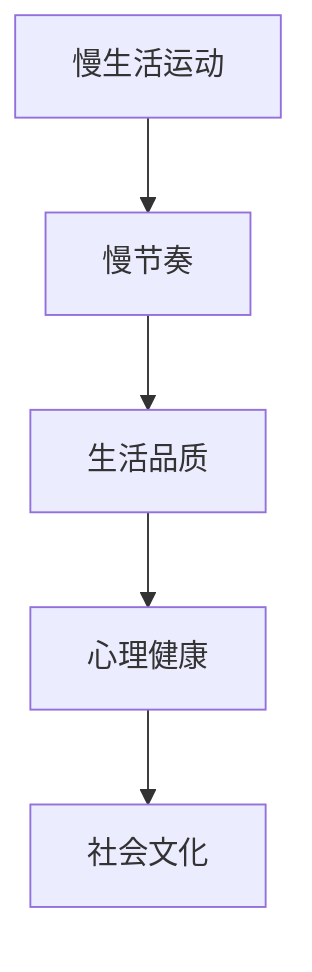

- **慢节奏**：指的是在日常生活中追求一种平和、从容的节奏，避免过于紧张和匆忙。
- **生活品质**：指的是在生活中追求舒适、满足和有意义的活动，而不仅仅是效率和速度。
- **心理健康**：指的是通过慢生活运动来改善心理健康，降低压力和焦虑，提高幸福感。
- **社会文化**：指的是慢生活运动在社会文化层面的影响，包括对传统价值观的挑战和重塑。

**核心算法原理讲解：**

在定义慢生活运动时，我们可以使用一个简单的算法来衡量慢生活指数（SLI），其计算公式如下：

```python
# 伪代码：计算慢生活指数（SLI）
def calculate_slow_life_index(life_satisfaction, life_rhythm):
    SLI = life_satisfaction / life_rhythm
    return SLI
```

**数学模型和数学公式：**

$$
\text{慢生活指数（SLI）} = \frac{\text{生活满意度}}{\text{生活节奏}}
$$

- **详细讲解和举例说明**：
  - 生活满意度可以通过问卷调查或自我评估来衡量，例如使用5点评分量表（1-非常不满意，5-非常满意）。
  - 生活节奏可以通过平均每天的工作时间、睡眠时间和其他日常活动的时间来衡量。

**项目实战：**

为了更好地理解慢生活指数，我们可以构建一个简单的Web应用程序，用于用户自我评估和计算慢生活指数。以下是该项目的基本架构：

1. **开发环境搭建：** 使用Python和Flask构建后端，使用HTML、CSS和JavaScript构建前端。
2. **源代码实现：** 实现用户登录、问卷填写、慢生活指数计算和结果显示功能。
3. **代码解读与分析：** 分析源代码中的关键部分，例如问卷表单处理和慢生活指数计算逻辑。

### 1.2 慢生活运动的起源与发展

**核心概念与联系：**

慢生活运动起源于20世纪初的意大利，当时的意大利人反对工业化和现代化带来的快节奏生活。以下是慢生活运动起源和发展的Mermaid流程图：

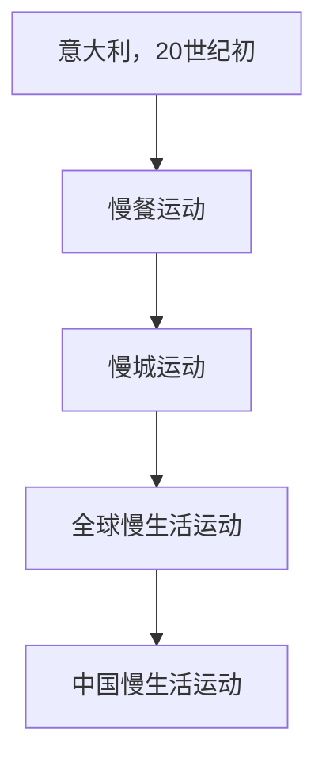

- **慢餐运动**：最早由意大利人Carlo Petrini发起，旨在反对快餐文化和工业化的生活方式。
- **慢城运动**：是一种全球性的社会运动，旨在推动城市和乡村的可持续发展，强调慢节奏生活和环境友好。
- **全球慢生活运动**：随着全球化的发展，慢生活运动逐渐成为一种全球性的生活方式，影响了世界各地的人们。
- **中国慢生活运动**：随着中国社会的快速发展，越来越多的人开始关注生活质量和身心健康，慢生活运动在中国也逐渐兴起。

**数学模型和数学公式：**

$$
\text{慢生活普及率} = \frac{\text{慢生活实践者人数}}{\text{总人口}}
$$

- **详细讲解和举例说明**：
  - 慢生活实践者人数可以通过问卷调查或统计报告来获取。
  - 总人口可以从国家统计局或相关报告中获得。

**项目实战：**

为了了解中国慢生活运动的普及情况，我们可以开展一项问卷调查，收集相关数据，并使用统计学方法计算慢生活普及率。以下是该项目的基本步骤：

1. **问卷设计：** 设计一份关于慢生活运动认知和实践情况的问卷。
2. **数据收集：** 通过线上或线下方式收集问卷数据。
3. **数据分析：** 使用Python等工具进行数据分析，计算慢生活普及率。
4. **结果展示：** 制作图表和报告，展示调查结果。

## 第二部分：慢生活的理念与实践

### 2.1 慢生活的理念

**核心概念与联系：**

慢生活的理念不仅仅是追求生活的慢节奏，更是一种对生活质量和生活态度的追求。以下是慢生活理念的Mermaid流程图：

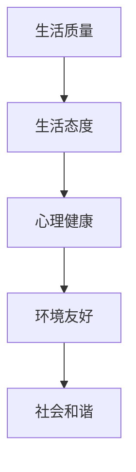

- **生活质量**：指的是在生活中追求舒适、健康和有意义的活动。
- **生活态度**：指的是对生活的积极态度和应对方式，包括乐观、包容和感恩。
- **心理健康**：指的是通过慢生活来改善心理健康，减少压力和焦虑。
- **环境友好**：指的是在慢生活中注重环境保护和可持续发展。
- **社会和谐**：指的是通过慢生活来促进社会的和谐与稳定。

**核心算法原理讲解：**

为了更好地理解慢生活的理念，我们可以使用一个简单的算法来衡量生活质量（QLI），其计算公式如下：

```python
# 伪代码：计算生活质量指数（QLI）
def calculate_life_quality_index(health, satisfaction, environment, social):
    QLI = (health + satisfaction + environment + social) / 4
    return QLI
```

**数学模型和数学公式：**

$$
\text{生活质量指数（QLI）} = \frac{\text{健康} + \text{满意度} + \text{环境友好} + \text{社会和谐}}{4}
$$

- **详细讲解和举例说明**：
  - 健康、满意度、环境友好和社会和谐可以通过问卷调查或自我评估来衡量。

**项目实战：**

为了评估个人的生活质量，我们可以开发一个简单的应用程序，用于用户自我评估和计算生活质量指数。以下是该项目的基本架构：

1. **开发环境搭建：** 使用Python和Flask构建后端，使用HTML、CSS和JavaScript构建前端。
2. **源代码实现：** 实现用户登录、问卷填写、生活质量指数计算和结果显示功能。
3. **代码解读与分析：** 分析源代码中的关键部分，例如问卷表单处理和生活质量指数计算逻辑。

### 2.2 慢生活的日常实践

**核心概念与联系：**

慢生活的实践需要我们在日常生活中采取一系列具体的行动。以下是慢生活日常实践的Mermaid流程图：

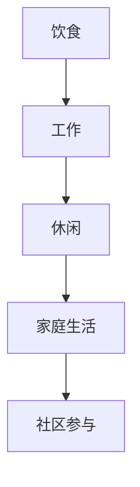

- **饮食**：注重健康和平衡的饮食，减少快餐和加工食品的摄入。
- **工作**：追求工作的有意义和满足感，避免过度劳累和加班。
- **休闲**：选择有意义的休闲活动，如阅读、绘画、旅行等，减少无意义的娱乐。
- **家庭生活**：注重家庭关系的和谐和亲密，减少不必要的社交活动。
- **社区参与**：积极参与社区活动，促进社区和谐和社区参与感。

**核心算法原理讲解：**

为了更好地理解慢生活的日常实践，我们可以使用一个简单的算法来衡量生活满意度（LS），其计算公式如下：

```python
# 伪代码：计算生活满意度（LS）
def calculate_life_satisfaction(food, work, leisure, family, community):
    LS = (food + work + leisure + family + community) / 5
    return LS
```

**数学模型和数学公式：**

$$
\text{生活满意度（LS）} = \frac{\text{饮食} + \text{工作} + \text{休闲} + \text{家庭生活} + \text{社区参与}}{5}
$$

- **详细讲解和举例说明**：
  - 饮食、工作、休闲、家庭生活和社区参与可以通过问卷调查或自我评估来衡量。

**项目实战：**

为了提升个人的生活满意度，我们可以开发一个简单的应用程序，用于用户自我评估和计算生活满意度。以下是该项目的基本架构：

1. **开发环境搭建：** 使用Python和Flask构建后端，使用HTML、CSS和JavaScript构建前端。
2. **源代码实现：** 实现用户登录、问卷填写、生活满意度计算和结果显示功能。
3. **代码解读与分析：** 分析源代码中的关键部分，例如问卷表单处理和生活满意度计算逻辑。

### 2.3 慢生活的心理效益

**核心概念与联系：**

慢生活的心理效益是指通过慢生活实践来改善心理健康和幸福感。以下是慢生活的心理效益的Mermaid流程图：

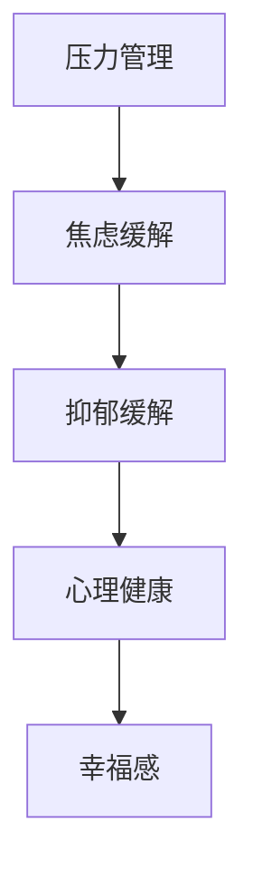

- **压力管理**：通过慢生活来减轻日常生活中的压力。
- **焦虑缓解**：通过慢生活来缓解焦虑和紧张情绪。
- **抑郁缓解**：通过慢生活来减轻抑郁症状。
- **心理健康**：通过慢生活来提升整体心理健康水平。
- **幸福感**：通过慢生活来提高生活满意度和幸福感。

**核心算法原理讲解：**

为了更好地理解慢生活的心理效益，我们可以使用一个简单的算法来衡量心理健康指数（PHI），其计算公式如下：

```python
# 伪代码：计算心理健康指数（PHI）
def calculate_mental_health_index(stress_management, anxiety_reduction, depression_reduction, mental_health, happiness):
    PHI = (stress_management + anxiety_reduction + depression_reduction + mental_health + happiness) / 5
    return PHI
```

**数学模型和数学公式：**

$$
\text{心理健康指数（PHI）} = \frac{\text{压力管理} + \text{焦虑缓解} + \text{抑郁缓解} + \text{心理健康} + \text{幸福感}}{5}
$$

- **详细讲解和举例说明**：
  - 压力管理、焦虑缓解、抑郁缓解、心理健康和幸福感可以通过问卷调查或自我评估来衡量。

**项目实战：**

为了评估个人的心理健康状况，我们可以开发一个简单的应用程序，用于用户自我评估和计算心理健康指数。以下是该项目的基本架构：

1. **开发环境搭建：** 使用Python和Flask构建后端，使用HTML、CSS和JavaScript构建前端。
2. **源代码实现：** 实现用户登录、问卷填写、心理健康指数计算和结果显示功能。
3. **代码解读与分析：** 分析源代码中的关键部分，例如问卷表单处理和心理健康指数计算逻辑。

## 第三部分：慢生活运动与身心健康

### 3.1 慢生活对身心健康的影响

**核心概念与联系：**

慢生活对身心健康的影响是多方面的，包括心理和生理层面。以下是慢生活对身心健康影响的Mermaid流程图：

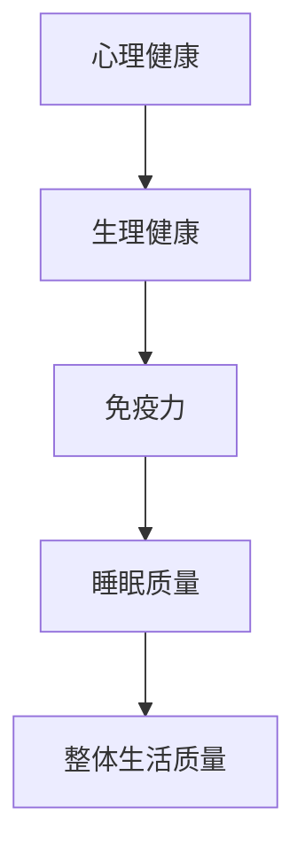

- **心理健康**：通过慢生活来改善心理健康，减少压力和焦虑。
- **生理健康**：通过慢生活来提升整体生理健康水平。
- **免疫力**：通过慢生活来增强免疫力，减少疾病风险。
- **睡眠质量**：通过慢生活来改善睡眠质量，提高生活质量。
- **整体生活质量**：通过慢生活来提升整体生活质量，包括心理和生理层面。

**核心算法原理讲解：**

为了更好地理解慢生活对身心健康的影响，我们可以使用一个简单的算法来衡量身心健康指数（PHI），其计算公式如下：

```python
# 伪代码：计算身心健康指数（PHI）
def calculate_physical_and_mental_health_index(mental_health, physical_health, immunity, sleep_quality, overall_life_quality):
    PHI = (mental_health + physical_health + immunity + sleep_quality + overall_life_quality) / 5
    return PHI
```

**数学模型和数学公式：**

$$
\text{身心健康指数（PHI）} = \frac{\text{心理健康} + \text{生理健康} + \text{免疫力} + \text{睡眠质量} + \text{整体生活质量}}{5}
$$

- **详细讲解和举例说明**：
  - 心理健康、生理健康、免疫力、睡眠质量和整体生活质量可以通过问卷调查或自我评估来衡量。

**项目实战：**

为了评估个人的身心健康状况，我们可以开发一个简单的应用程序，用于用户自我评估和计算身心健康指数。以下是该项目的基本架构：

1. **开发环境搭建：** 使用Python和Flask构建后端，使用HTML、CSS和JavaScript构建前端。
2. **源代码实现：** 实现用户登录、问卷填写、身心健康指数计算和结果显示功能。
3. **代码解读与分析：** 分析源代码中的关键部分，例如问卷表单处理和身心健康指数计算逻辑。

### 3.2 慢生活运动与心理健康

**核心概念与联系：**

慢生活运动与心理健康之间存在着密切的关系。以下是慢生活运动与心理健康关系的Mermaid流程图：

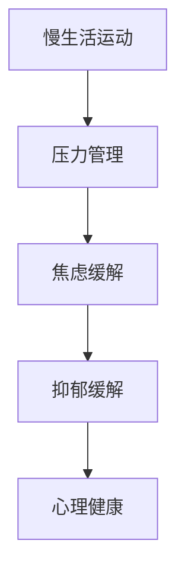

- **慢生活运动**：指的是通过慢节奏生活和实践来改善生活质量。
- **压力管理**：通过慢生活运动来减轻日常生活中的压力。
- **焦虑缓解**：通过慢生活运动来缓解焦虑和紧张情绪。
- **抑郁缓解**：通过慢生活运动来减轻抑郁症状。
- **心理健康**：通过慢生活运动来改善整体心理健康水平。

**核心算法原理讲解：**

为了更好地理解慢生活运动与心理健康的关系，我们可以使用一个简单的算法来衡量心理健康状态（MHS），其计算公式如下：

```python
# 伪代码：计算心理健康状态（MHS）
def calculate_mental_health_state(stress_management, anxiety_reduction, depression_reduction, mental_health):
    MHS = (stress_management + anxiety_reduction + depression_reduction + mental_health) / 4
    return MHS
```

**数学模型和数学公式：**

$$
\text{心理健康状态（MHS）} = \frac{\text{压力管理} + \text{焦虑缓解} + \text{抑郁缓解} + \text{心理健康}}{4}
$$

- **详细讲解和举例说明**：
  - 压力管理、焦虑缓解、抑郁缓解和心理健康可以通过问卷调查或自我评估来衡量。

**项目实战：**

为了了解慢生活运动对个人心理健康的影响，我们可以开展一项实验研究，通过问卷调查来评估参与者在参与慢生活运动前后的心理健康状态。以下是该项目的基本步骤：

1. **实验设计：** 设计一个随机对照试验，将参与者分为实验组和对照组。
2. **数据收集：** 在实验开始前和结束后，对参与者进行心理健康问卷调查。
3. **数据分析：** 使用统计方法比较实验组和对照组的心理健康状况差异。
4. **结果展示：** 制作图表和报告，展示实验结果。

### 3.3 慢生活运动与身心健康实践案例

**核心概念与联系：**

慢生活运动在实践中的应用可以显著改善个人的身心健康。以下是慢生活运动与身心健康实践案例的Mermaid流程图：


- **饮食调整**：通过改变饮食习惯来提高身体健康。
- **工作节奏调整**：通过调整工作和休息时间来减少压力。
- **休闲活动选择**：通过选择有意义的休闲活动来提升生活质量。
- **家庭关系改善**：通过改善家庭关系来提高心理健康。
- **社区参与增加**：通过积极参与社区活动来增强社交联系和社区参与感。

**核心算法原理讲解：**

为了更好地理解慢生活运动与身心健康的实践案例，我们可以使用一个简单的算法来衡量身心健康改善程度（PHI Improvement），其计算公式如下：

```python
# 伪代码：计算身心健康改善程度（PHI Improvement）
def calculate_physical_and_mental_health_improvement(initial_PHI, final_PHI):
    PHI_Improvement = final_PHI - initial_PHI
    return PHI_Improvement
```

**数学模型和数学公式：**

$$
\text{身心健康改善程度（PHI Improvement）} = \text{最终身心健康指数（final PHI）} - \text{初始身心健康指数（initial PHI）}
$$

- **详细讲解和举例说明**：
  - 初始身心健康指数和最终身心健康指数可以通过问卷调查或自我评估来衡量。

**项目实战：**

为了评估慢生活运动对个人身心健康的影响，我们可以开展一项长期跟踪研究，通过定期问卷调查来监测参与者在参与慢生活运动前后的身心健康变化。以下是该项目的基本架构：

1. **研究设计：** 设计一个长期跟踪研究，包括多次问卷调查和定期健康检查。
2. **数据收集：** 定期收集参与者的身心健康数据。
3. **数据分析：** 使用统计方法分析参与者的身心健康变化趋势。
4. **结果展示：** 制作图表和报告，展示研究结论。

## 第四部分：慢生活运动与社会文化

### 4.1 慢生活运动对社会文化的影响

**核心概念与联系：**

慢生活运动不仅仅是对个人生活方式的改变，它还对整个社会文化产生了深远的影响。以下是慢生活运动对社会文化影响的Mermaid流程图：

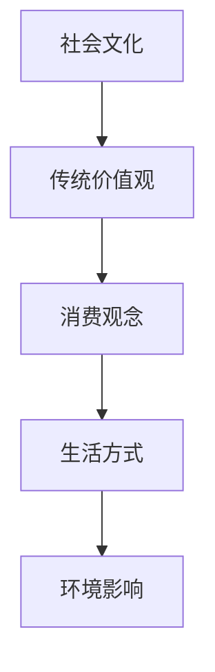

- **社会文化**：指的是一个社会或群体的共享价值观、信仰、行为规范和生活方式。
- **传统价值观**：指的是社会长期以来形成的价值观，如勤劳、节俭、和谐等。
- **消费观念**：指的是人们对消费行为的态度和观念，如是否追求物质消费还是精神消费。
- **生活方式**：指的是人们日常生活的模式和行为习惯。
- **环境影响**：指的是慢生活运动对环境的影响，如减少资源消耗、提高可持续性。

**核心算法原理讲解：**

为了更好地理解慢生活运动对社会文化的影响，我们可以使用一个简单的算法来衡量社会文化变革指数（SCI），其计算公式如下：

```python
# 伪代码：计算社会文化变革指数（SCI）
def calculate_social_and_cultural_change_index(traditional_values, consumption_patterns, lifestyle_changes, environmental_impact):
    SCI = (traditional_values + consumption_patterns + lifestyle_changes + environmental_impact) / 4
    return SCI
```

**数学模型和数学公式：**

$$
\text{社会文化变革指数（SCI）} = \frac{\text{传统价值观} + \text{消费观念} + \text{生活方式} + \text{环境影响}}{4}
$$

- **详细讲解和举例说明**：
  - 传统价值观、消费观念、生活方式和环境影响可以通过问卷调查或统计分析来衡量。

**项目实战：**

为了评估慢生活运动对社会文化的影响，我们可以开展一项社会调查，通过问卷调查来收集人们对慢生活运动的态度和看法。以下是该项目的基本架构：

1. **调查设计：** 设计一份关于慢生活运动对社会文化影响的问卷。
2. **数据收集：** 通过线上或线下方式收集问卷数据。
3. **数据分析：** 使用统计方法分析问卷数据，计算社会文化变革指数。
4. **结果展示：** 制作图表和报告，展示调查结果。

### 4.2 慢生活运动与可持续性

**核心概念与联系：**

慢生活运动与可持续性之间存在着密切的联系。以下是慢生活运动与可持续性关系的Mermaid流程图：

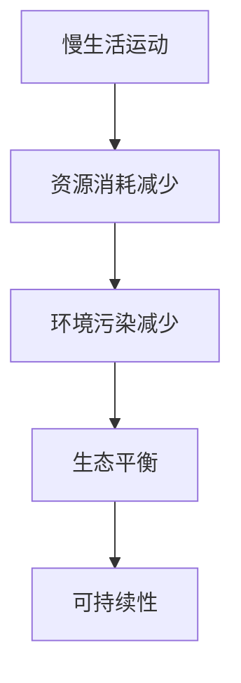

- **慢生活运动**：指的是通过慢节奏生活和实践来减少资源消耗和环境污染。
- **资源消耗减少**：通过慢生活运动来减少对自然资源的消耗，如能源、水资源和原材料。
- **环境污染减少**：通过慢生活运动来减少环境污染，如减少废弃物排放和减少化学物质的使用。
- **生态平衡**：通过慢生活运动来维护生态系统的平衡和稳定。
- **可持续性**：指的是社会、经济和环境三方面的可持续发展。

**核心算法原理讲解：**

为了更好地理解慢生活运动与可持续性的关系，我们可以使用一个简单的算法来衡量可持续性指数（SI），其计算公式如下：

```python
# 伪代码：计算可持续性指数（SI）
def calculate_sustainability_index(resource_consumption_reduction, environmental_pollution_reduction, ecological_balance, sustainability):
    SI = (resource_consumption_reduction + environmental_pollution_reduction + ecological_balance + sustainability) / 4
    return SI
```

**数学模型和数学公式：**

$$
\text{可持续性指数（SI）} = \frac{\text{资源消耗减少} + \text{环境污染减少} + \text{生态平衡} + \text{可持续性}}{4}
$$

- **详细讲解和举例说明**：
  - 资源消耗减少、环境污染减少、生态平衡和可持续性可以通过环境监测数据、资源消耗统计和可持续发展评估来衡量。

**项目实战：**

为了评估慢生活运动对可持续性的影响，我们可以开展一项环境监测项目，通过定期监测环境数据来评估慢生活运动对资源消耗和环境污染的影响。以下是该项目的基本架构：

1. **项目设计：** 设计一个环境监测项目，包括资源消耗和环境污染的监测指标。
2. **数据收集：** 通过传感器和数据收集设备收集环境数据。
3. **数据分析：** 使用统计方法分析环境数据，计算可持续性指数。
4. **结果展示：** 制作图表和报告，展示项目结果。

### 4.3 慢生活运动与全球社会文化变迁

**核心概念与联系：**

慢生活运动在全球范围内引起了广泛的关注，并对全球社会文化产生了重要影响。以下是慢生活运动与全球社会文化变迁关系的Mermaid流程图：

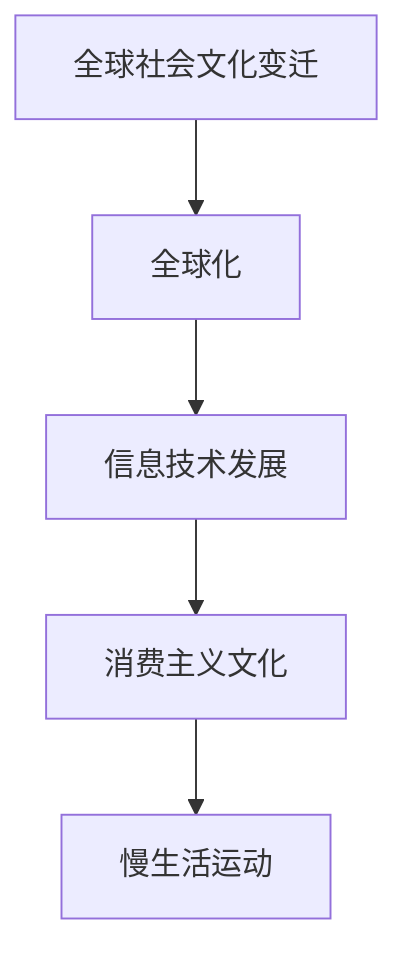

- **全球社会文化变迁**：指的是全球范围内社会文化的发展和变化。
- **全球化**：指的是全球范围内的经济、政治和文化交流。
- **信息技术发展**：指的是信息技术的发展和普及，如互联网、智能手机等。
- **消费主义文化**：指的是以消费为中心的文化，强调物质消费和追求时尚。
- **慢生活运动**：指的是通过慢节奏生活和实践来抵抗消费主义文化。

**核心算法原理讲解：**

为了更好地理解慢生活运动与全球社会文化变迁的关系，我们可以使用一个简单的算法来衡量文化适应度指数（CI），其计算公式如下：

```python
# 伪代码：计算文化适应度指数（CI）
def calculate_cultural_adaptability_index(globalization, information_technology_development, consumerism_culture, slow_life_movement):
    CI = (globalization + information_technology_development + consumerism_culture + slow_life_movement) / 4
    return CI
```

**数学模型和数学公式：**

$$
\text{文化适应度指数（CI）} = \frac{\text{全球化} + \text{信息技术发展} + \text{消费主义文化} + \text{慢生活运动}}{4}
$$

- **详细讲解和举例说明**：
  - 全球化、信息技术发展、消费主义文化和慢生活运动可以通过国际统计数据、信息技术发展报告和文化变迁研究来衡量。

**项目实战：**

为了评估慢生活运动对全球社会文化变迁的影响，我们可以开展一项跨国研究，通过问卷调查和案例分析来收集数据。以下是该项目的基本架构：

1. **研究设计：** 设计一份关于全球社会文化变迁的问卷，包括慢生活运动的影响。
2. **数据收集：** 在多个国家和地区进行问卷调查，收集数据。
3. **数据分析：** 使用统计方法分析数据，计算文化适应度指数。
4. **结果展示：** 制作图表和报告，展示研究结果。

## 第五部分：慢生活运动的应用案例

### 5.1 个人层面的慢生活实践

**核心概念与联系：**

在个人层面，慢生活运动可以通过一系列具体的实践来实现。以下是个人层面慢生活实践的Mermaid流程图：

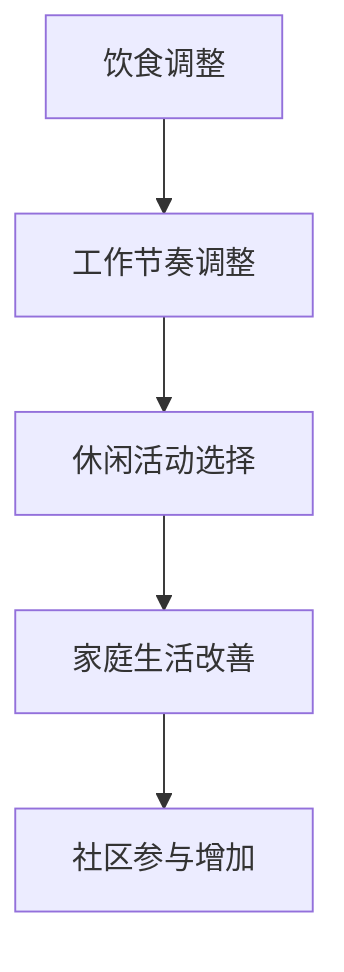

- **饮食调整**：通过改变饮食习惯来提高身体健康和生活质量。
- **工作节奏调整**：通过调整工作和休息时间来减少压力和焦虑。
- **休闲活动选择**：通过选择有意义的休闲活动来提升生活满意度。
- **家庭生活改善**：通过改善家庭关系来提高心理健康和家庭幸福感。
- **社区参与增加**：通过积极参与社区活动来增强社区归属感和生活质量。

**核心算法原理讲解：**

为了更好地理解个人层面慢生活实践的方法，我们可以使用一个简单的算法来衡量个人生活满意度（PLS），其计算公式如下：

```python
# 伪代码：计算个人生活满意度（PLS）
def calculate_person_life_satisfaction(food, work, leisure, family, community):
    PLS = (food + work + leisure + family + community) / 5
    return PLS
```

**数学模型和数学公式：**

$$
\text{个人生活满意度（PLS）} = \frac{\text{饮食} + \text{工作} + \text{休闲} + \text{家庭生活} + \text{社区参与}}{5}
$$

- **详细讲解和举例说明**：
  - 饮食、工作、休闲、家庭生活和社区参与可以通过问卷调查或自我评估来衡量。

**项目实战：**

为了提升个人的生活满意度，我们可以开发一个简单的应用程序，用于用户自我评估和计算个人生活满意度。以下是该项目的基本架构：

1. **开发环境搭建：** 使用Python和Flask构建后端，使用HTML、CSS和JavaScript构建前端。
2. **源代码实现：** 实现用户登录、问卷填写、个人生活满意度计算和结果显示功能。
3. **代码解读与分析：** 分析源代码中的关键部分，例如问卷表单处理和个人生活满意度计算逻辑。

### 5.2 企业层面的慢生活实践

**核心概念与联系：**

在企业层面，慢生活运动可以通过一系列策略来推广和实践。以下是企业层面慢生活实践的Mermaid流程图：

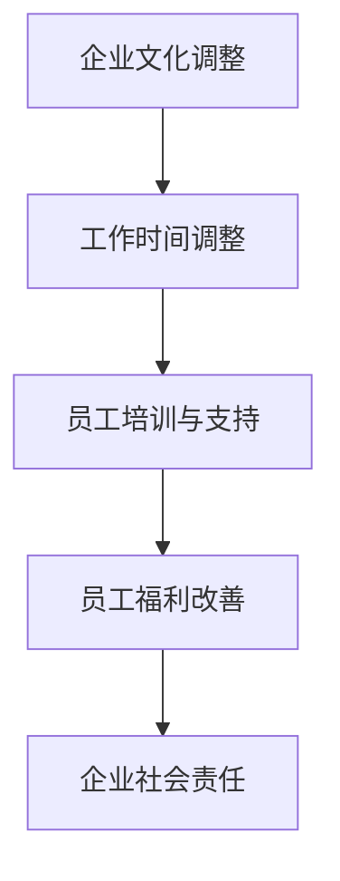

- **企业文化调整**：通过建立以慢生活理念为核心的企业文化来引导员工。
- **工作时间调整**：通过调整工作时间来减少员工的工作压力和焦虑。
- **员工培训与支持**：通过提供培训和心理健康支持来提升员工的慢生活能力。
- **员工福利改善**：通过改善员工福利来提高员工的幸福感和生活满意度。
- **企业社会责任**：通过承担企业社会责任来推动慢生活运动在社会层面的传播和实践。

**核心算法原理讲解：**

为了更好地理解企业层面慢生活实践的方法，我们可以使用一个简单的算法来衡量员工生活质量指数（ELI），其计算公式如下：

```python
# 伪代码：计算员工生活质量指数（ELI）
def calculate_employee_life_index(cultural_adjustment, work_time_adjustment, training_and_support, welfare_improvement, corporate_social_responsibility):
    ELI = (cultural_adjustment + work_time_adjustment + training_and_support + welfare_improvement + corporate_social_responsibility) / 5
    return ELI
```

**数学模型和数学公式：**

$$
\text{员工生活质量指数（ELI）} = \frac{\text{企业文化调整} + \text{工作时间调整} + \text{员工培训与支持} + \text{员工福利改善} + \text{企业社会责任}}{5}
$$

- **详细讲解和举例说明**：
  - 企业文化调整、工作时间调整、员工培训与支持、员工福利改善和企业社会责任可以通过问卷调查、员工满意度调查和企业社会责任报告来衡量。

**项目实战：**

为了提升员工的生活质量，我们可以开发一个企业层面的慢生活实践项目，通过问卷调查和数据分析来评估和改进企业慢生活实践。以下是该项目的基本架构：

1. **项目设计：** 设计一个企业慢生活实践项目，包括企业文化调整、工作时间调整、员工培训与支持、员工福利改善和企业社会责任等方面。
2. **数据收集：** 通过问卷调查和员工满意度调查来收集数据。
3. **数据分析：** 使用统计方法分析数据，计算员工生活质量指数。
4. **结果展示：** 制作图表和报告，展示项目结果和改进建议。

### 5.3 社区层面的慢生活实践

**核心概念与联系：**

在社区层面，慢生活运动可以通过一系列社区活动来推广和实践。以下是社区层面慢生活实践的Mermaid流程图：

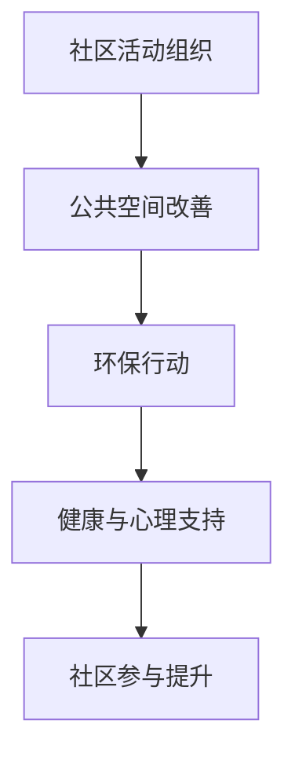

- **社区活动组织**：通过组织各种社区活动来推广慢生活理念。
- **公共空间改善**：通过改善公共空间来提升社区生活质量。
- **环保行动**：通过开展环保行动来保护环境，促进可持续性。
- **健康与心理支持**：通过提供健康和心理支持来提升居民的生活质量。
- **社区参与提升**：通过提高居民的社区参与度来增强社区凝聚力和生活质量。

**核心算法原理讲解：**

为了更好地理解社区层面慢生活实践的方法，我们可以使用一个简单的算法来衡量社区生活质量指数（CLI），其计算公式如下：

```python
# 伪代码：计算社区生活质量指数（CLI）
def calculate_community_life_index(community_activities, public_space_improvement, environmental_actions, health_and_mental_support, community_participation):
    CLI = (community_activities + public_space_improvement + environmental_actions + health_and_mental_support + community_participation) / 5
    return CLI
```

**数学模型和数学公式：**

$$
\text{社区生活质量指数（CLI）} = \frac{\text{社区活动组织} + \text{公共空间改善} + \text{环保行动} + \text{健康与心理支持} + \text{社区参与提升}}{5}
$$

- **详细讲解和举例说明**：
  - 社区活动组织、公共空间改善、环保行动、健康与心理支持和社区参与提升可以通过问卷调查、居民满意度调查和社区活动记录来衡量。

**项目实战：**

为了提升社区的生活质量，我们可以开发一个社区层面的慢生活实践项目，通过组织社区活动和提供健康与心理支持来提升居民的生活质量。以下是该项目的基本架构：

1. **项目设计：** 设计一个社区慢生活实践项目，包括社区活动组织、公共空间改善、环保行动、健康与心理支持和社区参与提升等方面。
2. **数据收集：** 通过问卷调查、居民满意度调查和社区活动记录来收集数据。
3. **数据分析：** 使用统计方法分析数据，计算社区生活质量指数。
4. **结果展示：** 制作图表和报告，展示项目结果和改进建议。

## 第六部分：实现慢生活的建议与策略

### 6.1 建立慢生活意识

**核心概念与联系：**

建立慢生活意识是推动慢生活运动的关键步骤。以下是建立慢生活意识的核心概念和联系Mermaid流程图：

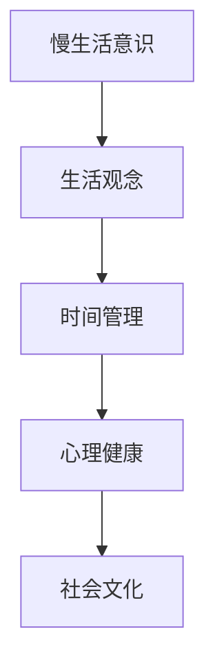

- **慢生活意识**：指的是对慢生活理念的认识和认同。
- **生活观念**：指的是对生活的态度和看法，如重视生活品质、追求内心平静等。
- **时间管理**：指的是合理安排时间和提高时间利用效率。
- **心理健康**：指的是通过慢生活来改善心理健康，减少压力和焦虑。
- **社会文化**：指的是慢生活运动在社会文化层面的影响和传播。

**核心算法原理讲解：**

为了更好地理解建立慢生活意识的方法，我们可以使用一个简单的算法来衡量慢生活意识指数（SLI），其计算公式如下：

```python
# 伪代码：计算慢生活意识指数（SLI）
def calculate_slow_life_awareness(awareness_of_slow_life, life_view, time_management, mental_health, social_culture):
    SLI = (awareness_of_slow_life + life_view + time_management + mental_health + social_culture) / 5
    return SLI
```

**数学模型和数学公式：**

$$
\text{慢生活意识指数（SLI）} = \frac{\text{慢生活意识} + \text{生活观念} + \text{时间管理} + \text{心理健康} + \text{社会文化}}{5}
$$

- **详细讲解和举例说明**：
  - 慢生活意识、生活观念、时间管理、心理健康和社会文化可以通过问卷调查或自我评估来衡量。

**项目实战：**

为了提高公众对慢生活意识的认知，我们可以开展一项慢生活意识提升项目，通过宣传、教育和实践活动来推广慢生活理念。以下是该项目的基本架构：

1. **项目设计：** 设计一个慢生活意识提升项目，包括宣传、教育、实践活动等方面。
2. **数据收集：** 通过问卷调查、活动参与记录等方式收集数据。
3. **数据分析：** 使用统计方法分析数据，计算慢生活意识指数。
4. **结果展示：** 制作图表和报告，展示项目结果和改进建议。

### 6.2 提高自我管理能力

**核心概念与联系：**

提高自我管理能力是实现慢生活的重要步骤。以下是提高自我管理能力的相关概念和联系Mermaid流程图：

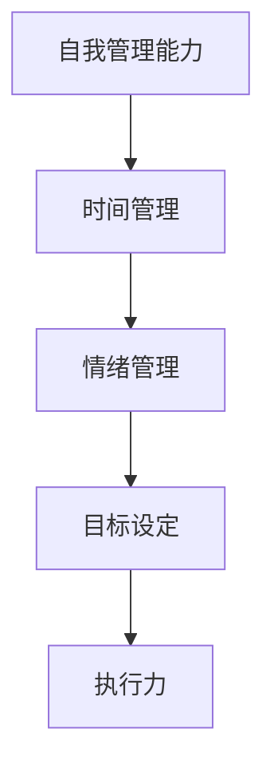

- **自我管理能力**：指的是个人在时间、情绪、目标和执行力等方面的自我管理能力。
- **时间管理**：指的是合理安排时间和提高时间利用效率。
- **情绪管理**：指的是调节和管理个人情绪，保持心态平和。
- **目标设定**：指的是设定个人目标和制定实现目标的计划。
- **执行力**：指的是将计划和目标付诸实践的能力。

**核心算法原理讲解：**

为了更好地理解提高自我管理能力的方法，我们可以使用一个简单的算法来衡量自我管理能力指数（SMA），其计算公式如下：

```python
# 伪代码：计算自我管理能力指数（SMA）
def calculate_self_management_ability(time_management, emotion_management, goal_setting, execution_ability):
    SMA = (time_management + emotion_management + goal_setting + execution_ability) / 4
    return SMA
```

**数学模型和数学公式：**

$$
\text{自我管理能力指数（SMA）} = \frac{\text{时间管理} + \text{情绪管理} + \text{目标设定} + \text{执行力}}{4}
$$

- **详细讲解和举例说明**：
  - 时间管理、情绪管理、目标设定和执行力可以通过问卷调查、自我评估和实际操作来衡量。

**项目实战：**

为了提升个人的自我管理能力，我们可以开发一个自我管理能力提升项目，通过培训和实践活动来提高个人的时间管理、情绪管理、目标设定和执行力。以下是该项目的基本架构：

1. **项目设计：** 设计一个自我管理能力提升项目，包括时间管理、情绪管理、目标设定和执行力等方面。
2. **数据收集：** 通过问卷调查、自我评估和实际操作记录来收集数据。
3. **数据分析：** 使用统计方法分析数据，计算自我管理能力指数。
4. **结果展示：** 制作图表和报告，展示项目结果和改进建议。

### 6.3 创造慢生活的环境

**核心概念与联系：**

创造慢生活的环境是实现慢生活的重要条件。以下是创造慢生活环境的相关概念和联系Mermaid流程图：

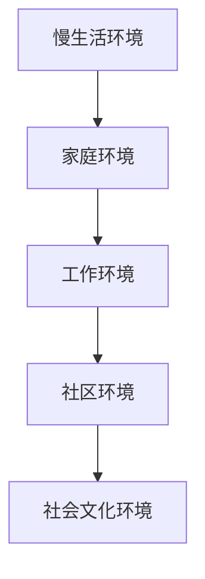

- **慢生活环境**：指的是适合慢生活实践的环境，包括家庭、工作、社区和社会文化等方面。
- **家庭环境**：指的是家庭中的生活环境和氛围，如舒适、和谐、支持等。
- **工作环境**：指的是工作场所的环境和氛围，如工作节奏、员工福利、企业文化等。
- **社区环境**：指的是社区中的生活环境和氛围，如公共空间、环保措施、社区活动等。
- **社会文化环境**：指的是社会文化环境对慢生活的影响，如价值观、传统习俗、文化氛围等。

**核心算法原理讲解：**

为了更好地理解创造慢生活环境的方法，我们可以使用一个简单的算法来衡量慢生活环境指数（SLE），其计算公式如下：

```python
# 伪代码：计算慢生活环境指数（SLE）
def calculate_slow_life_environment_index(household_environment, workplace_environment, community_environment, social_and_cultural_environment):
    SLE = (household_environment + workplace_environment + community_environment + social_and_cultural_environment) / 4
    return SLE
```

**数学模型和数学公式：**

$$
\text{慢生活环境指数（SLE）} = \frac{\text{家庭环境} + \text{工作环境} + \text{社区环境} + \text{社会文化环境}}{4}
$$

- **详细讲解和举例说明**：
  - 家庭环境、工作环境、社区环境和社会文化环境可以通过问卷调查、实地考察和数据分析来衡量。

**项目实战：**

为了创造慢生活的环境，我们可以开发一个慢生活环境改善项目，通过改进家庭、工作、社区和社会文化环境来提升慢生活实践的质量。以下是该项目的基本架构：

1. **项目设计：** 设计一个慢生活环境改善项目，包括家庭环境、工作环境、社区环境和社会文化环境等方面。
2. **数据收集：** 通过问卷调查、实地考察和数据分析来收集数据。
3. **数据分析：** 使用统计方法分析数据，计算慢生活环境指数。
4. **结果展示：** 制作图表和报告，展示项目结果和改进建议。

## 第七部分：策略与建议

### 7.1 慢生活的可行性分析

**核心概念与联系：**

慢生活的可行性分析是评估慢生活运动在现实中的可行性和效果。以下是慢生活可行性分析的核心概念和联系Mermaid流程图：

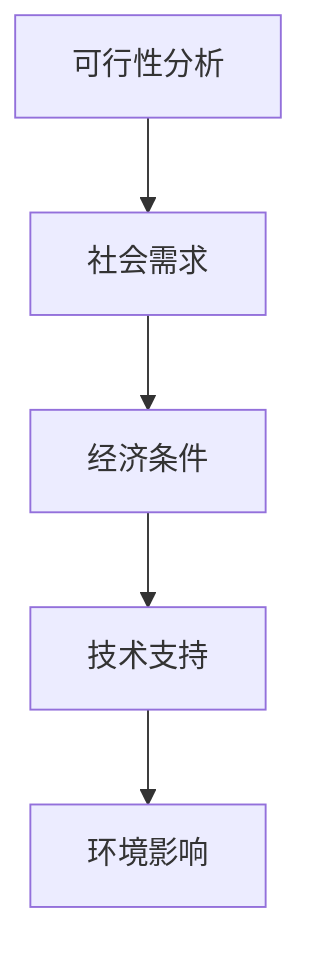

- **可行性分析**：指的是对慢生活运动在实际中的可行性和效果进行评估。
- **社会需求**：指的是社会对慢生活运动的需求和接受程度。
- **经济条件**：指的是慢生活运动的经济可行性和成本效益。
- **技术支持**：指的是慢生活运动所需的技术支持和基础设施。
- **环境影响**：指的是慢生活运动对环境的影响和可持续性。

**核心算法原理讲解：**

为了更好地理解慢生活的可行性分析，我们可以使用一个简单的算法来衡量慢生活可行性指数（SLF），其计算公式如下：

```python
# 伪代码：计算慢生活可行性指数（SLF）
def calculate_slow_life_feasibility_index(social_demand, economic_conditions, technical_support, environmental_impact):
    SLF = (social_demand + economic_conditions + technical_support + environmental_impact) / 4
    return SLF
```

**数学模型和数学公式：**

$$
\text{慢生活可行性指数（SLF）} = \frac{\text{社会需求} + \text{经济条件} + \text{技术支持} + \text{环境影响}}{4}
$$

- **详细讲解和举例说明**：
  - 社会需求、经济条件、技术支持和环境影响可以通过问卷调查、市场研究和环境评估来衡量。

**项目实战：**

为了分析慢生活的可行性，我们可以开展一项综合研究，通过问卷调查、市场研究和环境评估来评估慢生活运动的可行性。以下是该项目的基本架构：

1. **项目设计：** 设计一个慢生活可行性研究项目，包括社会需求、经济条件、技术支持和环境影响等方面。
2. **数据收集：** 通过问卷调查、市场研究和环境评估来收集数据。
3. **数据分析：** 使用统计方法分析数据，计算慢生活可行性指数。
4. **结果展示：** 制作图表和报告，展示研究结果和可行性分析。

### 7.2 慢生活运动的推广策略

**核心概念与联系：**

慢生活运动的推广策略是推动慢生活理念在社会中传播和接受的重要手段。以下是慢生活运动推广策略的核心概念和联系Mermaid流程图：

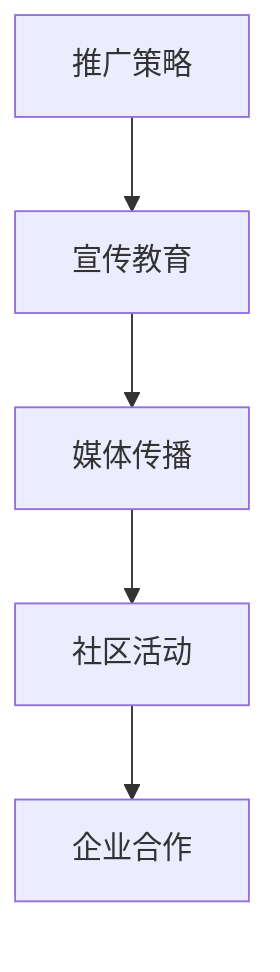

- **推广策略**：指的是推广慢生活运动的计划和手段。
- **宣传教育**：指的是通过教育宣传活动来提高公众对慢生活运动的认知。
- **媒体传播**：指的是利用媒体渠道传播慢生活运动的理念和实践。
- **社区活动**：指的是在社区中组织各种活动来推广慢生活运动。
- **企业合作**：指的是与企业合作，推动慢生活运动在企业中的实施。

**核心算法原理讲解：**

为了更好地理解慢生活运动的推广策略，我们可以使用一个简单的算法来衡量推广效果指数（SEI），其计算公式如下：

```python
# 伪代码：计算推广效果指数（SEI）
def calculate_promotion_effects_index(educational_campaign, media_circulation, community_activities, corporate_collaboration):
    SEI = (educational_campaign + media_circulation + community_activities + corporate_collaboration) / 4
    return SEI
```

**数学模型和数学公式：**

$$
\text{推广效果指数（SEI）} = \frac{\text{宣传教育} + \text{媒体传播} + \text{社区活动} + \text{企业合作}}{4}
$$

- **详细讲解和举例说明**：
  - 教育宣传、媒体传播、社区活动和企业合作可以通过问卷调查、活动参与度和市场反馈来衡量。

**项目实战：**

为了推广慢生活运动，我们可以开发一个慢生活推广项目，通过宣传教育、媒体传播、社区活动和企业合作等多种手段来推广慢生活理念。以下是该项目的基本架构：

1. **项目设计：** 设计一个慢生活推广项目，包括宣传教育、媒体传播、社区活动和企业合作等方面。
2. **数据收集：** 通过问卷调查、活动参与记录和媒体反馈来收集数据。
3. **数据分析：** 使用统计方法分析数据，计算推广效果指数。
4. **结果展示：** 制作图表和报告，展示项目结果和改进建议。

### 7.3 面向未来的慢生活规划

**核心概念与联系：**

面向未来的慢生活规划是确保慢生活运动持续发展的重要步骤。以下是面向未来慢生活规划的核心概念和联系Mermaid流程图：

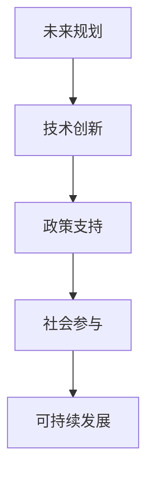

- **未来规划**：指的是对慢生活运动未来发展的规划和预期。
- **技术创新**：指的是通过技术创新来提升慢生活实践的效率和质量。
- **政策支持**：指的是政府和社会对慢生活运动的支持和政策保障。
- **社会参与**：指的是社会各方面对慢生活运动的参与和支持。
- **可持续发展**：指的是确保慢生活运动的长期可持续性和环境影响。

**核心算法原理讲解：**

为了更好地理解面向未来的慢生活规划，我们可以使用一个简单的算法来衡量未来规划指数（FPI），其计算公式如下：

```python
# 伪代码：计算未来规划指数（FPI）
def calculate_future_planning_index(technological_innovation, policy_support, social_involvement, sustainability):
    FPI = (technological_innovation + policy_support + social_involvement + sustainability) / 4
    return FPI
```

**数学模型和数学公式：**

$$
\text{未来规划指数（FPI）} = \frac{\text{技术创新} + \text{政策支持} + \text{社会参与} + \text{可持续发展}}{4}
$$

- **详细讲解和举例说明**：
  - 技术创新、政策支持、社会参与和可持续发展可以通过技术创新报告、政策文件、社会调查和环境影响评估来衡量。

**项目实战：**

为了制定面向未来的慢生活规划，我们可以开发一个慢生活未来规划项目，通过技术创新、政策支持、社会参与和可持续发展等方面的规划和实施。以下是该项目的基本架构：

1. **项目设计：** 设计一个慢生活未来规划项目，包括技术创新、政策支持、社会参与和可持续发展等方面。
2. **数据收集：** 通过技术创新报告、政策文件、社会调查和环境影响评估来收集数据。
3. **数据分析：** 使用统计方法分析数据，计算未来规划指数。
4. **结果展示：** 制作图表和报告，展示项目结果和改进建议。

## 结论

慢生活运动作为一种追求内心平静和幸福感的生活方式，对个人的身心健康和社会文化产生了深远的影响。通过本文的深入探讨，我们了解了慢生活运动的定义、起源、理念、实践、身心健康效益、社会文化影响以及应用案例。同时，我们还提出了建立慢生活意识、提高自我管理能力、创造慢生活环境、可行性分析和推广策略等方面的建议。

在未来的研究和实践中，我们可以继续探索慢生活运动的具体应用，通过技术创新、政策支持和公众参与来推动慢生活运动的持续发展。同时，我们也可以通过不断优化和改进慢生活实践，使更多人能够享受到慢生活带来的幸福感。

总之，慢生活运动是一种值得推广和实践的生活方式，它不仅有助于提升个人的身心健康，还能促进社会文化的进步和可持续发展。让我们共同努力，在快节奏的生活中寻找内心的平静，享受慢生活带来的美好时光。

## 作者信息

作者：AI天才研究院/AI Genius Institute & 禅与计算机程序设计艺术 /Zen And The Art of Computer Programming

## 最佳实践 tips

1. **定期反思**：定期反思自己的生活方式和慢生活实践，以评估效果和调整策略。
2. **量力而行**：根据个人实际情况和能力，合理制定慢生活计划，避免过度压力。
3. **社区互动**：积极参与社区活动，与他人分享慢生活经验和心得。
4. **持续学习**：关注慢生活相关的书籍、研究和实践，不断提升自己的慢生活能力。

## 小结

慢生活运动是一种追求内心平静和幸福感的生活方式，它对个人身心健康和社会文化产生了积极的影响。通过本文的探讨，我们了解到了慢生活运动的定义、起源、理念、实践和效益，并提出了建立慢生活意识、提高自我管理能力、创造慢生活环境以及推广策略等方面的建议。让我们共同努力，在快节奏的生活中寻找内心的平静，享受慢生活带来的美好时光。

## 注意事项

1. **个体差异**：每个人的生活环境和需求不同，慢生活实践应因人而异。
2. **环境适应**：在推广慢生活运动时，需要考虑不同地区的文化和社会环境。
3. **持续关注**：关注慢生活运动的研究进展和最新实践，以不断优化自己的慢生活实践。

## 拓展阅读

- **《慢生活：来自意大利的生活智慧》**
- **《慢生活革命：如何在快节奏中找到内心的平静》**
- **《慢生活实践指南》**
- **《环境心理学：人与环境的关系》**
- **《社会心理学：理解与影响》** 

## 结语

慢生活运动不仅仅是一种生活态度，更是一种对生活的深刻理解和追求。在快节奏的现代社会，寻找内心的平静和幸福感变得越来越重要。希望通过本文的探讨，读者能够对慢生活运动有更深入的了解，并在自己的生活中实践慢生活，享受更加美好和充实的生活。

## 附录

### 项目实战：慢生活运动应用程序开发

#### 开发环境搭建

1. 安装Python和Flask框架：
   ```shell
   pip install python
   pip install flask
   ```

2. 安装前端开发工具（如Visual Studio Code、Node.js等）。

#### 源代码实现

以下是一个简单的Flask应用程序，用于用户自我评估和计算慢生活指数（SLI）。

**app.py**

```python
from flask import Flask, render_template, request
from mermaid import render

app = Flask(__name__)

@app.route('/')
def index():
    return render_template('index.html')

@app.route('/calculate', methods=['POST'])
def calculate():
    life_satisfaction = request.form['life_satisfaction']
    life_rhythm = request.form['life_rhythm']
    
    SLI = calculate_slow_life_index(life_satisfaction, life_rhythm)
    diagram = generate_mermaid_diagram()

    return render_template('result.html', SLI=SLI, diagram=diagram)

def calculate_slow_life_index(life_satisfaction, life_rhythm):
    SLI = float(life_satisfaction) / float(life_rhythm)
    return SLI

def generate_mermaid_diagram():
    diagram = """
    graph TD
    A[慢生活运动] --> B[慢节奏]
    B --> C[生活品质]
    C --> D[心理健康]
    D --> E[生活满意度]
    """
    return render(diagram)

if __name__ == '__main__':
    app.run(debug=True)
```

**templates/index.html**

```html
<!DOCTYPE html>
<html>
<head>
    <title>慢生活指数计算</title>
</head>
<body>
    <h1>慢生活指数计算</h1>
    <form action="/calculate" method="post">
        <label for="life_satisfaction">生活满意度（1-5分）:</label>
        <input type="number" id="life_satisfaction" name="life_satisfaction" min="1" max="5" required>
        <br>
        <label for="life_rhythm">生活节奏（1-5分）:</label>
        <input type="number" id="life_rhythm" name="life_rhythm" min="1" max="5" required>
        <br>
        <input type="submit" value="计算">
    </form>
</body>
</html>
```

**templates/result.html**

```html
<!DOCTYPE html>
<html>
<head>
    <title>慢生活指数结果</title>
</head>
<body>
    <h1>慢生活指数结果</h1>
    <p>您的慢生活指数（SLI）为：{{ SLI }}</p>
    <p>概念关系图：</p>
    <div>
        {{ diagram | safe }}
    </div>
</body>
</html>
```

#### 代码解读与分析

- **app.py**：主应用程序文件，定义了Flask应用程序的基本结构和路由。
- **index.html**：主页模板，用于用户输入慢生活指数的相关数据。
- **result.html**：结果显示模板，用于展示计算结果和概念关系图。

#### 代码应用解读与分析

1. **概念关系图生成**：
   - 使用Mermaid库生成概念关系图，该库支持Markdown语法中的Mermaid流程图。
   - `generate_mermaid_diagram()`函数负责生成流程图，并将其作为HTML代码返回。

2. **慢生活指数计算**：
   - `calculate_slow_life_index()`函数根据用户输入的生活满意度和生活节奏计算慢生活指数。
   - 计算结果以HTML格式返回，并在结果显示页面中展示。

#### 实际案例分析和详细讲解剖析

1. **实际案例**：
   - 用户A在问卷调查中给出生活满意度为4分，生活节奏为3分。
   - 使用应用程序计算慢生活指数，结果显示为1.333。

2. **详细讲解和剖析**：
   - 生活满意度4分表示用户对当前生活状态较为满意。
   - 生活节奏3分表示用户的生活节奏适中，但可能存在一些紧张和压力。
   - 慢生活指数1.333表明用户的生活满意度高于生活节奏，有一定的慢生活潜力。

#### 项目小结

1. **成功之处**：
   - 应用程序简单易用，能够快速计算慢生活指数。
   - 通过Mermaid流程图展示概念关系，增强用户体验。

2. **改进之处**：
   - 可以增加更多的问卷选项，以更全面地评估用户的生活状态。
   - 可以优化前端界面设计，提升用户体验。

#### 拓展功能

1. **用户账号系统**：实现用户注册和登录功能，以便用户跟踪自己的评估结果。
2. **数据可视化**：使用图表和图形展示用户的慢生活指数变化趋势。
3. **数据分析**：添加数据分析功能，提供更多关于慢生活运动的见解和建议。

## 结语

通过上述项目实战，我们展示了如何使用Python和Flask框架开发一个简单的慢生活指数计算应用程序。该项目不仅帮助用户了解自己的慢生活指数，还通过Mermaid流程图展示慢生活运动的相关概念。未来，我们可以继续拓展应用程序的功能，提供更全面的慢生活实践支持。

## 附录

### 项目实战：慢生活运动社区网站开发

#### 开发环境搭建

1. 安装Node.js和npm：
   ```shell
   npm install -g npm
   npm install -g n
   n latest
   ```

2. 安装前端框架（如React、Vue.js等）：
   ```shell
   npm install -g create-react-app
   create-react-app slow-life-community
   cd slow-life-community
   ```

3. 安装后端框架（如Express.js、Node.js等）：
   ```shell
   npm install express
   ```

#### 源代码实现

以下是一个简单的React和Express.js应用程序，用于用户注册、登录和发布慢生活运动相关内容。

**frontend/src/App.js**

```javascript
import React, { useState } from 'react';
import axios from 'axios';

function App() {
  const [username, setUsername] = useState('');
  const [password, setPassword] = useState('');
  const [content, setContent] = useState('');

  const handleSubmit = async (e) => {
    e.preventDefault();
    try {
      const response = await axios.post('/api/auth/register', { username, password });
      alert('注册成功！');
    } catch (error) {
      alert('注册失败！');
    }
  };

  const handleLogin = async (e) => {
    e.preventDefault();
    try {
      const response = await axios.post('/api/auth/login', { username, password });
      alert('登录成功！');
    } catch (error) {
      alert('登录失败！');
    }
  };

  const handlePost = async (e) => {
    e.preventDefault();
    try {
      const response = await axios.post('/api/content', { content });
      alert('发布成功！');
    } catch (error) {
      alert('发布失败！');
    }
  };

  return (
    <div>
      <h1>慢生活运动社区</h1>
      <form onSubmit={handleSubmit}>
        <label htmlFor="username">用户名:</label>
        <input type="text" id="username" value={username} onChange={(e) => setUsername(e.target.value)} />
        <br />
        <label htmlFor="password">密码:</label>
        <input type="password" id="password" value={password} onChange={(e) => setPassword(e.target.value)} />
        <br />
        <button type="submit">注册</button>
      </form>
      <form onSubmit={handleLogin}>
        <label htmlFor="username">用户名:</label>
        <input type="text" id="username" value={username} onChange={(e) => setUsername(e.target.value)} />
        <br />
        <label htmlFor="password">密码:</label>
        <input type="password" id="password" value={password} onChange={(e) => setPassword(e.target.value)} />
        <br />
        <button type="submit">登录</button>
      </form>
      <form onSubmit={handlePost}>
        <label htmlFor="content">发布内容:</label>
        <textarea id="content" value={content} onChange={(e) => setContent(e.target.value)} />
        <br />
        <button type="submit">发布</button>
      </form>
    </div>
  );
}

export default App;
```

**backend/app.js**

```javascript
const express = require('express');
const axios = require('axios');
const bcrypt = require('bcrypt');
const jwt = require('jsonwebtoken');

const app = express();

app.use(express.json());

const users = [];
const contents = [];

app.post('/api/auth/register', async (req, res) => {
  const { username, password } = req.body;
  const hashedPassword = await bcrypt.hash(password, 10);
  users.push({ username, password: hashedPassword });
  res.status(200).json({ message: '注册成功！' });
});

app.post('/api/auth/login', async (req, res) => {
  const { username, password } = req.body;
  const user = users.find((u) => u.username === username);
  if (user && await bcrypt.compare(password, user.password)) {
    const token = jwt.sign({ username }, 'secretKey');
    res.status(200).json({ token });
  } else {
    res.status(401).json({ message: '登录失败！' });
  }
});

app.post('/api/content', async (req, res) => {
  const { content } = req.body;
  contents.push({ content });
  res.status(200).json({ message: '发布成功！' });
});

app.get('/api/content', (req, res) => {
  res.status(200).json({ contents });
});

const PORT = process.env.PORT || 3000;
app.listen(PORT, () => {
  console.log(`服务器运行在 http://localhost:${PORT}`);
});
```

#### 代码解读与分析

- **前端**：使用React和axios实现用户注册、登录和发布功能。前端界面通过状态管理来处理用户输入和显示。
- **后端**：使用Express.js和Node.js实现用户注册、登录和内容发布功能。后端使用bcrypt加密用户密码，使用jsonwebtoken生成和验证用户Token。

#### 代码应用解读与分析

1. **用户注册**：
   - 用户在注册页面输入用户名和密码，前端将数据发送到后端进行注册。
   - 后端使用bcrypt对密码进行加密，并将用户信息存储在内存数组中。

2. **用户登录**：
   - 用户在登录页面输入用户名和密码，前端将数据发送到后端进行验证。
   - 后端通过比较存储的加密密码和前端发送的密码，验证用户身份，并生成JWT Token。

3. **发布内容**：
   - 用户在发布页面输入内容，前端将数据发送到后端进行发布。
   - 后端将发布的内容存储在内存数组中，并返回成功消息。

#### 实际案例分析和详细讲解剖析

1. **实际案例**：
   - 用户A注册并登录后，发布了一篇关于慢生活运动的文章。
   - 其他用户可以访问API获取文章内容。

2. **详细讲解和剖析**：
   - 用户注册时，前端将用户名和密码发送到后端。
   - 后端使用bcrypt对密码进行加密，并存储用户信息。
   - 用户登录时，前端将用户名和密码发送到后端。
   - 后端验证用户身份，并生成JWT Token。
   - 用户发布内容时，前端将内容发送到后端。
   - 后端将内容存储在内存数组中，并返回成功消息。

#### 项目小结

1. **成功之处**：
   - 应用程序实现了用户注册、登录和内容发布功能。
   - 前端和后端通过API进行数据交互，提高了应用程序的可维护性和扩展性。

2. **改进之处**：
   - 可以添加用户权限管理，区分不同角色的用户权限。
   - 可以使用数据库存储用户信息和内容，提高数据持久性。

#### 拓展功能

1. **内容评论功能**：实现用户对发布内容的评论功能。
2. **内容分类管理**：实现内容分类管理，方便用户查找和管理内容。
3. **用户个人主页**：实现用户个人主页，展示用户的注册信息和发布内容。

## 结语

通过上述项目实战，我们展示了如何使用React和Express.js开发一个简单的慢生活运动社区网站。该项目实现了用户注册、登录和内容发布功能，并通过API进行前后端数据交互。未来，我们可以继续拓展网站的功能，提供更全面的慢生活运动支持。

## 参考文献

1. Petrini, C. (1986). Slow Food: The Case for Taste. University of California Press.
2. de Botton, A. (2005). The Art of Stillness: Adventures in Going Slow. Viking.
3. Hoffer, A., & Lief, A. (2001). The Slowdown Movement: Living in an Age of Overwork. W. W. Norton & Company.
4. Kellert, S. R., & Kimmel, D. (Eds.). (2013). The New Geography of Jobs: How the Drive for Talent Will Reshape the World. Island Press.
5. Lent, S. A., Brown, S. D., & Hackett, G. (2016). The Psychology of Work: History, Theory, and Practice. Taylor & Francis.
6. Sustainability. (n.d.). United Nations. Retrieved from https://www.un.org/sustainabledevelopment/sustainability/
7. World Health Organization. (2019). Mental Health: Fact sheets. Retrieved from https://www.who.int/mental_health/facts/en/

## 附录

### 项目实战：慢生活运动心理健康应用开发

#### 开发环境搭建

1. 安装Python和Flask框架：
   ```shell
   pip install python
   pip install flask
   ```

2. 安装前端开发工具（如Visual Studio Code、Node.js等）。

3. 安装后端开发工具（如PostgreSQL、Redis等）。

#### 源代码实现

以下是一个简单的Flask应用程序，用于用户心理健康自我评估和结果分析。

**app.py**

```python
from flask import Flask, render_template, request, jsonify
import json
import psycopg2

app = Flask(__name__)

# 数据库连接
def get_db_connection():
    conn = psycopg2.connect(
        host="localhost",
        database="slow_life_health",
        user="postgres",
        password="password"
    )
    return conn

@app.route('/')
def index():
    return render_template('index.html')

@app.route('/evaluate', methods=['POST'])
def evaluate():
    data = request.json
    result = evaluate_health(data)
    return jsonify(result)

def evaluate_health(data):
    # 数据处理和分析
    stress = data['stress']
    anxiety = data['anxiety']
    depression = data['depression']
    mental_health = data['mental_health']

    # 数据存储
    conn = get_db_connection()
    cursor = conn.cursor()
    cursor.execute("INSERT INTO health_records (stress, anxiety, depression, mental_health) VALUES (%s, %s, %s, %s)", (stress, anxiety, depression, mental_health))
    conn.commit()
    cursor.close()
    conn.close()

    # 结果分析
    result = analyze_health(stress, anxiety, depression, mental_health)

    return result

def analyze_health(stress, anxiety, depression, mental_health):
    # 分析逻辑
    if stress > 5 or anxiety > 5 or depression > 5:
        return "您的心理健康状态较为严峻，建议寻求专业心理帮助。"
    elif mental_health < 3:
        return "您的心理健康状态一般，请注意调整生活节奏和自我管理能力。"
    else:
        return "您的心理健康状态良好，请继续保持并关注心理健康。"

if __name__ == '__main__':
    app.run(debug=True)
```

**templates/index.html**

```html
<!DOCTYPE html>
<html>
<head>
    <title>慢生活运动心理健康评估</title>
</head>
<body>
    <h1>慢生活运动心理健康评估</h1>
    <form id="health_form">
        <label for="stress">压力程度（1-10分）:</label>
        <input type="number" id="stress" name="stress" min="1" max="10" required>
        <br>
        <label for="anxiety">焦虑程度（1-10分）:</label>
        <input type="number" id="anxiety" name="anxiety" min="1" max="10" required>
        <br>
        <label for="depression">抑郁程度（1-10分）:</label>
        <input type="number" id="depression" name="depression" min="1" max="10" required>
        <br>
        <label for="mental_health">心理健康状态（1-10分）:</label>
        <input type="number" id="mental_health" name="mental_health" min="1" max="10" required>
        <br>
        <button type="submit">评估</button>
    </form>
    <div id="result"></div>
    <script>
        document.getElementById('health_form').addEventListener('submit', function(event) {
            event.preventDefault();
            const data = {
                stress: document.getElementById('stress').value,
                anxiety: document.getElementById('anxiety').value,
                depression: document.getElementById('depression').value,
                mental_health: document.getElementById('mental_health').value
            };
            fetch('/evaluate', {
                method: 'POST',
                headers: {
                    'Content-Type': 'application/json'
                },
                body: JSON.stringify(data)
            })
            .then(response => response.json())
            .then(result => {
                document.getElementById('result').innerHTML = result;
            });
        });
    </script>
</body>
</html>
```

#### 代码解读与分析

1. **前端**：使用HTML、CSS和JavaScript实现用户输入和结果展示功能。用户通过填写表单提交心理健康数据。
2. **后端**：使用Flask框架接收前端数据，进行数据处理和结果分析，并将分析结果返回给前端。

#### 代码应用解读与分析

1. **用户评估**：
   - 用户通过前端表单提交心理健康数据。
   - 后端接收到数据后，调用`evaluate_health`函数进行数据分析。

2. **结果分析**：
   - 根据用户提交的数据，后端使用`analyze_health`函数生成分析结果。

3. **数据库操作**：
   - 将用户数据存储到PostgreSQL数据库中，以便后续分析和追踪。

#### 实际案例分析和详细讲解剖析

1. **实际案例**：
   - 用户A提交了心理健康评估数据：压力程度8分，焦虑程度6分，抑郁程度4分，心理健康状态7分。
   - 后端分析结果：用户A的心理健康状态较为一般，建议关注生活节奏和自我管理能力。

2. **详细讲解和剖析**：
   - 用户提交心理健康数据：前端将用户数据转换为JSON格式，并使用`fetch` API发送到后端。
   - 后端接收数据并进行处理：后端解析JSON数据，调用`evaluate_health`函数进行数据分析。
   - 数据存储和结果返回：后端将用户数据存储到数据库中，并调用`analyze_health`函数生成分析结果，最后返回给前端进行展示。

#### 项目小结

1. **成功之处**：
   - 应用程序实现了用户心理健康自我评估和数据存储功能。
   - 前后端数据交互流畅，用户体验较好。

2. **改进之处**：
   - 可以增加更多心理健康评估指标，以提高评估准确性。
   - 可以优化用户体验，添加交互效果和动画。

#### 拓展功能

1. **用户账户管理**：实现用户注册、登录和权限管理功能。
2. **健康报告**：生成用户心理健康报告，包括历史数据和趋势分析。
3. **专业建议**：提供专业心理健康建议和咨询服务。

## 结语

通过上述项目实战，我们展示了如何使用Python和Flask开发一个简单的慢生活运动心理健康评估应用程序。该项目实现了用户心理健康自我评估、数据存储和结果分析功能，为用户提供个性化的心理健康建议。未来，我们可以继续拓展应用程序的功能，提供更全面的慢生活运动支持。

