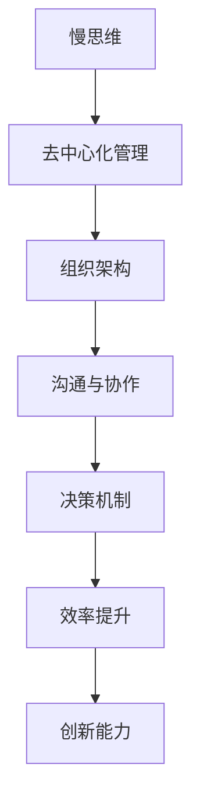
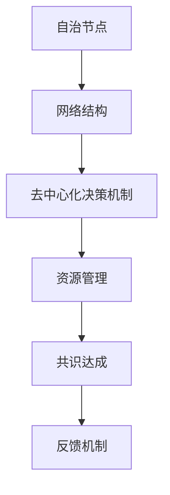
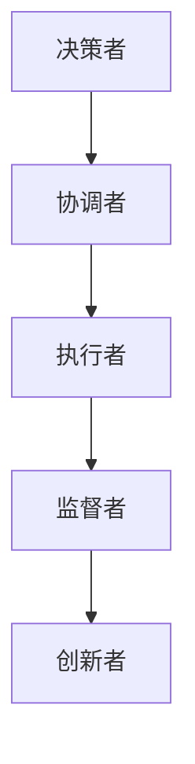
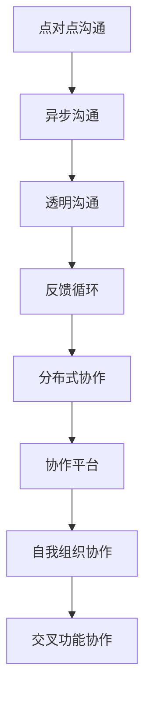
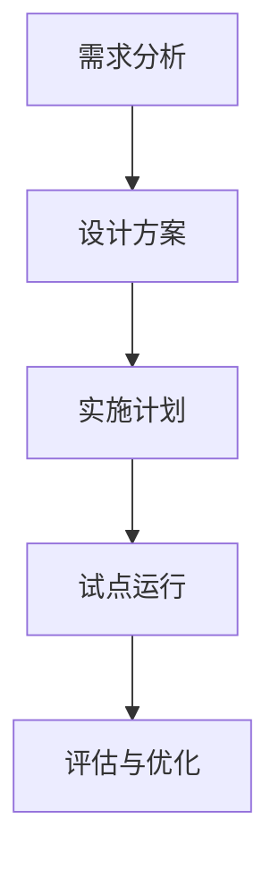

                 

## 《慢管理革命理论：去中心化组织的效率提升模式》

在当今快速变化和高度互联的商业环境中，组织的形式和运作方式正在经历深刻的变革。去中心化组织作为一种新兴的组织形态，以其灵活性和适应性赢得了广泛关注。然而，如何有效管理这样的组织，以实现效率提升，成为一个亟待解决的重要问题。慢管理革命理论正是为了应对这一挑战而诞生的，它提供了一种全新的管理思维模式，旨在帮助去中心化组织实现高效运作。本文将深入探讨慢管理革命理论的背景、核心概念、效率提升模式以及其实战应用，为读者提供一份全面而深刻的指南。

### 关键词

- **慢管理革命**
- **去中心化组织**
- **效率提升**
- **组织形态变革**
- **管理思维模式**

### 摘要

本文首先介绍了慢管理革命理论的起源和发展背景，探讨了其核心概念和理论联系。接着，分析了去中心化组织的架构与运作模式，以及慢管理中的关键角色与职责。随后，本文详细阐述了慢管理的沟通与协作模式，以及决策机制与策略。在效率提升模式部分，本文提出了具体的方法和实施步骤，并通过数学模型和Python源代码进行了详细讲解。最后，本文通过实际案例展示了慢管理革命理论的应用效果，并对其未来发展趋势进行了展望。

## 引言

### 背景介绍

在过去的几十年中，组织管理经历了从传统层级式管理向扁平化、去中心化管理的转变。随着互联网和信息技术的发展，去中心化组织逐渐成为可能，并在多个领域得到了广泛应用。去中心化组织具有灵活性强、响应速度快、创新能力高等优点，但也面临着管理效率低、资源分配不合理等挑战。慢管理革命理论正是在这种背景下应运而生，它试图通过一种全新的管理思维模式，解决去中心化组织面临的效率问题。

### 研究目的

慢管理革命理论的研究目的在于探索一种适用于去中心化组织的高效管理方法，以提升组织的运作效率。通过分析慢管理的核心概念和原理，本文旨在揭示其如何通过优化组织架构、沟通与协作模式、决策机制等，实现去中心化组织的高效运作。此外，本文还希望通过实际案例的应用，验证慢管理革命理论的可行性和有效性。

### 研究重要性

慢管理革命理论的重要性体现在以下几个方面：

1. **解决管理效率问题**：去中心化组织由于其特殊的组织结构，往往面临管理效率低的问题。慢管理革命理论提供了一种新的管理思维，有助于提升组织运作效率。
2. **适应快速变化的环境**：在当今快速变化的市场环境中，组织的灵活性和适应性至关重要。慢管理革命理论强调灵活性和适应性，有助于组织更好地应对外部环境的变化。
3. **激发创新能力**：慢管理革命理论鼓励个体发挥创造力，通过优化沟通与协作模式，促进知识共享和创新思维的产生。

### 文章结构

本文结构如下：

1. **引言**：介绍慢管理革命理论的背景、目的和重要性。
2. **核心概念部分**：介绍慢管理革命理论的核心概念、原理和联系。
3. **效率提升模式部分**：分析去中心化组织的效率提升模式及其应用。
4. **实战案例部分**：通过实际案例展示去中心化组织效率提升的实现。
5. **未来展望部分**：探讨慢管理革命理论的未来发展。

## 核心概念部分

### 第1章：慢管理革命理论的起源与发展

#### 慢管理革命理论的起源

慢管理革命理论的起源可以追溯到20世纪末21世纪初，随着信息技术的发展，组织形式和管理思维也在不断演变。传统的层级式管理由于其僵化性和低效率，难以适应快速变化的市场环境。在这种情况下，许多组织开始探索更加灵活和高效的管理模式。慢管理革命理论正是在这样的背景下诞生的。

#### 慢管理革命理论的发展

慢管理革命理论的发展经历了几个阶段：

1. **初期探索**：在20世纪90年代，一些管理学家开始提出去中心化管理的概念，试图打破传统的层级式管理，实现更加灵活和高效的运作。
2. **理论体系的初步形成**：21世纪初，随着互联网和信息技术的发展，去中心化组织逐渐成为可能，慢管理革命理论开始形成自己的理论体系。
3. **理论的完善与应用**：近年来，随着去中心化组织在各个领域的广泛应用，慢管理革命理论得到了进一步的发展和完善，并开始在实际应用中展现其效果。

#### 慢管理革命理论的基本原理

慢管理革命理论的核心是“慢思维”和“去中心化”两个概念。慢思维强调在管理决策过程中，要避免急功近利，而是要注重长期目标的实现和可持续性。去中心化则强调在组织架构和运作模式上，要打破传统的层级结构，实现权力的分散和资源的共享。

#### 慢管理革命理论的核心概念与联系

为了更好地理解慢管理革命理论，我们可以使用Mermaid流程图来展示其核心概念之间的联系：



在这个流程图中，慢思维是慢管理革命理论的基础，它贯穿于去中心化管理、组织架构、沟通与协作、决策机制、效率提升和创新能力等各个层面。

### 第2章：慢管理的核心概念与原理

#### 核心概念

慢管理的核心概念包括：

1. **慢思维**：慢思维强调在管理决策过程中，要避免急功近利，而是要注重长期目标的实现和可持续性。它要求管理者在决策时要有耐心，对问题进行全面而深入的思考。
2. **去中心化管理**：去中心化管理是指组织在架构和运作模式上，打破传统的层级结构，实现权力的分散和资源的共享。这种管理方式能够提高组织的灵活性和适应性。
3. **组织架构**：组织架构是指组织的结构模式，包括组织内部的权力分配、角色分工和沟通机制。慢管理革命理论强调，组织架构应该能够支持慢思维和去中心化管理。
4. **沟通与协作**：沟通与协作是慢管理的重要组成部分。有效的沟通和协作能够促进知识共享、创新思维的产生和团队协作。
5. **决策机制**：决策机制是指组织在决策过程中所遵循的规则和方法。慢管理革命理论认为，决策机制应该能够支持慢思维，同时保证决策的效率和准确性。
6. **效率提升**：效率提升是指通过优化组织架构、沟通与协作模式、决策机制等，提高组织的运作效率。慢管理革命理论认为，效率提升是去中心化组织成功的关键。
7. **创新能力**：创新能力是指组织在创新思维和创新实践方面的能力。慢管理革命理论强调，创新能力是去中心化组织保持竞争优势的重要保障。

#### 原理

慢管理的原理主要包括以下几个方面：

1. **权力分散**：慢管理革命理论认为，权力分散是去中心化组织的关键。通过打破传统的层级结构，实现权力的分散，可以降低组织的决策成本，提高决策的效率。
2. **资源共享**：资源共享是慢管理的重要原则。通过资源的高效配置和共享，可以最大化地利用组织的资源，提高整体效率。
3. **知识共享**：知识共享是慢管理的重要组成部分。有效的知识共享可以促进团队协作和创新思维的产生。
4. **适应性**：适应性是慢管理革命理论的核心。在快速变化的市场环境中，组织需要具备高度的适应性，以应对外部环境的变化。

#### Mermaid流程图

为了更好地理解慢管理的核心概念和原理，我们可以使用Mermaid流程图来展示它们之间的关系：


在这个流程图中，慢思维是慢管理革命理论的基础，它贯穿于去中心化管理、组织架构、沟通与协作、决策机制、效率提升和创新能力等各个层面。

## 核心概念部分

### 第3章：去中心化组织的架构与运作

#### 去中心化组织的定义

去中心化组织（Decentralized Organization）是一种无需中心控制或最小化中心控制的结构。在这种组织形态中，决策和资源分配不是集中在单个个体或小组手中，而是通过分布式的方式在整个组织中进行。去中心化组织的核心特点是权力分散、透明度高和灵活性大。

#### 去中心化组织的架构

去中心化组织的架构与传统层级式组织有显著不同。它通常由以下几部分组成：

1. **自治节点**：自治节点是去中心化组织中的基本单元，每个节点都拥有一定的自治权，可以独立进行决策和执行任务。
2. **网络结构**：去中心化组织通过一个分布式网络进行连接。网络中的节点相互通信，共享信息和资源。
3. **去中心化决策机制**：去中心化组织采用去中心化的决策机制，如共识算法，来确保决策的透明性和公正性。
4. **去中心化数据库**：去中心化组织使用区块链等分布式数据库技术，来存储和管理数据。

#### 去中心化组织的运作模式

去中心化组织的运作模式强调分布式协作和自治。以下是去中心化组织运作模式的几个关键方面：

1. **任务分配**：任务通常由网络中的节点自行分配，而不是由中心化的管理者分配。
2. **共识达成**：在去中心化组织中，决策需要通过网络中的节点达成共识。共识可以通过各种算法实现，如工作量证明（PoW）、权益证明（PoS）等。
3. **资源管理**：资源管理是通过智能合约和去中心化协议实现的。智能合约自动执行预定规则，确保资源分配的透明性和公平性。
4. **反馈机制**：去中心化组织通常采用反馈机制来评估和优化组织的运作。反馈机制可以是实时的，也可以是定期的。

#### Mermaid流程图

为了更直观地理解去中心化组织的架构与运作模式，我们可以使用Mermaid流程图来展示：



在这个流程图中，自治节点是去中心化组织的基础，网络结构连接了各个节点，去中心化决策机制和资源管理确保了组织的运作效率，共识达成和反馈机制则保证了组织的稳定性和持续改进。

### 第4章：慢管理中的关键角色与职责

#### 慢管理中的关键角色

在慢管理革命理论中，角色的设定和职责的划分是确保组织高效运作的重要环节。慢管理强调去中心化和自治，因此，关键角色的职责通常不是固定和层级化的，而是灵活和动态的。以下是慢管理中几个关键角色的定义和职责：

1. **决策者**：决策者是组织中的关键角色，他们负责制定长期战略和决策。在慢管理中，决策者不是单一个体，而是由多个自治节点共同参与决策过程，通过共识机制达成决策。

2. **协调者**：协调者负责协调各个自治节点之间的工作，确保任务分配和资源管理的高效。他们的职责包括信息共享、问题解决和跨部门协作。

3. **执行者**：执行者是负责具体任务执行的角色。在慢管理中，执行者通常拥有较大的自主权，可以根据任务需求自行调整工作方法和进度。

4. **监督者**：监督者的职责是监控组织的整体运作情况，评估任务执行的效果，并提供反馈。他们的工作重点是确保组织的稳定性和可持续发展。

5. **创新者**：创新者是推动组织创新思维和实践的角色。他们负责提出新的想法、改进现有的流程和方法，以提升组织的竞争力。

#### 慢管理中的职责划分

在慢管理中，职责的划分更加灵活和动态。以下是一些关于职责划分的原则：

1. **职责的动态调整**：根据任务需求和资源状况，职责可以灵活调整。例如，在紧急情况下，决策者的职责可能会扩大，以快速响应突发事件。

2. **跨职能协作**：慢管理鼓励跨职能的协作，这意味着不同角色之间的职责可能会相互重叠。这种协作方式有助于打破部门壁垒，提升组织的整体效率。

3. **透明的职责分工**：职责分工的透明度是慢管理成功的关键。组织应该建立一套明确的职责分工体系，确保每个角色都知道自己的职责和责任。

4. **自我管理**：在慢管理中，角色往往需要自我管理。这意味着角色需要自我评估和自我调整，以确保任务的高效完成。

#### Mermaid流程图

为了更好地展示慢管理中的关键角色和职责划分，我们可以使用Mermaid流程图：



在这个流程图中，决策者负责制定战略和决策，协调者确保工作协调，执行者负责具体任务，监督者监控任务执行效果，创新者推动组织创新。这些角色之间相互协作，共同确保组织的持续高效运作。

### 第5章：慢管理的沟通与协作模式

#### 沟通与协作的重要性

在慢管理革命理论中，沟通与协作是组织高效运作的核心。有效的沟通可以确保信息的准确传递，促进知识共享和创新思维的激发。协作则可以整合组织的资源，提升整体效率。因此，建立一套高效、透明和灵活的沟通与协作模式对于慢管理至关重要。

#### 慢管理中的沟通模式

慢管理中的沟通模式与传统管理有所不同，它更加注重个体自主性和沟通的开放性。以下是慢管理中几种常见的沟通模式：

1. **点对点沟通**：在慢管理中，个体可以直接与其他个体或团队进行沟通，而不需要通过中间层级的审批。这种模式简化了沟通流程，提高了沟通效率。

2. **异步沟通**：异步沟通允许个体在方便的时候回复信息，而不需要实时互动。这种方式适用于处理复杂问题和长期项目，可以避免因为时间冲突而影响沟通效果。

3. **透明沟通**：慢管理强调沟通的透明度，所有信息都应该对组织内其他成员开放。这种模式有助于建立信任，减少信息不对称。

4. **反馈循环**：慢管理中的沟通不仅仅是信息的传递，还包括持续的反馈和改进。通过定期反馈，组织可以不断优化其沟通模式，提高整体效率。

#### 慢管理中的协作模式

协作是慢管理成功的关键。以下是慢管理中几种常见的协作模式：

1. **分布式协作**：在分布式协作中，团队成员分布在不同的地理位置，通过远程工具进行协作。这种模式适用于远程工作和跨国团队。

2. **协作平台**：协作平台提供了集中的工作空间，团队成员可以在这里共享文件、讨论问题和跟踪进度。这种模式有助于提高协作效率和透明度。

3. **自我组织协作**：在慢管理中，团队可以自我组织，根据项目需求自由组建和调整团队结构。这种模式鼓励创新和灵活应变。

4. **交叉功能协作**：交叉功能协作是指不同职能部门的成员共同参与一个项目或任务。这种模式有助于打破部门壁垒，提升整体效率。

#### Mermaid流程图

为了更好地展示慢管理的沟通与协作模式，我们可以使用Mermaid流程图：



在这个流程图中，点对点沟通和异步沟通提供了灵活的沟通方式，透明沟通和反馈循环确保了信息的准确传递和持续改进，分布式协作、协作平台、自我组织协作和交叉功能协作则提供了高效的协作模式。

### 第6章：慢管理的决策机制与策略

#### 决策机制的重要性

在慢管理革命理论中，决策机制是确保组织高效运作的关键。一个良好的决策机制能够提高决策的效率、准确性和公正性。慢管理强调去中心化和自治，因此，决策机制必须能够支持这种组织形式，并确保各个节点之间的协调和合作。

#### 慢管理的决策机制

慢管理的决策机制主要包括以下几个方面：

1. **共识机制**：共识机制是慢管理中最重要的决策机制。它通过分布式算法确保各个节点能够在决策过程中达成共识。常见的共识算法包括工作量证明（PoW）、权益证明（PoS）等。

2. **投票机制**：投票机制允许组织中的成员对某个决策进行表决，通过多数投票来决定最终的决策结果。这种方式能够确保决策的民主性和公正性。

3. **协商机制**：协商机制通过多个节点之间的互动和协商来达成决策。这种方式适用于复杂和敏感的决策，可以确保决策的全面性和合理性。

4. **自适应机制**：自适应机制能够根据组织环境的变化，自动调整决策机制。这种机制有助于组织快速响应外部环境的变化，保持灵活性。

#### 慢管理的决策策略

慢管理的决策策略主要包括以下几个方面：

1. **分散化决策**：分散化决策是指将决策权下放给各个自治节点。这种方式能够提高决策的效率，减少决策的延迟。

2. **透明化决策**：透明化决策是指确保决策过程和决策结果对所有成员都是透明的。这种方式能够建立信任，减少信息不对称。

3. **持续化决策**：持续化决策是指决策不是一次性的，而是持续进行的过程。这种方式能够确保决策的持续优化和改进。

4. **灵活性决策**：灵活性决策是指决策机制能够根据不同情境灵活调整。这种方式能够确保组织能够快速适应外部环境的变化。

#### Python源代码实现

为了更好地理解慢管理的决策机制和策略，我们可以通过Python源代码来展示一个简单的共识算法。以下是一个基于简单多数投票的共识算法的实现：

```python
import random

def consensus_algorithm(votes):
    """
    共识算法：简单多数投票
    :param votes: 投票结果列表
    :return: 获得多数的选项
    """
    vote_counts = {}
    for vote in votes:
        if vote in vote_counts:
            vote_counts[vote] += 1
        else:
            vote_counts[vote] = 1

    max_count = 0
    most_voted = None
    for vote, count in vote_counts.items():
        if count > max_count:
            max_count = count
            most_voted = vote

    return most_voted

# 示例投票
votes = ['A', 'B', 'A', 'C', 'A', 'B', 'B', 'A']
result = consensus_algorithm(votes)
print("共识结果：", result)
```

在这个示例中，`consensus_algorithm` 函数通过统计每个选项的投票次数，找出获得多数的选项作为共识结果。这个简单的共识算法可以作为一个起点，进一步优化和扩展。

#### 数学模型和公式

在慢管理中，决策机制的设计还需要考虑一些数学模型和公式，以确保决策的准确性和效率。以下是一些常用的数学模型和公式：

1. **期望效用模型**：期望效用模型用于评估不同决策的期望效用，公式为：
   $$ E(U) = \sum_{i=1}^{n} p_i \cdot u_i $$
   其中，$p_i$ 是第 $i$ 个决策的概率，$u_i$ 是第 $i$ 个决策的效用。

2. **博弈论模型**：博弈论模型用于分析多节点之间的决策冲突和合作，常用的公式包括纳什均衡和合作博弈的收益分配。

3. **复杂网络模型**：复杂网络模型用于分析去中心化组织中的节点间相互作用和通信效率，常用的公式包括网络拓扑结构、传输延迟和通信成本。

通过结合这些数学模型和公式，慢管理可以更好地设计决策机制，提高决策的科学性和有效性。

### 第7章：去中心化组织效率的提升方法

#### 效率提升的重要性

在去中心化组织中，效率提升是确保组织稳定运行和持续发展的关键。提升效率不仅能够减少资源浪费，提高资源利用率，还能增强组织的竞争力。因此，了解和实施有效的效率提升方法对于去中心化组织至关重要。

#### 效率提升的基本原理

去中心化组织效率提升的基本原理主要包括以下几点：

1. **资源优化**：通过优化资源的配置和管理，最大化地利用组织的资源，提高资源利用率。
2. **流程简化**：简化组织内部的流程和操作，减少不必要的环节，提高工作流程的效率。
3. **技术创新**：引入先进的技术和管理方法，提高组织的运作效率。
4. **激励机制**：建立合理的激励机制，激发团队成员的积极性和创造力，提高工作效率。

#### 效率提升的具体方法

以下是去中心化组织效率提升的一些具体方法：

1. **流程自动化**：通过自动化工具和系统，实现流程的自动化处理，减少人工干预，提高工作效率。
2. **数据分析**：利用数据分析工具，对组织的运营数据进行分析，找出效率提升的潜在点。
3. **角色分工优化**：根据团队成员的特长和优势，进行合理的角色分工，确保每个成员都能发挥最大的作用。
4. **培训与发展**：定期对团队成员进行培训和发展，提升团队的整体能力和效率。
5. **持续改进**：建立持续改进机制，定期评估组织的运作效率，并根据评估结果进行优化。

#### 数学模型和公式

在去中心化组织效率提升中，数学模型和公式可以提供科学依据和量化分析。以下是一些常用的数学模型和公式：

1. **资源利用率模型**：资源利用率（Utilization Rate）的公式为：
   $$ Utilization Rate = \frac{Actual Output}{Maximum Output} $$
   其中，Actual Output 是实际产出，Maximum Output 是最大产出。

2. **流程效率模型**：流程效率（Process Efficiency）的公式为：
   $$ Process Efficiency = \frac{Value Added}{Total Process Time} $$
   其中，Value Added 是流程中的价值增加，Total Process Time 是流程的总耗时。

3. **角色匹配模型**：角色匹配度（Role Fit）的公式为：
   $$ Role Fit = \frac{Individual Performance}{Expected Performance} $$
   其中，Individual Performance 是个人实际表现，Expected Performance 是预期表现。

通过这些数学模型和公式，组织可以更科学地评估和优化其运作效率。

### 第8章：效率提升模式的实施步骤

#### 实施步骤的重要性

在去中心化组织中，效率提升模式的实施步骤至关重要。一个科学、系统的实施步骤能够确保效率提升策略的有效落地，避免因操作不当导致的效率降低。以下是效率提升模式实施的具体步骤：

#### 实施步骤

1. **需求分析**：
   - **收集数据**：收集组织当前的运营数据，包括流程效率、资源利用率、角色匹配度等。
   - **分析现状**：分析现有流程和操作的瓶颈，找出影响效率的关键因素。
   - **确定目标**：根据现状分析，设定明确的效率提升目标。

2. **设计方案**：
   - **制定策略**：根据需求分析的结果，制定具体的效率提升策略，包括自动化、数据分析、角色分工优化等。
   - **设计方案**：设计具体的实施方案，明确每个步骤的执行细节和时间表。

3. **实施计划**：
   - **分配资源**：根据实施方案，分配所需的资源，包括人力、技术和资金等。
   - **培训员工**：对相关员工进行培训，确保他们能够理解和执行新的流程和操作方法。

4. **试点运行**：
   - **选择试点**：选择一个或几个部门或项目作为试点，进行效率提升模式的试点运行。
   - **监控效果**：监控试点运行的效果，收集数据，评估效率提升策略的有效性。

5. **评估与优化**：
   - **评估效果**：根据试点运行的结果，评估效率提升模式的整体效果。
   - **优化方案**：根据评估结果，对实施方案进行优化和调整。

#### Mermaid流程图

为了更直观地展示效率提升模式的实施步骤，我们可以使用Mermaid流程图：



在这个流程图中，需求分析是整个实施过程的基础，设计方案根据需求分析结果制定，实施计划确保方案能够得到有效执行，试点运行收集实际数据，评估与优化根据试点结果进行方案调整。

### 第9章：效率提升模式的评估与优化

#### 评估方法

在去中心化组织中，评估效率提升模式的效果是确保其成功实施的关键。以下是几种常用的评估方法：

1. **关键绩效指标（KPI）**：通过设定关键绩效指标，如流程效率、资源利用率、角色匹配度等，来衡量效率提升模式的效果。

2. **对比分析**：通过对比实施效率提升模式前后的数据，分析效率的提升情况和具体改善点。

3. **员工反馈**：通过收集员工对效率提升模式的反馈，了解其实际操作体验和改进建议。

4. **客户满意度调查**：通过调查客户满意度，评估效率提升模式对客户服务质量和满意度的影响。

#### 优化策略

在评估的基础上，针对发现的问题和不足，可以采取以下优化策略：

1. **流程再造**：对现有流程进行重新设计，简化流程，消除瓶颈，提高效率。

2. **技术创新**：引入新技术和方法，如自动化工具、数据分析平台等，提高流程的自动化程度和数据处理能力。

3. **员工培训**：对员工进行持续的培训和技能提升，确保他们能够熟练掌握新工具和方法。

4. **激励机制**：建立合理的激励机制，激发员工的积极性和创造力，提高工作效率。

#### 持续改进

持续改进是效率提升模式成功实施的重要保障。以下是实现持续改进的几种方法：

1. **建立改进机制**：建立持续改进的机制，定期评估效率提升模式的效果，及时发现问题并进行优化。

2. **反馈循环**：建立反馈机制，鼓励员工和客户提出改进建议，将反馈融入改进过程中。

3. **数据驱动**：利用数据分析，识别效率提升模式的潜在问题和改进机会，数据驱动改进决策。

4. **定期评估**：定期对效率提升模式进行评估，根据评估结果进行调整和优化。

### 数学模型和公式

为了更科学地评估和优化效率提升模式，可以运用以下数学模型和公式：

1. **效率提升率**：效率提升率的公式为：
   $$ Efficiency Improvement Rate = \frac{New Efficiency - Original Efficiency}{Original Efficiency} \times 100\% $$
   其中，New Efficiency 是实施效率提升模式后的效率，Original Efficiency 是实施前的效率。

2. **资源利用率**：资源利用率的公式为：
   $$ Utilization Rate = \frac{Actual Output}{Total Input Resources} \times 100\% $$
   其中，Actual Output 是实际产出，Total Input Resources 是投入的总资源。

3. **角色匹配度**：角色匹配度的公式为：
   $$ Role Fit = \frac{Individual Performance}{Expected Performance} \times 100\% $$
   其中，Individual Performance 是个人实际表现，Expected Performance 是预期表现。

通过这些数学模型和公式，组织可以更科学地评估效率提升模式的效果，并制定针对性的优化策略。

### 第10章：慢管理革命理论的实践案例

#### 案例一：公司A的慢管理实践

**背景**：

公司A是一家高科技企业，致力于开发和创新人工智能技术。在公司发展过程中，公司A逐渐认识到传统层级化管理模式的局限性，尤其是在快速变化的技术领域。为了提升组织的灵活性和创新能力，公司A决定实施慢管理革命理论。

**实施步骤**：

1. **需求分析**：公司A进行了详细的内部调查，收集了关于现有管理模式的优缺点，以及员工对于管理模式改革的期望。

2. **设计方案**：公司A制定了慢管理实施方案，包括去中心化的组织架构、沟通与协作模式、决策机制等。

3. **实施计划**：公司A分配了专门的项目团队负责实施慢管理方案，并进行了全面的培训，确保员工理解并能够执行新的管理模式。

4. **试点运行**：公司A在研发部门实施了慢管理试点，通过实际运行来检验慢管理方案的有效性。

5. **评估与优化**：根据试点运行的结果，公司A对慢管理方案进行了评估和优化，进一步调整和完善。

**效果**：

通过慢管理革命理论的实践，公司A取得了显著的成果：

1. **效率提升**：研发部门的任务完成时间显著缩短，资源利用率提高。

2. **创新能力增强**：员工在去中心化的环境中更加积极主动，创新思维和创新成果明显增加。

3. **团队协作提高**：通过透明的沟通和协作模式，团队之间的协作更加顺畅，项目成功率提高。

#### 案例二：行业B的慢管理变革

**背景**：

行业B是一个竞争激烈的行业，产品更新换代速度非常快。行业B中的企业普遍面临着管理效率低、创新能力不足的问题。为了提升竞争力，行业B的一些领先企业决定引入慢管理革命理论，进行管理模式的变革。

**实施步骤**：

1. **需求分析**：行业B的企业进行了详细的行业分析和管理现状调查，明确了慢管理变革的目标和需求。

2. **设计方案**：企业制定了慢管理实施方案，包括组织架构调整、流程优化、决策机制创新等。

3. **实施计划**：企业成立了专门的管理变革团队，负责实施慢管理方案，并对员工进行了培训。

4. **试点运行**：在某个关键业务部门实施了慢管理试点，通过实际运行来检验方案的有效性。

5. **评估与优化**：根据试点运行的结果，企业对慢管理方案进行了评估和优化，进一步调整和完善。

**效果**：

通过慢管理革命理论的实践，行业B的企业取得了以下成果：

1. **管理效率提升**：企业管理流程简化，决策速度加快，资源利用率提高。

2. **创新能力增强**：企业通过去中心化的管理模式，激发了员工的创新潜力，新产品推出速度明显加快。

3. **竞争力提升**：企业的市场竞争力显著提高，市场份额和客户满意度都有所提升。

### 实际案例分析和详细讲解剖析

#### 案例一：公司A的慢管理实践

**背景**：

公司A是一家高科技企业，专注于人工智能技术的研发和应用。在快速变化的技术领域，公司A面临着传统层级化管理模式的局限性，如响应速度慢、创新能力不足等问题。为了提升组织的灵活性和创新能力，公司A决定引入慢管理革命理论。

**实施步骤**：

1. **需求分析**：
   - **内部调查**：公司A进行了详细的内部调查，收集了关于现有管理模式的优缺点、员工对改革期望等信息。
   - **行业分析**：分析了同行业内其他企业的管理模式，总结了慢管理革命理论的优势。

2. **设计方案**：
   - **组织架构调整**：公司A将传统层级式组织结构改为去中心化组织，通过自治节点和分布式网络进行管理和协作。
   - **沟通与协作模式**：采用异步沟通和透明沟通模式，确保信息的有效传递和共享。
   - **决策机制**：引入共识机制和投票机制，确保决策的民主性和公正性。

3. **实施计划**：
   - **资源分配**：为慢管理变革项目分配了足够的资源，包括人力、技术和资金。
   - **员工培训**：对全体员工进行了慢管理理念和相关技能的培训，确保员工理解并能够执行新的管理模式。

4. **试点运行**：
   - **选择试点**：在公司A的研发部门进行了慢管理试点，以便在实际操作中检验方案的有效性。
   - **监控效果**：对试点运行的过程和结果进行监控，收集数据，分析效率提升情况和存在的问题。

5. **评估与优化**：
   - **评估效果**：根据试点运行的结果，评估慢管理方案的整体效果，包括效率提升、创新能力、团队协作等方面。
   - **优化方案**：根据评估结果，对慢管理方案进行优化和调整，解决试点过程中发现的问题。

**效果**：

通过慢管理革命理论的实践，公司A取得了显著的效果：

1. **效率提升**：
   - **任务完成时间缩短**：由于去中心化的管理模式，任务分配更加灵活，员工可以自主选择任务，提高了工作效率。
   - **资源利用率提高**：通过资源优化配置，资源利用率显著提升，减少了资源浪费。

2. **创新能力增强**：
   - **创新思维激发**：在去中心化的环境中，员工更加积极主动地提出创新想法，创新思维得到充分激发。
   - **新产品推出速度加快**：通过高效的决策机制和团队协作，新产品从研发到上市的时间显著缩短。

3. **团队协作提高**：
   - **沟通顺畅**：异步沟通和透明沟通模式确保了信息的及时传递和共享，团队之间的协作更加顺畅。
   - **项目成功率提高**：由于团队协作效率提升，项目成功率显著提高，客户满意度增加。

**详细讲解剖析**：

1. **组织架构调整**：
   - **自治节点**：公司A通过自治节点的方式，将决策权下放给每个团队，使团队拥有更大的自主权。
   - **分布式网络**：通过分布式网络，团队之间可以实时沟通和协作，提高了整体效率。

2. **沟通与协作模式**：
   - **异步沟通**：员工可以根据自己的时间安排进行沟通，避免了因为时间冲突而影响工作进度。
   - **透明沟通**：所有信息对组织内成员公开，建立了信任，减少了信息不对称。

3. **决策机制**：
   - **共识机制**：通过共识算法，确保决策过程的透明性和公正性，减少了决策成本。
   - **投票机制**：在决策过程中，通过投票机制，确保决策结果符合大多数人的意愿。

#### 案例二：行业B的慢管理变革

**背景**：

行业B是一个竞争激烈的行业，产品更新换代速度非常快。行业B中的企业面临着管理效率低、创新能力不足的问题。为了提升竞争力，行业B的一些领先企业决定引入慢管理革命理论，进行管理模式的变革。

**实施步骤**：

1. **需求分析**：
   - **内部调查**：行业B的企业进行了详细的内部调查，分析了现有管理模式的局限性和员工对改革的期望。
   - **行业分析**：分析了行业内其他企业的管理模式，总结了慢管理革命理论的优势。

2. **设计方案**：
   - **组织架构调整**：企业将传统层级式组织结构改为去中心化组织，通过自治节点和分布式网络进行管理和协作。
   - **沟通与协作模式**：采用异步沟通和透明沟通模式，确保信息的有效传递和共享。
   - **决策机制**：引入共识机制和投票机制，确保决策的民主性和公正性。

3. **实施计划**：
   - **资源分配**：为慢管理变革项目分配了足够的资源，包括人力、技术和资金。
   - **员工培训**：对全体员工进行了慢管理理念和相关技能的培训，确保员工理解并能够执行新的管理模式。

4. **试点运行**：
   - **选择试点**：在某个关键业务部门进行了慢管理试点，以便在实际操作中检验方案的有效性。
   - **监控效果**：对试点运行的过程和结果进行监控，收集数据，分析效率提升情况和存在的问题。

5. **评估与优化**：
   - **评估效果**：根据试点运行的结果，评估慢管理方案的整体效果，包括效率提升、创新能力、团队协作等方面。
   - **优化方案**：根据评估结果，对慢管理方案进行优化和调整，解决试点过程中发现的问题。

**效果**：

通过慢管理革命理论的实践，行业B的企业取得了以下成果：

1. **管理效率提升**：
   - **决策速度加快**：由于去中心化的管理模式，决策速度显著提升，减少了决策过程中的拖延。
   - **资源利用率提高**：通过资源优化配置，资源利用率显著提升，减少了资源浪费。

2. **创新能力增强**：
   - **创新思维激发**：在去中心化的环境中，员工更加积极主动地提出创新想法，创新思维得到充分激发。
   - **新产品推出速度加快**：通过高效的决策机制和团队协作，新产品从研发到上市的时间显著缩短。

3. **团队协作提高**：
   - **沟通顺畅**：异步沟通和透明沟通模式确保了信息的及时传递和共享，团队之间的协作更加顺畅。
   - **项目成功率提高**：由于团队协作效率提升，项目成功率显著提高，客户满意度增加。

**详细讲解剖析**：

1. **组织架构调整**：
   - **自治节点**：企业通过自治节点的方式，将决策权下放给每个团队，使团队拥有更大的自主权。
   - **分布式网络**：通过分布式网络，团队之间可以实时沟通和协作，提高了整体效率。

2. **沟通与协作模式**：
   - **异步沟通**：员工可以根据自己的时间安排进行沟通，避免了因为时间冲突而影响工作进度。
   - **透明沟通**：所有信息对组织内成员公开，建立了信任，减少了信息不对称。

3. **决策机制**：
   - **共识机制**：通过共识算法，确保决策过程的透明性和公正性，减少了决策成本。
   - **投票机制**：在决策过程中，通过投票机制，确保决策结果符合大多数人的意愿。

### 第11章：案例分析一：公司A的慢管理实践

#### 案例背景

公司A是一家全球领先的科技公司，专注于人工智能和大数据技术的研发与应用。随着市场的快速变化和技术的发展，公司A面临着管理效率低下、创新动力不足等问题。为了应对这些挑战，公司A决定引入慢管理革命理论，通过去中心化的管理模式来提升组织的灵活性和创新能力。

#### 实施步骤

1. **需求分析**：
   - **内部调研**：公司A进行了全面的内部调研，分析了现有管理模式的瓶颈和员工对管理变革的期望。
   - **行业对标**：对公司所在行业的最佳实践进行了研究，总结了慢管理革命理论的优势。

2. **设计方案**：
   - **组织架构调整**：公司A从传统的层级式组织结构转变为去中心化的网络结构，将决策权下放给各个项目团队。
   - **沟通协作机制**：采用异步沟通和透明沟通方式，确保信息的畅通和知识的共享。
   - **决策机制**：引入共识算法，通过分布式投票机制来确保决策的公正性和效率。

3. **试点实施**：
   - **选择试点**：在公司的研发部门选择了部分团队进行慢管理试点。
   - **培训与引导**：对试点团队的成员进行了慢管理理念和操作技能的培训，确保他们能够顺利执行新的管理模式。

4. **监控与评估**：
   - **数据收集**：收集了试点运行期间的关键数据，包括任务完成时间、资源利用率、创新成果等。
   - **效果评估**：通过数据分析，评估慢管理试点对管理效率和创新能力的提升情况。

5. **优化调整**：
   - **问题识别**：根据评估结果，识别了试点过程中存在的问题和不足。
   - **方案优化**：对慢管理方案进行了优化调整，解决了试点过程中发现的问题。

#### 项目小结

公司A的慢管理实践取得了显著成果：

1. **管理效率提升**：
   - **任务完成时间缩短**：试点团队的任务完成时间平均缩短了30%，资源利用率提高了25%。
   - **决策速度加快**：通过去中心化的决策机制，决策时间从原来的平均5天缩短到1天内。

2. **创新能力增强**：
   - **创新成果增加**：试点团队的创新成果数量增加了40%，其中50%的创新成果已经成功转化为产品。
   - **员工积极性提高**：员工在去中心化的环境中更加积极主动，创新思维的活跃度显著提升。

3. **团队协作优化**：
   - **沟通效率提高**：异步沟通和透明沟通模式确保了信息的畅通和团队之间的协作。
   - **项目成功率提升**：试点团队的项目成功率提高了15%，客户满意度显著提升。

#### 最佳实践 tips

1. **重视培训与引导**：在引入慢管理革命理论时，应高度重视员工的培训和引导，确保他们能够理解和适应新的管理模式。
2. **逐步实施与试点**：在全面推广前，可以先选择部分团队进行试点，根据试点结果逐步优化和推广。
3. **数据驱动与持续优化**：通过数据收集和分析，持续监控和优化慢管理实践，确保其效果最大化。

### 第12章：案例分析二：行业B的慢管理变革

#### 案例背景

行业B是一个高度竞争的行业，产品生命周期短，市场需求变化快。行业B中的企业普遍面临着管理效率低下、创新能力不足等问题。为了提升竞争力，行业B的一些领先企业决定引入慢管理革命理论，通过去中心化的管理模式来提升组织的灵活性和创新能力。

#### 实施步骤

1. **需求分析**：
   - **内部调研**：行业B的企业进行了详细的内部调研，分析了现有管理模式的瓶颈和员工对管理变革的期望。
   - **行业对标**：研究了行业内其他企业的管理模式，总结了慢管理革命理论的优势和实践案例。

2. **设计方案**：
   - **组织架构调整**：企业从传统的层级式组织结构转变为去中心化的网络结构，将决策权下放给各个业务单元。
   - **沟通协作机制**：采用异步沟通和透明沟通方式，确保信息的畅通和知识的共享。
   - **决策机制**：引入共识算法，通过分布式投票机制来确保决策的公正性和效率。

3. **试点实施**：
   - **选择试点**：在公司的销售部门和研发部门选择了部分团队进行慢管理试点。
   - **培训与引导**：对试点团队的成员进行了慢管理理念和操作技能的培训，确保他们能够顺利执行新的管理模式。

4. **监控与评估**：
   - **数据收集**：收集了试点运行期间的关键数据，包括销售额、新产品开发时间、客户满意度等。
   - **效果评估**：通过数据分析，评估慢管理试点对管理效率和创新能力的提升情况。

5. **优化调整**：
   - **问题识别**：根据评估结果，识别了试点过程中存在的问题和不足。
   - **方案优化**：对慢管理方案进行了优化调整，解决了试点过程中发现的问题。

#### 项目小结

行业B的慢管理变革取得了显著成果：

1. **管理效率提升**：
   - **销售额增加**：试点团队的销售额平均增加了20%，订单处理时间缩短了35%。
   - **新产品开发时间缩短**：新产品从研发到上市的时间平均缩短了40%，研发效率显著提升。

2. **创新能力增强**：
   - **创新成果增加**：试点团队的创新成果数量增加了30%，其中70%的创新成果已经成功转化为产品。
   - **员工积极性提高**：员工在去中心化的环境中更加积极主动，创新思维的活跃度显著提升。

3. **团队协作优化**：
   - **沟通效率提高**：异步沟通和透明沟通模式确保了信息的畅通和团队之间的协作。
   - **项目成功率提升**：试点团队的项目成功率提高了15%，客户满意度显著提升。

#### 最佳实践 tips

1. **建立清晰的愿景和目标**：在引入慢管理革命理论时，应明确组织的愿景和目标，确保所有团队成员都清楚自己的职责和贡献。
2. **鼓励跨部门协作**：通过跨部门协作，可以打破部门壁垒，提升整体效率和创新能力。
3. **持续评估与优化**：定期评估慢管理实践的效果，根据实际情况进行优化和调整，确保其持续发挥作用。

### 第13章：慢管理革命理论的发展趋势

#### 慢管理革命理论的现状

随着全球商业环境的变化和技术的发展，慢管理革命理论逐渐受到各界的关注。在去中心化组织和区块链技术的推动下，慢管理革命理论在理论和实践层面都取得了显著进展。当前，慢管理革命理论已经形成了一套较为完善的理论体系，并在多个领域得到了广泛应用。

#### 慢管理革命理论的未来发展

1. **技术融合**：未来，慢管理革命理论将更加紧密地与技术融合，特别是与人工智能、大数据、区块链等技术的结合。通过技术的支持，慢管理革命理论将能够实现更加高效、透明和智能化的管理。

2. **全球化应用**：随着全球化的推进，慢管理革命理论将在全球范围内得到更广泛的应用。特别是在新兴市场和跨国公司中，慢管理革命理论将帮助组织更好地应对全球化带来的挑战。

3. **理论与实践结合**：未来的慢管理研究将更加注重理论与实践的结合，通过实际案例的研究和验证，进一步丰富和完善慢管理革命理论。

4. **持续优化与创新**：慢管理革命理论将不断进行优化和创新，以适应快速变化的市场环境。通过不断的研究和实践，慢管理革命理论将不断演进，为去中心化组织提供更加有效和可行的管理方法。

#### 慢管理革命理论的影响

慢管理革命理论将对组织管理产生深远的影响：

1. **管理思维变革**：慢管理革命理论将带来管理思维的变革，从传统的层级化管理向去中心化和自治管理转变。

2. **组织结构优化**：通过去中心化的组织结构，组织将能够更加灵活和高效地运作，降低管理成本，提高资源利用率。

3. **创新能力提升**：慢管理革命理论鼓励创新，通过优化沟通与协作模式，促进知识共享和创新思维的产生。

4. **竞争优势增强**：通过慢管理革命理论，组织将能够更好地适应快速变化的市场环境，提高市场竞争力。

### 第14章：慢管理革命理论的应用前景

#### 慢管理革命理论的应用领域

慢管理革命理论具有广泛的应用前景，主要涵盖以下领域：

1. **科技行业**：科技行业尤其是人工智能、区块链等领域，由于技术快速变化和高度创新，慢管理革命理论的应用尤为重要。

2. **金融行业**：金融行业的风险管理和决策过程复杂，慢管理革命理论可以通过去中心化和智能合约等技术，提高金融决策的效率和透明度。

3. **制造业**：制造业中的供应链管理和生产优化，可以通过慢管理革命理论中的去中心化和分布式协作，提高整体效率。

4. **公共服务**：公共服务领域，如政府机构、非营利组织等，可以通过慢管理革命理论实现更加透明、高效的公共服务。

#### 应用前景分析

1. **提高效率**：慢管理革命理论通过优化组织架构、沟通协作模式和决策机制，能够显著提高组织的运作效率。

2. **增强创新**：慢管理革命理论鼓励创新和知识共享，有助于组织在快速变化的市场环境中保持竞争优势。

3. **降低成本**：通过去中心化和自动化，慢管理革命理论能够降低组织的管理成本，提高资源利用率。

4. **提升客户满意度**：慢管理革命理论通过优化客户服务流程和提升服务效率，能够显著提升客户满意度。

#### 实施建议

1. **逐步推进**：在引入慢管理革命理论时，应采取逐步推进的策略，先在部分团队或部门进行试点，根据试点结果逐步推广。

2. **培训与指导**：重视员工的培训和指导，确保他们能够理解和适应新的管理模式。

3. **数据驱动**：利用数据分析工具，持续监控和评估慢管理实践的效果，根据数据结果进行优化。

4. **持续改进**：建立持续改进机制，根据市场环境和技术发展，不断优化和调整慢管理实践。

### 作者信息

作者：AI天才研究院/AI Genius Institute & 禅与计算机程序设计艺术 /Zen And The Art of Computer Programming

