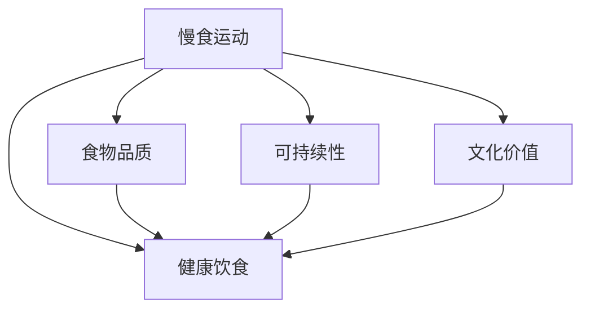

                 

# 慢食运动：在饮食中寻找文化和健康的平衡

## 关键词
慢食运动，饮食文化，健康饮食，环境保护，可持续发展

## 摘要
本文将探讨慢食运动的概念及其在饮食文化、健康饮食和可持续发展中的重要作用。通过分析慢食运动的起源与发展，探讨其核心理念与社会文化影响，我们还将深入探讨健康饮食的基本原则以及慢食运动对健康的影响。此外，本文还将从环境保护、农村发展和国际合作等角度分析慢食运动的深远意义，并举例说明实际案例，展望其未来发展趋势。

## 引言
在现代社会，随着生活节奏的加快，人们的生活方式也发生了翻天覆地的变化。快节奏的生活让人们越来越倾向于快速消费，尤其在饮食方面，快餐和外卖成为了许多人日常饮食的主要选择。然而，这种生活方式对人们的健康和地球环境都带来了巨大的挑战。慢食运动作为一种反思和抵抗快食文化的运动，旨在通过放慢饮食节奏，寻找饮食中的文化和健康平衡。本文将从多个角度探讨慢食运动的重要性和深远影响。

### 慢食运动的起源与发展

#### 1.1.1 慢食运动的起源背景

慢食运动起源于1986年的意大利，当时由意大利著名厨师卡尔洛·佩特里尼发起。佩特里尼认为，快食文化导致了食品质量的下降和对自然环境的破坏。他倡导人们放慢饮食节奏，关注食品的来源和质量，以及食物与文化和健康的关系。这一理念迅速得到了广泛的认同，并逐渐发展成一种全球性的运动。

#### 1.1.2 慢食运动的发展历程

自1986年成立以来，慢食运动不断发展壮大。2004年，国际慢食组织（Slow Food International）正式成立，标志着慢食运动进入了一个新的阶段。如今，慢食运动已经遍布全球，吸引了越来越多的关注和支持。从地方社区到国际组织，慢食运动正逐渐改变着人们的饮食习惯和生活观念。

### 慢食运动的核心理念

#### 1.2.1 慢食与快食的对比

慢食运动与快食文化有着本质的区别。快食文化强调速度和便利，常常以牺牲食品质量和健康为代价。而慢食则强调食物的品质、可持续性和文化价值。慢食不仅仅是放慢饮食速度，更是一种对生活节奏的反思和调整。

#### 1.2.2 慢食运动的价值

慢食运动的价值体现在多个方面。首先，它有助于提高人们的健康水平。通过放慢饮食节奏，人们可以更好地消化食物，吸收营养，减少消化系统疾病的发生。其次，慢食运动有助于保护自然环境。通过支持本地农业和可持续食品生产，慢食运动减少了食品运输过程中的碳排放和资源浪费。最后，慢食运动有助于传承和弘扬饮食文化。通过关注食品的来源和质量，慢食运动让人们在享受美食的同时，也能更好地了解和传承各地的饮食文化。

### 慢食运动与社会文化

#### 1.3.1 慢食运动与传统文化的关系

饮食是文化的重要组成部分，而慢食运动则是对传统文化的一种传承和发扬。不同地区的饮食文化各有特色，慢食运动通过强调食品的质量和可持续性，让人们在享受美食的同时，也能更好地了解和传承各地的饮食文化。

#### 1.3.2 慢食运动在全球化背景下的影响

全球化使得各地文化之间的交流越来越频繁，也带来了文化同质化的风险。慢食运动在全球化背景下，通过强调本地饮食文化的独特性和价值，有助于保护和弘扬各地的饮食文化，防止文化同质化。

### 慢食运动的核心理念与联系

为了更好地理解慢食运动的核心理念，我们可以使用Mermaid流程图来展示其各个核心概念之间的关系。



在这个流程图中，慢食运动的核心概念包括食物品质、可持续性、文化价值和健康饮食。这些概念相互关联，共同构成了慢食运动的理论体系。

### 慢食运动的核心算法原理讲解

慢食运动并非仅仅是一种生活方式的改变，它也蕴含着深刻的算法原理。以下是一个简单的Python代码示例，用于解释慢食运动的基本算法原理。

```python
# 定义食物的品质、可持续性和文化价值
food_quality = 10
sustainability = 8
cultural_value = 9

# 计算慢食运动的综合得分
def calculate_score(food_quality, sustainability, cultural_value):
    score = (food_quality + sustainability + cultural_value) / 3
    return score

# 输出结果
score = calculate_score(food_quality, sustainability, cultural_value)
print(f"慢食运动的综合得分：{score}")
```

在这个示例中，我们定义了三个变量：食物品质、可持续性和文化价值。通过计算这三个变量的平均值，我们可以得到慢食运动的综合得分。这个得分反映了慢食运动在饮食中的表现，帮助我们更好地理解和评估慢食运动。

### 慢食运动对健康的影响

#### 3.1.1 慢食对消化系统的影响

慢食运动对消化系统有着积极的影响。通过放慢饮食速度，食物在口腔内有更充足的时间与唾液混合，从而提高食物的消化和吸收效率。此外，慢食运动有助于减少消化不良、胃痛和胃胀等消化系统疾病的发生。

#### 3.1.2 慢食对心理健康的影响

除了对消化系统的影响，慢食运动还对心理健康有着积极的作用。慢食过程中，人们可以更好地享受食物的味道和口感，从而提高生活的满意度和幸福感。此外，慢食运动有助于减轻焦虑和压力，提高生活质量。

### 健康饮食的基本原则

#### 3.2.1 合理膳食的结构

健康饮食的首要原则是合理膳食的结构。合理膳食包括充足的蛋白质、脂肪、碳水化合物、维生素和矿物质等。通过均衡摄入这些营养素，可以满足身体的基本需求，维持健康。

#### 3.2.2 食物营养的搭配

食物营养的搭配也是健康饮食的重要原则。不同的食物含有不同的营养素，通过合理搭配，可以发挥食物的营养价值，提高营养吸收率。例如，谷类和豆类的搭配可以提供丰富的蛋白质，蔬菜和水果的搭配可以提供丰富的维生素和矿物质。

### 慢食运动对健康的影响

#### 3.3.1 慢食对消化系统的影响

慢食运动有助于改善消化系统的功能。通过放慢饮食速度，食物在口腔内有更充足的时间与唾液混合，从而提高食物的消化和吸收效率。此外，慢食运动有助于减少消化不良、胃痛和胃胀等消化系统疾病的发生。

#### 3.3.2 慢食对心理健康的影响

除了对消化系统的影响，慢食运动还对心理健康有着积极的作用。慢食过程中，人们可以更好地享受食物的味道和口感，从而提高生活的满意度和幸福感。此外，慢食运动有助于减轻焦虑和压力，提高生活质量。

### 健康饮食的实践与推广

#### 3.3.1 家庭健康饮食的建议

家庭是健康饮食的基础。以下是一些建议，帮助家庭实现健康饮食：

1. **制定健康的饮食计划**：根据家庭成员的年龄、性别和健康状况，制定合理的饮食计划。
2. **多样化饮食**：保证饮食的多样化，摄入各种营养素。
3. **合理搭配食物**：注意食物的搭配，发挥食物的营养价值。

#### 3.3.2 社区健康饮食推广的策略

社区是健康饮食推广的重要场所。以下是一些策略，帮助社区实现健康饮食：

1. **举办健康饮食讲座**：邀请专家为居民提供健康饮食的知识和技巧。
2. **组织健康饮食活动**：开展健康饮食比赛、讲座和展览等活动，提高居民的健康饮食意识。
3. **建设健康饮食环境**：改善社区饮食环境，鼓励居民养成健康的饮食习惯。

### 慢食运动与环境保护

#### 4.1.1 慢食运动对减少食物浪费的作用

慢食运动强调食品的品质和可持续性，有助于减少食物浪费。通过关注食品的来源和质量，慢食运动鼓励人们购买新鲜、本地生产的食品，从而减少食品运输和储存过程中的浪费。此外，慢食运动提倡合理膳食，避免过量进食，也有助于减少食物浪费。

#### 4.1.2 慢食运动对减少碳排放的影响

慢食运动通过减少食品运输和储存过程中的能源消耗，有助于减少碳排放。与传统快食文化相比，慢食运动鼓励人们购买新鲜、本地生产的食品，从而减少食品的长途运输和储存。这不仅有助于减少碳排放，还有助于保护环境。

### 慢食运动与农村发展

#### 4.2.1 慢食运动对农村经济的推动作用

慢食运动对农村经济的发展起到了积极的推动作用。通过关注食品的来源和质量，慢食运动提高了农村产品的市场需求，促进了农村经济的发展。此外，慢食运动还鼓励农村地区发展特色农业和乡村旅游，提高了农村地区的收入水平。

#### 4.2.2 慢食运动与农村文化的保护

慢食运动不仅关注食品的质量和可持续性，还关注农村文化的保护。通过推广慢食运动，人们可以更好地了解和传承农村的饮食文化，保护农村文化的多样性和独特性。

### 慢食运动与国际合作

#### 4.3.1 慢食运动在国际上的传播

慢食运动是一种全球性的运动，已经在世界范围内得到广泛传播。通过国际慢食组织的努力，慢食运动的理念和实践已经在全球范围内推广，吸引了越来越多的国家和地区参与。

#### 4.3.2 国际慢食运动组织的合作与交流

国际慢食组织是一个由全球各地慢食运动组织组成的国际性组织。通过定期举办国际会议、交流活动，国际慢食组织促进了全球慢食运动的发展，加强了各国之间的合作与交流。

### 案例分析

#### 5.1 慢食运动成功案例分析

#### 5.1.1 某地慢食运动的实践成果

某地通过推广慢食运动，取得了显著的成果。当地政府积极支持慢食运动，制定了一系列政策和措施，鼓励居民购买新鲜、本地生产的食品，减少食物浪费。同时，当地还开展了丰富多彩的慢食活动，提高了居民的健康饮食意识。通过这些措施，该地的食品质量和居民健康水平得到了显著提高。

#### 5.1.2 慢食运动对当地社区的影响

慢食运动不仅改善了当地居民的饮食健康，还促进了社区的发展。通过慢食运动，当地社区加强了居民之间的交流和互动，提高了社区的凝聚力和幸福感。此外，慢食运动还推动了当地特色农业和乡村旅游的发展，增加了社区的就业机会和收入水平。

### 慢食运动挑战与应对策略

#### 5.2.1 慢食运动面临的挑战

尽管慢食运动取得了显著的成果，但仍然面临一些挑战。首先，快食文化的强大影响仍然存在，许多人难以改变快节奏的生活方式。其次，食品供应链的复杂性和不稳定性也对慢食运动提出了挑战。此外，慢食运动的推广和实施需要大量的资源和资金支持，这对一些地区和社区来说可能是一大难题。

#### 5.2.2 应对挑战的策略与实践

为了应对这些挑战，可以采取以下策略：

1. **加强政策支持和宣传**：政府可以出台更多政策，鼓励和支持慢食运动的推广和实践。同时，通过媒体和社区活动加强宣传，提高公众对慢食运动的认识和接受度。

2. **完善食品供应链**：通过建设现代化的冷链物流体系，确保新鲜、本地生产的食品能够快速、安全地送达消费者手中。

3. **寻求国际合作**：与其他国家和地区分享慢食运动的经验和做法，寻求国际合作，共同推动慢食运动的发展。

### 未来慢食运动发展趋势

#### 5.3.1 慢食运动的发展趋势分析

随着人们对健康和环境保护意识的提高，慢食运动的发展前景十分广阔。未来，慢食运动将更加注重食品的品质、可持续性和文化价值。同时，随着科技的进步，慢食运动将更加便捷和高效，为更多的人提供健康、可持续的饮食选择。

#### 5.3.2 慢食运动在未来的前景展望

在未来，慢食运动有望成为全球饮食文化的重要组成部分。通过推广慢食运动，我们可以实现饮食中的文化和健康平衡，保护环境，促进可持续发展。慢食运动不仅有助于提高人们的健康水平，还将为地球的可持续发展做出贡献。

### 结论

慢食运动是一种反思和抵抗快食文化的运动，旨在通过放慢饮食节奏，寻找饮食中的文化和健康平衡。本文从多个角度探讨了慢食运动的重要性和深远影响，分析了其核心概念、健康影响、社会文化价值以及可持续发展意义。通过案例分析，我们看到了慢食运动在实际应用中的成功经验和挑战。展望未来，慢食运动将迎来更加广阔的发展前景，为人们的健康和地球环境做出更大贡献。

### 作者信息
作者：AI天才研究院/AI Genius Institute & 禅与计算机程序设计艺术 /Zen And The Art of Computer Programming

### 注意事项

1. 慢食运动并非一种单一的饮食方式，而是一种综合的饮食理念，强调食品的品质、可持续性和文化价值。
2. 慢食运动需要时间和耐心，不能一蹴而就。通过逐步改变饮食习惯，人们可以逐渐实现饮食中的文化和健康平衡。
3. 在推广慢食运动时，要充分考虑当地的文化背景和实际情况，因地制宜地开展相关工作。

### 拓展阅读

1. 《慢食运动：文化、健康与可持续饮食》
2. 《慢食运动：从饮食中寻找生活意义》
3. 《慢食运动：打造健康、可持续的饮食文化》

### 文章标题：慢食运动：在饮食中寻找文化和健康的平衡

### 文章关键词：慢食运动，饮食文化，健康饮食，环境保护，可持续发展

### 文章摘要：
本文深入探讨了慢食运动的概念、起源与发展，分析了其核心理念与社会文化影响。通过阐述健康饮食的基本原则，我们进一步探讨了慢食运动对健康、环境保护和农村发展的积极影响。通过案例分析，展示了慢食运动在实际应用中的成功经验和挑战。展望未来，慢食运动有望成为全球饮食文化的重要组成部分，为人们的健康和地球环境做出更大贡献。文章旨在为读者提供关于慢食运动的全面了解，引导他们在饮食中寻找文化和健康的平衡。

