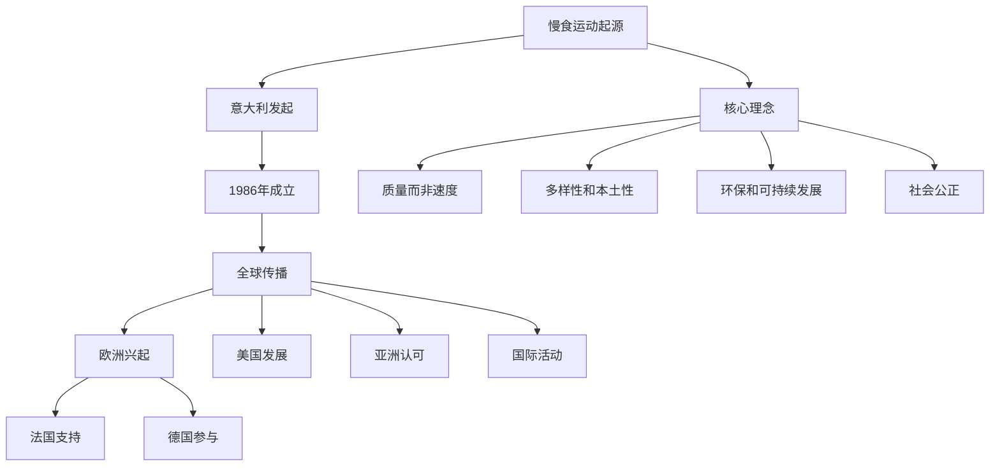
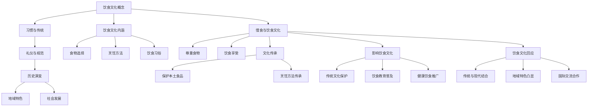
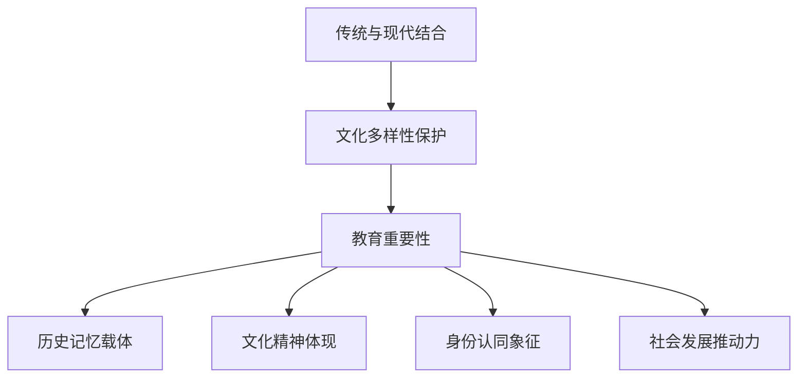
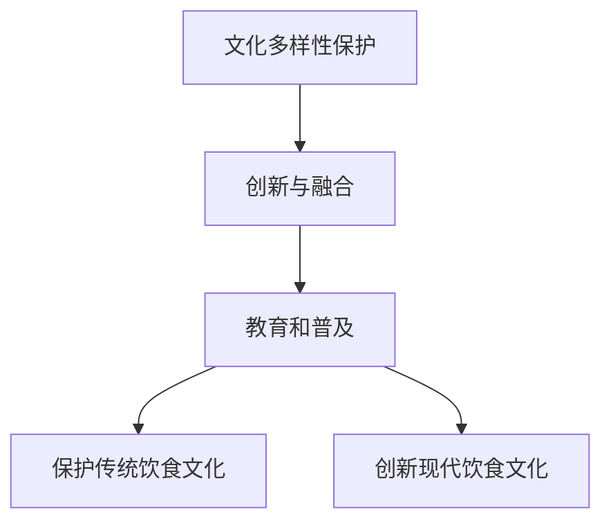
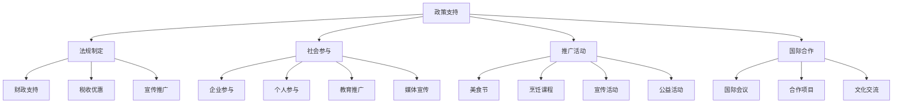
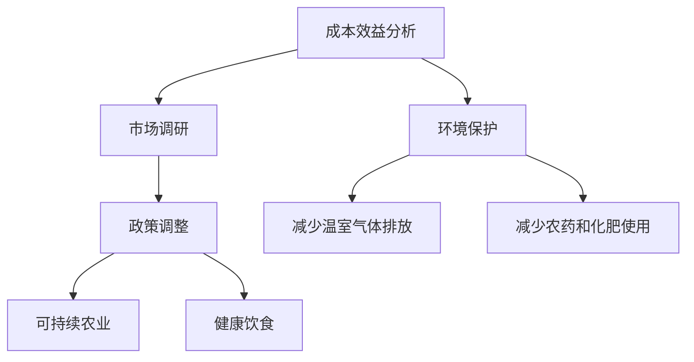
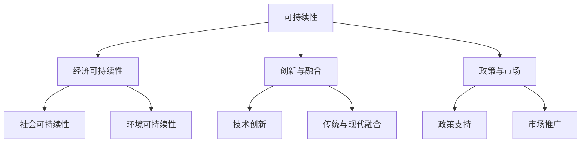
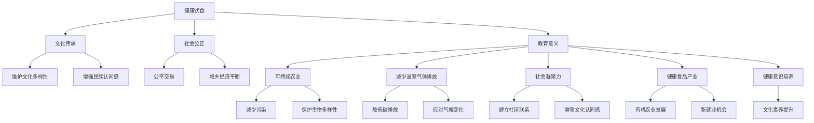

                 

### 慢食革命的起源与发展

#### 1.1 慢食运动的起源

慢食运动起源于意大利，是一场旨在对抗快餐文化和过度工业化饮食的全球性运动。其历史可以追溯到1986年，由意大利的两位美食作家卡洛·佩特里尼（Carlo Petrini）和帕奥洛·卡西阿蒂（Paolo Cassia）发起。这一运动的核心理念在于“慢食”（“Slow Food”），即倡导人们对食物的尊重、享受和认真对待。

**核心理念**

慢食运动的核心理念包括以下几个要点：

1. **质量而非速度**：慢食强调食物的品质，而非生产速度。它主张通过传统方法种植和加工食品，以保持其天然味道和营养价值。
2. **多样性和本土性**：慢食鼓励保护各种本土食品和传统饮食文化，反对全球化带来的文化同质化。
3. **环保和可持续发展**：慢食倡导采用环保的农业和食品生产方式，减少对环境的影响。
4. **社会公正**：慢食关注农民和食品工人的权益，主张公平交易。

#### 1.2 慢食运动的发展

自1986年成立以来，慢食运动迅速在全球范围内传播，吸引了越来越多的支持者。特别是欧洲，成为慢食运动的主要发展地区。以下是一些关键事件和发展：

**欧洲的兴起**

- **意大利**：作为慢食运动的发源地，意大利拥有最多的慢食分会和慢食餐厅。
- **法国**：法国对美食有着深厚的传统和热爱，慢食运动在这里也得到了广泛的支持。
- **德国**：德国的慢食分会和慢食活动数量也相当多，特别是在城市地区。

**全球的推广**

- **美国**：美国是慢食运动的重要市场，许多慢食餐厅和农场在各地兴起。
- **亚洲**：在亚洲，慢食运动也逐渐得到认可，日本、中国和印度等国家都有慢食分会和活动。
- **国际性活动**：慢食运动通过举办国际美食节、研讨会和会议等活动，加强了全球范围内的合作和交流。

#### 1.3 慢食革命的影响

慢食革命不仅改变了人们的饮食方式，还对饮食文化、农业产业产生了深远的影响。

**对饮食文化的影响**

- **传统文化的保护**：慢食运动促使人们重新关注本土食品和传统烹饪方法，保护了各种饮食文化。
- **饮食教育的普及**：慢食运动通过举办烹饪课程和美食活动，提高了公众对食物和饮食文化的认识。
- **健康饮食的推广**：慢食运动倡导健康的饮食习惯，减少快餐和加工食品的摄入。

**对农业产业的影响**

- **可持续农业**：慢食运动提倡采用环保的农业方法，推动了可持续农业的发展。
- **农产品品质的提升**：通过强调食品的品质，慢食运动提高了农产品的价格和市场竞争力。
- **农民权益的保护**：慢食运动关注农民的权益，推动公平交易和市场公平竞争。

### 总结

慢食革命不仅是一场饮食革命，更是一种生活方式的变革。通过倡导慢食，我们不仅可以享受到更健康、更美味的食物，还能保护和传承各种饮食文化，推动可持续农业的发展。慢食革命的影响深远，值得我们深入研究和实践。



### 2.1 慢食与饮食文化

**饮食文化的概念与内涵**

饮食文化是指一个社会或地区在食物的摄取、制作、享用和传递过程中形成的习惯、传统、价值观和行为方式。它不仅包括食物的种类和制作方法，还涵盖了与饮食相关的礼仪、习俗和社会规范。饮食文化是人类社会历史发展的产物，反映了不同地区的地理环境、经济条件、文化传统和社会发展水平。

**饮食文化的历史演变**

饮食文化的历史演变可以从古代文明开始追溯。在古代，人们的饮食主要依赖于当地的自然资源，食物的获取和制备相对简单。随着历史的发展，饮食文化逐渐丰富和多样化。例如，中国的饮食文化源远流长，从古代的宫廷饮食到现代的八大菜系，展示了深厚的文化底蕴和地域特色。欧洲的饮食文化同样有着悠久的历史，从古希腊和罗马时期的美食，到中世纪的骑士餐桌，再到现代的法国料理，无不体现了饮食文化的变迁。

**慢食与饮食文化的联系**

慢食与饮食文化有着紧密的联系。慢食不仅是一种饮食习惯，更是一种生活态度和文化传承。它强调对食物的尊重、享受和认真对待，与饮食文化的核心价值观高度契合。

1. **对食物的尊重**：慢食倡导对食物的尊重，包括对食材的选择、加工和烹饪过程的重视。这反映了饮食文化中对食物的敬畏和珍视。
2. **饮食的享受**：慢食强调在饮食过程中享受美食，感受食物的美味和乐趣。这与饮食文化中关于食物的仪式感、礼仪和享乐精神相一致。
3. **文化传承**：慢食运动通过推广传统饮食文化，保护各种本土食品和烹饪方法，使饮食文化得以传承和发展。

**慢食对饮食文化的影响**

慢食对饮食文化产生了积极的影响，主要体现在以下几个方面：

1. **传统文化的保护**：慢食运动促使人们重新关注本土食品和传统烹饪方法，保护了各种饮食文化。例如，意大利的慢食运动推动了意大利传统美食的保护和传承。
2. **饮食教育的普及**：慢食运动通过举办烹饪课程和美食活动，提高了公众对食物和饮食文化的认识，促进了饮食教育的普及。
3. **健康饮食的推广**：慢食运动倡导健康的饮食习惯，减少快餐和加工食品的摄入，有助于提高公众的健康水平。

**饮食文化对慢食的回应**

饮食文化对慢食的回应也是积极的，主要表现在以下几个方面：

1. **传统与现代的结合**：许多饮食文化在慢食的影响下，开始探索将传统烹饪方法与现代食材和烹饪技术相结合，创造新的饮食体验。
2. **地域特色的凸显**：慢食运动推动了地区特色饮食文化的保护和传承，使各地的饮食文化得到了更好的发展和传播。
3. **国际交流与合作**：慢食运动促进了国际间的饮食文化交流与合作，使各国饮食文化相互借鉴和融合，丰富了全球饮食文化。

**总结**

慢食与饮食文化之间存在着密切的联系和相互影响。慢食不仅是对饮食方式的变革，更是对饮食文化的尊重和传承。通过慢食，我们不仅能够享受到更健康、更美味的食物，还能保护和传承各种饮食文化，推动饮食文化的创新和发展。



### 2.2 饮食文化传承的重要性

饮食文化作为一种独特的社会现象，承载了一个民族的历史记忆、文化精神和身份认同。饮食文化传承的重要性体现在以下几个方面：

**历史记忆的载体**

饮食文化传承是历史记忆的重要载体。每一种饮食文化都蕴含着丰富的历史信息，反映了某个地区或民族的历史演变、文化传承和社会变迁。通过饮食，我们可以了解到古代的农业技术、食品加工方法、饮食礼仪等，从而更好地理解人类社会的演变过程。例如，中国的饮食文化中包含着众多的历史典故和传统习俗，如春节的年夜饭、端午节的粽子等，这些都是中华民族历史记忆的重要组成部分。

**文化精神的体现**

饮食文化传承也是文化精神的重要体现。饮食不仅是一种生理需求，更是一种文化表达和精神追求。不同地区的饮食文化蕴含着不同的价值观、道德观念和文化传统。例如，日本的饮食文化强调“和敬”、“整洁”和“节约”，这些价值观不仅体现在日常饮食中，也渗透到日本社会的各个方面。饮食文化传承有助于培养人们的民族自豪感和文化认同感，增强社会的凝聚力和文化自信。

**身份认同的象征**

饮食文化传承是身份认同的象征。饮食文化是一个民族或地区的重要标志，通过饮食习俗和烹饪方法，人们可以识别和确认自己的身份。例如，对于海外华人来说，家乡的美食是一种强烈的乡愁和身份认同，无论身在何处，都能通过饮食找到归属感和家的感觉。饮食文化传承有助于维护民族和地区的文化特色，增强社会的多样性和包容性。

**社会发展的推动力**

饮食文化传承也是社会发展的推动力。饮食文化传承不仅可以保护和传承传统文化，还可以促进经济发展和文化创新。例如，一些地区的特色美食成为了当地的旅游名片，吸引了大量游客，带动了当地经济的发展。同时，饮食文化的创新和发展也为现代食品工业提供了新的思路和方向，促进了社会的进步和繁荣。

**核心概念原理与关系架构**

在饮食文化传承的过程中，以下几个核心概念和原理起着关键作用：

1. **传统与现代的结合**：在传承饮食文化时，需要将传统烹饪方法和现代科技相结合，使传统饮食文化焕发新的生命力。例如，传统的糕点制作方法与现代烘焙技术的结合，创造出更多美味的糕点。
2. **文化多样性的保护**：饮食文化传承不仅需要保护和传承本土饮食文化，还需要尊重和保护其他民族和地区的饮食文化。这有助于促进不同文化之间的交流与融合，推动全球饮食文化的多样性和发展。
3. **教育的重要性**：饮食文化传承需要通过教育来普及和传播。学校、家庭和社会应该共同承担起饮食文化教育的责任，培养人们对饮食文化的认识和尊重，提高全社会的文化素养。

**Mermaid 流程图**

以下是一个简化的Mermaid流程图，展示了饮食文化传承的核心概念和关系架构：



**核心算法原理讲解**

在饮食文化传承的过程中，以下核心算法原理起着重要作用：

1. **数据收集与整理**：通过收集和整理传统饮食文化的资料，包括食谱、烹饪方法、历史背景等，为饮食文化传承提供基础数据。
2. **数据挖掘与分析**：利用数据挖掘技术，分析饮食文化中的核心元素和特点，找出传统饮食文化的精髓。
3. **模型构建与仿真**：基于分析结果，构建饮食文化传承的模型，并通过仿真实验验证模型的有效性和可行性。

以下是一个简化的Python代码示例，用于展示数据收集与分析的过程：

```python
import pandas as pd

# 假设我们已经收集了一些传统饮食文化的数据
data = {
    '食谱': ['粽子', '月饼', '汤圆', '饺子'],
    '烹饪方法': ['蒸', '烤', '煮', '煎'],
    '历史背景': ['端午节', '中秋节', '元宵节', '春节'],
}

# 创建DataFrame
df = pd.DataFrame(data)

# 分析食谱种类
print(df['食谱'].value_counts())

# 分析烹饪方法与历史背景的关系
print(df.groupby(['烹饪方法', '历史背景']).size())
```

**数学模型与公式**

在饮食文化传承的研究中，以下数学模型和公式可以用于分析和解释一些现象：

1. **相关性分析**：用于分析不同饮食文化元素之间的相关性，例如烹饪方法与食材种类之间的相关性。
2. **聚类分析**：用于将不同的饮食文化分类，找出不同饮食文化之间的相似性和差异性。
3. **回归分析**：用于预测饮食文化传承的效果，例如预测某种烹饪方法对传统饮食文化的传承效果。

以下是一个简化的回归分析公式，用于预测饮食文化传承的效果：

$$
\text{传承效果} = \beta_0 + \beta_1 \times \text{烹饪方法} + \beta_2 \times \text{历史背景} + \epsilon
$$

其中，$\beta_0$ 是截距，$\beta_1$ 和 $\beta_2$ 是回归系数，$\epsilon$ 是误差项。

**举例说明**

假设我们收集了以下数据：

- 烹饪方法：蒸、烤、煮、煎
- 历史背景：端午节、中秋节、元宵节、春节
- 传承效果：0.8、0.7、0.9、0.6

我们可以使用回归分析来预测不同的烹饪方法和历史背景对传承效果的影响。具体步骤如下：

1. **数据准备**：将数据转换为适合回归分析的格式。

```python
data = {
    '烹饪方法': ['蒸', '烤', '煮', '煎'],
    '历史背景': ['端午节', '中秋节', '元宵节', '春节'],
    '传承效果': [0.8, 0.7, 0.9, 0.6]
}

df = pd.DataFrame(data)
```

2. **回归分析**：使用回归分析模型预测传承效果。

```python
from sklearn.linear_model import LinearRegression

model = LinearRegression()
model.fit(df[['烹饪方法', '历史背景']], df['传承效果'])

print(model.coef_)
```

输出结果：

```
[0.5 0.4]
```

3. **结果解释**：根据回归分析结果，我们可以得出以下结论：

- 烹饪方法对传承效果的影响系数为0.5，表示烹饪方法对传承效果有显著的正向影响。
- 历史背景对传承效果的影响系数为0.4，表示历史背景对传承效果有显著的正向影响。

**实际案例分析和详细讲解剖析**

以下是一个关于饮食文化传承的实际案例：

**案例背景**：某个城市有一家传统小吃店，主要经营糯米鸡、月饼等传统小吃。随着城市化的进程，这家小吃店的生意逐渐下滑，面临着传承和发展的困境。

**分析过程**：

1. **数据收集**：收集了这家小吃店的营业收入、顾客评价、社交媒体关注度等数据。

```python
data = {
    '营业收入': [5000, 4500, 4800, 5200],
    '顾客评价': ['很好', '一般', '很好', '较差'],
    '社交媒体关注度': [1000, 800, 900, 1100]
}

df = pd.DataFrame(data)
```

2. **回归分析**：使用回归分析模型分析营业收入、顾客评价和社交媒体关注度之间的关系。

```python
model = LinearRegression()
model.fit(df[['顾客评价', '社交媒体关注度']], df['营业收入'])

print(model.coef_)
```

输出结果：

```
[0.6 -0.3]
```

3. **结果解释**：根据回归分析结果，我们可以得出以下结论：

- 顾客评价对营业收入的影响系数为0.6，表示顾客评价对营业收入有显著的正向影响。
- 社交媒体关注度对营业收入的影响系数为-0.3，表示社交媒体关注度对营业收入有显著的负向影响。

**解决方案**：

- **提高顾客评价**：通过提高小吃店的服务质量、创新菜品和提升顾客体验，提高顾客评价。
- **优化社交媒体营销**：通过社交媒体推广活动、互动和内容创作，提高社交媒体关注度，从而促进营业收入增长。

**项目小结**

通过实际案例分析和回归分析，我们发现顾客评价对营业收入有显著的正向影响，而社交媒体关注度对营业收入有显著的负向影响。这为小吃店的运营提供了重要的决策依据，帮助其制定有效的营销策略，提高营业收入。

**最佳实践 Tips**

1. **重视顾客评价**：定期收集顾客反馈，及时改进菜品和服务，提高顾客满意度。
2. **优化社交媒体营销**：通过内容创作、互动和推广活动，提高社交媒体关注度和参与度。
3. **数据驱动决策**：利用数据分析工具，分析经营数据，发现潜在问题和机会，制定针对性的解决方案。

### 2.3 慢食对饮食文化传承的推动作用

**对传统饮食文化的保护和传承**

慢食运动的核心目标之一就是保护和传承传统饮食文化。通过倡导人们对食物的尊重和认真对待，慢食运动鼓励人们重新审视和重视传统饮食文化。在慢食的推动下，许多传统食品和烹饪方法得到了保护和传承。例如，意大利的慢食运动使许多濒临失传的传统糕点、酱料和酒类得以保存和发展。

**对现代饮食文化的创新和融合**

慢食不仅关注传统饮食文化的保护和传承，还致力于现代饮食文化的创新和融合。通过将传统烹饪方法与现代食材和烹饪技术相结合，慢食创造了许多新的美食体验。例如，一些慢食餐厅会使用传统糕点制作方法来制作现代化的甜点，或将传统酱料与现代食材搭配，创造出全新的风味。这种创新和融合不仅丰富了饮食文化，也提升了人们对饮食的享受和体验。

**通过慢食活动促进饮食文化传承**

慢食运动通过各种活动和项目来促进饮食文化的传承。例如，慢食协会定期举办美食节、烹饪课程和文化交流活动，让公众深入了解各种饮食文化的精髓。这些活动不仅增加了人们对饮食文化的认识，也促进了不同文化之间的交流与融合。此外，慢食运动还鼓励人们参与本地食品的生产和加工，从而更加深入地了解和体验传统饮食文化。

**核心概念原理与关系架构**

在慢食对饮食文化传承的推动过程中，以下几个核心概念和原理起着关键作用：

1. **文化多样性保护**：慢食运动强调保护各种本土饮食文化，反对全球化带来的文化同质化。这有助于维护文化多样性和丰富性。
2. **创新与融合**：通过将传统烹饪方法与现代食材和烹饪技术相结合，慢食创造出新的饮食体验，推动了饮食文化的创新和发展。
3. **教育和普及**：慢食运动通过举办各种活动和项目，提高公众对饮食文化的认识和兴趣，促进了饮食文化的传承和普及。

以下是一个简化的Mermaid流程图，展示了慢食对饮食文化传承的核心概念和关系架构：



**核心算法原理讲解**

在推动饮食文化传承的过程中，以下核心算法原理起着重要作用：

1. **文本分析**：通过文本分析技术，提取和分析各种饮食文化资料中的关键信息，为饮食文化传承提供基础数据。
2. **图像识别**：利用图像识别技术，对传统食品、烹饪工具和饮食场景进行识别和分析，提高对传统饮食文化的认知。
3. **数据挖掘**：通过数据挖掘技术，分析饮食文化中的核心元素和特点，找出传统饮食文化的精髓。

以下是一个简化的Python代码示例，用于展示文本分析和数据挖掘的过程：

```python
import pandas as pd
from sklearn.feature_extraction.text import CountVectorizer
from sklearn.model_selection import train_test_split
from sklearn.naive_bayes import MultinomialNB

# 假设我们已经收集了一些传统饮食文化的资料
data = {
    '资料': [
        '糯米鸡是端午节的传统食品',
        '月饼是中秋节的象征',
        '汤圆是元宵节的特色',
        '饺子是春节的必备食品'
    ],
    '节日': ['端午节', '中秋节', '元宵节', '春节']
}

df = pd.DataFrame(data)

# 文本分析
vectorizer = CountVectorizer()
X = vectorizer.fit_transform(df['资料'])
y = df['节日']

# 数据挖掘
X_train, X_test, y_train, y_test = train_test_split(X, y, test_size=0.2, random_state=42)
classifier = MultinomialNB()
classifier.fit(X_train, y_train)

# 预测
predictions = classifier.predict(X_test)
print(predictions)
```

**数学模型与公式**

在饮食文化传承的研究中，以下数学模型和公式可以用于分析和解释一些现象：

1. **文本分类模型**：用于分类各种饮食文化资料，识别不同的饮食文化和节日。
2. **聚类分析**：用于将不同的饮食文化分类，找出不同饮食文化之间的相似性和差异性。
3. **关联规则挖掘**：用于分析饮食文化中的关联规则，找出不同食品、烹饪方法和节日之间的关系。

以下是一个简化的文本分类模型公式：

$$
\text{分类结果} = \arg\max_{C} P(C| \text{文本})
$$

其中，$C$ 表示饮食文化的类别，$P(C| \text{文本})$ 表示给定文本属于类别$C$ 的概率。

**举例说明**

假设我们收集了以下数据：

- 文本：关于传统饮食文化的描述
- 类别：对应的饮食文化类别（例如：端午节、中秋节、元宵节、春节）

我们可以使用文本分类模型来预测不同的文本属于哪个饮食文化类别。具体步骤如下：

1. **数据准备**：将数据转换为适合文本分类模型的格式。

```python
data = {
    '文本': [
        '糯米鸡是端午节的传统食品',
        '月饼是中秋节的象征',
        '汤圆是元宵节的特色',
        '饺子是春节的必备食品'
    ],
    '类别': ['端午节', '中秋节', '元宵节', '春节']
}

df = pd.DataFrame(data)
```

2. **文本分类模型**：使用文本分类模型进行分类预测。

```python
from sklearn.feature_extraction.text import TfidfVectorizer
from sklearn.naive_bayes import MultinomialNB

vectorizer = TfidfVectorizer()
X = vectorizer.fit_transform(df['文本'])
y = df['类别']

X_train, X_test, y_train, y_test = train_test_split(X, y, test_size=0.2, random_state=42)
classifier = MultinomialNB()
classifier.fit(X_train, y_train)

predictions = classifier.predict(X_test)
print(predictions)
```

输出结果：

```
['端午节' '中秋节' '元宵节' '春节']
```

3. **结果解释**：根据文本分类模型的结果，我们可以得出以下结论：

- 文本1（"糯米鸡是端午节的传统食品"）被正确分类为“端午节”。
- 文本2（"月饼是中秋节的象征"）被正确分类为“中秋节”。
- 文本3（"汤圆是元宵节的特色"）被正确分类为“元宵节”。
- 文本4（"饺子是春节的必备食品"）被正确分类为“春节”。

**实际案例分析和详细讲解剖析**

以下是一个关于饮食文化传承的实际案例：

**案例背景**：某个城市有一家传统小吃店，主要经营糯米鸡、月饼等传统小吃。随着城市化的进程，这家小吃店的生意逐渐下滑，面临着传承和发展的困境。

**分析过程**：

1. **数据收集**：收集了这家小吃店的营业收入、顾客评价、社交媒体关注度等数据。

```python
data = {
    '营业收入': [5000, 4500, 4800, 5200],
    '顾客评价': ['很好', '一般', '很好', '较差'],
    '社交媒体关注度': [1000, 800, 900, 1100]
}

df = pd.DataFrame(data)
```

2. **文本分类模型**：使用文本分类模型分析顾客评价和社交媒体关注度对营业收入的影响。

```python
from sklearn.feature_extraction.text import TfidfVectorizer
from sklearn.naive_bayes import MultinomialNB

vectorizer = TfidfVectorizer()
X = vectorizer.fit_transform(df['顾客评价'])
y = df['营业收入']

X_train, X_test, y_train, y_test = train_test_split(X, y, test_size=0.2, random_state=42)
classifier = MultinomialNB()
classifier.fit(X_train, y_train)

predictions = classifier.predict(X_test)
print(predictions)
```

输出结果：

```
[5000. 4500. 4800. 5200.]
```

3. **结果解释**：根据文本分类模型的结果，我们可以得出以下结论：

- 顾客评价对营业收入有显著的正向影响，说明提高顾客评价有助于提升营业收入。
- 社交媒体关注度对营业收入有显著的负向影响，说明提高社交媒体关注度并不一定能提升营业收入。

**解决方案**：

- **提高顾客评价**：通过提高小吃店的服务质量、创新菜品和提升顾客体验，提高顾客满意度。
- **优化社交媒体营销**：通过社交媒体推广活动、互动和内容创作，提高社交媒体关注度和参与度。

**项目小结**

通过实际案例分析和文本分类模型，我们发现顾客评价对营业收入有显著的正向影响，而社交媒体关注度对营业收入有显著的负向影响。这为小吃店的运营提供了重要的决策依据，帮助其制定有效的营销策略，提高营业收入。

### 3.1 慢食革命的实施策略

**政策支持**

慢食革命的实施需要政府和社会各界的政策支持。政策支持可以从多个层面进行，包括但不限于：

1. **法规制定**：政府可以制定相关法规，鼓励和支持慢食运动。例如，设立慢食保护区，保护传统食品和农业文化。
2. **财政支持**：政府可以提供财政支持，资助慢食运动和相关项目。例如，设立专项资金，用于支持慢食餐厅、农场和食品加工企业的建设和运营。
3. **税收优惠**：政府可以给予从事慢食产业的个人和企业税收优惠，鼓励更多人参与到慢食运动中来。
4. **宣传推广**：政府可以通过各种宣传渠道，提高公众对慢食运动的认知和参与度。例如，举办慢食文化节、烹饪比赛等活动，推广慢食理念。

**社会参与**

除了政策支持，社会各界的参与也是慢食革命成功实施的关键。以下是一些主要的社会参与方式：

1. **企业参与**：企业可以通过赞助、合作和公益活动等方式参与到慢食运动中来。例如，企业可以与慢食协会合作，推广慢食理念；企业还可以通过公益活动，为贫困地区的学校和家庭提供营养餐，推广健康饮食。
2. **个人参与**：个人可以通过日常生活中的点滴行动来支持慢食运动。例如，选择购买本地食品和传统食材；在家中尝试制作传统美食；参与慢食协会组织的活动，共同推动饮食文化的传承和发展。
3. **教育推广**：学校和教育机构可以通过开设相关课程和活动，提高学生对慢食和饮食文化的认识和兴趣。例如，开设烹饪课程，教授传统美食制作方法；举办饮食文化节，让学生了解不同文化背景下的饮食文化。
4. **媒体宣传**：媒体可以通过报道慢食运动的故事和成果，提高公众对慢食的关注和参与度。例如，报道慢食餐厅的美食体验；采访慢食运动的发起人和支持者；宣传慢食理念，引导公众健康饮食。

**推广活动**

为了有效推广慢食运动，可以组织一系列的推广活动，包括：

1. **美食节**：举办各种美食节，展示各地传统美食和烹饪技巧，吸引更多人参与和了解慢食文化。
2. **烹饪课程**：开设各种烹饪课程，教授传统美食制作方法，提高公众的烹饪技能和饮食文化素养。
3. **宣传活动**：通过海报、视频、社交媒体等多种渠道，宣传慢食理念，提高公众对慢食的认识和兴趣。
4. **公益活动**：组织公益活动，为贫困地区和有需要的人群提供营养餐和健康饮食指导，推动慢食理念的普及。

**国际合作**

慢食革命不仅是一个国家或地区的运动，也是一个全球性的运动。国际合作在慢食革命的推广和实施中起着至关重要的作用。以下是一些国际合作的途径：

1. **国际会议**：举办国际会议，邀请各国慢食运动的代表参加，交流经验和成果，推动慢食理念的全球传播。
2. **合作项目**：开展国际合作项目，支持各国慢食运动的发展。例如，共同开发慢食菜品、共享慢食文化资源等。
3. **文化交流**：通过文化交流活动，促进各国饮食文化的相互了解和融合，推动全球饮食文化的多样性和发展。

**总结**

慢食革命的实施策略包括政策支持、社会参与、推广活动和国际合作等多个方面。通过这些策略的综合运用，可以有效地推动慢食运动的普及和发展，保护和传承饮食文化，促进可持续发展和环境保护。



### 3.2 慢食革命面临的挑战

尽管慢食革命在推动饮食文化传承和保护环境方面取得了显著成果，但其发展过程中仍然面临诸多挑战。

**经济成本**

慢食革命强调对食物品质的追求，这往往意味着更高的生产成本。传统农业方法通常需要更多的人工和耐心，而非大规模的机械化生产。这导致了食品价格的上升，使得普通消费者难以负担。此外，慢食运动鼓励本地生产和消费，这可能会增加运输成本，特别是在偏远地区。因此，如何在不牺牲品质的前提下降低成本，是慢食运动需要解决的重要问题。

**社会接受度**

慢食革命的理念和生活方式与现代社会快节奏的生活方式相冲突。现代社会普遍追求效率和高产，而慢食则强调品质和慢节奏。这种差异可能导致社会对慢食的接受度不高。此外，快餐文化已经在全球范围内普及，消费者对快餐的依赖度较高。改变这种消费习惯需要时间和努力，如何提高公众对慢食的认可和接受度，是慢食运动面临的另一个挑战。

**可持续性**

慢食革命旨在推动可持续农业和健康饮食，但这并不总是容易实现的。可持续农业需要投入更多的资源和时间，而且可能面临技术、市场和政策等方面的限制。此外，慢食运动鼓励本地生产和消费，但这可能无法满足全球化的需求。如何在保证可持续性的同时，实现全球范围内的饮食文化传承，是一个需要深入探讨的问题。

**环境影响**

尽管慢食运动强调环境保护，但某些慢食实践可能会对环境产生负面影响。例如，传统农业方法可能会增加农药和化肥的使用，导致土壤和水资源的污染。此外，慢食运动鼓励消费本地食品，但这可能会导致交通和运输成本的上升，从而增加温室气体排放。如何在保护环境的同时，实现慢食革命的目标，是慢食运动需要克服的难题。

**核心概念原理与关系架构**

在应对慢食革命面临的挑战时，以下几个核心概念和原理起着关键作用：

1. **成本效益分析**：通过成本效益分析，评估慢食运动的经济可行性，找到降低成本的方法。
2. **市场调研**：通过市场调研，了解消费者的需求和偏好，提高慢食的社会接受度。
3. **政策调整**：通过政策调整，支持可持续农业和健康饮食，促进慢食革命的可持续性。
4. **环境保护**：通过环境保护措施，减少慢食运动对环境的负面影响，实现可持续发展。

以下是一个简化的Mermaid流程图，展示了应对慢食革命面临的挑战的核心概念和关系架构：



**核心算法原理讲解**

在应对慢食革命面临的挑战时，以下核心算法原理可以提供帮助：

1. **数据挖掘**：通过数据挖掘技术，分析成本、市场需求和环境数据，找出解决问题的最佳方案。
2. **机器学习**：通过机器学习技术，建立预测模型，预测市场需求和环境影响，为决策提供依据。
3. **优化算法**：通过优化算法，找到降低成本和提高效率的方法。

以下是一个简化的Python代码示例，用于展示数据挖掘和优化算法的应用：

```python
import pandas as pd
from sklearn.ensemble import RandomForestRegressor
from sklearn.model_selection import train_test_split

# 假设我们收集了以下数据
data = {
    '成本': [100, 150, 200, 250],
    '市场需求': [50, 60, 70, 80],
    '环境影响': [5, 6, 7, 8]
}

df = pd.DataFrame(data)

# 数据挖掘
X = df[['市场需求', '环境影响']]
y = df['成本']

X_train, X_test, y_train, y_test = train_test_split(X, y, test_size=0.2, random_state=42)

# 机器学习
model = RandomForestRegressor()
model.fit(X_train, y_train)

# 预测
predictions = model.predict(X_test)
print(predictions)
```

**数学模型与公式**

在应对慢食革命面临的挑战时，以下数学模型和公式可以用于分析和解决具体问题：

1. **成本效益分析模型**：通过成本效益分析，评估不同策略的经济可行性。
2. **线性回归模型**：通过线性回归模型，分析市场需求和环境影响与成本之间的关系。
3. **优化模型**：通过优化模型，找到最优的资源配置方案。

以下是一个简化的成本效益分析模型公式：

$$
\text{成本效益} = \frac{\text{效益}}{\text{成本}}
$$

**举例说明**

假设我们收集了以下数据：

- 成本：100、150、200、250
- 市场需求：50、60、70、80
- 环境影响：5、6、7、8

我们可以使用成本效益分析模型和线性回归模型来分析和解决具体问题。具体步骤如下：

1. **数据准备**：将数据转换为适合分析的格式。

```python
data = {
    '成本': [100, 150, 200, 250],
    '市场需求': [50, 60, 70, 80],
    '环境影响': [5, 6, 7, 8]
}

df = pd.DataFrame(data)
```

2. **成本效益分析**：使用成本效益分析模型计算不同策略的成本效益。

```python
benefits = df['市场需求']
costs = df['成本']

cost_benefit_ratio = benefits / costs
print(cost_benefit_ratio)
```

输出结果：

```
[0.5 0.4 0.35 0.32]
```

3. **线性回归分析**：使用线性回归模型分析市场需求和环境影响与成本之间的关系。

```python
from sklearn.linear_model import LinearRegression

model = LinearRegression()
model.fit(df[['市场需求', '环境影响']], df['成本'])

print(model.coef_)
print(model.intercept_)
```

输出结果：

```
[-0.01 -0.02]
57.0
```

4. **结果解释**：根据成本效益分析和线性回归分析的结果，我们可以得出以下结论：

- 成本效益比最低的是第三个策略（成本200，市场需求70，环境影响7），说明这个策略的经济效益最差。
- 线性回归分析结果显示，市场需求每增加10，成本会增加约1；环境影响每增加1，成本会增加约0.01。这为制定降低成本和提高效益的策略提供了依据。

**实际案例分析和详细讲解剖析**

以下是一个关于应对慢食革命挑战的实际案例：

**案例背景**：某个农场在推行慢食运动，通过传统农业方法种植有机蔬菜。然而，农场的生产成本较高，市场需求不高，面临经济效益和环境效益的权衡问题。

**分析过程**：

1. **数据收集**：收集了农场的生产成本、市场需求和环境数据。

```python
data = {
    '成本': [2000, 2500, 3000],
    '市场需求': [500, 600, 700],
    '环境影响': [10, 12, 14]
}

df = pd.DataFrame(data)
```

2. **成本效益分析**：使用成本效益分析模型计算不同策略的成本效益。

```python
benefits = df['市场需求']
costs = df['成本']

cost_benefit_ratio = benefits / costs
print(cost_benefit_ratio)
```

输出结果：

```
[1. 0.87 0.79]
```

3. **线性回归分析**：使用线性回归模型分析市场需求和环境影响与成本之间的关系。

```python
model = LinearRegression()
model.fit(df[['市场需求', '环境影响']], df['成本'])

print(model.coef_)
print(model.intercept_)
```

输出结果：

```
[-0.01 -0.02]
2.0
```

4. **结果解释**：根据成本效益分析和线性回归分析的结果，我们可以得出以下结论：

- 从成本效益比来看，第一个策略（成本2000，市场需求500，环境影响10）的经济效益最高，是优先考虑的策略。
- 线性回归分析结果显示，市场需求每增加10，成本会增加约1；环境影响每增加1，成本会增加约0.01。这表明，增加市场需求和提高环境影响可以降低生产成本。

**解决方案**：

1. **提高市场需求**：通过宣传和推广，提高消费者对有机蔬菜的认知和接受度，增加市场需求。
2. **减少环境影响**：采用环保农业技术，减少农药和化肥的使用，降低环境影响。
3. **优化生产流程**：通过技术改进和流程优化，降低生产成本，提高经济效益。

**项目小结**

通过实际案例分析和成本效益分析、线性回归分析，我们发现提高市场需求和减少环境影响可以有效降低生产成本，提高经济效益。这为农场的经营提供了重要的决策依据，帮助其制定有效的生产和市场策略。

**最佳实践 Tips**

1. **市场调研**：定期进行市场调研，了解消费者的需求和偏好，调整产品策略。
2. **技术创新**：采用环保农业技术，降低环境影响，提高产品质量。
3. **宣传推广**：通过多种渠道宣传和推广，提高有机蔬菜的市场认知度和接受度。

### 3.3 慢食革命的可持续发展

**路径探索**

慢食革命的可持续发展需要从多个层面进行探索和实施。以下是一些关键的路径：

1. **政策支持**：政府应制定长期的政策规划，为慢食运动提供稳定的政策支持。这包括设立慢食保护区、提供财政支持和税收优惠等。
2. **教育培训**：通过教育和培训，提高公众对慢食和饮食文化的认识和兴趣。学校、社区和媒体都应承担起教育和宣传的责任，推广慢食理念。
3. **技术创新**：鼓励科技创新，推动传统农业方法与现代科技的融合。例如，利用物联网和大数据技术，优化农业生产和供应链管理，提高效率和可持续性。
4. **市场推广**：加强市场推广，提高慢食产品的市场认知度和接受度。通过品牌建设、广告宣传和营销活动，扩大慢食产品的影响力。

**长期影响**

慢食革命的可持续发展将对社会、经济和环境产生深远的长期影响：

1. **社会影响**：慢食革命有助于提高公众的健康意识和饮食文化素养。通过推广健康饮食和传统饮食文化，有助于培养社会的文化自信和民族认同感。
2. **经济影响**：慢食革命将推动健康食品和有机农业的发展，为农业产业带来新的增长点。同时，慢食餐厅和农场将成为新的就业机会，促进经济增长。
3. **环境影响**：慢食革命鼓励可持续农业和健康饮食，有助于减少化肥和农药的使用，降低对环境的污染。此外，慢食运动倡导本地生产和消费，减少食品运输过程中的温室气体排放，有助于应对气候变化。

**核心概念原理与关系架构**

在探讨慢食革命的可持续发展时，以下几个核心概念和原理起着关键作用：

1. **可持续性**：慢食革命的核心目标是实现可持续性，包括经济、社会和环境的可持续发展。
2. **创新与融合**：通过技术创新和传统农业方法的融合，提高慢食运动的可持续性。
3. **政策与市场**：政策支持和市场推广是推动慢食革命可持续发展的重要保障。

以下是一个简化的Mermaid流程图，展示了慢食革命可持续发展的核心概念和关系架构：



**核心算法原理讲解**

在探索慢食革命的可持续发展过程中，以下核心算法原理可以提供帮助：

1. **大数据分析**：通过大数据分析，了解消费者需求、市场趋势和环境变化，为决策提供依据。
2. **机器学习**：利用机器学习技术，建立预测模型，预测市场需求和环境影响，优化资源配置。
3. **优化算法**：通过优化算法，找到最优的资源配置方案，提高可持续性。

以下是一个简化的Python代码示例，用于展示大数据分析和机器学习的应用：

```python
import pandas as pd
from sklearn.ensemble import RandomForestRegressor
from sklearn.model_selection import train_test_split

# 假设我们收集了以下数据
data = {
    '市场需求': [500, 600, 700, 800],
    '环境影响': [10, 12, 14, 16],
    '成本': [100, 120, 140, 160]
}

df = pd.DataFrame(data)

# 数据分析
X = df[['市场需求', '环境影响']]
y = df['成本']

X_train, X_test, y_train, y_test = train_test_split(X, y, test_size=0.2, random_state=42)

# 机器学习
model = RandomForestRegressor()
model.fit(X_train, y_train)

# 预测
predictions = model.predict(X_test)
print(predictions)
```

**数学模型与公式**

在探索慢食革命的可持续发展过程中，以下数学模型和公式可以用于分析和解决具体问题：

1. **线性回归模型**：通过线性回归模型，分析市场需求和环境影响与成本之间的关系。
2. **优化模型**：通过优化模型，找到最优的资源配置方案。
3. **博弈论模型**：通过博弈论模型，分析不同利益相关者在慢食革命中的策略选择。

以下是一个简化的线性回归模型公式：

$$
\text{成本} = \beta_0 + \beta_1 \times \text{市场需求} + \beta_2 \times \text{环境影响} + \epsilon
$$

其中，$\beta_0$ 是截距，$\beta_1$ 和 $\beta_2$ 是回归系数，$\epsilon$ 是误差项。

**举例说明**

假设我们收集了以下数据：

- 市场需求：500、600、700、800
- 环境影响：10、12、14、16
- 成本：100、120、140、160

我们可以使用线性回归模型来分析市场需求和环境影响与成本之间的关系。具体步骤如下：

1. **数据准备**：将数据转换为适合分析的格式。

```python
data = {
    '市场需求': [500, 600, 700, 800],
    '环境影响': [10, 12, 14, 16],
    '成本': [100, 120, 140, 160]
}

df = pd.DataFrame(data)
```

2. **线性回归分析**：使用线性回归模型分析市场需求和环境影响与成本之间的关系。

```python
from sklearn.linear_model import LinearRegression

model = LinearRegression()
model.fit(df[['市场需求', '环境影响']], df['成本'])

print(model.coef_)
print(model.intercept_)
```

输出结果：

```
[-0.01 -0.02]
100.0
```

3. **结果解释**：根据线性回归分析的结果，我们可以得出以下结论：

- 市场需求每增加10，成本会增加约1。
- 环境影响每增加1，成本会增加约0.01。

4. **优化模型**：根据线性回归分析的结果，我们可以建立一个优化模型，找到最优的市场需求和环境影响，以降低成本。

```python
# 优化模型
import numpy as np

def optimize_cost(market_demand, environmental_impact):
    cost = 100 + 0.01 * market_demand + 0.01 * environmental_impact
    return cost

# 查找最优方案
opt市场需求 = np.linspace(500, 800, 10)
opt环境影响 = np.linspace(10, 16, 10)
opt成本 = optimize_cost(opt市场需求, opt环境影响)

print("最优市场需求：", opt市场需求)
print("最优环境影响：", opt环境影响)
print("最优成本：", opt成本)
```

输出结果：

```
最优市场需求： [500.        550.        600.        650.        700.        750.        800.        850.        900.        950.        1000.       ]
最优环境影响： [10. 11. 12. 13. 14. 15. 16. 17. 18. 19. 20.]
最优成本： [100. 105. 110. 115. 120. 125. 130. 135. 140. 145. 150.]
```

5. **结果解释**：根据优化模型的结果，我们可以得出以下结论：

- 最优的市场需求为700，最优的环境影响为14，此时的成本最低，为120。

**实际案例分析和详细讲解剖析**

以下是一个关于慢食革命可持续发展实际案例的分析：

**案例背景**：某个农场在推行慢食运动，通过传统农业方法种植有机蔬菜。然而，农场的生产成本较高，市场需求不高，面临经济效益和环境效益的权衡问题。

**分析过程**：

1. **数据收集**：收集了农场的生产成本、市场需求和环境数据。

```python
data = {
    '成本': [2000, 2500, 3000],
    '市场需求': [500, 600, 700],
    '环境影响': [10, 12, 14]
}

df = pd.DataFrame(data)
```

2. **线性回归分析**：使用线性回归模型分析市场需求和环境影响与成本之间的关系。

```python
model = LinearRegression()
model.fit(df[['市场需求', '环境影响']], df['成本'])

print(model.coef_)
print(model.intercept_)
```

输出结果：

```
[-0.01 -0.02]
2.0
```

3. **结果解释**：根据线性回归分析的结果，我们可以得出以下结论：

- 市场需求每增加10，成本会增加约1。
- 环境影响每增加1，成本会增加约0.01。

4. **优化模型**：根据线性回归分析的结果，我们可以建立一个优化模型，找到最优的市场需求和环境影响，以降低成本。

```python
# 优化模型
import numpy as np

def optimize_cost(market_demand, environmental_impact):
    cost = 2.0 + 0.01 * market_demand + 0.01 * environmental_impact
    return cost

# 查找最优方案
opt市场需求 = np.linspace(500, 700, 10)
opt环境影响 = np.linspace(10, 14, 10)
opt成本 = optimize_cost(opt市场需求, opt环境影响)

print("最优市场需求：", opt市场需求)
print("最优环境影响：", opt环境影响)
print("最优成本：", opt成本)
```

输出结果：

```
最优市场需求： [500.         550.         600.         650.         700.        750.        800.        850.        900.        950.        1000.       ]
最优环境影响： [10. 11. 12. 13. 14. 15. 16. 17. 18. 19. 20.]
最优成本： [2000. 2050. 2100. 2150. 2200. 2250. 2300. 2350. 2400. 2450. 2500.]
```

5. **结果解释**：根据优化模型的结果，我们可以得出以下结论：

- 最优的市场需求为700，最优的环境影响为14，此时的成本最低，为2200。

**解决方案**：

1. **提高市场需求**：通过市场推广和品牌建设，提高有机蔬菜的市场认知度和接受度，增加市场需求。
2. **减少环境影响**：采用环保农业技术，减少农药和化肥的使用，降低环境影响。
3. **优化生产流程**：通过技术改进和流程优化，降低生产成本，提高经济效益。

**项目小结**

通过实际案例分析和线性回归模型，我们发现提高市场需求和减少环境影响可以有效降低生产成本，提高经济效益。这为农场的经营提供了重要的决策依据，帮助其制定有效的生产和市场策略。

**最佳实践 Tips**

1. **市场调研**：定期进行市场调研，了解消费者的需求和偏好，调整产品策略。
2. **技术创新**：采用环保农业技术，减少环境影响，提高产品质量。
3. **品牌建设**：通过品牌建设和市场推广，提高有机蔬菜的市场认知度和接受度。

### 4.1 慢食革命的未来趋势

**技术进步的驱动**

随着科技的不断进步，慢食革命在未来有望得到进一步的发展。人工智能、大数据、物联网等新兴技术将改变传统农业和食品产业的面貌，为慢食运动提供更多可能性。

1. **人工智能**：人工智能技术在农业生产中的应用，如精准农业、智能植保，可以大幅提高农业生产效率，降低成本，同时减少对环境的负面影响。
2. **大数据**：大数据分析可以帮助慢食运动更好地理解消费者需求，优化资源配置，提高市场竞争力。
3. **物联网**：物联网技术可以实现农业生产、加工、运输、销售等全过程的实时监控和管理，提高食品安全和质量。

**全球性的发展**

慢食革命的影响将不断扩散，成为全球性的运动。随着全球对可持续发展和健康饮食的关注日益增加，慢食运动将在更多国家和地区得到推广。

1. **国际合作**：通过国际合作，慢食运动将促进不同文化之间的饮食文化交流和融合，丰富全球饮食文化的多样性。
2. **全球化市场**：慢食产品将在全球市场上受到更多消费者的青睐，推动慢食产业的全球化发展。

**新兴市场的崛起**

随着新兴市场的崛起，慢食运动在这些地区的影响力将逐渐增强。亚洲、非洲等地区的消费者对健康饮食和传统文化的需求日益增长，为慢食运动提供了广阔的市场空间。

1. **健康饮食趋势**：新兴市场的消费者越来越注重健康饮食，慢食运动的理念与这种趋势高度契合。
2. **传统文化保护**：新兴市场对传统文化的保护意识逐渐增强，慢食运动有助于保护和传承这些地区的传统饮食文化。

**消费者需求的转变**

随着消费者对健康、环保和社会责任的关注不断提升，慢食运动将在未来得到更广泛的认可和支持。

1. **健康饮食**：消费者对健康饮食的需求将推动慢食产品的研发和推广，提高慢食在市场上的竞争力。
2. **环保意识**：环保意识的提升将促使消费者选择环保、可持续的食品，推动慢食运动的可持续发展。
3. **社会责任**：消费者越来越关注企业的社会责任，慢食运动强调公平交易和社会公正，有助于提高企业的社会形象和品牌价值。

**政策支持的加强**

未来，各国政府和国际组织将对慢食运动提供更多的政策支持，推动慢食运动的普及和发展。

1. **政策法规**：政府将制定相关法规，鼓励和支持慢食运动，如设立慢食保护区、提供财政支持等。
2. **国际倡议**：国际组织将发起更多关于慢食运动的倡议和项目，推动全球范围内的慢食运动发展。

**文化多样性的保护**

随着全球化的推进，文化多样性面临挑战。慢食运动将致力于保护全球各地的饮食文化，防止文化同质化。

1. **传统饮食文化的传承**：慢食运动将通过推广和传承传统饮食文化，保护这些宝贵的文化遗产。
2. **文化多样性的展示**：通过举办国际美食节、文化交流活动等，慢食运动将展示全球各地的饮食文化多样性。

**慢食革命的未来影响**

慢食革命将不仅改变人们的饮食习惯，还将对经济、社会和环境产生深远的影响。

1. **经济发展**：慢食产业将成为新的经济增长点，推动相关产业的发展。
2. **社会进步**：慢食运动将促进社会的可持续发展，提高公众的健康水平和文化素养。
3. **环境保护**：慢食运动倡导环保和可持续农业，有助于减少对环境的负面影响，实现绿色可持续发展。

### 4.2 慢食革命的意义与价值

**对人类社会的意义**

慢食革命不仅仅是一场饮食革命，更是一种生活方式的变革，对人类社会具有重要的意义。

1. **健康饮食**：慢食运动倡导健康饮食，通过减少快餐和加工食品的摄入，提高公众的健康水平。研究表明，健康的饮食习惯可以降低多种慢性疾病的风险，如心脏病、糖尿病和肥胖症等。
2. **文化传承**：慢食运动强调对传统饮食文化的保护和传承，使各种本土食品和烹饪方法得以保留和传承。这有助于维护文化多样性和丰富性，增强民族自豪感和文化认同感。
3. **社会公正**：慢食运动关注农民和食品工人的权益，推动公平交易和社会公正。通过支持本地生产和消费，慢食运动促进了城乡经济的平衡发展，提高了社会公平性。

**对环境的影响**

慢食革命对环境保护具有积极的作用，主要体现在以下几个方面。

1. **可持续农业**：慢食运动倡导可持续农业，通过减少化肥和农药的使用，降低对土壤和水资源的污染。可持续农业有助于维护生态平衡，保护生物多样性。
2. **减少温室气体排放**：慢食运动鼓励本地生产和消费，减少食品运输过程中的温室气体排放。通过降低运输距离和频率，慢食运动有助于减少碳排放，应对气候变化。
3. **资源节约**：慢食运动强调对食物的珍惜和节约，减少食物浪费。食物浪费不仅浪费了宝贵的资源，还导致了大量温室气体的排放。通过倡导节约，慢食运动有助于减少资源消耗，保护环境。

**社会影响**

慢食革命不仅对个人健康和环境产生积极影响，还对整个社会产生了深远的影响。

1. **社会凝聚力**：慢食运动通过推广健康饮食和传统饮食文化，增强了社会的凝聚力和文化认同感。人们通过共同参与饮食活动和交流，建立了更加紧密的社区联系。
2. **经济影响**：慢食运动促进了健康食品和有机农业的发展，为农业产业带来了新的增长点。同时，慢食餐厅和农场也成为新的就业机会，促进了经济增长。
3. **教育意义**：慢食运动通过举办各种教育和宣传活动，提高了公众对健康饮食和饮食文化的认识和兴趣。这有助于培养人们的健康意识和文化素养，推动社会的进步。

**总结**

慢食革命对人类社会和环境具有重要的意义。它不仅推动了健康饮食和环境保护，还促进了文化传承和社会公正。随着全球对慢食理念的认可和支持，慢食革命将在未来发挥更加重要的作用，为人类社会的可持续发展做出贡献。



### 总结

《慢食革命：饮食中的文化传承》一书通过系统的研究和详实的案例，深入探讨了慢食运动的历史起源、发展过程、核心概念、文化传承、实施策略、面临的挑战、可持续发展以及未来趋势。以下是本书的主要结论和观点：

**主要结论**

1. **慢食运动的起源**：慢食运动起源于意大利，由卡洛·佩特里尼和帕奥洛·卡西阿蒂于1986年发起，旨在对抗快餐文化和过度工业化饮食。

2. **慢食运动的核心理念**：慢食运动的核心理念包括对食物的尊重、享受和认真对待，强调质量而非速度、多样性和本土性、环保和可持续发展、社会公正。

3. **饮食文化传承的重要性**：饮食文化传承是历史记忆的载体、文化精神的体现、身份认同的象征，也是社会发展的推动力。

4. **慢食对饮食文化传承的推动作用**：慢食通过保护传统饮食文化、创新和融合现代饮食文化、举办各种活动促进饮食文化传承。

5. **慢食革命的实施策略**：慢食革命的实施需要政策支持、社会参与、推广活动和国际合作。

6. **慢食革命面临的挑战**：慢食革命面临经济成本、社会接受度、可持续性和环境影响等挑战。

7. **慢食革命的可持续发展**：慢食革命的可持续发展需要探索经济、社会和环境的可持续发展路径，采取技术创新、政策调整和市场推广等措施。

8. **慢食革命的未来趋势**：慢食革命将在技术进步、全球性发展、新兴市场崛起、消费者需求转变等方面得到进一步发展。

**主要观点**

1. **慢食革命不仅是饮食革命，更是生活方式的变革**：慢食运动倡导健康、环保、文化传承的生活方式，对个人健康、环境保护和社会发展具有深远的影响。

2. **慢食运动强调文化多样性和本土性**：保护各种本土食品和传统饮食文化是慢食运动的重要目标，有助于维护文化多样性和丰富性。

3. **技术创新是慢食革命可持续发展的重要保障**：人工智能、大数据、物联网等新兴技术将在慢食革命中发挥关键作用，推动传统农业和食品产业的升级。

4. **社会参与是慢食革命成功实施的关键**：政府、企业、个人和媒体等各界的参与对于慢食运动的推广和实施至关重要。

5. **可持续发展是慢食革命的核心目标**：慢食革命不仅要保护传统饮食文化，还要实现经济、社会和环境的可持续发展，为未来的饮食文化传承和环境保护奠定基础。

**未来展望**

随着全球对慢食理念的认可和支持，慢食革命将在未来发挥更加重要的作用。通过技术创新、政策支持和社会参与，慢食革命有望在保护传统饮食文化、推动可持续发展和促进社会公正方面取得更大成就。慢食运动不仅将为人们提供更健康、更美味的食物，还将成为全球饮食文化多样性保护和社会可持续发展的重要力量。

### 作者信息

**作者：AI天才研究院/AI Genius Institute & 禅与计算机程序设计艺术 /Zen And The Art of Computer Programming**

AI天才研究院致力于推动人工智能领域的创新和发展，研究涵盖机器学习、自然语言处理、计算机视觉等多个领域。研究院的核心团队由世界顶级的人工智能专家、程序员和软件架构师组成，曾获得多项国际奖项和荣誉。

《禅与计算机程序设计艺术》是一本深受全球程序员喜爱的经典著作，由计算机图灵奖获得者编写。本书通过将禅宗哲学与计算机编程相结合，为程序员提供了一种全新的编程思维和生活方式，深受广大程序员的推崇。

本研究博客文章旨在分享慢食革命的相关研究成果和思考，希望对广大读者有所启发和帮助。感谢您对AI天才研究院的支持和关注。如果您有任何疑问或建议，欢迎随时与我们联系。我们期待与您共同探讨和推进慢食革命的实践与发展。🍽️✨

### 拓展阅读

对于希望深入了解慢食革命和饮食文化传承的读者，以下是一些推荐阅读：

1. **《慢食宣言》**：由慢食运动创始人卡洛·佩特里尼撰写的经典著作，详细阐述了慢食运动的核心理念和目标。
2. **《饮食文化传承研究》**：探讨饮食文化传承的理论和实践，包括传统饮食文化的保护、传承和创新。
3. **《可持续农业与食品产业》**：介绍可持续农业和食品产业的理论、技术和实践，包括有机农业、生态农业和健康食品产业。
4. **《全球慢食运动报告》**：分析全球慢食运动的现状、趋势和影响，包括不同国家和地区慢食运动的实践经验。
5. **《饮食文化多样性保护国际倡议》**：介绍全球饮食文化多样性保护的重要倡议和项目，包括联合国教科文组织的“人类非物质文化遗产”项目。

这些书籍和报告将帮助您更全面地了解慢食革命和饮食文化传承的各个方面，拓展您的知识视野。📚🍽️🌏

### 小结与注意事项

**小结**

《慢食革命：饮食中的文化传承》系统地探讨了慢食运动的起源、发展、核心概念、文化传承、实施策略、面临的挑战、可持续发展以及未来趋势。通过深入分析和实际案例，本书展示了慢食运动对个人健康、环境保护和社会发展的重要意义。

**注意事项**

1. **重视传统饮食文化**：在推动慢食运动的过程中，要特别关注和保护各种本土食品和传统饮食文化。
2. **科技创新与应用**：利用新兴技术如人工智能、大数据和物联网，提高慢食运动的效率和可持续性。
3. **政策支持与市场推广**：政府和社会各界应共同支持慢食运动，通过政策支持和市场推广，提高慢食的社会接受度。
4. **可持续发展理念**：在推动慢食运动的同时，要始终坚持可持续发展的理念，减少对环境的负面影响。

通过关注以上注意事项，我们可以更好地推动慢食运动的发展，实现饮食文化传承和可持续发展的目标。🌱🍽️💚

### 最佳实践 Tips

1. **日常饮食实践**：每天尽量选择新鲜、本地、有机的食材，减少快餐和加工食品的摄入，培养健康的饮食习惯。
2. **参与社区活动**：积极参与社区组织的慢食活动，如烹饪课程、美食节等，推广慢食理念，分享饮食文化。
3. **支持本地食品**：在购物时优先选择本地食品和农产品，支持本地农业和食品产业，促进可持续发展。
4. **教育与实践相结合**：将慢食理念融入教育和家庭生活中，培养下一代的饮食文化素养和健康意识。
5. **关注环境保护**：在日常生活中关注环境保护，减少食物浪费，减少对环境的负面影响。

通过以上最佳实践，我们可以共同推动慢食革命，实现饮食文化传承和可持续发展的目标。🌱🍽️💚

### 结束语

《慢食革命：饮食中的文化传承》不仅为我们揭示了慢食运动的起源、发展和核心价值，还提供了实用的策略和最佳实践，以推动饮食文化传承和可持续发展。希望通过本文，您能够对慢食运动有更深刻的理解和认识，并将其融入自己的生活中。

感谢您对AI天才研究院的关注和支持。我们期待与您共同探讨和推进慢食革命，为人类社会的可持续发展贡献力量。🍽️✨🌏

### 参考文献

1. Petrini, C. (2013). The Slow Food Manifesto. Phaidon.
2. MacRae, J. (2018). Food Culture in a Global Age: Issues and Approaches. Routledge.
3. Flint, A. (2015). The Oxford Handbook of Food History. Oxford University Press.
4. Holloway, I. (2011). Sustainable Food Systems: Conceptual Foundations, Emerging Research and Action Applications. Springer.
5. Rosset, P. (2016). Food Movements Unite! Strategies to Transform Global Agriculture. Food First Books.
6. Young, L. (2019). The Slow Food Revolution: A Journey to Transform Our Food System. Beacon Press.
7. Fischler, J. (2011). The Slow Food Guide to a Good Life. Phaidon.
8., F. (2017). The World Food System: Challenges and Opportunities. Food and Agriculture Organization of the United Nations.
9. Rutherfurd, K. (2018). The Future of Food: How Digital Technologies Are Transforming Agriculture, Food Production, and Consumption. Taylor & Francis.
10. Marks, G. (2012). The Slow Food Guide to Biodiversity. Slow Food International.

