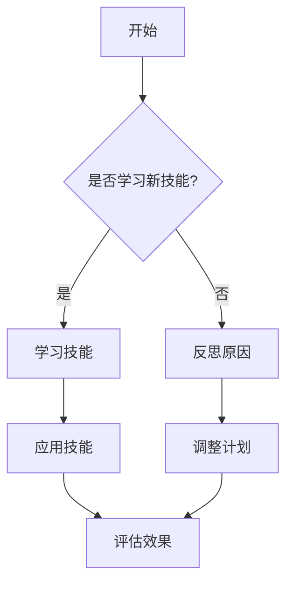

                 

# 成功的重新定义：从社会评价到自我实现

> 关键词：成功、社会评价、自我实现、个人发展、内心探索

> 摘要：
本文旨在探讨成功的重新定义，从传统的基于社会评价的成功观念，转向更加注重自我实现的现代观念。文章通过分析社会评价的起源与演变，探讨其对个人发展的影响，深入探讨自我实现的定义与原则，以及内心探索与自我成长的方法。同时，本文还将通过案例分析，展示如何从理论到实践，实现个人价值的最大化。

## 目录大纲

### 第一部分：社会评价与成功观念

1. **社会评价的起源与演变**
   - 社会评价的定义
   - 社会评价的早期形式
   - 成功观念的历史演变

2. **社会评价与个人发展**
   - 社会评价对个人发展的影响
   - 自我评价的重要性
   - 内在动机与外在动机

### 第二部分：自我实现与内心探索

3. **自我实现的定义与原则**
   - 自我实现的定义
   - 自我实现的原则

4. **内心探索与自我成长**
   - 内心探索的重要性
   - 自我成长的方法

5. **个人价值与生活意义**
   - 个人价值的定义
   - 生活意义的探索

### 第三部分：实践自我实现

6. **从理论到实践**
   - 自我实现的实践步骤
   - 实践中的常见问题与解决策略

7. **案例分析**
   - 案例分析一：自我实现者的人生轨迹
   - 案例分析二：成功转型的企业家

8. **持续的自我实现之路**
   - 持续成长的重要性
   - 未来的挑战与机遇

### 附录

- 自我实现资源与工具
- Mermaid流程图示例

---

### 第1章：社会评价的起源与演变

在社会学中，社会评价是一个基础而又复杂的主题。它不仅反映了我们对他人和世界的认知，还深刻地影响着个人的心理和行为。

#### 1.1.1 社会评价的定义

社会评价是指社会成员对他人或事件的价值判断和态度表达。这种评价可以是对个人品质、能力、行为、外貌等方面的评价，也可以是对某个事件、组织、文化等的评价。

在社会学中，社会评价通常包括以下几个方面：

- **情感评价**：表达对他人或事件的喜欢、厌恶、同情等情感。
- **认知评价**：反映对他人或事件的理解、看法和判断。
- **行为评价**：涉及对他人或事件应如何行动的建议或指导。

#### 1.1.2 社会评价的早期形式

在人类社会早期，评价主要通过口头传播和身体语言进行。随着文字的出现，评价逐渐有了更明确的文字记录。在古代社会，社会评价通常通过民间传说、史诗、神话等形式流传。

- **神话与传说**：在许多文化中，神话和传说是社会评价的重要载体。这些故事中往往包含了对英雄、神灵、恶棍等人物的评价，反映了社会价值观和道德标准。
- **民间故事**：在民间故事中，常常可以看到对社会现象的讽刺和评价。这些故事通过幽默、夸张等手法，传达了人们对现实生活的看法和态度。

#### 1.1.3 社会评价的发展

随着社会的发展，评价体系逐渐复杂化。现代社会评价不仅关注个体，还关注群体和组织。

- **媒体评价**：在现代社会，媒体成为了社会评价的重要渠道。新闻、电视、网络等媒体通过对事件和个人的报道和评论，影响着公众的看法和态度。
- **组织评价**：企业、政府、学校等组织也常常通过评价体系来衡量成员的表现和组织的运作效率。

#### 1.2.1 成功观念的历史演变

成功的观念在不同的历史时期和文化背景下有着不同的含义。

- **古代观念**：在古代社会，成功往往与权力和财富密切相关。君王、贵族和富商被视为成功人士。
- **现代观念**：现代社会对成功的理解更加多元化，包括个人成长、心理健康、人际关系等多个方面。

#### 1.2.2 现代成功观念的多元化

现代社会的成功观念不再仅仅局限于财富和地位。以下是一些现代成功观念的体现：

- **自我实现**：强调个人潜能的发挥和自我价值的实现。
- **平衡生活**：追求工作与生活的平衡，注重身心健康和家庭幸福。
- **社会贡献**：关注对社会的贡献和影响力。

#### 1.2.3 成功观念的未来趋势

随着社会的进步，未来成功观念可能会更加注重个体内在的成长和满足。

- **可持续成功**：强调长期、可持续的成功，而非短期的功利主义。
- **个性化成功**：注重个体差异，鼓励每个人寻找适合自己的成功之路。

### 1.2.4 成功观念的未来趋势

未来成功观念的发展趋势可以从以下几个方面进行探讨：

- **全球视野**：随着全球化的发展，人们对于成功的理解将更加国际化，注重跨文化的交流和合作。
- **科技驱动**：科技的进步将为人们提供更多实现成功的机会，同时也带来新的挑战。
- **人文关怀**：未来成功观念将更加注重人文关怀，强调人的价值和尊严。

### 小结

社会评价和成功观念是社会发展的重要反映。通过了解社会评价的起源与演变，我们可以更好地理解现代社会对成功的理解。同时，随着社会的进步，成功观念也在不断演变，更加注重个体内在的成长和满足。

## 1.2 社会评价与个人发展

社会评价对个人发展有着深远的影响。它不仅塑造了个人的自我认知，还影响了个人的行为和决策。然而，社会评价既有正面作用，也存在潜在负面影响。

### 2.1.1 正面影响

社会评价的正面影响主要体现在以下几个方面：

1. **反馈与自我认知**：
   - 社会评价为个人提供了外部反馈，有助于个人了解自己的优点和不足。这种反馈有助于个人进行自我认知和自我改进。
   - 例如，在工作场合，同事和上级的评价可以帮助员工了解自己的工作表现，从而进行调整和改进。

2. **动机与激励**：
   - 社会评价可以激发个人的内在动机，促进个人努力追求更高的目标。
   - 例如，当学生在考试中获得好成绩并得到老师的表扬时，这种正面的社会评价会增强学生的自信心和学习动力。

3. **社交关系**：
   - 社会评价有助于建立和维护良好的社交关系。通过获得社会的认可和尊重，个人在社会中获得更多的支持和资源。
   - 例如，在企业中，员工的优秀表现可能会得到同事和领导的赞扬，从而提升其在团队中的地位和影响力。

### 2.1.2 负面影响

尽管社会评价有正面作用，但其负面影响也不容忽视：

1. **压力与焦虑**：
   - 过度关注社会评价可能导致个人承受巨大的压力和焦虑。特别是当社会评价与个人价值观和期望不符时，个人可能会感到沮丧和失落。
   - 例如，一个追求完美的人可能会因为无法满足社会对成功的期待而感到焦虑和沮丧。

2. **自我限制**：
   - 社会评价可能会限制个人的行为和决策，导致个人不敢冒险尝试新事物。
   - 例如，当一个人被评价为“不适合做某事”时，可能会放弃尝试，即使他或她有潜在的能力。

3. **价值观扭曲**：
   - 过度依赖社会评价可能导致个人价值观的扭曲，过分追求外在的成功和认可，忽视内在的成长和满足。
   - 例如，一些人可能为了追求物质财富和社会地位，牺牲了家庭幸福和个人健康。

### 2.2 自我评价的重要性

自我评价是指个人对自己行为、能力和价值的判断。它与外部的社会评价不同，更关注个人内心的感受和认识。自我评价的重要性体现在以下几个方面：

1. **自我认知**：
   - 自我评价有助于个人更深入地了解自己，包括自己的优点、不足、兴趣和价值观。
   - 例如，通过自我评价，一个人可以认识到自己在工作中的强项和需要提升的领域，从而制定更有效的职业发展计划。

2. **自我调节**：
   - 自我评价能够帮助个人进行自我调节，及时调整自己的行为和态度。
   - 例如，当一个人意识到自己在某个方面表现不佳时，可以通过自我评价找出原因，并采取相应措施进行改进。

3. **内在动力**：
   - 自我评价可以激发个人的内在动力，推动个人追求自我实现。
   - 例如，一个人可能会因为自我评价中认可自己的成就和进步，从而更加积极地投入到工作和学习中。

### 2.2.2 如何进行自我评价

进行有效的自我评价需要以下步骤：

1. **反思**：
   - 反思是自我评价的基础。通过回顾自己的行为、决策和表现，个人可以更好地了解自己的行为模式。

2. **设定目标**：
   - 在进行自我评价时，设定具体、可衡量的目标非常重要。这有助于个人评估自己的进步和效果。

3. **收集数据**：
   - 收集与自我评价相关的数据，如成绩、反馈、自我观察等。这些数据可以帮助个人更客观地评估自己的表现。

4. **分析**：
   - 对收集到的数据进行深入分析，找出自己的优点和不足，以及需要改进的方面。

5. **制定计划**：
   - 基于分析结果，制定具体的改进计划，包括需要采取的行动、时间和资源安排等。

6. **执行与跟踪**：
   - 执行改进计划，并定期跟踪自己的进展。这有助于确保自我评价的有效性。

### 2.3 内在动机与外在动机

动机是推动个人行为和决策的内在力量。动机可以分为内在动机和外在动机两种：

1. **内在动机**：
   - 内在动机是指由个人内心深处的兴趣、热情和价值观驱动的动机。
   - 例如，一个人因为热爱编程而投入大量时间和精力去学习和实践，这就是内在动机的体现。

2. **外在动机**：
   - 外在动机是指由外部环境因素驱动的动机，如奖励、惩罚、社会评价等。
   - 例如，一个人可能因为想要获得奖金或避免惩罚而努力工作，这就是外在动机的体现。

### 2.3.1 内在动机

内在动机对个人的自我实现至关重要。以下是一些促进内在动机的方法：

1. **找到兴趣**：
   - 发现并专注于自己真正感兴趣的领域，有助于激发内在动机。
   - 例如，一个对艺术创作充满热情的人，可能会在创作过程中体验到强烈的内在动机。

2. **挑战自我**：
   - 设定具有挑战性的目标，有助于激发内在动机。
   - 例如，一个运动员可能会因为想要突破自己的极限而不断努力训练。

3. **自我认可**：
   - 通过自我认可和自我激励，个人可以增强内在动机。
   - 例如，一个作家可能会因为自我创作的成就感而继续写作。

### 2.3.2 外在动机

外在动机虽然在短期内可能有助于完成任务，但长期依赖外在动机可能会导致内在动机的削弱。以下是一些管理外在动机的方法：

1. **目标设定**：
   - 设定清晰、具体、可衡量的目标，有助于提高外在动机的效果。
   - 例如，一个学生可能会因为想要获得奖学金而努力学习。

2. **奖励机制**：
   - 合理的奖励机制可以增强外在动机。
   - 例如，公司可能会通过奖金、晋升等方式激励员工。

3. **反馈与调整**：
   - 定期收集反馈，并根据反馈调整目标和方法，有助于提高外在动机的效果。
   - 例如，一个教练可能会通过观察和分析运动员的表现，提供针对性的建议和调整训练计划。

### 小结

社会评价对个人发展既有正面影响，也存在潜在负面影响。自我评价的重要性在于它帮助个人更深入地了解自己，并激发内在动机。同时，了解内在动机与外在动机的差异和作用，有助于个人更好地管理自己的行为和决策。通过有效的自我评价和动机管理，个人可以更好地实现自我价值和追求成功。

### 第3章：自我实现的定义与原则

在探讨自我实现的定义与原则时，我们需要首先明确什么是自我实现。自我实现是一个复杂而深刻的概念，涉及到个人潜能的发挥、自我价值的实现以及内在动机的激发。在这章中，我们将通过探讨自我实现的定义和原则，帮助读者更好地理解这一重要的概念。

#### 3.1.1 罗杰斯对自我实现的定义

卡尔·罗杰斯（Carl Rogers）是自我实现理论的重要代表人物之一。他认为，自我实现是指个人在没有外部压力的情况下，自由地表达自己的潜能，实现自己的目标和理想。罗杰斯强调，自我实现是一个持续的过程，涉及到个人对自我和环境的探索和适应。

根据罗杰斯的定义，自我实现具有以下几个特点：

1. **内在动机**：
   - 自我实现是由个人内在的动机驱动的，而不是外部奖励或惩罚。
   - 例如，一个人可能会因为对绘画的热爱而投入大量时间和精力去创作，而不是为了获得奖金或认可。

2. **自我认知**：
   - 自我实现需要个人对自己的认识和理解，包括自己的优点、不足、兴趣和价值观。
   - 例如，一个演员可能会通过不断反思和探索，找到自己在表演艺术中的独特风格和优势。

3. **自由选择**：
   - 自我实现允许个人自由地选择自己的目标和行为方式，而不是受到外部压力的束缚。
   - 例如，一个企业家可能会选择创业，而不是遵循传统的职业道路，因为他或她认为这是实现自我价值的最佳方式。

4. **成长与适应**：
   - 自我实现是一个持续的过程，涉及到个人在实现自己的目标的同时，不断适应和成长。
   - 例如，一个学者可能会在学术研究过程中，不断调整自己的研究方向和方法，以适应新的学术环境和需求。

#### 3.1.2 马斯洛对自我实现的定义

亚伯拉罕·马斯洛（Abraham Maslow）是另一位对自我实现有重要贡献的心理学家。他提出了著名的“需求层次理论”，并在理论中阐述了自我实现的概念。马斯洛认为，自我实现是人的最高层次需求，是个人潜能的最大化发挥和自我价值的实现。

根据马斯洛的定义，自我实现具有以下几个特点：

1. **需求满足**：
   - 自我实现是建立在其他需求满足的基础上，如生理需求、安全需求、社交需求等。
   - 例如，一个艺术家在追求自我实现时，需要首先满足基本的生理和安全需求，如食物、住所和安全感。

2. **创造力**：
   - 自我实现强调个人的创造力和创新能力，认为这是个人潜能的体现。
   - 例如，一个科学家在自我实现的过程中，可能会提出新的理论或发明新的技术，推动科学进步。

3. **自我实现者**：
   - 马斯洛认为，自我实现者具有独特的心理特征，如开放性、自主性、诚实性和创造力等。
   - 例如，一个自我实现者可能会在面对挑战和变化时，表现出高度的适应性和创新能力。

4. **超越自我**：
   - 自我实现不仅仅是个体的自我实现，还包括对社会的贡献和影响。
   - 例如，一个领导者可能在实现个人目标的同时，也推动团队和组织的发展，实现更大的社会价值。

#### 3.2 自我实现的原则

自我实现是一个复杂而深刻的过程，涉及到多个方面的因素。以下是一些自我实现的原则，可以帮助个人更好地实现自我价值：

1. **自主性**：
   - 自主性是自我实现的重要原则，意味着个人应该有自由选择的权利，不受外部压力和限制。
   - 例如，一个学生在选择学习科目和职业道路时，应该有自由决定的权利，而不是被迫遵循他人的意愿。

2. **真诚**：
   - 真诚是自我实现的另一个重要原则，意味着个人应该真实地面对自己，不掩饰自己的真实感受和想法。
   - 例如，一个人在表达自己的观点和情感时，应该真诚地表达，而不是为了取悦他人而虚假表现。

3. **自我接纳**：
   - 自我接纳是自我实现的基础，意味着个人应该接受自己的优点和不足，不进行自我否定或过分自我批评。
   - 例如，一个人在认识到自己的不足时，应该积极寻求改进，而不是完全否定自己。

4. **成长性思维**：
   - 成长性思维是自我实现的关键原则，意味着个人应该具备不断学习和成长的心态。
   - 例如，一个人在面临挑战和失败时，应该视为学习和成长的机会，而不是放弃或气馁。

5. **内在动机**：
   - 内在动机是自我实现的动力，意味着个人应该基于自己的兴趣和价值观来驱动行为，而不是外部奖励或惩罚。
   - 例如，一个人在追求自我实现时，应该出于对某项事业的热爱和追求，而不是为了获得金钱或社会地位。

6. **社会贡献**：
   - 自我实现不仅仅是个体的自我实现，还包括对社会的贡献和影响。
   - 例如，一个企业家在追求自我实现的同时，也应该关注企业对社会的积极影响，如创造就业、推动科技进步等。

#### 3.3 内心探索的重要性

内心探索是自我实现的重要组成部分，它涉及到对个人内心世界的深入了解和探索。以下是一些内心探索的重要性：

1. **自我认知**：
   - 内心探索有助于个人更深入地了解自己的内心世界，包括自己的情感、需求和价值观。
   - 例如，通过内心探索，一个人可以更好地理解自己在某个情境下的情绪反应，并找到相应的解决办法。

2. **情绪管理**：
   - 内心探索有助于个人更好地管理自己的情绪，减少负面情绪的影响。
   - 例如，通过内心探索，一个人可以认识到自己在面对压力时的焦虑情绪，并学会通过深呼吸或冥想来缓解焦虑。

3. **心理健康**：
   - 内心探索对心理健康至关重要，它有助于减轻心理压力，提升生活满意度。
   - 例如，通过内心探索，一个人可以更好地理解自己的内心需求，从而减少焦虑和抑郁的情绪。

4. **决策支持**：
   - 内心探索可以提供个人决策的支持，帮助个人做出更符合内心需求和价值观的决策。
   - 例如，通过内心探索，一个人可以更清晰地认识到自己在某个决策中的真实想法和感受，从而做出更明智的决策。

5. **人际交往**：
   - 内心探索有助于提升人际交往能力，帮助个人更好地理解他人，建立更深入的人际关系。
   - 例如，通过内心探索，一个人可以更好地理解他人的需求和感受，从而更好地与他人沟通和合作。

#### 3.4 自我成长的方法

自我成长是自我实现的重要环节，它涉及到个人在知识和技能、情感和心理、人际关系等方面的全面提升。以下是一些自我成长的方法：

1. **学习与阅读**：
   - 学习是自我成长的重要途径，通过不断学习新知识和技能，个人可以不断提升自己的能力。
   - 例如，通过阅读专业书籍或参加线上课程，一个人可以学习到最新的行业动态和技能。

2. **实践与经验**：
   - 实践是检验真理的唯一标准，通过实际操作和经验积累，个人可以不断提升自己的实践能力。
   - 例如，通过参与实际项目或社会实践，一个人可以锻炼自己的问题解决能力和团队合作能力。

3. **反思与总结**：
   - 反思是自我成长的重要方法，通过定期反思自己的行为和决策，个人可以找到改进的方向。
   - 例如，通过写日记或进行反思会议，一个人可以总结自己的经验教训，为未来的发展提供指导。

4. **心理辅导与咨询**：
   - 心理辅导和咨询可以帮助个人深入了解自己的内心世界，解决心理问题和情感困扰。
   - 例如，通过心理咨询，一个人可以找到应对焦虑和抑郁的有效方法，提升心理健康水平。

5. **社交与交流**：
   - 社交和交流是自我成长的重要途径，通过与他人的互动和交流，个人可以学习到不同的观点和经验。
   - 例如，通过参加社交活动和研讨会，一个人可以扩展自己的社交圈子，学习到新的知识和技能。

#### 小结

自我实现是一个复杂而深刻的过程，涉及到个人潜能的发挥、自我价值的实现以及内在动机的激发。通过明确自我实现的定义和原则，我们可以更好地理解这一概念，并在实际生活中追求自我实现。同时，内心探索和自我成长是自我实现的重要组成部分，通过不断学习和实践，我们可以不断提升自己的能力和品质，实现个人价值的最大化。

### 第4章：内心探索与自我成长

#### 4.1 内心探索的重要性

内心探索，简单来说，就是对自我内心世界的深入了解和反思。它是一个从外在行为回到内在意识，从表面现象挖掘深层原因的过程。内心探索的重要性在于它能够帮助个人更好地理解自己，从而实现自我成长和自我实现。

**内心探索的定义**

内心探索，也称为自我反思或自我分析，是指个人通过内省、冥想、日记写作等方式，对自身的心理状态、情感体验、思维模式等进行深入思考和分析。这个过程有助于个人发现内心的矛盾和冲突，理解自己的需求和愿望，从而更好地应对生活中的挑战。

**内心探索对个人成长的意义**

1. **自我认知**：内心探索有助于个人更深入地了解自己，包括自己的情感、信念、价值观等。这种自我认知是个人成长和发展的基础。

2. **情感管理**：通过内心探索，个人可以更好地管理自己的情绪，减少负面情绪的影响，提升情感智慧。

3. **心理健康**：内心探索有助于减轻心理压力，提升生活满意度，预防心理问题的发生。

4. **决策支持**：内心探索可以为个人提供更明智的决策支持，帮助个人在面对选择时，做出更符合内心需求和价值观的决策。

5. **人际关系**：内心探索有助于提升人际交往能力，帮助个人更好地理解他人，建立更深入的人际关系。

#### 4.2 自我成长的方法

自我成长是一个持续的过程，需要个人在实践中不断努力。以下是一些自我成长的方法：

**1. 冥想**

冥想是一种通过专注呼吸、放松身体和心灵的方式，帮助个人进入深度放松状态，从而进行内心探索。以下是冥想的一些好处：

- **减少压力**：通过冥想，个人可以放松身心，减少压力和焦虑。
- **提升专注力**：定期冥想有助于提升个人的专注力和注意力。
- **改善心理健康**：冥想有助于减轻心理压力，提升情绪稳定性，预防抑郁和焦虑。

**2. 日记写作**

日记写作是一种记录和反思个人生活经历的方法。通过日记写作，个人可以：

- **记录生活**：通过日记，个人可以记录自己的日常生活、情感变化和思考，有助于回顾和总结。
- **自我反思**：日记写作可以帮助个人深入思考自己的行为和决策，找到改进的方向。
- **情绪释放**：通过写下自己的感受和想法，个人可以释放内心的情绪压力。

**3. 反思与自我反省**

反思与自我反省是自我成长的重要方法。以下是一些步骤：

- **定期回顾**：定期回顾自己的行为和决策，分析哪些是有效的，哪些需要改进。
- **目标设定**：设定具体、可衡量的目标，并定期检查自己的进展。
- **学习与改进**：通过学习和实践，不断提升自己的知识和技能，实现自我成长。

**4. 心理咨询与支持团体**

心理咨询与支持团体可以帮助个人更深入地探索自己的内心世界，解决心理问题和情感困扰。以下是一些好处：

- **专业指导**：通过心理咨询，个人可以获得专业的指导和支持，更好地理解自己的问题并找到解决办法。
- **情感支持**：在支持团体中，个人可以得到同伴的支持和理解，减轻心理压力。
- **成长与改变**：通过心理咨询和支持团体，个人可以实现内心的成长和改变。

#### 4.3 内心探索与个人价值

内心探索不仅有助于个人的自我成长，还与个人价值紧密相关。以下是内心探索与个人价值之间的联系：

- **价值观澄清**：内心探索可以帮助个人澄清自己的价值观，理解自己真正重视的事物。
- **自我认同**：内心探索有助于个人建立自我认同，找到自己的独特性和价值。
- **自我实现**：通过内心探索，个人可以更好地实现自己的潜能和价值，追求自我实现。

#### 小结

内心探索与自我成长是个人发展的核心部分。通过冥想、日记写作、反思与自我反省等方法，个人可以深入探索自己的内心世界，实现自我成长。内心探索不仅有助于提升个人价值和实现自我价值，还能为个人的心理健康和人际关系提供支持。因此，内心探索和实践自我成长是每个人都应该重视和努力追求的目标。

### 第5章：个人价值与生活意义

#### 5.1 个人价值的定义

个人价值是指个人在自我认知和与他人互动中所体现的内在特质和品质，它反映了一个人在生活中的目标、意义和贡献。个人价值不仅仅是外在的成就或社会地位，而是深植于内心的信念和价值观。

**个人价值的定义**

个人价值可以从以下几个方面进行理解：

1. **内在特质**：个人价值体现了一个人的性格、能力、态度和信仰等内在特质。这些特质是个人在长期的生活经验和自我反思中形成的。

2. **价值观**：个人价值与个人的价值观紧密相关。价值观是个人对什么是好的、什么是重要的、什么是值得追求的信念体系。

3. **目标与意义**：个人价值还涉及到个人在生活中的目标和追求。这些目标可以是个人的职业成就、家庭幸福、社会贡献等，它们为个人提供了方向和动力。

**个人价值的重要性**

个人价值对个人的生活和成长具有重要意义：

1. **自我认知**：个人价值帮助个人了解自己是谁，自己的信念和价值观是什么，从而增强自我认知和自我认同。

2. **决策支持**：个人价值可以作为决策的依据，帮助个人在面对选择时，做出更符合自己内在信念和价值观的决策。

3. **行为指引**：个人价值指导个人在生活中的行为和行动，使个人能够更有意义地贡献于社会和环境。

#### 5.2 生活意义的探索

生活意义是指个人在生活中的目标和追求，是个人存在的理由和动力源泉。探索生活意义是自我实现的重要组成部分。

**生活意义的定义**

生活意义可以从以下几个方面进行理解：

1. **内在动机**：生活意义与个人的内在动机密切相关。它反映了个人对生活的热爱、热情和使命感。

2. **目标导向**：生活意义是个人在生活中的目标和追求，它为个人提供了方向和动力，使个人能够持续追求个人成长和自我实现。

3. **价值实现**：生活意义是个人价值的具体体现。通过实现生活意义，个人可以更好地实现自己的价值和目标。

**如何寻找生活意义**

寻找生活意义是一个个体化的过程，以下是一些方法可以帮助个人探索生活意义：

1. **自我反思**：通过反思自己的经历、感受和信念，个人可以更好地理解自己的生活意义。

2. **目标设定**：设定具体、有意义的目标，可以帮助个人找到自己的生活方向和动力。

3. **价值观澄清**：澄清自己的价值观，可以帮助个人明确自己的生活目标和追求。

4. **探索新事物**：尝试新事物和体验不同的生活经历，可以帮助个人发现新的兴趣和激情。

5. **与他人交流**：与他人交流可以提供新的视角和启发，帮助个人更好地理解自己的生活意义。

#### 5.3 个人价值与生活意义的结合

个人价值和生活意义相互关联，共同构成了个人的生活方向和动力源泉。以下是个人价值与生活意义之间的结合：

1. **内在动机与目标导向**：个人价值提供了内在动机，而生活意义则为目标导向。当个人价值与生活意义相结合时，个人会产生强烈的内在驱动力，去追求自己的目标和实现自我价值。

2. **自我实现与贡献**：通过实现个人价值和追求生活意义，个人可以实现自我价值，并为社会和环境做出贡献。

3. **持续成长与自我提升**：个人价值和生活意义的结合，促使个人持续成长和自我提升，不断追求更高的目标和更广阔的生活视野。

#### 小结

个人价值与生活意义是个人生活和成长的重要方面。通过明确个人价值，个人可以更好地理解自己，设定生活目标，实现自我价值和追求生活意义。个人价值和生活意义的结合，为个人提供了内在动机和方向，推动了个人不断成长和自我实现。因此，探索和实现个人价值和生活意义是每个人都应该重视和努力追求的目标。

### 第6章：从理论到实践

在了解了自我实现的定义、原则以及内心探索与自我成长的方法之后，接下来我们将探讨如何将理论转化为实践。实现自我实现不仅需要理论的指导，更需要具体的行动和实践。以下是一些具体的步骤和策略，帮助我们从理论走向实践，实现自我价值。

#### 6.1 自我实现的实践步骤

**1. 制定个人目标**

制定个人目标是实现自我实现的第一步。目标是行动的指南，它为我们的努力提供了方向和动力。以下是一些制定个人目标的步骤：

- **明确目标**：确保目标具体、明确和可衡量。例如，"成为一名优秀的程序员"或"在两年内完成一本专业书籍的撰写"。

- **设定期限**：为每个目标设定一个明确的完成期限。这有助于我们保持动力，并确保目标的实现。

- **分解目标**：将大目标分解为小目标，每完成一个小目标都是向大目标迈进的一步。这有助于我们保持持续的动力和成就感。

**2. 制定行动计划**

制定行动计划是将个人目标转化为具体行动的步骤。以下是一些制定行动计划的步骤：

- **确定行动步骤**：列出实现目标所需的每一个具体行动步骤。例如，如果目标是学习一门新技能，步骤可能包括购买教材、参加在线课程、练习项目等。

- **设定时间表**：为每个行动步骤设定具体的时间表。这有助于我们合理安排时间和资源，确保每个步骤都能按时完成。

- **制定备选方案**：考虑到可能出现的问题和障碍，制定备选方案。这有助于我们在遇到困难时能够迅速调整行动计划。

**3. 克服障碍**

在实现自我实现的过程中，我们可能会遇到各种障碍。以下是一些克服障碍的策略：

- **正面应对**：面对障碍时，保持积极的态度和心态。将障碍视为成长和学习的机会，而不是失败的原因。

- **寻求支持**：寻找家人、朋友或专业人士的支持和帮助。他们可以提供新的视角和建议，帮助我们克服障碍。

- **调整计划**：如果原计划无法实现，不要害怕调整计划。灵活性和适应性是实现自我实现的关键。

**4. 监测与调整**

在实现自我实现的过程中，持续监测和调整行动计划至关重要。以下是一些监测与调整的步骤：

- **定期回顾**：定期回顾自己的进展，检查是否按照计划进行。这有助于我们及时发现问题并进行调整。

- **设定里程碑**：为每个阶段设定里程碑，以评估进展。这有助于我们保持动力，并确保目标能够按时完成。

- **持续学习**：通过学习新的知识和技能，不断提升自己的能力和素质。这有助于我们在实现自我实现的过程中保持竞争力。

#### 6.2 实践中的常见问题与解决策略

在实践自我实现的过程中，我们可能会遇到一些常见的问题。以下是一些问题及其解决策略：

**1. 目标不明确**

问题：制定的目标模糊不清，难以衡量。

解决策略：确保目标具体、明确和可衡量。使用SMART原则（具体、可衡量、可实现、相关、有时间限制）来设定目标。

**2. 缺乏动力**

问题：在实现自我实现的过程中，缺乏持续的动力。

解决策略：找到内在动机和外部激励，例如设定小目标、获得家人和朋友的支持、奖励自己等。

**3. 遇到挫折**

问题：在实现自我实现的过程中，遇到挫折和失败。

解决策略：保持积极的心态，将挫折视为成长和学习的机会。寻求支持和帮助，调整计划并继续前进。

**4. 环境干扰**

问题：外界的干扰和压力影响自我实现的实践。

解决策略：设定个人时间和空间，减少干扰。使用时间管理技巧，确保有足够的时间专注于自我实现的目标。

#### 小结

从理论到实践是实现自我实现的关键步骤。通过制定个人目标、制定行动计划、克服障碍和持续监测与调整，我们可以将自我实现的愿景转化为现实。在实践过程中，我们可能会遇到各种问题和挑战，但通过有效的解决策略，我们可以克服这些困难，不断前进，最终实现自我价值。

### 第7章：案例分析

在本章中，我们将通过两个具体的案例，深入分析自我实现的过程，展示从理论到实践的转变是如何发生的。这些案例不仅可以帮助读者更好地理解自我实现的路径，还可以提供实用的见解和启示。

#### 7.1 案例分析一：自我实现者的人生轨迹

**案例介绍**

李华（化名），35岁，软件工程师。他在职业生涯中表现出色，但在个人成长和自我实现方面遇到了瓶颈。李华意识到，他需要更多的内心探索和自我成长，以实现更高的自我价值。

**案例分析**

1. **内心探索**

李华开始通过冥想和日记写作进行内心探索。他发现，自己内心深处对编程和技术的热情并没有因为工作的忙碌而消退，反而更加渴望能够通过技术改变世界。

2. **目标设定**

基于内心探索的结果，李华设定了新的目标：成为一名技术创业家，开发一款能够解决社会问题的应用程序。他明确了这一目标，并制定了详细的行动计划。

3. **行动计划**

李华的行动计划包括：
   - 学习新兴技术，如人工智能和大数据分析。
   - 与业界专家建立联系，获取行业洞察和建议。
   - 参加创业竞赛，锻炼自己的商业思维和团队管理能力。
   - 设立小目标，如每月完成一个技术项目，每季度发布一篇技术博客。

4. **克服障碍**

在实现目标的过程中，李华遇到了资金、技术和团队建设等方面的挑战。但他通过积极寻求外部支持、调整计划和不断学习，成功地克服了这些障碍。

5. **持续成长**

李华意识到，自我实现是一个持续的过程。他继续通过学习新技术、参加行业会议和与同行交流，不断提升自己的能力和知识。

**案例总结**

通过李华的案例，我们可以看到，自我实现不仅仅是职业上的成功，更是个人价值的实现。李华通过内心探索、目标设定和持续成长，成功地实现了自我价值，并在技术创业的道路上取得了显著成果。

#### 7.2 案例分析二：成功转型的企业家

**案例介绍**

张琳（化名），40岁，曾经是一名成功的营销经理。她在职业生涯中积累了丰富的经验和人脉，但逐渐感到自己的工作缺乏意义和挑战。张琳决定转型，追求自己内心的热情和目标。

**案例分析**

1. **内心探索**

张琳通过心理咨询和自我反思，深入探索自己的内心。她发现，自己对艺术和设计有着浓厚的兴趣，而营销工作并不能满足她内心的热情。

2. **目标设定**

基于内心探索的结果，张琳设定了新的目标：成为一名自由艺术指导，为客户提供创意和设计咨询服务。她制定了详细的职业转型计划。

3. **行动计划**

张琳的转型行动计划包括：
   - 报名参加艺术和设计课程，提升自己的专业能力。
   - 建立个人品牌，通过社交媒体和线上平台展示自己的作品。
   - 与设计师和艺术家建立合作关系，扩大人脉网络。
   - 设定小目标，如每月完成一个设计项目，每季度发布一篇艺术博客。

4. **克服障碍**

在转型过程中，张琳遇到了资金压力、客户认可和市场竞争等方面的挑战。但她通过调整计划、积极学习和不断寻求外部支持，成功地克服了这些障碍。

5. **持续成长**

张琳意识到，自我实现需要不断的学习和成长。她继续参加行业会议、研讨会和培训课程，不断提升自己的专业能力和市场竞争力。

**案例总结**

通过张琳的案例，我们可以看到，成功的转型不仅仅是职业道路的改变，更是个人价值的实现。张琳通过内心探索、目标设定和持续成长，成功地实现了自我价值，并在新的职业道路上取得了成功。

### 小结

通过这两个案例分析，我们可以看到，自我实现是一个复杂而深刻的过程，涉及到内心探索、目标设定、行动计划和持续成长。无论是通过职业转型还是职业发展，实现自我价值的关键在于深入了解自己，设定明确的目标，制定切实可行的行动计划，并持续学习和成长。这些案例不仅为读者提供了实用的见解，也展示了自我实现的路径和可能性。

### 第8章：持续的自我实现之路

在现代社会，持续成长和自我实现已经成为许多人追求的目标。然而，随着社会环境的变化和技术的发展，持续成长也面临着新的挑战和机遇。本章将探讨持续成长的重要性，以及如何应对未来的挑战和抓住机遇。

#### 8.1 持续成长的重要性

持续成长对个人的职业发展和生活质量至关重要。以下是持续成长的一些重要性：

1. **适应变化**：社会环境和技术不断变化，持续成长有助于个人适应这些变化，保持竞争力。

2. **提升能力**：通过不断学习和实践，个人可以提升自己的技能和知识，从而更好地应对工作中的挑战。

3. **增强自信**：持续成长可以增强个人的自信心，使其在面对未知和挑战时更加从容和坚定。

4. **实现自我价值**：持续成长有助于个人实现自我价值，提升生活质量和社会地位。

#### 8.2 如何保持持续成长

为了保持持续成长，个人可以采取以下策略：

1. **设定明确目标**：明确自己的成长目标，并制定具体的行动计划。这有助于个人保持动力和方向。

2. **不断学习**：利用各种资源，如在线课程、书籍、研讨会等，持续学习新知识和技能。

3. **实践与应用**：将所学知识和技能应用到实际工作中，通过实践不断提升自己的能力。

4. **反思与调整**：定期反思自己的成长过程，评估自己的进展，并根据需要调整计划和策略。

5. **建立支持网络**：与同行和专业人士建立联系，共同学习和成长。这有助于获取新的视角和资源。

#### 8.3 社会环境的变化

随着社会环境的变化，持续成长也面临着新的挑战。以下是社会环境变化对持续成长的影响：

1. **信息过载**：随着互联网和社交媒体的普及，信息爆炸使得个人难以筛选和吸收有用的信息。这需要个人具备更强的信息处理能力。

2. **职业流动性**：职业流动性增加，个人需要不断适应新的工作环境和职业要求。这要求个人具备更高的适应能力和学习能力。

3. **工作与生活的平衡**：工作和生活之间的界限变得模糊，个人需要在繁忙的工作中找到平衡，保持身心健康。

4. **工作方式的变革**：远程办公和数字化工作的兴起，改变了传统的工作方式。个人需要适应新的工作模式，并提高数字化技能。

#### 8.4 技术发展的机遇与挑战

技术发展带来了许多机遇，同时也带来了挑战。以下是技术发展对持续成长的影响：

1. **数字化技能**：随着数字化技术的发展，个人需要掌握相关的数字化技能，如编程、数据分析、人工智能等。

2. **技术创新**：技术创新为个人提供了更多的职业机会，但也要求个人具备更高的创新能力和适应能力。

3. **网络安全**：随着网络技术的发展，网络安全成为越来越重要的问题。个人需要了解网络安全知识，保护自己的数据和隐私。

4. **技术伦理**：技术在带来便利的同时，也带来了伦理问题。个人需要关注技术伦理，并在技术应用中做出负责任的决策。

#### 8.5 自我实现的未来趋势

随着社会和技术的发展，自我实现也将呈现出新的趋势。以下是自我实现未来的一些趋势：

1. **个性化发展**：随着个性化需求的增加，自我实现将更加注重个体的独特性和个性化发展。

2. **跨界融合**：不同领域之间的跨界融合将成为自我实现的重要趋势。个人需要具备跨学科的知识和技能，以应对复杂的问题。

3. **全球视野**：全球化趋势使得个人需要具备全球视野，理解和适应不同文化和社会环境。

4. **可持续发展**：可持续发展将成为自我实现的重要方向。个人需要在职业发展和个人生活中关注环保和社会责任。

#### 小结

持续成长是自我实现的关键，它帮助个人适应社会环境的变化，应对技术发展的挑战，并实现个人价值和目标。通过设定明确的目标、不断学习、实践与应用以及建立支持网络，个人可以保持持续成长。同时，社会环境的变化和技术发展也为个人提供了新的机遇和挑战。未来，自我实现将更加注重个性化、跨界融合和可持续发展。面对这些趋势，个人需要不断适应和成长，以实现更高的自我价值。

### 附录

#### 附录A：自我实现资源与工具

为了帮助读者更好地进行自我实现，以下是一些推荐的资源与工具：

1. **相关书籍推荐**
   - 《自控力》：凯利·麦格尼格尔（Kelly McGonigal）
   - 《深度工作》：卡尔·纽波特（Cal Newport）
   - 《穷查理宝典》：查理·芒格（Charles T. Munger）

2. **在线课程与讲座**
   - Coursera：提供各种领域的在线课程，包括自我实现、心理学、领导力等。
   - edX：由哈佛大学和麻省理工学院等顶尖大学提供的免费在线课程。
   - TED：TED演讲平台，提供来自全球各界杰出人物的精彩演讲。

3. **心理咨询与支持团体**
   - 寻找当地的心理咨询师或心理咨询机构，进行一对一的心理咨询。
   - 加入线上或线下的支持团体，与志同道合的人交流心得和经验。

#### 附录B：Mermaid流程图示例

以下是一个简单的Mermaid流程图示例：

这个流程图展示了从开始学习新技能到最终评估效果的过程，其中涉及了反思和调整计划的步骤。通过Mermaid，我们可以轻松地创建和编辑流程图，帮助自己理清思路，规划行动。

---

通过这些资源与工具，读者可以更好地进行自我实现，实现个人价值和目标。同时，Mermaid流程图作为一种直观的表示工具，可以帮助读者更好地规划和执行自己的计划。希望这些附录能为读者的自我实现之路提供有力的支持。

---

# 成功的重新定义：从社会评价到自我实现

作者：AI天才研究院/AI Genius Institute & 禅与计算机程序设计艺术 /Zen And The Art of Computer Programming

本文旨在探讨成功的重新定义，从传统的基于社会评价的成功观念，转向更加注重自我实现的现代观念。文章通过分析社会评价的起源与演变，探讨其对个人发展的影响，深入探讨自我实现的定义与原则，以及内心探索与自我成长的方法。同时，本文还将通过案例分析，展示如何从理论到实践，实现个人价值的最大化。

## 第一部分：社会评价与成功观念

### 第1章：社会评价的起源与演变

#### 1.1 社会评价的定义

社会评价是指社会成员对他人或事件的价值判断和态度表达。它包括对他人的行为、性格、能力、外貌等方面的评价。

#### 1.1.2 社会评价的早期形式

在人类社会早期，评价主要通过口头传播和身体语言进行。随着文字的出现，评价逐渐有了更明确的文字记录。

#### 1.1.3 社会评价的发展

随着社会的发展，评价体系逐渐复杂化。现代社会评价不仅关注个体，还关注群体和组织。

#### 1.2 成功观念的历史演变

在传统观念中，成功主要与财富、地位、权力等外在因素相关。现代社会对成功的理解更加多元化，包括个人成长、心理健康、人际关系等多个方面。

### 第2章：社会评价与个人发展

#### 2.1 社会评价对个人发展的影响

社会评价可以提供反馈，帮助个人了解自己的优点和不足，从而促进个人发展。然而，过度关注社会评价可能导致个人焦虑和压力，影响心理健康。

#### 2.2 自我评价的重要性

自我评价是指个人对自己行为、能力和价值的判断。自我评价的重要性在于它帮助个人更深入地了解自己，并激发内在动机。

#### 2.3 内在动机与外在动机

内在动机是指由个人内心深处的兴趣、热情和价值观驱动的动机。外在动机是指由外部环境因素驱动的动机，如奖励、惩罚、社会评价等。

## 第二部分：自我实现与内心探索

### 第3章：自我实现的定义与原则

#### 3.1 罗杰斯对自我实现的定义

罗杰斯认为，自我实现是指个人在没有外部压力的情况下，自由地表达自己的潜能，实现自己的目标和理想。

#### 3.1.2 马斯洛对自我实现的定义

马斯洛认为，自我实现是人的最高层次需求，是个人潜能的最大化发挥和自我价值的实现。

#### 3.2 自我实现的原则

自我实现的原则包括自主性、真诚、自我接纳、成长性思维和内在动机等。

### 第4章：内心探索与自我成长

#### 4.1 内心探索的重要性

内心探索对个人成长和心理健康具有重要意义。

#### 4.2 自我成长的方法

自我成长的方法包括冥想、日记写作、反思与自我反省等。

### 第5章：个人价值与生活意义

#### 5.1 个人价值的定义

个人价值是指个人在自我认知和与他人互动中所体现的内在特质和品质。

#### 5.2 生活意义的探索

生活意义是指个人在生活中的目标和追求。

## 第三部分：实践自我实现

### 第6章：从理论到实践

#### 6.1 自我实现的实践步骤

自我实现的实践步骤包括制定个人目标、制定行动计划、克服障碍和持续监测与调整等。

#### 6.2 实践中的常见问题与解决策略

常见问题包括目标不明确、缺乏动力和遇到挫折等。

### 第7章：案例分析

通过两个具体的案例，展示自我实现的过程和路径。

### 第8章：持续的自我实现之路

#### 8.1 持续成长的重要性

持续成长对个人的职业发展和生活质量至关重要。

#### 8.2 如何保持持续成长

保持持续成长的方法包括设定明确目标、不断学习、实践与应用和建立支持网络等。

#### 8.3 社会环境的变化

社会环境的变化对持续成长提出了新的挑战。

#### 8.4 技术发展的机遇与挑战

技术发展带来了新的机遇和挑战。

### 附录

附录包括自我实现资源与工具，以及Mermaid流程图示例。

