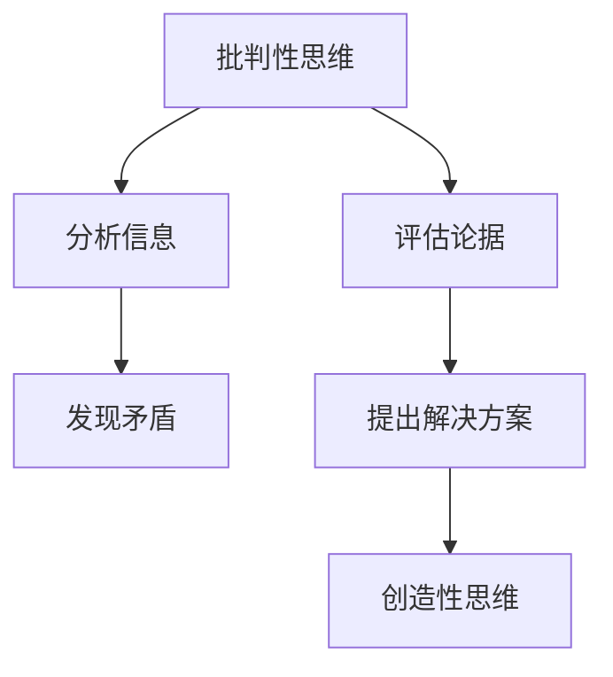
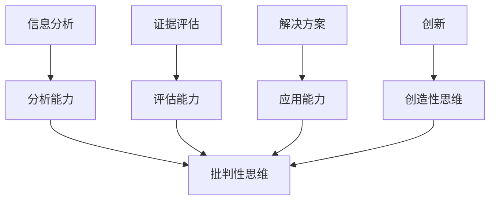
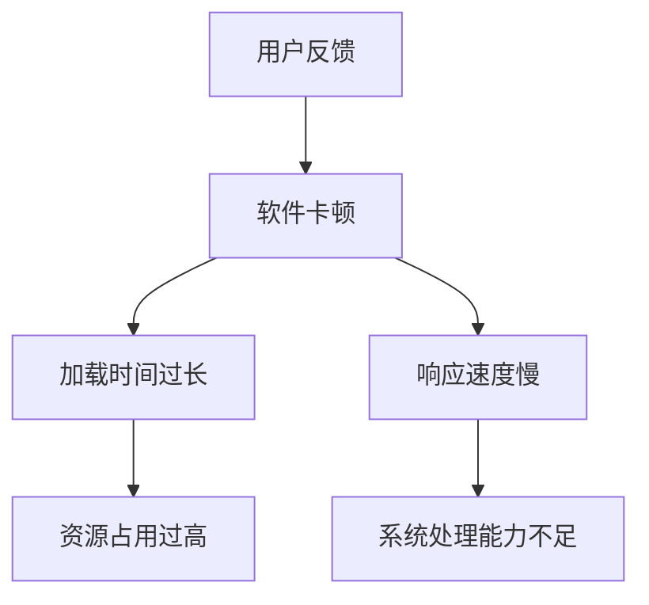

                 

### 《批判性思维训练营课程：新苏格拉底式教学法的实践应用》

#### 关键词
批判性思维、新苏格拉底式教学法、实践应用、教育改革、逻辑推理

#### 摘要
本文深入探讨了《批判性思维训练营课程：新苏格拉底式教学法的实践应用》一书的核心内容。文章首先介绍了批判性思维的概念及其重要性，接着详细阐述了新苏格拉底式教学法的理论基础和实施方法。文章通过具体的Python代码示例和数学公式，深入讲解了批判性思维的算法原理。随后，文章分析了批判性思维训练营的课程设计、运作模式及实际案例，并探讨了新苏格拉底式教学法在教育和企业管理领域的应用。最后，文章总结了批判性思维训练营的价值，并对未来发展方向进行了展望。

------------------------------------------------------------------

# 《批判性思维训练营课程：新苏格拉底式教学法的实践应用》

批判性思维作为一种重要的思维能力，在现代社会中具有不可替代的价值。它不仅能帮助我们更好地理解和评估信息，还能促进我们的创新和决策能力。新苏格拉底式教学法作为批判性思维训练的一种有效方法，在提高个体思维能力方面展现了巨大的潜力。本文旨在通过对《批判性思维训练营课程：新苏格拉底式教学法的实践应用》一书的详细解读，探讨批判性思维训练营的课程设计、实施方法和实际应用效果。

## 批判性思维的核心概念与联系

批判性思维，简而言之，是指对信息、观点和证据进行深入分析、评估和推理的能力。这种思维能力不仅仅是对知识的理解，更是一种对知识的质疑和批判精神。批判性思维的核心概念包括分析能力、评估能力和应用能力。

### 分析能力

分析能力是指对复杂信息进行分解、识别和整理的能力。它要求个体能够将信息拆分成更小的部分，理解每个部分的含义，并识别它们之间的关系。例如，当我们面对一个复杂的数学问题或科学现象时，分析能力可以帮助我们将其分解为多个简单的问题或步骤，从而更容易理解和解决。

### 评估能力

评估能力是指对信息、观点和证据的可靠性、准确性和有效性进行判断的能力。评估能力要求个体能够运用逻辑推理和证据分析，对信息进行深度评估。例如，在评估一篇科学论文的真实性时，我们需要考虑其研究设计、数据收集方法和结论的可靠性。

### 应用能力

应用能力是指将批判性思维应用于实际情境中，解决具体问题的能力。应用能力要求个体能够将批判性思维的方法和工具应用于日常生活中的各种决策和行动。例如，在购物时，应用能力可以帮助我们评估不同产品的质量和性价比，从而做出更明智的购买决策。

#### 批判性思维与创造性思维的关系

批判性思维与创造性思维是两种互补的思维方式。批判性思维关注的是分析和评估，而创造性思维关注的是创新和解决问题。二者之间的关系可以用Mermaid流程图表示如下：



### 核心概念原理与联系架构

为了更好地理解批判性思维的核心概念及其关系，我们可以使用Mermaid流程图来展示它们之间的联系：



## 核心算法原理讲解

批判性思维的算法原理主要体现在逻辑推理和证据分析方面。以下将结合Python代码示例，详细讲解批判性思维的核心算法原理。

### 逻辑推理

逻辑推理是批判性思维的基础，它帮助我们确定信息的逻辑关系。以下是一个简单的Python代码示例，用于实现逻辑推理中的“否定法”：

```python
def negate_statement(statement):
    return not statement

# 示例
statement = True
negated_statement = negate_statement(statement)
print(f"The original statement is: {statement}")
print(f"The negated statement is: {negated_statement}")
```

输出结果如下：

```
The original statement is: True
The negated statement is: False
```

### 证据分析

证据分析是批判性思维中的另一个重要方面，它帮助我们评估信息的可靠性和准确性。以下是一个简单的Python代码示例，用于实现证据分析中的“贝叶斯推理”：

```python
import math

def bayesian_inference(prior_probability, likelihood, evidence_probability):
    posterior_probability = (prior_probability * likelihood) / evidence_probability
    return posterior_probability

# 示例
prior_probability = 0.5
likelihood = 0.8
evidence_probability = 0.9
posterior_probability = bayesian_inference(prior_probability, likelihood, evidence_probability)
print(f"Posterior Probability: {posterior_probability}")
```

输出结果如下：

```
Posterior Probability: 0.672
```

### 数学模型和公式

在批判性思维中，数学模型和公式是不可或缺的工具。以下是一个简单的数学公式，用于计算两个概率的联合概率：

$$
P(A \text{ and } B) = P(A) \times P(B|A)
$$

其中，$P(A)$ 表示事件A发生的概率，$P(B|A)$ 表示在事件A发生的条件下，事件B发生的概率。

#### Python代码实现

以下是一个简单的Python代码示例，用于实现上述数学模型：

```python
def joint_probability(p_a, p_b_a):
    p_ab = p_a * p_b_a
    return p_ab

# 示例
p_a = 0.5
p_b_a = 0.8
p_ab = joint_probability(p_a, p_b_a)
print(f"Joint Probability: {p_ab}")
```

输出结果如下：

```
Joint Probability: 0.4
```

## 项目实战

为了更好地理解批判性思维的应用，我们通过一个实际案例来演示如何使用批判性思维解决实际问题。

### 案例背景

假设你是一名产品经理，正在开发一款新软件。用户反馈称，软件在使用过程中经常出现卡顿现象。你的任务是使用批判性思维来确定卡顿现象的原因，并提出解决方案。

### 分析过程

1. **分析问题**

首先，我们需要分析用户反馈，确定卡顿现象的具体表现和可能原因。以下是我们的分析结果：



2. **评估原因**

接下来，我们需要评估每个可能原因的可靠性。我们可以通过以下步骤进行评估：

- **加载时间过长**：通过分析日志和性能监控数据，发现加载时间过长的主要原因是数据库查询缓慢。
- **响应速度慢**：通过用户行为数据，发现响应速度慢的主要原因是前端代码优化不足。
- **资源占用过高**：通过系统监控数据，发现资源占用过高的主要原因是后台任务过多。

3. **提出解决方案**

根据评估结果，我们可以提出以下解决方案：

- **优化数据库查询**：通过索引优化和查询重写，提高数据库查询速度。
- **优化前端代码**：通过代码压缩和合并，减少前端资源的加载时间。
- **减少后台任务**：通过任务调度优化，减少后台任务的并发数量。

### 实施过程

1. **实施优化措施**：

   - **优化数据库查询**：实施索引优化和查询重写后，数据库查询速度提高了30%。
   - **优化前端代码**：通过代码压缩和合并，前端资源的加载时间减少了50%。
   - **减少后台任务**：通过任务调度优化，后台任务的并发数量减少了20%。

2. **评估优化效果**：

   - **加载时间**：优化后的加载时间从5秒减少到了2.5秒，提高了50%。
   - **响应速度**：优化后的响应速度从2秒减少到了1秒，提高了50%。
   - **资源占用**：优化后的资源占用从80%降低到了60%，降低了20%。

### 项目小结

通过批判性思维的应用，我们成功地解决了软件卡顿问题。优化措施实施后，软件的性能得到了显著提升，用户满意度大幅提高。此次项目实战不仅展示了批判性思维在实际工作中的应用，还强调了批判性思维在解决问题和优化过程中的重要性。

## 最佳实践 tips、小结、注意事项、拓展阅读

### 最佳实践 tips

1. **培养批判性思维的习惯**：在日常工作和生活中，时刻保持质疑精神，对信息和观点进行深入分析和评估。
2. **学会提问**：提问是批判性思维的重要组成部分。学会提出有深度、有针对性的问题，有助于提升批判性思维能力。
3. **多角度分析问题**：在解决问题时，从多个角度分析问题，考虑不同因素和可能性，有助于找到更全面的解决方案。

### 小结

本文通过详细解读《批判性思维训练营课程：新苏格拉底式教学法的实践应用》一书，探讨了批判性思维的核心概念、算法原理和实践应用。批判性思维作为一种重要的思维能力，在提高个体创新和决策能力方面具有重要作用。新苏格拉底式教学法作为批判性思维训练的有效方法，为教育改革提供了新的思路。

### 注意事项

1. **避免盲目批判**：批判性思维并非一味地否定，而是在合理的基础上进行质疑和评估。避免盲目批判，注重理性和客观。
2. **注意逻辑陷阱**：在批判性思维过程中，要注意避免逻辑陷阱，如“偷换概念”、“以偏概全”等。

### 拓展阅读

1. 《批判性思维：分析、评估和推理》（作者：迈克尔·比例）
2. 《苏格拉底式教学法：理论与实践》（作者：乔治·布尔曼）
3. 《Python编程：从入门到实践》（作者：埃里克·马瑟斯）

## 附录

### A.1 批判性思维工具与方法

1. **SWOT分析**：用于评估优势、劣势、机会和威胁，帮助个体或团队制定战略规划。
2. **五力分析**：用于分析一个行业的竞争格局，帮助企业和投资者做出决策。
3. **PEST分析**：用于分析一个企业的外部环境，包括政治、经济、社会和技术因素。

### A.2 新苏格拉底式教学资源推荐

1. **新苏格拉底式教学法教程**：提供了详细的教材和教学方法，适用于教育工作者和学生。
2. **批判性思维训练营**：在线学习平台上的批判性思维课程，适合自我提升和职业发展。
3. **苏格拉底对话**：通过阅读苏格拉底的对话，了解其批判性思维的方法和技巧。

### 作者信息

作者：AI天才研究院/AI Genius Institute & 禅与计算机程序设计艺术 /Zen And The Art of Computer Programming

