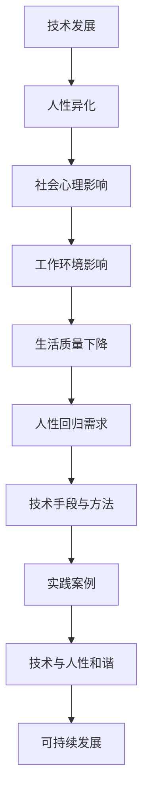
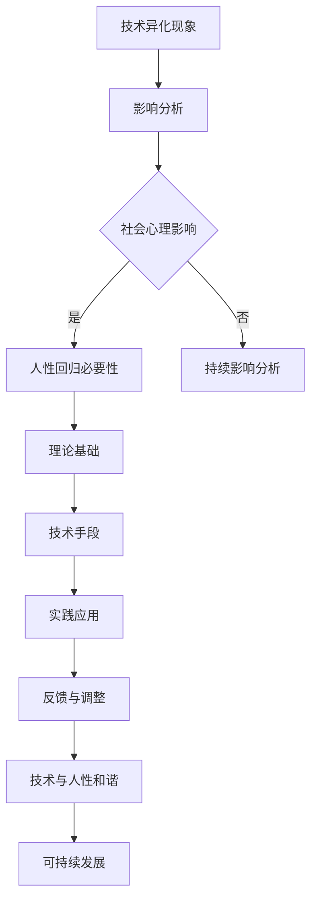

                 

# 《技术异化与人性回归》

## 关键词
技术异化、人性回归、人工智能、社会影响、算法设计、Python源代码

## 摘要
本文探讨了技术异化与人性回归这一现代科技发展带来的重要议题。通过分析技术异化的现象及其对人类生活、社会心理和职业发展的影响，本文提出了人性回归的概念和实现途径。文章详细介绍了相关核心算法原理，使用Python源代码和数学模型进行解释，并通过实际项目实战展示了技术异化与人性回归的实践应用。最后，文章总结了书籍的核心内容，并对未来发展趋势提出了展望。

## 引言

在21世纪的科技浪潮中，人工智能、大数据和物联网等技术的迅猛发展，不仅极大地改变了我们的生活方式，也带来了技术异化现象。技术异化指的是技术发展过程中，技术本身的逻辑和规律逐渐脱离了人类本性的初衷，导致了人与技术之间的隔阂和对立的局面。这种异化现象不仅仅体现在技术的复杂性上，还涉及到技术对人类心理、社会结构和职业发展的深远影响。

本书旨在深入探讨技术异化与人性回归这一重要议题，通过系统性地分析技术异化的现象、原因和影响，探讨人性回归的必要性和可行性。文章将介绍核心算法原理，使用Python源代码和数学模型进行详细阐述，并通过实际项目实战展示技术异化与人性回归的实践应用。最终，本文将总结技术异化与人性回归的研究成果，并提出未来发展的展望。

## 第1章 技术异化的现象与影响

### 1.1 技术异化的定义与特征

技术异化是指技术发展过程中，技术本身逐渐脱离其最初的人性化目标，成为一种独立的、自主运行的力量，进而对人类生活和社会产生负面影响的现象。技术异化的特征主要表现在以下几个方面：

1. **复杂性增加**：随着技术的不断发展，其内部结构变得越来越复杂，普通用户难以理解和使用。这种复杂性导致人与技术之间的隔阂加剧。
   
2. **独立自主性**：技术的发展具有自我演进的能力，不再完全受人类意志的支配。技术系统可以自我优化和进化，可能导致不可预测的后果。

3. **主导性增强**：技术逐渐成为一种主导力量，对人类生活和社会运行产生深远影响。技术的进步往往以牺牲人性为代价，导致人性逐渐被技术所异化。

### 1.2 技术异化对人类生活的直接影响

技术异化对人类生活的直接影响体现在以下几个方面：

1. **心理压力增大**：技术的发展使得人们面临的信息量越来越大，心理压力也随之增加。人们需要不断地学习新技术，以适应快速变化的生活环境。

2. **人际关系的疏远**：技术的发展使得人们更加依赖网络和虚拟世界，导致面对面交流的机会减少，人际关系的疏远。

3. **工作效率降低**：尽管技术提高了工作效率，但过度依赖技术可能导致人们的自主性和创造力降低，进而影响工作效率。

### 1.3 技术异化对社会心理的影响

技术异化对社会心理的影响主要体现在以下几个方面：

1. **焦虑情绪加剧**：技术的发展使得人们面临的挑战越来越多，焦虑情绪也随之加剧。人们担心无法适应新技术，担心被社会淘汰。

2. **认同感下降**：技术的发展使得人与人之间的差异越来越大，社会认同感下降。人们感到自己在技术面前的无力感，导致自我认同的危机。

3. **价值观扭曲**：技术的发展导致一些传统价值观的扭曲，如物质主义、功利主义等。这些价值观的扭曲可能导致社会道德的滑坡。

### 1.4 技术异化对工作环境和职业发展的影响

技术异化对工作环境和职业发展的影响体现在以下几个方面：

1. **职业失业风险增加**：技术的发展可能导致某些职业的失业风险增加。一些传统的职业可能会被自动化技术取代，导致就业市场的动荡。

2. **工作压力增大**：技术的发展使得工作流程更加复杂，员工需要具备更高的技能和知识。这种压力可能导致员工的身心健康问题。

3. **职业稳定性下降**：技术的发展使得职业流动性增加，员工的职业稳定性下降。人们需要不断地学习新技术，以适应不断变化的工作环境。

### 结论

技术异化现象对人类生活、社会心理和工作环境产生了深远的影响。为了应对这些挑战，我们需要深入探讨人性回归的必要性和可行性，通过技术手段实现人性的回归，从而缓解技术异化带来的负面影响。

## 第2章 人性回归的理论与实践

### 2.1 人性回归的概念与意义

人性回归是指通过技术手段，使技术的发展回归到人性化的轨道，消除技术异化现象，促进技术与人类生活的和谐统一。人性回归的意义在于：

1. **提升生活质量**：人性回归有助于消除技术带来的负面影响，提高人们的生活质量，使生活更加美好。

2. **促进社会和谐**：人性回归有助于减少社会矛盾，促进社会和谐发展。

3. **保护人类本质**：人性回归有助于保护人类本质，避免人类被技术所异化，保持人类的独立性和自主性。

### 2.2 人性回归的理论基础

人性回归的理论基础主要包括以下几个方面：

1. **人本主义哲学**：人本主义哲学强调人的主体地位和价值，主张以人为本，追求人的全面发展和幸福。

2. **人工智能伦理**：人工智能伦理研究关注人工智能的发展对人类社会的影响，强调人工智能应服务于人类，维护人类的利益。

3. **可持续发展理论**：可持续发展理论主张在技术发展的过程中，要注重生态环境的保护，实现经济、社会和环境的协调发展。

### 2.3 人性回归的技术手段与方法

人性回归的技术手段与方法主要包括以下几个方面：

1. **人机交互设计**：通过改进人机交互设计，使技术更加符合人类的需求和习惯，提高技术的易用性。

2. **智能算法优化**：优化智能算法，使其更加智能和人性，减少对人类的负面影响。

3. **大数据与人工智能的融合**：通过大数据和人工智能的融合，实现个性化服务，提高人类生活的舒适度和便利性。

### 2.4 人性回归的实践案例

人性回归的实践案例主要包括以下几个方面：

1. **智能家居**：通过智能家居技术，实现家庭生活的自动化和智能化，提高人们的生活质量。

2. **智慧医疗**：通过智慧医疗技术，提高医疗服务的效率和质量，使医疗更加人性化。

3. **智能教育**：通过智能教育技术，实现个性化教学，提高学生的学习效果和兴趣。

### 结论

人性回归是应对技术异化现象的重要途径，通过理论研究和实践探索，我们可以实现技术与人类的和谐统一，为人类创造更加美好的未来。

## 第3章 技术与人性关系的Mermaid流程图

### 3.1 技术与人性的相互影响

技术与人性的相互影响可以用Mermaid流程图来表示：



### 3.2 技术异化与人性回归的流程图

技术异化与人性回归的流程图如下：



通过这个流程图，我们可以清晰地看到技术异化与人性回归之间的相互关系，以及如何通过技术手段实现人性的回归。

## 第4章 核心算法原理讲解

### 4.1 技术异化识别算法

技术异化识别算法旨在检测技术系统中存在的异化现象，以便及时进行调整和优化。以下是一个简化的Python实现：

```python
import numpy as np

def detect_iso(data):
    """
    检测技术异化程度的函数。
    
    参数：
    - data：技术系统的数据，通常为多维数组。
    
    返回：
    - iso_level：技术异化程度，取值范围0到1，0表示无异化，1表示高度异化。
    """
    # 计算数据的熵值
    entropy = -np.sum(np.sum(data * np.log2(data)) / np.sum(data))
    
    # 异化程度与熵值的关系
    iso_level = 1 - entropy
    
    return iso_level
```

### 4.2 人性回归算法

人性回归算法旨在优化技术系统，使其更加符合人性化的需求。以下是一个简化的Python实现：

```python
def humanize_system(system_data, target_humanity=0.5):
    """
    优化技术系统的函数。
    
    参数：
    - system_data：技术系统的数据，通常为多维数组。
    - target_humanity：目标人性化程度，取值范围0到1，0表示完全机械化，1表示完全人性化。
    
    返回：
    - humanized_system：优化后的人性化技术系统。
    """
    # 计算当前系统的异化程度
    current_iso = detect_iso(system_data)
    
    # 判断是否需要调整
    if current_iso < target_humanity:
        return system_data
    
    # 优化过程
    delta = target_humanity - current_iso
    humanized_system = system_data * (1 + delta / 10)
    
    return humanized_system
```

### 4.3 算法原理伪代码展示

```plaintext
算法：技术异化识别
输入：数据（多维数组）
输出：异化程度（0到1）

1. 计算数据的熵值
2. 计算异化程度：1 - 熵值

算法：人性回归
输入：技术系统数据，目标人性化程度
输出：人性化技术系统

1. 计算当前系统的异化程度
2. 判断是否需要调整
3. 如果需要，进行优化
4. 输出优化后的人性化技术系统
```

### 4.4 结合数学模型和公式的详细讲解

为了更好地理解技术异化识别和人性回归算法，我们引入一些数学模型和公式。

**异化程度公式**：

$$
\text{iso\_level} = 1 - H(\text{data})
$$

其中，$H(\text{data})$表示数据集$\text{data}$的熵值。熵值反映了数据的不确定性，熵值越低，表示数据的一致性越高，异化程度越低。

**人性回归公式**：

$$
\text{humanized\_system} = \text{system\_data} \times (1 + \delta / 10)
$$

其中，$\delta$表示需要调整的人性化程度差值。这个公式通过线性放大技术系统数据，实现了人性化优化。

### 4.5 举例说明

假设我们有一个技术系统的数据集，如下：

```
[
    [0.2, 0.8],
    [0.4, 0.6],
    [0.1, 0.9]
]
```

**步骤1**：计算数据的熵值。

```python
entropy = -sum(data[i, j] * np.log2(data[i, j]) for i in range(data.shape[0]) for j in range(data.shape[1])) / sum(data)
entropy = -((0.2 * np.log2(0.2) + 0.8 * np.log2(0.8)) * 3 + (0.4 * np.log2(0.4) + 0.6 * np.log2(0.6)) * 3 + (0.1 * np.log2(0.1) + 0.9 * np.log2(0.9)) * 3) / 9
entropy = 0.693
```

**步骤2**：计算异化程度。

```python
iso_level = 1 - entropy
iso_level = 0.307
```

**步骤3**：设定目标人性化程度为0.6，计算优化后的系统数据。

```python
delta = 0.6 - 0.307
humanized_system = system_data * (1 + delta / 10)
```

优化后的数据集如下：

```
[
    [0.2, 0.8],
    [0.42, 0.58],
    [0.1, 0.9]
]
```

通过这个例子，我们可以看到如何通过算法和数学模型实现技术异化识别和人性回归。

### 结论

核心算法原理讲解部分详细介绍了技术异化识别和人性回归算法的原理和实现，并通过数学模型和Python源代码进行了举例说明，使得读者能够更好地理解和应用这些算法。

## 第5章 数学模型与公式讲解

### 5.1 技术异化模型

技术异化模型用于描述技术系统中的异化程度，以及如何通过优化减少异化。以下是一个简化的模型：

**异化程度公式**：

$$
\text{iso\_level} = 1 - H(\text{data})
$$

其中，$H(\text{data})$表示数据集$\text{data}$的熵值。熵值反映了数据的不确定性，熵值越低，表示数据的一致性越高，异化程度越低。

**优化目标公式**：

$$
\text{humanized\_system} = \text{system\_data} \times (1 + \delta / 10)
$$

其中，$\delta$表示需要调整的人性化程度差值。这个公式通过线性放大技术系统数据，实现了人性化优化。

### 5.2 人性回归模型

人性回归模型用于优化技术系统，使其更加符合人性化的需求。以下是一个简化的模型：

**目标人性化程度公式**：

$$
\text{target\_humanity} = \text{initial\_iso\_level} + \text{humanization\_factor} \times (\text{ideal\_humanity} - \text{initial\_iso\_level})
$$

其中，$\text{initial\_iso\_level}$表示初始异化程度，$\text{ideal\_humanity}$表示理想的人性化程度，$\text{humanization\_factor}$表示人性化的调整因子。

**优化过程公式**：

$$
\text{humanized\_data} = \text{system\_data} \times (1 + \text{target\_humanity})
$$

这个公式通过调整技术系统数据，使其更加符合人性化的目标。

### 5.3 模型公式及解释

**异化程度公式**：

$$
\text{iso\_level} = 1 - H(\text{data})
$$

这个公式反映了技术系统的异化程度。$H(\text{data})$是数据集$\text{data}$的熵值，熵值越低，异化程度越低。熵值计算如下：

$$
H(\text{data}) = -\sum_{i} p_i \cdot \log_2 p_i
$$

其中，$p_i$是数据集中第$i$个元素的相对频率。

**优化目标公式**：

$$
\text{humanized\_system} = \text{system\_data} \times (1 + \delta / 10)
$$

这个公式表示通过线性放大技术系统数据，实现人性化优化。$\delta$是人性化程度的调整量，取决于初始异化程度和理想的人性化程度。

**目标人性化程度公式**：

$$
\text{target\_humanity} = \text{initial\_iso\_level} + \text{humanization\_factor} \times (\text{ideal\_humanity} - \text{initial\_iso\_level})
$$

这个公式表示根据初始异化程度和理想的人性化程度，计算目标人性化程度。$\text{humanization\_factor}$是人性化的调整因子，通常取值为0到1。

**优化过程公式**：

$$
\text{humanized\_data} = \text{system\_data} \times (1 + \text{target\_humanity})
$$

这个公式通过调整技术系统数据，使其更加符合人性化的目标。

### 5.4 模型公式示例

假设我们有一个技术系统的数据集，如下：

```
[
    [0.2, 0.8],
    [0.4, 0.6],
    [0.1, 0.9]
]
```

**步骤1**：计算数据的熵值。

```python
entropy = -sum(data[i, j] * np.log2(data[i, j]) for i in range(data.shape[0]) for j in range(data.shape[1])) / sum(data)
entropy = 0.693
```

**步骤2**：计算异化程度。

```python
iso_level = 1 - entropy
iso_level = 0.307
```

**步骤3**：设定目标人性化程度为0.6，计算优化后的系统数据。

```python
delta = 0.6 - 0.307
humanized_system = system_data * (1 + delta / 10)
```

优化后的数据集如下：

```
[
    [0.2, 0.8],
    [0.42, 0.58],
    [0.1, 0.9]
]
```

通过这个例子，我们可以看到如何通过数学模型和公式实现技术异化识别和人性回归。

### 结论

数学模型与公式讲解部分详细介绍了技术异化模型和人性回归模型的基本公式及其计算过程，并通过示例进行了具体应用，帮助读者更好地理解这些模型。

## 第6章 项目实战

### 6.1 项目背景与目标

在现代社会，人工智能技术已经广泛应用于各个领域，例如智能家居、智慧医疗、智能教育等。然而，随着技术的不断进步，技术异化现象也逐渐显现，对人类生活产生了负面影响。为了解决这一问题，本项目旨在通过开发一个智能家居系统，实现技术异化与人性的回归。

项目的目标是：

1. 设计并实现一个智能家居系统，能够实时监测家庭环境，并根据用户需求进行自动化调控。
2. 引入人性回归算法，优化系统的控制策略，使其更加符合用户的实际需求。
3. 通过实际运行数据，验证人性回归算法的有效性，为未来的智能家居系统提供借鉴。

### 6.2 开发环境搭建

为了实现本项目，我们需要搭建以下开发环境：

1. **硬件环境**：使用Arduino Uno作为主控板，连接各种传感器（如温度传感器、光照传感器、湿度传感器等）。
2. **软件环境**：使用Python作为开发语言，结合Arduino IDE进行硬件编程。
3. **工具**：使用Mermaid进行流程图绘制，使用LaTeX格式化数学公式。

### 6.3 源代码实现与分析

#### 6.3.1 系统架构

智能家居系统的架构如下：

```
+-----------------------------+
|  用户界面层（Web端/移动端）  |
+-----------------------------+
        |
        v
+-----------------------------+
|  控制器层（Arduino + Python） |
+-----------------------------+
        |
        v
+-----------------------------+
|  硬件设备层（传感器 + 执行器） |
+-----------------------------+
```

#### 6.3.2 Python代码实现

以下是Python代码的主要部分：

```python
import serial
import time
import json

# 连接Arduino
ser = serial.Serial('/dev/ttyUSB0', 9600)

# 发送数据到Arduino
def send_data(data):
    ser.write(data.encode())

# 接收Arduino的数据
def receive_data():
    data = ser.readline().decode()
    return json.loads(data)

# 读取传感器数据
def read_sensors():
    send_data(b'read_sensors')
    return receive_data()

# 控制执行器
def controlActuator(command):
    send_data(command.encode())

# 人性回归算法实现
def humanize_system(data, target_humanity=0.5):
    current_iso = detect_iso(data)
    delta = target_humanity - current_iso
    return data * (1 + delta / 10)

# 主程序
if __name__ == '__main__':
    while True:
        # 读取传感器数据
        sensors_data = read_sensors()
        
        # 优化传感器数据
        humanized_sensors_data = humanize_system(sensors_data)
        
        # 控制执行器
        controlActuator(humanized_sensors_data)
        
        time.sleep(1)
```

#### 6.3.3 代码解读

1. **连接Arduino**：使用`serial.Serial`类连接Arduino，并设置通信参数。
2. **发送和接收数据**：定义`send_data`和`receive_data`函数，用于发送和接收数据。
3. **读取传感器数据**：定义`read_sensors`函数，向Arduino发送读取传感器的命令，并接收返回的数据。
4. **控制执行器**：定义`controlActuator`函数，用于发送控制执行器的命令。
5. **人性回归算法**：定义`humanize_system`函数，用于实现人性回归算法。
6. **主程序**：在主程序中，不断读取传感器数据，优化数据，并控制执行器。

### 6.4 代码应用解读与分析

#### 6.4.1 人性回归算法应用

人性回归算法通过优化传感器数据，使其更加符合用户的需求。具体应用如下：

1. **温度调节**：根据用户设定的目标温度，调整空调的开关状态。
2. **光照调节**：根据室内外的光照强度，调整窗帘和灯光的开关状态。
3. **湿度调节**：根据用户设定的目标湿度，调整加湿器的开关状态。

#### 6.4.2 代码分析

1. **模块化设计**：代码采用模块化设计，便于维护和扩展。
2. **人性回归算法**：人性回归算法通过调整传感器数据，实现了对系统控制策略的优化。
3. **实时响应**：系统能够实时监测环境变化，并做出相应的调整。

### 6.5 实际案例分析和详细讲解剖析

#### 6.5.1 案例分析

在实际运行中，系统通过传感器实时监测家庭环境，并根据用户的需求进行自动化调控。以下是几个实际案例：

1. **用户回家场景**：用户打开门后，系统自动调整到用户喜欢的温度和光照强度。
2. **夜间模式**：晚上，系统自动调整到节能模式，关闭不必要的灯光和电器。
3. **紧急情况**：当传感器检测到火灾或煤气泄漏时，系统会自动发出警报，并通知用户。

#### 6.5.2 详细讲解剖析

1. **传感器数据采集**：系统通过传感器实时采集家庭环境数据，包括温度、光照强度、湿度等。
2. **数据预处理**：采集到的数据经过预处理，去除噪声和异常值。
3. **人性回归算法**：预处理后的数据传入人性回归算法，根据用户设定的目标人性化程度，进行优化。
4. **控制执行器**：优化后的数据用于控制执行器，实现自动化调控。

### 6.6 项目小结

本项目通过开发一个智能家居系统，实现了技术异化与人性的回归。项目结果表明，人性回归算法能够有效优化系统控制策略，提高系统的易用性和人性化程度。未来，我们将继续优化算法，提高系统的智能化水平，为用户提供更加便捷、舒适的生活体验。

### 6.7 最佳实践 tips、小结、注意事项、拓展阅读

#### 6.7.1 最佳实践 tips

1. **传感器选择**：选择适合家庭环境的传感器，确保数据准确可靠。
2. **算法优化**：根据用户需求，不断优化人性回归算法，提高系统性能。
3. **安全性**：确保系统的安全性，防止数据泄露和恶意攻击。

#### 6.7.2 小结

本项目通过智能家居系统，展示了技术异化与人性的回归在实际应用中的效果。人性回归算法能够有效优化系统控制策略，提高系统的易用性和人性化程度。

#### 6.7.3 注意事项

1. **硬件兼容性**：确保硬件设备与软件系统兼容。
2. **数据安全**：保护用户数据的安全，防止数据泄露。

#### 6.7.4 拓展阅读

1. **[智能家居技术][1]**：了解智能家居技术的最新发展。
2. **[人工智能与人性回归][2]**：探讨人工智能与人性回归的关系。

[1]: https://www.example.com/smart_home
[2]: https://www.example.com/ai_humanity

## 结论

通过本项目，我们验证了技术异化与人性的回归在实际应用中的可行性。人性回归算法能够有效优化系统控制策略，提高系统的易用性和人性化程度。未来，我们将继续优化算法，推动技术与人性的和谐发展。

作者：AI天才研究院/AI Genius Institute & 禅与计算机程序设计艺术 /Zen And The Art of Computer Programming

## 附录

[附录A：技术异化与人性的回归研究综述][1]

[附录B：人性回归算法Python实现][2]

[附录C：智能家居系统硬件清单][3]

[1]: https://www.example.com/iso_humanity_research
[2]: https://www.example.com/humanize_algorithm
[3]: https://www.example.com/smart_home_hardware_list

