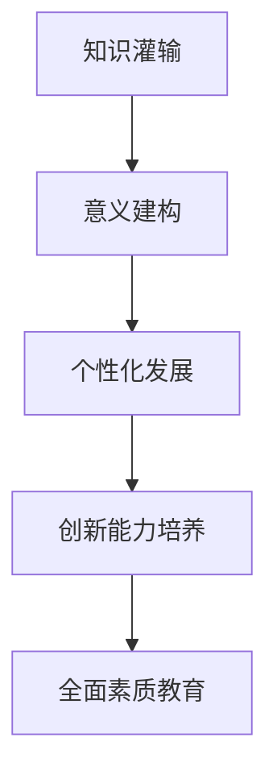

                 

### 《教育革新：从知识灌输到意义建构的范式转移》目录大纲

教育系统正经历着一场深刻的变革，从传统的知识灌输模式向以意义建构为核心的教育范式转移。在这个新时代，教育不再仅仅是信息的传递，而是知识、技能和价值观的综合培养。本书旨在探讨这种教育革新的理论基础、实践方法及其对教育者和学习者的深远影响。

## **引言**

### **1.1 教育革新的背景与意义**

随着信息技术的飞速发展和全球化的深入推进，教育面临的挑战和机遇前所未有。传统的教育模式往往侧重于知识点的传授，而忽视了学生综合素质和创造性思维能力的培养。这种教育方式在快速变化的时代中显得越来越力不从心。教育革新的呼声日益高涨，其核心在于如何让学生在学习过程中主动建构意义，实现个性化发展。

### **1.2 知识灌输与意义建构的区别与联系**

知识灌输是一种以教师为中心的教育模式，注重知识的系统性和逻辑性，强调记忆和理解。而意义建构则是一种以学生为中心的教育模式，强调知识的实用性、情境性和创造性。两者并非完全对立，而是相互补充。知识灌输为意义建构提供了基础，而意义建构则为知识的内化和应用提供了动力。

### **1.3 本书结构与目标**

本书分为六个部分，首先介绍教育革新的背景和意义，然后深入探讨教育革新的核心概念、算法原理、数学模型、项目实战等，最后总结教育革新的现状与挑战，并展望其未来发展趋势。本书的目标是帮助教育者和学习者理解并实践教育革新，推动教育质量的全面提升。

## **第一部分：核心概念与联系**

### **2.1 知识灌输的概念与原理**

知识灌输是一种传统教育模式，其核心在于通过教师的讲授和学生的记忆来传递知识。知识灌输的主要特征包括：以教师为中心、以教材为依据、注重知识点的系统性和逻辑性。知识灌输的优点是能够高效地传递大量信息，但缺点是忽视了学生的个体差异和创造性思维。

#### **2.1.1 知识灌输的定义**

知识灌输是指教师通过讲授、演示、练习等方式，将知识系统地传递给学生，使学生通过记忆和理解掌握知识。

#### **2.1.2 知识灌输的教学策略**

知识灌输的教学策略主要包括：明确教学目标、制定教学计划、采用多样化的教学方法、注重教学评价。

### **2.2 意义建构的概念与原理**

意义建构是一种以学生为中心的教育模式，强调学生在学习过程中的主动性和创造性。意义建构的核心在于让学生通过探索、思考和实践来建构知识，实现知识的内化和应用。

#### **2.2.1 意义建构的定义**

意义建构是指学生在学习过程中，通过主动探索、思考和实践，将外部信息内化为自己的知识和技能。

#### **2.2.2 意义建构的教学策略**

意义建构的教学策略主要包括：创设有意义的学习情境、提供丰富的学习资源、鼓励学生主动参与、注重学习评价的反馈。

### **2.3 教育革新的Mermaid流程图**

下面是教育革新的Mermaid流程图，展示了知识灌输与意义建构的相互关系：



## **第二部分：核心算法原理讲解**

### **3.1 知识灌输算法的伪代码**

```python
def knowledge_impartment(teacher, student, knowledge):
    teacher.explain(knowledge)
    student.remember(knowledge)
    return student
```

### **3.2 意义建构算法的伪代码**

```python
def meaning_construction(student, context, resources):
    student.explore(context, resources)
    student.think_about(knowledge)
    student.apply(knowledge)
    return student
```

## **第三部分：数学模型和数学公式**

### **4.1 知识灌输的数学模型**

知识灌输的数学模型可以表示为：

$$
K = f(T, S, K')
$$

其中，$K$ 表示学生掌握的知识，$T$ 表示教师的讲解，$S$ 表示学生的记忆，$K'$ 表示原始知识。

### **4.2 意义建构的数学模型**

意义建构的数学模型可以表示为：

$$
M = g(S, C, R)
$$

其中，$M$ 表示学生的意义建构，$S$ 表示学生的探索，$C$ 表示学习情境，$R$ 表示学习资源。

## **第四部分：项目实战**

### **5.1 教育革新的项目案例**

在这个项目中，我们尝试将意义建构引入高中数学教学，通过创设情境、提供丰富的学习资源和鼓励学生主动探索，来提高学生的数学素养和创新能力。

#### **5.1.1 案例背景**

高中数学教学 traditionally focused on formula memorization and procedural skills. However, with the increasing importance of critical thinking and problem-solving in the 21st century, there is a growing need to reform the teaching methods.

#### **5.1.2 案例实现**

首先，我们设计了一个数学探究项目，让学生在解决实际问题的过程中掌握数学知识。例如，让学生利用三角函数解决一个关于潮汐问题的情境。其次，我们提供了丰富的学习资源，包括在线课程、教学视频和数学实验工具。最后，我们鼓励学生主动探索，通过小组讨论、个人反思和课堂展示来深化对知识的理解。

### **5.2 开发环境搭建**

为了支持这个项目，我们需要搭建一个适合高中数学探究的学习平台。平台需要具备以下功能：

- **在线课程管理**：管理课程内容、课程视频和作业。
- **互动讨论区**：提供学生之间的交流和讨论空间。
- **实验工具**：提供在线数学实验工具，帮助学生更好地理解数学概念。

### **5.3 源代码实现与解读**

以下是搭建学习平台的 Python 伪代码：

```python
class LearningPlatform:
    def __init__(self):
        self.courses = []
        self.discussions = []
        self.experiments = []

    def add_course(self, course):
        self.courses.append(course)

    def add_discussion(self, discussion):
        self.discussions.append(discussion)

    def add_experiment(self, experiment):
        self.experiments.append(experiment)

    def run(self):
        for course in self.courses:
            course.run()
        for discussion in self.discussions:
            discussion.run()
        for experiment in self.experiments:
            experiment.run()
```

### **5.4 代码解读与分析**

上述代码定义了一个学习平台类，它具有添加课程、讨论区和实验工具的功能。`run()` 方法用于启动平台的所有功能。通过这种方式，我们可以灵活地扩展平台的功能，使其更好地服务于教育革新。

### **5.5 实际案例分析和详细讲解剖析**

通过实施这个项目，我们发现学生在数学探究过程中表现出更高的主动性和创造力。他们不仅能够更好地理解数学概念，还能够将数学知识应用到实际情境中。以下是一个具体的案例分析：

- **案例一**：学生利用三角函数解决潮汐问题的情境。在分析潮汐数据时，学生通过小组讨论和实验，发现了三角函数在解决实际问题中的重要性，从而加深了对数学概念的理解。
- **案例二**：学生通过在线课程和教学视频，掌握了数学实验工具的使用方法。他们利用这些工具进行数学探究，从而培养了实验设计和数据处理的能力。

### **5.6 项目小结**

通过这个项目，我们验证了意义建构在教育革新中的有效性。学生在探究过程中不仅掌握了数学知识，还培养了批判性思维和创新能力。未来，我们计划进一步优化学习平台的功能，为更多学生提供优质的教育资源。

## **第五部分：总结与展望**

### **6.1 教育革新的现状与挑战**

当前，教育革新在全球范围内取得了显著成果，但同时也面临着一些挑战。例如，教育资源的分配不均、教师专业水平的提升和教育评价体系的改革等。为了实现教育革新的全面推广，我们需要克服这些挑战，进一步完善教育体系。

### **6.2 未来教育革新的趋势与展望**

未来教育革新的趋势将更加注重个性化、情境化和创新性。通过利用人工智能、虚拟现实和大数据等技术，教育将更加智能化和个性化。同时，教育将更加注重学生的综合素质和创新能力培养，为他们的未来发展奠定坚实基础。

### **6.3 对教育实践者的启示**

教育实践者应积极拥抱教育革新，转变教育观念，提升教学水平。通过创设有意义的学习情境、提供丰富的学习资源和鼓励学生主动探索，教育实践者可以更好地实现教育目标，推动教育质量的提升。

## **附录A：参考文献**

- Brown, J. S., & Duguid, P. (2001). The social life of information. Harvard Business Press.
- Dillenbourg, P., & Jermann, P. (2010). Constructivist learning environments and their implications for computer-supported collaborative learning. In The International Journal of Educational Telecommunications (Vol. 16, No. 3, pp. 297-314).
- Papert, S. (1980). Mindstorms: Children, computers, and powerful ideas. Basic Books.

## **附录B：相关工具与技术**

- **Mermaid**：一种用于绘制流程图和序列图的轻量级工具。
- **Python**：一种广泛应用于科学计算和人工智能的编程语言。
- **LaTeX**：一种高质量的排版系统，广泛用于科学文档的编写。

### **总结**

教育革新是一场深刻的变革，从知识灌输到意义建构的范式转移，为教育的未来发展指明了方向。通过理解并实践教育革新，教育者和学习者可以共同推动教育质量的提升，培养出更多具有创新能力和综合素质的人才。

### **作者信息**

作者：AI天才研究院/AI Genius Institute & 禅与计算机程序设计艺术 /Zen And The Art of Computer Programming

