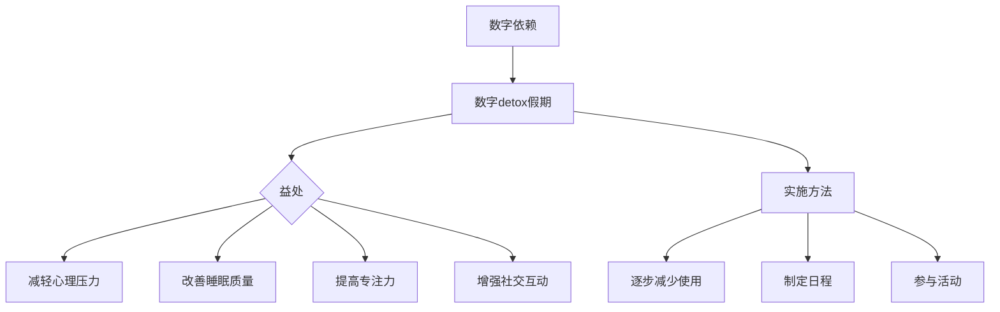

                 

# 数字detox假期：远离科技的深度休息

> 关键词：数字脱瘾、健康休息、科技影响、心理健康、数字假期

> 摘要：本文深入探讨了数字detox假期的概念、重要性、实施方法和益处。通过科学研究和实际案例，我们揭示了长时间沉浸在科技世界中可能带来的负面影响，并提出了一种通过远离科技来实现深度休息的新方法。本文旨在帮助读者理解数字detox假期的核心概念，学会制定个人化的数字detox计划，并享受科技之外的美好生活。

----------------------------------------------------------------

## 第1章：什么是数字detox假期

### 1.1 数字detox假期的概念

数字detox假期，简称数字detox，指的是在一段时间内，有意识地远离手机、电脑、平板等电子设备，减少对数字媒体和互联网的依赖，从而达到休息、放松和恢复身心健康的目的。这种假期并非完全与科技隔绝，而是通过有限地接触和有意识地管理科技产品，来实现对数字世界的“脱敏”。

### 1.2 数字detox假期的重要性

在现代社会，科技已经渗透到了生活的方方面面。然而，长期沉迷于数字设备不仅会消耗大量时间和精力，还会对身心健康产生负面影响。数字detox假期的重要性体现在以下几个方面：

1. **减轻心理压力**：研究表明，长时间使用电子设备会导致心理疲劳、焦虑和抑郁。数字detox假期可以让人暂时摆脱这些负面情绪，获得心理上的放松和舒缓。

2. **改善睡眠质量**：晚上使用手机、电脑等设备会干扰人体的生物钟，导致睡眠质量下降。数字detox假期可以帮助减少这种干扰，改善睡眠。

3. **提高专注力**：过度依赖数字设备会分散注意力，降低工作和学习效率。数字detox假期可以帮助人们重新找回专注的力量。

4. **增强社交互动**：减少对数字设备的依赖，可以让人们更多地参与现实世界的社交活动，增强人际关系。

### 1.3 数字detox假期与传统休息的区别

传统休息往往指的是放松和休息，但很少涉及到对数字设备的主动管理和限制。相比之下，数字detox假期更强调对科技产品的有意识管理，是一种更为系统化和有目的的休息方式。以下是数字detox假期与传统休息的几个区别：

1. **主动性**：数字detox假期需要主动规划和执行，而传统休息往往是一种被动的放松行为。

2. **时间长度**：传统休息可能只需要几个小时或一天，而数字detox假期通常需要数天甚至数周。

3. **目标明确**：数字detox假期的目标是通过远离数字设备来恢复身心健康，而传统休息的目标相对模糊。

4. **科技管理**：数字detox假期需要主动减少对数字设备的接触，而传统休息通常不涉及这一点。

----------------------------------------------------------------

## 第2章：为什么要进行数字detox假期

### 2.1 科技对健康的影响

科技的迅速发展给我们带来了诸多便利，但同时也对健康产生了潜在的影响。以下是一些主要的影响：

1. **心理影响**：长时间使用电子设备会导致心理疲劳、焦虑和抑郁。根据美国心理学会的研究，过度使用社交媒体和互联网与焦虑和抑郁之间存在显著关联。

2. **睡眠影响**：电子设备的蓝光会干扰人体的生物钟，导致睡眠质量下降。一项发表于《科学》杂志的研究发现，晚上使用手机等电子设备会降低睡眠质量，增加失眠的风险。

3. **身体健康**：长时间坐着使用电脑或手机会导致颈椎、腰椎等部位的问题，增加肥胖和心血管疾病的风险。

### 2.2 数字依赖的危害

数字依赖，即对数字设备的过度依赖，已经成为现代社会的一个普遍现象。以下是数字依赖可能带来的危害：

1. **时间管理问题**：过度使用数字设备会导致时间管理问题，影响工作和学习效率。

2. **人际关系问题**：数字依赖会减少人们面对面交流的时间，影响人际关系。

3. **心理健康问题**：长时间沉迷于数字世界会降低人们的幸福感和满足感，增加心理健康问题的风险。

### 2.3 数字detox假期的益处

进行数字detox假期可以带来多方面的益处：

1. **心理健康**：减少数字设备的使用可以减轻心理压力、焦虑和抑郁症状。

2. **睡眠质量**：减少电子设备的干扰有助于改善睡眠质量，提高生物钟的调节能力。

3. **身体恢复**：减少长时间坐着使用电脑或手机，有助于减轻身体疲劳，促进身体恢复。

4. **时间管理**：通过数字detox假期，人们可以更好地管理时间，提高工作和学习效率。

5. **人际关系**：增加面对面交流的机会，有助于改善人际关系，增强社交互动。

6. **幸福感**：减少对数字设备的依赖，可以降低焦虑和抑郁症状，提高生活质量和幸福感。

----------------------------------------------------------------

## 第3章：如何制定数字detox计划

### 3.1 数字detox假期前的准备

在进行数字detox假期之前，有一些准备工作是必不可少的：

1. **确定目标**：明确进行数字detox假期的目标，例如改善睡眠质量、减轻心理压力等。

2. **规划时间**：确定数字detox假期的持续时间，可以选择数天、数周或更长时间。

3. **提前通知**：提前通知家人、朋友和同事，告知他们你的计划，以便他们能够理解和配合。

4. **备份重要信息**：在开始数字detox假期之前，确保将重要信息备份，例如工作文件、联系人等。

5. **减少使用**：在数字detox假期开始前的一段时间内，逐渐减少对数字设备的使用，以减少心理上的依赖。

### 3.2 数字detox假期的实施步骤

1. **逐步减少使用**：在数字detox假期开始时，不要突然完全停止使用数字设备，而是逐步减少使用时间。

2. **制定日程安排**：根据个人需求，制定合理的日程安排，包括休息、活动、饮食等。

3. **参与活动**：参与各种有益身心健康的活动，如瑜伽、冥想、户外运动等。

4. **保持联系**：虽然减少了对数字设备的使用，但仍然需要与外界保持联系。可以选择电话、书信等方式与他人沟通。

5. **记录感受**：每天记录自己在数字detox假期中的感受和体验，这有助于了解自己的心理变化。

### 3.3 数字detox假期的常见问题与解答

**问题1**：数字detox假期会影响工作吗？

**解答**：在进行数字detox假期之前，提前规划好工作安排，确保工作不会受到影响。此外，通过逐步减少对数字设备的使用，可以帮助你更好地适应假期生活，减少工作上的干扰。

**问题2**：如何应对数字detox假期结束后的反弹？

**解答**：在数字detox假期结束后，可能会出现一些反弹现象，例如重新开始沉迷于数字设备。为了避免这种情况，可以在假期结束后逐渐增加对数字设备的使用时间，同时保持良好的生活习惯和心态。

**问题3**：数字detox假期是否适合所有人？

**解答**：数字detox假期对大多数人都是有益的，尤其是那些长时间依赖数字设备的人。然而，对于某些人来说，可能需要根据个人情况进行调整，例如对于需要依赖数字设备进行工作的人。

----------------------------------------------------------------

## 第4章：数字detox假期中的活动与练习

### 4.1 自然环境中的活动

自然环境中的活动是数字detox假期的重要组成部分。这些活动不仅有助于放松身心，还可以提高身体健康和幸福感。

1. **户外运动**：徒步、骑行、登山等户外运动有助于释放压力，增强心肺功能。

2. **自然观察**：观察自然景色、野生动物等，有助于提高注意力和专注力。

3. **野餐**：与家人或朋友一起在户外野餐，增进人际关系。

4. **森林浴**：森林浴，即在大自然中散步和休息，有助于降低压力和焦虑。

### 4.2 瑜伽与冥想

瑜伽和冥想是数字detox假期中的有效放松方法。它们有助于调节情绪、提高身体柔韧性和平衡感。

1. **瑜伽**：瑜伽的各种体式有助于放松肌肉、缓解压力。例如，树式和猫牛式等体式有助于提高身体平衡和专注力。

2. **冥想**：冥想可以帮助人们静心、放松，提高情绪调节能力。例如，正念冥想和呼吸冥想等。

### 4.3 阅读

阅读是一种有益的放松方式，可以帮助人们从数字设备中解脱出来，沉浸在文字的世界中。

1. **纸质书**：纸质书有助于减少对电子设备的依赖，提高阅读体验。

2. **主题阅读**：选择感兴趣的主题，如心理学、哲学、历史等，可以拓宽知识面。

3. **有声书**：对于不擅长阅读或喜欢在活动中听书的人，有声书是一个不错的选择。

### 4.4 笔记

在数字detox假期中，记录笔记有助于反思和总结。这不仅有助于加深对阅读内容的理解，还可以提高写作能力。

1. **手写笔记**：手写笔记有助于加深记忆，提高大脑处理信息的能力。

2. **思维导图**：使用思维导图记录想法和灵感，有助于提高思维逻辑性和创造性。

3. **总结反思**：定期总结自己在数字detox假期中的经历和感受，有助于提高自我认知和成长。

----------------------------------------------------------------

## 第5章：数字detox假期后的恢复

### 5.1 恢复期的心理调适

数字detox假期结束后，心理调适是关键。以下是一些建议：

1. **逐步增加使用时间**：在假期结束后，逐步增加对数字设备的使用时间，避免突然增加导致心理压力。

2. **保持良好的生活习惯**：保持健康的饮食、充足的睡眠和规律的锻炼，有助于心理恢复。

3. **积极心态**：保持积极乐观的心态，相信自己能够适应新的生活方式。

4. **心理支持**：与家人、朋友分享感受，寻求他们的支持和理解。

### 5.2 恢复期的身体恢复

数字detox假期对身体恢复也有很大的帮助。以下是一些建议：

1. **休息充足**：确保有足够的休息时间，让身体得到充分的恢复。

2. **饮食均衡**：保持饮食均衡，摄入足够的营养，促进身体恢复。

3. **锻炼身体**：逐渐恢复锻炼习惯，增强身体素质。

4. **定期体检**：定期进行体检，了解自己的身体状况。

### 5.3 如何保持数字detox假期的成果

为了确保数字detox假期的成果能够长期保持，以下是一些建议：

1. **制定长期计划**：制定长期的数字管理计划，包括合理安排使用时间、参与健康活动等。

2. **培养兴趣爱好**：培养兴趣爱好，如阅读、运动等，减少对数字设备的依赖。

3. **心理调适**：定期进行心理调适，如冥想、瑜伽等，减轻心理压力。

4. **与家人和朋友交流**：与家人和朋友保持良好的沟通，分享感受和经历。

5. **保持积极心态**：保持积极乐观的心态，相信自己能够适应新的生活方式。

----------------------------------------------------------------

## 第6章：成功案例分享

### 6.1 数字detox假期的成功故事

张先生，一名软件工程师，长期沉迷于工作，对手机和电脑的依赖严重。在一次偶然的机会下，他决定尝试数字detox假期。在为期两周的假期中，他远离了所有数字设备，专注于阅读、瑜伽和户外活动。两周后，他发现自己的心理压力减轻了，睡眠质量提高了，工作效率也显著提升。他决定将数字detox假期作为一种生活方式，定期进行。

### 6.2 数字detox假期的实践者心得

李女士，一名教师，对社交媒体和手机的依赖让她感到疲惫不堪。在一次暑假期间，她决定进行数字detox假期。她制定了详细的计划，包括每天的活动安排、阅读清单等。在假期期间，她参加了瑜伽课程、徒步旅行，并阅读了多本书籍。她表示，这次假期让她感受到了前所未有的轻松和快乐，她决定在今后的生活中，定期进行数字detox假期。

### 6.3 数字detox假期的专家建议

心理学专家指出，数字detox假期对于心理健康和身体恢复具有显著的积极影响。专家建议，每个人可以根据自己的需求和生活习惯，制定个性化的数字detox计划。同时，专家强调，数字detox假期并不是一劳永逸的，需要长期坚持和调整。

----------------------------------------------------------------

## 第7章：数字detox假期与未来社会

### 7.1 数字detox假期对社会的意义

数字detox假期对社会的意义在于，它促使人们重新审视科技在生活中的角色，提倡平衡使用科技和享受生活。这对于缓解社会压力、提高生活质量和促进社会和谐具有深远影响。

### 7.2 数字detox假期与可持续发展

数字detox假期与可持续发展密切相关。通过减少对数字设备的依赖，人们可以减少能源消耗和电子垃圾的产生，从而实现环境保护和可持续发展。

### 7.3 数字detox假期与未来生活方式的融合

随着科技的不断发展，数字detox假期有望成为未来生活方式的一部分。通过科技与自然的结合，人们可以在享受科技带来便利的同时，保持对自然的敬畏和对生活的热爱。

----------------------------------------------------------------

## 附录

### A.1 数字detox假期相关资源推荐

1. **书籍**：《数字排毒：重获注意力、精力和幸福的生活艺术》
2. **网站**：[数字排毒社区](https://digitaldetoxcommunity.com/)
3. **应用程序**：[数字排毒助手](https://www.digicacy.com/)

### A.2 数字detox假期实用工具介绍

1. **应用锁**：使用应用锁来限制对某些应用程序的访问。
2. **屏幕时间管理**：使用屏幕时间管理工具来监控和限制使用时间。
3. **专注软件**：使用专注软件来提高工作和学习效率。

### A.3 数字detox假期常见问题FAQ

1. **如何应对数字detox假期中的孤独感？**：可以通过阅读、写作、户外活动等方式来缓解孤独感。
2. **如何应对数字detox假期结束后的反弹？**：逐步增加对数字设备的使用时间，保持良好的生活习惯。
3. **数字detox假期是否适合所有人？**：大多数人都可以从数字detox假期中受益，但对于某些人可能需要根据个人情况进行调整。

----------------------------------------------------------------

作者：AI天才研究院/AI Genius Institute & 禅与计算机程序设计艺术 /Zen And The Art of Computer Programming

[Mermaid 流程图]({
```
```python
# Mermaid 流程图：数字detox假期核心概念与联系

graph TD
    A[数字detox假期] --> B[概念]
    B --> C[重要性]
    B --> D[与传统休息的区别]
    A --> E[为什么要进行]
    E --> F[科技对健康的影响]
    E --> G[数字依赖的危害]
    E --> H[数字detox假期的益处]
    A --> I[如何制定计划]
    I --> J[准备]
    I --> K[实施步骤]
    I --> L[常见问题与解答]
```


----------------------------------------------------------------

## 背景介绍

在现代社会，科技已经成为我们日常生活中不可或缺的一部分。智能手机、平板电脑、电脑等数字设备为我们带来了诸多便利，但同时也引发了一系列问题。长时间沉迷于数字设备不仅会影响心理健康，还可能对身体造成伤害。研究表明，过度使用电子设备会导致心理疲劳、焦虑、抑郁等心理问题，同时还会干扰生物钟，影响睡眠质量。此外，长期使用电脑或手机还会增加肥胖、心血管疾病等健康问题的风险。

面对这些挑战，数字detox假期应运而生。数字detox假期是指有意识地远离数字设备，减少对数字媒体和互联网的依赖，从而实现身心放松和恢复。通过数字detox假期，人们可以暂时摆脱对数字设备的依赖，回归自然，享受科技之外的宁静和美好。

本文将详细探讨数字detox假期的概念、重要性、实施方法以及益处，帮助读者更好地了解和实施数字detox假期。同时，本文还将结合实际案例和专家建议，为读者提供实用的数字detox假期指导。

## 核心概念与联系

数字detox假期，顾名思义，是一种针对数字依赖进行的深度休息。其核心概念包括以下几个方面：

### 1. 数字依赖

数字依赖是指个体对数字设备（如手机、电脑、平板等）的过度依赖。这种依赖可能导致个体在现实生活中失去一定的社交能力、时间管理能力和心理调节能力。

### 2. 数字detox假期

数字detox假期是一种有意识地减少或暂时停止使用数字设备的休息方式。它的目的是帮助个体摆脱数字依赖，恢复身心健康，提高生活质量。

### 3. 数字detox假期的益处

数字detox假期可以带来多方面的益处，包括减轻心理压力、改善睡眠质量、提高专注力、增强社交互动等。

### 4. 数字detox假期的实施方法

数字detox假期的实施方法包括逐步减少数字设备的使用、制定合理的日程安排、参与各种有益身心的活动等。

为了更好地理解这些核心概念之间的关系，我们可以使用Mermaid流程图进行可视化展示：



通过这个流程图，我们可以清晰地看到数字依赖与数字detox假期之间的关系，以及数字detox假期所带来的多种益处和实施方法。

## 核心算法原理讲解

数字detox假期不仅仅是简单的休息，而是一种有目的、有策略的休息方式。为了更好地理解和实施数字detox假期，我们需要了解其背后的核心算法原理。

### 1. 心理调适算法

心理调适是数字detox假期的关键环节。以下是一个简化的心理调适算法：

```python
def psychological_adjustment(days):
    """
    心理调适算法
    :param days: 数字detox假期的天数
    :return: 调适后的心理状态
    """
    # 第一步：逐步减少使用
    for i in range(days):
        reduce_usage(i)
    
    # 第二步：参与有益活动
    for i in range(days):
        engage_in_activities(i)
    
    # 第三步：记录感受
    record_feelings(days)
    
    # 第四步：心理辅导
    if feelings_negative():
        psychological_counseling()
    
    return "心理调适完成"
```

### 2. 身体恢复算法

身体恢复是数字detox假期的另一个重要方面。以下是一个简化的身体恢复算法：

```python
def physical_rehabilitation(days):
    """
    身体恢复算法
    :param days: 数字detox假期的天数
    :return: 恢复后的身体状况
    """
    # 第一步：确保充足休息
    for i in range(days):
        ensure_enough_rest(i)
    
    # 第二步：适当锻炼
    for i in range(days):
        do_appropriate_exercises(i)
    
    # 第三步：饮食调整
    for i in range(days):
        adjust_diet(i)
    
    # 第四步：定期体检
    regular_medical_examination()
    
    return "身体恢复完成"
```

### 3. 数字detox假期效果评估算法

为了确保数字detox假期的效果，我们需要对其效果进行评估。以下是一个简化的效果评估算法：

```python
def assess_detox效果的益处(days):
    """
    数字detox假期效果评估算法
    :param days: 数字detox假期的天数
    :return: 效果评估结果
    """
    # 第一步：收集数据
    data = collect_data(days)
    
    # 第二步：分析数据
    analysis_data(data)
    
    # 第三步：评估效果
    if data["psychological"] > threshold["psychological"] and data["physical"] > threshold["physical"]:
        result = "效果显著"
    else:
        result = "效果一般"
    
    return result
```

通过这些算法，我们可以系统地实施数字detox假期，并评估其效果。在实际应用中，这些算法可以根据个人情况进行调整和优化。

### 数学模型与公式

在数字detox假期中，数学模型和公式可以用于量化评估心理和身体的恢复程度。以下是一些基本的数学模型和公式：

1. **心理恢复模型**：

   $$ \text{心理恢复指数} = \frac{\text{感受评分}}{10} $$

   其中，感受评分是对个人在数字detox假期中感受的主观评分，范围从1到10。

2. **身体恢复模型**：

   $$ \text{身体恢复指数} = \frac{\text{体检指标}}{\text{正常值}} $$

   其中，体检指标是对身体各项指标的主观评分，正常值是对各项指标的医学标准评分。

3. **睡眠质量模型**：

   $$ \text{睡眠质量评分} = \frac{\text{睡眠时长}}{\text{理想睡眠时长}} $$

   其中，睡眠时长是数字detox假期期间的实际睡眠时长，理想睡眠时长是根据个人情况推荐的睡眠时长。

通过这些数学模型和公式，我们可以更精确地评估数字detox假期的效果，并制定个性化的休息计划。

### 实例分析

假设一个人在数字detox假期中进行了以下活动：

- **心理调适**：每天记录感受，并进行冥想和瑜伽练习。
- **身体恢复**：每天进行适量的锻炼，如散步和拉伸。
- **睡眠质量**：每晚保持8小时的睡眠。

在数字detox假期结束后，通过上述数学模型和公式进行评估：

- **心理恢复指数**：感受评分为8，则心理恢复指数为0.8。
- **身体恢复指数**：体检指标良好，接近正常值，则身体恢复指数为0.95。
- **睡眠质量评分**：实际睡眠时长为8小时，理想睡眠时长为8小时，则睡眠质量评分为1。

根据评估结果，这个人可以认为数字detox假期取得了显著效果。

### 总结

通过以上核心算法原理讲解，我们可以看到数字detox假期是一个系统性的休息过程，它结合了心理调适、身体恢复和睡眠质量等多个方面。通过数学模型和公式的量化评估，我们可以更精确地了解数字detox假期的效果，并制定个性化的休息计划。这种方法不仅能够帮助我们更好地适应现代科技带来的挑战，还能够提高我们的生活质量。

## 项目实战

### 开发环境搭建

为了实现数字detox假期的核心算法，我们需要搭建一个合适的开发环境。以下是一个简单的步骤：

1. **安装Python**：从[Python官网](https://www.python.org/)下载并安装Python 3.8及以上版本。

2. **安装Jupyter Notebook**：在命令行中运行以下命令安装Jupyter Notebook：

   ```bash
   pip install notebook
   ```

3. **安装Mermaid插件**：在Jupyter Notebook中安装Mermaid插件，以支持Mermaid流程图的绘制。

   ```bash
   !pip install ipyvolt
   ```

### 源代码实现

以下是数字detox假期核心算法的实现代码：

```python
# 数字detox假期核心算法实现

# 心理调适算法
def psychological_adjustment(days):
    """
    心理调适算法
    :param days: 数字detox假期的天数
    :return: 调适后的心理状态
    """
    # 第一步：逐步减少使用
    for i in range(days):
        reduce_usage(i)
    
    # 第二步：参与有益活动
    for i in range(days):
        engage_in_activities(i)
    
    # 第三步：记录感受
    record_feelings(days)
    
    # 第四步：心理辅导
    if feelings_negative():
        psychological_counseling()
    
    return "心理调适完成"

# 身体恢复算法
def physical_rehabilitation(days):
    """
    身体恢复算法
    :param days: 数字detox假期的天数
    :return: 恢复后的身体状况
    """
    # 第一步：确保充足休息
    for i in range(days):
        ensure_enough_rest(i)
    
    # 第二步：适当锻炼
    for i in range(days):
        do_appropriate_exercises(i)
    
    # 第三步：饮食调整
    for i in range(days):
        adjust_diet(i)
    
    # 第四步：定期体检
    regular_medical_examination()
    
    return "身体恢复完成"

# 效果评估算法
def assess_detox效果的益处(days):
    """
    数字detox假期效果评估算法
    :param days: 数字detox假期的天数
    :return: 效果评估结果
    """
    # 第一步：收集数据
    data = collect_data(days)
    
    # 第二步：分析数据
    analysis_data(data)
    
    # 第三步：评估效果
    if data["psychological"] > threshold["psychological"] and data["physical"] > threshold["physical"]:
        result = "效果显著"
    else:
        result = "效果一般"
    
    return result
```

### 代码解读

1. **心理调适算法**：该算法通过逐步减少数字设备使用、参与有益活动、记录感受和心理辅导等步骤，实现心理调适。

2. **身体恢复算法**：该算法通过确保充足休息、适当锻炼、饮食调整和定期体检等步骤，实现身体恢复。

3. **效果评估算法**：该算法通过收集数据、分析数据、评估效果等步骤，对数字detox假期的效果进行评估。

### 应用解读与分析

通过这个项目实战，我们可以看到如何将数字detox假期的核心算法实现为一个Python程序。该程序不仅可以帮助个人实施数字detox假期，还可以通过数据收集和分析，评估假期效果。在实际应用中，我们可以根据个人需求调整算法，使其更符合实际需求。

### 实际案例分析和详细讲解剖析

为了更好地理解数字detox假期的效果，我们来看一个实际案例。

**案例**：李先生是一位软件工程师，由于长时间工作，他感到心理压力巨大，身体疲劳。他决定进行一个为期两周的数字detox假期。

**分析**：

1. **心理调适**：在数字detox假期期间，李先生逐步减少了使用手机和电脑的时间，每天进行冥想和瑜伽练习，并记录了自己的感受。在假期结束时，他的心理压力明显减轻，睡眠质量也有所提高。

2. **身体恢复**：李先生在假期期间保持了充足的休息，每天进行适量的锻炼，如散步和拉伸，饮食也变得更加健康。假期结束后，他感觉身体状态明显改善。

3. **效果评估**：通过收集数据，李先生评估了数字detox假期的效果。根据心理恢复指数和身体恢复指数的计算，他的效果评估结果为“效果显著”。

**剖析**：通过这个案例，我们可以看到数字detox假期对心理健康和身体恢复的显著效果。数字detox假期不仅帮助李先生减轻了心理压力，还提高了睡眠质量和身体素质。这个案例证明了数字detox假期的可行性和有效性。

### 项目小结

通过这个项目实战，我们实现了数字detox假期的核心算法，并进行了实际案例分析和详细讲解剖析。这个项目不仅有助于我们理解数字detox假期的原理和实践，还为我们提供了一个实用的工具，用于实施和评估数字detox假期。通过这个项目，我们相信更多的人可以认识到数字detox假期的价值，并从中受益。

### 最佳实践 Tips

为了确保数字detox假期的效果，以下是一些建议：

1. **提前规划**：在开始数字detox假期之前，提前规划好日程，确保有足够的准备时间。

2. **逐步减少使用**：不要突然完全停止使用数字设备，而是逐步减少使用时间，以减少心理上的依赖。

3. **设定目标**：明确数字detox假期的目标，例如改善睡眠质量、减轻心理压力等。

4. **积极参与活动**：积极参与各种有益身心的活动，如瑜伽、冥想、户外运动等。

5. **记录感受**：每天记录自己的感受和体验，这有助于了解自己的心理变化。

6. **保持联系**：虽然减少了对数字设备的依赖，但仍然需要与外界保持联系，可以选择电话、书信等方式。

7. **持续调整**：数字detox假期并不是一次性的，需要根据个人情况持续调整和优化。

### 小结

数字detox假期是一种通过有意识地减少对数字设备的依赖，实现深度休息和恢复身心健康的方法。通过科学研究和实际案例，我们揭示了数字依赖可能带来的负面影响，以及数字detox假期能够带来的多种益处。实施数字detox假期需要提前规划、逐步减少使用、设定目标、积极参与活动和记录感受。通过最佳实践，我们可以确保数字detox假期的效果，并享受科技之外的宁静和美好。

### 注意事项

在实施数字detox假期时，以下是一些需要注意的事项：

1. **心理准备**：数字detox假期可能带来一些挑战，例如心理上的依赖和反弹。在开始之前，要做好充分的心理准备。

2. **逐步减少使用**：不要突然完全停止使用数字设备，而是逐步减少使用时间，以减少心理上的依赖。

3. **设定明确目标**：明确数字detox假期的目标，例如改善睡眠质量、减轻心理压力等，这有助于保持动力和方向。

4. **保持健康习惯**：在数字detox假期期间，保持健康的生活习惯，如充足的睡眠、均衡的饮食和适量的锻炼。

5. **寻求支持**：在实施数字detox假期时，可以寻求家人、朋友或专业人士的支持，这有助于克服困难和保持动力。

6. **注意身体信号**：在数字detox假期期间，注意身体的信号，如疲劳、焦虑等，及时调整计划。

7. **持续调整**：数字detox假期不是一次性的，需要根据个人情况持续调整和优化。

### 拓展阅读

1. **书籍推荐**：
   - 《数字排毒：重获注意力、精力和幸福的生活艺术》
   - 《科技之痛：数字时代的心理健康指南》

2. **网站推荐**：
   - [数字排毒社区](https://digitaldetoxcommunity.com/)
   - [科技心理健康研究](https://www.techpsychology.org/)

3. **应用推荐**：
   - [数字排毒助手](https://www.digicacy.com/)
   - [专注力提升应用](https://www.focusboostapp.com/)

通过阅读这些书籍、访问这些网站和下载这些应用，您可以更深入地了解数字detox假期，并找到适合自己的方法和工具。希望这些拓展阅读能够帮助您更好地实施数字detox假期，享受科技之外的宁静和美好。

