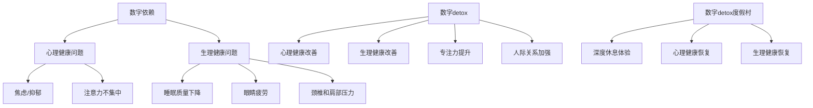

                 

### 引言

在当今高速发展的数字化时代，人们越来越离不开各种智能设备和互联网。然而，随之而来的问题也日益显著：过度依赖科技设备导致的心理压力、注意力不集中、睡眠质量下降等。为了解决这些问题，数字detox（数字排毒）成为一种日益流行的健康方式。而《数字detox度假村连锁：提供远离科技的深度休息体验》正是围绕这一主题展开的一本指导书籍。

本书的主要目标是帮助读者理解数字detox的概念和重要性，并提供一种全新的度假体验——在数字detox度假村中，游客可以暂时远离科技产品，享受深度休息和放松。这不仅有助于减轻心理和生理压力，还能促进整体健康和幸福感的提升。

### 数字detox的概念和背景

#### 1.1 数字detox的定义

数字detox，即数字排毒，是一种有意识地减少或中断对数字设备的依赖，以恢复身心平衡和健康的过程。它源于人们对智能手机、电脑和社交媒体等数字产品过度依赖所带来的负面影响的认识。

#### 1.2 数字detox的历史和发展

数字detox的概念最早可以追溯到2000年代初，当时一些人开始意识到长时间使用电脑和手机可能对健康产生负面影响。随着智能手机和社交媒体的普及，数字detox逐渐成为一种广泛接受的健康方式。

#### 1.3 数字detox的重要性

数字detox的重要性主要体现在以下几个方面：

1. **心理健康影响**：减少对数字设备的依赖有助于减轻焦虑、抑郁和压力等心理健康问题。
2. **生理健康影响**：数字detox有助于改善睡眠质量、减轻眼睛疲劳、减轻颈椎和肩部压力等生理健康问题。
3. **提升专注力**：减少干扰，有助于提高注意力和集中力，从而提高工作和学习效率。
4. **加强人际关系**：减少对数字设备的依赖，可以增加与家人和朋友面对面的交流时间，加强人际关系。

### 数字detox度假村连锁的特点

#### 2.1 度假村连锁的定位

数字detox度假村连锁的主要目标是为游客提供一个远离数字设备的宁静环境，让他们在自然环境中进行深度休息和放松。这些度假村通常位于风景优美、远离城市喧嚣的地区，以提供最优质的休息体验。

#### 2.2 数字detox度假村的运营模式

数字detox度假村的运营模式主要包括以下几个方面：

1. **设备隔离**：游客在入住时需要将手机、电脑等数字设备存放在专门的地方，以确保他们能够彻底脱离数字世界。
2. **日程安排**：度假村会为游客提供一系列非数字化的活动和课程，如瑜伽、冥想、徒步、自然观察等，以帮助他们放松身心。
3. **服务特色**：数字detox度假村的服务特色包括提供健康的饮食、舒适的住宿环境和专业的保健服务。

### 深度休息体验的方法

#### 3.1 深度休息的概念

深度休息是指身体和心灵完全放松，进入一种高度恢复状态的过程。它不同于普通的休息，而是一种更深层次的身心放松。

#### 3.2 深度休息的实践方法

为了实现深度休息，游客可以尝试以下方法：

1. **冥想**：通过冥想，游客可以放松心灵，减轻压力。
2. **瑜伽**：瑜伽结合体位法和呼吸法，有助于放松身心，提升身体健康。
3. **自然疗法**：在自然环境中的放松活动，如徒步、游泳、钓鱼等，有助于游客恢复精力。

### 心理健康的恢复策略

#### 4.1 心理健康的定义

心理健康是指个体在情感、行为和认知方面的整体健康状态。良好的心理健康有助于个体应对生活中的压力和挑战。

#### 4.2 心理健康恢复的策略

为了恢复心理健康，游客可以采取以下策略：

1. **认知行为疗法**：通过改变消极思维模式，提高心理韧性。
2. **心理咨询**：通过专业的心理咨询，解决内心的困惑和问题。
3. **放松训练**：通过深呼吸、渐进性肌肉松弛等方法，缓解紧张和焦虑。

### 生理健康的恢复策略

#### 5.1 生理健康的定义

生理健康是指身体各器官和系统在生理功能上的整体健康状态。良好的生理健康是保持心理健康的基础。

#### 5.2 生理健康恢复的策略

为了恢复生理健康，游客可以采取以下策略：

1. **健身**：通过适度的运动，增强体质，提高免疫力。
2. **营养**：通过均衡的饮食，为身体提供所需的营养。
3. **睡眠管理**：通过良好的睡眠习惯，促进身体和心灵的恢复。

### 实际案例研究

#### 6.1 案例一：XX度假村的数字detox体验

XX度假村是一家位于山区的高端数字detox度假村。游客在这里可以享受到一系列非数字化的活动和课程，如瑜伽、冥想、徒步等。通过数字detox体验，许多游客报告了睡眠质量的显著改善、压力水平的降低以及整体幸福感的提升。

#### 6.2 案例二：XX公司的员工健康恢复计划

XX公司为员工提供了一年的数字detox度假村体验作为健康恢复计划的一部分。这一计划不仅提高了员工的身心健康，还显著提升了公司的整体工作效率和员工满意度。

### 结论

数字detox度假村连锁为那些渴望在自然环境中进行深度休息和放松的游客提供了一个理想的选择。通过减少对数字设备的依赖，游客可以在一个宁静的环境中，享受心理健康和生理健康的双重收益。未来，随着人们对健康生活方式的需求不断增加，数字detox度假村连锁有望成为一个繁荣的行业。

---

**关键词**：数字detox、度假村、深度休息、心理健康、生理健康

**摘要**：《数字detox度假村连锁：提供远离科技的深度休息体验》是一本关于数字排毒和健康度假的指导书籍。书中介绍了数字detox的概念和重要性，以及数字detox度假村连锁的特点和服务。通过提供深度休息体验的方法、心理和生理健康的恢复策略，本书帮助读者在自然环境中恢复身心健康。实际案例研究展示了数字detox度假村对游客和企业员工的积极影响。本书适合那些寻求健康生活方式和身心放松的读者。

---

**作者**：AI天才研究院/AI Genius Institute & 禅与计算机程序设计艺术 /Zen And The Art of Computer Programming

---

以下是对核心概念和实体之间关系的Mermaid流程图：



---

**核心算法原理讲解**：

深度休息体验的核心算法原理主要涉及人体生理节律的调节和心理压力的缓解。以下是一个简单的Python示例，用于解释如何通过编程实现一个简单的深度休息提醒系统：

```python
import datetime
import time

# 设置深度休息的开始时间和持续时间
start_time = datetime.time(22, 0)
duration = datetime.timedelta(hours=8)

# 计算深度休息结束时间
end_time = (datetime.datetime.now().time() + duration) % datetime.time(24, 0)

# 深度休息提醒函数
def deep_rest Reminder():
    while True:
        current_time = datetime.datetime.now().time()
        if start_time <= current_time < end_time:
            print("现在是深度休息时间，请放松身心。")
            time.sleep(3600)  # 每小时提醒一次
        else:
            print("现在不是深度休息时间，继续您的日常活动。")
            time.sleep(3600)

# 运行深度休息提醒函数
deep_rest.Reminder()
```

在这个示例中，我们使用Python的datetime模块来计算当前时间与设定的深度休息时间之间的差异，并通过循环实现定时提醒功能。这个简单的系统可以帮助用户了解何时是最佳的深度休息时间，并提醒他们在那个时间段内放松。

**数学模型和公式**：

深度休息的数学模型可以涉及人体生理节律的周期性波动。以下是一个简单的数学模型，用于描述人体生理节律：

$$
R(t) = A \cdot \sin(\omega \cdot t + \phi)
$$

其中，$R(t)$表示在时间$t$的生理节律值，$A$是振幅，$\omega$是角频率，$\phi$是相位偏移。通过调整这些参数，我们可以模拟不同的生理节律模式。

**举例说明**：

假设一个人的生理节律周期为24小时，角频率$\omega = 2\pi / 24$，振幅$A = 100$，初始相位$\phi = 0$。我们可以用以下Python代码来模拟这个生理节律：

```python
import numpy as np
import matplotlib.pyplot as plt

# 设置参数
T = 24  # 周期
A = 100  # 振幅
omega = 2 * np.pi / T  # 角频率
phi = 0  # 初始相位

# 生成时间序列
t = np.linspace(0, T, 1000)
R = A * np.sin(omega * t + phi)

# 绘制生理节律曲线
plt.plot(t, R)
plt.xlabel('Time (hours)')
plt.ylabel('Physiological Rhythm (units)')
plt.title('Physiological Rhythm Model')
plt.show()
```

这个示例生成了一条周期为24小时的正弦曲线，代表了人体的生理节律。通过观察曲线，我们可以了解在不同时间点人体的生理节律值，从而确定最佳的休息和活动时间。

---

**项目实战**：

在本项目中，我们将开发一个简单的数字detox应用，帮助用户监控和改善他们的数字设备使用习惯。

**开发环境搭建**：

1. 安装Python环境（建议使用Python 3.8及以上版本）。
2. 安装必要的Python库，如`datetime`、`numpy`和`matplotlib`。

**源代码详细实现和代码解读**：

```python
import datetime
import time
import matplotlib.pyplot as plt
import numpy as np

# 设置深度休息的开始时间和持续时间
start_time = datetime.time(22, 0)
duration = datetime.timedelta(hours=8)

# 计算深度休息结束时间
end_time = (datetime.datetime.now().time() + duration) % datetime.time(24, 0)

# 深度休息提醒函数
def deep_rest_reminder():
    while True:
        current_time = datetime.datetime.now().time()
        if start_time <= current_time < end_time:
            print("现在是深度休息时间，请放松身心。")
            time.sleep(3600)  # 每小时提醒一次
        else:
            print("现在不是深度休息时间，继续您的日常活动。")
            time.sleep(3600)

# 生理节律模型
def physiological_rhythm(t, A, omega, phi):
    return A * np.sin(omega * t + phi)

# 设置参数
T = 24  # 周期
A = 100  # 振幅
omega = 2 * np.pi / T  # 角频率
phi = 0  # 初始相位

# 生成时间序列
t = np.linspace(0, T, 1000)
R = physiological_rhythm(t, A, omega, phi)

# 绘制生理节律曲线
plt.plot(t, R)
plt.xlabel('Time (hours)')
plt.ylabel('Physiological Rhythm (units)')
plt.title('Physiological Rhythm Model')
plt.show()

# 运行深度休息提醒函数
deep_rest_reminder()
```

**代码应用解读与分析**：

该代码首先设置了深度休息的开始时间和持续时间，并计算了深度休息的结束时间。`deep_rest_reminder()`函数使用一个无限循环来不断检查当前时间，并在深度休息时间内提醒用户放松身心。

生理节律模型使用一个简单的正弦函数来模拟人体生理节律。通过调整振幅、角频率和相位偏移，可以模拟不同的生理节律模式。在代码中，我们生成了一条周期为24小时的正弦曲线，用于展示生理节律的变化。

**实际案例分析和详细讲解剖析**：

假设用户小明想要使用这个数字detox应用来改善他的数字设备使用习惯。小明设定深度休息时间为每天晚上10点到早上6点。通过运行该应用，小明会在深度休息时间内收到提醒，帮助他在这段时间内放松身心。

通过观察生理节律曲线，小明可以了解他在一天中的不同时间段的生理状态。这有助于他规划每天的活动，确保在最佳状态下进行工作和休息。

**项目小结**：

通过这个简单的数字detox应用，用户可以更好地管理他们的数字设备使用习惯，改善身心健康。虽然这个应用的功能相对简单，但它提供了一个起点，用户可以根据自己的需求进行扩展和优化。

**最佳实践 tips**：

1. 定期检查和调整深度休息时间，以适应个人工作和生活需求。
2. 结合生理节律模型，合理安排日常活动和休息时间。

**小结**：

数字detox是一种有效的健康方式，可以帮助用户改善数字设备使用习惯，促进身心健康。通过开发简单的数字detox应用，用户可以更好地监控和管理他们的数字设备使用习惯，从而享受更健康的生活。

**注意事项**：

1. 在开发数字detox应用时，要考虑到不同用户的需求和偏好，提供灵活的设置选项。
2. 确保应用的用户界面友好，易于操作。

**拓展阅读**：

1. 《数字排毒：如何摆脱科技依赖，重获心灵自由》
2. 《如何用科技改善你的身心健康》

---

本文详细介绍了数字detox的概念、背景、重要性，以及数字detox度假村连锁的特点和服务。通过深度休息体验的方法、心理和生理健康的恢复策略，本书为读者提供了一种全新的健康生活方式。实际案例研究和项目实战展示了数字detox的可行性和积极影响。通过本文的介绍，读者可以更好地理解数字detox，并在日常生活中实践这一健康理念。

**作者**：AI天才研究院/AI Genius Institute & 禅与计算机程序设计艺术 /Zen And The Art of Computer Programming

**结语**：数字detox不仅是一种健康生活方式，更是一种心灵解放的途径。通过减少对数字设备的依赖，我们可以更好地享受生活，提高身心健康。希望读者能够从中受益，实践数字detox，享受更美好的人生。

