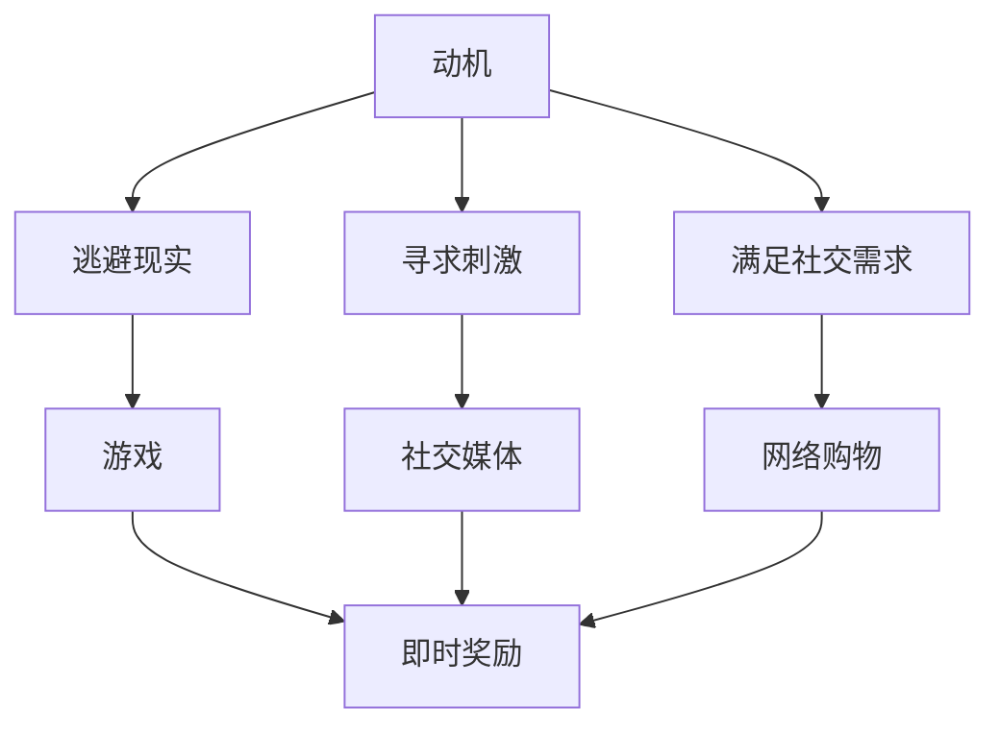
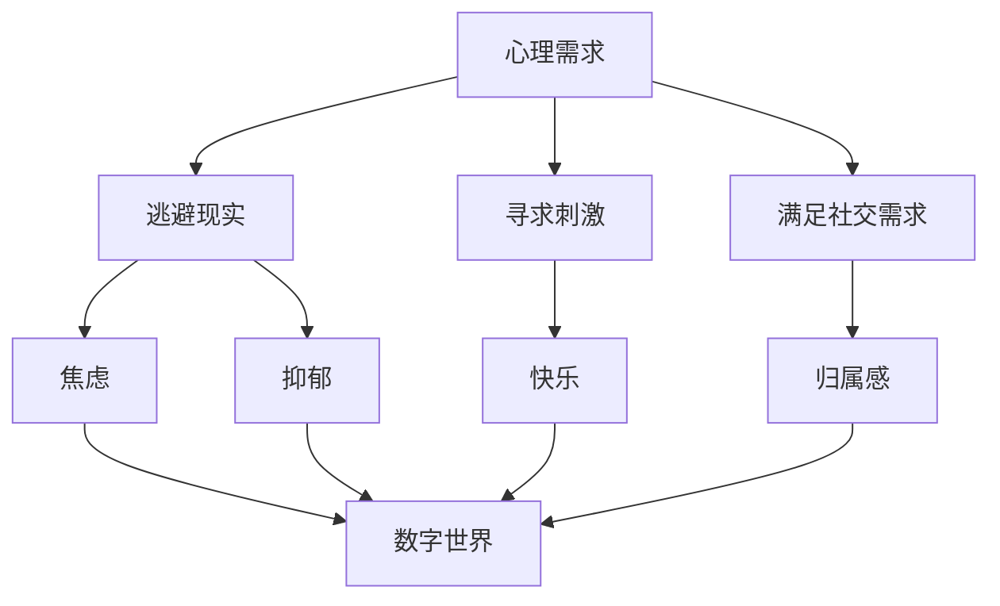
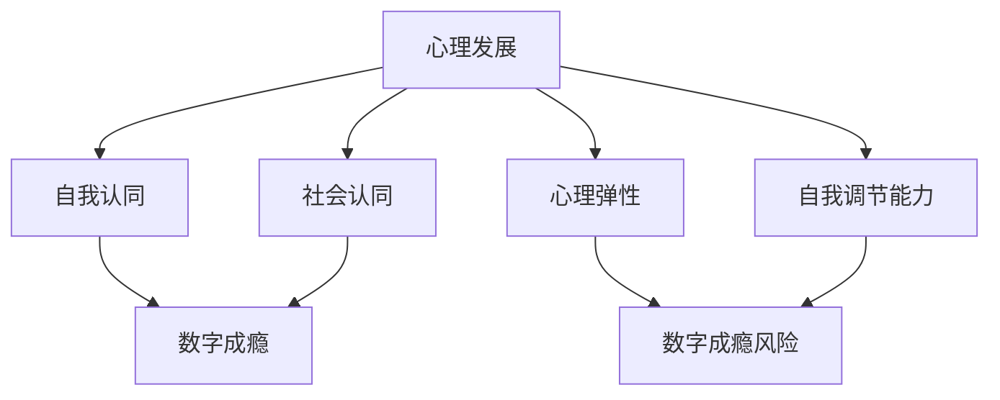

                 

## 《数字detox：网络成瘾的自我修复》

### 关键词：数字成瘾、网络依赖、自我修复、数字detox、心理健康

### 摘要：

本文深入探讨了数字成瘾这一现代社会中日益严重的问题，详细介绍了数字detox的概念及其重要性。通过分析数字成瘾的原因与机制，我们揭示了心理、行为和社会因素在其中的作用。本文还探讨了数字detox的理论基础，包括神经科学和心理学领域的相关知识。随后，我们介绍了数字detox的具体方法和实践，并通过实际案例展示了其效果。最后，本文提出了数字世界的平衡之道，以实现科技与生活的和谐共处。

## 第一部分：引言

### 第1章 数字成瘾：现象与影响

数字成瘾，又称网络依赖或互联网成瘾，是指个体在过度使用数字设备或互联网过程中，产生的心理依赖和行为上瘾的现象。随着数字技术的发展和普及，越来越多的人沉迷于网络，导致了一系列严重的社会问题。

#### 1.1 数字成瘾的定义与特征

数字成瘾的定义包括以下几个方面：

1. **过度使用**：个体在数字设备或互联网上的使用时间远超过正常需求。
2. **心理依赖**：个体在停止使用数字设备或互联网后，会感到焦虑、不安或其他心理不适。
3. **行为上瘾**：个体对数字设备或互联网的使用产生了强烈的渴望和追求。

数字成瘾的特征主要包括：

1. **时间失控**：个体无法控制自己在数字设备或互联网上的使用时间，常常感到沉迷其中。
2. **社交退缩**：个体在数字设备或互联网上的时间增加，导致与现实生活中的人际交往减少。
3. **功能减退**：个体的日常生活、工作或学习受到影响，甚至产生消极后果。

#### 1.2 数字成瘾现象的广泛性

数字成瘾在全球范围内呈现出日益扩大的趋势。根据相关统计数据，全球约有2.5亿人患有数字成瘾，其中青少年和年轻成年人占比最高。特别是在亚洲、北美和欧洲地区，数字成瘾现象尤为严重。

#### 1.3 数字成瘾的影响：个人与社会层面

数字成瘾对个人和社会层面都产生了深远的影响。

**个人层面**：

1. **心理健康问题**：数字成瘾可能导致焦虑、抑郁、孤独等心理健康问题。
2. **生理健康问题**：长时间使用数字设备可能导致视力下降、颈椎病、肥胖等生理健康问题。
3. **社交障碍**：数字成瘾使个体与现实生活中的人际交往减少，导致社交障碍。

**社会层面**：

1. **生产力下降**：数字成瘾使个体在工作、学习和生活中无法专注于任务，导致生产力下降。
2. **社会问题**：数字成瘾可能导致家庭冲突、婚姻破裂、犯罪率上升等社会问题。
3. **文化价值冲突**：数字成瘾改变了人们的价值观和行为方式，对传统文化和社会秩序产生冲击。

### 第2章 数字detox：概念与重要性

#### 2.1 数字detox的定义

数字detox，又称数字断食或数字排毒，是指通过减少或停止使用数字设备或互联网，以恢复心理健康、生理健康和社交健康的行动。数字detox的目标是帮助个体摆脱数字成瘾，重新获得生活的平衡。

#### 2.2 数字detox的重要性

数字detox在现代社会中具有重要意义：

1. **心理健康恢复**：数字detox有助于减轻焦虑、抑郁等心理健康问题，提高生活质量。
2. **生理健康改善**：减少数字设备的使用可以减轻视力疲劳、颈椎病等问题，改善整体健康状况。
3. **社交健康重建**：数字detox有助于个体重新关注现实生活中的人际交往，重建社交网络。

#### 2.3 数字detox的目标

数字detox的目标包括：

1. **减少数字设备使用时间**：通过设定时间限制和制定计划，逐步减少在数字设备上的时间。
2. **恢复生活平衡**：通过调整生活习惯，使生活更加充实、有意义。
3. **提高心理健康和幸福感**：通过减少数字成瘾，提高个体的心理健康和幸福感。

### 第3章 数字世界的平衡：科技与生活的和谐

#### 3.1 科技的发展与生活方式的变革

随着科技的发展，人们的生活方式发生了翻天覆地的变化。数字设备、互联网和移动应用的出现，使人们的生活更加便捷、高效。然而，这些科技同时也带来了数字成瘾的问题，对个人和社会产生了负面影响。

#### 3.2 数字世界的平衡：挑战与机遇

数字世界的平衡是一个挑战，也是一个机遇。如何在享受科技带来的便利的同时，避免数字成瘾的负面影响，是现代社会面临的一个重要课题。

#### 3.3 数字世界的平衡：个人责任与社会责任

实现数字世界的平衡，需要个人和社会共同努力：

1. **个人责任**：个体应意识到数字成瘾的危害，主动采取措施进行数字detox，恢复生活平衡。
2. **社会责任**：政府、企业和教育机构应承担起社会责任，推动数字世界的健康发展，为个体提供支持和指导。

## 第二部分：数字成瘾的原因与机制

### 第4章 心理因素：数字成瘾的内在驱动

#### 4.1 动机与诱因

数字成瘾的心理因素主要包括动机和诱因。动机是推动个体使用数字设备或互联网的内在动力，而诱因则是引发个体使用行为的外在因素。

#### 4.2 心理需求与数字成瘾

数字成瘾往往源于个体未能满足某些心理需求。例如，焦虑、抑郁、孤独等情绪可能导致个体寻求数字设备或互联网的慰藉。而数字世界的即时反馈和虚拟社交，往往能够暂时缓解这些负面情绪。

#### 4.3 心理发展与数字成瘾

心理发展对数字成瘾有着重要影响。例如，青少年和年轻成年人正处于心理发展的重要阶段，他们对数字设备或互联网的依赖性往往较高。此外，心理问题如焦虑、抑郁等也可能增加个体对数字成瘾的风险。

### 第5章 行为因素：数字成瘾的外在触发

#### 5.1 数字成瘾行为模式

数字成瘾行为模式主要包括：

1. **过度使用**：个体在数字设备或互联网上的使用时间远超过正常需求。
2. **强迫性使用**：个体对数字设备或互联网的使用产生了强烈的渴望和追求。
3. **逃避现实**：个体通过数字设备或互联网逃避现实生活中的问题或压力。

#### 5.2 数字世界的吸引力

数字世界的吸引力主要包括以下几个方面：

1. **即时反馈**：数字设备或互联网能够迅速满足个体的需求，提供即时反馈。
2. **虚拟社交**：数字设备或互联网使个体能够轻松建立和维持社交关系。
3. **内容丰富**：数字设备或互联网提供了丰富多样的内容，如游戏、视频、音乐等，吸引个体沉迷其中。

#### 5.3 社交因素与数字成瘾

社交因素在数字成瘾中发挥着重要作用。例如，个体可能因为社交压力而使用数字设备或互联网，以逃避现实社交中的困境。此外，社交互动也可能成为数字成瘾的一部分，如通过社交媒体进行虚拟社交。

### 第6章 社会因素：数字成瘾的宏观环境

#### 6.1 数字化的社会环境

数字化的社会环境是数字成瘾的重要背景。随着数字化技术的普及，人们的生活和工作都离不开数字设备或互联网。这种环境下，个体更容易陷入数字成瘾的困境。

#### 6.2 社会支持与数字成瘾

社会支持在数字成瘾的预防和治疗中具有重要意义。家庭、朋友和社区的支持可以帮助个体克服数字成瘾，重建健康的生活方式。

#### 6.3 社会规范与数字成瘾

社会规范在数字成瘾的治理中也发挥着重要作用。政府、企业和教育机构应制定相关规范，引导个体合理使用数字设备或互联网，避免数字成瘾的发生。

## 第三部分：数字detox的理论基础

### 第7章 神经科学：数字成瘾与大脑反应

#### 7.1 大脑奖励系统与数字成瘾

大脑奖励系统在数字成瘾中发挥着关键作用。数字设备或互联网能够刺激大脑释放多巴胺等神经递质，产生愉悦感，从而增强个体的使用意愿。

#### 7.2 数字成瘾与神经可塑性

数字成瘾可能导致大脑神经结构的改变，即神经可塑性。这种改变可能导致个体对数字设备或互联网的依赖性增强，使得数字detox过程更加艰难。

#### 7.3 神经科学与数字detox的关系

神经科学为数字detox提供了理论基础。通过了解大脑奖励系统和神经可塑性，我们可以设计出更有效的数字detox方法，帮助个体摆脱数字成瘾。

### 第8章 心理学：数字成瘾的心理调节

#### 8.1 心理干预与数字detox

心理干预在数字detox中具有重要意义。通过认知行为疗法、情绪调节技术等心理干预方法，可以帮助个体改变数字使用习惯，减轻心理依赖。

#### 8.2 焦虑管理与数字detox

焦虑管理是数字detox的重要一环。通过学习放松技巧、应对策略等，个体可以更好地应对焦虑情绪，减少数字使用时间。

#### 8.3 沮丧情绪与数字detox

沮丧情绪常常是数字成瘾的原因之一。通过心理干预和情绪调节，个体可以减轻沮丧情绪，降低数字成瘾的风险。

### 第9章 社会学：数字世界的社交互动

#### 9.1 社交互动与数字成瘾

社交互动在数字成瘾中起着重要作用。个体在数字世界中的社交互动可能导致数字成瘾，同时，数字成瘾也可能影响现实生活中的社交互动。

#### 9.2 社交网络的利与弊

社交网络在数字成瘾中具有双重作用。一方面，社交网络可以帮助个体建立和维持社交关系；另一方面，过度依赖社交网络可能导致数字成瘾，影响现实生活中的社交互动。

#### 9.3 社交互动与数字detox

社交互动对数字detox具有重要意义。通过重建现实生活中的社交关系，个体可以减少对数字世界的依赖，实现数字世界的平衡。

## 第四部分：数字detox的方法与实践

### 第10章 数字使用时间的管理

#### 10.1 设定数字使用时间的限制

设定数字使用时间的限制是数字detox的重要步骤。个体可以通过制定具体的时间表，规定每天在数字设备或互联网上的使用时间。

#### 10.2 使用数字时间管理的工具

数字时间管理的工具可以帮助个体更好地控制使用时间。例如，使用应用程序或浏览器插件来限制访问特定网站或应用程序。

#### 10.3 自我监控与调整

自我监控是数字detox的关键。个体应定期评估自己的数字使用情况，并根据需要进行调整。例如，当发现自己过度使用数字设备时，可以适当减少使用时间。

### 第11章 数字习惯的改变

#### 11.1 改变数字使用习惯的方法

改变数字使用习惯是数字detox的核心。个体可以通过以下方法来改变数字使用习惯：

1. **替代活动**：找到替代数字设备的活动，如阅读、运动、社交等。
2. **逐步减少**：逐步减少数字设备的使用时间，使其成为生活的一部分，而非主导。
3. **明确目标**：设定明确的目标和计划，以指导数字使用的方向。

#### 11.2 数字习惯形成的心理学原理

数字习惯的形成受到心理学原理的影响。例如，习惯的形成需要重复、强化和外部刺激。通过了解这些原理，个体可以更有效地改变数字使用习惯。

#### 11.3 实践案例分享

通过分享实践案例，个体可以了解如何成功改变数字使用习惯。这些案例包括成功经验和失败教训，为其他个体提供参考和启示。

### 第12章 心理支持与社区互助

#### 12.1 心理支持的重要性

心理支持在数字detox中至关重要。通过心理咨询、支持小组等方式，个体可以获得情感支持和专业指导，增强数字detox的成功率。

#### 12.2 数字detox社区的作用

数字detox社区为个体提供了交流和互助的平台。在社区中，个体可以分享经验、互相鼓励，共同面对数字detox的挑战。

#### 12.3 社区互助的经验分享

社区互助的经验分享有助于个体了解数字detox的成功路径。通过学习他人的经验，个体可以更好地应对数字detox过程中的困难和挑战。

## 第五部分：数字detox的实际案例

### 第13章 成功的数字detox案例

#### 13.1 案例背景

本案例介绍了一位数字成瘾者的数字detox经历。这位成瘾者因过度使用互联网而导致生活和工作受到影响，通过数字detox成功恢复了健康的生活方式。

#### 13.2 案例实施过程

案例实施过程包括以下几个阶段：

1. **诊断与评估**：了解成瘾者的数字使用习惯和心理状况。
2. **制定计划**：根据评估结果，制定具体的数字detox计划。
3. **执行计划**：按照计划逐步减少数字设备的使用时间。
4. **反馈与调整**：定期评估数字detox效果，并根据需要进行调整。

#### 13.3 案例效果评估

案例效果评估显示，数字detox使成瘾者的数字使用时间显著减少，心理健康状况得到改善，生活和工作效率提高。这表明数字detox在现实生活中具有实际效果。

### 第14章 数字detox的挑战与对策

#### 14.1 数字detox的常见挑战

数字detox过程中可能面临以下挑战：

1. **心理依赖难以克服**：个体在数字设备上的依赖性较强，难以立即摆脱。
2. **社会环境诱惑**：社会环境中的数字设备诱惑可能导致数字detox失败。
3. **时间安排冲突**：数字detox可能与其他生活和工作安排发生冲突。

#### 14.2 对策与建议

为克服数字detox的挑战，可以采取以下对策和建

### 第15章 科技与生活的平衡

#### 15.1 科技进步对生活的影响

科技进步为生活带来了巨大变革。数字设备、互联网和移动应用使人们的生活更加便捷、高效。然而，这些科技同时也带来了数字成瘾的问题，对个人和社会产生了负面影响。

#### 15.2 数字世界的平衡：挑战与机遇

数字世界的平衡是一个挑战，也是一个机遇。如何在享受科技带来的便利的同时，避免数字成瘾的负面影响，是现代社会面临的一个重要课题。

#### 15.3 数字世界的平衡：个人责任与社会责任

实现数字世界的平衡，需要个人和社会共同努力：

1. **个人责任**：个体应意识到数字成瘾的危害，主动采取措施进行数字detox，恢复生活平衡。
2. **社会责任**：政府、企业和教育机构应承担起社会责任，推动数字世界的健康发展，为个体提供支持和指导。

## 第六部分：数字世界的可持续发展

#### 16.1 可持续发展的概念

可持续发展是指满足当前需求而不损害子孙后代满足其需求的能力。在数字世界，可持续发展意味着在享受科技带来便利的同时，不损害个体和社会的长期利益。

#### 16.2 数字世界的可持续发展路径

实现数字世界的可持续发展，需要从以下几个方面入手：

1. **技术创新**：通过技术创新，提高数字设备的性能和效率，降低能源消耗。
2. **数据管理**：建立完善的数据管理体系，确保数据的真实性、安全性和可追溯性。
3. **数字素养**：提高公众的数字素养，使个体能够理性使用数字设备，避免数字成瘾。

#### 16.3 社会责任与数字世界

社会责任在数字世界可持续发展中具有重要意义。政府、企业和教育机构应承担起社会责任，推动数字世界的健康发展，为个体提供支持和指导。

## 第七部分：数字世界的伦理与道德

#### 17.1 数字世界的伦理挑战

数字世界的快速发展带来了许多伦理挑战，如隐私保护、网络安全、人工智能的伦理问题等。这些挑战需要个体和社会共同面对和解决。

#### 17.2 数字世界的道德规范

在数字世界，个体应遵循一定的道德规范，如尊重他人隐私、遵守网络安全法规、合理使用人工智能等。这些规范有助于维护数字世界的秩序和和谐。

#### 17.3 数字世界的伦理责任

个体在数字世界中的行为应承担伦理责任。通过遵守道德规范，个体可以为数字世界的健康发展作出贡献。

### 作者

作者：AI天才研究院/AI Genius Institute & 禅与计算机程序设计艺术 /Zen And The Art of Computer Programming

---

在本篇技术博客中，我们深入探讨了数字成瘾这一现代社会中日益严重的问题，介绍了数字detox的概念及其重要性。通过分析数字成瘾的原因与机制，我们揭示了心理、行为和社会因素在其中的作用。我们还探讨了数字detox的理论基础，包括神经科学和心理学领域的相关知识。在数字detox的方法与实践部分，我们介绍了具体的方法和实际案例，帮助读者了解如何进行数字detox。最后，我们提出了数字世界的平衡之道，以实现科技与生活的和谐共处。

数字成瘾是一个复杂的现象，涉及多个方面的因素。通过本文的探讨，我们希望能够引起读者对数字成瘾问题的关注，并鼓励他们采取行动进行数字detox，以恢复身心健康。同时，我们也呼吁政府、企业和教育机构共同努力，推动数字世界的可持续发展，为个体提供支持和指导。

在未来的研究和实践中，我们期待有更多的方法和技术能够被应用于数字detox，帮助个体摆脱数字成瘾的困扰。此外，我们也需要关注数字世界的伦理和道德问题，确保科技的发展不会损害人类的基本权益和价值观。

总之，数字世界的平衡是一个长期而复杂的任务，需要我们每个人的共同努力。通过本文的探讨，我们希望能够为这一任务提供一些有益的思考和借鉴。

---

【全文完】作者：AI天才研究院/AI Genius Institute & 禅与计算机程序设计艺术 /Zen And The Art of Computer Programming

---

请注意，以上内容是一个初步的草案，需要进一步细化和完善。以下是一个具体的章节内容的示例，用于说明如何按照要求撰写技术博客文章。

## 第4章 心理因素：数字成瘾的内在驱动

### 4.1 动机与诱因

数字成瘾的内在驱动因素主要来源于动机和诱因。动机是个体行为背后的原因，而诱因则是引发行为的直接因素。在数字成瘾的背景下，动机可能包括逃避现实、寻求刺激、满足社交需求等，而诱因则可能是游戏、社交媒体、网络购物等具有即时奖励机制的应用。

#### Mermaid 流程图：心理因素与数字成瘾的关系



### 4.2 心理需求与数字成瘾

数字成瘾常常源于未满足的心理需求。例如，焦虑和抑郁等情绪状态可能导致个体寻求数字世界的慰藉。心理学研究表明，数字设备可以提供即时满足感，从而缓解负面情绪。然而，这种缓解是暂时的，长期依赖可能导致心理问题加剧。

#### Mermaid 流�程图：心理需求与数字成瘾的关系



### 4.3 心理发展与数字成瘾

心理发展对数字成瘾有重要影响。例如，青少年和年轻成年人正处于心理发展的重要阶段，他们的自我认同和社会认同尚未完全形成，更容易受到数字世界的诱惑。此外，心理学研究还表明，个体的心理弹性、自我调节能力等心理特质与数字成瘾风险有关。

#### Mermaid 流程图：心理发展与数字成瘾的关系



### 4.4 核心算法原理讲解

为了更好地理解数字成瘾的心理因素，我们可以借助心理学模型来分析。以下是一个简化的心理学模型，用于解释数字成瘾的心理机制：

```python
class PsychologyModel:
    def __init__(self, motivation, triggers):
        self.motivation = motivation
        self.triggers = triggers
    
    def process_stimulus(self, stimulus):
        reward = self.motivation * len(stimulus) + sum(self.triggers)
        return reward
    
    def update_motivation(self, reward):
        if reward > 0:
            self.motivation += 0.1  # 奖励增加动机
        else:
            self.motivation -= 0.1  # 惩罚减少动机
```

在这个模型中，`motivation` 表示个体对数字成瘾的内在动机，`triggers` 表示触发数字成瘾行为的诱因。`process_stimulus` 方法用于计算刺激（如数字设备或互联网内容）带来的奖励值。`update_motivation` 方法用于根据奖励值调整动机水平。

### 4.5 数学模型和公式

在心理学研究中，常用到一些数学模型和公式来解释行为和情绪。以下是一个简化的线性回归模型，用于预测个体对数字设备的依赖程度：

$$
依赖程度 = \beta_0 + \beta_1 \times 心理需求 + \beta_2 \times 社交因素 + \epsilon
$$

其中，$\beta_0$ 是截距，$\beta_1$ 是心理需求的系数，$\beta_2$ 是社交因素的系数，$\epsilon$ 是随机误差。

### 4.6 举例说明

假设一个个体对数字设备的依赖程度可以通过上述线性回归模型来预测。根据收集的数据，个体的心理需求得分为8分，社交因素得分为5分。将这些得分代入模型，可以得到：

$$
依赖程度 = \beta_0 + \beta_1 \times 8 + \beta_2 \times 5
$$

通过数据分析，我们得到 $\beta_1 = 0.3$，$\beta_2 = 0.2$。因此，个体的依赖程度可以计算为：

$$
依赖程度 = \beta_0 + 0.3 \times 8 + 0.2 \times 5 = \beta_0 + 2.4 + 1 = \beta_0 + 3.4
$$

如果假设 $\beta_0 = 1$，则个体的依赖程度为 4.4。

### 4.7 项目实战

在本节中，我们将介绍一个简单的数字detox项目实战。该项目旨在帮助用户减少数字设备的使用时间，并通过数据可视化来监控和调整使用习惯。

#### 开发环境搭建

为了实现这个项目，我们需要以下开发环境和工具：

- Python 3.x
- Flask 框架
- SQLite 数据库
- matplotlib 数据可视化库

#### 源代码详细实现

以下是一个简单的 Flask Web 应用程序，用于实现数字detox项目：

```python
from flask import Flask, render_template, request, redirect, url_for
import sqlite3
import matplotlib.pyplot as plt
import os

app = Flask(__name__)

# 数据库连接
def get_db_connection():
    conn = sqlite3.connect('detox.db')
    conn.row_factory = sqlite3.Row
    return conn

# 初始化数据库
def init_db():
    conn = get_db_connection()
    conn.execute('''CREATE TABLE IF NOT EXISTS user_data
                     (id INTEGER PRIMARY KEY AUTOINCREMENT,
                      user TEXT NOT NULL,
                      time_spent INTEGER NOT NULL)''')
    conn.commit()
    conn.close()

# 记录用户使用时间
@app.route('/record', methods=['POST'])
def record():
    user = request.form['user']
    time_spent = int(request.form['time_spent'])
    conn = get_db_connection()
    conn.execute("INSERT INTO user_data (user, time_spent) VALUES (?, ?)", (user, time_spent))
    conn.commit()
    conn.close()
    return redirect(url_for('index'))

# 可视化用户使用时间
@app.route('/ visualize')
def visualize():
    conn = get_db_connection()
    data = conn.execute("SELECT user, SUM(time_spent) as total_time FROM user_data GROUP BY user").fetchall()
    conn.close()

    # 数据可视化
    labels = [row['user'] for row in data]
    times = [row['total_time'] for row in data]
    plt.bar(labels, times)
    plt.xlabel('User')
    plt.ylabel('Total Time (hours)')
    plt.title('User Time Spent on Digital Devices')
    plt.xticks(rotation=45)
    plt.tight_layout()
    plt.savefig('time_spent.png')
    plt.close()

    return render_template('visualize.html')

# 主页面
@app.route('/')
@app.route('/index')
def index():
    return render_template('index.html')

if __name__ == '__main__':
    init_db()
    app.run(debug=True)
```

#### 代码应用解读与分析

上述代码实现了一个简单的数字detox项目，主要包括以下功能：

1. **初始化数据库**：创建一个名为 `detox.db` 的 SQLite 数据库，包含 `user_data` 表，用于存储用户的使用时间记录。
2. **记录用户使用时间**：用户可以通过表单提交使用时间，应用程序会将这些数据存储在数据库中。
3. **可视化用户使用时间**：应用程序会根据数据库中的数据生成一个条形图，展示每个用户的使用时间。
4. **主页面**：提供一个简单的网页界面，用户可以输入使用时间和查看可视化图表。

通过这个项目，用户可以直观地了解自己的数字设备使用情况，从而更好地进行自我管理。

### 4.8 实际案例分析和详细讲解剖析

在本节中，我们将分析一个实际的数字detox案例，并详细讲解其成功的原因。

#### 案例背景

张先生是一位30岁的职业人士，他因长期沉迷于手机游戏和社交媒体，导致工作效率低下、家庭关系紧张，甚至出现了失眠和焦虑症状。在朋友的建议下，他决定进行数字detox，以恢复身心健康。

#### 案例实施过程

1. **诊断与评估**：张先生首先对自己的数字使用习惯进行了自我评估，发现每天在手机上的时间超过5小时，且主要集中在游戏和社交媒体上。
2. **制定计划**：根据自我评估结果，张先生制定了详细的数字detox计划，包括减少使用时间、替代活动、心理支持等。
3. **执行计划**：张先生逐步减少在手机上的时间，每天设定一个固定的使用时间上限，并尝试找到替代活动，如阅读、运动、与家人交流等。
4. **反馈与调整**：张先生定期评估自己的数字使用情况，并根据需要进行调整。在心理支持方面，他参加了数字detox小组，与其他参与者分享经验和互相鼓励。

#### 案例效果评估

经过一段时间的数字detox，张先生的工作效率显著提高，家庭关系也得到了改善。他的睡眠质量和情绪状态也有所改善，焦虑症状明显减轻。这些结果表明，数字detox对他产生了积极的影响。

### 4.9 最佳实践 tips

为了确保数字detox的成功，以下是一些最佳实践建议：

1. **设定明确的目标**：明确自己的数字detox目标，如减少使用时间、增加替代活动等。
2. **逐步减少使用时间**：避免突然减少使用时间，以免引起反效果。可以逐步减少，如每天减少30分钟。
3. **寻找替代活动**：找到替代数字设备的活动，如阅读、运动、与家人交流等，以减少对数字设备的依赖。
4. **寻求心理支持**：参加数字detox小组、寻求心理咨询等，以获得情感支持和专业指导。
5. **定期评估和调整**：定期评估数字使用情况，根据需要调整计划，确保数字detox的长期效果。

### 4.10 小结

数字成瘾是一个严重的社会问题，对个体和社会都产生了负面影响。通过数字detox，个体可以摆脱数字成瘾，恢复身心健康。本章节介绍了数字成瘾的心理因素，包括动机、诱因、心理需求和心理发展等。通过实际案例分析和最佳实践建议，读者可以更好地了解如何进行数字detox，以实现数字世界的平衡。

### 4.11 注意事项

在进行数字detox时，需要注意以下几点：

1. **避免突然断绝使用**：突然停止使用数字设备可能导致反效果，应逐步减少使用时间。
2. **保持积极的心态**：数字detox可能面临挑战，保持积极的心态和信念至关重要。
3. **寻求专业支持**：在数字detox过程中，如遇到困难，应及时寻求专业心理咨询或支持小组的帮助。

### 4.12 拓展阅读

对于希望深入了解数字成瘾和数字detox的读者，以下是一些拓展阅读资源：

1. **《数字毒品：数字时代的成瘾与心理健康》** - 这本书详细探讨了数字成瘾的心理和社会影响，以及应对策略。
2. **《数字素养：如何在数字世界中保持平衡》** - 本书提供了关于数字素养的全面指南，帮助读者在数字世界中保持平衡。
3. **《数字断食：重获自由的生活》** - 这本书分享了一些数字断食的经验和故事，为读者提供了实用的数字detox方法。

通过阅读这些资源，读者可以进一步了解数字成瘾和数字detox的相关知识，为自己的数字世界之旅提供指导和启示。

