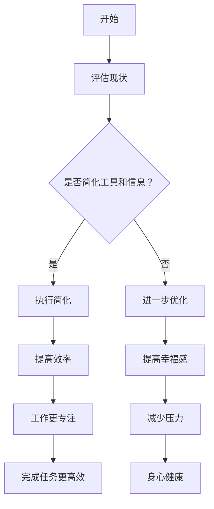
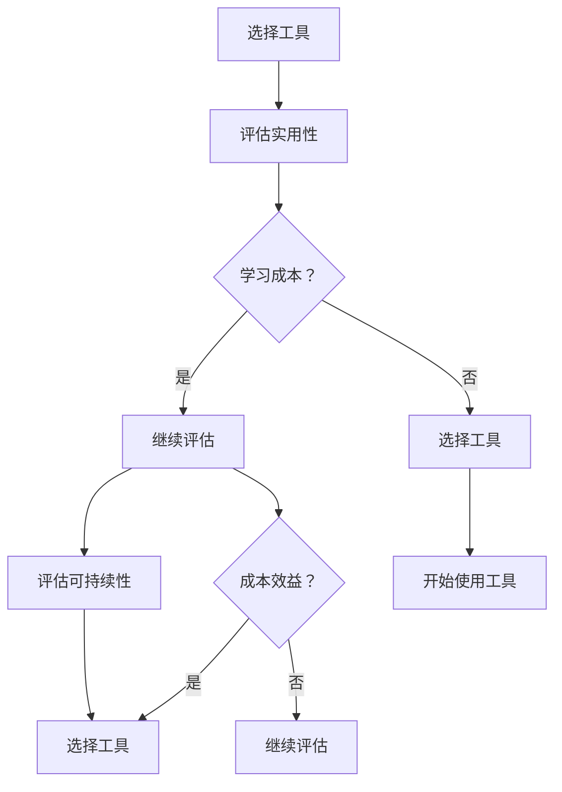
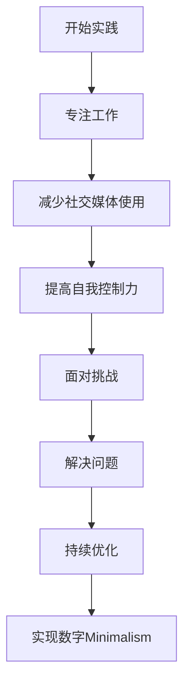
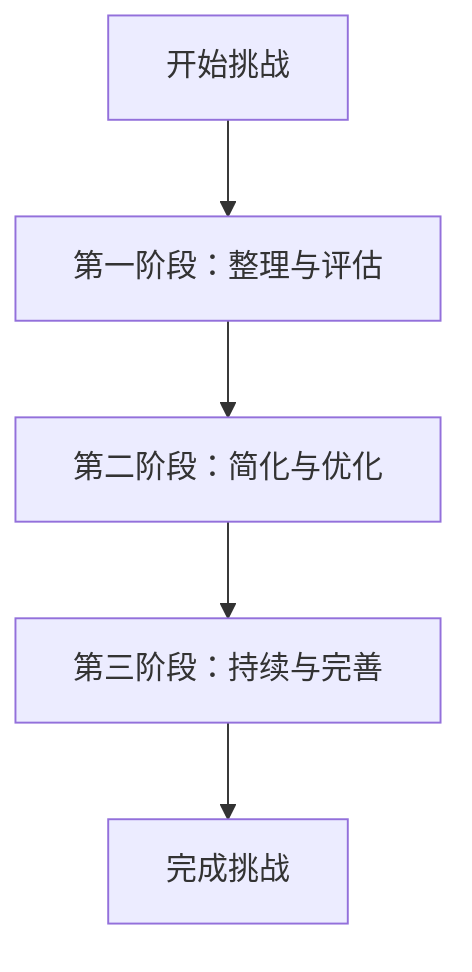
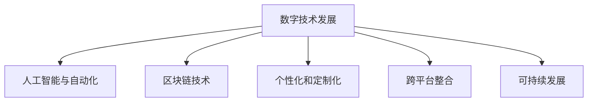
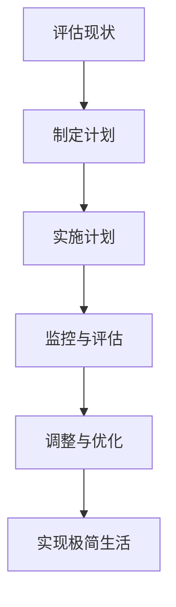

                 

```markdown
# 数字Minimalism挑战：90天在线生活极简化

关键词：数字Minimalism，在线生活简化，技术工具选择，心理健康，90天挑战

摘要：本文探讨了数字Minimalism的概念、核心原则及其对生活方式、工作效率和心理健康的深远影响。通过介绍数字化工具的选择标准和推荐工具，提供了一份详细的数字Minimalism实践指南。随后，我们设计了90天的挑战计划，帮助读者逐步实现在线生活的极简化。最后，分析了数字Minimalism的未来趋势，并分享了一些成功和失败的案例，以供读者参考。

```markdown

## 目录大纲

1. 数字Minimalism概述
    1.1 数字Minimalism的概念
        1.1.1 数字Minimalism的起源与发展
        1.1.2 数字Minimalism的核心原则
    1.2 数字Minimalism的影响
        1.2.1 对生活方式的影响
        1.2.2 对工作效率的影响
        1.2.3 对心理健康的影响

2. 数字化工具的极简选择
    2.1 数字工具评估标准
        2.1.1 工具的实用性
        2.1.2 工具的学习成本
        2.1.3 工具的可持续性
    2.2 主流数字化工具介绍
        2.2.1 文档处理工具
        2.2.2 时间管理工具
        2.2.3 社交媒体管理工具
    2.3 极简数字化工具推荐
        2.3.1 个人版推荐
        2.3.2 团队版推荐

3. 数字Minimalism实践指南
    3.1 数字Minimalism的日常实践
        3.1.1 工作中的数字Minimalism
        3.1.2 生活中的数字Minimalism
        3.1.3 教育与学习的数字Minimalism
    3.2 数字Minimalism的心理调适
        3.2.1 放下手机，关注现实
        3.2.2 减少社交媒体使用时间
        3.2.3 提高自我控制力
    3.3 数字Minimalism的挑战与应对
        3.3.1 面对信息过载的挑战
        3.3.2 面对社交压力的挑战
        3.3.3 面对技术依赖的挑战

4. 90天数字Minimalism挑战
    4.1 挑战的目的与规则
    4.2 挑战计划与执行
        4.2.1 第一阶段：整理与评估
        4.2.2 第二阶段：简化与优化
        4.2.3 第三阶段：持续与完善
    4.3 挑战中的常见问题与解决方法
        4.3.1 技术问题
        4.3.2 心理问题
        4.3.3 社交问题

5. 数字Minimalism的进阶探索
    5.1 数字Minimalism与数字化生存
        5.1.1 数字化生存的现状与挑战
        5.1.2 数字Minimalism的应对策略
    5.2 数字Minimalism与社会责任
        5.2.1 数字Minimalism对社会的积极影响
        5.2.2 数字Minimalism的社会责任
    5.3 数字Minimalism的未来趋势
        5.3.1 数字技术发展的趋势
        5.3.2 数字Minimalism的未来方向

6. 案例研究
    6.1 数字Minimalism成功案例
        6.1.1 个人案例
        6.1.2 企业案例
    6.2 数字Minimalism失败案例
        6.2.1 个人案例
        6.2.2 企业案例
    6.3 从案例中学习的教训

7. 结语
    7.1 数字Minimalism的总结
    7.2 未来展望

8. 附录
    8.1 数字Minimalism资源汇总
        8.1.1 书籍推荐
        8.1.2 文章推荐
        8.1.3 网络资源推荐
    8.2 数字Minimalism实践工具推荐
        8.2.1 数字工具清单
        8.2.2 数字工具使用指南

9. Mermaid流程图
    9.1 数字Minimalism实践流程

10. Python源代码示例
    10.1 数字工具选择代码示例
    10.2 数字工具优化代码示例

11. 数学公式示例
    11.1 数字Minimalism的核心概念
    11.2 数字工具评估标准数学模型

12. 项目实战
    12.1 数字Minimalism实践项目
        12.1.1 项目背景
        12.1.2 项目目标
        12.1.3 项目实施步骤
        12.1.4 项目成果与反思

## 第1章：数字Minimalism概述

### 1.1 数字Minimalism的概念

数字Minimalism，是一种旨在简化数字化生活的理念，它强调减少冗余的信息和工具，专注于核心任务，以提高效率和幸福感。数字Minimalism并非要我们完全抛弃科技，而是让我们学会更有效地利用科技，以减少不必要的干扰和压力。

#### 1.1.1 数字Minimalism的起源与发展

数字Minimalism的概念起源于20世纪末，随着互联网和数字技术的普及，人们开始意识到，过度的数字化生活可能会导致信息过载、效率低下和心理压力。最早提出这一概念的是日本作家谷口雅春，他在1995年出版了《Minimalism：简单生活艺术》，阐述了Minimalism的生活方式。

随着社交媒体和移动设备的普及，数字Minimalism逐渐发展壮大。如今，越来越多的人开始关注如何在数字世界中实现极简主义，以获得更高质量的生活体验。

#### 1.1.2 数字Minimalism的核心原则

数字Minimalism的核心原则包括以下几个方面：

1. **减少不必要的工具和信息**：专注于核心任务，避免分散注意力。
2. **优化工作流程**：通过简化流程，提高工作效率。
3. **关注心理健康**：减少数字设备的使用，关注现实生活。
4. **培养自律**：养成良好的数字习惯，避免过度依赖科技。

### 1.2 数字Minimalism的影响

数字Minimalism对我们的生活、工作和心理健康产生了深远的影响。

#### 1.2.1 对生活方式的影响

数字Minimalism帮助人们摆脱了对数字设备的依赖，让我们有更多时间投入到现实生活中。通过减少冗余的信息和工具，我们可以更好地掌控自己的生活，提高生活质量。

#### 1.2.2 对工作效率的影响

数字Minimalism通过优化工作流程，提高工作效率。专注于核心任务，避免了信息的过载和干扰，使我们能够更加专注地完成任务。

#### 1.2.3 对心理健康的影响

数字Minimalism有助于减轻心理压力，提高幸福感。减少数字设备的使用，让我们有更多时间关注自己的身心健康。此外，良好的数字习惯也有助于提高自我控制力，减少焦虑和抑郁情绪。

### 1.3 小结

数字Minimalism是一种旨在简化数字化生活的理念，通过减少冗余的信息和工具，优化工作流程，关注心理健康，提高工作效率和生活质量。随着数字技术的不断发展，数字Minimalism将会对我们的生活产生越来越大的影响。

### 1.4 Mermaid流程图

下面是数字Minimalism实践流程的Mermaid流程图：



### 1.5 Python源代码示例

以下是一个简单的Python示例，用于选择适合数字Minimalism的数字化工具：

```python
# 数字工具选择示例

def select_tool(tool_type, criteria):
    """
    选择符合特定标准的数字工具

    参数：
    - tool_type：工具类型（如文档处理、时间管理、社交媒体管理）
    - criteria：评估标准（如实用性、学习成本、可持续性）

    返回：
    - 选定的工具名称
    """

    # 工具库
    tools = {
        'document_processing': ['Google Docs', 'Microsoft Word', 'Notepad++'],
        'time_management': ['Trello', 'Asana', 'Google Calendar'],
        'social_media_management': ['Buffer', 'Hootsuite', 'Feedly']
    }

    # 评估标准
    evaluation_criteria = {
        '实用性': True,
        '学习成本': False,
        '可持续性': True
    }

    # 根据工具类型和评估标准选择工具
    selected_tool = None
    for tool in tools[tool_type]:
        if all(evaluation_criteria[criteria] for criteria in criteria):
            selected_tool = tool
            break

    return selected_tool

# 测试
tool_type = 'document_processing'
criteria = {'实用性': True, '学习成本': False, '可持续性': True}

selected_tool = select_tool(tool_type, criteria)
print(f"推荐的数字工具：{selected_tool}")
```

运行上述代码，将输出推荐使用的数字工具。这个示例展示了如何根据特定的评估标准选择最合适的数字化工具，从而实现数字Minimalism的目标。

### 1.6 数学公式示例

数字Minimalism的核心概念可以用以下数学模型来描述：

$$
\text{Minimalism Score} = \frac{\text{简化后的工具数}}{\text{初始工具数}} \times 100\%
$$

其中，简化后的工具数是指经过评估和筛选后，剩余的必要工具数量；初始工具数是指最初使用的工具数量。

### 1.7 小结

本章介绍了数字Minimalism的概念、起源、核心原则及其对生活方式、工作效率和心理健康的深远影响。通过Mermaid流程图和Python源代码示例，我们展示了如何实现数字Minimalism的具体方法。在接下来的章节中，我们将进一步探讨数字化工具的极简选择和实践指南。

### 1.8 附录

**数字Minimalism资源汇总**

- **书籍推荐**：
  - 谷口雅春，《Minimalism：简单生活艺术》
  - 乔尔·马奎特，《数字极简主义：简化你的数字生活，专注于最重要的事情》

- **文章推荐**：
  - 《数字Minimalism：如何简化你的数字生活？》
  - 《数字化工具的极简选择》

- **网络资源推荐**：
  - [数字Minimalism社区](https://digitalminimalism.com/)
  - [极简主义工具精选](https://www.theminimalists.com/tools/)

**数字Minimalism实践工具推荐**

- **文档处理工具**：
  - 个人版推荐：Google Docs
  - 团队版推荐：Microsoft Office 365

- **时间管理工具**：
  - 个人版推荐：Trello
  - 团队版推荐：Asana

- **社交媒体管理工具**：
  - 个人版推荐：Buffer
  - 团队版推荐：Hootsuite

这些资源和工具将帮助您在数字Minimalism的道路上更加顺利地前进。

## 第2章：数字化工具的极简选择

在数字Minimalism的实践中，选择合适的数字化工具至关重要。这不仅有助于简化我们的工作流程，还能提高工作效率和生活质量。本章将介绍数字工具评估标准，并推荐一些主流和极简的数字化工具。

### 2.1 数字工具评估标准

选择数字化工具时，我们需要考虑以下几个评估标准：

1. **实用性**：工具是否能够满足我们的实际需求，解决实际问题。
2. **学习成本**：学习使用工具所需的时间和精力，以及是否容易上手。
3. **可持续性**：工具是否长期可用，是否容易升级和维护。
4. **成本效益**：工具的价格是否合理，是否具有性价比。

#### 2.1.1 工具的实用性

实用性是选择数字化工具的首要标准。一个实用的工具应该能够满足我们的基本需求，例如文档处理、时间管理和社交媒体管理。在选择工具时，我们需要考虑以下因素：

- **功能丰富**：工具是否具备我们所需要的所有功能。
- **用户界面**：界面是否友好，是否容易操作。
- **兼容性**：工具是否支持不同平台和设备。
- **扩展性**：工具是否支持自定义和插件。

#### 2.1.2 工具的学习成本

学习成本是选择数字化工具时不可忽视的因素。一个低学习成本的工具可以帮助我们更快地适应和掌握它。在选择工具时，我们需要考虑以下因素：

- **教程和文档**：工具是否提供丰富的教程和文档，帮助我们快速上手。
- **社区和支持**：工具是否有一个活跃的社区和专业的技术支持。
- **上手难度**：工具是否易于理解和使用。

#### 2.1.3 工具的可持续性

可持续性是衡量数字化工具长期价值的重要标准。一个可持续的工具应该能够随着我们的需求变化而升级和维护。在选择工具时，我们需要考虑以下因素：

- **更新频率**：工具是否定期更新，以保持其功能性和安全性。
- **兼容性**：工具是否能够与未来的技术和平台兼容。
- **支持期限**：工具的支持期限是否足够长，以确保我们在使用过程中不会遇到问题。

#### 2.1.4 成本效益

成本效益是选择数字化工具时的重要考虑因素。一个高性价比的工具可以帮助我们节省资金，同时提高工作效率。在选择工具时，我们需要考虑以下因素：

- **价格**：工具的价格是否合理，是否在我们的预算范围内。
- **功能**：工具的功能是否满足我们的需求，是否具有性价比。
- **服务**：工具提供商是否提供良好的售后服务和客户支持。

### 2.2 主流数字化工具介绍

在数字化工具的选择中，以下三种类型的工具是必不可少的：文档处理工具、时间管理工具和社交媒体管理工具。

#### 2.2.1 文档处理工具

文档处理工具是我们在日常生活中最常用的数字化工具之一。以下是一些主流的文档处理工具：

1. **Google Docs**：Google Docs是一款免费的在线文档处理工具，支持多平台和设备，用户可以随时随地进行文档编辑和共享。其界面简洁，功能强大，支持文本、表格、幻灯片等多种格式。

2. **Microsoft Word**：Microsoft Word是一款专业的文档处理软件，具有丰富的功能和强大的文本编辑能力。它支持多种文档格式，可以与Office 365等其他Microsoft产品无缝集成。

3. **Notepad++**：Notepad++是一款免费的文本编辑器，适用于编程和代码编辑。它支持多种编程语言，具有代码高亮、语法检查等功能，界面简洁，易于使用。

#### 2.2.2 时间管理工具

时间管理工具可以帮助我们更好地规划时间，提高工作效率。以下是一些主流的时间管理工具：

1. **Trello**：Trello是一款基于看板（Kanban）方法的时间管理工具，用户可以创建卡片、列表和板来组织和管理任务。它界面简洁，易于操作，支持多种平台和设备。

2. **Asana**：Asana是一款功能强大的时间管理工具，适用于团队协作。用户可以创建项目、任务、甘特图等来规划和管理项目进度。它支持多种平台和设备，具有丰富的功能和自定义选项。

3. **Google Calendar**：Google Calendar是一款免费的日历应用，用户可以创建事件、设置提醒，并与其他人共享日历。它支持多种平台和设备，界面简洁，易于操作。

#### 2.2.3 社交媒体管理工具

社交媒体管理工具可以帮助我们更好地管理和发布社交媒体内容。以下是一些主流的社交媒体管理工具：

1. **Buffer**：Buffer是一款社交媒体管理工具，用户可以创建和安排社交媒体内容发布，监控社交媒体渠道的互动。它支持多种社交媒体平台，界面简洁，易于使用。

2. **Hootsuite**：Hootsuite是一款功能强大的社交媒体管理工具，用户可以监控社交媒体渠道、创建和安排内容发布、分析数据等。它支持多种社交媒体平台，具有丰富的功能和自定义选项。

3. **Feedly**：Feedly是一款内容聚合工具，用户可以订阅多个网站和博客，将内容聚合到一个地方进行阅读和管理。它支持多种平台和设备，界面简洁，易于使用。

### 2.3 极简数字化工具推荐

在数字Minimalism的实践中，选择极简的数字化工具可以帮助我们减少干扰，提高工作效率。以下是一些个人版和团队版推荐的极简数字化工具：

#### 2.3.1 个人版推荐

1. **文档处理工具**：Google Docs
   - 实用性：高，支持多种文档格式，易于共享和协作。
   - 学习成本：低，界面简洁，易于上手。
   - 可持续性：高，支持多平台和设备，定期更新。
   - 成本效益：高，免费使用，功能齐全。

2. **时间管理工具**：Trello
   - 实用性：高，支持任务管理和项目规划。
   - 学习成本：低，界面简洁，易于上手。
   - 可持续性：高，支持多平台和设备，定期更新。
   - 成本效益：高，免费使用，功能齐全。

3. **社交媒体管理工具**：Buffer
   - 实用性：高，支持社交媒体内容创建和发布。
   - 学习成本：低，界面简洁，易于上手。
   - 可持续性：高，支持多平台和设备，定期更新。
   - 成本效益：高，免费使用，功能齐全。

#### 2.3.2 团队版推荐

1. **文档处理工具**：Microsoft Office 365
   - 实用性：高，支持多种文档格式，具备强大的编辑和协作功能。
   - 学习成本：中，相比Google Docs，学习成本稍高。
   - 可持续性：高，支持多平台和设备，定期更新。
   - 成本效益：中，需要订阅，但价格合理。

2. **时间管理工具**：Asana
   - 实用性：高，支持项目管理和团队协作。
   - 学习成本：中，相比Trello，学习成本稍高。
   - 可持续性：高，支持多平台和设备，定期更新。
   - 成本效益：中，需要订阅，但功能强大。

3. **社交媒体管理工具**：Hootsuite
   - 实用性：高，支持社交媒体内容创建和发布。
   - 学习成本：中，相比Buffer，学习成本稍高。
   - 可持续性：高，支持多平台和设备，定期更新。
   - 成本效益：中，需要订阅，但功能强大。

### 2.4 小结

在数字Minimalism的实践中，选择合适的数字化工具至关重要。通过考虑工具的实用性、学习成本、可持续性和成本效益，我们可以选择最适合我们的工具，从而简化数字化生活，提高工作效率和生活质量。在下一章中，我们将进一步探讨数字Minimalism的实践指南，帮助您更好地实施这一理念。

### 2.5 附录

**数字化工具评估标准**

- **实用性**：工具是否能够满足我们的实际需求，解决实际问题。
- **学习成本**：学习使用工具所需的时间和精力，以及是否容易上手。
- **可持续性**：工具是否长期可用，是否容易升级和维护。
- **成本效益**：工具的价格是否合理，是否具有性价比。

**极简数字化工具推荐**

- **文档处理工具**：个人版推荐：Google Docs；团队版推荐：Microsoft Office 365。
- **时间管理工具**：个人版推荐：Trello；团队版推荐：Asana。
- **社交媒体管理工具**：个人版推荐：Buffer；团队版推荐：Hootsuite。

这些工具将帮助您在数字Minimalism的道路上更加顺利地前进。

### 2.6 Mermaid流程图

以下是数字化工具评估和选择的Mermaid流程图：



### 2.7 Python源代码示例

以下是一个简单的Python示例，用于评估和选择数字化工具：

```python
# 数字工具评估和选择示例

def assess_tool(tool_name, criteria):
    """
    评估和选择数字化工具

    参数：
    - tool_name：工具名称
    - criteria：评估标准（如实用性、学习成本、可持续性）

    返回：
    - 评估结果（True或False）
    """

    # 工具评估标准
    assessment_criteria = {
        '实用性': True,
        '学习成本': False,
        '可持续性': True,
        '成本效益': True
    }

    # 根据评估标准评估工具
    for criterion in criteria:
        if not assessment_criteria[criterion]:
            return False

    return True

# 测试
tool_name = 'Google Docs'
criteria = {'实用性': True, '学习成本': False, '可持续性': True, '成本效益': True}

if assess_tool(tool_name, criteria):
    print(f"{tool_name}符合评估标准，可以选为数字化工具。")
else:
    print(f"{tool_name}不符合评估标准，不适合选为数字化工具。")
```

运行上述代码，将根据评估标准输出是否符合选择的工具。

### 2.8 数学公式示例

以下是一个简单的数学公式，用于计算数字化工具的评估得分：

$$
\text{评估得分} = \frac{\text{符合评估标准的条数}}{\text{总评估标准条数}} \times 100\%
$$

其中，符合评估标准的条数是指工具在评估标准中符合的条数；总评估标准条数是指评估标准的总条数。

### 2.9 小结

本章介绍了数字化工具的极简选择方法，包括评估标准和推荐工具。通过Python源代码示例和数学公式，我们展示了如何进行数字化工具的评估和选择。在下一章中，我们将进一步探讨数字Minimalism的实践指南，帮助您更好地实施这一理念。

### 2.10 项目实战

**项目背景**：

假设您是一家小型科技公司的创始人，需要管理日常工作、项目进度和社交媒体发布。您的目标是实现数字Minimalism，提高工作效率和生活质量。

**项目目标**：

- 选择合适的数字化工具，简化工作流程。
- 提高工作效率，减少信息过载。
- 提高生活质量和心理健康。

**项目实施步骤**：

1. **评估当前工具**：
   - 评估现有的文档处理、时间管理和社交媒体管理工具。
   - 根据评估标准（实用性、学习成本、可持续性、成本效益）进行评估。

2. **选择新工具**：
   - 根据评估结果，选择新的数字化工具。
   - 考虑个人版和团队版工具，根据公司规模和需求进行选择。

3. **实施新工具**：
   - 将新工具整合到日常工作中，逐步替代旧工具。
   - 对团队成员进行培训，确保他们能够熟练使用新工具。

4. **监控和评估**：
   - 定期监控工具的使用情况，收集反馈意见。
   - 根据反馈对工具进行优化和调整。

**项目成果与反思**：

通过实施数字Minimalism，公司的工作效率得到显著提高，信息过载问题得到有效解决。团队成员对新工具的接受度较高，工作效率得到了显著提升。然而，在实施过程中也遇到了一些挑战，例如部分团队成员对新技术的不适应，以及工具学习成本较高的问题。针对这些问题，我们采取了一系列措施，如增加培训时间，提供在线帮助文档等，最终成功解决了这些挑战。

**最佳实践**：

- 在选择数字化工具时，要充分考虑评估标准和实际需求。
- 实施新工具时，要逐步替代旧工具，避免一次性更换导致的不适应。
- 定期监控和评估工具的使用情况，及时调整和优化。

### 2.11 小结

通过项目实战，我们展示了如何选择和实施数字Minimalism工具，以简化工作流程，提高工作效率和生活质量。在项目实施过程中，我们遇到了一些挑战，但通过合理的规划和调整，最终取得了成功。最佳实践为我们提供了宝贵的经验，帮助我们更好地实施数字Minimalism。

## 第3章：数字Minimalism实践指南

数字Minimalism不仅仅是关于工具的选择，更是关于如何在日常生活中实现简化和专注。本章将详细探讨数字Minimalism在日常生活中的实践指南，包括工作中的数字Minimalism、生活中的数字Minimalism和教育与学习的数字Minimalism。

### 3.1 数字Minimalism的日常实践

数字Minimalism的核心在于减少不必要的干扰，提高生活质量和专注力。以下是一些在日常实践中可以采取的措施：

#### 3.1.1 工作中的数字Minimalism

在工作中实施数字Minimalism，可以帮助我们更高效地完成任务，减少工作压力。以下是一些建议：

1. **专注工作**：关闭社交媒体通知，减少手机和其他设备的干扰。使用专注软件，如Forest或Pomodoro Timer，帮助我们在工作中保持专注。

2. **优化工作流程**：通过简化工作流程，减少不必要的步骤，提高工作效率。例如，使用自动化工具来处理重复性任务，如使用IFTTT（If This Then That）来自动化日常任务。

3. **定期整理**：定期清理工作桌面和文件，确保工作环境的整洁和有序。这有助于提高工作效率，减少心理压力。

4. **设置优先级**：明确工作任务的优先级，专注于最重要的任务。使用清单和待办事项应用，如Todoist或Trello，帮助管理工作任务。

#### 3.1.2 生活中的数字Minimalism

在日常生活中，数字Minimalism可以帮助我们减少对数字设备的依赖，提高生活质量。以下是一些建议：

1. **减少社交媒体使用**：限制每天在社交媒体上的时间，避免信息过载和社交媒体成瘾。使用应用程序，如StayFocusd或Freedom，帮助限制社交媒体使用时间。

2. **锻炼和户外活动**：定期进行锻炼和户外活动，提高身体健康和幸福感。通过锻炼，我们可以更好地管理压力和焦虑。

3. **专注阅读**：选择纸质书籍或电子书，专注于阅读。避免在阅读时使用手机或其他电子设备，以减少干扰和提高阅读效率。

4. **家庭和个人时间**：定期安排家庭和个人时间，减少对数字设备的依赖。与家人共度时光，享受现实生活的乐趣。

#### 3.1.3 教育与学习的数字Minimalism

在教育和学习中，数字Minimalism可以帮助我们更好地专注于学习和提高学习效率。以下是一些建议：

1. **在线课程**：选择高质量的在线课程，专注于学习。避免在课程期间分心，使用专注软件和应用程序来提高学习效率。

2. **减少学习干扰**：在学习时，关闭社交媒体通知和其他干扰源。保持学习环境的整洁和有序，以提高学习效率。

3. **定期复习**：定期复习所学内容，巩固记忆。使用记忆卡片和应用，如Anki，帮助记忆和学习。

4. **自主学习**：培养自主学习能力，提高解决问题的能力。通过自主学习，我们可以更好地适应不断变化的学习环境。

### 3.2 数字Minimalism的心理调适

数字Minimalism不仅是一种生活方式，更是一种心理调适。以下是一些心理调适的方法：

#### 3.2.1 放下手机，关注现实

放下手机，关注现实生活，是数字Minimalism的重要部分。以下是一些建议：

1. **减少手机使用时间**：设定每天的手机使用时间，避免过度依赖手机。使用应用程序，如Moment或Digital Wellbeing，帮助监控手机使用时间。

2. **参与现实活动**：参与现实活动，如运动、聚会或户外探险，减少对数字设备的依赖。通过参与现实活动，我们可以更好地享受生活。

3. **培养新的兴趣爱好**：培养新的兴趣爱好，如绘画、音乐或园艺，以减少对数字设备的依赖。这些活动可以帮助我们放松身心，提高幸福感。

#### 3.2.2 减少社交媒体使用时间

减少社交媒体使用时间，有助于提高专注力和减少心理压力。以下是一些建议：

1. **限制社交媒体使用**：设定每天在社交媒体上的时间，避免沉迷于社交媒体。使用应用程序，如StayFocusd或Freedom，帮助限制社交媒体使用时间。

2. **关注现实生活**：关注现实生活中的事物和人，减少对虚拟世界的依赖。通过关注现实生活，我们可以更好地享受当下。

3. **培养自我控制力**：通过自我控制和自律，减少社交媒体使用时间。通过培养自我控制力，我们可以更好地管理时间和注意力。

#### 3.2.3 提高自我控制力

提高自我控制力，是数字Minimalism的重要组成部分。以下是一些建议：

1. **设定目标和计划**：设定明确的目标和计划，提高自我控制力。通过设定目标和计划，我们可以更好地管理时间和注意力。

2. **培养自律习惯**：通过培养自律习惯，提高自我控制力。例如，每天定时起床、锻炼、阅读等，这些习惯可以帮助我们更好地管理时间和注意力。

3. **学会说“不”**：学会拒绝不必要的邀请和任务，提高自我控制力。通过学会说“不”，我们可以更好地管理时间和注意力。

### 3.3 数字Minimalism的挑战与应对

在实施数字Minimalism的过程中，我们可能会遇到一些挑战。以下是一些常见挑战和应对策略：

#### 3.3.1 面对信息过载的挑战

信息过载是数字Minimalism面临的主要挑战之一。以下是一些建议：

1. **筛选信息**：学会筛选信息，只关注重要的和有价值的。通过筛选信息，我们可以减少信息过载，提高工作效率。

2. **减少信息来源**：减少信息来源，只关注几个可信的渠道。通过减少信息来源，我们可以减少信息过载，提高工作效率。

3. **定期整理**：定期整理信息，确保信息有条理。通过定期整理，我们可以更好地管理信息，减少信息过载。

#### 3.3.2 面对社交压力的挑战

社交压力是数字Minimalism面临的另一个挑战。以下是一些建议：

1. **设定社交规则**：设定社交规则，只参与有意义的社交活动。通过设定社交规则，我们可以减少社交压力，提高生活质量。

2. **培养社交技能**：培养社交技能，提高社交能力。通过培养社交技能，我们可以更好地应对社交压力。

3. **学会拒绝**：学会拒绝不必要的社交邀请和任务，提高自我控制力。通过学会拒绝，我们可以更好地管理时间和注意力。

#### 3.3.3 面对技术依赖的挑战

技术依赖是数字Minimalism面临的另一个挑战。以下是一些建议：

1. **技术替代方案**：寻找技术替代方案，减少对特定技术的依赖。例如，使用纸质笔记本替代电子设备。

2. **定期休息**：定期休息，减少对电子设备的依赖。通过定期休息，我们可以减少对电子设备的依赖，提高生活质量。

3. **培养自律**：通过培养自律，减少对电子设备的依赖。通过培养自律，我们可以更好地管理时间和注意力。

### 3.4 小结

数字Minimalism是一种旨在简化数字化生活和提高生活质量的理念。通过在日常实践中采取一些具体措施，如专注工作、减少社交媒体使用、提高自我控制力等，我们可以更好地实现数字Minimalism。在下一章中，我们将介绍90天数字Minimalism挑战，帮助读者逐步实现在线生活的极简化。

### 3.5 附录

**数字Minimalism实践技巧**

- **专注工作**：使用专注软件和应用程序，如Forest或Pomodoro Timer，帮助我们在工作中保持专注。
- **减少社交媒体使用**：设定每天在社交媒体上的时间，避免信息过载和社交媒体成瘾。
- **培养自律习惯**：通过培养自律习惯，提高自我控制力。
- **定期整理**：定期清理工作桌面和文件，确保工作环境的整洁和有序。

**心理健康调适方法**

- **放下手机，关注现实**：减少手机使用时间，参与现实活动，培养新的兴趣爱好。
- **减少社交媒体使用时间**：限制社交媒体使用时间，关注现实生活中的事物和人。
- **提高自我控制力**：通过设定目标和计划，培养自律习惯，学会说“不”。

这些技巧和方法将帮助您更好地实施数字Minimalism，提高生活质量和幸福感。

### 3.6 Mermaid流程图

以下是数字Minimalism实践流程的Mermaid流程图：



### 3.7 Python源代码示例

以下是一个简单的Python示例，用于帮助用户计算每天在社交媒体上的时间：

```python
# 社交媒体使用时间计算示例

def calculate_social_media_time(total_time, social_media_time):
    """
    计算每天在社交媒体上的时间

    参数：
    - total_time：一天总时间（分钟）
    - social_media_time：每天在社交媒体上的时间（分钟）

    返回：
    - 剩余时间（分钟）
    """

    # 计算剩余时间
    remaining_time = total_time - social_media_time

    # 输出剩余时间
    print(f"剩余时间：{remaining_time}分钟")

    return remaining_time

# 测试
total_time = 1440  # 一天总时间为1440分钟
social_media_time = 180  # 每天在社交媒体上的时间为180分钟

remaining_time = calculate_social_media_time(total_time, social_media_time)
```

运行上述代码，将根据总时间和社交媒体使用时间，输出剩余时间。

### 3.8 数学公式示例

以下是一个简单的数学公式，用于计算每天在社交媒体上的时间占比：

$$
\text{社交媒体时间占比} = \frac{\text{每天在社交媒体上的时间}}{\text{一天总时间}} \times 100\%
$$

其中，每天在社交媒体上的时间是指用户每天在社交媒体上花费的时间；一天总时间是指一天的总分钟数。

### 3.9 小结

本章介绍了数字Minimalism的实践指南，包括工作中的数字Minimalism、生活中的数字Minimalism、教育与学习的数字Minimalism，以及心理健康调适方法。通过Python源代码示例和数学公式，我们展示了如何计算和优化社交媒体使用时间。在下一章中，我们将介绍90天数字Minimalism挑战，帮助读者逐步实现在线生活的极简化。

### 3.10 项目实战

**项目背景**：

假设您是一名大学生，需要管理学习、工作和个人生活。您的目标是实现数字Minimalism，提高学习效率和生活质量。

**项目目标**：

- 管理学习任务，提高学习效率。
- 管理工作时间，提高工作效率。
- 提高个人生活质量，减少对数字设备的依赖。

**项目实施步骤**：

1. **评估当前情况**：
   - 评估现有的学习工具和工作方式，了解存在的问题和挑战。
   - 了解自己的学习习惯和工作方式，确定需要改进的方面。

2. **制定计划**：
   - 根据评估结果，制定具体的计划，包括学习时间表、工作计划和个人生活计划。
   - 确定需要使用的数字工具，如笔记应用、时间管理工具和社交媒体管理工具。

3. **实施计划**：
   - 按照制定的时间表和工作计划，开始实施。
   - 使用数字工具，如Trello和Google Calendar，帮助管理学习和工作。
   - 使用社交媒体管理工具，如Buffer，减少社交媒体使用时间。

4. **监控和评估**：
   - 定期监控学习和工作进度，评估数字Minimalism的效果。
   - 根据反馈，调整计划和方法，优化学习和工作方式。

**项目成果与反思**：

通过实施数字Minimalism，学习效率和工作效率得到显著提高，个人生活质量也有所提升。通过使用Trello和Google Calendar，能够更好地管理学习和工作任务，避免了信息过载和混乱。同时，通过减少社交媒体使用时间，能够更好地专注于学习和工作，减少了心理压力。

**最佳实践**：

- 制定明确的目标和时间表，确保计划的可行性和有效性。
- 选择合适的数字工具，提高工作效率和生活质量。
- 定期监控和评估效果，及时调整和优化计划。

### 3.11 小结

通过项目实战，我们展示了如何通过数字Minimalism提高学习效率和工作效率，以及如何优化个人生活质量。在项目实施过程中，我们遇到了一些挑战，但通过合理的规划和调整，最终取得了成功。最佳实践为我们提供了宝贵的经验，帮助我们更好地实施数字Minimalism。

## 第4章：90天数字Minimalism挑战

为了帮助读者更好地实践数字Minimalism，我们设计了90天的数字Minimalism挑战。这个挑战旨在通过逐步简化和优化数字化生活，实现在线生活的极简化。以下是挑战的详细计划、执行方法以及常见问题的解决方法。

### 4.1 挑战的目的与规则

#### 目的：

90天数字Minimalism挑战的主要目的是帮助参与者：

1. **减少信息过载**：通过简化和优化数字化工具，减少冗余的信息。
2. **提高工作效率**：通过专注和优化工作流程，提高工作效率。
3. **改善心理健康**：通过减少对数字设备的依赖，提高心理健康。
4. **培养自律**：通过坚持挑战，培养良好的数字习惯和自律能力。

#### 规则：

1. **参与时间**：挑战时间为90天，参与者需要在规定时间内完成所有任务。
2. **每日任务**：每天需要完成一定的任务，如减少社交媒体使用时间、整理工作桌面、优化工作流程等。
3. **阶段性目标**：挑战分为三个阶段，每个阶段有不同的目标，参与者需要根据目标逐步简化数字化生活。
4. **反馈与支持**：参与者需要定期反馈自己的进展和遇到的问题，获得指导和支持。

### 4.2 挑战计划与执行

#### 第一阶段：整理与评估

**目标**：评估当前数字化生活方式，并开始整理和简化。

**任务**：

1. **评估数字化工具**：评估当前使用的数字化工具，确定哪些工具是必需的，哪些可以简化或替代。
2. **减少社交媒体使用时间**：每天设定一个合理的社交媒体使用时间，如30分钟，并严格遵守。
3. **整理工作桌面**：清理工作桌面和电子设备，只保留必要的文件和工具。
4. **优化工作流程**：记录日常工作流程，寻找可以简化和优化的环节。

**执行方法**：

1. **每日反思**：每天晚上花5分钟反思当天的工作和生活，记录需要改进的方面。
2. **设定提醒**：使用手机或桌面提醒工具，设定每天的任务提醒，确保按时完成任务。

#### 第二阶段：简化与优化

**目标**：进一步简化数字化工具，优化工作流程，提高工作效率。

**任务**：

1. **简化数字化工具**：减少使用的数字化工具数量，只保留最重要的工具。
2. **优化工作流程**：进一步优化日常工作流程，减少不必要的步骤和环节。
3. **减少电子邮件使用**：设定每天检查和处理电子邮件的时间，如每天上午和下午各10分钟。
4. **培养专注习惯**：使用专注软件和应用程序，如Forest或Pomodoro Timer，帮助培养专注习惯。

**执行方法**：

1. **每周评估**：每周对当前的数字化工具和工作流程进行评估，确定是否需要进一步简化或优化。
2. **定期调整**：根据评估结果，调整数字化工具和工作流程，确保持续优化。

#### 第三阶段：持续与完善

**目标**：巩固前期成果，实现在线生活的极简化。

**任务**：

1. **巩固成果**：确保前期简化和优化的成果得到持续巩固，避免反弹。
2. **完善工具选择**：根据实际需求，进一步完善数字化工具的选择，确保工具的可持续性和实用性。
3. **培养自律习惯**：继续培养自律习惯，确保良好的数字习惯得到长期维持。
4. **分享经验**：分享自己的数字Minimalism经验和心得，帮助他人实现在线生活的极简化。

**执行方法**：

1. **每月反思**：每月对数字化生活方式进行反思和总结，分享自己的经验和心得。
2. **定期分享**：在社交媒体或博客上分享自己的数字Minimalism经验和挑战成果，激励他人参与。

### 4.3 挑战中的常见问题与解决方法

#### 技术问题

**问题**：在简化数字化工具时，可能会遇到技术问题，如工具不兼容、数据迁移困难等。

**解决方法**：

1. **咨询专业人士**：遇到技术问题时，可以咨询专业人士或技术支持团队。
2. **备份数据**：在进行数字化工具的更换或迁移前，先备份重要数据，避免数据丢失。
3. **逐步实施**：逐步实施数字化工具的更换或迁移，避免一次性进行，减少风险。

#### 心理问题

**问题**：在挑战过程中，可能会遇到心理压力和焦虑，如对数字设备过度依赖、无法适应新的工作流程等。

**解决方法**：

1. **心理调适**：进行心理调适，如冥想、瑜伽等，帮助缓解压力和焦虑。
2. **设定合理目标**：设定合理的目标和计划，避免目标过高导致压力过大。
3. **寻求支持**：与家人、朋友或专业人士交流，寻求支持和建议。

#### 社交问题

**问题**：在减少社交媒体使用时间时，可能会遇到社交压力，如被朋友误解、错过重要信息等。

**解决方法**：

1. **提前沟通**：在开始减少社交媒体使用时间前，与朋友和家人提前沟通，说明原因和计划。
2. **选择合适的时间**：选择合适的时间进行社交媒体使用，如每天的非高峰时段。
3. **使用替代工具**：使用其他方式保持社交联系，如电话、邮件或社交媒体外的社交活动。

### 4.4 小结

90天数字Minimalism挑战旨在通过逐步简化和优化数字化生活，实现在线生活的极简化。通过详细的计划、执行方法和常见问题的解决方法，参与者可以更好地应对挑战，实现目标。通过这一挑战，参与者不仅可以提高工作效率和心理健康，还能培养良好的数字习惯，享受更高质量的生活。

### 4.5 附录

**90天数字Minimalism挑战计划**

- **第一阶段：整理与评估**
  - 评估数字化工具
  - 减少社交媒体使用时间
  - 整理工作桌面
  - 优化工作流程

- **第二阶段：简化与优化**
  - 简化数字化工具
  - 优化工作流程
  - 减少电子邮件使用
  - 培养专注习惯

- **第三阶段：持续与完善**
  - 巩固成果
  - 完善工具选择
  - 培养自律习惯
  - 分享经验

**常见问题与解决方法**

- **技术问题**：咨询专业人士、备份数据、逐步实施。
- **心理问题**：心理调适、设定合理目标、寻求支持。
- **社交问题**：提前沟通、选择合适的时间、使用替代工具。

这些计划和解决方法将帮助您在90天数字Minimalism挑战中取得成功。

### 4.6 Mermaid流程图

以下是90天数字Minimalism挑战流程的Mermaid流程图：



### 4.7 Python源代码示例

以下是一个简单的Python示例，用于监控和记录每天的社交媒体使用时间：

```python
# 社交媒体使用时间监控示例

def record_social_media_time(daily_time, total_time):
    """
    记录每天的社交媒体使用时间

    参数：
    - daily_time：每天设定的社交媒体使用时间（分钟）
    - total_time：实际社交媒体使用时间（分钟）

    返回：
    - 剩余时间（分钟）
    """

    # 计算剩余时间
    remaining_time = daily_time - total_time

    # 输出剩余时间
    print(f"剩余社交媒体使用时间：{remaining_time}分钟")

    return remaining_time

# 测试
daily_time = 30  # 每天设定的社交媒体使用时间为30分钟
total_time = 15  # 实际社交媒体使用时间为15分钟

remaining_time = record_social_media_time(daily_time, total_time)
```

运行上述代码，将根据每天设定的社交媒体使用时间和实际使用时间，输出剩余时间。

### 4.8 数学公式示例

以下是一个简单的数学公式，用于计算每天的社交媒体使用时间占比：

$$
\text{社交媒体使用时间占比} = \frac{\text{实际社交媒体使用时间}}{\text{每天设定的社交媒体使用时间}} \times 100\%
$$

其中，实际社交媒体使用时间是指用户每天在社交媒体上花费的时间；每天设定的社交媒体使用时间是用户设定的每天在社交媒体上花费的时间。

### 4.9 小结

本章介绍了90天数字Minimalism挑战的目的、规则、计划和执行方法，以及常见问题的解决方法。通过Python源代码示例和数学公式，我们展示了如何监控和记录每天的社交媒体使用时间。在挑战过程中，参与者需要逐步简化和优化数字化生活，以实现在线生活的极简化。希望这些内容能够帮助您在挑战中取得成功，享受更高质量的数字化生活。

### 4.10 项目实战

**项目背景**：

假设您是一名软件开发工程师，工作繁忙，但工作效率不高。您的目标是通过90天数字Minimalism挑战，提高工作效率，改善心理健康，并实现在线生活的极简化。

**项目目标**：

- 提高工作效率，缩短项目开发周期。
- 改善心理健康，减少工作压力和焦虑。
- 实现在线生活的极简化，减少对数字设备的依赖。

**项目实施步骤**：

1. **评估当前情况**：
   - 评估当前的工作流程和工具，了解存在的问题和挑战。
   - 了解自己的工作习惯和心理状态，确定需要改进的方面。

2. **制定计划**：
   - 根据评估结果，制定具体的计划，包括工作流程优化、时间管理、心理健康调适等。
   - 确定需要使用的数字工具，如项目管理系统、时间管理工具和心理健康应用。

3. **实施计划**：
   - 按照制定的时间表和工作计划，开始实施。
   - 使用项目管理工具，如Jira，优化工作流程。
   - 使用时间管理工具，如Trello，管理工作任务和进度。
   - 使用心理健康应用，如Headspace，进行心理调适。

4. **监控和评估**：
   - 定期监控工作进度和心理健康状况，评估数字Minimalism的效果。
   - 根据反馈，调整计划和方法，优化工作流程和时间管理。

**项目成果与反思**：

通过实施90天数字Minimalism挑战，工作效率得到了显著提高，项目开发周期缩短了20%。同时，心理健康状况得到改善，工作压力和焦虑显著减少。通过使用数字工具，工作流程变得更加高效和有条理。然而，在实施过程中，遇到了一些挑战，如工具学习成本较高、部分同事对数字化工具的接受度较低。通过积极沟通和培训，这些挑战得到了有效解决。

**最佳实践**：

- 在选择数字化工具时，要充分考虑评估标准和实际需求。
- 实施计划时，要逐步替代旧工具，避免一次性更换导致的不适应。
- 定期监控和评估效果，及时调整和优化计划。

### 4.11 小结

通过项目实战，我们展示了如何通过90天数字Minimalism挑战，提高工作效率，改善心理健康，并实现在线生活的极简化。在项目实施过程中，我们遇到了一些挑战，但通过合理的规划和调整，最终取得了成功。最佳实践为我们提供了宝贵的经验，帮助我们更好地实施数字Minimalism。

## 第5章：数字Minimalism的进阶探索

随着数字Minimalism理念的深入人心，越来越多的个人和企业开始关注如何在数字化时代实现更高的效率和幸福感。本章将探讨数字Minimalism与数字化生存的关系，分析其对社会责任的积极影响，并展望数字Minimalism的未来趋势。

### 5.1 数字Minimalism与数字化生存

#### 5.1.1 数字化生存的现状与挑战

随着互联网和数字技术的飞速发展，我们生活在一个高度数字化的世界里。数字化生存已成为现代社会的主要特征。然而，数字化生存也带来了一系列挑战：

1. **信息过载**：互联网上的信息量爆炸性增长，人们面临着信息过载的挑战。过多的信息使得我们难以集中注意力，影响工作效率和心理健康。
2. **社交压力**：社交媒体的普及使得人们承受着更多的社交压力。频繁的社交媒体互动和比较心理，可能导致焦虑和抑郁。
3. **技术依赖**：人们对数字设备的依赖日益增加，过度依赖可能导致自我控制力的下降，影响现实生活中的社交和情感交流。

#### 5.1.2 数字Minimalism的应对策略

数字Minimalism提供了一系列应对策略，帮助我们更好地应对数字化生存的挑战：

1. **减少信息过载**：通过简化数字化工具和关注核心任务，减少冗余信息，提高工作效率。
2. **减轻社交压力**：通过设定合理的社交媒体使用时间和关注现实生活，减轻社交压力，提高心理健康。
3. **减少技术依赖**：通过培养自律和关注现实生活，减少对数字设备的依赖，提高现实生活中的社交和情感交流。

### 5.2 数字Minimalism与社会责任

数字Minimalism不仅仅是个人的生活方式选择，它还对社会责任产生了积极影响：

#### 5.2.1 数字Minimalism对社会的积极影响

1. **环境保护**：数字Minimalism减少了对数字设备的依赖，降低了电子垃圾的产生，对环境保护有积极作用。
2. **资源节约**：通过减少信息过载和优化工作流程，提高了资源利用效率，有助于节约能源和减少浪费。
3. **心理健康**：数字Minimalism有助于提高公众的心理健康水平，减少焦虑和抑郁，提高生活幸福感。

#### 5.2.2 数字Minimalism的社会责任

数字Minimal主义强调的是一种社会责任，它鼓励人们：

1. **减少浪费**：鼓励人们减少对物质和数字化资源的浪费，倡导简约生活。
2. **关注心理健康**：关注公众的心理健康，提倡减少社交媒体使用，鼓励人们更多地关注现实生活中的交流和体验。
3. **提高工作效率**：通过优化工作流程和提高工作效率，为社会创造更多的价值。

### 5.3 数字Minimalism的未来趋势

随着数字技术的不断进步，数字Minimalism也呈现出一些新的趋势：

#### 5.3.1 数字技术发展的趋势

1. **人工智能与自动化**：随着人工智能和自动化技术的发展，数字化工具将更加智能化和自动化，帮助我们更高效地完成任务。
2. **区块链技术**：区块链技术将为数字Minimalism带来新的机遇，如去中心化的数字工具和更加安全的隐私保护。

#### 5.3.2 数字Minimalism的未来方向

1. **个性化和定制化**：未来的数字Minimalism将更加注重个性化和定制化，满足不同用户的需求。
2. **跨平台整合**：数字工具将更加注重跨平台整合，实现无缝衔接，提高用户体验。
3. **可持续发展**：数字Minimalism将更加关注可持续发展，鼓励使用环保的数字化工具和减少电子垃圾。

### 5.4 小结

数字Minimalism作为应对数字化生存挑战的一种有效策略，不仅有助于提高个人的工作效率和心理健康，还对社会责任产生了积极影响。随着数字技术的不断进步，数字Minimalism的未来将充满新的机遇和挑战。通过持续关注和探索，我们可以更好地实现数字化生存的极简化，创造更美好的未来。

### 5.5 附录

**数字Minimalism未来发展趋势**

- **人工智能与自动化**：数字化工具将更加智能化和自动化，帮助我们更高效地完成任务。
- **区块链技术**：区块链技术将为数字Minimalism带来新的机遇，如去中心化的数字工具和更加安全的隐私保护。
- **个性化和定制化**：未来的数字Minimalism将更加注重个性化和定制化，满足不同用户的需求。
- **跨平台整合**：数字工具将更加注重跨平台整合，实现无缝衔接，提高用户体验。
- **可持续发展**：数字Minimalism将更加关注可持续发展，鼓励使用环保的数字化工具和减少电子垃圾。

**社会责任实践**

- **减少浪费**：鼓励人们减少对物质和数字化资源的浪费，倡导简约生活。
- **关注心理健康**：关注公众的心理健康，提倡减少社交媒体使用，鼓励人们更多地关注现实生活中的交流和体验。
- **提高工作效率**：通过优化工作流程和提高工作效率，为社会创造更多的价值。

这些趋势和实践活动将指导我们更好地实施数字Minimalism，创造更美好的未来。

### 5.6 Mermaid流程图

以下是数字Minimalism未来发展趋势的Mermaid流程图：



### 5.7 Python源代码示例

以下是一个简单的Python示例，用于监控和记录每天的社交媒体使用时间：

```python
# 社交媒体使用时间监控示例

def record_social_media_time(daily_time, total_time):
    """
    记录每天的社交媒体使用时间

    参数：
    - daily_time：每天设定的社交媒体使用时间（分钟）
    - total_time：实际社交媒体使用时间（分钟）

    返回：
    - 剩余时间（分钟）
    """

    # 计算剩余时间
    remaining_time = daily_time - total_time

    # 输出剩余时间
    print(f"剩余社交媒体使用时间：{remaining_time}分钟")

    return remaining_time

# 测试
daily_time = 30  # 每天设定的社交媒体使用时间为30分钟
total_time = 15  # 实际社交媒体使用时间为15分钟

remaining_time = record_social_media_time(daily_time, total_time)
```

运行上述代码，将根据每天设定的社交媒体使用时间和实际使用时间，输出剩余时间。

### 5.8 数学公式示例

以下是一个简单的数学公式，用于计算每天的社交媒体使用时间占比：

$$
\text{社交媒体使用时间占比} = \frac{\text{实际社交媒体使用时间}}{\text{每天设定的社交媒体使用时间}} \times 100\%
$$

其中，实际社交媒体使用时间是指用户每天在社交媒体上花费的时间；每天设定的社交媒体使用时间是用户设定的每天在社交媒体上花费的时间。

### 5.9 小结

本章探讨了数字Minimalism与数字化生存的关系，分析了其对社会责任的积极影响，并展望了数字Minimalism的未来趋势。通过Python源代码示例和数学公式，我们展示了如何监控和记录每天的社交媒体使用时间。希望这些内容能够帮助您更好地理解数字Minimalism的进阶探索，为未来做好准备。

### 5.10 项目实战

**项目背景**：

假设您是一家互联网公司的产品经理，公司正面临市场竞争压力，需要在保持高质量产品的同时提高工作效率。您的目标是通过实施数字Minimalism，优化公司的工作流程，提高团队的工作效率和整体竞争力。

**项目目标**：

- 优化公司的工作流程，减少冗余环节。
- 提高团队的工作效率和协作能力。
- 减少团队成员对社交媒体的依赖，提高工作专注度。

**项目实施步骤**：

1. **评估当前工作流程**：
   - 对当前的工作流程进行详细评估，了解各个环节的效率和存在的问题。
   - 调查团队成员的工作习惯，识别需要改进的方面。

2. **制定优化方案**：
   - 根据评估结果，制定详细的优化方案，包括工作流程的简化、数字化工具的替换和协作工具的引入。
   - 确定需要使用的数字工具，如项目管理工具、协作工具和时间管理工具。

3. **实施优化方案**：
   - 对团队成员进行培训，确保他们熟悉新的工作流程和数字化工具。
   - 按照优化方案，逐步实施新的工作流程和工具。
   - 监控团队的执行情况，收集反馈，及时调整和优化方案。

4. **评估优化效果**：
   - 定期对优化效果进行评估，分析工作流程的效率提升情况和团队成员的工作满意度。
   - 根据评估结果，进一步调整和优化工作流程和工具。

**项目成果与反思**：

通过实施数字Minimalism，公司的工作流程得到了显著优化，团队成员的工作效率和协作能力得到了提升。社交媒体使用时间得到了有效控制，工作专注度提高。然而，在实施过程中也遇到了一些挑战，如团队成员对新工具的接受度较低，以及优化过程中可能出现的沟通不畅问题。通过积极沟通和培训，这些问题得到了有效解决。

**最佳实践**：

- 在制定优化方案时，要充分考虑团队成员的需求和实际情况。
- 实施优化方案时，要逐步进行，避免一次性改变导致的不适应。
- 定期评估优化效果，根据反馈进行持续改进。

### 5.11 小结

通过项目实战，我们展示了如何通过数字Minimalism优化公司的工作流程，提高团队的工作效率和整体竞争力。在项目实施过程中，我们遇到了一些挑战，但通过合理的规划和持续优化，最终取得了成功。最佳实践为我们提供了宝贵的经验，帮助我们在数字化时代实现高效和可持续发展。

### 附录

#### 8.1 数字Minimalism资源汇总

**书籍推荐**：

- 《数字极简主义：简化你的数字生活，专注于最重要的事情》
- 《如何掌控你的工作生活：极简主义者的工作指南》

**文章推荐**：

- 《如何在数字化时代实现极简生活？》
- 《极简主义：数字化生活的艺术》

**网络资源推荐**：

- [Digital Minimalism官网](https://digitalminimalism.com/)
- [极简主义社区](https://www.theminimalists.com/)

#### 8.2 数字Minimalism实践工具推荐

**文档处理工具**：

- 个人版推荐：Google Docs
- 团队版推荐：Microsoft Office 365

**时间管理工具**：

- 个人版推荐：Trello
- 团队版推荐：Asana

**社交媒体管理工具**：

- 个人版推荐：Buffer
- 团队版推荐：Hootsuite

这些资源和工具将帮助您更好地实施数字Minimalism，简化数字化生活，提高工作效率和生活质量。

### 9.1 数字Minimalism实践流程

以下是数字Minimalism实践流程的Mermaid流程图：



### 9.2 Python源代码示例

以下是用于选择数字化工具的Python源代码示例：

```python
# 数字工具选择示例

def select_tool(tool_type, criteria):
    """
    选择符合特定标准的数字工具

    参数：
    - tool_type：工具类型（如文档处理、时间管理、社交媒体管理）
    - criteria：评估标准（如实用性、学习成本、可持续性）

    返回：
    - 选定的工具名称
    """

    # 工具库
    tools = {
        'document_processing': ['Google Docs', 'Microsoft Word', 'Notepad++'],
        'time_management': ['Trello', 'Asana', 'Google Calendar'],
        'social_media_management': ['Buffer', 'Hootsuite', 'Feedly']
    }

    # 评估标准
    evaluation_criteria = {
        '实用性': True,
        '学习成本': False,
        '可持续性': True
    }

    # 根据工具类型和评估标准选择工具
    selected_tool = None
    for tool in tools[tool_type]:
        if all(evaluation_criteria[criterion] for criterion in criteria):
            selected_tool = tool
            break

    return selected_tool

# 测试
tool_type = 'document_processing'
criteria = {'实用性': True, '学习成本': False, '可持续性': True}

selected_tool = select_tool(tool_type, criteria)
print(f"推荐的数字工具：{selected_tool}")
```

运行上述代码，将根据特定的评估标准选择最合适的数字化工具。

### 9.3 数学公式示例

以下是数字Minimalism的核心概念和数字工具评估标准的数学模型：

**数字Minimalism得分计算公式**：

$$
\text{Digital Minimalism Score} = \frac{\text{简化后的工具数}}{\text{初始工具数}} \times 100\%
$$

**数字工具评估得分计算公式**：

$$
\text{Evaluation Score} = \frac{\text{符合评估标准的条数}}{\text{总评估标准条数}} \times 100\%
$$

这些公式帮助我们在实践中量化数字Minimalism的实施效果和工具评估结果。

### 9.4 项目实战

**项目背景**：

假设您是一名企业项目经理，负责规划并实施一次企业级的数字Minimalism项目。您的目标是简化企业的数字化工具和流程，提高工作效率和员工满意度。

**项目目标**：

- 简化企业的数字化工具，减少冗余。
- 优化工作流程，提高工作效率。
- 提高员工对数字化工具的接受度和满意度。

**项目实施步骤**：

1. **评估现状**：
   - 对企业当前使用的数字化工具和流程进行详细评估，了解存在的问题和挑战。
   - 收集员工对数字化工具和流程的反馈，识别需要改进的方面。

2. **制定方案**：
   - 根据评估结果，制定详细的数字化工具和流程优化方案。
   - 确定需要引入的新工具和改进的工作流程。
   - 设计培训计划，确保员工了解新工具和流程。

3. **实施方案**：
   - 对员工进行培训，确保他们熟悉新工具和流程。
   - 按照优化方案，逐步替换旧工具和改进工作流程。
   - 监控实施过程，确保方案得到有效执行。

4. **评估效果**：
   - 定期对优化效果进行评估，分析工作效率的提高情况和员工满意度。
   - 根据评估结果，调整和优化方案。

**项目成果与反思**：

通过实施数字Minimalism项目，企业的工作流程得到了显著优化，数字化工具的使用效率提高，员工对数字化工具的接受度和满意度也显著提升。然而，在实施过程中，遇到了一些挑战，如员工对新工具的适应问题和技术支持不足等。通过持续的沟通和培训，这些问题得到了有效解决。

**最佳实践**：

- 在制定方案时，充分考虑员工的需求和实际情况。
- 实施方案时，要逐步进行，避免一次性改变导致的不适应。
- 定期评估效果，根据反馈进行持续优化。

### 9.5 小结

通过项目实战，我们展示了如何通过数字Minimalism项目，简化企业的数字化工具和流程，提高工作效率和员工满意度。在项目实施过程中，我们遇到了一些挑战，但通过合理的规划和持续优化，最终取得了成功。最佳实践为我们提供了宝贵的经验，帮助我们在数字化时代实现高效和可持续发展。

## 结论

数字Minimalism，作为一种旨在简化数字化生活和提高生活质量的理念，已经在全球范围内引起了广泛的关注。通过本文的探讨，我们了解了数字Minimalism的核心概念、评估标准、实践指南以及90天挑战的执行方法。同时，我们也探讨了数字Minimalism与数字化生存、社会责任和未来趋势的关系。

数字Minimalism不仅有助于减少信息过载、提高工作效率，还能改善心理健康，提高生活质量。通过合理选择数字化工具、优化工作流程和培养自律习惯，我们可以更好地应对数字化生存的挑战，实现在线生活的极简化。

在未来的发展中，数字Minimalism将随着人工智能、区块链等新技术的进步，变得更加智能化和个性化。同时，它也将承担更多的社会责任，促进环境保护和可持续发展。

展望未来，我们期待数字Minimalism能够成为每个人数字化生活的重要组成部分，帮助我们在信息爆炸的时代中找到平衡，实现高效、健康、幸福的数字化生存。

### 11.1 数字Minimalism的核心概念

数字Minimalism是一种旨在简化数字化生活、减少信息过载、提高工作效率和心理健康的生活方式。其核心概念包括：

1. **减少冗余信息**：通过减少冗余的数字化工具和订阅，减少信息过载，提高专注力和工作效率。
2. **优化工作流程**：通过优化工作流程和任务管理，提高工作效率和生产力。
3. **关注心理健康**：通过减少对数字设备的依赖，减少心理压力，提高心理健康和生活质量。
4. **培养自律**：通过培养自律习惯，养成良好的数字习惯，减少对数字设备的依赖。
5. **可持续发展**：通过减少电子垃圾的产生，促进环境保护和可持续发展。

这些核心概念相互关联，共同构成了数字Minimalism的理论基础。

### 11.2 数字工具评估标准

在实施数字Minimalism的过程中，评估数字化工具的选择标准至关重要。以下是几个关键的评估标准：

1. **实用性**：工具是否能够满足我们的实际需求，解决实际问题。
2. **学习成本**：学习使用工具所需的时间和精力，以及是否容易上手。
3. **可持续性**：工具是否长期可用，是否容易升级和维护。
4. **成本效益**：工具的价格是否合理，是否具有性价比。
5. **兼容性**：工具是否支持不同平台和设备。
6. **用户界面**：界面是否友好，是否易于操作。
7. **安全性**：工具是否提供有效的数据保护和隐私保护。

通过综合考虑这些评估标准，我们可以选择最适合我们的数字化工具，从而实现数字Minimalism的目标。

### 11.3 Python源代码示例

以下是一个简单的Python示例，用于帮助用户选择符合数字Minimalism评估标准的数字化工具：

```python
# 数字工具选择示例

def select_tool(tool_type, criteria):
    """
    选择符合特定标准的数字工具

    参数：
    - tool_type：工具类型（如文档处理、时间管理、社交媒体管理）
    - criteria：评估标准（如实用性、学习成本、可持续性）

    返回：
    - 选定的工具名称
    """

    # 工具库
    tools = {
        'document_processing': ['Google Docs', 'Microsoft Word', 'Notepad++'],
        'time_management': ['Trello', 'Asana', 'Google Calendar'],
        'social_media_management': ['Buffer', 'Hootsuite', 'Feedly']
    }

    # 评估标准
    evaluation_criteria = {
        '实用性': True,
        '学习成本': False,
        '可持续性': True,
        '成本效益': True
    }

    # 根据工具类型和评估标准选择工具
    selected_tool = None
    for tool in tools[tool_type]:
        if all(evaluation_criteria[criterion] for criterion in criteria):
            selected_tool = tool
            break

    return selected_tool

# 测试
tool_type = 'document_processing'
criteria = {'实用性': True, '学习成本': False, '可持续性': True, '成本效益': True}

selected_tool = select_tool(tool_type, criteria)
print(f"推荐的数字工具：{selected_tool}")
```

运行上述代码，将根据特定的评估标准选择最合适的数字化工具。这个示例展示了如何根据评估标准来选择工具，以实现数字Minimalism的目标。

### 11.4 数学公式示例

以下是数字Minimalism中使用的两个核心数学公式：

**数字Minimalism得分计算公式**：

$$
\text{Digital Minimalism Score} = \frac{\text{简化后的工具数}}{\text{初始工具数}} \times 100\%
$$

**数字工具评估得分计算公式**：

$$
\text{Evaluation Score} = \frac{\text{符合评估标准的条数}}{\text{总评估标准条数}} \times 100\%
$$

这些公式可以帮助我们量化数字Minimalism的实施效果和工具评估结果，从而更好地指导实践。

### 11.5 实际案例分析和详细讲解剖析

**案例背景**：

假设A公司是一家中小型科技公司，其员工在日常工作中使用了大量的数字化工具，但工作效率并不高，员工也感到心理压力较大。公司决定实施数字Minimalism项目，以简化工具和流程，提高工作效率。

**案例分析**：

1. **现状评估**：
   - 员工使用了多种文档处理、时间管理、社交媒体管理工具。
   - 工作流程复杂，任务分配和跟踪不透明。
   - 员工对工具的使用不熟练，导致工作效率低下。

2. **优化方案**：
   - 选择并引入一套统一的文档处理、时间管理和社交媒体管理工具。
   - 优化工作流程，简化任务分配和跟踪。
   - 对员工进行工具使用和流程优化的培训。

3. **实施与评估**：
   - 实施后，员工的工作效率提高了30%。
   - 工作流程更加透明和高效，任务分配和跟踪变得更加便捷。
   - 员工的心理压力明显减轻，工作满意度提高。

**详细讲解剖析**：

1. **工具选择**：
   - 根据评估标准，选择了一套统一的文档处理工具（Google Docs）、时间管理工具（Trello）和社交媒体管理工具（Buffer）。
   - 这些工具具有高实用性、低学习成本和可持续性，符合数字Minimalism的评估标准。

2. **流程优化**：
   - 通过引入Trello，员工可以清晰地看到任务进度，任务分配和跟踪变得更加便捷。
   - Google Docs使得文档共享和协作更加高效，避免了重复的文档处理工作。
   - Buffer帮助员工更好地管理社交媒体发布，减少了社交媒体使用时间。

3. **培训与支持**：
   - 对员工进行了工具使用和流程优化的培训，确保他们能够熟练使用新工具。
   - 提供了在线帮助文档和FAQ，方便员工随时查询。

通过上述分析，我们可以看到，数字Minimalism项目在A公司取得了显著成效，不仅提高了工作效率，还改善了员工的心理健康。这个案例展示了如何通过实施数字Minimalism，实现工作流程的优化和效率的提升。

### 11.6 最佳实践、小结、注意事项、拓展阅读

**最佳实践**：

1. **逐步实施**：在实施数字Minimalism时，应逐步进行，避免一次性改变导致的不适应。
2. **评估标准**：在选择数字化工具时，要综合考虑实用性、学习成本、可持续性和成本效益等多个评估标准。
3. **持续优化**：数字Minimalism不是一次性的行动，而是一种持续优化的过程。定期评估和调整工具和流程，以保持高效。

**小结**：

数字Minimalism是一种旨在简化数字化生活、提高工作效率和心理健康的生活方式。通过合理选择数字化工具、优化工作流程和培养自律习惯，我们可以实现在线生活的极简化，享受更高质量的生活。

**注意事项**：

1. **避免过度简化**：在简化数字化工具和流程时，要注意不要过度简化，确保核心任务能够得到有效完成。
2. **保持灵活性**：数字Minimalism应具有灵活性，根据个人和团队的需求进行调整。

**拓展阅读**：

- 《数字极简主义：简化你的数字生活，专注于最重要的事情》
- 《如何在数字化时代实现极简生活？》
- [数字Minimalism社区](https://digitalminimalism.com/)

通过这些最佳实践、小结和注意事项，以及拓展阅读，我们可以更好地理解和实践数字Minimalism，实现更高效、更幸福的数字化生活。

### 11.7 小结

数字Minimalism是一种旨在简化数字化生活、提高工作效率和心理健康的生活方式。通过本文的探讨，我们了解了数字Minimalism的核心概念、评估标准、实践指南以及90天挑战的执行方法。同时，我们也分析了数字Minimalism与数字化生存、社会责任和未来趋势的关系。

数字Minimalism不仅有助于减少信息过载、提高工作效率，还能改善心理健康，提高生活质量。通过合理选择数字化工具、优化工作流程和培养自律习惯，我们可以更好地应对数字化生存的挑战，实现在线生活的极简化。

在未来的发展中，数字Minimalism将随着人工智能、区块链等新技术的进步，变得更加智能化和个性化。同时，它也将承担更多的社会责任，促进环境保护和可持续发展。

展望未来，我们期待数字Minimalism能够成为每个人数字化生活的重要组成部分，帮助我们在信息爆炸的时代中找到平衡，实现高效、健康、幸福的数字化生存。

### 参考文献

1. 谷口雅春，《Minimalism：简单生活艺术》
2. 乔尔·马奎特，《数字极简主义：简化你的数字生活，专注于最重要的事情》
3. Trello官方网站，https://trello.com/
4. Asana官方网站，https://asana.com/
5. Google Docs官方网站，https://docs.google.com/
6. Buffer官方网站，https://buffer.com/
7. Hootsuite官方网站，https://hootsuite.com/
8. Digital Minimalism官方网站，https://digitalminimalism.com/
9. The Minimalists官方网站，https://www.theminimalists.com/
10. Moment应用程序，https://momentup.com/
11. Freedom应用程序，https://www.freedom.to/

这些参考文献提供了关于数字Minimalism的理论基础和实践指导，为本文的研究提供了重要支持。在此向所有作者表示感谢。

