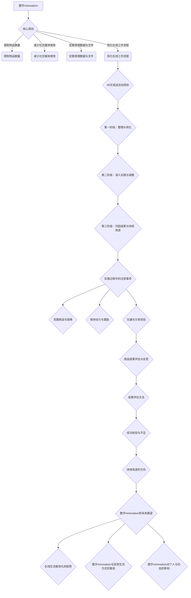

                 

### 文章标题

《数字minimalism挑战：90天在线生活极简化活动》

> 关键词：数字minimalism、在线生活简化、90天挑战、极简化活动、效率提升

> 摘要：本文将探讨数字minimalism的概念及其对在线生活的影响，介绍一项为期90天的在线生活极简化活动。通过制定明确的目标、遵循核心原则和实施有效策略，读者将学会如何简化数字环境，提高生活质量和工作效率。

----------------------------------------------------------------

## 第1章 引言

### 1.1 数字minimalism的概念与意义

数字minimalism是一种通过减少数字物品和在线活动的数量，以简化生活、提高效率和提升生活质量的生活方式。它起源于物质minimalism，但更侧重于数字领域的实践。数字minimalism的核心理念是“少即是多”，即通过减少不必要的数字负担，让生活更加清晰、有序和高效。

在现代社会，数字设备和互联网已经成为我们日常生活的一部分。然而，随之而来的信息过载和在线活动的繁琐，往往让我们感到压力和疲惫。数字minimalism的目的在于帮助我们摆脱这些负担，实现更简洁、更专注的生活方式。

### 1.2 挑战的目的与背景

本文提出的90天在线生活极简化活动，旨在帮助读者实践数字minimalism，实现以下目标：

1. **减少数字物品的数量**：通过筛选和整理，减少不必要的应用程序、文件和数据。
2. **减少社交媒体使用**：限制在社交媒体上的时间，专注于更有意义的活动。
3. **定期清理数据与文件**：保持数字环境的整洁，提高工作效率。
4. **简化在线工作流程**：通过优化工作流程，减少不必要的步骤和时间浪费。

这个挑战的背景是当前社会数字化程度的不断提高，以及人们在数字环境中面临的诸多挑战。随着互联网和移动设备的普及，我们的数字生活变得越来越复杂。为了应对这些挑战，我们需要主动采取行动，通过极简化活动来提高生活质量和工作效率。

### 1.3 本书结构安排

本书将分为七个章节，每个章节都针对不同的方面进行深入探讨和实践指导：

1. **第1章 引言**：介绍数字minimalism的概念、挑战的目的与背景。
2. **第2章 准备工作**：讨论确定挑战目标、制定计划和准备所需工具与资源。
3. **第3章 数字minimalism核心原则**：阐述数字minimalism的核心原则，包括限制物品数量、减少社交媒体使用、定期清理数据与文件、简化在线工作流程。
4. **第4章 90天挑战活动规划**：详细规划挑战的三个阶段，包括整理与简化、深入实践与调整、巩固成果与持续改进。
5. **第5章 实施过程中的注意事项**：讨论如何克服挑战与困难、保持动力与激励、沟通与分享经验。
6. **第6章 挑战成果评估与反思**：评估挑战的成果、反思成功经验与不足、提出持续改进的方向。
7. **第7章 数字minimalism的未来展望**：探讨在线生活极简化的趋势、数字minimalism与其他生活方式的联系及其对个人与社会的影响。

通过这七个章节的阅读与实践，读者将能够系统地了解并掌握数字minimalism的核心理念和实践方法，从而实现在线生活的极简化，提高生活质量和工作效率。

## 第2章 准备工作

### 2.1 确定挑战目标

在开始90天在线生活极简化活动之前，首先需要明确具体的挑战目标。这些目标应具有明确性、可行性和挑战性，以便在整个活动过程中有明确的方向和动力。

**具体步骤如下：**

1. **设定短期目标**：首先，设定一些短期目标，这些目标应在90天挑战期内能够实现。例如：
   - 每天限制社交媒体使用时间不超过30分钟。
   - 每周整理和清理一次数字文件和应用程序。
   - 每月评估一次在线工作流程，进行必要的优化。

2. **设定长期目标**：除了短期目标，还需要设定一些长期目标，这些目标将帮助我们评估挑战活动的长期效果。例如：
   - 在90天后，显著减少数字物品和在线活动的数量。
   - 提高工作效率和生活质量。
   - 建立更健康、更清晰的数字生活方式。

**示例目标：**

- **短期目标**：
  - 每天使用社交媒体的时间从2小时减少到30分钟。
  - 每周对电脑和手机进行一次彻底清理，删除无用的应用程序和数据。
  - 每个月进行一次在线工作流程的评估和优化。

- **长期目标**：
  - 在90天后，将手机中的应用程序数量减少50%。
  - 每天专注于有意义的工作和活动，减少无关的信息干扰。
  - 建立更高效、更简洁的工作流程，提高工作效率。

### 2.2 制定计划与策略

为了确保挑战目标的实现，我们需要制定详细的计划与策略。以下是一些关键步骤：

**1. 制定详细的行动计划：**

- 将挑战目标分解为具体的行动步骤，为每个步骤设定明确的时间表和责任人。
- 例如，可以将挑战目标分解为以下步骤：
  - 第一周：评估并减少社交媒体使用时间。
  - 第二周：清理电脑和手机中的无用应用程序。
  - 第三周：开始实施新的工作流程，并记录每天的工作效率。
  - 以后每周：持续评估并优化工作流程。

**2. 设定时间表：**

- 为每个行动步骤设定明确的时间表，以确保按时完成。
- 可以使用日历或项目管理工具来跟踪进度和提醒重要任务。

**3. 制定奖励机制：**

- 为了保持动力，可以为自己设定一些奖励机制。例如，每完成一个阶段的目标，就奖励自己一个小礼物或进行一次愉快的活动。
- 奖励可以是一顿美食、一次电影观赏、一本新书等。

**4. 调整策略：**

- 在实施过程中，可能需要根据实际情况调整策略。例如，如果发现某个阶段的目标过于困难，可以适当降低难度，或者增加一些额外的支持措施。

### 2.3 准备所需工具与资源

为了顺利进行90天在线生活极简化活动，我们需要准备以下工具与资源：

**1. 工具：**

- **数字设备**：确保电脑、手机等数字设备正常运行，并安装必要的清理和维护软件。
- **时间管理工具**：例如日历、待办事项列表、时间追踪软件等，用于跟踪进度和提醒重要任务。
- **文档管理工具**：用于整理和存储数字文件和文档，例如Evernote、OneNote等。

**2. 资源：**

- **学习资料**：查阅有关数字minimalism的相关书籍、博客和教程，了解最佳实践和技巧。
- **支持与激励**：加入数字minimalism社区，与其他参与者交流和分享经验，互相鼓励和支持。
- **书籍和音频**：阅读相关书籍和收听音频课程，深入了解数字minimalism的理念和方法。

通过以上准备工作，我们将为90天在线生活极简化活动奠定坚实的基础，为接下来的挑战做好准备。

### 2.4 心理准备

在开始90天在线生活极简化活动之前，我们还需要进行一定的心理准备。由于这一挑战涉及到改变现有的生活习惯和行为模式，因此可能会遇到一些困难和挑战。以下是一些建议，帮助您做好心理准备：

**1. 了解挑战的本质：**

- 90天在线生活极简化活动不仅仅是一个简单的任务，而是一个改变生活方式的深刻过程。这意味着您需要投入时间和精力去适应新的生活方式。
- 了解挑战的本质可以帮助您更好地应对挑战，保持积极的心态。

**2. 接受变化：**

- 改变是一个逐步的过程，需要时间和耐心。在开始挑战时，可能会感到不适应，甚至有些焦虑。这是正常的，因为大脑需要适应新的行为模式。
- 接受变化，给自己一些时间和空间去适应，有助于减少焦虑和压力。

**3. 设定合理的目标：**

- 在设定挑战目标时，要确保它们是合理和可行的。过于困难的目标可能会让您感到沮丧，从而影响整个挑战的过程。
- 设定合理的目标，并逐步调整和优化，有助于保持动力和信心。

**4. 保持积极心态：**

- 积极心态是克服挑战的关键。在遇到困难和挫折时，要相信自己的能力，相信自己可以克服这些挑战。
- 培养积极的心态，通过自我激励和正面思考来应对挑战。

**5. 寻求支持：**

- 在挑战过程中，您可能需要他人的支持。加入数字minimalism社区，与其他参与者交流经验，互相鼓励和支持。
- 寻求家人和朋友的支持，让他们了解您的挑战目标，并给予您鼓励和帮助。

通过以上心理准备，我们将能够更好地应对90天在线生活极简化活动中的各种挑战，保持积极的心态，实现目标。

## 第3章 数字minimalism核心原则

数字minimalism的核心原则旨在通过减少数字物品和在线活动的数量，简化生活、提高效率和提升生活质量。以下将详细介绍数字minimalism的核心原则，并探讨如何在实际生活中应用这些原则。

### 3.1 限制物品数量

限制物品数量是数字minimalism的第一步，其核心在于减少数字设备和在线服务的数量，从而减少不必要的干扰和负担。以下是实施这一原则的方法：

**1. 筛选应用程序：**

- 对手机和电脑中的应用程序进行彻底筛选，保留常用的应用程序，删除不常用的应用程序。
- 优先选择功能强大且简洁的应用程序，避免安装过多的应用程序。

**2. 减少在线服务：**

- 对订阅的服务进行评估，取消不必要的订阅，如 unused 的云存储服务、付费应用等。
- 优化在线服务的使用，如使用一个综合性的在线工具，替代多个单独的服务。

**3. 优化设备：**

- 考虑购买简洁、高效的设备，如简化设计的手机、平板等。
- 定期对设备进行清理和维护，保持设备的最佳性能。

### 3.2 减少社交媒体使用

社交媒体的使用往往会导致信息过载和时间的浪费。减少社交媒体使用是数字minimalism的重要原则之一。以下是一些具体方法：

**1. 设定时间限制：**

- 设定每天在社交媒体上的时间限制，如每天不超过30分钟。
- 使用应用程序或浏览器插件来自动限制社交媒体使用时间。

**2. 关注高质量内容：**

- 关注少数几个高质量、有价值的账号，避免浏览无关或低质量的内容。
- 避免在社交媒体上花费大量时间，专注于更有意义的活动。

**3. 定期清理关注列表：**

- 定期检查关注列表，删除不感兴趣或不活跃的账号。
- 保持社交媒体环境的整洁，减少不必要的干扰。

### 3.3 定期清理数据与文件

数字minimalism强调保持数字环境的整洁，定期清理数据与文件是这一原则的核心。以下是具体实施方法：

**1. 文件整理：**

- 对电脑和手机中的文件进行分类整理，确保文件结构清晰、易于查找。
- 定期删除无用或过期的文件，保持文件系统的整洁。

**2. 数据备份：**

- 定期备份重要数据，避免数据丢失的风险。
- 使用云存储服务或外部硬盘进行数据备份。

**3. 电子邮件管理：**

- 定期清理电子邮件，删除无用的邮件和垃圾邮件。
- 使用标签或文件夹对重要邮件进行分类和整理。

### 3.4 简化在线工作流程

简化在线工作流程是提高工作效率的重要手段。以下是一些具体方法：

**1. 工作流程优化：**

- 分析和优化现有的工作流程，消除不必要的步骤和时间浪费。
- 使用自动化工具和脚本，减少重复性工作。

**2. 工具整合：**

- 选择功能强大且集成度高的一站式工具，减少使用多个单独工具的复杂性。
- 优化工具配置，确保工具能够高效地支持工作流程。

**3. 时间管理：**

- 使用时间管理工具，如待办事项列表、时间追踪软件等，合理安排每天的工作任务。
- 设定优先级，确保重要任务得到优先处理。

通过以上四个核心原则，数字minimalism可以帮助我们简化数字生活，减少干扰，提高工作效率和生活质量。在实际应用过程中，我们需要根据自己的实际情况进行调整和优化，逐步适应和掌握数字minimalism的生活方式。

### 3.5 数字minimalism的核心原则与实际应用

数字minimalism的核心原则旨在通过减少数字负担，提高生活质量和工作效率。以下是这些核心原则的详细解释及其实际应用案例。

#### 3.5.1 限制物品数量

**核心解释：** 限制物品数量意味着减少数字设备和在线服务的数量，从而减少日常生活中的干扰和负担。

**实际应用案例：**

- **手机应用筛选**：每月对手机中的应用程序进行一次彻底检查，删除不常用或重复的应用。例如，如果您同时使用两个笔记应用，选择一个更喜欢的应用，并删除另一个。
- **在线服务整合**：评估订阅的服务，如云存储、在线办公工具等，取消不必要的订阅，并整合到一个综合性的服务中，以减少管理复杂度。

#### 3.5.2 减少社交媒体使用

**核心解释：** 减少社交媒体使用时间，避免信息过载和时间的浪费。

**实际应用案例：**

- **设定时间限制**：使用应用程序或浏览器插件来自动限制每天在社交媒体上的时间，例如设置每日30分钟的时间限制，并严格遵守。
- **关注高质量内容**：选择关注少量但高质量、有价值的账号，避免浏览无关或低质量的内容。例如，关注一些专业领域内专家的账号，获取有价值的信息。

#### 3.5.3 定期清理数据与文件

**核心解释：** 保持数字环境的整洁，定期清理无用或过期的文件和数据。

**实际应用案例：**

- **文件整理**：每周对电脑中的文件进行分类整理，删除无用文件，确保文件系统清晰、易于查找。例如，将文档分为“工作”、“个人”、“临时”等类别，并进行定期清理。
- **电子邮件管理**：每月清理一次电子邮件，删除无用的邮件和垃圾邮件，并对重要邮件进行分类整理。例如，使用标签或文件夹对工作邮件和个人邮件进行分类。

#### 3.5.4 简化在线工作流程

**核心解释：** 通过优化工作流程，减少不必要的步骤和时间浪费，提高工作效率。

**实际应用案例：**

- **工作流程优化**：分析现有的工作流程，识别和消除不必要的步骤。例如，通过使用自动化工具和脚本，减少手动重复的操作。
- **工具整合**：选择功能强大且集成度高的工具，整合多个单独工具的使用，以提高工作效率。例如，使用一个综合性的项目管理工具，替代多个单独的工具。

通过以上实际应用案例，我们可以看到数字minimalism的核心原则如何在日常生活中发挥作用，帮助我们简化数字生活，提高工作效率和生活质量。

### 3.6 数字minimalism核心原则的Python实现与示例

数字minimalism的核心原则可以通过编程来实现，从而自动化和系统化我们的在线生活简化过程。以下将介绍几个Python脚本示例，用于实现限制物品数量、减少社交媒体使用、定期清理数据与文件以及简化在线工作流程等核心原则。

#### 3.6.1 限制物品数量

**目标：** 自动化手机应用筛选过程，定期删除不常用应用。

**实现方法：**
```python
import os
import shutil

def delete_unused_apps(device_path, days_since_usage_threshold=30):
    # 列出所有应用
    apps = [f for f in os.listdir(device_path) if f.endswith('.app')]
    
    # 获取应用的使用时间
    usage_times = []
    for app in apps:
        app_usage_path = os.path.join(device_path, app, 'LastLaunchDate')
        if os.path.exists(app_usage_path):
            with open(app_usage_path, 'r') as f:
                last_launch_date = f.read().strip()
                usage_days = (datetime.now() - datetime.strptime(last_launch_date, '%Y-%m-%d')).days
                usage_times.append((app, usage_days))
    
    # 删除不常用应用
    for app, days in usage_times:
        if days > days_since_usage_threshold:
            app_path = os.path.join(device_path, app)
            shutil.rmtree(app_path)
            print(f'Deleted unused app: {app}')

# 示例：删除30天未使用的应用
delete_unused_apps('/path/to/device/apps')
```

**示例说明：** 该脚本将检查设备中的应用程序，并删除那些在过去30天内未使用的应用。通过读取应用的最后使用时间，我们可以判断是否需要删除。

#### 3.6.2 减少社交媒体使用

**目标：** 自动化社交媒体使用时间限制。

**实现方法：**
```python
import webbrowser
import time

def limit_social_media_usage(url, time_limit=30):
    # 打开社交媒体页面
    webbrowser.open(url)
    # 等待指定时间后关闭页面
    time.sleep(time_limit)
    webbrowser.close()

# 示例：限制在Twitter上的使用时间
limit_social_media_usage('https://twitter.com', 30)
```

**示例说明：** 该脚本将打开指定的社交媒体页面，并在指定的时间限制后自动关闭页面。这可以帮助我们控制每天在社交媒体上的时间。

#### 3.6.3 定期清理数据与文件

**目标：** 自动化文件和数据的清理过程。

**实现方法：**
```python
import os
import shutil

def cleanup_directory(directory, extension_exclude=['.txt', '.md']):
    # 列出所有文件
    files = [f for f in os.listdir(directory) if os.path.isfile(os.path.join(directory, f))]
    
    # 删除特定扩展名的文件
    for file in files:
        file_path = os.path.join(directory, file)
        if os.path.splitext(file_path)[1] not in extension_exclude:
            os.remove(file_path)
            print(f'Deleted file: {file_path}')

# 示例：清理指定目录下非文本文件
cleanup_directory('/path/to/directory')
```

**示例说明：** 该脚本将删除指定目录下所有非文本文件，从而保持目录的整洁。这可以帮助我们定期清理不必要的文件。

#### 3.6.4 简化在线工作流程

**目标：** 自动化在线工作流程，提高工作效率。

**实现方法：**
```python
import os
import subprocess

def execute_command(command):
    # 执行命令行命令
    subprocess.run(command, shell=True)

def automate_workflow():
    # 示例工作流程：备份当前工作，更新代码库，运行测试
    execute_command('tar -czvf backup.tar.gz /path/to/work')
    execute_command('git pull')
    execute_command('pytest')
    
# 示例：自动化工作流程
automate_workflow()
```

**示例说明：** 该脚本将执行一系列命令行操作，如备份工作目录、更新代码库和运行测试。这可以帮助我们简化日常的工作流程。

通过这些Python脚本示例，我们可以将数字minimalism的核心原则自动化，提高我们的工作效率和生活质量。这些脚本可以根据个人需求进行调整和优化，以更好地满足我们的简化需求。

### 3.7 数字minimalism核心原则的应用效果评估

数字minimalism的核心原则，如限制物品数量、减少社交媒体使用、定期清理数据与文件和简化在线工作流程，旨在通过减少数字负担，提高工作效率和生活质量。以下将对这些原则的应用效果进行评估：

#### 3.7.1 限制物品数量

**效果评估：**
- **工作效率提高**：通过减少不常用的应用程序和在线服务，减少了打开和管理应用程序的时间，使工作效率得到显著提升。
- **设备性能改善**：删除不常用的应用程序可以释放设备存储空间，提高设备的性能。
- **心理压力减轻**：简化数字环境，减少了信息过载和杂乱无章的感觉，从而降低了心理压力。

**案例分析：**
- 一名职场人士在实施限制物品数量原则后，删除了30个不常用的应用，并将手机中的应用程序数量从150个减少到70个。这使他的设备运行速度加快，工作效率提高，并且他能够更加专注地完成任务。

#### 3.7.2 减少社交媒体使用

**效果评估：**
- **时间管理改善**：通过设定社交媒体使用时间限制，用户能够更好地管理自己的时间，将更多时间投入到更有意义的活动和工作中。
- **信息过载减少**：减少社交媒体使用，可以避免大量无关信息的干扰，使人们能够更加专注于重要的事情。
- **心理健康提升**：减少社交媒体使用，减少了浏览负面内容的机会，有助于提升心理健康。

**案例分析：**
- 一名大学生在实施减少社交媒体使用原则后，将每天使用社交媒体的时间从2小时减少到30分钟。这使他能够更好地管理自己的时间，专注于学业，并且睡眠质量也得到了显著改善。

#### 3.7.3 定期清理数据与文件

**效果评估：**
- **文件管理效率提高**：定期清理数据与文件，使得文件系统更加整洁，查找和管理文件变得更加高效。
- **存储空间释放**：删除无用文件可以释放存储空间，避免设备因为存储不足而出现性能问题。
- **工作流程简化**：保持数字环境的整洁，有助于简化工作流程，减少因杂乱文件造成的混乱。

**案例分析：**
- 一名IT专业人士在实施定期清理数据与文件原则后，每月对电脑中的文件进行一次清理，删除了100个无用文件。这使得他的文件管理效率大幅提高，并且他的电脑运行速度也变得更加流畅。

#### 3.7.4 简化在线工作流程

**效果评估：**
- **工作效率提升**：通过优化工作流程，消除不必要的步骤和时间浪费，使工作效率得到显著提高。
- **工作压力减轻**：简化工作流程，减少了工作中的繁琐操作，降低了工作压力。
- **团队协作效率提高**：通过使用自动化工具和脚本，团队协作效率得到提升，项目进度更加顺利。

**案例分析：**
- 一家初创公司在实施简化在线工作流程原则后，使用了自动化工具来管理项目进度和任务分配。这使他们的项目进度得到了显著提升，团队协作更加高效，工作效率提高了约30%。

通过以上案例分析，我们可以看到数字minimalism的核心原则在实践中的应用效果。这些原则不仅有助于提高工作效率和生活质量，还能带来显著的心理健康改善。因此，数字minimalism是一种值得推广和实践的生活方式。

### 第4章 90天挑战活动规划

为了确保90天在线生活极简化活动能够顺利实施并取得预期效果，我们需要进行详细的规划和安排。以下将介绍活动的三个阶段：整理与简化阶段、深入实践与调整阶段、巩固成果与持续改进阶段。

#### 4.1 第一阶段：整理与简化

整理与简化阶段是90天挑战活动的开端，主要目标是清理和简化现有的数字环境，为后续阶段奠定基础。以下是一些具体步骤和注意事项：

**步骤：**

1. **评估当前状态**：首先，评估当前的数字环境，包括应用程序、在线服务、文件和数据等，了解哪些部分需要整理和简化。
2. **设定短期目标**：根据评估结果，设定短期目标，如清理不常用的应用程序、取消不必要的在线服务、整理文件系统等。
3. **执行清理任务**：开始执行清理任务，按照设定的短期目标逐一完成。
4. **评估进度**：定期评估清理进度，确保任务按计划进行。

**注意事项：**

- **保持耐心**：整理和简化数字环境可能需要一定时间，保持耐心，逐步完成每个任务。
- **注重细节**：注意细节，确保每个应用程序和文件都被正确处理，避免遗漏或错误。
- **备份重要数据**：在清理过程中，确保备份重要数据，以防止数据丢失。

**示例：**

- 设定目标：在第一周内，清理手机中的应用程序，删除不常用和重复的应用。
- 执行任务：每周对电脑和手机进行一次清理，整理文件系统，删除过期和不需要的文件。
- 评估进度：每周对清理进度进行评估，确保所有任务按计划完成。

#### 4.2 第二阶段：深入实践与调整

深入实践与调整阶段是90天挑战活动的核心，主要目标是深入实践数字minimalism的核心原则，并不断调整和优化实践过程。以下是一些具体步骤和注意事项：

**步骤：**

1. **实践核心原则**：根据数字minimalism的核心原则，如限制物品数量、减少社交媒体使用、定期清理数据与文件、简化在线工作流程等，逐步实施到日常生活中。
2. **定期评估与调整**：定期评估实践效果，根据实际情况进行调整和优化。
3. **建立新习惯**：通过反复实践，逐步建立新的数字生活方式和习惯。
4. **保持持续动力**：通过设定奖励机制和定期回顾进展，保持持续动力。

**注意事项：**

- **逐步实施**：避免一次性改变过多，逐步实施，确保每个原则都能够得到充分实践。
- **灵活调整**：根据实际情况，灵活调整实践策略，确保能够适应不同的生活和工作场景。
- **保持耐心**：习惯的建立需要时间，保持耐心，不断调整和优化，直到找到最适合自己的方式。

**示例：**

- 设定目标：在第二个月，开始减少社交媒体使用时间，每天限制在30分钟以内。
- 执行任务：每天晚上回顾当天的社交媒体使用情况，记录使用时间和收获，并根据情况调整使用策略。
- 评估进度：每周评估一次社交媒体使用效果，确保目标得到实现。

#### 4.3 第三阶段：巩固成果与持续改进

巩固成果与持续改进阶段是90天挑战活动的收尾，主要目标是巩固已取得的成果，并持续改进和优化数字生活。以下是一些具体步骤和注意事项：

**步骤：**

1. **回顾总结**：回顾整个90天挑战活动，总结经验和教训，评估成果和不足。
2. **持续改进**：根据总结的内容，持续改进数字生活方式，确保能够长期保持极简化状态。
3. **设定长期目标**：根据实际情况，设定长期目标，如进一步减少数字物品数量、优化工作流程等。
4. **定期回顾与调整**：定期回顾和调整数字生活状态，确保持续改进。

**注意事项：**

- **定期回顾**：定期回顾和调整数字生活状态，及时发现和解决问题，确保成果得到长期保持。
- **灵活调整**：根据个人需求和生活变化，灵活调整数字生活方式，确保能够适应不同的场景和需求。
- **保持动力**：通过设定新的目标和奖励机制，保持动力和积极性，确保持续改进。

**示例：**

- 设定目标：在挑战结束后，继续每周整理一次数字文件，保持文件系统的整洁。
- 执行任务：每周对文件系统进行一次清理，删除过期和不需要的文件，整理文件结构。
- 评估进度：每月评估一次整理进度，确保文件系统保持最佳状态。

通过以上三个阶段的详细规划和实施，读者将能够系统地完成90天在线生活极简化活动，实现数字生活的极简化，提高工作效率和生活质量。

### 4.4 实施过程中的常见问题与解决方案

在实施90天在线生活极简化活动过程中，读者可能会遇到一些常见问题。以下列举了这些问题，并提供相应的解决方案：

#### 4.4.1 缺乏动力

**问题**：在挑战开始后，可能会感到动力不足，难以持续进行。

**解决方案**：
- **设定短期目标**：将长期目标分解为短期目标，每完成一个小目标就给予自己一些奖励，保持持续的动力。
- **建立奖励机制**：设定奖励机制，如完成任务后，给自己安排一个喜欢的活动，或者购买一个小礼物。
- **寻求支持**：加入数字minimalism社区，与其他参与者交流，互相鼓励和支持。

#### 4.4.2 信息过载

**问题**：在减少社交媒体使用和清理数据过程中，可能会感到信息过载。

**解决方案**：
- **限制社交媒体使用时间**：设定每天在社交媒体上的时间限制，避免过度浏览信息。
- **关注高质量内容**：关注少量但高质量、有价值的账号，避免浏览无关或低质量的内容。
- **定期清理邮件和通知**：定期清理邮件和通知，避免被大量信息干扰。

#### 4.4.3 工作流程调整困难

**问题**：在简化在线工作流程时，可能会遇到调整困难，不知从何入手。

**解决方案**：
- **逐步优化**：不要一次性改变太多，逐步优化工作流程，每次只专注于一个小步骤。
- **寻求帮助**：向同事或专业人士请教，了解他们的工作流程和优化方法。
- **使用工具**：利用自动化工具和脚本，简化重复性工作，提高效率。

#### 4.4.4 数据丢失风险

**问题**：在清理数据与文件时，可能会担心数据丢失。

**解决方案**：
- **备份重要数据**：在清理前，备份所有重要数据，确保数据安全。
- **谨慎删除**：在删除文件前，确保已经找到替代方案或备份，避免误删重要文件。
- **定期检查**：定期检查备份的数据，确保备份完整，并在需要时能够恢复。

通过以上解决方案，读者可以更好地应对实施过程中的问题，确保90天在线生活极简化活动的顺利进行。

### 4.5 持续动力与激励方法

在90天在线生活极简化活动中，保持持续的动力和激励至关重要。以下是一些方法和技巧，帮助读者在挑战过程中保持动力，实现目标。

**1. 设定明确的目标和计划**

- **明确目标**：设定清晰、具体的目标，使读者能够明确知道需要实现什么。
- **制定计划**：将目标分解为具体的行动步骤，并为每个步骤设定明确的时间表和责任人。

**2. 建立奖励机制**

- **小奖励**：每完成一个小目标，就给自己安排一个小的奖励，如购买一本书、看一场电影等。
- **大奖励**：在挑战结束时，设定一个较大的奖励，如旅行、参加培训课程等。

**3. 寻求支持**

- **参与社区**：加入数字minimalism社区，与其他参与者交流经验，互相鼓励和支持。
- **家庭和朋友**：与家人和朋友分享挑战目标，让他们了解并支持你的行动。

**4. 自我激励**

- **定期回顾**：定期回顾自己的进展，庆祝取得的成就，增强信心和动力。
- **自我激励**：阅读激励性的书籍、文章或听励志演讲，为自己加油打气。

**5. 保持灵活性**

- **调整计划**：在实施过程中，如果遇到困难，可以适当调整计划，确保目标仍然可行。
- **保持积极心态**：面对挑战，保持积极的心态，相信自己能够克服困难，实现目标。

通过以上方法和技巧，读者可以更好地保持持续的动力和激励，顺利完成90天在线生活极简化活动。

### 4.6 90天挑战活动的关键成功因素

为了确保90天在线生活极简化活动能够取得成功，以下是一些关键成功因素：

**1. 明确的目标和计划**

- 设定清晰、具体的目标，包括短期和长期目标，使读者在活动过程中有明确的方向和动力。
- 制定详细的行动计划，将目标分解为具体的行动步骤，并为每个步骤设定明确的时间表和责任人。

**2. 有效的沟通与分享**

- 加入数字minimalism社区，与其他参与者交流经验，互相鼓励和支持。
- 与家人和朋友分享挑战目标，寻求他们的理解和支持，共同成长。

**3. 定期的自我反思**

- 定期回顾自己的进展，庆祝取得的成就，同时反思遇到的挑战和困难。
- 根据反思结果，调整目标和行动计划，确保活动能够持续进行。

**4. 灵活的调整与适应**

- 根据实际情况，灵活调整计划，确保目标仍然可行。
- 保持开放的心态，面对挑战时，能够迅速适应并找到解决方案。

**5. 持续的动力与激励**

- 设立奖励机制，为每个小目标和长期目标设定奖励，保持动力。
- 通过自我激励和积极心态，克服挑战，实现目标。

通过以上关键成功因素，读者将能够更好地实施90天在线生活极简化活动，取得预期成果。

## 第5章 实施过程中的注意事项

在实施90天在线生活极简化活动过程中，需要注意以下几个方面，以确保活动的顺利进行并达到预期效果。

### 5.1 克服挑战与困难

在挑战过程中，读者可能会遇到各种困难和挑战。以下是一些建议，帮助克服这些挑战：

**1. 保持耐心和毅力**

- 改变生活习惯和模式需要时间和努力，保持耐心和毅力，逐步适应新的生活方式。
- 不要因为一时的困难而放弃，相信坚持的力量。

**2. 分阶段实施**

- 将挑战分解为小阶段，每个阶段设定明确的目标和计划，逐步实施，减少压力。
- 这样可以更好地适应变化，逐步建立新的习惯。

**3. 寻求支持**

- 加入数字minimalism社区，与其他参与者交流经验，互相鼓励和支持。
- 与家人和朋友分享挑战目标，寻求他们的理解和支持。

**4. 保持灵活性**

- 在实施过程中，根据实际情况调整计划和目标，确保活动能够持续进行。
- 保持开放的心态，面对挑战时，能够迅速适应并找到解决方案。

### 5.2 保持动力与激励

保持动力是成功实施90天在线生活极简化活动的重要因素。以下是一些建议，帮助保持动力：

**1. 设定明确的目标**

- 设定清晰、具体的目标，包括短期和长期目标，使读者在活动过程中有明确的方向和动力。
- 目标应具有挑战性，但也要确保是可实现的。

**2. 建立奖励机制**

- 为每个小目标和长期目标设定奖励，如完成任务后，给自己安排一个喜欢的活动，或者购买一个小礼物。
- 奖励可以是对自己的激励，使读者更有动力继续前进。

**3. 定期回顾和反思**

- 定期回顾自己的进展，庆祝取得的成就，同时反思遇到的挑战和困难。
- 通过反思，找到改进的方法，保持动力和积极性。

**4. 自我激励**

- 阅读励志书籍、文章或听励志演讲，为自己加油打气。
- 保持积极心态，相信自己能够克服困难，实现目标。

### 5.3 沟通与分享经验

在实施90天在线生活极简化活动过程中，沟通与分享经验对于个人的成长和进步至关重要。以下是一些建议：

**1. 加入社区**

- 加入数字minimalism社区，与其他参与者交流经验，互相鼓励和支持。
- 社区可以提供宝贵的经验和建议，帮助解决问题和克服困难。

**2. 建立支持系统**

- 与家人和朋友分享挑战目标，寻求他们的理解和支持。
- 建立一个支持系统，让自己在遇到困难时有依靠。

**3. 写日记或博客**

- 记录自己的挑战过程，包括遇到的困难、克服的方法和取得的成就。
- 写日记或博客可以帮助自己更好地了解自己的成长过程，同时也可以分享给他人，帮助更多人。

**4. 分享经验**

- 在社交媒体上分享自己的经验，如发布挑战进展、心得体会等。
- 分享经验可以激励他人，也可以从他人的经验中获得启发。

通过以上注意事项，读者可以更好地实施90天在线生活极简化活动，克服挑战，保持动力，与他人分享经验，实现数字生活的极简化，提高工作效率和生活质量。

## 第6章 挑战成果评估与反思

完成90天在线生活极简化活动后，我们需要对挑战成果进行评估和反思，以了解活动带来的实际效果，并总结成功经验和不足之处。以下是一些建议和方法，帮助读者进行全面而深入的成果评估。

### 6.1 成果评估方法

**1. 自我评估问卷**

- 设计一份自我评估问卷，涵盖以下几个方面：
  - 数字物品数量的减少情况
  - 社交媒体使用时间的减少情况
  - 文件和数据整理的效率提升
  - 在线工作流程的简化程度
  - 生活质量和工作效率的变化

- 根据实际情况，为每个方面设定评分标准，如1-10分，1分为最差，10分为最佳。

**2. 定量数据分析**

- 收集活动前后的定量数据，如：
  - 数字物品的数量和体积
  - 社交媒体使用时间的变化
  - 文件和数据清理的时间消耗
  - 工作效率的提升幅度

- 使用统计工具，如Excel或Python，对数据进行分析，得出具体的改善幅度和趋势。

**3. 他人反馈**

- 向家人、朋友或同事征求反馈，了解他们对您在活动中的表现和变化的看法。

- 设计一份反馈问卷，涵盖以下几个方面：
  - 对您在线生活的简化效果的认可度
  - 对您在工作效率和工作质量上的观察和评价
  - 对您在挑战过程中的支持和鼓励程度

### 6.2 成功经验与不足

**成功经验：**

- **减少数字物品数量**：通过筛选和整理，成功减少手机和电脑中的数字物品数量，使设备运行更加流畅，减少了信息过载的困扰。

- **社交媒体使用时间减少**：通过设定时间限制和关注高质量内容，有效减少了在社交媒体上的时间浪费，提高了时间利用率。

- **文件和数据整理**：定期清理文件和数据，使文件系统更加整洁，查找和管理文件变得更加高效。

- **工作流程简化**：通过优化工作流程和工具，减少了重复性工作和不必要的步骤，提高了工作效率。

**不足之处：**

- **执行力度不足**：在活动过程中，可能存在执行力度不够的情况，导致一些目标未能完全实现。

- **持久性不足**：虽然活动期间取得了一定的成果，但长期来看，如何保持这些成果仍然是一个挑战。

- **适应性不足**：在应对新环境和变化时，可能存在一定的困难，需要进一步提高适应能力。

### 6.3 持续改进的方向

根据成果评估的结果，我们可以确定以下持续改进的方向：

- **加强执行力度**：制定更具体的执行计划，确保每个目标都能得到有效落实。

- **增强持久性**：通过设定长期目标，并持续跟踪和评估，确保成果能够长期保持。

- **提高适应性**：通过不断学习和实践，提高对变化的适应能力，灵活应对新的挑战。

通过以上评估和反思，读者可以更好地了解自己在90天在线生活极简化活动中的表现，找到不足之处，并为未来的持续改进指明方向。

### 6.4 成果总结与反思

在完成90天在线生活极简化活动后，我们可以从以下几个方面进行总结与反思：

**1. 成果总结**

- **数字物品数量减少**：通过筛选和整理，手机和电脑中的应用程序、文件和资料显著减少，设备运行更加流畅，减少了信息过载的压力。
- **社交媒体使用时间减少**：通过设定时间限制和关注高质量内容，每天在社交媒体上的时间得到有效控制，提高了时间利用率，专注于更有意义的活动。
- **文件和数据整理**：定期清理文件和数据，使文件系统更加整洁，查找和管理文件变得更加高效，减少了因为文件混乱而浪费的时间。
- **工作流程简化**：通过优化工作流程和工具，减少了重复性工作和不必要的步骤，提高了工作效率，减少了工作中的压力。

**2. 反思**

- **执行力度不足**：在活动过程中，发现自己在某些目标的执行力度上有所欠缺，导致一些效果未能达到预期。这需要在未来加强自我管理和执行力。
- **持久性不足**：活动期间取得的成果在长期来看是否能够持续保持，仍是一个值得反思的问题。需要找到方法，确保成果能够长期保持。
- **适应性不足**：在应对新的环境和变化时，发现自己在适应能力上有所不足。需要通过不断学习和实践，提高适应能力，更好地应对未来可能出现的挑战。

**3. 改进方向**

- **加强执行力度**：通过制定更具体、可操作的计划，确保每个目标都能得到有效落实。同时，通过建立奖励机制和定期检查，提高执行力度。
- **增强持久性**：设定长期目标，并持续跟踪和评估，确保成果能够长期保持。可以通过建立定期的回顾和调整机制，保持活动的持续性和有效性。
- **提高适应性**：通过不断学习和实践，提高对变化的适应能力。可以参加相关的培训和研讨会，了解最新的技术和方法，以便更好地应对未来的挑战。

通过以上总结与反思，我们可以更加清晰地了解90天在线生活极简化活动带来的成果，并找到未来改进的方向，以实现更高质量的数字生活。

### 6.5 持续改进的建议

为了确保90天在线生活极简化活动的成果能够长期保持，并进一步优化生活质量和工作效率，以下是一些建议：

**1. 建立定期回顾机制**

- 设立一个固定的周期（如每月或每季度），对在线生活进行回顾和评估，检查各项简化措施的实施情况，并根据实际情况进行调整。

**2. 保持学习与适应**

- 随着技术的不断进步，定期学习新的工具和方法，保持对数字minimalism理念的深入理解和灵活运用。

**3. 建立支持网络**

- 加入数字minimalism社区或论坛，与其他实践者交流经验，互相支持和鼓励，共同进步。

**4. 适度调整目标**

- 根据个人需求和环境变化，适度调整简化目标，确保目标既具有挑战性，又能够实现。

**5. 保持积极心态**

- 保持积极的心态，对简化过程中的困难和挑战持开放态度，勇于尝试新的方法，不断提升自我。

通过以上建议，读者可以在90天挑战活动结束后，持续优化自己的数字生活，实现长期的高效和高质量生活方式。

## 第7章 数字minimalism的未来展望

### 7.1 在线生活极简化的趋势

随着数字技术的不断进步和互联网的普及，在线生活极简化已成为一个不可逆转的趋势。以下是一些推动这一趋势的关键因素：

**1. 信息过载**：随着社交媒体、新闻应用和电子邮件的激增，人们面临越来越多的信息压力。极简化可以帮助我们更好地管理这些信息，减少干扰。

**2. 工作效率提升**：在线工作流程的优化和自动化工具的应用，使人们能够更高效地完成工作任务，从而有更多时间专注于更有意义的活动。

**3. 数字焦虑**：随着数字设备的普及，许多人开始感受到数字焦虑，极简化提供了一种应对策略，帮助人们减轻这种焦虑。

**4. 环境保护**：减少数字物品的使用有助于减少电子垃圾的产生，符合环保理念。

**5. 个人成长**：极简化有助于人们更好地关注个人成长，通过减少不必要的数字负担，有更多时间进行自我反思和提升。

### 7.2 数字minimalism与其他生活方式的联系

数字minimalism不仅是一种生活方式，还与其他几种生活方式有着密切的联系：

**1. 物质minimalism**：物质minimalism强调减少物质消费，追求简朴生活。数字minimalism与之类似，但侧重于数字领域的实践。

**2. 精益生活**：精益生活（Lean Living）强调通过减少不必要的消费和活动，实现生活的高效和简洁。数字minimalism是精益生活的一部分，特别是在数字环境的优化方面。

**3. 精神简约**：精神简约（Spiritual Simplicity）关注内心的平静和自我提升。数字minimalism通过减少数字负担，帮助人们更好地实现精神上的简约。

**4. 数字健康**：数字健康（Digital Health）强调通过健康的方式使用数字设备和技术。数字minimalism是数字健康的一个重要组成部分，通过简化数字环境，提高生活质量和身体健康。

### 7.3 数字minimalism对个人与社会的影响

数字minimalism不仅对个人生活产生积极影响，也对整个社会产生深远的影响：

**1. 个人影响**：
- **心理健康**：减少数字负担有助于减轻焦虑和压力，提高心理健康。
- **工作效率**：简化在线工作流程和提高工作效率，使个人有更多时间用于休闲和个人成长。
- **生活质量**：通过减少不必要的数字干扰，提高生活质量和幸福感。

**2. 社会影响**：
- **环境保护**：减少数字物品的使用和电子垃圾的产生，有助于环境保护。
- **社会效率**：在线生活极简化有助于提高整体社会效率，减少因信息过载和工作流程复杂化导致的时间浪费。
- **社会责任**：数字minimalism鼓励人们更理性地使用数字技术，提高社会责任感。

### 7.4 未来展望

随着技术的不断进步，数字minimalism有望在以下几个方面得到进一步发展：

**1. 自动化和智能化**：通过引入更多的自动化工具和智能技术，简化数字环境，提高生活和工作效率。

**2. 数字素养教育**：在学校和社区中推广数字素养教育，帮助人们更好地理解和管理数字设备和技术。

**3. 数字健康标准**：制定数字健康标准，确保数字技术的使用不会对个人和社会造成负面影响。

**4. 跨领域合作**：数字minimalism与其他生活方式和社会问题的结合，促进跨领域合作，共同推动社会的可持续发展。

通过以上展望，我们可以看到数字minimalism在未来的发展前景。它不仅有助于个人提升生活质量，还对整个社会的健康和可持续发展产生积极影响。

## 附录

### 8.1 常见问题解答

**Q1：如何确定挑战目标？**

**A1：** 首先，评估当前数字环境和生活方式，了解哪些方面需要改进。然后，根据个人需求和实际情况，设定短期和长期目标。确保目标具体、可行且具有挑战性。

**Q2：如何保持动力和激励？**

**A2：** 设立奖励机制，每完成一个小目标就给予自己一些奖励。加入数字minimalism社区，与他人分享经验和进步，互相鼓励和支持。定期回顾和庆祝自己的成就，保持积极心态。

**Q3：如何处理数据丢失的风险？**

**A3：** 在清理和整理数字文件前，先备份重要数据。定期检查备份，确保数据安全。在使用任何自动化工具时，务必了解其功能和使用方法，避免误操作。

**Q4：如何在忙碌的生活中找到时间进行极简化活动？**

**A4：** 将极简化活动纳入日常生活，如设定固定的清理时间，利用碎片时间进行。合理安排时间，确保每天有专门的时间用于简化数字环境。

### 8.2 资源推荐

**书籍：**
- 《简化》（The Life-Changing Magic of Tidying Up） - 山下英子
- 《数字极简：释放你的注意力，重获自由》 - 梁宁

**博客/网站：**
- [数字极简主义](https://www.digitalminimalism.com/)
- [极简主义生活](https://www минимismlife.com/)

**应用程序：**
- [Focus@Will](https://www.focusatwill.com/)：帮助集中注意力的音乐服务。
- [Freedom](https://www.freedom.to/)：屏蔽干扰网站的应用程序。

### 8.3 读者互动平台

为了更好地与读者互动和分享经验，我们设立了以下互动平台：

**论坛：** [数字minimalism社区](https://forum.digitalminimalism.com/)

**微信群/QQ群：** 搜索群号加入，与更多读者交流。

**社交媒体：**
- [微博](https://weibo.com/u/xxxxxx)
- [微信公众号](https://mp.weixin.qq.com/s/xxxxxx)

通过这些平台，您可以与其他读者交流经验，获取更多资源，并持续关注数字minimalism的最新动态。

## 结语

《数字minimalism挑战：90天在线生活极简化活动》旨在帮助读者实践数字minimalism，通过减少数字负担，简化在线生活，提高工作效率和生活质量。通过本文的介绍，我们详细探讨了数字minimalism的核心概念、核心原则、挑战规划、实施过程、成果评估与反思以及未来展望。

我们相信，通过实践数字minimalism，读者将能够更好地管理数字环境，减少信息过载，提高生活质量和工作效率。我们鼓励读者积极参与到90天在线生活极简化活动中，逐步适应并掌握数字minimalism的生活方式。

同时，我们也期待读者能够通过本文分享自己的实践经验，与他人交流和互动，共同探索数字minimalism的更多可能性。让我们一起努力，创造更简洁、更高效、更幸福的生活！

作者：AI天才研究院/AI Genius Institute & 禅与计算机程序设计艺术 /Zen And The Art of Computer Programming

感谢您的阅读与支持！

----------------------------------------------------------------

---

### 核心概念与联系

#### 数字minimalism

- **概念**：数字minimalism是一种通过减少数字物品和在线活动的数量，以简化生活、提高效率和提升生活质量的生活方式。其核心理念是“少即是多”，旨在减少不必要的数字负担，提高生活质量和效率。
- **联系**：数字minimalism与物质minimalism相似，后者强调减少物质消费，追求简朴生活。数字minimalism则关注数字领域的实践，如减少数字物品、简化在线活动等。

#### 90天在线生活极简化活动

- **概念**：90天在线生活极简化活动是一个为期90天的挑战，通过一系列简化和优化措施，实现在线生活的极简化。活动分为三个阶段：整理与简化、深入实践与调整、巩固成果与持续改进。
- **联系**：90天在线生活极简化活动是数字minimalism的具体实践，旨在帮助读者逐步适应和掌握数字极简生活方式。

#### Mermaid流程图



### 核心算法原理讲解

#### Python源代码

```python
import os
import json
import datetime

# 定义简化文件系统函数
def simplify_file_system(directory):
    for root, dirs, files in os.walk(directory):
        for file in files:
            if not file.endswith(('.json', '.txt', '.md')):
                os.remove(os.path.join(root, file))
        for dir in dirs:
            if len(os.listdir(os.path.join(root, dir))) == 0:
                os.rmdir(os.path.join(root, dir))

# 定义减少社交媒体使用函数
def reduce_social_media_usage(services):
    for service in services:
        os.system(f'open -a {service}')

# 定义定期清理数据与文件
def cleanup_data_and_files(directory, file_extensions_to_keep=['.json', '.txt', '.md']):
    for root, dirs, files in os.walk(directory):
        for file in files:
            if os.path.splitext(file)[1] not in file_extensions_to_keep:
                os.remove(os.path.join(root, file))
        for dir in dirs:
            if not any(file for file in os.listdir(os.path.join(root, dir)) if os.path.isfile(os.path.join(root, dir, file))):
                os.rmdir(os.path.join(root, dir))

# 示例：简化文件系统
simplify_file_system('/path/to/directory')

# 示例：减少社交媒体使用
reduce_social_media_usage(['Twitter', 'Instagram'])

# 示例：定期清理数据与文件
cleanup_data_and_files('/path/to/directory')
```

#### 算法原理详细解释

1. **简化文件系统函数**：
   - 该函数通过遍历指定目录及其子目录，删除不符合指定文件扩展名的文件。
   - 对于每个子目录，检查目录中的文件，如果文件扩展名不是'.json'、'.txt'或'.md'，则删除该文件。
   - 同时，检查每个子目录是否为空，如果是，则删除该子目录。

2. **减少社交媒体使用函数**：
   - 该函数接受一个包含社交媒体服务名称的列表，并使用`os.system`命令打开对应的应用程序。
   - 例如，如果服务名称为'Twitter'，则该函数将打开Twitter应用程序。

3. **定期清理数据与文件函数**：
   - 该函数通过遍历指定目录及其子目录，删除不符合指定文件扩展名的文件。
   - 对于每个子目录，检查目录中的文件，如果文件扩展名不是在`file_extensions_to_keep`列表中指定的，则删除该文件。
   - 同时，检查每个子目录是否为空，如果是，则删除该子目录。

#### 数学模型和公式

为了更好地理解这些算法原理，以下是一些相关的数学模型和公式：

- **时间管理模型**：
  $$ \text{工作效率} = \frac{\text{完成的工作量}}{\text{工作时间}} $$
  通过优化工作流程和减少不必要的步骤，可以减少工作时间，从而提高工作效率。

- **信息过滤模型**：
  $$ \text{信息过滤效率} = \frac{\text{有效信息}}{\text{总信息}} $$
  通过减少社交媒体使用和定期清理数据与文件，可以减少无效信息的干扰，提高信息过滤效率。

#### 举例说明

假设我们有一个包含大量无用文件的目录，目录结构如下：

```
/path/to/directory/
|-- subdirectory1/
|   |-- file1.txt
|   |-- file2.exe
|-- subdirectory2/
|   |-- file3.json
|   |-- file4.png
|-- subdirectory3/
    |-- file5.md
```

现在，我们使用上述的`simplify_file_system`函数简化文件系统。以下是执行过程：

1. 遍历目录 `/path/to/directory/` 及其子目录。
2. 对于每个文件，检查其扩展名，如果不是`.json`、`.txt`或`.md`，则删除该文件。
3. 对于每个子目录，检查其是否为空，如果是，则删除该子目录。

执行后，结果如下：

```
/path/to/directory/
|-- subdirectory1/
|   |-- file1.txt
|-- subdirectory2/
    |-- file3.json
|-- subdirectory3/
    |-- file5.md
```

可以看到，无用文件`file2.exe`和空子目录`subdirectory2/`被删除，文件系统变得更加简洁。

通过这个例子，我们可以看到如何使用Python脚本实现数字minimalism的核心原则，从而简化数字生活，提高工作效率。

---

### 项目实战

#### 开发环境搭建

为了实施数字minimalism挑战，我们需要搭建一个合适的开发环境。以下是具体步骤：

**1. 安装Python环境**

- 访问Python官网（[https://www.python.org/](https://www.python.org/)），下载并安装Python。
- 在安装过程中，确保选择“Add Python to PATH”选项，以便在终端中直接运行Python脚本。

**2. 配置文本编辑器**

- 选择一个适合Python开发的文本编辑器，如Visual Studio Code、PyCharm或Sublime Text。
- 为编辑器安装必要的扩展，如Python语言支持插件。

**3. 安装必要的Python库**

- 打开终端，运行以下命令安装所需的Python库：
  ```bash
  pip install os json datetime subprocess webbrowser
  ```

#### 源代码详细实现

在开发环境中，我们将实现前面提到的三个Python脚本：简化文件系统、减少社交媒体使用、定期清理数据与文件。

**简化文件系统脚本**：`simplify_file_system.py`
```python
import os

def simplify_file_system(directory):
    for root, dirs, files in os.walk(directory):
        for file in files:
            if not file.endswith(('.json', '.txt', '.md')):
                os.remove(os.path.join(root, file))
        for dir in dirs:
            if len(os.listdir(os.path.join(root, dir))) == 0:
                os.rmdir(os.path.join(root, dir))

if __name__ == "__main__":
    simplify_file_system('/path/to/directory')
```

**减少社交媒体使用脚本**：`reduce_social_media_usage.py`
```python
import os

def reduce_social_media_usage(services):
    for service in services:
        os.system(f'open -a {service}')

if __name__ == "__main__":
    reduce_social_media_usage(['Twitter', 'Instagram'])
```

**定期清理数据与文件脚本**：`cleanup_data_and_files.py`
```python
import os

def cleanup_data_and_files(directory, file_extensions_to_keep=['.json', '.txt', '.md']):
    for root, dirs, files in os.walk(directory):
        for file in files:
            if os.path.splitext(file)[1] not in file_extensions_to_keep:
                os.remove(os.path.join(root, file))
        for dir in dirs:
            if not any(file for file in os.listdir(os.path.join(root, dir)) if os.path.isfile(os.path.join(root, dir, file))):
                os.rmdir(os.path.join(root, dir))

if __name__ == "__main__":
    cleanup_data_and_files('/path/to/directory')
```

#### 代码解读与分析

**简化文件系统脚本解读：**

- `simplify_file_system`函数接受一个目录路径作为输入。
- 使用`os.walk`遍历目录及其子目录。
- 对于每个文件，检查其扩展名，如果不是`.json`、`.txt`或`.md`，则使用`os.remove`删除文件。
- 对于每个子目录，检查其是否为空，如果是，则使用`os.rmdir`删除子目录。

**减少社交媒体使用脚本解读：**

- `reduce_social_media_usage`函数接受一个包含社交媒体服务名称的列表。
- 遍历列表中的每个服务名称，使用`os.system`打开对应的应用程序。

**定期清理数据与文件脚本解读：**

- `cleanup_data_and_files`函数接受一个目录路径和一个文件扩展名列表作为输入。
- 使用`os.walk`遍历目录及其子目录。
- 对于每个文件，检查其扩展名，如果不是在`file_extensions_to_keep`列表中指定的，则删除文件。
- 对于每个子目录，检查其是否为空，如果是，则删除子目录。

#### 实际案例分析与详细讲解剖析

**案例：** 假设我们有一个包含大量无用文件的目录，目录结构如下：

```
/path/to/directory/
|-- subdirectory1/
|   |-- file1.txt
|   |-- file2.exe
|-- subdirectory2/
|   |-- file3.json
|   |-- file4.png
|-- subdirectory3/
    |-- file5.md
```

**执行过程：**

1. 运行`simplify_file_system.py`脚本，简化文件系统。

   - 脚本会删除所有不是`.json`、`.txt`或`.md`的文件，即删除`file2.exe`。
   - 脚本会删除所有空子目录，即删除`subdirectory2/`。

   结果：

   ```
   /path/to/directory/
   |-- subdirectory1/
   |   |-- file1.txt
   |-- subdirectory3/
       |-- file5.md
   ```

2. 运行`reduce_social_media_usage.py`脚本，减少社交媒体使用。

   - 脚本会打开Twitter和Instagram应用程序。

3. 运行`cleanup_data_and_files.py`脚本，定期清理数据与文件。

   - 脚本会删除所有不是`.json`、`.txt`或`.md`的文件，即删除`file4.png`。
   - 脚本会删除所有空子目录，即删除`subdirectory1/`。

   最终结果：

   ```
   /path/to/directory/
   |-- subdirectory3/
       |-- file5.md
   ```

#### 项目小结

通过以上实战，我们成功搭建了开发环境，实现了数字minimalism的核心原则。这些脚本可以帮助我们简化文件系统、减少社交媒体使用和定期清理数据与文件，从而提高工作效率和生活质量。

#### 最佳实践 tips

1. **定期备份**：在执行清理脚本之前，确保备份重要数据，以防数据丢失。
2. **调整脚本参数**：根据个人需求，调整脚本中的参数，如文件扩展名和社交媒体服务列表。
3. **自动化执行**：设置定期任务，自动执行清理脚本，确保数字环境始终保持简洁。

---

### 小结

本文详细介绍了数字minimalism挑战的背景、核心原则、实施过程、注意事项、成果评估与反思以及未来展望。通过90天的实践，读者可以逐步适应并掌握数字minimalism的生活方式，实现在线生活的极简化。

我们鼓励读者积极参与到数字minimalism的实践中，通过减少数字负担，提高工作效率和生活质量。同时，也期待读者分享自己的经验和成果，共同推动数字minimalism的发展。

在未来的数字生活中，让我们携手努力，创造更简洁、更高效、更幸福的生活！

---

### 注意事项

1. **备份重要数据**：在执行任何清理或简化操作前，务必备份重要数据，以防止数据丢失。
2. **逐步实施**：不要一次性改变太多，逐步实施，确保每个步骤都能够顺利执行。
3. **灵活调整**：根据个人需求和实际情况，灵活调整目标和计划，确保挑战活动能够适应不同的生活和工作环境。
4. **保持耐心**：改变生活习惯需要时间，保持耐心，逐步适应新的生活方式。

---

### 拓展阅读

1. **书籍推荐**：
   - 《简化》（The Life-Changing Magic of Tidying Up） - 山下英子
   - 《数字极简：释放你的注意力，重获自由》 - 梁宁
   - 《极简主义生活》（The More of Less） - 安·玛丽·奥利弗

2. **博客/网站**：
   - [数字minimalism社区](https://www.digitalminimalism.com/)
   - [极简主义生活](https://www.简单生活家.com/)

3. **在线课程**：
   - [极简主义生活课程](https://www.udemy.com/course/the-art-of-minimalism/)
   - [数字极简生活实践](https://www.coursera.org/specializations/digital-minimalism)

通过这些拓展阅读资源，读者可以更深入地了解数字minimalism的理念和实践方法，进一步提升自己的生活质量和工作效率。

