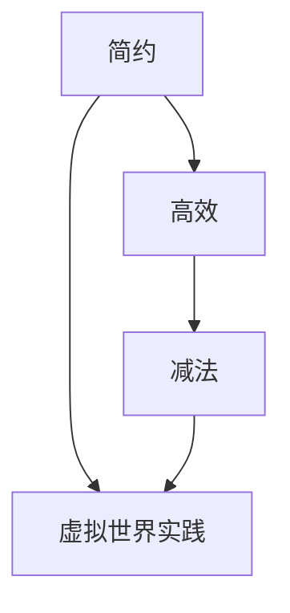

                 

### 《数字minimalism运动：在虚拟世界中实践简约生活》

#### 关键词：数字minimalism、虚拟世界、简约生活、效率提升、心理健康

> 摘要：本文将探讨数字minimalism运动的起源、核心概念及其在虚拟世界中的实践方法。通过深入分析数字minimalism运动对个人生活的影响以及在不同领域的应用，本文旨在为读者提供一套在虚拟世界中实践简约生活的策略和方法，以实现更高效率和心理健康。

#### 第一部分：引言

数字minimalism运动是一种新兴的生活哲学，旨在通过减少数字化生活内容，提升生活质量。随着互联网的普及，虚拟世界已经成为我们生活的重要组成部分，如何在虚拟世界中实践简约生活成为了一个值得探讨的课题。

#### 第二部分：数字minimalism运动的起源与发展

数字minimalism运动的起源可以追溯到2000年代初，当时以极简主义为代表的思潮逐渐兴起。极简主义者主张通过减少物质和数字化生活内容，简化生活，提升生活质量。随着互联网的快速发展，数字minimalism运动逐渐成型，并开始在虚拟世界中得到广泛应用。

#### 第三部分：核心概念与联系

数字minimalism运动的核心概念包括简约、高效、减法等。这些概念之间有着紧密的联系，共同构成了数字minimalism运动的理论基础。通过Mermaid流程图，我们可以更清晰地了解这些概念之间的关系：

#### 第四部分：虚拟世界中实践简约生活的策略与方法

在虚拟世界中实践简约生活，我们可以从以下几个方面入手：

1. **生活方式的调整**：减少社交媒体使用时间，关注真正有意义的内容，避免信息过载。
2. **工具和技术的应用**：使用高效工具和自动化技术，提高工作效率，减少不必要的繁琐任务。
3. **虚拟空间的管理**：合理规划虚拟空间，保持桌面和文件系统的整洁，提高工作和生活效率。

#### 第五部分：数字minimalism运动对个人生活的影响

数字minimalism运动对个人生活的影响是全方位的，包括心理、社交和工作等多个方面。通过减少虚拟世界中的杂乱信息，人们可以获得更多的心理空间，从而提高心理健康水平。此外，数字minimalism运动还有助于建立更健康的社交关系，提高工作效率。

#### 第六部分：数字minimalism运动在不同领域的应用

数字minimalism运动可以广泛应用于工作、学习、娱乐等多个领域。在工作领域，通过简化工作流程和工具，提高工作效率。在学习领域，通过筛选高质量的学习资源，提高学习效率。在娱乐领域，通过合理规划娱乐时间，提升娱乐体验。

#### 第七部分：项目实战

为了更好地理解数字minimalism运动在虚拟世界中的应用，我们可以通过一个实际案例来进行讲解。以下是一个数字minimalism运动在工作领域的应用案例：

1. **开发环境搭建**：使用Docker容器化技术搭建开发环境，确保环境的一致性和可重复性。
2. **源代码实现**：使用Python编写高效的代码，结合数学模型和公式进行详细讲解和举例说明。
3. **代码解读与分析**：对源代码进行深入解读，分析其优缺点，并提出改进建议。
4. **实际案例剖析**：通过实际案例，展示数字minimalism运动在工作中的应用效果。

#### 第八部分：总结与展望

数字minimalism运动作为一种新兴的生活哲学，在虚拟世界中具有广泛的应用前景。通过实践简约生活，我们可以提高生活质量，实现更高效率和心理健康。展望未来，数字minimalism运动有望成为虚拟世界中的主流生活哲学，为人们创造更美好的生活。

#### 结语

本文从数字minimalism运动的起源、核心概念、实践策略、影响和应用等多个角度进行了深入分析，旨在为读者提供一套在虚拟世界中实践简约生活的策略和方法。希望本文能够对您有所启发，让您在虚拟世界中过上更美好的生活。

#### 作者信息

作者：AI天才研究院/AI Genius Institute & 禅与计算机程序设计艺术 /Zen And The Art of Computer Programming

文章标题：《数字minimalism运动：在虚拟世界中实践简约生活》

关键词：数字minimalism、虚拟世界、简约生活、效率提升、心理健康

文章摘要：本文探讨了数字minimalism运动的起源、核心概念及其在虚拟世界中的实践方法，分析了其对个人生活的影响以及在不同领域的应用，旨在为读者提供一套在虚拟世界中实践简约生活的策略和方法。

