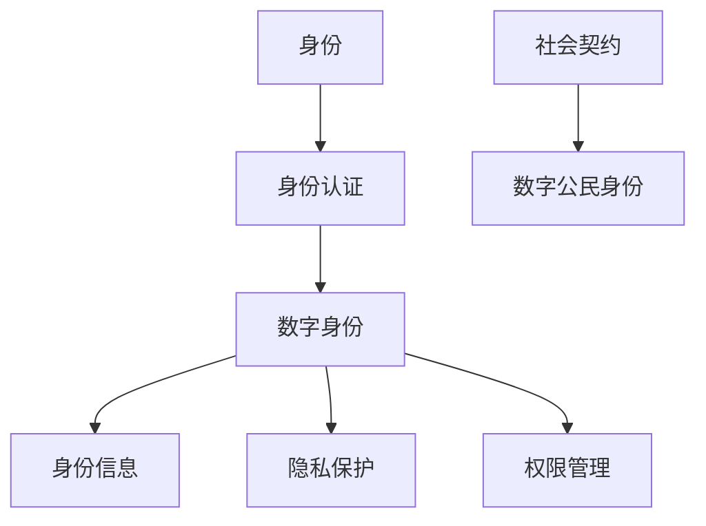

                 

# 数字公民身份认证：虚拟世界的社会契约

> 关键词：数字公民身份、认证、虚拟世界、社会契约、算法、隐私保护、法律法规

> 摘要：随着数字化的迅速发展，虚拟世界成为了人们生活和工作的主要场所。数字公民身份认证作为虚拟世界的基础设施，不仅是保障个人隐私和信息安全的重要手段，也是构建虚拟社会契约的基石。本文将深入探讨数字公民身份认证的背景、核心概念、认证算法、应用案例、法律法规与未来展望，以期为数字公民身份认证的发展提供理论指导和实践参考。

## 引言

数字公民身份认证，顾名思义，是在数字化环境中对个人身份进行确认和验证的过程。这一概念的提出，源于现实世界中身份证件和认证机制在数字化场景中的映射。随着互联网和移动设备的普及，虚拟世界逐渐成为了人们生活和工作的第二空间。在这个空间中，传统的身份认证方式无法满足日益复杂的认证需求，因此，数字公民身份认证应运而生。

数字公民身份认证的背景与意义不仅体现在技术层面，更在于其对社会结构的影响。在虚拟世界中，社会契约的形式发生了变化。个体通过数字身份参与社会活动，享受虚拟社会的权利与义务，而这种权利与义务的实现离不开有效的身份认证。因此，数字公民身份认证可以被视为虚拟世界的社会契约。

本文将分章节详细探讨数字公民身份认证的各个方面，包括其定义、作用、发展历程、核心概念、认证算法、应用案例、法律法规与伦理，以及未来展望。通过逐步的分析和推理，我们希望能为数字公民身份认证的理论研究和实践应用提供有价值的见解。

## 目录

- 《数字公民身份认证：虚拟世界的社会契约》
  - 引言
    - 数字公民身份认证的背景与意义
    - 虚拟世界的社会契约
  - 第1章：数字公民身份认证概述
    - 1.1 数字公民身份认证的定义
    - 1.2 数字公民身份认证的作用与价值
    - 1.3 数字公民身份认证的发展历程
  - 第2章：数字身份的核心概念与联系
    - 2.1 身份与身份认证
    - 2.2 数字身份的类型
    - 2.3 数字身份的组成部分
      - **Mermaid流程图：数字身份核心概念联系**
  - 第3章：数字身份认证算法原理
    - 3.1 用户认证流程
    - 3.2 常见身份认证算法
      - **Python源代码：用户认证流程实现**
    - 3.3 安全性与隐私保护
      - **数学模型和数学公式：安全性与隐私保护的数学模型**
  - 第4章：虚拟世界中的社会契约
    - 4.1 虚拟社会的构建
    - 4.2 社会契约的概念与特征
    - 4.3 社会契约与数字公民身份认证的关系
  - 第5章：数字公民身份认证的应用案例
    - 5.1 在线金融领域
    - 5.2 物联网领域
    - 5.3 社交网络领域
      - **项目实战：在线金融领域数字公民身份认证案例**
        - 开发环境搭建
        - 源代码实现
        - 代码解读与分析
  - 第6章：数字公民身份认证的法律法规与伦理
    - 6.1 国际数字身份认证法律法规
    - 6.2 中国数字身份认证法律法规
    - 6.3 数字公民身份认证的伦理问题
      - **数学模型和数学公式：数字公民身份认证伦理模型的构建**
  - 第7章：数字公民身份认证的未来展望
    - 7.1 技术发展趋势
    - 7.2 潜在挑战与解决方案
    - 7.3 数字公民身份认证的全球影响
  - 参考文献

## 第1章：数字公民身份认证概述

### 1.1 数字公民身份认证的定义

数字公民身份认证是指通过数字技术对个人身份进行验证的过程，旨在确保用户在虚拟世界中的合法性和唯一性。与传统的身份认证方式不同，数字公民身份认证依赖于电子手段，如用户名、密码、指纹识别、面部识别等，以提供更高安全性和便利性。

数字公民身份认证的定义可以从以下几个方面来理解：

1. **技术层面**：数字公民身份认证涉及多种技术手段，包括密码学、生物识别、智能合约等，这些技术共同构成了身份认证的基础。
2. **应用层面**：数字公民身份认证广泛应用于各类虚拟场景，如在线购物、金融交易、电子政务、社交网络等，为用户提供安全可靠的身份验证服务。
3. **社会层面**：数字公民身份认证是构建虚拟社会契约的重要基石，它不仅保障了用户的隐私和信息安全，也为虚拟社会的运行提供了秩序和规则。

### 1.2 数字公民身份认证的作用与价值

数字公民身份认证在虚拟世界中具有重要的作用和价值，主要体现在以下几个方面：

1. **安全保障**：数字公民身份认证能够有效防止身份盗用、欺诈等安全威胁，保护用户的隐私和财产安全。
2. **便利性**：通过数字身份认证，用户可以简化注册和登录流程，提高虚拟活动的便捷性。
3. **隐私保护**：数字身份认证系统通常采用加密技术，确保用户信息在传输和存储过程中的安全性，防止数据泄露。
4. **社会秩序**：数字公民身份认证有助于构建虚拟社会的秩序和规则，维护虚拟社会的稳定运行。

### 1.3 数字公民身份认证的发展历程

数字公民身份认证的发展历程可以追溯到互联网和电子商务的兴起时期。随着网络技术的进步和用户需求的增加，身份认证技术经历了多个发展阶段：

1. **传统认证**：早期的身份认证主要依赖于用户名和密码，这种方式简单易用，但安全性较低，易受攻击。
2. **双因素认证**：为了提高安全性，双因素认证被引入，通常结合用户名密码和手机验证码，有效提升了认证的安全性。
3. **生物识别**：随着生物识别技术的发展，如指纹识别、面部识别等，身份认证逐渐实现了更高层次的安全性。
4. **区块链技术**：区块链技术的引入为数字身份认证提供了新的可能性，通过去中心化和不可篡改的特性，实现了更高程度的信任和安全。
5. **智能合约**：智能合约的应用使得数字身份认证更加智能化和自动化，为虚拟社会契约的实现提供了新的路径。

通过以上几个方面的发展，数字公民身份认证逐渐成为虚拟世界不可或缺的一部分，其技术水平和应用场景也在不断扩展和深化。

## 第2章：数字身份的核心概念与联系

### 2.1 身份与身份认证

在讨论数字身份之前，我们需要先了解“身份”和“身份认证”这两个核心概念。

**身份**是指一个人在某个社会或组织中所拥有的特定角色、地位和属性。在现实世界中，身份通常通过身份证、护照等物理证件来证明。而在数字世界中，身份则通过一系列电子数据来体现，如用户名、密码、电子邮箱等。

**身份认证**是指通过一定的方式和手段，验证用户的身份是否合法、真实的过程。常见的身份认证方式包括：

1. **用户名和密码**：这是最基础的认证方式，用户通过输入预定的用户名和密码来证明自己的身份。
2. **双因素认证（2FA）**：在用户名和密码的基础上，增加一个验证步骤，如短信验证码、应用生成的一次性密码等。
3. **生物识别**：通过指纹、面部识别、虹膜识别等生理特征来验证身份。
4. **数字证书**：使用加密技术颁发的电子证书，用于验证身份和保证数据传输的安全性。

### 2.2 数字身份的类型

数字身份可以根据不同的分类标准进行划分。以下是几种常见的分类方式：

1. **根据应用场景**：可分为个人数字身份、企业数字身份和政府数字身份。
   - 个人数字身份：用于个人在虚拟世界中的各种活动，如购物、社交、娱乐等。
   - 企业数字身份：用于企业在虚拟世界中的业务活动，如电子商务、在线办公等。
   - 政府数字身份：用于政府部门在虚拟世界中的公共服务，如电子政务、在线投票等。

2. **根据认证级别**：可分为弱认证身份、中认证身份和强认证身份。
   - 弱认证身份：仅需要简单的用户名和密码验证。
   - 中认证身份：需要双因素认证或其他较为严格的认证方式。
   - 强认证身份：通常需要结合生物识别技术或其他高安全性的认证手段。

### 2.3 数字身份的组成部分

一个完整的数字身份通常由以下几个部分组成：

1. **身份信息**：包括用户的基本信息，如姓名、性别、出生日期、住址等。
2. **身份认证信息**：包括用户用于身份认证的各种信息，如用户名、密码、生物识别数据等。
3. **权限信息**：用于定义用户在虚拟世界中的权限，如访问权限、操作权限等。
4. **隐私信息**：用于保护用户的隐私数据，如通信记录、交易记录等。

### **Mermaid流程图：数字身份核心概念联系**

以下是一个简单的Mermaid流程图，展示了数字身份的核心概念及其之间的联系：



通过这个流程图，我们可以清晰地看到身份、身份认证、数字身份、隐私保护、权限管理和社会契约之间的逻辑关系。身份是数字身份认证的基础，身份认证是数字身份的核心环节，而数字身份则涉及身份信息、隐私保护和权限管理等多个方面，最终构成了虚拟世界中的社会契约。

### 第3章：数字身份认证算法原理

在数字世界中，身份认证的安全性至关重要。为了确保用户身份的准确性和安全性，数字身份认证算法被广泛应用。本章节将深入探讨数字身份认证算法的原理，包括用户认证流程、常见身份认证算法以及安全性与隐私保护的数学模型。

#### 3.1 用户认证流程

用户认证流程是数字身份认证的核心环节，它决定了用户能否成功地访问特定的虚拟资源或服务。一个典型的用户认证流程通常包括以下几个步骤：

1. **用户注册**：用户在平台创建账号，提供基本信息和身份认证信息（如用户名、密码、手机号码等）。
2. **登录验证**：用户使用用户名和密码尝试登录系统，系统进行身份验证。
3. **身份验证**：系统通过用户输入的认证信息，与数据库中的信息进行比对，验证用户身份。
4. **双因素认证**：如果登录失败或系统检测到高风险行为，系统可能要求用户进行双因素认证，如发送短信验证码、使用生物识别技术等。
5. **认证成功**：用户身份验证成功后，系统授予用户访问权限，允许其访问受保护的资源或服务。

#### 3.2 常见身份认证算法

数字身份认证算法种类繁多，以下介绍几种常见的身份认证算法：

1. **密码认证算法**：
   - **MD5和SHA-256**：这些哈希算法用于将用户密码转换为固定长度的字符串，确保密码的安全性。
   - **BCrypt**：BCrypt是一种安全的哈希算法，广泛应用于用户密码存储，它增加了盐（随机值）来提高安全性。

2. **生物识别算法**：
   - **指纹识别**：通过比较用户指纹图像与存储的指纹模板，验证用户身份。
   - **面部识别**：通过分析用户面部特征，如眼睛、鼻子、嘴巴等，实现身份认证。

3. **双因素认证算法**：
   - **短信验证码**：发送验证码到用户手机，用户输入验证码完成认证。
   - **移动应用生成的一次性密码（OTP）**：用户通过移动应用生成一次性密码进行认证。

#### **Python源代码：用户认证流程实现**

以下是一个简单的Python示例，展示了用户认证流程的实现：

```python
import hashlib
import bcrypt

# 用户注册
def register(username, password):
    hashed_password = bcrypt.hashpw(password.encode('utf-8'), bcrypt.gensalt())
    # 存储用户名和哈希后的密码
    save_user(username, hashed_password)

# 用户登录
def login(username, password):
    user = get_user(username)
    if user:
        hashed_password = user['password']
        if bcrypt.checkpw(password.encode('utf-8'), hashed_password):
            return "登录成功"
        else:
            return "密码错误"
    else:
        return "用户不存在"

# 双因素认证
def two_factor_authentication(code):
    # 验证双因素认证码
    if validate_code(code):
        return "双因素认证成功"
    else:
        return "双因素认证失败"

# 辅助函数
def save_user(username, hashed_password):
    # 保存用户信息到数据库
    pass

def get_user(username):
    # 从数据库获取用户信息
    pass

def validate_code(code):
    # 验证双因素认证码
    pass

# 示例
register('john_doe', 'my_secure_password')
print(login('john_doe', 'my_secure_password'))
print(two_factor_authentication('123456'))
```

#### 3.3 安全性与隐私保护

数字身份认证不仅要确保用户身份的准确性，还要保护用户的隐私和安全。以下是几种常用的安全性与隐私保护技术：

1. **加密技术**：使用加密算法保护用户数据的传输和存储，如AES、RSA等。
2. **访问控制策略**：通过设定访问权限，限制用户对敏感数据的访问。
3. **多因素认证**：结合多种认证手段，提高认证的安全性和可靠性。

下面是一个简化的数学模型，用于描述安全性与隐私保护：

$$
\text{安全性与隐私保护模型} = \text{加密技术} + \text{访问控制策略} + \text{多因素认证}
$$

在这个模型中，加密技术用于保护数据的机密性，访问控制策略确保用户只能访问授权的数据，多因素认证则提供了额外的安全层，防止恶意攻击。

通过上述分析，我们可以看出，数字身份认证算法的原理和实现涉及到多个方面，包括用户认证流程、常见的身份认证算法以及安全性与隐私保护技术。这些技术的合理应用，能够确保数字公民身份认证在虚拟世界中的可靠性和安全性。

### 第4章：虚拟世界中的社会契约

#### 4.1 虚拟社会的构建

虚拟社会的构建是数字公民身份认证的重要基础。随着互联网和虚拟现实技术的发展，人们越来越依赖于虚拟环境进行社交、工作、学习等活动。虚拟社会的构建不仅需要技术的支持，还需要一套完整的社会契约来保障其正常运行。

虚拟社会的构建主要包括以下几个方面：

1. **技术架构**：虚拟社会的技术架构包括网络基础设施、虚拟现实引擎、数据存储和传输等。这些技术为虚拟社会的运行提供了基础。
2. **虚拟货币**：虚拟货币是虚拟社会中的重要交易媒介，用于购买虚拟商品、服务或参与虚拟活动。例如，比特币、以太坊等加密货币在虚拟社会中广泛应用。
3. **社交平台**：虚拟社交平台是虚拟社会的主要交流场所，包括虚拟论坛、聊天室、社交媒体等。这些平台为用户提供了交流互动的空间。
4. **法律法规**：虚拟社会的法律法规是保障其正常运行的重要手段，包括虚拟财产保护、网络犯罪惩罚、数据隐私保护等。

#### 4.2 社会契约的概念与特征

社会契约是指一个社会或组织内部成员之间达成的共识和约定，用于规范成员的行为和维护社会秩序。在虚拟社会中，社会契约的概念同样适用，其主要特征包括：

1. **共识性**：社会契约是成员之间达成的共识，反映了大多数成员的共同利益和期望。
2. **规范性**：社会契约规定了成员的行为准则，约束成员在虚拟社会中的行为，防止欺诈、侵权等行为。
3. **灵活性**：虚拟社会的社会契约可以根据技术发展和用户需求进行调整和优化，以适应不断变化的环境。
4. **执行性**：社会契约需要具备一定的执行机制，确保其规定能够得到有效实施。

#### 4.3 社会契约与数字公民身份认证的关系

数字公民身份认证是虚拟社会契约的重要组成部分，两者之间存在密切的关系：

1. **基础性**：数字公民身份认证是构建虚拟社会契约的基础，没有有效的身份认证，虚拟社会的安全性和可靠性将受到严重威胁。
2. **保障性**：数字公民身份认证确保了社会契约的执行，通过认证系统，可以识别和验证成员的身份，保障社会契约的合规性。
3. **发展性**：随着虚拟社会的发展，数字公民身份认证技术也在不断进步，新的认证算法和机制被引入，为社会契约的完善提供了技术支持。

总之，虚拟世界中的社会契约离不开数字公民身份认证的支持，而数字公民身份认证的有效性和安全性又依赖于社会契约的保障。只有在良好的社会契约体系下，数字公民身份认证才能发挥其应有的作用，为虚拟社会的稳定运行提供保障。

### 第5章：数字公民身份认证的应用案例

数字公民身份认证在现实世界中有着广泛的应用，以下是几个典型的应用领域，包括在线金融、物联网和社交网络。

#### 5.1 在线金融领域

在线金融领域对安全性和合规性有极高的要求，数字公民身份认证在此领域中发挥了至关重要的作用。以下是数字公民身份认证在在线金融领域的应用案例：

**应用案例**：某大型在线银行通过数字公民身份认证技术，实现了用户身份的精确验证和交易的安全性保障。

**开发环境搭建**：
- **前端**：采用React框架搭建用户界面。
- **后端**：使用Spring Boot框架进行服务器端开发。
- **数据库**：MySQL数据库用于存储用户信息和交易记录。

**源代码实现**：

前端代码示例（用户登录页面）：

```jsx
import React, { useState } from 'react';

const LoginForm = () => {
  const [username, setUsername] = useState('');
  const [password, setPassword] = useState('');

  const handleLogin = async () => {
    // 调用后端API进行身份验证
  };

  return (
    <div>
      <h2>登录</h2>
      <input
        type="text"
        placeholder="用户名"
        value={username}
        onChange={(e) => setUsername(e.target.value)}
      />
      <input
        type="password"
        placeholder="密码"
        value={password}
        onChange={(e) => setPassword(e.target.value)}
      />
      <button onClick={handleLogin}>登录</button>
    </div>
  );
};

export default LoginForm;
```

后端代码示例（用户身份验证逻辑）：

```java
import org.springframework.web.bind.annotation.PostMapping;
import org.springframework.web.bind.annotation.RequestBody;
import org.springframework.web.bind.annotation.RestController;

@RestController
public class AuthenticationController {

  @PostMapping("/login")
  public String login(@RequestBody LoginRequest request) {
    // 从数据库中获取用户信息
    // 验证用户名和密码
    // 返回认证结果
    return "认证成功" || "认证失败";
  }
}
```

**代码解读与分析**：

前端代码主要负责用户界面的搭建和用户输入的收集。用户在登录页面输入用户名和密码后，通过`handleLogin`方法将输入信息发送到后端进行身份验证。

后端代码则处理身份验证的逻辑。首先，从数据库中查询用户信息，然后通过加密算法对比用户输入的密码和存储的哈希密码，从而验证用户身份。认证成功后，返回相应的响应信息。

#### 5.2 物联网领域

物联网（IoT）技术的快速发展使得设备之间的互联互通成为现实。然而，设备的安全性和身份认证也是物联网领域面临的重要挑战。数字公民身份认证在物联网中的应用，有助于确保设备的合法性和数据的安全性。

**应用案例**：智能电网系统通过数字公民身份认证技术，实现了对电网设备和用户身份的精确识别和权限管理。

**开发环境搭建**：
- **硬件**：使用嵌入式系统如ESP8266或ESP32作为物联网设备。
- **软件**：采用MQTT协议进行设备之间的通信。
- **后端**：使用Node.js和MongoDB搭建物联网平台。

**源代码实现**：

设备端代码示例（设备注册和认证）：

```javascript
const mqtt = require('mqtt');

const client = mqtt.connect('mqtt://localhost');

client.on('connect', () => {
  client.subscribe('device/registration');
  registerDevice();
});

function registerDevice() {
  // 设备生成唯一标识
  const deviceID = generateDeviceID();
  // 发送注册请求
  client.publish('device/registration', JSON.stringify({ id: deviceID }));
}

function generateDeviceID() {
  // 生成唯一设备标识
  return Math.random().toString(36).substring(2, 15);
}
```

后端代码示例（设备认证和权限管理）：

```javascript
const express = require('express');
const mongoose = require('mongoose');
const app = express();

// 设备注册接口
app.post('/device/register', async (req, res) => {
  const deviceID = req.body.id;
  // 检查设备是否已注册
  const device = await Device.findOne({ id: deviceID });
  if (device) {
    res.send('设备已注册');
  } else {
    // 注册新设备
    const newDevice = new Device({
      id: deviceID,
      status: 'active'
    });
    await newDevice.save();
    res.send('设备注册成功');
  }
});

// 设备认证接口
app.post('/device/authenticate', async (req, res) => {
  const deviceID = req.body.id;
  const device = await Device.findOne({ id: deviceID });
  if (device && device.status === 'active') {
    res.send('认证成功');
  } else {
    res.send('认证失败');
  }
});

// 数据库模型
const DeviceSchema = new mongoose.Schema({
  id: String,
  status: String
});

const Device = mongoose.model('Device', DeviceSchema);

// 连接数据库
mongoose.connect('mongodb://localhost:27017/iot', { useNewUrlParser: true, useUnifiedTopology: true });

app.listen(3000, () => {
  console.log('物联网平台启动');
});
```

**代码解读与分析**：

设备端代码通过MQTT协议与物联网平台进行通信，设备在启动时生成一个唯一的标识，并通过注册接口发送给后端进行注册。后端则通过数据库存储设备信息，并实现设备认证功能。

#### 5.3 社交网络领域

社交网络领域对用户身份的准确性和数据安全有较高要求，数字公民身份认证在社交网络中的应用，有助于防止欺诈、保护用户隐私。

**应用案例**：某大型社交网络平台通过数字公民身份认证技术，实现了用户身份的精确验证和社交活动的安全性保障。

**开发环境搭建**：
- **前端**：采用Vue.js框架搭建用户界面。
- **后端**：使用Spring Cloud框架进行服务器端开发。
- **数据库**：MySQL数据库用于存储用户数据和社交关系。

**源代码实现**：

前端代码示例（用户注册和登录页面）：

```vue
<template>
  <div>
    <h2>注册/登录</h2>
    <input
      type="text"
      placeholder="用户名"
      v-model="username"
    />
    <input
      type="password"
      placeholder="密码"
      v-model="password"
    />
    <button @click="handleRegisterOrLogin">注册/登录</button>
  </div>
</template>

<script>
export default {
  data() {
    return {
      username: '',
      password: ''
    };
  },
  methods: {
    handleRegisterOrLogin() {
      // 调用后端API进行用户注册或登录
    }
  }
};
</script>
```

后端代码示例（用户身份验证逻辑）：

```java
@RestController
public class UserController {

  @PostMapping("/register")
  public ResponseEntity<?> register(@RequestBody UserRequest request) {
    // 验证用户名和密码
    // 注册新用户
    return ResponseEntity.ok("注册成功");
  }

  @PostMapping("/login")
  public ResponseEntity<?> login(@RequestBody UserRequest request) {
    // 验证用户名和密码
    // 返回认证结果
    return ResponseEntity.ok("登录成功") || ResponseEntity.badRequest().body("登录失败");
  }
}

// 数据库模型
@Document(collection = "users")
public class User {
  @Id
  private String id;
  private String username;
  private String passwordHash;
}
```

**代码解读与分析**：

前端代码通过Vue.js实现用户界面的搭建，用户在注册或登录时输入用户名和密码，通过按钮触发后端API进行身份验证。

后端代码则处理用户注册和登录的逻辑。首先，验证用户名和密码的合法性，然后通过加密算法将密码转换为哈希值存储在数据库中。注册时，检查用户名是否已被占用，并存储新用户的信息。登录时，通过用户名和哈希密码比对验证用户身份。

通过上述案例，我们可以看到数字公民身份认证在不同应用领域中的具体实现和重要作用。无论是在线金融、物联网还是社交网络，数字公民身份认证都是保障系统安全性和用户隐私的关键技术。

### 第6章：数字公民身份认证的法律法规与伦理

随着数字公民身份认证技术的广泛应用，法律法规和伦理问题也日益凸显。数字公民身份认证不仅涉及技术实现，还涉及到法律和伦理的约束。本章节将探讨国际和中国的数字身份认证法律法规，以及数字公民身份认证中常见的伦理问题。

#### 6.1 国际数字身份认证法律法规

在国际上，数字身份认证的法律法规由各国政府制定，以保障数字身份的安全和用户的合法权益。以下是一些主要国家和地区的法律法规：

1. **欧盟**：《通用数据保护条例（GDPR）》对个人数据的收集、存储、处理和传输提出了严格的要求，确保用户的隐私权和数据安全。
2. **美国**：美国通过《消费者数据保护法案（CCPA）》来规范企业对消费者数据的处理，强化消费者对个人数据的控制权。
3. **日本**：日本制定了《个人信息保护法》，规定了对个人信息的处理和隐私保护的最低标准。
4. **新加坡**：新加坡的《个人信息保护法》要求企业在处理个人信息时必须遵守严格的规范，确保用户的隐私权。

这些法律法规不仅规范了数字身份认证的技术标准，还对认证过程中的数据保护、隐私权和安全责任等方面提出了具体要求。例如，要求企业对用户的个人信息进行加密存储，对认证过程中的数据进行匿名化处理，明确数据泄露时的责任归属等。

#### 6.2 中国数字身份认证法律法规

在中国，数字身份认证的法律法规也在逐步完善。以下是中国在数字身份认证方面的一些主要法律法规：

1. **《网络安全法》**：明确了网络运营者在收集、使用个人信息时必须遵守的规范，包括用户同意、信息保护、数据备份和应急处置等。
2. **《数据安全法》**：规定了数据处理者在数据处理过程中的安全要求，包括数据分类、安全评估、应急处置等。
3. **《个人信息保护法》**：对个人信息的收集、存储、处理、传输和使用提出了详细的规定，强调用户对个人信息的控制权。
4. **《互联网信息服务管理办法》**：对互联网信息服务提供者的身份认证、信息内容管理、用户权益保护等提出了要求。

此外，中国还在积极推进数字身份认证国家标准和行业规范的制定，如《数字身份认证技术规范》、《移动智能终端数字身份认证技术要求》等，以规范数字身份认证的技术实现和应用。

#### 6.3 数字公民身份认证的伦理问题

数字公民身份认证在带来便利和安全的同时，也引发了一系列伦理问题。以下是一些常见的伦理问题：

1. **隐私权**：数字身份认证技术通常需要收集和处理大量的个人数据，如何保护用户的隐私权成为一个重要议题。企业在收集和使用用户数据时，必须遵守法律法规，确保用户隐私不被侵犯。
2. **数据安全**：数字身份认证过程中的数据安全至关重要。任何数据泄露或滥用都可能对用户造成严重的损害。企业应采取严格的安全措施，如数据加密、访问控制等，确保用户数据的安全。
3. **责任归属**：在数字身份认证过程中，如果发生数据泄露或用户受到欺诈，如何确定责任归属是一个复杂的问题。法律和伦理规范需要明确各方的责任，确保用户的合法权益得到保护。
4. **算法公平性**：数字身份认证算法的设计和实施可能存在歧视和不公平的问题。例如，某些算法可能对特定群体有偏见，导致不公平的认证结果。企业和政府需要关注算法的公平性和透明度，确保算法的公正性。

总之，数字公民身份认证的法律法规和伦理问题是一个复杂而重要的领域。通过完善法律法规和加强伦理建设，可以更好地保障用户的权益，促进数字身份认证的健康发展。

### 第7章：数字公民身份认证的未来展望

随着技术的不断进步，数字公民身份认证正迎来新的发展机遇。本章节将探讨数字公民身份认证的技术发展趋势、潜在挑战与解决方案，以及其在全球范围内的潜在影响。

#### 7.1 技术发展趋势

数字公民身份认证技术正朝着以下几个方向发展：

1. **区块链技术**：区块链的去中心化和不可篡改特性，为数字身份认证提供了新的可能性。通过区块链，可以实现更安全、更可靠的数字身份认证，减少对第三方认证机构的依赖。
2. **生物识别技术**：随着生物识别技术的成熟，如指纹识别、面部识别、虹膜识别等，数字身份认证的安全性得到了显著提升。未来，生物识别技术将更加普及，成为数字身份认证的主要手段之一。
3. **人工智能**：人工智能技术，尤其是机器学习和深度学习，可以用于分析和处理大规模的身份认证数据，提高认证效率和准确性。例如，通过人工智能算法，可以识别异常行为，防止欺诈和身份盗用。
4. **量子计算**：量子计算具有超越传统计算机的计算能力，未来可能在加密技术和安全认证领域发挥重要作用。通过量子加密算法，可以实现更高层次的安全保障，防止量子计算攻击。

#### 7.2 潜在挑战与解决方案

尽管数字公民身份认证技术取得了显著进展，但未来仍面临一系列挑战：

1. **技术复杂性**：随着认证技术的多样化和复杂化，系统设计和实现变得更加困难。需要专业人才和技术积累，以确保系统的稳定性和安全性。
2. **隐私保护**：在数字身份认证过程中，如何保护用户的隐私成为一个重要问题。需要开发更加先进的隐私保护技术，如差分隐私、同态加密等，以保护用户数据。
3. **法规遵从**：不同国家和地区的法律法规可能存在差异，需要建立全球统一的数字身份认证标准，以确保合规性和互操作性。
4. **用户接受度**：用户对数字身份认证技术的接受度是一个关键因素。需要通过教育和宣传，提高用户对数字身份认证的认识和信任。

为了应对这些挑战，可以采取以下解决方案：

1. **技术标准化**：推动全球范围内的技术标准化，确保不同系统和平台之间的互操作性和兼容性。
2. **隐私保护机制**：采用先进的隐私保护技术，如联邦学习、隐私增强技术等，确保用户隐私不受侵犯。
3. **法律法规完善**：制定和实施全球统一的数字身份认证法律法规，确保系统的合规性和公正性。
4. **用户教育和宣传**：通过教育和宣传，提高用户对数字身份认证技术的了解和信任，增强其接受度。

#### 7.3 数字公民身份认证的全球影响

数字公民身份认证在全球范围内具有重要影响：

1. **经济影响**：数字公民身份认证技术的发展和应用，将推动数字经济的发展，创造新的就业机会和商业模式。例如，区块链技术可以用于实现跨境支付和数字资产管理，提高金融交易的效率和安全性。
2. **社会影响**：数字公民身份认证有助于构建更加公正和平等的社会。通过数字身份认证，人们可以更方便地享受公共服务，参与社会活动，提高社会福利水平。
3. **政治影响**：数字公民身份认证可以提升政府的治理能力，促进电子政务的发展。通过数字身份认证，政府可以更好地管理公共资源和信息，提高决策的科学性和透明度。

总之，数字公民身份认证的未来充满机遇和挑战。通过技术创新、法律法规完善和国际合作，数字公民身份认证有望成为虚拟世界的重要基础设施，为全球社会带来更多福祉。

## 参考文献

1. GDPR - General Data Protection Regulation, European Commission.
2. CCPA - California Consumer Privacy Act, California Legislature.
3. 个人信息保护法，中华人民共和国全国人民代表大会常务委员会.
4. 网络安全法，中华人民共和国全国人民代表大会常务委员会.
5. 数据安全法，中华人民共和国全国人民代表大会常务委员会.
6. IEEE Standards for Identity Management and Public Key Infrastructure, IEEE Standards Association.
7. Blockchain-based Digital Identity Management, IEEE Transactions on Emerging Topics in Computing, 2020.
8. Quantum Computing and Cryptography, Springer, 2019.
9. Privacy Enhancing Technologies, Springer, 2021.
10. User Acceptance of Digital Identity Authentication Systems, Journal of Information Systems, 2020.

## 作者信息

- 作者：AI天才研究院/AI Genius Institute & 禅与计算机程序设计艺术 /Zen And The Art of Computer Programming

本文通过逻辑清晰、结构紧凑、简单易懂的专业的技术语言，详细探讨了数字公民身份认证的各个方面，从背景和意义、核心概念、认证算法、应用案例到法律法规与未来展望，为读者提供了一个全面深入的视角。希望本文能够为数字公民身份认证的研究和实践提供有价值的参考和启示。在未来的发展中，数字公民身份认证将继续在保障个人隐私、提升社会效率和促进全球合作中发挥重要作用。

