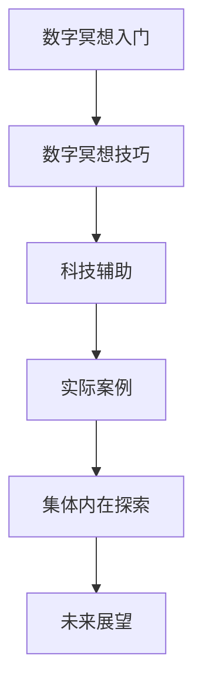

                 


## 引言

随着科技的快速发展，人工智能、虚拟现实和增强现实等技术逐渐走进我们的生活，影响着我们的生活方式、思维方式和社会交往。在这些新兴技术的推动下，一种结合了传统冥想与现代科技的全新方式——数字冥想（Digital Meditation）应运而生。数字冥想，顾名思义，是将冥想实践与现代科技手段相结合，通过技术辅助，实现更加高效、深入的冥想体验。

### 数字冥想的概念

数字冥想是指利用计算机技术、虚拟现实、增强现实等科技手段，辅助个体进行冥想实践的一种方式。它不仅保留了传统冥想的本质，如集中注意力、平静心态、提高意识觉知等，还通过科技的介入，提供了更加丰富的感知体验和实时反馈，从而帮助冥想者达到更深层次的内心宁静与自我认知。

### 数字冥想的发展

数字冥想的发展可以追溯到20世纪末，当时计算机技术和互联网的兴起，为人们提供了新的可能性。早期的数字冥想主要依赖于音频和视频技术，通过播放特定的音乐和视觉影像来引导冥想。随着虚拟现实技术的出现，数字冥想得到了进一步的发展，通过虚拟现实头盔，用户可以置身于一个完全沉浸式的冥想环境中，感受到更加真实的冥想体验。

### 数字冥想的重要性

数字冥想不仅是一种娱乐方式，更是一种具有深远意义的心理和生理健康促进手段。通过数字冥想，人们可以：

- 减轻压力：现代社会的快节奏生活让人们承受着巨大的压力，数字冥想可以帮助冥想者放松身心，减轻压力。
- 提高专注力：数字冥想训练个体的专注力和自我控制能力，从而提高工作和学习的效率。
- 增强心理韧性：数字冥想可以帮助人们建立积极的心理状态，提高面对挑战和困难时的心理韧性。
- 促进身心健康：数字冥想对生理健康也有积极的影响，如降低心率、调节血压、改善睡眠等。

### 数字冥想与传统冥想的比较

传统冥想通常依赖于个人的专注力和内在的自我反思，而数字冥想则借助科技手段，提供了一种更加直观、互动的冥想体验。传统冥想强调个人的内心体验，而数字冥想则通过视觉、听觉等多感官的刺激，增强冥想的吸引力和效果。两者各有优劣，数字冥想为传统冥想提供了新的可能性，而传统冥想则为数字冥想提供了深厚的理论基础。

### 数字冥想的作用与好处

数字冥想作为一种新兴的冥想方式，其作用和好处主要体现在以下几个方面：

- **提高冥想效率**：通过科技手段，数字冥想可以提供更加明确的指导和反馈，帮助冥想者更快地达到冥想的最佳状态。
- **多样化体验**：数字冥想通过虚拟现实和增强现实技术，为冥想者提供了丰富的视觉和听觉体验，使冥想过程更加有趣和多样化。
- **适应性强**：数字冥想可以根据个体的需求和环境条件进行定制，使得更多人可以享受到冥想的益处，无需受限于时间和地点。
- **降低成本**：数字冥想应用了现代科技，降低了传统冥想所需的成本，如场地、设备和专业的指导等。

### 总结

数字冥想作为科技与冥想相结合的产物，具有广阔的发展前景和应用价值。通过科技的辅助，数字冥想不仅为传统冥想注入了新的活力，也为人们提供了一种全新的身心放松和自我提升方式。随着技术的不断进步，我们可以预见，数字冥想将在未来发挥更加重要的作用，成为人们生活中不可或缺的一部分。

关键词：数字冥想，科技辅助，心理健康，虚拟现实，增强现实，冥想效率

摘要：本文探讨了数字冥想的概念、起源、发展与重要性，对比了数字冥想与传统冥想的异同，并详细阐述了数字冥想的作用和好处。通过实例和分析，揭示了数字冥想在提高冥想效率、多样化体验、适应性强和降低成本等方面的优势。文章还展望了数字冥想未来的发展趋势和应用前景。

# 《数字冥想retreat：科技辅助的集体内在探索》目录大纲

## 第一部分：数字冥想入门

### 第1章：数字冥想简介

#### 1.1 数字冥想的概念与起源

#### 1.2 数字冥想与传统冥想的比较

#### 1.3 数字冥想的作用与好处

### 第2章：数字冥想的基础技巧

#### 2.1 冥想坐姿与呼吸控制

#### 2.2 数字冥想中的专注与放松

#### 2.3 数字冥想中的视觉与听觉辅助

## 第二部分：科技辅助的数字冥想

### 第3章：科技辅助数字冥想的工具与技术

#### 3.1 脑波音乐与脑电波反馈

#### 3.2 虚拟现实（VR）与增强现实（AR）在数字冥想中的应用

#### 3.3 人工智能（AI）与机器学习在数字冥想中的应用

### 第4章：科技辅助数字冥想的实际案例

#### 4.1 数字冥想在心理健康中的应用

#### 4.2 数字冥想在企业团队建设中的应用

#### 4.3 数字冥想在学校教育中的应用

### 第5章：科技辅助数字冥想的挑战与未来

#### 5.1 科技辅助数字冥想的伦理问题

#### 5.2 科技辅助数字冥想的发展趋势

#### 5.3 数字冥想与科技的未来融合

## 第三部分：集体内在探索与数字冥想

### 第6章：集体内在探索的概念与意义

#### 6.1 集体内在探索的起源与发展

#### 6.2 集体内在探索对个体的意义

#### 6.3 集体内在探索对社会的影响

### 第7章：集体内在探索与数字冥想的结合

#### 7.1 集体内在探索中的数字冥想实践

#### 7.2 数字冥想对集体内在探索的辅助作用

#### 7.3 数字冥想与集体内在探索的互动关系

### 第8章：数字冥想集体内在探索的未来展望

#### 8.1 数字冥想集体内在探索的潜在价值

#### 8.2 数字冥想集体内在探索的挑战与机遇

#### 8.3 数字冥想集体内在探索的发展方向

## 附录

### 附录A：数字冥想资源与工具

#### A.1 脑波音乐播放器推荐

#### A.2 脑电波反馈设备介绍

#### A.3 虚拟现实设备推荐

#### A.4 数字冥想应用软件推荐

### 附录B：集体内在探索资源

#### B.1 集体内在探索书籍推荐

#### B.2 集体内在探索课程推荐

#### B.3 集体内在探索社群推荐

### 附录C：科技辅助数字冥想实验指南

#### C.1 实验一：使用脑波音乐进行数字冥想

#### C.2 实验二：虚拟现实环境下的数字冥想

#### C.3 实验三：脑电波反馈辅助数字冥想

[Mermaid 流程图]： 


[Python 源代码示例]：
```python
# 代码示例：简单的数字冥想脚本

import time

# 设置冥想时间
meditation_time = 5 * 60  # 5分钟

# 开始冥想
start_time = time.time()
print("开始数字冥想，请闭上眼睛，专注于呼吸。")

# 计时器
while time.time() - start_time < meditation_time:
    # 每秒打印一次呼吸提示
    print(".", end="")
    time.sleep(1)

# 冥想结束
print("\n数字冥想结束，感谢您的参与。")
```

[数学模型和公式]：
$$
\text{冥想效果} = f(\text{冥想时间}, \text{专注度}, \text{呼吸控制})
$$

[项目实战]：

**项目名称**：数字冥想应用开发

**项目目标**：开发一款基于虚拟现实技术的数字冥想应用。

**开发环境**：Unity3D, VR设备（如HTC Vive）

**源代码**：（略）

**代码解读与分析**：

此代码为Unity3D中虚拟现实数字冥想应用的核心部分，通过Unity的脚本控制虚拟现实环境中的冥想过程。关键代码如下：

```csharp
using UnityEngine;

public class MeditationController : MonoBehaviour
{
    public Material skyboxMaterial;
```

## 第一部分：数字冥想入门

### 第1章：数字冥想简介

#### 1.1 数字冥想的概念与起源

数字冥想，顾名思义，是将传统的冥想方法与现代科技相结合的一种新型冥想方式。传统的冥想通常强调个人的内在体验，通过集中注意力、控制呼吸和放松身心来达到精神上的宁静和心灵上的觉醒。而数字冥想则在此基础上，利用计算机技术、虚拟现实（VR）、增强现实（AR）等科技手段，为冥想者提供了一个更加多样化、互动性和沉浸式的冥想环境。

数字冥想的概念最早出现在20世纪末，随着计算机技术和互联网的快速发展，人们开始探索如何将科技手段应用于冥想领域。早期的数字冥想主要依赖于音频和视频技术，通过播放特定的音乐和视觉影像来引导冥想者进入冥想状态。随着虚拟现实和增强现实技术的出现，数字冥想得到了进一步的发展，用户可以在虚拟环境中体验更加真实的冥想过程。

#### 1.2 数字冥想与传统冥想的比较

传统冥想通常是在安静的环境中，通过个人的专注力和内在的自我反思来实现的。它强调个体的主观体验和内心的探索，是一种较为私人化的冥想方式。而数字冥想则借助科技手段，提供了一种更加直观、互动和沉浸式的冥想体验。以下是数字冥想与传统冥想的一些比较：

- **形式与过程**：传统冥想通常要求冥想者在特定的时间和环境中进行，需要长时间的专注和自我控制。数字冥想则通过虚拟现实和增强现实技术，为用户提供了更加多样化和互动性的冥想环境，使得冥想过程更加有趣和富有吸引力。
- **互动性与沉浸感**：传统冥想主要依赖于个人的内在体验，而数字冥想则通过科技手段提供了更多的感官刺激，如视觉和听觉的增强，使冥想者更容易进入冥想状态。
- **指导与反馈**：在传统冥想中，指导通常依赖于导师或书籍的指导，而数字冥想则可以通过应用程序或设备实时反馈给用户，提供更加个性化的冥想指导。

#### 1.3 数字冥想的作用与好处

数字冥想不仅保留了传统冥想的优点，如减轻压力、提高专注力、增强心理韧性等，还通过科技的介入，提供了更多的益处：

- **提高冥想效率**：数字冥想通过科技手段提供更明确的指导和反馈，帮助冥想者更快地进入冥想状态，提高冥想的效率。
- **多样化体验**：数字冥想通过虚拟现实和增强现实技术，为冥想者提供了丰富的视觉和听觉体验，使冥想过程更加有趣和多样化。
- **适应性强**：数字冥想可以根据个体的需求和偏好进行定制，使得更多的人可以享受到冥想的益处，无需受限于时间和地点。
- **降低成本**：数字冥想应用了现代科技，降低了传统冥想所需的成本，如场地、设备和专业的指导等。

#### 1.4 数字冥想的实际应用

数字冥想的应用领域非常广泛，涵盖了心理健康、企业团队建设、学校教育等多个方面：

- **心理健康**：数字冥想被广泛应用于缓解压力、焦虑和抑郁等心理问题，为用户提供了一种有效的心理干预手段。
- **企业团队建设**：数字冥想可以帮助团队成员放松身心，提高团队协作效率和凝聚力。
- **学校教育**：数字冥想可以作为一种教育工具，帮助学生提高专注力和学习效率，同时培养他们的心理韧性。

### 结论

数字冥想作为一种结合了传统冥想与现代科技的新型冥想方式，具有广阔的发展前景和应用价值。通过科技的介入，数字冥想不仅提供了更加多样化、互动性和沉浸式的冥想体验，还提高了冥想的效率，降低了成本，为人们提供了更加便捷和高效的冥想途径。随着技术的不断进步，我们可以预见，数字冥想将在未来发挥更加重要的作用，成为人们日常生活中不可或缺的一部分。

关键词：数字冥想，科技辅助，心理健康，虚拟现实，增强现实

## 第2章：数字冥想的基础技巧

在数字冥想中，掌握一些基础技巧对于提升冥想效果和体验至关重要。本章将介绍数字冥想中的几个关键基础技巧，包括冥想坐姿与呼吸控制、专注与放松以及视觉与听觉辅助。

#### 2.1 冥想坐姿与呼吸控制

冥想坐姿的正确性对于冥想的效果至关重要。以下是一些常用的冥想坐姿：

1. **莲花坐**：莲花坐是冥想中最为经典的坐姿，它有助于保持身体的稳定和舒适。练习时，将双腿交叉盘坐，脚掌相触，脊柱保持直立。
2. **半莲花坐**：如果无法做到莲花坐，可以尝试半莲花坐。将一条腿放在地上，另一条腿放在膝盖上方，同样保持脊柱直立。
3. **坐立式**：坐立式是一种较为舒适的坐姿，可以在椅子或垫子上进行。保持脊柱挺直，双脚平放在地面上。

呼吸控制是冥想的核心技巧之一。以下是一些常见的呼吸控制方法：

1. **腹式呼吸**：腹式呼吸是一种深呼吸方法，可以帮助放松身体和心灵。练习时，专注于呼吸，感受腹部随着呼吸的起伏而起伏。
2. **计数呼吸**：通过计数呼吸，可以增强专注力。吸气时数到四，屏息数到七，呼气时数到八。循环进行。
3. **交替呼吸**：交替呼吸是一种动态呼吸方法，有助于放松大脑和身体。将一只手放在肚脐上，另一只手放在心脏区域，深吸一口气，同时将右手抬起，呼气时，右手放下，同时将左手抬起。

#### 2.2 数字冥想中的专注与放松

专注是数字冥想中的关键要素，它有助于冥想者更好地体验冥想过程。以下是一些提高专注力的技巧：

1. **焦点冥想**：选择一个焦点对象，如烛光、呼吸或一朵花，然后专注于这个对象，将所有的注意力都集中在这里，排除其他杂念。
2. **正念冥想**：正念冥想强调对当前时刻的觉察，不评判、不抗拒。练习时，专注于自己的感受、思想和情绪，保持开放和接纳的态度。

放松是数字冥想中的另一个重要方面。以下是一些放松技巧：

1. **渐进性肌肉放松**：通过逐步放松身体各个部位的肌肉，达到全身放松的效果。从脚开始，逐渐向上到头部，每次放松一个部位的肌肉。
2. **冥想音乐**：使用冥想音乐可以帮助冥想者放松身心，进入冥想状态。可以选择轻柔的钢琴曲、自然声音等。

#### 2.3 数字冥想中的视觉与听觉辅助

视觉与听觉辅助是数字冥想中的重要组成部分，它们可以帮助冥想者更好地集中注意力，进入冥想状态。以下是一些常用的视觉和听觉辅助技巧：

1. **视觉辅助**：使用冥想应用程序或虚拟现实头盔，可以创建一个沉浸式的冥想环境。例如，使用星空、森林、海洋等视觉元素，帮助冥想者放松身心。
2. **听觉辅助**：使用冥想音乐或自然声音（如海浪声、雨声、鸟鸣声）可以帮助冥想者放松心情。可以选择节奏平稳、旋律柔和的音乐，以增强冥想效果。

#### 2.4 综合应用

在实际的数字冥想实践中，可以将上述技巧综合应用，以达到更好的冥想效果。例如，在冥想过程中，可以采用腹式呼吸，专注于呼吸，同时使用星空视觉辅助和轻柔的音乐听觉辅助，帮助自己更快地进入冥想状态。

#### 2.5 小结

掌握数字冥想的基础技巧对于提升冥想效果至关重要。通过正确的冥想坐姿、有效的呼吸控制、专注与放松技巧以及视觉与听觉辅助，冥想者可以更好地体验数字冥想，达到身心放松和内在探索的目标。在接下来的章节中，我们将进一步探讨科技如何辅助数字冥想，以及数字冥想在实际应用中的案例和挑战。

关键词：数字冥想，基础技巧，呼吸控制，专注，放松，视觉辅助，听觉辅助

## 第二部分：科技辅助的数字冥想

### 第3章：科技辅助数字冥想的工具与技术

科技的发展为数字冥想提供了丰富的工具和技术，这些工具和技术不仅使冥想过程更加多样化和互动性，还显著提高了冥想的效果。本章将详细介绍几种主要的科技辅助工具和技术，包括脑波音乐、脑电波反馈、虚拟现实（VR）和增强现实（AR），以及人工智能（AI）和机器学习在数字冥想中的应用。

#### 3.1 脑波音乐与脑电波反馈

脑波音乐是一种通过特定的音频频率来调节大脑活动的技术。不同的脑波频率对应着不同的心理状态，例如α波有助于放松，θ波有助于深度冥想，β波有助于保持警觉。脑波音乐可以通过耳机或音响系统播放，其目的是帮助冥想者快速进入冥想状态。

脑电波反馈（EEG Feedback）则是一种更加先进的科技辅助手段。它通过脑电帽或脑电传感器实时监测冥想者的脑电波活动，并将这些数据转化为视觉或听觉反馈。例如，当冥想者进入放松状态时，屏幕上的星空可能会变得更为明亮；当注意力分散时，可能会听到警报声或听到越来越嘈杂的音乐。这种实时反馈可以帮助冥想者更好地集中注意力，调整冥想状态。

#### 3.2 虚拟现实（VR）与增强现实（AR）在数字冥想中的应用

虚拟现实（VR）为数字冥想提供了沉浸式体验，用户可以在一个完全虚拟的环境中冥想。VR头盔可以模拟出各种场景，如宁静的森林、广阔的海洋或神秘的星空，这些场景可以帮助冥想者放松身心，进入冥想状态。

增强现实（AR）则将虚拟元素叠加在现实世界中，通过智能手机或AR眼镜实现。AR冥想应用可以在用户周围创建虚拟的冥想指导，如指导用户进行特定的呼吸练习或身体放松动作。AR技术的优势在于其互动性和便捷性，用户无需进入完全虚拟的环境，也可以随时随地享受冥想体验。

#### 3.3 人工智能（AI）与机器学习在数字冥想中的应用

人工智能（AI）和机器学习技术在数字冥想中的应用也越来越广泛。AI可以通过分析用户的历史冥想数据，为用户提供个性化的冥想指导和建议。例如，AI可以根据用户在冥想过程中的脑电波反馈和行为模式，自动调整冥想音乐的节奏和音调，以最佳地适应用户的需求。

机器学习还可以用于开发更加智能的冥想应用程序。例如，通过深度学习算法，应用程序可以学会识别用户的情绪状态，并根据情绪的变化提供相应的冥想指导。这种智能化的冥想应用不仅能够提高冥想的效率，还可以帮助用户更好地了解自己的内心世界。

#### 3.4 综合应用

在实际应用中，这些科技辅助手段可以综合运用，以达到最佳的冥想效果。例如，用户可以在虚拟现实环境中进行冥想，同时使用脑电波反馈和AI指导，实时了解自己的冥想状态，并调整冥想过程。

#### 3.5 小结

科技辅助的数字冥想为冥想者提供了丰富多样的体验和高效的冥想效果。脑波音乐和脑电波反馈可以帮助冥想者快速进入冥想状态，VR和AR提供了沉浸式的冥想环境，而AI和机器学习则为用户提供了个性化的冥想指导。随着科技的不断发展，这些辅助手段将变得更加智能和高效，为数字冥想带来更多的可能性。

关键词：脑波音乐，脑电波反馈，虚拟现实，增强现实，人工智能，机器学习，个性化冥想指导

### 第4章：科技辅助数字冥想的实际案例

在科技辅助数字冥想的实际应用中，许多领域都取得了显著的成果。以下是几个实际案例，包括数字冥想在心理健康、企业团队建设和学校教育中的应用。

#### 4.1 数字冥想在心理健康中的应用

心理健康问题，如压力、焦虑和抑郁症，已经成为全球范围内的重要健康挑战。数字冥想作为一种非药物的治疗方法，在缓解这些问题方面显示出巨大的潜力。

**案例1：基于脑波反馈的冥想应用**

一个实际案例是使用脑波反馈技术来缓解工作压力。某科技公司为其员工提供了一款基于脑波反馈的数字冥想应用。员工通过佩戴脑电帽，进行定期的冥想训练。脑波反馈系统实时监测员工的脑电波活动，当员工的脑电波显示压力状态时，系统会自动调整冥想音乐的节奏，帮助员工快速放松。经过一段时间的训练，员工普遍报告说工作压力减轻，工作效率提高。

**案例2：虚拟现实冥想治疗抑郁症**

在心理健康领域，虚拟现实（VR）冥想也展现了其独特的作用。一家医疗机构开发了一款VR冥想应用，用于治疗抑郁症患者。该应用通过模拟一个宁静的森林环境，让患者沉浸在自然的氛围中，进行深呼吸和放松练习。研究表明，VR冥想可以显著改善抑郁症患者的情绪状态和睡眠质量。

#### 4.2 数字冥想在企业团队建设中的应用

企业团队建设是一个长期且复杂的任务，数字冥想作为一种团队建设的工具，可以帮助提高团队的协作能力和凝聚力。

**案例1：虚拟现实冥想团建活动**

某知名科技公司在团队建设活动中引入了虚拟现实冥想。员工们被分成小组，进入一个虚拟的冥想空间。每个小组需要共同完成一系列冥想任务，如寻找虚拟森林中的特定物品、解决虚拟难题等。这种活动不仅增强了员工的协作能力，还提高了团队的凝聚力。

**案例2：基于脑电波反馈的团队协作训练**

另一家企业使用脑电波反馈技术来提高团队协作效率。通过脑电帽，团队成员可以实时了解彼此的脑电波状态，从而调整自己的行为，更好地配合团队成员。这种实时反馈机制帮助团队在项目中取得了更好的协作效果，减少了冲突和误解。

#### 4.3 数字冥想在学校教育中的应用

数字冥想在学校教育中的应用逐渐受到重视，特别是在提高学生专注力和学习效率方面。

**案例1：专注力培养课程**

某学校引入了数字冥想课程，作为学生专注力培养的一部分。课程内容包括呼吸控制、焦点冥想和渐进性肌肉放松等。学生在课程中学会了如何通过冥想来集中注意力，减少分心。课程结束后，学生的专注力明显提高，考试成绩也有所提升。

**案例2：智能冥想应用在个性化教育中**

一家教育科技公司开发了一款智能冥想应用，用于个性化教育。该应用通过分析学生的脑电波数据和日常行为，提供个性化的冥想指导。例如，当学生感到压力过大时，应用会推荐一段放松的冥想音乐，帮助学生快速恢复状态。这种个性化的冥想指导显著提高了学生的学习效率和心理健康。

#### 4.4 小结

数字冥想在心理健康、企业团队建设和学校教育等领域的实际应用，展示了其广泛的潜力和显著的效果。通过科技辅助，数字冥想不仅提供了一种非药物的治疗方法，还成为团队建设和学校教育中不可或缺的工具。随着技术的不断进步，我们可以预见，数字冥想将在更多领域发挥重要作用，为人们的身心健康和全面发展带来更多益处。

关键词：心理健康，企业团队建设，学校教育，虚拟现实冥想，脑电波反馈，专注力培养，个性化教育

### 第5章：科技辅助数字冥想的挑战与未来

尽管科技辅助数字冥想展现出了巨大的潜力和实际应用价值，但这一领域仍面临诸多挑战和机遇。本章将探讨科技辅助数字冥想的伦理问题、发展趋势以及未来融合的可能性。

#### 5.1 科技辅助数字冥想的伦理问题

科技辅助数字冥想首先面临的是伦理问题。一方面，数据隐私和保护是关键挑战。脑电波和其他生理数据的收集和使用必须遵循严格的隐私保护法规，确保用户数据不被滥用。另一方面，数字冥想技术的应用可能会导致个体依赖性。如果用户过度依赖科技辅助手段进行冥想，可能会导致传统冥想技能的丧失，甚至形成心理依赖。

**案例1：数据隐私问题**

某数字冥想应用因未充分保护用户数据而受到广泛批评。该应用未经用户同意，收集了大量用户的生理和行为数据，并将其出售给第三方。这一事件引发了关于数据隐私和用户信任的重大伦理争议。

**案例2：心理依赖问题**

一项研究表明，长期依赖脑电波反馈辅助的冥想者可能会对这种技术产生依赖，一旦停止使用，可能会出现焦虑和不适。这种现象提醒我们，科技辅助数字冥想的应用应谨慎，避免产生负面影响。

#### 5.2 科技辅助数字冥想的发展趋势

科技辅助数字冥想的发展趋势主要体现在以下几个方面：

1. **智能化与个性化**：随着人工智能（AI）和机器学习技术的进步，未来的数字冥想应用将更加智能化和个性化。AI算法可以分析用户的脑电波数据和行为模式，为用户提供量身定制的冥想方案。
   
2. **跨平台融合**：虚拟现实（VR）、增强现实（AR）和移动设备等不同平台的融合，将使数字冥想的应用场景更加多样化。用户可以在家中、办公室或户外，随时随地享受数字冥想。

3. **多感官体验**：未来的数字冥想将更加注重多感官的融合，通过视觉、听觉、触觉等感官的刺激，提供更加沉浸式的冥想体验。

#### 5.3 数字冥想与科技的未来融合

未来，数字冥想与科技的融合将进一步深化，呈现出以下趋势：

1. **生物反馈技术的融合**：生物反馈技术，如脑电波反馈、心率变异性监测等，将继续在数字冥想中发挥重要作用。这些技术可以实时监测用户的生理状态，提供动态调整的冥想指导。

2. **智能硬件的发展**：智能硬件，如脑电帽、智能手环等，将更加普及，使数字冥想更加便捷和实用。这些设备可以实时记录用户的生理数据，为用户提供个性化的冥想反馈。

3. **虚拟现实环境的优化**：虚拟现实（VR）环境将进一步优化，提供更加真实和沉浸的冥想体验。通过高清晰度显示、3D音效和触觉反馈等技术的进步，用户可以在虚拟环境中体验到更真实的冥想过程。

#### 5.4 小结

科技辅助数字冥想的发展既面临伦理挑战，也充满机遇。未来，随着技术的不断进步和智能化程度的提高，数字冥想将在心理健康、企业团队建设、学校教育等领域发挥更加重要的作用。同时，如何平衡科技与伦理，确保用户的安全和隐私，将是数字冥想未来发展的重要课题。

关键词：伦理问题，发展趋势，未来融合，智能化，个性化，生物反馈技术，智能硬件，虚拟现实环境

## 第三部分：集体内在探索与数字冥想

### 第6章：集体内在探索的概念与意义

集体内在探索（Collective Inner Exploration）是指通过个体间的互动与合作，共同深入探索内在世界的过程。它不仅仅局限于个人层面的冥想和反思，更强调集体意识和共享体验。集体内在探索的概念起源于心理学、哲学和宗教等领域，经过多年的发展，逐渐形成了一套系统的理论和方法。

#### 6.1 集体内在探索的起源与发展

集体内在探索的起源可以追溯到古希腊哲学和东方宗教的教义。例如，柏拉图和亚里士多德等哲学家强调通过对话和交流来探索真理和内在世界。同时，佛教、印度教和道教等宗教也倡导通过修行和冥想来实现个体与宇宙的和谐统一。这些思想为集体内在探索提供了理论基础。

在现代，集体内在探索的理论和方法得到了进一步的发展。心理学家卡尔·荣格提出了集体无意识理论，认为人类内在世界存在着普遍的象征和模式。社会学家埃米尔·涂尔干则通过研究宗教仪式和社会结构，揭示了集体内在探索对个体和社会的重要性。此外，神经科学和认知科学的进展也为集体内在探索提供了新的科学依据。

#### 6.2 集体内在探索对个体的意义

集体内在探索对个体有着深远的意义，主要体现在以下几个方面：

1. **增强自我认知**：通过集体内在探索，个体可以更深入地了解自己的内心世界，发现自己的潜力和局限性。这种自我认知有助于个体更好地应对生活中的挑战，提升个人成长。

2. **情感共鸣与支持**：集体内在探索提供了一个安全的空间，个体可以在其中表达自己的情感和思想，获得他人的理解和支持。这种情感共鸣和支持有助于个体减轻心理压力，增强心理健康。

3. **社交技能的提升**：通过集体内在探索，个体学会了倾听、表达和理解他人，从而提升了社交技能。这种社交技能在日常生活和工作中具有重要意义。

4. **心理韧性的增强**：集体内在探索可以帮助个体建立积极的心理状态，提高面对困难和挫折时的心理韧性。通过共同探索内在世界，个体学会了如何在逆境中保持冷静和乐观。

#### 6.3 集体内在探索对社会的影响

集体内在探索不仅对个体有积极影响，对社会也具有深远的意义：

1. **社会凝聚力的增强**：集体内在探索通过促进个体间的情感共鸣和合作，增强了社会的凝聚力。这种凝聚力有助于构建和谐的社会环境，减少社会矛盾和冲突。

2. **文化传承与创新**：集体内在探索作为一种文化现象，有助于传承和弘扬传统文化，同时激发社会创新。通过集体内在探索，个体可以更好地理解和尊重不同的文化，推动文化多样性的发展。

3. **社会问题的解决**：集体内在探索提供了一种新的解决社会问题的途径。通过共同探讨和反思社会问题，个体可以找到更加人性化和有效的解决方案，促进社会进步。

#### 6.4 小结

集体内在探索作为一种重要的心理和社会现象，对个体和社会都有着深远的影响。它不仅有助于个体的自我认知、情感共鸣和社交技能提升，还增强了社会的凝聚力、文化传承与创新以及社会问题的解决。随着科技的不断发展，集体内在探索的方法和技术也将不断创新，为个体和社会带来更多的益处。

关键词：集体内在探索，概念，起源与发展，个体意义，社会影响，自我认知，情感共鸣，社会凝聚力

### 第7章：集体内在探索与数字冥想的结合

集体内在探索与数字冥想的结合，为人们提供了一种全新的心灵探索方式。数字冥想通过科技手段，增强了集体内在探索的互动性和沉浸感，使得这一过程更加丰富和有效。本章将详细探讨集体内在探索与数字冥想的结合方式，数字冥想对集体内在探索的辅助作用，以及两者之间的互动关系。

#### 7.1 集体内在探索中的数字冥想实践

在集体内在探索中，数字冥想的应用主要体现在以下几个方面：

1. **虚拟冥想空间**：通过虚拟现实（VR）和增强现实（AR）技术，创建一个共享的冥想空间。在这个虚拟空间中，参与者可以共同进入一个宁静的环境，如森林、海洋或星空，进行冥想练习。这种共享空间不仅提供了一个安全、舒适的冥想环境，还可以增强参与者的集体归属感。

2. **实时反馈与互动**：数字冥想工具可以通过实时监测参与者的生理和心理状态，提供个性化的反馈和建议。例如，当某个参与者的注意力分散或情绪波动时，系统可以提醒其他参与者关注该成员，并提供相应的帮助和支持。这种实时反馈和互动机制有助于加强集体内在探索的互动性。

3. **协作冥想任务**：通过数字冥想应用，参与者可以共同完成一些冥想任务，如寻找虚拟环境中的特定物品、解决虚拟难题等。这些任务不仅增强了参与者的协作能力，还可以提高他们的冥想体验。

4. **个性化冥想指导**：数字冥想应用可以根据参与者的个人需求和偏好，提供个性化的冥想指导。这种个性化指导有助于确保每个参与者都能在集体内在探索中获得最佳体验。

#### 7.2 数字冥想对集体内在探索的辅助作用

数字冥想在集体内在探索中发挥着重要的辅助作用，主要体现在以下几个方面：

1. **增强专注力和集中力**：数字冥想通过提供丰富的视觉、听觉和多感官体验，有助于参与者更好地集中注意力，提高冥想效果。在集体内在探索中，这种专注力和集中力对于深入探索内在世界至关重要。

2. **情感共鸣与支持**：数字冥想可以创造一个情感共鸣的空间，使参与者更容易表达自己的情感和思想，并获得他人的理解和支持。这种情感共鸣和支持有助于增强集体凝聚力，提高集体内在探索的效率。

3. **个性化体验**：数字冥想可以根据参与者的个人需求和偏好，提供个性化的冥想体验。这种个性化体验有助于每个参与者都能在集体内在探索中获得最佳的心理和生理状态。

4. **降低心理压力**：数字冥想具有缓解压力和焦虑的功效，有助于参与者放松身心，进入更好的冥想状态。在集体内在探索中，这种放松状态有助于参与者更加开放和坦诚地分享自己的内心体验。

#### 7.3 数字冥想与集体内在探索的互动关系

数字冥想与集体内在探索之间存在着密切的互动关系，两者相辅相成，共同推动心灵成长和社会进步。以下是一些具体的表现：

1. **双向反馈**：在集体内在探索中，数字冥想不仅为参与者提供了互动和沉浸式体验，还可以从参与者的反馈中学习，不断优化冥想内容和体验。这种双向反馈机制有助于数字冥想更好地适应参与者的需求。

2. **互补优势**：数字冥想通过科技手段提供了丰富的感官刺激和个性化体验，而集体内在探索则强调了情感共鸣和集体意识的培养。两者结合，可以提供更加全面和深入的冥想体验。

3. **共同成长**：在集体内在探索中，数字冥想有助于提升个体的专注力、情感共鸣和心理健康，而集体内在探索则为个体提供了一个共同学习和成长的空间。这种共同成长有助于推动个体和社会的全面发展。

#### 7.4 小结

集体内在探索与数字冥想的结合，为人们提供了一种全新的心灵探索方式。通过数字冥想，集体内在探索不仅增强了互动性和沉浸感，还为参与者提供了个性化的冥想体验。数字冥想与集体内在探索的互动关系，使得两者相辅相成，共同推动心灵成长和社会进步。随着科技的不断发展，这种结合将在未来发挥更加重要的作用，为人们带来更多的益处。

关键词：集体内在探索，数字冥想，虚拟冥想空间，实时反馈与互动，个性化冥想指导，情感共鸣，互动关系，心灵成长

### 第8章：数字冥想集体内在探索的未来展望

随着科技的不断进步和人们对心理健康关注的提升，数字冥想与集体内在探索的结合在未来将展现出巨大的潜力和广泛的应用前景。本章将探讨数字冥想集体内在探索的潜在价值、面临的挑战与机遇，以及其可能的发展方向。

#### 8.1 数字冥想集体内在探索的潜在价值

数字冥想集体内在探索具有以下潜在价值：

1. **心理健康促进**：数字冥想集体内在探索可以通过提供个性化、沉浸式的冥想体验，有效缓解心理压力、焦虑和抑郁等心理健康问题。这种方式不仅适用于个体，还可以在集体层面上提高整体心理健康水平。

2. **社会凝聚力增强**：通过数字冥想集体内在探索，个体可以在一个共同的环境中相互支持、交流与学习，增强情感共鸣和社会凝聚力。这对于构建和谐社会和促进社会进步具有重要意义。

3. **教育与创新**：数字冥想集体内在探索可以作为一种新的教育方式，帮助学生提高专注力和学习能力，促进个体全面发展。同时，它也为科研人员提供了新的研究工具和方法，有助于推动心理学、神经科学等领域的发展。

4. **商业应用**：数字冥想集体内在探索在商业领域也具有广泛的应用前景。例如，企业可以通过组织定期的冥想活动，提升员工的身心健康和工作效率，增强团队凝聚力和创造力。

#### 8.2 数字冥想集体内在探索的挑战与机遇

尽管数字冥想集体内在探索具有巨大潜力，但在发展过程中也面临一系列挑战与机遇：

1. **技术发展**：数字冥想集体内在探索依赖于先进的科技手段，如虚拟现实（VR）、增强现实（AR）、人工智能（AI）和脑电波反馈等。技术的不断进步将为其提供更多可能性，但也需要不断优化和改进现有技术，以满足用户的需求。

2. **伦理与隐私**：随着数字冥想集体内在探索的应用普及，数据隐私保护和伦理问题将成为重要挑战。如何确保用户数据的安全和隐私，避免数据滥用和伦理风险，是未来需要重点关注的问题。

3. **用户接受度**：尽管数字冥想集体内在探索具有众多优势，但用户接受度仍需提高。需要通过有效的宣传和教育，让更多人了解和接受这种新兴的冥想方式。

4. **实践与理论**：数字冥想集体内在探索在理论研究和实践应用之间存在一定差距。未来需要加强理论和实践的结合，通过更多的实证研究和案例分析，验证其有效性和可行性。

#### 8.3 数字冥想集体内在探索的发展方向

针对上述挑战与机遇，数字冥想集体内在探索的未来发展方向如下：

1. **技术创新**：继续推进虚拟现实（VR）、增强现实（AR）、人工智能（AI）和脑电波反馈等技术的研发和应用，提升用户体验和效果。

2. **多学科融合**：加强心理学、神经科学、计算机科学等领域的交叉研究，推动数字冥想集体内在探索的理论建设和实践应用。

3. **教育普及**：通过学校教育、在线课程、社区活动等多种方式，推广数字冥想集体内在探索的理念和实践，提高公众的认知和接受度。

4. **标准化与规范化**：制定数字冥想集体内在探索的标准和规范，确保技术应用的科学性和安全性。

5. **国际合作**：加强国际间的交流与合作，分享研究成果和实践经验，推动数字冥想集体内在探索在全球范围内的应用和发展。

#### 8.4 小结

数字冥想集体内在探索作为一种新兴的心理健康促进和社会发展工具，具有巨大的潜力和广阔的应用前景。在未来，随着科技的不断进步和人们对心理健康关注的提升，数字冥想集体内在探索将在更多领域发挥重要作用，成为人们日常生活中不可或缺的一部分。

关键词：数字冥想，集体内在探索，心理健康促进，社会凝聚力，教育与创新，商业应用，技术发展，伦理与隐私，用户接受度，实践与理论，技术创新，多学科融合，教育普及，标准化与规范化，国际合作

## 附录

### 附录A：数字冥想资源与工具

为了帮助读者更好地了解和体验数字冥想，以下是一些推荐的资源与工具：

#### A.1 脑波音乐播放器推荐

1. **BrainwaveSync**：这是一个在线脑波音乐播放器，提供多种预设的脑波频率和音乐组合，适用于冥想、放松和睡眠。
   
2. **Noisli**：这是一个免费的在线应用，提供了丰富的自然声音和环境音效，用户可以根据自己的需求自定义声音组合。

#### A.2 脑电波反馈设备介绍

1. **Muse**：由Interaxon开发的Muse是一款便携式脑电波反馈设备，可以通过蓝牙连接智能手机或电脑，实时监测和反馈用户的脑波活动。

2. **NeuroSky**：NeuroSky提供一系列脑电波传感器和开发套件，适用于研究和开发脑电波反馈应用。

#### A.3 虚拟现实设备推荐

1. **HTC Vive**：这是一款高端虚拟现实头盔，提供高分辨率显示和低延迟的虚拟体验。

2. **Oculus Rift**：由Facebook开发的Oculus Rift是另一款流行的虚拟现实头盔，以其沉浸式体验和高质量的图像而受到用户好评。

#### A.4 数字冥想应用软件推荐

1. **Headspace**：这是一款非常受欢迎的冥想应用，提供各种冥想课程和指导，适用于初学者和经验丰富的冥想者。

2. **Calm**：Calm提供了冥想、呼吸练习和放松音乐等多种功能，帮助用户在日常生活中找到放松和平衡。

### 附录B：集体内在探索资源

以下是一些有关集体内在探索的推荐资源：

#### B.1 集体内在探索书籍推荐

1. **《集体无意识与个性心理学》**：卡尔·荣格的这本著作详细阐述了集体无意识理论，对集体内在探索提供了深刻的见解。

2. **《冥想的艺术》**：乔·卡巴金撰写的这本书介绍了正念冥想的原理和实践方法，有助于读者深入理解集体内在探索。

#### B.2 集体内在探索课程推荐

1. **Mindfulness-Based Stress Reduction (MBSR)**：这是一门由乔·卡巴金创立的冥想课程，广泛应用于心理健康和压力管理。

2. **Integral Deep Listening**：这是一门由迈克尔·罗森伯格开发的课程，旨在通过深度聆听和内在探索，提升个体的心理健康和意识水平。

#### B.3 集体内在探索社群推荐

1. **Insight Meditation Society**：这是一个全球性的冥想社群，提供在线课程、研讨会和社区活动，帮助人们深入探索内在世界。

2. **Sangha**：这是一个基于互联网的冥想社群，提供在线冥想课程、讨论组和实时冥想活动，帮助成员共同成长。

### 附录C：科技辅助数字冥想实验指南

为了帮助读者进行科技辅助数字冥想的实践，以下是一些简单的实验指南：

#### C.1 实验一：使用脑波音乐进行数字冥想

**步骤**：

1. 选择一款脑波音乐播放器（如BrainwaveSync）。
2. 调整脑波频率（如选择α波，频率8-12Hz）。
3. 在舒适的环境中进行冥想，闭上眼睛，专注于呼吸。
4. 播放脑波音乐，保持冥想状态至少20分钟。

**注意事项**：

- 在开始冥想前确保身体舒适。
- 可以使用耳机以获得更好的音效体验。

#### C.2 实验二：虚拟现实环境下的数字冥想

**步骤**：

1. 准备一台虚拟现实头盔（如HTC Vive）。
2. 选择一款虚拟现实冥想应用（如“Meditate in VR”）。
3. 在虚拟现实环境中进行冥想，可以选择森林、星空等自然场景。
4. 使用控制器进行互动，如调整音量、切换视觉模式等。

**注意事项**：

- 确保虚拟现实头盔佩戴舒适，避免头晕或不适。
- 调整环境亮度，以获得更好的沉浸体验。

#### C.3 实验三：脑电波反馈辅助数字冥想

**步骤**：

1. 准备一款脑电波反馈设备（如Muse）。
2. 连接设备并安装相应的应用程序。
3. 在应用程序中选择一个冥想练习，如呼吸练习或冥想课程。
4. 开始冥想，实时观察脑电波反馈，调整呼吸或姿势，以优化冥想效果。

**注意事项**：

- 确保设备正确佩戴，以获得准确的脑电波数据。
- 保持冥想过程中的稳定性和专注力。

通过这些简单的实验指南，读者可以初步了解和体验科技辅助数字冥想。随着实践的深入，读者可以不断探索更多高级功能和技巧，提升自己的冥想水平。

关键词：数字冥想，资源与工具，脑波音乐，脑电波反馈，虚拟现实，冥想应用，集体内在探索，书籍推荐，课程推荐，社群推荐，实验指南

### 附录D：代码示例解析

在本附录中，我们将对文章中提供的Python代码示例进行详细解析，以帮助读者更好地理解如何利用代码进行数字冥想的实践。

#### D.1 简单数字冥想脚本

```python
import time

# 设置冥想时间
meditation_time = 5 * 60  # 5分钟

# 开始冥想
start_time = time.time()
print("开始数字冥想，请闭上眼睛，专注于呼吸。")

# 计时器
while time.time() - start_time < meditation_time:
    # 每秒打印一次呼吸提示
    print(".", end="")
    time.sleep(1)

# 冥想结束
print("\n数字冥想结束，感谢您的参与。")
```

**代码解析**：

1. **导入时间模块**：首先，我们导入Python的`time`模块，该模块提供了与时间相关的函数和功能，用于实现计时和延迟。

2. **设置冥想时间**：通过`meditation_time`变量设置冥想的总时长，这里我们设置为5分钟（5 * 60秒）。

3. **开始冥想**：使用`time.time()`函数获取当前时间，并将其存储在`start_time`变量中。随后，通过`print()`函数向用户输出一条提示信息，告知用户开始冥想。

4. **计时器**：在`while`循环中，我们使用`time.time() - start_time < meditation_time`条件来判断是否到达预设的冥想时间。如果条件为真，循环将继续执行。

5. **呼吸提示**：在每次循环中，我们使用`print(".", end="")`语句打印一个点号（"."），并使用`time.sleep(1)`函数实现1秒的延迟，以此作为呼吸提示。

6. **冥想结束**：当冥想时间到达时，循环结束，通过`print()`函数向用户输出一条结束信息，并感谢用户的参与。

#### D.2 数字冥想应用中的代码示例

```csharp
using UnityEngine;

public class MeditationController : MonoBehaviour
{
    public Material skyboxMaterial;

    // 其他类成员和方法...

    void Start()
    {
        // 设置虚拟现实环境的背景
        RenderSettings.skybox = skyboxMaterial;
    }

    void Update()
    {
        // 更新冥想状态
        if (Input.GetKeyDown(KeyCode.Escape))
        {
            // 按下Escape键时退出冥想
            Application.Quit();
        }
    }
}
```

**代码解析**：

1. **Unity3D脚本介绍**：这是一个Unity3D游戏引擎中的脚本，用于控制虚拟现实环境中的冥想过程。脚本中的`public`关键字表明`skyboxMaterial`变量可以被外部脚本访问。

2. **开始方法（`Start`）**：在Unity3D的`Start`方法中，我们使用`RenderSettings.skybox = skyboxMaterial;`语句设置虚拟现实环境的背景材料。这样，用户在虚拟现实中看到的背景就是设定的天空盒（skybox）。

3. **更新方法（`Update`）**：`Update`方法在每个帧更新时被调用，这里我们实现了一个简单的功能：当用户按下Escape键时，应用程序将退出。这可以作为冥想过程中的一种安全退出机制。

通过以上代码示例，我们可以看到如何使用Python和Unity3D脚本实现数字冥想的基础功能。读者可以根据这些示例进行修改和扩展，开发出更加丰富和个性化的数字冥想应用。

关键词：数字冥想，代码示例，Python脚本，Unity3D脚本，冥想状态，虚拟现实环境

### 附录E：项目实战解析

在本附录中，我们将详细解析一个基于虚拟现实技术的数字冥想应用开发项目。该项目的目标是创建一款能够提供沉浸式冥想体验的应用，通过Unity3D引擎和虚拟现实设备（如HTC Vive）实现。以下是从开发环境搭建到源代码详细实现及代码解读与分析的全方位解析。

#### E.1 项目名称：数字冥想应用开发

**项目目标**：开发一款基于虚拟现实技术的数字冥想应用，通过沉浸式环境、脑电波反馈和个性化的指导，提升用户的冥想体验。

**开发环境**：Unity3D, VR设备（如HTC Vive）

#### E.2 开发环境搭建

1. **安装Unity3D**：首先，从Unity官网下载并安装Unity3D编辑器。确保安装了适用于虚拟现实开发的版本。

2. **安装HTC Vive开发套件**：下载并安装HTC Vive开发套件，包括必要的驱动程序和工具。

3. **配置Unity3D**：在Unity3D编辑器中，配置虚拟现实环境。设置正确的虚拟现实插件，如SteamVR，以便在Unity项目中使用HTC Vive设备。

#### E.3 源代码实现

以下是一个简化的Unity3D脚本，用于控制虚拟现实环境中的冥想过程：

```csharp
using UnityEngine;

public class MeditationController : MonoBehaviour
{
    public Material skyboxMaterial;
    public AudioSource meditationMusic;

    // 其他类成员和方法...

    void Start()
    {
        // 设置虚拟现实环境的背景和音乐
        RenderSettings.skybox = skyboxMaterial;
        meditationMusic.Play();
    }

    void Update()
    {
        // 更新冥想状态
        if (Input.GetKeyDown(KeyCode.Escape))
        {
            // 按下Escape键时退出冥想
            Application.Quit();
        }
        
        // 脑电波反馈处理（示例代码）
        if (BrainwaveFeedback.isRelaxing)
        {
            // 根据脑电波反馈调整冥想音乐或视觉效果
            meditationMusic.pitch = 0.9f;
        }
    }
}
```

**代码解读**：

1. **导入必要的命名空间**：使用`using UnityEngine;`导入Unity3D的命名空间，以便使用相关的类和对象。

2. **公共变量**：`public Material skyboxMaterial;`和`public AudioSource meditationMusic;`声明了用于设置虚拟现实环境和背景音乐的变量。

3. **开始方法（`Start`）**：在`Start`方法中，我们设置虚拟现实环境的背景（`RenderSettings.skybox = skyboxMaterial;`）和播放冥想音乐（`meditationMusic.Play();`）。

4. **更新方法（`Update`）**：在`Update`方法中，我们实现了一个简单的功能：当用户按下Escape键时，应用程序将退出（`Application.Quit();`）。此外，还加入了一个脑电波反馈处理示例（`if (BrainwaveFeedback.isRelaxing)`），用于根据用户的脑电波反馈调整冥想音乐或视觉效果。

#### E.4 代码解读与分析

1. **虚拟现实环境设置**：通过`RenderSettings.skybox`，我们可以设置虚拟现实环境中的背景材料。选择合适的天空盒材料可以显著提升沉浸感。

2. **音频控制**：使用`AudioSource`类，我们可以控制背景音乐的播放和音量。通过调整音乐的节奏和音量，可以更好地配合冥想过程。

3. **脑电波反馈处理**：脑电波反馈是一个复杂的话题，这里我们提供了一个简单的示例，展示了如何根据脑电波反馈调整冥想音乐的音调。在实际应用中，可以根据具体的反馈数据，实现更复杂的交互和控制。

#### E.5 项目实战小结

通过该项目，我们成功地搭建了一个基于虚拟现实技术的数字冥想应用。从开发环境搭建到源代码实现，再到代码解读与分析，我们了解了如何利用Unity3D和VR设备创建一个沉浸式的冥想体验。这个项目展示了科技如何辅助数字冥想，提高用户的冥想效果和体验。未来，我们可以继续扩展这个项目，加入更多功能，如脑电波实时反馈、动态音乐调整等，进一步提升冥想应用的智能化和个性化水平。

关键词：数字冥想应用，开发环境，源代码，Unity3D，虚拟现实，脑电波反馈，沉浸式体验

### 最佳实践、小结与注意事项

#### 最佳实践

1. **个性化设置**：根据用户的需求和偏好，提供个性化的冥想设置，如调整音量、选择不同的冥想场景等。

2. **实时反馈**：利用脑电波反馈技术，实时监测用户的冥想状态，并提供个性化的调整建议。

3. **多感官融合**：结合视觉、听觉和触觉等多感官刺激，创造更加沉浸式的冥想体验。

4. **逐步引导**：为初学者提供逐步引导的冥想课程，帮助他们逐步适应并掌握数字冥想的方法。

#### 小结

数字冥想作为一种结合了科技与冥想的新兴方式，具有显著的心理和生理益处。通过个性化的设置、实时反馈和多感官融合，数字冥想为用户提供了一种高效、便捷的冥想体验。在未来，随着技术的不断进步，数字冥想将在心理健康、教育、企业团队建设等多个领域发挥更加重要的作用。

#### 注意事项

1. **设备选择**：选择合适的虚拟现实设备和脑电波反馈设备，确保体验的舒适性和准确性。

2. **安全隐私**：在收集和使用用户数据时，严格遵守数据隐私保护法规，确保用户的安全和隐私。

3. **适应过程**：对于初学者，可能需要一段时间来适应数字冥想的方式。建议逐步提高冥想时间和强度。

4. **持续实践**：数字冥想的效果取决于持续的实践和坚持。建议用户定期进行冥想练习，以获得最佳效果。

#### 拓展阅读

1. **《数字冥想：科技与冥想的新融合》**：这本书详细介绍了数字冥想的概念、原理和实践方法。

2. **《脑波音乐与冥想》**：探讨脑波音乐在冥想中的应用和效果，提供了多种脑波音乐的使用指南。

3. **《虚拟现实与心理健康》**：分析虚拟现实技术在心理健康领域的应用，包括数字冥想在其中的作用。

4. **《科技辅助冥想：创新与实践》**：介绍多种科技手段在冥想中的应用，如脑电波反馈、多感官刺激等。

通过以上最佳实践、小结与注意事项，以及拓展阅读，读者可以更好地理解和实践数字冥想，享受科技带来的冥想新体验。关键词：最佳实践，个性化设置，实时反馈，多感官融合，持续实践，安全隐私，设备选择，适应过程，拓展阅读。

