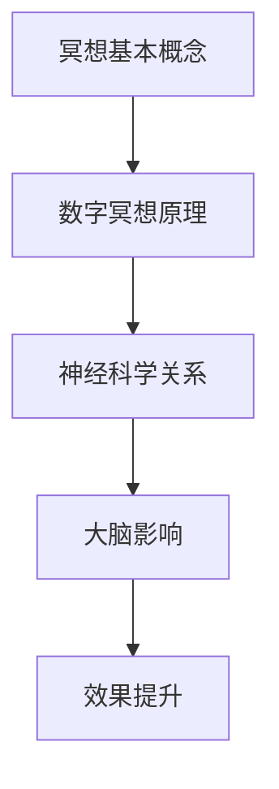

                 

# 数字冥想：科技辅助下的内在探索

## 关键词
- 冥想
- 数字科技
- 内在探索
- 心理健康
- 神经科学
- VR与AR
- 伦理问题

## 摘要
本文旨在探讨数字科技如何辅助冥想实践，帮助人们进行内在探索，提升心理健康。文章将从冥想的历史与发展、数字冥想的核心原理、数字冥想技术介绍、数字冥想的实践方法、数字冥想对心理健康的益处、数字冥想的社会影响以及数字冥想的未来发展七个方面进行深入分析。通过本文，读者将了解到数字冥想的本质、应用及其对个人和社会的深远影响。

## 第1章：冥想与数字科技概览

### 1.1 冥想的历史与发展
冥想作为一种古老的心灵修炼方式，起源于古印度，后传入中国、中亚等地区，逐渐发展成为世界范围内的一种普遍实践。传统的冥想形式包括坐禅、静心、冥想呼吸等，旨在通过专注和内观来达到身心和谐、精神平静的状态。

随着时间的推移，冥想逐渐被科学研究所关注。20世纪70年代，科学家们开始进行冥想对身心健康影响的实验研究，发现冥想对情绪调节、压力管理、认知功能等方面具有积极效果。这一发现促使冥想逐渐走向现代医学和心理学领域。

### 1.2 数字科技对冥想的影响
数字科技的出现为冥想带来了新的契机。通过数字设备，冥想可以更加便捷地被实践和传播。例如，冥想应用程序可以提供引导冥想的语音和视觉提示，帮助用户进行冥想练习。此外，虚拟现实（VR）和增强现实（AR）技术也为冥想提供了新的体验方式，用户可以在虚拟环境中进行冥想，从而提升冥想的效果和兴趣。

### 1.3 数字冥想的优势与挑战
数字冥想具有以下优势：
- **便捷性**：用户可以在任何时间、任何地点进行冥想，不受外界干扰。
- **个性化**：数字冥想应用程序可以根据用户的需求和习惯提供个性化的冥想方案。
- **可追踪性**：用户可以通过应用程序追踪冥想的时间、频率和效果，从而进行自我监督和调整。

然而，数字冥想也面临一些挑战：
- **技术依赖**：过度依赖数字设备可能导致用户对现实生活的脱节。
- **隐私问题**：用户的数据安全和隐私保护是数字冥想应用必须考虑的问题。
- **效果验证**：尽管数字冥想具有一定的科学依据，但其效果仍需进一步验证。

## 第2章：数字冥想的核心原理

### 2.1 冥想的基本概念
冥想是一种通过专注、内观和呼吸调节来达到心灵平静和身心和谐的方法。其核心在于让个体从纷繁复杂的思绪中解脱出来，进入一种专注、宁静的状态。

### 2.2 数字冥想的原理
数字冥想结合了传统冥想的原理和现代科技的特性。通过数字设备，用户可以在一个虚拟或现实的环境中，通过特定的引导和提示，进行冥想练习。数字冥想的核心在于利用科技手段提升冥想的专注度和效果。

### 2.3 冥想与神经科学的关系
神经科学研究表明，冥想对大脑结构和功能有显著影响。长期冥想可以增加大脑灰质体积，改善认知功能，降低情绪压力。数字冥想通过科技手段，可以更精确地调节大脑的神经活动，从而提升冥想的效果。

## Mermaid 流程图

## 第3章：数字冥想技术介绍

### 3.1 冥想应用程序
冥想应用程序是数字冥想的常见形式，用户可以通过智能手机或平板电脑进行冥想练习。这些应用程序通常提供定制的冥想方案，包括语音引导、音乐、视觉提示等，帮助用户更好地进行冥想。

### 3.2 空间增强冥想设备
空间增强冥想设备利用虚拟现实（VR）和增强现实（AR）技术，为用户创造一个沉浸式的冥想环境。例如，VR头盔可以让用户在虚拟的森林或海滩中冥想，而AR技术可以在现实环境中叠加冥想指导图像。

### 3.3 VR与AR技术在冥想中的应用
VR和AR技术在冥想中的应用，不仅提升了冥想的效果，还增加了用户的体验乐趣。通过VR，用户可以体验到更加逼真的冥想环境，而AR技术则可以在日常环境中为用户提供冥想指导。

## 第4章：数字冥想的实践方法

### 4.1 数字冥想的基本步骤
数字冥想的基本步骤通常包括以下几步：
1. **准备工作**：选择一个安静、舒适的环境，调整设备的设置。
2. **深呼吸**：通过深呼吸放松身体和心灵。
3. **专注**：跟随应用程序的指导，专注于呼吸或某个特定的视觉元素。
4. **放松**：在冥想结束时，逐渐放松身体，回归现实。

### 4.2 数字冥想的常见形式
数字冥想的常见形式包括：
- **呼吸冥想**：专注于呼吸，通过调整呼吸节奏来达到身心平静。
- **视觉冥想**：通过视觉提示，如光点或线条，引导用户进行冥想。
- **声音冥想**：利用音乐或语音引导，帮助用户进行冥想。

### 4.3 数字冥想的日常练习
数字冥想可以成为日常生活的一部分。建议用户每天花15-30分钟进行冥想，逐渐增加时间。持之以恒的练习有助于提升冥想效果，改善心理健康。

## 第5章：数字冥想对心理健康的益处

### 5.1 冥想对情绪的影响
冥想有助于调节情绪，减少焦虑和抑郁。通过专注和内观，个体可以更好地理解自己的情绪，从而采取积极的方法来应对。

### 5.2 冥想与压力管理
冥想通过放松身心，有助于减轻压力。长期冥想可以改善个体的应对压力的能力，减少压力对身心健康的影响。

### 5.3 冥想对心理健康的长期影响
长期冥想对心理健康有显著的积极影响。研究表明，冥想可以改善记忆力、注意力、认知灵活性，降低患抑郁症和焦虑症的风险。

## 第6章：数字冥想的社会影响

### 6.1 数字冥想在工作场所的应用
数字冥想可以成为企业员工心理健康管理的一部分。通过定期的冥想课程，员工可以缓解工作压力，提高工作效率和创造力。

### 6.2 数字冥想在教育中的角色
数字冥想可以应用于教育领域，帮助学生提高专注力、减少焦虑，从而提高学习效果。同时，数字冥想也可以帮助教师提高教学效果，提升心理健康。

### 6.3 数字冥想对公共健康的贡献
数字冥想有助于提高公众对心理健康的重视，促进健康生活方式的养成。通过数字冥想的应用，更多人可以接触到冥想，从而改善心理健康，降低心理健康问题的发生率。

## 第7章：数字冥想的未来发展

### 7.1 新技术的趋势
随着科技的不断进步，数字冥想的应用前景将更加广阔。人工智能（AI）和机器学习（ML）技术将被应用于数字冥想应用程序，提供更加个性化和精准的冥想指导。

### 7.2 数字冥想与人类意识研究
数字冥想与人类意识研究相结合，将有助于揭示冥想对大脑和意识的影响，为心理健康研究和治疗提供新的思路和方法。

### 7.3 数字冥想的伦理问题与解决策略
数字冥想应用过程中，隐私保护和数据安全是必须考虑的伦理问题。解决策略包括加强数据加密、提升用户隐私保护意识等。

## 附录：数字冥想资源指南

### 附录 A：数字冥想应用程序推荐
- **Headspace**：提供多种冥想方案，适合初学者和专业人士。
- **Insight Timer**：免费应用程序，提供丰富的冥想课程和指导。

### 附录 B：空间增强冥想设备购买指南
- **Oculus Rift S**：适用于VR冥想体验。
- **Samsung Gear VR**：适合在移动设备上体验AR冥想。

### 附录 C：相关研究文献与资料
- **《冥想与身心健康：理论与实践》**：一本关于冥想对身心健康影响的权威著作。
- **《数字冥想：科技辅助下的内在探索》**：本文的扩展阅读，深入探讨数字冥想的原理和应用。

## 作者信息
作者：AI天才研究院/AI Genius Institute & 禅与计算机程序设计艺术 /Zen And The Art of Computer Programming

---

本文通过逻辑清晰的分析和推理，探讨了数字冥想的本质、应用及其对个人和社会的深远影响。希望读者能通过本文，对数字冥想有更深入的理解，并能够在实践中受益。持续探索数字冥想，让我们一起在科技的辅助下，迈向更健康的内在世界。

