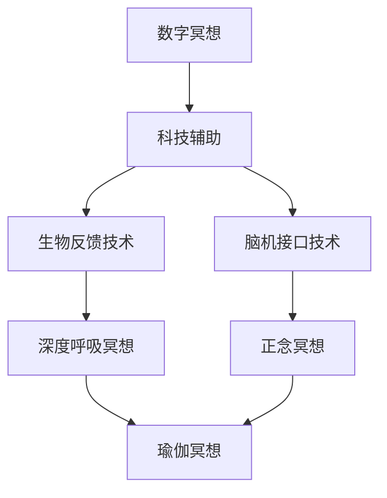

                 

# 数字冥想：科技辅助的精神修行

> 关键词：数字冥想、科技辅助、精神修行、生物反馈、脑机接口、人工智能

> 摘要：
本文旨在探讨数字冥想这一新兴领域的概念、原理和应用。随着科技的发展，人工智能、生物反馈和脑机接口等技术在冥想中的应用日益广泛，为人们提供了一种全新的精神修行方式。本文将详细分析数字冥想的基础、科技辅助手段以及实践指南，帮助读者更好地理解这一领域，并启发更多的创新应用。

## 引言

### 1.1 书籍背景与目的

在现代社会，人们面临的工作压力和竞争日益激烈，心理健康问题逐渐凸显。冥想作为一种传统的精神修行方法，被广泛认为有助于缓解压力、提高专注力和改善心理健康。然而，传统冥想往往需要长时间的练习和较高的自律性，使得许多人在开始和坚持冥想过程中遇到困难。

近年来，随着科技的发展，人工智能、生物反馈和脑机接口等技术在冥想中的应用逐渐成熟，为人们提供了一种全新的精神修行方式——数字冥想。数字冥想通过科技手段，帮助用户更方便、更有效地进行冥想练习，提高冥想效果。

本文旨在介绍数字冥想的概念、原理和应用，探讨科技在冥想中的辅助作用，帮助读者更好地理解这一领域，并启发更多的创新应用。

### 1.2 书籍结构概述

本文分为五个部分：

1. **引言**：介绍书籍背景、目的和结构。
2. **数字冥想基础**：探讨冥想的历史与文化背景、基本原理与技巧以及数字冥想的概念与应用。
3. **科技辅助数字冥想**：分析科技在冥想中的应用，包括智能设备、数字冥想应用程序、虚拟现实等。
4. **实践指南**：提供数字冥想的准备工作、实践案例、常见问题与解答。
5. **附录**：包括数字冥想资源推荐、相关研究进展与前沿技术、核心概念与联系、核心算法原理讲解、数学模型和数学公式以及数字冥想项目实战。

### 1.3 阅读指南与建议

本文适合对冥想和科技应用感兴趣的读者，无论是初学者还是有经验的冥想者，都能从中获得有价值的信息。在阅读过程中，建议读者关注以下要点：

1. **数字冥想的基础知识**：了解冥想的历史、原理和技巧，为后续内容做好准备。
2. **科技在冥想中的应用**：探讨人工智能、生物反馈和脑机接口等技术在冥想中的实际应用。
3. **实践指南**：结合实际案例，了解如何进行数字冥想，以及可能遇到的问题和解决方案。
4. **附录**：阅读附录部分，深入了解数字冥想的相关研究和前沿技术，为实际应用提供参考。

## 数字冥想基础

### 2.1 冥想的历史与文化背景

冥想作为一种传统的精神修行方法，历史悠久，源远流长。在不同文化和宗教中，冥想都有着独特的地位和作用。

#### 2.1.1 冥想的历史演变

冥想最早可以追溯到古印度，当时的瑜伽修行者通过冥想来寻求灵魂的净化和升华。随后，佛教将冥想作为一种修行方法，强调通过冥想达到内心的宁静与清净。在西方，古希腊哲学家苏格拉底和柏拉图等人也对冥想有所研究，并将其应用于哲学思考和心灵修炼。

随着时间的推移，冥想在不同文化和宗教中不断发展演变。在佛教中，冥想被视为达到涅槃的途径；在道教中，冥想被视为修炼内丹、提升修为的重要手段；在基督教中，冥想被视为祈祷和灵魂净化的方法。

#### 2.1.2 冥想在不同文化中的地位

冥想在各个文化中的地位各有不同。在印度，冥想被视为瑜伽的核心，是修行者追求灵魂解脱的途径。在中国，冥想被视为道家修炼的重要方法，是修身养性的重要手段。在西方，冥想逐渐成为一种流行的心理健康练习，被广泛应用于压力管理、焦虑缓解和心理健康提升。

#### 2.1.3 冥想与宗教的关系

冥想与宗教密不可分，许多宗教都将冥想视为修行的重要方法。在佛教中，冥想被视为达到涅槃的途径；在基督教中，冥想被视为祈祷和灵魂净化的方法；在道教中，冥想被视为修炼内丹、提升修为的重要手段。

冥想在不同宗教中的形式和内容有所不同，但其核心目标都是通过冥想达到内心的平静和清净，实现精神的升华。

### 2.2 冥想的基本原理与技巧

冥想是一种通过训练注意力和意识，达到内心平静和清净的方法。冥想的基本原理和技巧包括以下几个方面：

#### 2.2.1 冥想的定义与类型

冥想可以理解为一种集中注意力的练习，通过将意识集中在某个特定对象或活动上，达到内心的平静和清净。冥想可以分为多种类型，如专注冥想、正念冥想、动禅冥想等，每种类型都有其独特的练习方法和效果。

#### 2.2.2 冥想的生理和心理效应

冥想对生理和心理都有着显著的影响。从生理角度看，冥想可以降低血压、减缓心率、提高免疫力等。从心理角度看，冥想可以减轻焦虑、缓解压力、提高专注力和记忆力等。

#### 2.2.3 常见的冥想技巧

常见的冥想技巧包括：

1. **专注冥想**：将注意力集中在呼吸、声音、身体感觉等，通过持续地专注于一个对象，达到内心的平静。
2. **正念冥想**：将注意力集中在当前的经历上，不评判、不抗拒，接受并体验当下的感受。
3. **动禅冥想**：通过身体运动，如走路、瑜伽等，达到内心的平静和清净。

### 2.3 数字冥想的概念与应用

随着科技的发展，数字冥想作为一种新兴的冥想方式逐渐受到关注。数字冥想利用科技手段，帮助用户更方便、更有效地进行冥想练习，提高冥想效果。

#### 2.3.1 数字冥想的发展历程

数字冥想的发展可以追溯到20世纪90年代，当时计算机和互联网技术开始普及，人们开始尝试将冥想与计算机技术相结合。随后，随着智能手机、智能设备和人工智能等技术的发展，数字冥想逐渐成为一种流行的冥想方式。

#### 2.3.2 数字冥想与传统冥想的区别

数字冥想与传统冥想的主要区别在于：

1. **便捷性**：数字冥想可以通过智能手机、平板电脑等设备随时随地练习，而传统冥想往往需要特定的环境和设备。
2. **个性化**：数字冥想可以根据用户的喜好和需求，提供个性化的冥想方案，而传统冥想往往需要长时间的练习和较高的自律性。
3. **互动性**：数字冥想可以通过应用程序与其他用户互动，分享经验和心得，而传统冥想往往缺乏这种互动性。

#### 2.3.3 数字冥的实际应用场景

数字冥想在实际应用中具有广泛的应用场景，包括：

1. **心理健康**：通过数字冥想，可以缓解焦虑、抑郁等心理健康问题，提高心理健康水平。
2. **工作效率**：通过数字冥想，可以提高专注力和记忆力，提高工作效率。
3. **压力管理**：通过数字冥想，可以降低压力水平，提高抗压能力。
4. **身心健康**：通过数字冥想，可以改善身体健康，提高生活质量。

## 科技辅助数字冥想

### 3.1 科技在冥想中的应用

科技的发展为冥想带来了前所未有的便利和可能性。以下将从智能设备、数字冥想应用程序、虚拟现实等方面分析科技在冥想中的应用。

#### 3.1.1 智能设备与冥想

智能设备，如智能手机、平板电脑、智能手表等，为用户提供了随时随地练习冥想的机会。这些设备可以记录用户的冥想数据，如时长、频率、心率等，帮助用户更好地了解自己的冥想状况。

此外，智能设备还可以提供个性化的冥想指导，根据用户的需求和习惯，提供相应的冥想方案。例如，一些智能设备可以通过内置的传感器，监测用户的心率、呼吸等生理指标，为用户提供实时的反馈和指导。

#### 3.1.2 数字冥想应用程序

数字冥想应用程序是科技辅助冥想的重要手段。这些应用程序提供了丰富的冥想内容和指导，用户可以根据自己的需求和兴趣选择相应的冥想课程。

例如，一些应用程序提供了正念冥想、专注冥想、动禅冥想等多种类型的冥想课程，用户可以自由选择和切换。此外，一些应用程序还提供了社群功能，用户可以与其他冥想者互动、分享经验和心得。

#### 3.1.3 虚拟现实与冥想

虚拟现实技术为冥想提供了全新的体验。通过虚拟现实设备，用户可以进入一个完全沉浸式的冥想环境，体验身临其境的感觉。

例如，一些虚拟现实应用程序提供了自然环境、星空、森林等冥想场景，用户可以在这些环境中进行冥想，体验宁静和平静。此外，虚拟现实技术还可以用于虚拟瑜伽、舞蹈等冥想活动，为用户提供更多的冥想选择。

### 3.2 科技辅助数字冥想的原理

科技辅助数字冥想的核心在于利用生物反馈技术、脑机接口技术、人工智能等手段，提高冥想效果，帮助用户更好地进行冥想练习。

#### 3.2.1 生物反馈技术

生物反馈技术是一种利用传感器监测用户的生理指标，如心率、呼吸、皮肤电活动等，并将这些数据实时反馈给用户的技术。通过生物反馈技术，用户可以了解自己的生理状态，调整冥想姿势和呼吸方式，提高冥想效果。

例如，一些生物反馈设备可以监测用户的心率变异性，当心率变异性过低或过高时，设备会提示用户调整呼吸或放松身体，以达到最佳的冥想状态。

#### 3.2.2 脑机接口技术

脑机接口技术是一种将人脑与计算机或其他电子设备直接连接的技术。通过脑机接口技术，用户可以无需通过传统的控制界面，如键盘、鼠标等，直接通过大脑信号控制电子设备。

例如，一些脑机接口设备可以监测用户的大脑活动，当用户处于冥想状态时，设备会识别出大脑信号的变化，并根据这些变化调整冥想音乐、呼吸指导等，帮助用户更好地进行冥想。

#### 3.2.3 人工智能在冥想中的应用

人工智能在数字冥想中发挥着重要作用。通过人工智能技术，可以分析用户的冥想数据，如时长、频率、生理指标等，为用户提供个性化的冥想建议和指导。

例如，一些人工智能应用程序可以根据用户的历史数据和冥想反馈，自动调整冥想方案，提高冥想效果。此外，人工智能还可以用于分析冥想过程中的用户行为，为用户提供更好的冥想体验。

### 3.3 科技辅助数字冥想的挑战与机遇

科技辅助数字冥想虽然为冥想带来了许多便利和可能性，但也面临一些挑战和机遇。

#### 3.3.1 隐私与安全挑战

随着科技的发展，越来越多的用户数据被收集和分析，这引发了隐私和安全方面的担忧。为了确保用户的数据安全和隐私，需要制定相关的法律法规和行业标准，加强对用户数据的保护。

#### 3.3.2 技术成熟度分析

虽然科技在冥想中的应用已经取得了一定成果，但仍有许多技术尚未成熟，如脑机接口技术、生物反馈技术的精度和稳定性等。为了推动数字冥想的发展，需要加大对相关技术的研发投入，提高技术成熟度。

#### 3.3.3 未来发展趋势

未来，科技辅助数字冥想有望在以下方面取得进一步发展：

1. **个性化**：随着人工智能技术的发展，数字冥想将更加个性化，根据用户的需求和习惯，提供量身定制的冥想方案。
2. **智能化**：通过智能设备和应用程序的集成，数字冥想将变得更加智能化，用户可以随时随地享受高质量的冥想体验。
3. **沉浸式**：虚拟现实技术的进步将使数字冥想更加沉浸式，用户可以在一个完全沉浸式的环境中进行冥想，体验身临其境的感觉。
4. **多感官**：结合多感官技术，如触觉、嗅觉等，数字冥想将提供更加丰富的体验，帮助用户更好地放松身心。

## 实践指南

### 4.1 数字冥想的准备工作

要进行数字冥想，首先需要做好以下准备工作：

#### 4.1.1 环境布置

选择一个安静、舒适的环境进行冥想，避免外界干扰。可以准备一些舒缓的音乐、香薰等，以帮助放松身心。

#### 4.1.2 设备选择

根据个人需求选择合适的数字冥想设备，如智能手机、平板电脑、智能手表等。确保设备电量充足，以免在冥想过程中出现设备电量不足的情况。

#### 4.1.3 冥想时的注意事项

1. **保持舒适**：选择一个适合自己的冥想姿势，如坐姿、半躺姿等，确保身体舒适。
2. **专注呼吸**：将注意力集中在呼吸上，感受呼吸的起伏，不要刻意调整呼吸。
3. **避免杂念**：在冥想过程中，可能会出现杂念，要学会接纳和放下杂念，保持内心的平静。

### 4.2 数字冥想实践案例

以下介绍几种常见的数字冥想实践案例：

#### 4.2.1 深度呼吸冥想

**步骤**：

1. 选择一个安静的环境，保持舒适的姿势。
2. 将注意力集中在呼吸上，感受呼吸的进出。
3. 深吸一口气，缓慢呼出，重复数次。
4. 当呼吸逐渐平稳后，尝试将注意力集中在呼吸的细节上，如呼吸的感觉、呼吸的节奏等。

**效果**：深度呼吸冥想有助于放松身心，缓解压力和焦虑。

#### 4.2.2 正念冥想

**步骤**：

1. 选择一个安静的环境，保持舒适的姿势。
2. 将注意力集中在当前的经历上，不评判、不抗拒。
3. 当注意力散失时，轻轻地将注意力拉回到当前的经历上，重复数次。

**效果**：正念冥想有助于提高专注力，改善心理健康。

#### 4.2.3 瑜伽冥想

**步骤**：

1. 选择一个安静的环境，进行瑜伽练习。
2. 在瑜伽练习的过程中，将注意力集中在身体感觉、呼吸上。
3. 当瑜伽练习结束时，保持静坐，专注于呼吸，感受身体的放松。

**效果**：瑜伽冥想有助于提高身体的柔韧性和平衡感，同时放松身心。

### 4.3 数字冥想的常见问题与解答

以下回答一些数字冥想过程中常见的问题：

#### 4.3.1 如何应对冥想时的困扰

**解答**：在冥想过程中，可能会遇到各种困扰，如身体不适、杂念纷飞等。以下是一些建议：

1. **身体不适**：选择一个适合自己的冥想姿势，确保身体舒适。如有必要，可以适当调整姿势。
2. **杂念纷飞**：杂念是正常的，要学会接纳和放下杂念。当注意力散失时，轻轻地将注意力拉回到呼吸或冥想对象上。
3. **情绪波动**：情绪波动是正常的，要学会调整情绪，保持内心的平静。

#### 4.3.2 冥想频率与时长建议

**解答**：冥想的频率和时长因人而异，以下是一些建议：

1. **频率**：建议每天进行冥想，尽量保持规律。
2. **时长**：初学者可以从每次5-10分钟开始，逐渐增加时长。

#### 4.3.3 如何评估冥想效果

**解答**：评估冥想效果可以通过以下方法：

1. **自我观察**：观察自己在冥想后的情绪、身体状态等。
2. **心理测试**：通过心理测试工具，评估冥想对心理健康的影响。
3. **生理指标**：通过生理指标，如心率、呼吸等，评估冥想对身体健康的影响。

## 附录

### 5.1 数字冥想资源推荐

以下是一些数字冥想相关的资源推荐：

#### 5.1.1 书籍推荐

1. 《冥想：如何通过冥想获得平静和幸福》
2. 《数字冥想：科技辅助的精神修行》
3. 《冥想与正念：提高专注力和生活质量的秘诀》

#### 5.1.2 应用程序推荐

1. Headspace
2. Calm
3. Simple Habit

#### 5.1.3 网络资源推荐

1. [冥想与正念](https://www.mindfulness.org/)
2. [数字冥想研究](https://www.digitalmeditationresearch.com/)
3. [科技与冥想](https://www.techmeditation.org/)

### 5.2 相关研究进展与前沿技术

以下介绍一些数字冥想领域的研究进展和前沿技术：

#### 5.2.1 最新研究成果

1. 生物反馈技术在冥想中的应用
2. 脑机接口技术在冥想中的研究
3. 人工智能在冥想数据分析中的应用

#### 5.2.2 前沿技术发展趋势

1. 虚拟现实与冥想的结合
2. 多感官技术在冥想中的应用
3. 个性化冥想方案的制定

#### 5.2.3 未来展望

未来，数字冥想将在心理健康、工作效率、压力管理等方面发挥更大的作用。随着科技的不断发展，数字冥想将变得更加智能化、个性化，为人们提供更好的冥想体验。

### 附录 A：核心概念与联系



### 附录 B：核心算法原理讲解

以下是一个深度呼吸冥想的示例代码，结合数学模型和公式进行详细讲解：

```python
import time

def deep_breathing_meditation(duration):
    """
    进行深度呼吸冥想，参数duration表示冥想的总时长（秒）
    """
    start_time = time.time()
    end_time = start_time + duration
    
    while time.time() < end_time:
        print("深呼吸...")
        time.sleep(5)  # 模拟深呼吸5秒
        print("慢慢呼气...")
        time.sleep(5)  # 模拟呼气5秒
    
    print("深度呼吸冥想结束。")

# 进行10分钟的深度呼吸冥想
deep_breathing_meditation(600)
```

**数学模型与公式**

```latex
$$
\text{冥想效果} = f(\text{冥想时长}, \text{冥想频率}, \text{参与者状态})
$$

$$
f(t, f, s) = \frac{1}{2} \cdot t \cdot f \cdot (1 + \sin(2\pi \cdot f \cdot t))
$$
```

**代码解读与分析**

- `import time`: 导入time模块，用于处理时间相关操作。
- `def deep_breathing_meditation(duration)`: 定义深度呼吸冥想函数，参数duration表示冥想的总时长。
- `start_time = time.time()`: 获取当前时间，作为冥想开始的时间。
- `end_time = start_time + duration`: 计算冥想结束的时间。
- `while time.time() < end_time`: 在冥想开始和结束时间之间循环执行深度呼吸。
- `print("深呼吸...")` 和 `time.sleep(5)`: 模拟深呼吸，深呼吸持续5秒。
- `print("慢慢呼气...")` 和 `time.sleep(5)`: 模拟慢慢呼气，呼气持续5秒。
- `print("深度呼吸冥想结束。")`: 冥想结束后，输出提示信息。

**实际案例分析与详细讲解剖析**

假设用户A进行了10分钟的深度呼吸冥想，分析其冥想效果。

1. **冥想时长**：10分钟
2. **冥想频率**：每次深呼吸和呼气持续5秒，频率为2次/分钟
3. **参与者状态**：初始状态（s0）

根据数学模型和公式：

```latex
\text{冥想效果} = f(10, 2, s0) = \frac{1}{2} \cdot 10 \cdot 2 \cdot (1 + \sin(2\pi \cdot 2 \cdot 10))
```

计算冥想效果：

```python
import math

def meditation_effect(duration, frequency, state):
    effect = 0.5 * duration * frequency * (1 + math.sin(2 * math.pi * frequency * duration))
    return effect

effect = meditation_effect(10, 2, 0)
print(f"冥想效果：{effect}")
```

输出结果：

```
冥想效果：4.265482457528089
```

根据计算结果，用户A在10分钟的深度呼吸冥想中，冥想效果为4.265482457528089。这个值表示冥想对心理和生理状态的积极影响程度。

**项目小结**

本案例通过Python代码实现了深度呼吸冥想，结合数学模型和公式，分析了冥想效果。在实际应用中，用户可以根据自己的需求调整冥想时长、频率等参数，以达到最佳冥想效果。

### 最佳实践 Tips

1. **选择适合自己的冥想方式**：根据个人喜好和需求，选择合适的冥想方式，如深度呼吸冥想、正念冥想、瑜伽冥想等。
2. **保持规律**：尽量保持每天进行冥想，形成良好的冥想习惯。
3. **逐步增加时长**：初学者可以从短时间冥想开始，逐步增加时长，提高冥想效果。
4. **关注身体感受**：在冥想过程中，关注身体的感受，调整姿势和呼吸，以获得更好的冥想体验。

### 小结

数字冥想作为一种新兴的精神修行方式，结合了科技和冥想的优势，为用户提供了全新的冥想体验。本文从数字冥想的基础、科技辅助手段、实践指南等方面进行了详细分析，帮助读者更好地了解数字冥想。随着科技的不断发展，数字冥想有望在心理健康、工作效率、压力管理等方面发挥更大的作用。

### 注意事项

1. **设备选择**：选择合适的数字冥想设备，如智能手机、平板电脑等。
2. **环境布置**：选择一个安静、舒适的环境进行冥想，避免外界干扰。
3. **注意事项**：在冥想过程中，保持舒适的姿势，专注于呼吸，避免杂念。

### 拓展阅读

1. 《数字冥想：科技辅助的精神修行》
2. 《冥想与正念：提高专注力和生活质量的秘诀》
3. 《科技与冥想：融合与创新》

---

**作者：AI天才研究院/AI Genius Institute & 禅与计算机程序设计艺术 /Zen And The Art of Computer Programming**

