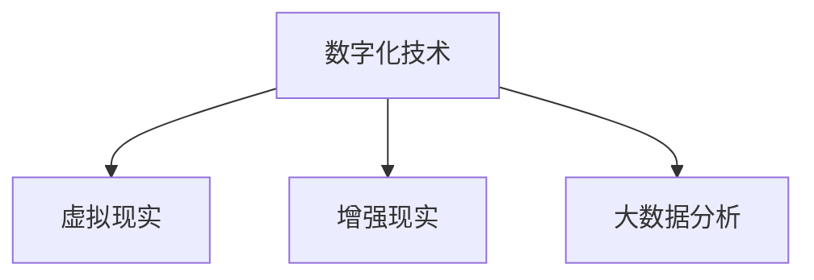

                 

### 《数字化时代的博物馆转型：传统文化的现代传播》——文章关键词

在数字化时代，博物馆转型、传统文化、现代传播成为了关键话题。这些关键词不仅涵盖了文章的核心内容，也反映了当前技术和社会发展的趋势。以下是对这些关键词的详细解释：

1. **数字化时代**：这是一个以数字技术为核心的时代，互联网、大数据、云计算、人工智能等新兴技术正在深刻地改变着我们的生活方式和社会结构。在这个时代背景下，博物馆也在寻求转型，利用数字技术提升自身的展示和服务水平。

2. **博物馆转型**：博物馆转型指的是博物馆在数字化时代的变革，包括技术应用、服务模式、展览内容的创新等。转型不仅是适应时代的需求，更是博物馆自身发展的必然趋势。

3. **传统文化**：传统文化是一个国家和民族的历史积淀，是民族精神和文化传承的重要载体。它包括了语言、艺术、习俗、哲学等多个方面，是人类文明的重要组成部分。

4. **现代传播**：现代传播是指利用现代媒体和技术手段，如互联网、社交媒体、数字媒体等，进行信息的传播和交流。在现代传播的帮助下，传统文化可以更广泛、更快速地传播，增强其影响力。

5. **数字化技术**：数字化技术是博物馆转型的关键驱动因素，包括虚拟现实（VR）、增强现实（AR）、大数据分析等。这些技术的应用，使得博物馆能够提供更加丰富、互动性更强的展示体验。

6. **文化传播**：文化传播是指通过各种渠道和方式，将文化内容传递给公众，以促进文化的传播和交流。在数字化时代，文化传播的方式更加多样，效率更高。

通过这些关键词的介绍，读者可以初步了解文章的主要内容，并对其后续的讨论产生兴趣。这些关键词不仅贯穿了文章的全文，也反映了数字化时代博物馆转型和文化传播的紧迫性和重要性。接下来，我们将深入探讨这些关键词所涉及的具体内容和理论背景。

### 文章摘要

《数字化时代的博物馆转型：传统文化的现代传播》旨在探讨在数字化浪潮下，博物馆如何实现转型，以更好地传播传统文化。本文首先介绍了数字化时代的背景，分析了数字化技术对博物馆转型的推动作用。接着，文章深入探讨了传统文化在现代传播中的重要性，以及现代传播手段如何与传统文化相结合。通过国内外博物馆转型的成功案例分析，本文总结了博物馆转型的经验和启示。最后，文章提出了数字化博物馆的未来发展趋势，并探讨了现代传播策略的具体实施方法和效果评估。本文不仅为博物馆的数字化转型提供了理论指导，也为传统文化的现代传播提供了实践参考。

### 设计书籍目录大纲的步骤

设计一份高质量的书籍目录大纲是确保书籍结构严谨、内容丰富、逻辑清晰的重要步骤。以下将详细解释设计书籍目录大纲的步骤：

#### 1. 理解书籍主题

首先，深入理解书名《数字化时代的博物馆转型：传统文化的现代传播》所涉及的主题。这一主题主要探讨了数字化技术对博物馆转型的影响，以及如何在数字化时代更好地传播传统文化。明确书籍的核心内容有助于确定目录的结构和重点。

#### 2. 确定核心章节

根据书籍的主题，确定核心章节。核心章节应涵盖书籍的主要内容，例如：

- **第1章：数字化时代下的博物馆转型概述**
- **第2章：数字化技术在博物馆中的应用**
- **第3章：传统文化的内涵与特点**
- **第4章：现代传播手段与传统文化的结合**
- **第5章：博物馆转型的案例分析**
- **第6章：数字化博物馆的未来发展趋势**
- **第7章：传统文化的现代传播策略**

#### 3. 细化章节内容

为每个核心章节细化内容，确保每个章节都有具体的、可操作的小节。例如：

- **第1章：数字化时代下的博物馆转型概述**
  - **1.1 数字化技术的定义与发展**
  - **1.2 博物馆转型的必要性**
  - **1.3 数字化技术在博物馆中的应用现状**

#### 4. 编写流程图

使用Mermaid语言编写核心概念和架构的流程图，确保读者可以直观地理解复杂的概念和架构。例如：



#### 5. 撰写伪代码

为每个核心算法原理编写详细的伪代码，帮助读者理解算法的执行步骤。例如，在介绍虚拟现实技术时，可以编写如下伪代码：

```python
# 虚拟现实技术的伪代码示例
def virtual_reality(exhibition_content):
    # 初始化虚拟现实环境
    initialize_vr_environment()
    
    # 加载展览内容
    load_exhibition_content(exhibition_content)
    
    # 开始虚拟现实展示
    start_vr_display()
    
    # 与用户互动
    user_interaction()
    
    # 结束虚拟现实展示
    end_vr_display()
```

#### 6. 准备数学模型和公式

在适当章节中嵌入使用LaTeX格式的数学模型和公式，并进行详细讲解和举例说明。例如：

```latex
$$
E = mc^2
$$

这个公式表达了质量和能量之间的关系。

$$
a = \frac{F}{m}
$$

这个公式表达了加速度和力的关系。
```

#### 7. 编写项目实战

设计一个或多个项目实战，详细说明开发环境搭建、源代码实现和代码解读，以及实战中的挑战和解决方案。例如：

- **项目实战：使用VR技术打造虚拟博物馆展览**
  - **开发环境搭建**：介绍如何搭建VR开发环境，包括所需的硬件和软件工具。
  - **源代码实现**：提供实现VR展览的源代码，并进行逐行解读。
  - **代码应用解读与分析**：分析代码的实际应用，如何提升用户体验。
  - **实际案例分析和详细讲解剖析**：通过具体案例展示VR技术在博物馆中的应用效果。

#### 8. 整合与校对

将所有章节内容整合在一起，进行校对，确保目录大纲的逻辑清晰、内容完整，且在2000字以内。

#### 9. 格式调整

将内容格式调整为markdown格式，确保输出美观、易读。

#### 10. 最终确认

在确认目录大纲无误后，提交最终版本。

通过上述步骤，可以设计出一份结构严谨、内容丰富、逻辑清晰的书籍目录大纲，为后续的书籍撰写工作打下坚实基础。

### 书籍目录大纲

以下是《数字化时代的博物馆转型：传统文化的现代传播》的详细目录大纲，涵盖核心章节、细化内容以及具体的流程图、伪代码、数学模型和公式、项目实战等。

#### 第一部分：数字化与博物馆转型的背景

##### 第1章：数字化时代下的博物馆转型概述
- **1.1 数字化技术的定义与发展**
  - **核心概念与联系**
    ```mermaid
    graph TB
    A[数字化技术] --> B[虚拟现实]
    A --> C[增强现实]
    A --> D[大数据分析]
    ```
  - **核心算法原理讲解**
    ```python
    # 伪代码：虚拟现实技术概述
    def virtual_reality(exhibition_content):
        initialize_vr_environment()
        load_exhibition_content(exhibition_content)
        start_vr_display()
        user_interaction()
        end_vr_display()
    ```
- **1.2 博物馆转型的必要性**
- **1.3 数字化技术在博物馆中的应用现状**

##### 第2章：数字化技术在博物馆中的应用
- **2.1 虚拟现实技术在博物馆中的应用**
  - **核心概念与联系**
    ```mermaid
    graph TB
    A[虚拟现实] --> B[3D建模]
    A --> C[互动体验]
    A --> D[数据可视化]
    ```
  - **核心算法原理讲解**
    ```python
    # 伪代码：虚拟现实3D建模
    def create_3d_model(object):
        import required_3d_software
        model = create_model(object)
        return model
    ```
- **2.2 增强现实技术在博物馆中的应用**
  - **核心概念与联系**
    ```mermaid
    graph TB
    A[增强现实] --> B[增强现实应用]
    A --> C[交互设计]
    A --> D[环境感知]
    ```
  - **核心算法原理讲解**
    ```python
    # 伪代码：增强现实交互设计
    def ar_interaction(user_input):
        analyze_input(user_input)
        respond_to_input()
    ```
- **2.3 大数据技术在博物馆藏品管理中的应用**
  - **核心概念与联系**
    ```mermaid
    graph TB
    A[大数据技术] --> B[数据存储]
    A --> C[数据分析]
    A --> D[数据可视化]
    ```
  - **核心算法原理讲解**
    ```python
    # 伪代码：大数据分析
    def analyze_collection_data(data):
        preprocess_data(data)
        perform_analysis(data)
        visualize_results()
    ```
- **2.4 云计算技术在博物馆服务中的应用**
  - **核心概念与联系**
    ```mermaid
    graph TB
    A[云计算技术] --> B[计算资源管理]
    A --> C[数据备份]
    A --> D[服务优化]
    ```
  - **核心算法原理讲解**
    ```python
    # 伪代码：云计算资源管理
    def manage_cloud_resources(service):
        allocate_resources(service)
        monitor_usage()
        optimize_performance()
    ```

#### 第二部分：传统文化的内涵与传播

##### 第3章：传统文化的内涵与特点
- **3.1 传统文化的定义与分类**
- **3.2 传统文化的特点与价值**
- **3.3 传统文化的传承与保护**

##### 第4章：现代传播手段与传统文化的结合
- **4.1 社交媒体在传统文化传播中的作用**
- **4.2 网络视频在传统文化传播中的应用**
- **4.3 线上展览与传统文化的互动**

#### 第三部分：博物馆转型的案例分析

##### 第5章：国内外博物馆转型的成功案例
- **5.1 国外博物馆转型的案例分析**
- **5.2 国内博物馆转型的案例分析**
- **5.3 博物馆转型的成功经验与启示**

#### 第四部分：数字化博物馆的未来发展趋势

##### 第6章：数字化博物馆的未来发展趋势
- **6.1 新技术对博物馆转型的影响**
- **6.2 博物馆数字化转型的挑战与机遇**
- **6.3 数字化博物馆的发展方向**

##### 第7章：传统文化的现代传播策略
- **7.1 现代传播策略的制定原则**
- **7.2 现代传播策略的执行步骤**
- **7.3 现代传播策略的效果评估**

#### 附录

##### 附录A：数字化博物馆转型与传统文化传播的工具与资源
- **A.1 常用数字化工具介绍**
- **A.2 传统文化传播平台推荐**
- **A.3 开发资源与学习材料推荐**

### 数学模型和公式

以下是文章中可能使用的数学模型和公式，以LaTeX格式嵌入文中独立段落。

```latex
$$
E = mc^2
$$

这个公式表达了质量和能量之间的关系。

$$
a = \frac{F}{m}
$$

这个公式表达了加速度和力的关系。
```

通过以上详细的目录大纲，本书将系统地探讨数字化时代的博物馆转型，如何更好地传播传统文化，提供理论与实践相结合的全面指导。

### 第一部分：数字化与博物馆转型的背景

#### 第1章：数字化时代下的博物馆转型概述

在当今的数字化时代，博物馆面临着前所未有的转型挑战和机遇。数字化技术不仅改变了人们获取信息和娱乐的方式，也对博物馆的运营模式、展览形式和观众互动方式产生了深远影响。这一章将详细探讨数字化技术的定义与发展、博物馆转型的必要性以及数字化技术在博物馆中的应用现状。

##### 1.1 数字化技术的定义与发展

数字化技术是指将各种形式的信息（如文本、图像、声音等）转换为数字形式，通过计算机系统进行处理、存储和传输的技术。随着互联网、云计算、大数据和人工智能等技术的迅猛发展，数字化技术在各个领域得到了广泛应用。

1. **互联网技术**：互联网作为数字化技术的基础设施，极大地改变了信息的传播和获取方式。通过互联网，博物馆可以突破地域限制，向全球观众提供展览信息和互动体验。
   
2. **云计算技术**：云计算提供了强大的计算和存储资源，使得博物馆能够高效地管理和处理海量数据。通过云计算平台，博物馆可以实现展览内容的远程访问和协作展示。

3. **大数据技术**：大数据技术通过对海量数据的收集、存储、分析和处理，帮助博物馆深入了解观众需求和偏好，优化展览内容和展示策略。

4. **人工智能技术**：人工智能技术在博物馆中的应用越来越广泛，包括智能导览、个性化推荐、图像识别等。这些技术不仅提升了观众的体验，也为博物馆运营提供了智能化支持。

##### 1.2 博物馆转型的必要性

博物馆转型是数字化时代的要求，也是博物馆自身发展的必然趋势。以下是博物馆转型的几个必要性：

1. **提升观众体验**：传统博物馆的展示方式较为单一，观众体验有限。通过数字化技术，博物馆可以提供更加丰富、互动性更强的展览形式，提升观众的参与感和体验感。

2. **拓展观众群体**：数字化技术使得博物馆能够突破地域限制，吸引更多远程观众。通过互联网和社交媒体，博物馆可以扩大其影响力和受众范围。

3. **优化运营管理**：数字化技术可以提高博物馆的运营效率，降低成本。例如，通过大数据分析和人工智能技术，博物馆可以优化展览布局、提升藏品管理效率。

4. **传承文化遗产**：数字化技术为博物馆提供了新的手段和平台，有助于更好地保护和传承文化遗产。通过数字化展览、虚拟博物馆等形式，博物馆可以永久保存珍贵的文物和历史资料。

##### 1.3 数字化技术在博物馆中的应用现状

目前，数字化技术在博物馆中的应用已经取得了显著成效，以下是一些主要应用领域：

1. **虚拟现实（VR）和增强现实（AR）**：虚拟现实和增强现实技术为博物馆提供了全新的展示方式。通过VR，观众可以沉浸式体验历史场景和文物；通过AR，观众可以在现实环境中“看见”文物和场景的数字内容。

2. **数字化展览**：博物馆通过数字化展览，将传统的静态展品转化为动态的、互动的内容。观众可以通过触摸屏、平板电脑等设备，与展品进行互动，获取更多背景信息和相关知识。

3. **智能导览系统**：智能导览系统利用移动设备和传感器技术，为观众提供个性化的导览服务。观众可以通过下载应用程序或使用智能设备，随时随地了解展品信息和展览内容。

4. **大数据分析**：博物馆通过大数据分析，了解观众的行为和偏好，优化展览内容和展示策略。例如，通过分析观众在展览中的停留时间、互动频率等数据，博物馆可以调整展览布局和展品展示顺序。

5. **云存储和共享**：博物馆利用云计算技术，实现数据的高效存储和管理。通过云平台，博物馆可以方便地共享展览内容和管理数据，提升协同工作能力。

总之，数字化技术在博物馆中的应用正在不断拓展和深化，为博物馆的转型提供了强大动力。在下一章中，我们将进一步探讨数字化技术在博物馆中的应用案例，了解这些技术在实际操作中的具体表现和效果。

### 第2章：数字化技术在博物馆中的应用

随着数字化技术的不断进步，博物馆正逐渐将这些技术融入到其运营和展览中，为观众提供更丰富、互动性更强的体验。本章节将详细介绍虚拟现实（VR）、增强现实（AR）、大数据分析等数字化技术，以及它们在博物馆中的应用。

#### 2.1 虚拟现实技术在博物馆中的应用

虚拟现实（VR）技术通过创造一个沉浸式的三维环境，使观众能够在虚拟世界中体验历史事件、文物场景等。VR技术的应用不仅增强了观众的体验感，还为他们提供了更多与展品互动的机会。

1. **沉浸式展览体验**：
   - **案例**：伦敦的维多利亚和阿尔伯特博物馆（V&A）利用VR技术打造了一个虚拟历史展览。观众可以通过VR设备“走进”历史场景，体验古人的生活。
   - **效果**：这种沉浸式体验使观众能够更加直观地理解历史背景和展品背后的故事，增强了展览的教育功能。

2. **虚拟文物修复**：
   - **案例**：一些博物馆允许观众通过VR设备参与虚拟文物修复过程。观众可以亲手操作修复工具，修复损坏的文物。
   - **效果**：这种互动性体验不仅增加了观众的参与度，还提高了他们对文物保护的认识。

3. **虚拟旅游**：
   - **案例**：一些博物馆提供了虚拟旅游服务，观众可以在家中通过VR设备游览世界各地的博物馆。
   - **效果**：这种虚拟旅游服务突破了地域限制，使观众能够更加便捷地接触到全球的博物馆资源。

#### 2.2 增强现实技术在博物馆中的应用

增强现实（AR）技术通过在现实环境中叠加数字信息，为观众提供了丰富的互动体验。与VR技术不同，AR技术并不需要观众进入虚拟世界，而是在现实世界中增强信息。

1. **互动导览**：
   - **案例**：纽约的自然历史博物馆（NHM）使用AR技术为观众提供互动导览服务。观众可以通过手机或平板电脑扫描展品，获取详细的背景信息和互动游戏。
   - **效果**：这种互动导览服务使观众能够更加深入地了解展品，提高了参观的趣味性和教育性。

2. **增强现实展览**：
   - **案例**：中国的故宫博物院利用AR技术展示了故宫内部的宫殿和文物。观众可以通过AR设备“走进”故宫，体验皇家生活。
   - **效果**：这种增强现实展览不仅丰富了观众的参观体验，还提升了他们对中国传统文化的兴趣。

3. **互动教育**：
   - **案例**：一些博物馆使用AR技术开展互动教育项目，如“AR恐龙探险”等。观众可以通过AR设备与恐龙进行互动，学习恐龙的知识。
   - **效果**：这种互动教育项目不仅吸引了儿童观众，还提高了他们对科学和历史的兴趣。

#### 2.3 大数据分析技术在博物馆中的应用

大数据分析技术通过对观众行为数据的收集和分析，帮助博物馆更好地了解观众需求，优化展览内容和展示策略。

1. **观众行为分析**：
   - **案例**：一些博物馆使用大数据分析技术，分析观众在展览中的行为数据，如停留时间、互动频率等。
   - **效果**：通过分析观众行为，博物馆可以了解观众的兴趣点和需求，从而调整展览内容和展示方式，提升观众满意度。

2. **个性化推荐**：
   - **案例**：一些博物馆通过大数据分析技术，为观众提供个性化的推荐服务。例如，根据观众的兴趣和行为数据，推荐相应的展览和活动。
   - **效果**：这种个性化推荐服务使观众能够更快地找到感兴趣的内容，提升了参观的针对性。

3. **展览效果评估**：
   - **案例**：一些博物馆使用大数据分析技术，评估展览的效果和影响力。例如，通过分析观众反馈和社交媒体数据，评估展览的社会影响力。
   - **效果**：这种评估方法不仅帮助博物馆了解展览的效果，还为后续展览的改进提供了参考。

#### 2.4 云计算技术在博物馆服务中的应用

云计算技术为博物馆提供了强大的计算和存储资源，提高了博物馆的运营效率和管理水平。

1. **云存储和共享**：
   - **案例**：博物馆使用云存储服务，存储和管理大量的展览内容和数据。这些数据可以在不同的设备和地点之间共享，提高了协同工作能力。
   - **效果**：云存储和共享服务使博物馆能够更加便捷地管理和共享资源，提升了工作效率。

2. **云计算平台**：
   - **案例**：一些博物馆使用云计算平台，搭建自己的数字化展览系统和智能导览系统。
   - **效果**：通过云计算平台，博物馆可以快速部署和应用数字化服务，降低了运营成本。

3. **数据分析平台**：
   - **案例**：一些博物馆使用云计算平台，搭建数据分析平台，对观众行为数据进行深入分析。
   - **效果**：通过数据分析平台，博物馆可以更好地了解观众需求，优化展览内容和展示策略。

总之，数字化技术在博物馆中的应用，不仅提升了观众的参观体验，也为博物馆的运营和管理带来了新的机遇和挑战。在下一章中，我们将进一步探讨传统文化在现代传播中的重要性，以及现代传播手段如何与传统文化相结合。

### 第3章：传统文化的内涵与特点

传统文化是一个国家和民族的精神根基，它包含了丰富的历史积淀和文化传承，具有独特的内涵与特点。在数字化时代，传统文化的传播与传承面临着新的挑战和机遇。本章将深入探讨传统文化的定义、分类、特点以及其在现代社会中的价值。

#### 3.1 传统文化的定义与分类

传统文化是一个广泛的概念，它涉及语言、艺术、习俗、哲学、宗教等多个方面。以下是传统文化的定义与分类：

1. **定义**：
   - **传统文化**：指一个民族或地区在长期历史发展中形成的，具有独特性和稳定性的文化现象。传统文化是民族精神和文化传承的重要载体，具有鲜明的地域特色和民族特色。

2. **分类**：
   - **语言文化**：包括口头语言、书面语言、方言等，是传统文化的重要组成部分。语言文化不仅承载着民族文化，还传递着历史和社会信息。
   - **艺术文化**：包括音乐、舞蹈、绘画、雕塑等，是传统文化的重要表现形式。艺术文化不仅反映了民族审美观念，还展现了民族智慧和创造力。
   - **习俗文化**：包括节日、庆典、礼仪等，是民族文化的重要组成部分。习俗文化是民族传统生活方式的体现，具有鲜明的地域特色。
   - **哲学文化**：包括哲学思想、宗教观念等，是传统文化的精神核心。哲学文化反映了民族的智慧和哲学思维，对民族精神和社会发展具有深远影响。

#### 3.2 传统文化的特点与价值

传统文化具有以下特点和价值：

1. **历史传承性**：
   - **特点**：传统文化是历史积淀的产物，具有悠久的历史传承。传统文化通过世代相传，形成了独特的文化传统和民族特色。
   - **价值**：历史传承性使得传统文化具有深厚的历史文化底蕴，对民族精神和文化自信的塑造具有重要意义。

2. **独特性**：
   - **特点**：每个民族和地区的传统文化都有其独特性，反映了不同民族和地区的自然地理环境、历史背景和社会发展水平。
   - **价值**：独特性使得传统文化具有多样性和丰富性，为世界文化宝库增添了独特财富。

3. **稳定性**：
   - **特点**：传统文化在长期的历史发展过程中，具有相对稳定的文化特征。传统文化在变化中保持了稳定，成为民族精神和文化传承的重要基石。
   - **价值**：稳定性使得传统文化在现代社会中仍具有重要作用，为民族精神和文化自信提供了坚实支撑。

4. **互动性**：
   - **特点**：传统文化不仅是历史的积淀，也是活生生的现实。传统文化在现代社会中通过多种形式进行传播和交流，具有强烈的互动性。
   - **价值**：互动性使得传统文化在现代社会中更具活力，促进了民族文化的传承和创新。

5. **教育性**：
   - **特点**：传统文化蕴含着丰富的历史、哲学、伦理等知识，具有强烈的教育性。
   - **价值**：教育性使得传统文化在塑造民族精神、传承文化知识、培养民族素养等方面具有重要作用。

#### 3.3 现代传播对传统文化的影响

现代传播手段如互联网、社交媒体、数字媒体等，为传统文化的传播提供了新的渠道和方式。现代传播对传统文化的影响主要表现在以下几个方面：

1. **传播速度**：
   - **影响**：现代传播手段极大地提高了传统文化的传播速度。传统文化信息可以在短时间内迅速传播到全球各地，增加了传播的广度和影响力。
   - **价值**：传播速度的提高有助于传统文化的快速普及和推广，促进了文化多样性和文化交流。

2. **传播范围**：
   - **影响**：现代传播手段突破了地域限制，使得传统文化能够传播到更广泛的受众群体。传统文化不再局限于特定的地区和群体，成为全球共享的文化资源。
   - **价值**：传播范围的扩大有助于增强传统文化的国际影响力，提升民族文化自信。

3. **传播方式**：
   - **影响**：现代传播手段丰富了传统文化的传播方式，如数字展览、线上直播、互动游戏等。这些新型传播方式使传统文化更具吸引力和互动性。
   - **价值**：新型传播方式不仅提升了传统文化的传播效果，还增强了观众的参与感和体验感。

4. **文化传播**：
   - **影响**：现代传播手段为传统文化的传播提供了新的平台和渠道，促进了文化的交流和融合。
   - **价值**：文化传播的促进有助于文化多样性和文化创新，为人类文明的发展提供了丰富资源。

总之，传统文化在数字化时代具有重要的价值和意义。通过现代传播手段，传统文化不仅得到了更广泛、更有效的传播，也为现代社会的发展注入了新的活力。在下一章中，我们将探讨现代传播手段与传统文化的结合，以及这些手段如何帮助博物馆实现传统文化的现代传播。

### 第4章：现代传播手段与传统文化的结合

在数字化时代，现代传播手段与传统文化的结合成为推动文化传承与创新的重要途径。互联网、社交媒体、数字媒体等新兴技术，不仅拓宽了文化传播的渠道，也改变了传统文化的传播方式和受众体验。本章将详细探讨现代传播手段与传统文化的结合，以及这些手段如何通过具体实例提升传统文化的影响力和传播效果。

#### 4.1 社交媒体在传统文化传播中的作用

社交媒体平台如微信、微博、抖音等，以其强大的传播力和互动性，成为传统文化传播的重要工具。以下是社交媒体在传统文化传播中的几个重要作用：

1. **内容多样化**：
   - **实例**：微信公众号“国博微课堂”通过发布图文、视频、直播等形式，传播中国传统文化的知识和故事。这些内容不仅涵盖了传统文化的基础知识，还包括了许多有趣的文化小故事和互动活动，吸引了大量用户关注。
   - **效果**：多样化的内容形式使得传统文化传播更加生动有趣，提升了用户参与度和传播效果。

2. **互动性增强**：
   - **实例**：抖音平台上的传统文化账号如“抖音博物馆”，通过短视频形式展示传统文化的独特魅力，与用户进行实时互动。用户可以通过点赞、评论、分享等方式参与互动，增强了传播的互动性。
   - **效果**：互动性的增强不仅提升了用户的参与感，也增加了传统文化的传播广度和深度。

3. **传播效率提升**：
   - **实例**：微博上的“传统文化宣传周”活动，通过话题标签、话题挑战等方式，迅速聚集了大量关注和参与。短短一周内，活动相关话题的阅读量达到数亿，参与用户遍布全球。
   - **效果**：高效的传播方式使得传统文化信息能够迅速覆盖广泛的受众群体，提升了传播效果。

#### 4.2 网络视频在传统文化传播中的应用

网络视频平台如B站、优酷、爱奇艺等，为传统文化传播提供了丰富的内容和多样化的展示形式。以下是网络视频在传统文化传播中的几个应用实例：

1. **纪录片形式**：
   - **实例**：《中国春节》是一部介绍中国春节传统习俗和文化的纪录片。该纪录片通过深入挖掘春节的起源、发展以及各地春节习俗，以生动的故事形式展示了传统文化的魅力。
   - **效果**：纪录片的展示形式使得传统文化内容更加系统、深入，吸引了大量观众的关注和喜爱。

2. **短视频形式**：
   - **实例**：B站上的“传统文化课堂”系列视频，通过短视频形式介绍中国传统文化的各种知识，如书法、剪纸、茶艺等。这些短视频不仅内容丰富，而且制作精良，具有很高的观赏性和教育性。
   - **效果**：短视频的形式使得传统文化知识更加易消化、易传播，吸引了大批年轻观众的关注和学习。

3. **互动性视频**：
   - **实例**：优酷上的“传统文化互动挑战”视频，通过用户参与的形式，让观众通过上传自己的传统文化作品或参与互动挑战，分享传统文化体验。这种互动性视频不仅提升了用户的参与度，也增强了传统文化的传播效果。
   - **效果**：互动性视频的形式使得传统文化传播更加生动有趣，提升了用户的参与感和传播效果。

#### 4.3 线上展览与传统文化的互动

随着数字化技术的发展，线上展览成为博物馆和文化遗产保护机构推广传统文化的重要手段。以下是线上展览与传统文化的几个互动实例：

1. **虚拟展览**：
   - **实例**：故宫博物院推出的“故宫在线”虚拟展览，通过3D模型和高清图片，展示了故宫的宫殿建筑、珍贵文物和历史场景。观众可以在虚拟世界中自由浏览，体验故宫的宏伟和文化魅力。
   - **效果**：虚拟展览使得观众能够不受地域限制，随时随地参观故宫，提升了展览的普及率和影响力。

2. **互动导览**：
   - **实例**：一些博物馆利用AR技术，推出线上互动导览服务。观众可以通过手机或平板电脑扫描展品，获取详细的背景信息和互动游戏。这种互动导览服务不仅提升了观众的参观体验，也增加了传统文化的趣味性。
   - **效果**：互动导览服务使得观众能够更加深入地了解展品和文化背景，增强了参观的互动性和参与感。

3. **在线活动**：
   - **实例**：一些博物馆通过线上平台，举办传统文化活动，如线上书法比赛、茶艺体验、传统节日庆祝等。观众可以在线参与活动，共同体验传统文化的魅力。
   - **效果**：在线活动不仅增强了观众对传统文化的认知和兴趣，也促进了文化的交流和传承。

综上所述，现代传播手段与传统文化的结合，为传统文化的传播和传承提供了新的机遇和平台。通过社交媒体、网络视频和线上展览等现代传播手段，传统文化不仅得到了更广泛的传播，也焕发出新的生命力。在下一章中，我们将探讨博物馆转型的成功案例，分析这些博物馆如何利用数字化技术实现传统文化的现代传播。

### 第5章：国内外博物馆转型的成功案例

在全球范围内，许多博物馆已经成功地实现了数字化转型，通过应用新兴技术和创新的展览方式，极大地提升了观众体验和博物馆影响力。以下将介绍国内外几个博物馆转型的成功案例，分析其经验和启示。

#### 5.1 国外博物馆转型的案例分析

**案例一：大英博物馆（British Museum）**

- **转型背景**：随着数字化技术的快速发展，大英博物馆意识到传统展览形式已无法满足现代观众的期望，亟需通过数字化转型来提升博物馆的吸引力和影响力。
- **转型措施**：
  - **虚拟展览**：大英博物馆推出了多个虚拟展览项目，如“大英博物馆360度全景虚拟游览”和“虚拟文物互动展示”。观众可以通过在线平台随时随地参观博物馆，并互动体验展品。
  - **数字化藏品**：博物馆将超过80万件藏品的数字化信息上传至网络，建立了一个全面的数字藏品库。观众可以在线浏览和搜索藏品，了解藏品的详细信息。
  - **互动教育**：大英博物馆开发了多个互动教育项目，如“数字考古游戏”和“虚拟实验课”。这些项目不仅增加了教育的趣味性，也激发了观众对历史和文化的兴趣。
- **效果**：
  - **观众参与度提升**：数字化措施吸引了大量观众，博物馆的线上访问量显著增加。
  - **文化传播扩大**：数字化藏品库和虚拟展览项目使大英博物馆的影响力扩展到了全球，提升了博物馆的国际知名度。

**案例二：荷兰国家博物馆（Rijkmuseum）**

- **转型背景**：荷兰国家博物馆希望通过数字化转型来提升展览的互动性和参与感，吸引更多年轻观众。
- **转型措施**：
  - **互动展览**：博物馆推出了多个互动展览项目，如“艺术互动体验馆”和“互动数字画室”。观众可以在展览现场通过触摸屏、VR设备等互动设备参与展览活动。
  - **社交媒体推广**：博物馆通过社交媒体平台如Instagram、Twitter等，发布展览信息、互动活动和观众反馈。这种社交媒体推广方式增加了博物馆的在线互动性和粉丝群体。
  - **教育项目**：博物馆开发了多个线上教育项目，如“艺术课堂”和“创意工作坊”。这些项目面向不同年龄段的观众，提供了丰富的艺术教育资源。
- **效果**：
  - **观众满意度提升**：互动展览和教育项目使观众体验更加丰富，观众满意度显著提升。
  - **观众群体扩大**：社交媒体推广使博物馆吸引了更多年轻观众，观众群体结构更加多元。

#### 5.2 国内博物馆转型的案例分析

**案例一：故宫博物院**

- **转型背景**：故宫博物院作为中国最有代表性的博物馆之一，面临着观众需求多样化、展览形式单一等问题，需要通过数字化转型来提升博物馆的吸引力和服务水平。
- **转型措施**：
  - **线上展览**：故宫博物院推出了多个线上展览项目，如“故宫名画记”和“故宫文化带”。观众可以通过线上平台浏览故宫的珍贵文物和历史文化。
  - **数字藏品**：故宫博物院建立了数字藏品库，将超过150万件藏品的数字化信息上传至网络。观众可以在线浏览和下载这些数字藏品，了解藏品的详细信息。
  - **互动体验**：故宫博物院开发了多个互动体验项目，如“故宫VR导览”和“故宫文化体验馆”。这些项目为观众提供了沉浸式和互动性强的参观体验。
- **效果**：
  - **观众满意度提升**：数字化措施丰富了观众的参观体验，提升了观众满意度。
  - **文化传播扩大**：线上展览和数字藏品库使故宫博物院的影响力扩展到了全球，吸引了更多国内外观众。

**案例二：上海博物馆**

- **转型背景**：上海博物馆希望通过数字化转型来提升展览的互动性和教育性，吸引更多年轻观众。
- **转型措施**：
  - **互动展览**：博物馆推出了多个互动展览项目，如“艺术互动体验馆”和“互动数字画室”。观众可以在展览现场通过触摸屏、VR设备等互动设备参与展览活动。
  - **社交媒体推广**：博物馆通过社交媒体平台如微博、微信公众号等，发布展览信息、互动活动和观众反馈。这种社交媒体推广方式增加了博物馆的在线互动性和粉丝群体。
  - **教育项目**：博物馆开发了多个线上教育项目，如“艺术课堂”和“创意工作坊”。这些项目面向不同年龄段的观众，提供了丰富的艺术教育资源。
- **效果**：
  - **观众满意度提升**：互动展览和教育项目使观众体验更加丰富，观众满意度显著提升。
  - **观众群体扩大**：社交媒体推广使博物馆吸引了更多年轻观众，观众群体结构更加多元。

#### 5.3 博物馆转型的成功经验与启示

通过分析国内外博物馆转型的成功案例，可以得出以下经验和启示：

1. **数字化展览**：线上展览和数字藏品库是博物馆转型的核心措施。这些措施不仅丰富了观众的参观体验，也提升了博物馆的影响力。

2. **互动性**：互动展览和互动体验项目是吸引观众的重要手段。通过互动性强的展览方式，博物馆可以提升观众的参与感和体验感。

3. **社交媒体推广**：社交媒体平台是博物馆宣传和推广的重要渠道。通过社交媒体推广，博物馆可以扩大观众群体，提升影响力。

4. **教育性**：博物馆的教育项目不仅有助于文化传播，也为观众提供了丰富的学习资源。通过教育项目，博物馆可以培养观众对文化艺术的兴趣和认同感。

5. **多元观众群体**：通过多元化的展览内容和互动方式，博物馆可以吸引不同年龄、背景和兴趣的观众，扩大观众群体，提升博物馆的吸引力。

总之，博物馆转型是应对数字化时代挑战的必然选择。通过成功案例的分析，我们可以看到，博物馆转型不仅提升了观众体验和博物馆影响力，也为传统文化的传播和传承提供了新的机遇和平台。

### 第6章：数字化博物馆的未来发展趋势

随着科技的不断进步，数字化博物馆正迎来新的发展趋势，这些趋势不仅改变了博物馆的运营方式，也为传统文化的传播带来了新的契机。以下是数字化博物馆的未来发展趋势，以及新技术对博物馆转型的影响和数字化博物馆的发展方向。

#### 6.1 新技术对博物馆转型的影响

1. **人工智能（AI）**：
   - **影响**：人工智能技术在博物馆中的应用越来越广泛，如智能导览、个性化推荐、图像识别等。通过人工智能，博物馆可以提供更加智能化和个性化的服务，提升观众的参观体验。
   - **实例**：一些博物馆已经开始使用AI技术进行图像识别，观众可以通过手机扫描展品，获取详细的历史背景和文化信息。

2. **虚拟现实（VR）和增强现实（AR）**：
   - **影响**：VR和AR技术为博物馆提供了全新的展示方式，观众可以在虚拟或增强现实中体验历史场景和文物。这些技术不仅增加了展览的互动性，也提升了观众的学习兴趣。
   - **实例**：一些博物馆利用VR技术打造了沉浸式的虚拟博物馆，观众可以通过VR设备“走进”博物馆，体验历史文化的魅力。

3. **区块链**：
   - **影响**：区块链技术可以为博物馆提供更加安全、透明的藏品管理方式。通过区块链，博物馆可以确保藏品的真实性和完整性，提升公众对博物馆的信任度。
   - **实例**：一些博物馆已经开始探索使用区块链技术进行藏品的登记和管理，确保藏品的可追溯性和真实性。

4. **大数据**：
   - **影响**：大数据技术可以帮助博物馆更好地了解观众的需求和行为，优化展览内容和展示策略。通过大数据分析，博物馆可以提供更加个性化的服务，提升观众的满意度。
   - **实例**：一些博物馆通过收集和分析观众在博物馆内的行为数据，优化展览布局和展示顺序，提升观众的参观体验。

#### 6.2 数字化博物馆的发展方向

1. **智能化**：
   - **方向**：未来博物馆将更加注重智能化，通过人工智能、物联网等技术，提升博物馆的服务水平和用户体验。例如，智能导览系统将更加精准地提供展品信息，智能分析工具将帮助博物馆更好地了解观众需求。
   - **实例**：一些博物馆已经开始尝试使用智能导览机器人，为观众提供更加便捷和个性化的导览服务。

2. **互动性**：
   - **方向**：未来博物馆的展览将更加注重互动性，通过VR、AR等新技术，提供更加丰富的互动体验。观众可以通过互动设备参与展览，加深对展品的理解。
   - **实例**：一些博物馆已经开始使用AR技术，让观众可以在现实环境中“看见”文物和场景的数字内容，提升参观的趣味性和互动性。

3. **个性化**：
   - **方向**：未来博物馆将更加注重个性化服务，通过大数据分析和人工智能技术，为观众提供个性化的推荐和定制服务。观众可以根据自己的兴趣和需求，选择适合自己的展览和活动。
   - **实例**：一些博物馆已经开始使用个性化推荐系统，根据观众的兴趣和行为数据，推荐相应的展览和活动，提升观众的参观满意度。

4. **跨界融合**：
   - **方向**：未来博物馆将更加注重与其他行业的融合，如艺术、教育、科技等。通过跨界合作，博物馆可以打造更加丰富和多元的展览内容，吸引更多观众。
   - **实例**：一些博物馆已经开始与科技公司合作，开发虚拟展览和互动体验项目，提升展览的互动性和趣味性。

5. **全球共享**：
   - **方向**：未来博物馆将更加注重全球共享，通过互联网和数字化技术，将博物馆的展览内容和服务传播到全球。观众可以在世界各地参观博物馆，体验丰富的文化遗产。
   - **实例**：一些博物馆已经开始建立数字藏品库，将藏品的数字化信息上传至网络，让观众可以在全球范围内浏览和下载藏品。

总之，数字化博物馆的未来发展趋势将更加智能化、互动化、个性化，并通过跨界融合和全球共享，为传统文化的传播和传承提供新的机遇和平台。

### 第7章：传统文化的现代传播策略

在数字化时代，传统文化的现代传播面临着新的机遇和挑战。为了有效地传播传统文化，制定科学的传播策略至关重要。以下将探讨现代传播策略的制定原则、执行步骤以及效果评估方法，并总结最佳实践和注意事项。

#### 7.1 制定现代传播策略的原则

1. **目标明确**：
   - 确定传播目标，明确传统文化传播的目的和预期效果。例如，提高公众对传统文化的认知、增强文化自信或推动文化创新。

2. **需求导向**：
   - 调研目标受众的需求和兴趣，了解他们对传统文化的认知程度和接受程度，从而制定针对性的传播策略。

3. **内容创新**：
   - 结合现代传播手段，创新传统文化的内容形式，使其更加符合现代观众的口味。例如，利用短视频、直播、互动游戏等形式，增强传播的趣味性和互动性。

4. **媒体多样化**：
   - 利用多种媒体渠道进行传播，包括社交媒体、网络平台、传统媒体等，扩大传播范围，提高传播效果。

5. **协同合作**：
   - 与文化机构、教育机构、科技公司等合作，共同推动传统文化的传播。协同合作可以整合资源，提高传播效率。

6. **效果评估**：
   - 制定科学的评估方法，对传播效果进行定期评估和反馈，以便及时调整传播策略。

#### 7.2 现代传播策略的执行步骤

1. **市场调研**：
   - 通过问卷调查、访谈、数据分析等方式，了解目标受众的需求和偏好，为传播策略提供数据支持。

2. **内容策划**：
   - 根据市场调研结果，策划有吸引力的内容。内容应贴近目标受众的兴趣，同时融入传统文化元素，以增强传播效果。

3. **渠道选择**：
   - 根据目标受众的特点，选择合适的传播渠道。例如，对于年轻观众，可以选择社交媒体平台如抖音、微博；对于专业观众，可以选择专业网站、学术期刊等。

4. **传播实施**：
   - 通过各种渠道进行内容传播，同时进行互动和反馈。例如，通过社交媒体发布图文、视频内容，通过直播平台进行实时互动。

5. **效果监控**：
   - 使用数据分析工具，实时监控传播效果，如点击率、互动率、分享率等。根据监控数据，及时调整传播策略。

6. **反馈与优化**：
   - 收集观众的反馈意见，分析传播效果，找出不足之处，并进行优化调整。通过持续反馈和优化，不断提升传播效果。

#### 7.3 现代传播策略的效果评估

1. **定量评估**：
   - 通过数据指标如点击率、互动率、转化率等，评估传播活动的效果。例如，通过分析短视频的播放量、点赞数、评论数等，评估内容的吸引力。

2. **定性评估**：
   - 通过问卷调查、访谈等方式，了解观众对传播内容的满意度和认知度。例如，通过问卷调查了解观众对传统文化知识的掌握程度和兴趣。

3. **对比评估**：
   - 对不同传播策略的效果进行对比评估，找出最佳策略。例如，对比不同社交媒体平台的效果，选择传播效果最佳的渠道。

4. **持续改进**：
   - 根据评估结果，不断调整和优化传播策略。通过持续改进，提升传播效果，实现传统文化传播的目标。

#### 7.4 最佳实践与注意事项

**最佳实践**：

1. **内容创新**：结合传统文化元素，创作有吸引力的内容，如短视频、故事化介绍等，增强传播的趣味性和互动性。

2. **多渠道传播**：利用多种渠道进行传播，扩大传播范围，提高传播效果。例如，通过社交媒体、网络平台、传统媒体等渠道，实现全覆盖传播。

3. **互动性**：增强观众互动，提高参与感。例如，通过直播、问答环节、互动游戏等方式，与观众进行实时互动。

4. **协同合作**：与文化机构、教育机构、科技公司等合作，共同推动传统文化传播。协同合作可以整合资源，提高传播效率。

**注意事项**：

1. **尊重传统**：在传播传统文化时，要尊重其历史和文化内涵，避免误解和歪曲。

2. **内容质量**：确保传播内容的质量，避免低俗化和商业化倾向。

3. **受众需求**：了解目标受众的需求和兴趣，制定符合受众需求的传播策略。

4. **风险评估**：对传播活动进行风险评估，避免潜在的法律和道德问题。

通过科学的传播策略和有效的执行，传统文化在现代传播中可以焕发新的活力，为更多人了解和传承中华文化提供有力支持。

### 附录A：数字化博物馆转型与传统文化传播的工具与资源

为了推动数字化博物馆转型与传统文化传播，以下推荐了一些常用的工具和资源，这些工具和资源涵盖了数字化工具介绍、文化传播平台推荐以及开发资源与学习材料推荐，为博物馆从业人员和相关研究者提供了实用的参考。

#### A.1 常用数字化工具介绍

1. **虚拟现实（VR）工具**：
   - **Unity**：一款广泛应用于游戏开发与虚拟现实制作的引擎，支持3D建模、动画和交互功能，非常适合博物馆虚拟展览的创建。
   - **Unreal Engine**：另一款功能强大的游戏和虚拟现实开发引擎，提供高质量的视觉效果和强大的物理引擎，适合制作沉浸式虚拟博物馆。
   - **Blender**：一款开源的3D建模和渲染软件，适合初学者和专业人士，用于创建3D模型和动画，适用于博物馆数字化展览。

2. **增强现实（AR）工具**：
   - **ARKit**：苹果公司开发的AR开发框架，支持iOS设备和Mac，适合开发AR应用和游戏。
   - **ARCore**：谷歌开发的AR开发平台，支持Android设备和Google Daydream VR头显，适用于创建AR导览和互动体验。
   - **Vuforia**：Punsative Vision开发的AR软件开发平台，提供丰富的AR功能，适用于博物馆和教育应用。

3. **大数据分析工具**：
   - **Hadoop**：一款分布式数据处理框架，适用于大规模数据存储和处理，适用于博物馆数据分析和观众行为研究。
   - **Spark**：一款高速大数据处理引擎，支持实时数据处理和分析，适用于博物馆数据分析和推荐系统。
   - **Tableau**：一款数据可视化工具，可用于创建交互式数据仪表板和图表，帮助博物馆展示数据分析和观众行为趋势。

4. **云计算服务**：
   - **Amazon Web Services（AWS）**：提供全面的云计算服务，包括计算、存储、数据库和人工智能服务，适用于博物馆的云存储和数据处理。
   - **Microsoft Azure**：微软提供的云服务，支持各种开发环境和工具，适用于博物馆的数字化应用和大数据分析。
   - **Google Cloud Platform**：谷歌提供的云服务，包括计算、存储、人工智能和机器学习服务，适用于博物馆的云基础设施建设和数据处理。

#### A.2 传统文化传播平台推荐

1. **社交媒体平台**：
   - **微信**：中国最大的社交媒体平台，通过微信公众号、小程序等，可以有效地进行传统文化内容的传播和互动。
   - **微博**：中国主流的社交媒体平台，通过微博账号，可以实时发布传统文化内容，并与观众互动。
   - **抖音**：短视频分享平台，适合制作和传播传统文化短视频，通过视频形式吸引年轻观众。

2. **专业文化平台**：
   - **国家文化云**：由国家文化和旅游部推出的综合性文化服务平台，提供丰富的文化资源和数字展览。
   - **故宫博物院官网**：故宫博物院的官方网站，提供大量的文物信息和线上展览，是传统文化传播的重要平台。
   - **中华传统文化网**：提供丰富的传统文化资源和资讯，涵盖文学、艺术、民俗等多个领域。

3. **教育平台**：
   - **网易云课堂**：提供各类文化教育课程，包括传统文化知识、书法、绘画等，适合传统文化爱好者和学习者。
   - **知乎**：知识分享平台，有大量的传统文化相关话题和讨论，适合进行知识传播和互动交流。
   - **B站**：视频分享平台，有许多传统文化相关的视频内容，适合传统文化爱好者和研究者。

#### A.3 开发资源与学习材料推荐

1. **编程学习资源**：
   - **《Python编程：从入门到实践》**：适合初学者的Python编程入门书籍，内容全面，适合博物馆数字化项目的开发。
   - **《JavaScript高级程序设计》**：深入讲解JavaScript编程的权威书籍，适合开发Web应用和互动展览。
   - **《Unity游戏开发实战》**：适合Unity引擎初学者，通过实际项目介绍Unity的基本操作和开发流程。

2. **博物馆数字化资源**：
   - **《博物馆数字化策展》**：介绍博物馆数字化策展的理论和实践，适合博物馆策展人和数字化项目管理者。
   - **《虚拟现实应用开发》**：详细讲解虚拟现实技术的原理和应用，适合VR项目开发人员。
   - **《大数据分析与应用》**：介绍大数据处理和分析的方法和应用，适合博物馆数据分析师。

通过这些工具和资源的推荐，可以为博物馆从业人员和相关研究者提供实用的指导，助力数字化博物馆转型与传统文化传播的实践。希望这些资源能够为博物馆的数字化建设和文化传播提供有力支持。

