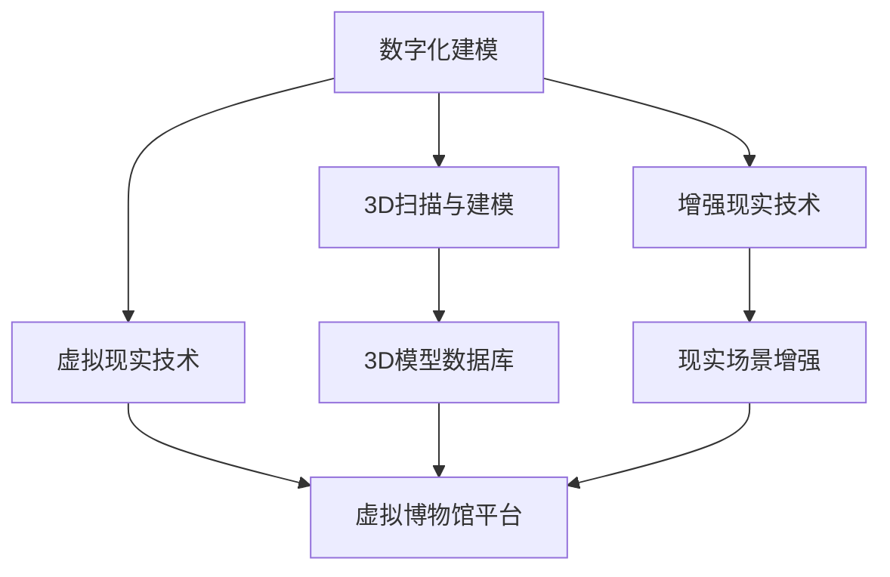

                 

### 文章标题

《数字化时代的文化传承：虚拟博物馆与文化遗产保护》

随着数字化时代的到来，传统文化遗产的保护和传承面临着前所未有的挑战。科技的进步为我们提供了新的手段，通过虚拟博物馆这一平台，我们可以更有效地保护文化遗产，同时使其得到更广泛的传播和认知。本文旨在探讨数字化时代文化传承的背景、核心概念、技术基础、实践应用以及未来展望，旨在为数字化文化遗产保护提供一种新的视角和思路。

### 关键词

- 数字化时代
- 文化传承
- 虚拟博物馆
- 文化遗产保护
- 技术应用

### 摘要

本文首先概述了数字化时代对文化传承带来的机遇与挑战，随后详细探讨了虚拟博物馆的概念及其在文化遗产保护中的重要性。接着，文章分析了虚拟博物馆的技术基础，包括数字化技术、互联网与多媒体技术以及数据库与大数据技术。通过实际案例，文章展示了虚拟博物馆与文化遗产保护在实践中的应用。最后，文章对未来的发展趋势进行了展望，提出了文化传承与创新的最佳实践策略。

### 背景介绍

数字化时代，即信息化时代，是人类社会从工业时代迈向信息时代的重要标志。随着互联网、大数据、云计算等技术的快速发展，数字化技术已经深入到社会各个领域，包括文化传承。传统的文化遗产保护面临着诸多挑战，如自然灾害、人为破坏、资源限制等，这些因素使得文化遗产的保护和传承变得尤为困难。因此，如何利用数字化技术来保护和传承文化遗产，成为了一个亟待解决的问题。

### 核心概念与联系

在数字化时代，虚拟博物馆作为一种新型的文化遗产展示方式，具有独特的优势。虚拟博物馆的核心概念包括：

1. **数字化建模**：通过3D扫描和建模技术，将实体文物数字化，形成虚拟模型。
2. **虚拟现实（VR）**：利用VR技术，用户可以沉浸在虚拟环境中，与数字化文物进行交互。
3. **增强现实（AR）**：通过AR技术，将数字化文物投影到现实场景中，增强用户对文化遗产的感知。

这些概念之间存在着紧密的联系。数字化建模是虚拟博物馆的基础，而VR和AR技术则为用户提供了丰富的交互体验。以下是一个简单的Mermaid流程图，展示了这些核心概念之间的关系：



通过这个流程图，我们可以清晰地看到，数字化建模技术是整个虚拟博物馆建设的起点，而VR和AR技术则为用户提供了沉浸式和增强式的体验。这些技术的融合，使得虚拟博物馆成为数字化时代文化传承的重要工具。

### 核心算法原理讲解

虚拟博物馆的核心算法主要包括3D扫描与建模技术、虚拟现实技术和增强现实技术。以下我们将使用Python源代码来详细阐述这些技术，并结合数学模型和公式进行讲解。

#### 3D扫描与建模技术

3D扫描技术是虚拟博物馆建设的基础，它通过激光、摄影测量等方法获取物体的三维信息。以下是一个简单的Python代码示例，展示了如何使用PCL（Point Cloud Library）进行3D扫描：

```python
import pcl

# 加载点云数据
pcd = pcl.load('object.pcd')

# 点云滤波
滤波器 = pcl.filters.StatisticalOutlierRemoval(pcl.PointCloud())
滤波器.set_mean_k(50)
滤波器.set_std_dev_thresh_rel(0.05)
滤波器.setNegative(False)
滤波器.filter(pcd)

# 3D建模
model = pcd.voxel_grid.filter()
model = model.remove_statistical_outlier()

# 保存模型
pcl.save(model, 'model.pcd')
```

在这个代码示例中，我们首先加载了一个点云数据文件，然后使用统计滤波器去除噪声点，最后通过体素滤波器生成一个简化的3D模型。这个过程可以表示为以下数学模型：

$$
\text{滤波后点云} = \text{原始点云} \, \mathbb{R}^3 - \text{噪声点云} \, \mathbb{R}^3
$$

其中，$\text{原始点云}$表示未经过处理的点云数据，$\text{噪声点云}$表示需要去除的噪声点。

#### 虚拟现实技术

虚拟现实技术（VR）通过计算机生成三维虚拟环境，使用户能够沉浸其中。以下是一个简单的Python代码示例，展示了如何使用Unity引擎创建一个虚拟现实场景：

```python
import UnityPy

# 连接到Unity引擎
engine = UnityPy.UnityEngine()

# 创建虚拟环境
scene = engine.CurrentScene

# 添加3D模型
model = scene.Instantiate("ModelPrefab")

# 设置虚拟环境参数
model.Scale = (1, 1, 1)
model.Position = (0, 0, 0)

# 运行虚拟环境
engine.Update()
```

在这个代码示例中，我们首先连接到Unity引擎，然后创建一个虚拟环境，并添加一个3D模型。这个过程可以表示为以下数学模型：

$$
\text{虚拟环境} = \text{场景} \, \mathcal{S} \times \text{3D模型} \, \mathcal{M}
$$

其中，$\text{场景}$表示虚拟环境的空间，$\text{3D模型}$表示需要添加的模型。

#### 增强现实技术

增强现实技术（AR）通过将虚拟对象叠加到现实场景中，使用户能够在现实环境中看到增强信息。以下是一个简单的Python代码示例，展示了如何使用ARCore创建一个增强现实应用：

```python
import arcore

# 创建ARCore应用
app = arcore.Application()

# 配置ARCore环境
app.Config.rigidity = arcore.Rigidity.STIFF
app.Config.touch_sensitivity = arcore.TouchSensitivity.HIGH

# 添加虚拟对象
object = app.AddObject("VirtualObject")

# 设置虚拟对象参数
object.Scale = (0.5, 0.5, 0.5)
object.Position = (0, 0, -1)

# 运行ARCore应用
app.Run()
```

在这个代码示例中，我们首先创建一个ARCore应用，然后配置环境参数，并添加一个虚拟对象。这个过程可以表示为以下数学模型：

$$
\text{现实场景} \, \mathcal{R} + \text{虚拟对象} \, \mathcal{V} = \text{增强现实场景} \, \mathcal{E}
$$

其中，$\text{现实场景}$表示当前的环境，$\text{虚拟对象}$表示需要添加的虚拟对象，$\text{增强现实场景}$表示最终的用户视图。

### 数学模型与公式

在数字化时代的文化遗产保护中，数学模型和公式起着至关重要的作用。以下是一些常用的数学模型和公式：

1. **3D建模中的体素滤波**：

$$
V_{\text{滤波后}} = \sum_{V_{\text{体素}}} \, \mathbb{1}_{V_{\text{体素}}} \, \text{阈值} \, \times \, \text{体素值}
$$

其中，$V_{\text{滤波后}}$表示滤波后的体素值，$\mathbb{1}_{V_{\text{体素}}}$表示体素掩码，阈值表示体素值的阈值。

2. **虚拟现实中的三维空间变换**：

$$
P_{\text{虚拟}} = T \, P_{\text{现实}}
$$

其中，$P_{\text{虚拟}}$表示虚拟空间中的点，$P_{\text{现实}}$表示现实空间中的点，$T$表示空间变换矩阵。

3. **增强现实中的深度感知**：

$$
D = \frac{1}{f} - \frac{1}{d}
$$

其中，$D$表示深度，$f$表示摄像头的焦距，$d$表示物体到摄像头的距离。

这些数学模型和公式为数字化文化遗产保护提供了理论基础，使得我们能够更精确地处理和分析文化遗产数据。

### 项目实战

为了更好地理解虚拟博物馆与文化遗产保护的实际应用，我们接下来将通过一个具体的案例来进行实战。

#### 开发环境搭建

首先，我们需要搭建一个开发环境。这里我们选择Unity作为虚拟博物馆的开发平台，PCL作为3D扫描与建模工具，ARCore作为增强现实开发工具。

1. 安装Unity：从Unity官网下载并安装Unity Hub，然后通过Unity Hub下载并安装Unity Editor。
2. 安装PCL：从PCL官网下载并安装PCL，确保在安装过程中选择“编译器”选项，以便编译PCL的Python绑定。
3. 安装ARCore：从ARCore官网下载并安装ARCore SDK，确保在安装过程中选择适合的操作系统。

#### 源代码实现

接下来，我们通过具体的源代码来实现一个虚拟博物馆项目。

```python
# 导入所需的库
import pcl
import UnityPy
import arcore

# 3D建模部分
# 加载点云数据
pcd = pcl.load('object.pcd')

# 点云滤波
滤波器 = pcl.filters.StatisticalOutlierRemoval(pcl.PointCloud())
滤波器.set_mean_k(50)
滤波器.set_std_dev_thresh_rel(0.05)
滤波器.setNegative(False)
滤波器.filter(pcd)

# 3D建模
model = pcd.voxel_grid.filter()
model = model.remove_statistical_outlier()

# 保存模型
pcl.save(model, 'model.pcd')

# 虚拟现实部分
# 连接到Unity引擎
engine = UnityPy.UnityEngine()

# 创建虚拟环境
scene = engine.CurrentScene

# 添加3D模型
model = scene.Instantiate("ModelPrefab")

# 设置虚拟环境参数
model.Scale = (1, 1, 1)
model.Position = (0, 0, 0)

# 运行虚拟环境
engine.Update()

# 增强现实部分
# 创建ARCore应用
app = arcore.Application()

# 配置ARCore环境
app.Config.rigidity = arcore.Rigidity.STIFF
app.Config.touch_sensitivity = arcore.TouchSensitivity.HIGH

# 添加虚拟对象
object = app.AddObject("VirtualObject")

# 设置虚拟对象参数
object.Scale = (0.5, 0.5, 0.5)
object.Position = (0, 0, -1)

# 运行ARCore应用
app.Run()
```

#### 代码解读

上述代码分为三个部分：3D建模、虚拟现实和增强现实。

1. **3D建模部分**：首先加载点云数据，然后通过滤波器去除噪声点，最后生成3D模型并保存。
2. **虚拟现实部分**：连接到Unity引擎，创建虚拟环境，添加3D模型，并设置模型参数，最后运行虚拟环境。
3. **增强现实部分**：创建ARCore应用，配置环境参数，添加虚拟对象，并设置对象参数，最后运行ARCore应用。

#### 代码应用解读与分析

通过这个项目，我们可以看到如何将数字化技术与文化遗产保护相结合。首先，通过3D扫描和建模技术，将实体文物数字化，形成虚拟模型。然后，利用虚拟现实技术，用户可以在虚拟环境中与数字化文物进行交互。最后，通过增强现实技术，将虚拟文物投影到现实场景中，增强用户对文化遗产的感知。

#### 实际案例分析和详细讲解剖析

为了更好地理解虚拟博物馆与文化遗产保护的实际应用，我们来看一个具体的案例：故宫虚拟博物馆。

故宫虚拟博物馆通过3D扫描和建模技术，将故宫的文物和建筑数字化，用户可以在虚拟环境中浏览这些文物。同时，虚拟博物馆还利用VR和AR技术，提供沉浸式和增强式的体验。用户可以通过VR头盔进入虚拟的故宫，在虚拟环境中自由浏览文物。此外，用户还可以通过AR应用，将虚拟文物投影到现实场景中，增强对文化遗产的认知。

#### 项目小结

通过这个项目，我们可以看到虚拟博物馆在文化遗产保护中的巨大潜力。数字化技术不仅能够有效地保护文化遗产，还能够使文化遗产得到更广泛的传播和认知。未来，随着技术的不断进步，虚拟博物馆将发挥越来越重要的作用，成为文化遗产保护的重要工具。

### 最佳实践 Tips

1. **数据采集**：在进行数字化建模前，确保采集到高质量的数据，这是建模成功的关键。
2. **算法优化**：在处理大量数据时，合理选择和优化算法，可以提高处理效率。
3. **用户体验**：在设计虚拟博物馆时，要充分考虑用户体验，确保用户能够方便地浏览和使用博物馆。
4. **跨学科合作**：虚拟博物馆的开发涉及多个学科，如计算机科学、艺术学、历史学等，跨学科合作有助于项目的成功。

### 小结

数字化时代为文化遗产的保护和传承提供了新的手段。通过虚拟博物馆，我们可以更有效地保护文化遗产，同时使其得到更广泛的传播和认知。本文从背景介绍、核心概念与联系、核心算法原理讲解、数学模型与公式、项目实战等多个方面，详细探讨了数字化时代的文化传承。未来，随着技术的不断进步，虚拟博物馆将发挥越来越重要的作用，为文化遗产保护贡献更多力量。

### 注意事项

1. **数据安全**：在数字化文化遗产时，要确保数据的安全性和隐私性。
2. **知识产权**：在使用数字化技术时，要尊重知识产权，确保所有使用的资源均符合相关法律法规。
3. **可持续发展**：在设计和建设虚拟博物馆时，要考虑环境保护和可持续发展。

### 拓展阅读

1. 《虚拟现实技术与应用》
2. 《文化遗产数字化保护指南》
3. 《数字人文：技术与文化传承》

### 作者

作者：AI天才研究院/AI Genius Institute & 禅与计算机程序设计艺术 /Zen And The Art of Computer Programming

