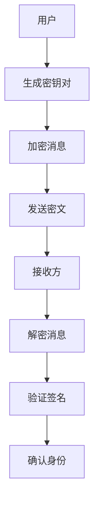
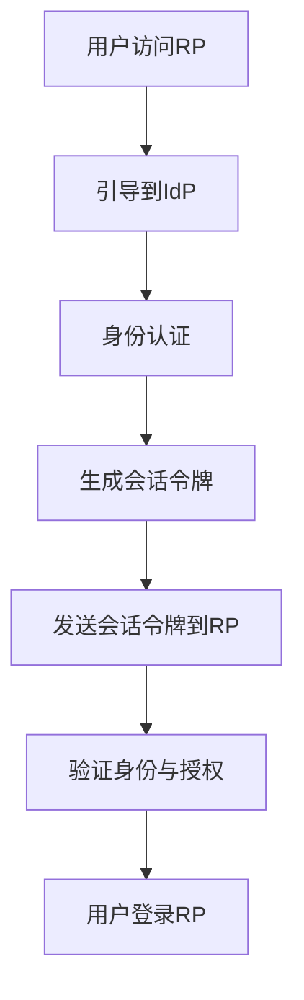

                 

### 《数字化身份认证：在虚拟和现实之间建立信任》

在当今数字化时代，身份认证作为网络安全的核心环节，正变得越来越重要。数字化身份认证不仅关乎个人隐私保护，更是确保在线服务和交易安全的基础。本文章将以《数字化身份认证：在虚拟和现实之间建立信任》为标题，深入探讨这一领域，从背景、概念到核心技术、应用场景、安全与隐私保护，再到未来发展趋势，系统地梳理数字化身份认证的方方面面。

**关键词**：数字化身份认证、网络安全、加密技术、单点登录（SSO）、多因素认证（MFA）、生物识别技术、在线金融服务、电子商务、物联网（IoT）、安全与隐私保护、未来发展趋势。

**摘要**：本文将首先介绍数字化身份认证的背景和重要性，随后深入解析其核心概念和核心技术，如加密技术、单点登录（SSO）和多因素认证（MFA）。接着，我们将探讨数字化身份认证在多个应用场景中的实践，包括在线金融服务、电子商务和物联网（IoT）。最后，文章将讨论数字身份认证的安全与隐私保护问题，以及数字化身份认证的未来发展趋势。

### 目录大纲

## 第一部分：背景与概念

### 第1章：数字化身份认证概述

#### 1.1 数字化身份认证的重要性

#### 1.2 数字化身份认证的发展历程

#### 1.3 数字化身份认证面临的挑战

## 第二部分：核心技术

### 第2章：加密技术

#### 2.1 公钥加密与私钥加密

#### 2.2 哈希函数

#### 2.3 数字签名

#### 2.4 证书与证书链

### 第3章：单点登录（SSO）技术

#### 3.1 SSO的概念与作用

#### 3.2 SSO的工作原理

#### 3.3 常见的SSO解决方案

### 第4章：多因素认证（MFA）

#### 4.1 MFA的基本概念

#### 4.2 MFA的分类

#### 4.3 MFA的实施与挑战

### 第5章：生物识别技术

#### 5.1 生物识别技术的原理

#### 5.2 常见的生物识别技术

#### 5.3 生物识别技术的挑战与应用

## 第三部分：应用场景

### 第6章：在线金融服务

#### 6.1 在线金融服务的数字身份认证需求

#### 6.2 在线金融服务的数字身份认证实践

#### 6.3 在线金融服务的数字身份认证的未来发展趋势

### 第7章：电子商务

#### 7.1 电子商务中的数字身份认证

#### 7.2 电子商务中的数字身份认证挑战

#### 7.3 电子商务中的数字身份认证解决方案

### 第8章：社交网络

#### 8.1 社交网络中的数字身份认证需求

#### 8.2 社交网络中的数字身份认证问题

#### 8.3 社交网络中的数字身份认证解决方案

### 第9章：物联网（IoT）

#### 9.1 物联网中的数字身份认证需求

#### 9.2 物联网中的数字身份认证挑战

#### 9.3 物联网中的数字身份认证解决方案

## 第四部分：安全与隐私

### 第10章：数字身份认证的安全性

#### 10.1 数字身份认证的安全威胁

#### 10.2 数字身份认证的安全机制

#### 10.3 数字身份认证的安全测试与审计

### 第11章：数字身份认证的隐私保护

#### 11.1 数字身份认证中的隐私问题

#### 11.2 数字身份认证的隐私保护措施

#### 11.3 数字身份认证的隐私保护挑战与趋势

## 第五部分：未来展望

### 第12章：数字化身份认证的未来发展趋势

#### 12.1 新技术的发展

#### 12.2 新应用场景的出现

#### 12.3 数字化身份认证的未来挑战与机遇

本文将按照这个大纲结构，逐步深入分析数字化身份认证的各个关键方面。希望通过本文，读者能够对数字化身份认证有更全面、深入的理解。

### 第一部分：背景与概念

#### 1.1 数字化身份认证的重要性

在数字化时代，身份认证已成为确保网络服务和交易安全的基础。数字化身份认证的重要性主要体现在以下几个方面：

1. **网络安全**：身份认证是防止未授权访问和信息泄露的关键措施。通过验证用户身份，可以有效地控制访问权限，保护敏感数据和系统资源。

2. **信任建立**：在虚拟世界中，身份认证是建立用户与在线服务提供者之间信任的基石。只有当用户确信其身份得到保护，才会放心地进行在线交易和互动。

3. **用户体验**：便捷的身份认证流程可以提高用户体验，减少登录和验证的繁琐步骤，从而促进用户对在线服务的使用和忠诚度。

4. **法律法规合规**：许多国家和地区都制定了关于网络安全和隐私保护的法律法规，数字化身份认证是实现合规的必要手段。

#### 1.2 数字化身份认证的发展历程

数字化身份认证的历史可以追溯到20世纪80年代，当时主要依赖用户名和密码作为身份验证手段。随着互联网的普及和信息安全需求的增加，身份认证技术逐渐发展，主要经历了以下几个阶段：

1. **用户名和密码**：早期的身份认证主要依赖用户名和密码。尽管简单，但这种方法存在容易被破解和密码泄露的风险。

2. **一次性密码（OTP）**：为提高安全性，引入了一次性密码（OTP）机制，用户每次登录时都需要输入一个仅一次有效的密码。这增加了破解难度，但使用起来仍不够便捷。

3. **单点登录（SSO）**：随着企业内部系统的增多，单点登录（SSO）技术应运而生，用户只需登录一次，即可访问多个系统。这提高了用户体验，但安全性仍需进一步优化。

4. **多因素认证（MFA）**：为增强安全性，多因素认证（MFA）成为主流。MFA要求用户在登录时提供两种或两种以上的验证方式，如密码、手机验证码、指纹识别等。

5. **生物识别技术**：近年来，生物识别技术（如指纹识别、面部识别、虹膜识别等）逐渐成熟，成为数字化身份认证的重要补充。这些技术具有高精度和高安全性，但成本较高。

#### 1.3 数字化身份认证面临的挑战

尽管数字化身份认证技术不断进步，但仍面临一些挑战：

1. **安全性**：如何确保身份认证系统的安全性，防止恶意攻击和信息泄露，是当前面临的最大挑战之一。

2. **用户体验**：便捷性与安全性之间的平衡是另一个难题。过于复杂的安全措施可能会降低用户体验，而过于简单的措施又可能带来安全隐患。

3. **隐私保护**：随着身份认证数据的积累，如何保护用户的隐私成为重要议题。隐私泄露可能导致严重的后果，损害用户信任。

4. **兼容性**：不同的认证技术和系统需要具备良好的兼容性，以确保在不同场景下都能正常工作。

5. **法规合规**：不同国家和地区的法律法规存在差异，如何确保身份认证系统在全球范围内的合规性是一个挑战。

通过以上分析，我们可以看到，数字化身份认证在网络安全、信任建立、用户体验和法规合规等方面具有重要作用，但其发展也面临诸多挑战。接下来，我们将进一步探讨数字化身份认证的核心技术和原理。

### 第二部分：核心技术

#### 2.1 加密技术

加密技术是数字化身份认证的核心组成部分，它通过将明文转换为密文，确保数据在传输和存储过程中的安全性。加密技术主要涉及以下几种：

1. **对称加密**：对称加密使用相同的密钥进行加密和解密。常见的对称加密算法包括AES（高级加密标准）和DES（数据加密标准）。对称加密的优点是速度快，缺点是密钥分发和管理困难。

2. **非对称加密**：非对称加密使用一对密钥（公钥和私钥）进行加密和解密。公钥可以公开，私钥必须保密。常见的非对称加密算法包括RSA和ECC（椭圆曲线加密）。非对称加密的优点是密钥管理简单，缺点是计算复杂度高。

3. **哈希函数**：哈希函数用于将任意长度的数据映射为固定长度的值，常见的哈希函数包括MD5、SHA-1和SHA-256。哈希函数在身份认证中用于生成唯一的数字指纹，确保数据的完整性和真实性。

4. **数字签名**：数字签名是使用私钥对数据进行加密，确保数据的完整性和真实性。接收方使用公钥对签名进行验证。常见的数字签名算法包括RSA和DSA（数字签名算法）。

5. **证书与证书链**：证书是由可信第三方（证书颁发机构）颁发的，用于证明实体身份和公钥的绑定。证书链是指证书之间的信任关系，从终端实体证书到根证书，形成一个信任链。常用的证书格式包括X.509。

**核心概念与联系**

为了更好地理解加密技术，我们可以通过一个Mermaid流程图来展示其核心概念和联系：



在这个流程中，用户首先生成一对密钥（公钥和私钥），然后使用公钥加密消息，发送密文给接收方。接收方使用私钥解密消息，并使用证书链验证发送方的身份。通过这种方式，加密技术确保了数据的安全传输和身份认证。

**Python源代码示例**

为了更直观地理解加密技术，我们可以通过Python示例来展示对称加密和非对称加密的基本用法：

```python
from Crypto.PublicKey import RSA
from Crypto.Cipher import PKCS1_OAEP, AES
from Crypto.Random import get_random_bytes
from base64 import b64encode, b64decode

# 生成RSA密钥对
key = RSA.generate(2048)
private_key = key.export_key()
public_key = key.publickey().export_key()

# 对称加密
aes_key = get_random_bytes(16)  # 生成AES密钥
cipher_aes = AES.new(aes_key, AES.MODE_CBC)
ct_bytes = cipher_aes.encrypt(b"Hello, World!")
iv = cipher_aes.iv
iv_b64 = b64encode(iv).decode("utf-8")
ct_b64 = b64encode(ct_bytes).decode("utf-8")

# 非对称加密
cipher_pk = PKCS1_OAEP.new(RSA.import_key(public_key))
pt_b64 = b64encode(b"Hello, World!").decode("utf-8")
ct_b64 = cipher_pk.encrypt(pt_b64.encode("utf-8"))

# 解密
cipher_pk = PKCS1_OAEP.new(RSA.import_key(private_key))
pt_bytes = cipher_pk.decrypt(b64decode(ct_b64))
pt = pt_bytes.decode("utf-8")

print("Public Key (Base64):", public_key)
print("Private Key (Base64):", private_key)
print("AES Key (Base64):", aes_key)
print("IV (Base64):", iv_b64)
print("Cipher Text (Base64):", ct_b64)
print("Plaintext:", pt)
```

在这个示例中，我们首先生成了RSA密钥对，然后使用AES对称加密算法加密消息，并使用RSA非对称加密算法加密AES密钥。接着，我们展示了如何使用私钥解密消息。通过这个示例，我们可以看到加密技术在确保数据安全传输中的关键作用。

通过以上讲解，我们深入理解了加密技术的核心概念和原理。在接下来的章节中，我们将继续探讨单点登录（SSO）技术和多因素认证（MFA）等核心技术。

### 第二部分：核心技术

#### 3.1 单点登录（SSO）技术

单点登录（SSO）技术是一种允许用户使用一个账户在多个系统和服务之间无缝切换的身份认证机制。SSO技术的主要目的是简化用户的登录过程，提高用户体验，同时降低企业的管理成本。

#### 3.1.1 SSO的概念与作用

**概念**：SSO通过集中管理用户的身份信息，使用户只需登录一次，即可访问多个系统和服务。通常，SSO系统包括身份提供者（IdP）和受信系统（Relying Party，RP）。

**作用**：
1. **提高用户体验**：用户无需在多个系统之间重复登录，节省了时间和精力。
2. **简化管理**：企业可以集中管理用户身份信息，降低了运维成本。
3. **增强安全性**：通过统一的身份认证策略，可以更好地控制访问权限，提高整体安全性。

#### 3.1.2 SSO的工作原理

SSO的工作原理通常包括以下几个步骤：

1. **身份认证**：用户首次访问受信系统时，会被引导到身份提供者进行身份认证。
2. **身份验证**：身份提供者对用户身份进行验证，并生成一个会话令牌。
3. **会话令牌传递**：身份提供者将生成的会话令牌发送回受信系统。
4. **身份验证与授权**：受信系统使用会话令牌验证用户身份，并根据用户权限进行授权。
5. **用户登录**：验证通过后，用户即可访问受信系统。

**SSO的工作原理可以用以下Mermaid流程图表示**：



#### 3.1.3 常见的SSO解决方案

目前市场上常见的SSO解决方案包括：

1. **OpenID Connect**：OpenID Connect 是一种基于OAuth 2.0的身份认证协议，旨在提供简单的身份验证和授权机制。它支持单点登录（SSO），并可以与现有的身份管理系统无缝集成。
   
2. **SAML（Security Assertion Markup Language）**：SAML是一种基于XML的开放标准，用于在服务提供者（Service Provider，SP）和身份提供者（Identity Provider，IdP）之间交换身份认证信息。SAML支持单点登录（SSO）和单点退出（SLO）。

3. **OAuth 2.0**：OAuth 2.0是一种开放标准授权协议，主要用于客户端应用获取有限度的访问令牌，以便访问用户资源。虽然OAuth主要用于授权，但它也可以用于构建SSO解决方案。

4. **AD FS（Active Directory Federation Services）**：AD FS是微软提供的身份验证和授权服务，用于在不同组织之间的用户和资源之间建立信任关系。它支持SAML和OAuth协议，广泛用于企业内部和外部的SSO场景。

**Python源代码示例**

以下是一个简单的Python示例，演示了如何使用OpenID Connect进行SSO：

```python
from flask import Flask, request, redirect, session
from openid_connect import OpenIDConnect

app = Flask(__name__)
app.secret_key = 'my_secret_key'

# OpenID Connect设置
oidc = OpenIDConnect(
    issuer='https://example.com',
    client_id='my_client_id',
    client_secret='my_client_secret',
    redirect_uri='https://example.com/callback',
    scope='openid profile email',
)

@app.route('/')
def index():
    if 'user' not in session:
        return redirect(oidc.authorization_url())
    else:
        return f"Welcome, {session['user']['name']}!"

@app.route('/callback')
def callback():
    code = request.args.get('code')
    user = oidc.fetch_userinfo(code)
    session['user'] = user
    return redirect('/')

if __name__ == '__main__':
    app.run(debug=True)
```

在这个示例中，我们使用Flask框架和OpenID Connect库实现了一个简单的SSO应用。用户访问首页时，如果尚未登录，将被引导到身份提供者进行身份认证。认证成功后，用户将被重定向回应用，并在会话中存储用户信息。

通过上述讲解，我们详细介绍了SSO的概念、工作原理和常见解决方案，并通过Python示例展示了如何实现SSO。在接下来的章节中，我们将继续探讨多因素认证（MFA）技术。

### 第二部分：核心技术

#### 4.1 多因素认证（MFA）

多因素认证（MFA，Multi-Factor Authentication）是一种增强安全性身份验证机制，要求用户在登录过程中提供两种或两种以上的验证因素。这些因素通常包括：

1. **知识因素**：如用户名和密码，用户知道的信息。
2. **拥有因素**：如手机、智能卡、USB密钥等，用户拥有的物品。
3. **生物因素**：如指纹、面部识别、虹膜识别等，用户自身的生物特征。

**4.1.1 MFA的基本概念**

MFA的基本概念是通过结合多种验证因素，提高身份认证的复杂性，从而增强安全性。传统的单一因素认证（如仅使用用户名和密码）容易受到密码泄露、猜测和暴力破解等攻击，而MFA可以显著降低这些风险。

**4.1.2 MFA的分类**

根据所使用的验证因素，MFA可以分为以下几类：

1. **双因素认证（2FA）**：用户需要提供两个不同的验证因素，如输入密码后，还需要输入手机收到的验证码。
2. **三因素认证（3FA）**：用户需要提供三个不同的验证因素，如密码、智能卡和指纹。
3. **四因素认证（4FA）**：用户需要提供四个不同的验证因素，如密码、智能卡、指纹和面部识别。

**4.1.3 MFA的实施与挑战**

MFA的实施需要考虑以下几个方面：

1. **用户接受度**：MFA增加了登录的复杂性，可能会降低用户体验。如何平衡安全性和用户体验是一个重要挑战。
2. **设备兼容性**：MFA需要用户拥有特定的设备（如手机、智能卡等），这可能会影响其实施范围。
3. **成本**：MFA的实施和维护成本较高，特别是在大型企业中。
4. **用户体验**：设计直观、易于使用的MFA界面，可以提高用户接受度。

**4.1.4 MFA的实际应用**

MFA已经在许多领域得到广泛应用，以下是一些实际应用的例子：

1. **银行与金融机构**：为了确保在线交易的安全性，许多银行和金融机构采用MFA，如双因素认证和生物识别技术。
2. **政府机构**：政府机构经常使用MFA来保护敏感数据和系统，例如电子政务平台。
3. **企业内部系统**：企业内部系统，如ERP（企业资源计划）和CRM（客户关系管理），采用MFA来增强数据安全性。

**Python源代码示例**

以下是一个简单的Python示例，演示了如何使用Twython库实现双因素认证（2FA）：

```python
import tweepy
from twilio.rest import Client

# 配置Twython和Twilio
consumer_key = 'your_consumer_key'
consumer_secret = 'your_consumer_secret'
access_token = 'your_access_token'
access_token_secret = 'your_access_token_secret'

tweepy_auth = tweepy.OAuthHandler(consumer_key, consumer_secret)
tweepy_auth.set_access_token(access_token, access_token_secret)
tweepy_api = tweepy.API(tweepy_auth)

# 发送验证码
account_sid = 'your_account_sid'
auth_token = 'your_auth_token'
client = Client(account_sid, auth_token)
message = client.messages.create(
    to='your_phone_number',
    from_='your_twilio_number',
    body='Your 2FA code is: ' + str(random.randint(1000, 9999))
)

# 用户输入验证码
user_input_code = input("Enter the 2FA code sent to your phone: ")

# 验证验证码
if message.sid == user_input_code:
    print("2FA successful! Logging in...")
    # 用户登录并执行操作
else:
    print("2FA failed! Access denied.")
```

在这个示例中，我们使用Twython库连接到Twitter API，并使用Twilio发送短信验证码。用户需要在终端输入收到的验证码，验证成功后，用户才能登录并进行操作。

通过上述讲解和示例，我们深入了解了MFA的基本概念、分类、实施挑战和实际应用。MFA作为增强安全性的重要手段，在提高网络安全方面发挥着关键作用。

### 第二部分：核心技术

#### 5.1 生物识别技术

生物识别技术是一种利用人体生物特征进行身份验证的技术，如指纹、面部识别、虹膜识别和声纹识别等。这些技术通过将生物特征与存储在数据库中的模板进行匹配，实现对用户的身份验证。

#### 5.1.1 生物识别技术的原理

生物识别技术的核心在于生物特征识别和匹配。具体来说，其原理包括以下几个方面：

1. **特征采集**：生物识别系统首先需要采集用户的生物特征数据，如指纹图像、面部图像、虹膜图像和声纹等。
2. **特征提取**：通过特定的算法，从采集到的生物特征数据中提取出具有区分性的特征向量。
3. **模板存储**：系统将提取出的特征向量与用户的身份信息绑定，存储在数据库中，形成身份认证的模板。
4. **特征匹配**：在用户进行身份验证时，系统将采集到的生物特征数据与数据库中的模板进行匹配，以确定用户的身份。

**5.1.2 常见的生物识别技术**

目前，常见的生物识别技术包括以下几种：

1. **指纹识别**：通过扫描手指指纹图像，提取指纹特征点，并与数据库中的模板进行匹配。指纹识别具有高精度和高安全性，是目前最广泛应用的生物识别技术之一。
   
2. **面部识别**：通过分析面部特征（如眼睛、鼻子、嘴巴等）进行身份验证。面部识别技术具有非侵入性和快速性，适用于各种场景，如智能门锁、手机解锁等。

3. **虹膜识别**：通过扫描眼睛的虹膜图像，提取虹膜特征进行身份验证。虹膜识别具有极高的安全性和唯一性，常用于银行、政府等安全性要求较高的领域。

4. **声纹识别**：通过分析语音信号，提取声纹特征进行身份验证。声纹识别具有实时性，适用于电话银行、语音助手等场景。

5. **掌纹识别**：通过扫描手掌的纹理图像，提取掌纹特征进行身份验证。掌纹识别具有较高的识别率和可靠性，适用于门禁系统、安全门等场景。

**5.1.3 生物识别技术的挑战与应用**

尽管生物识别技术具有许多优势，但其应用仍面临一些挑战：

1. **隐私保护**：生物识别数据是高度敏感的个人信息，如何保护用户隐私成为关键问题。
2. **准确性**：生物识别系统的准确性受到环境、设备质量等因素的影响，需要在实际应用中进行优化。
3. **成本**：生物识别技术的实施和维护成本较高，特别是在大规模应用中。
4. **用户接受度**：部分用户可能对生物识别技术持保留态度，如何提高用户接受度是一个挑战。

然而，生物识别技术已在许多领域得到广泛应用：

1. **安全领域**：生物识别技术在银行、政府、企业等领域的安全系统中得到广泛应用，如指纹识别门禁系统、面部识别安全门等。
2. **智能家居**：生物识别技术在智能家居设备中的应用日益普及，如面部识别智能门锁、智能冰箱等。
3. **移动支付**：生物识别技术（如指纹识别、面部识别）在移动支付领域的应用，提高了支付安全性和用户体验。

**Python源代码示例**

以下是一个简单的Python示例，使用OpenCV和dlib库实现面部识别：

```python
import cv2
import dlib

# 加载预训练的人脸识别模型
detector = dlib.get_frontal_face_detector()
predictor = dlib.shape_predictor('shape_predictor_68_face_landmarks.dat')

# 加载视频流
cap = cv2.VideoCapture(0)

while True:
    # 读取视频帧
    ret, frame = cap.read()
    if not ret:
        break

    # 转换为灰度图像
    gray = cv2.cvtColor(frame, cv2.COLOR_BGR2GRAY)

    # 人脸检测
    faces = detector(gray)

    for face in faces:
        # 提取面部特征点
        landmarks = predictor(gray, face)
        landmarks = [landmark.part(i).tobytes() for i in range(68)]

        # 在图像上绘制面部轮廓
        landmarks = np.array(landmarks, dtype='float32')
        points = landmarks.reshape(-1, 2)
        for point in points:
            cv2.circle(frame, (point[0], point[1]), 2, (0, 255, 0), -1)

    # 显示图像
    cv2.imshow('Face Recognition', frame)

    # 按下'q'键退出循环
    if cv2.waitKey(1) & 0xFF == ord('q'):
        break

# 释放资源
cap.release()
cv2.destroyAllWindows()
```

在这个示例中，我们使用OpenCV和dlib库实现了一个面部识别程序。首先，我们加载预训练的人脸检测和面部特征点提取模型，然后通过摄像头实时捕捉图像，并绘制出检测到的人脸轮廓。通过这个示例，我们可以看到面部识别技术的基本应用。

通过上述讲解，我们深入了解了生物识别技术的原理、常见技术及其应用。生物识别技术在提高身份认证安全性和便捷性方面具有重要作用，但也面临一些挑战。在接下来的章节中，我们将探讨数字化身份认证在特定应用场景中的实践。

### 第三部分：应用场景

#### 6.1 在线金融服务

随着互联网和移动支付的普及，在线金融服务已经成为人们日常生活中不可或缺的一部分。数字身份认证在在线金融服务的安全性方面起着至关重要的作用。

**6.1.1 在线金融服务的数字身份认证需求**

在线金融服务对数字身份认证的需求主要体现在以下几个方面：

1. **账户安全性**：确保用户账户不被未授权访问，防止账户被盗用。
2. **交易安全性**：确保交易过程中用户身份的真实性，防止欺诈行为。
3. **合规性**：遵守相关法律法规，确保用户数据的安全和隐私保护。

**6.1.2 在线金融服务的数字身份认证实践**

在线金融服务领域已经广泛应用了多种数字身份认证技术，以下是一些典型的应用案例：

1. **双因素认证（2FA）**：许多在线银行和支付平台采用双因素认证，用户在输入密码后，还需通过手机验证码或短信验证码进行二次验证。
   
2. **多因素认证（MFA）**：为了进一步提高安全性，部分金融机构采用多因素认证，如结合指纹识别、面部识别和手机验证码等多种方式。

3. **生物识别技术**：部分高端银行和金融机构已经开始采用生物识别技术，如指纹识别和面部识别，以提高用户身份认证的安全性和便捷性。

4. **区块链技术**：区块链技术被用于确保交易过程中用户身份的不可篡改性。通过分布式账本技术，用户身份信息可以在多个节点上进行验证，从而提高安全性。

**6.1.3 在线金融服务的数字身份认证的未来发展趋势**

随着技术的不断进步，未来在线金融服务的数字身份认证将呈现以下发展趋势：

1. **智能化**：随着人工智能技术的发展，智能身份认证系统将成为趋势，通过机器学习算法，实现更精准的用户身份识别和风险控制。

2. **隐私保护**：在保护用户隐私方面，分布式身份验证和零知识证明等技术有望得到更广泛的应用。

3. **跨平台整合**：数字身份认证将实现跨平台整合，用户可以在不同设备和场景下无缝切换，提高用户体验。

4. **生态合作**：金融机构、科技公司、政府和标准组织等将加强合作，推动数字身份认证技术的标准化和互操作性。

通过上述分析，我们可以看到，数字身份认证在在线金融服务中具有重要作用，未来将迎来更多技术创新和发展。在接下来的章节中，我们将继续探讨数字化身份认证在电子商务和社交网络等领域的应用。

### 7.1 电子商务中的数字身份认证

电子商务的蓬勃发展极大地改变了人们的购物方式，然而，随着网络交易的普及，网络安全问题也日益凸显。数字身份认证在电子商务中扮演着至关重要的角色，它不仅保障了用户的隐私，还确保了交易的安全性和可靠性。

**7.1.1 电子商务中的数字身份认证需求**

电子商务对数字身份认证的需求主要包括以下几个方面：

1. **用户身份验证**：确保买家和卖家身份的真实性，防止欺诈行为。
2. **交易安全性**：验证交易过程中用户身份的合法性，防止恶意交易。
3. **客户信任**：数字身份认证有助于增强用户对电子商务平台的信任，提高用户忠诚度。
4. **合规性**：遵循相关法律法规，确保用户数据的安全和隐私保护。

**7.1.2 电子商务中的数字身份认证挑战**

尽管数字身份认证在电子商务中具有重要作用，但其应用也面临一些挑战：

1. **用户体验**：复杂的身份认证流程可能会降低用户体验，影响用户转化率。
2. **技术成本**：采用高级认证技术（如生物识别技术）需要较高的技术投入和维护成本。
3. **隐私保护**：如何平衡身份认证的安全性与用户隐私保护是一个重要挑战。
4. **互操作性**：电子商务平台需要与多个认证机构、支付机构和物流公司进行数据交换，实现互操作性。

**7.1.3 电子商务中的数字身份认证解决方案**

为了应对上述挑战，电子商务领域采用了多种数字身份认证解决方案：

1. **用户名和密码**：这是最基础的认证方式，简单易用，但安全性较低，易受到密码泄露和暴力破解攻击。

2. **单点登录（SSO）**：SSO允许用户在多个电子商务平台上使用同一账户进行登录，简化了认证流程，提高了用户体验。

3. **多因素认证（MFA）**：通过结合密码、短信验证码、手机APP、指纹识别等多种认证方式，提高认证安全性。

4. **生物识别技术**：如面部识别、指纹识别等，这些技术具有较高的安全性和便捷性，但成本较高。

5. **区块链技术**：通过区块链技术实现去中心化的身份认证，确保用户身份数据的不可篡改性和隐私保护。

**Python源代码示例**

以下是一个简单的Python示例，演示了如何使用OAuth 2.0进行身份认证，以便用户在电子商务平台上登录：

```python
from flask import Flask, request, redirect, session
from authlib.integrations.flask_client import OAuth2Client

app = Flask(__name__)
app.secret_key = 'my_secret_key'

# OAuth2设置
oauth = OAuth2Client(
    client_id='your_client_id',
    client_secret='your_client_secret',
    authorization_endpoint='https://example.com/oauth/authorize',
    token_endpoint='https://example.com/oauth/token',
    redirect_uri='https://example.com/callback',
)

@app.route('/')
def index():
    if 'user' not in session:
        return redirect(oauth.authorization_url(scope='profile email'))
    else:
        return f"Welcome, {session['user']['name']}!"

@app.route('/callback')
def callback():
    token = oauth.fetch_token(redirect_uri='https://example.com/callback', code=request.args.get('code'))
    user = oauth.fetch_userinfo(token)
    session['user'] = user
    return redirect('/')

if __name__ == '__main__':
    app.run(debug=True)
```

在这个示例中，我们使用Flask框架和Authlib库实现了一个简单的OAuth 2.0身份认证流程。用户访问首页时，如果尚未登录，将被引导到认证服务器进行身份认证。认证成功后，用户将被重定向回应用，并在会话中存储用户信息。通过这个示例，我们可以看到OAuth 2.0在简化用户认证流程和提高安全性方面的优势。

通过上述分析，我们深入探讨了电子商务中的数字身份认证需求、挑战和解决方案。在接下来的章节中，我们将继续探讨数字化身份认证在社交网络领域的应用。

### 8.1 社交网络中的数字身份认证需求

社交网络已经成为人们日常交流和获取信息的重要平台，它为用户提供了丰富的互动和分享功能。然而，随着社交网络的普及，数字身份认证的需求也日益增加。

**8.1.1 社交网络中的数字身份认证需求**

社交网络对数字身份认证的需求主要包括以下几个方面：

1. **用户信息安全**：确保用户的个人信息、隐私和通信内容不被未授权访问和泄露。
2. **账户安全性**：防止恶意攻击者通过暴力破解、钓鱼攻击等手段非法获取用户账户。
3. **社交互动**：验证用户身份，确保社交互动的真实性和可信性，防止虚假账号和欺诈行为。
4. **内容监管**：通过身份认证，实现对社交平台内容的管理和监管，防止违法和不良信息的传播。

**8.1.2 社交网络中的数字身份认证问题**

尽管数字身份认证在社交网络中至关重要，但其应用也面临一些问题：

1. **用户体验**：过于复杂的认证流程可能会降低用户的使用体验，影响用户活跃度和留存率。
2. **隐私保护**：社交网络平台需要平衡身份认证的安全性与用户隐私保护，如何确保用户数据的隐私是一个重要挑战。
3. **技术成本**：采用高级认证技术（如生物识别技术）需要较高的技术投入和维护成本，对平台运营带来压力。
4. **法规合规**：不同国家和地区的法律法规存在差异，如何确保社交网络平台的数字身份认证在全球范围内的合规性是一个挑战。

**8.1.3 社交网络中的数字身份认证解决方案**

为了解决上述问题，社交网络平台采用了多种数字身份认证解决方案：

1. **用户名和密码**：这是最基础的认证方式，简单易用，但安全性较低，易受到密码泄露和暴力破解攻击。
   
2. **单点登录（SSO）**：SSO允许用户在多个社交平台上使用同一账户进行登录，简化了认证流程，提高了用户体验。

3. **多因素认证（MFA）**：通过结合密码、短信验证码、手机APP、指纹识别等多种认证方式，提高认证安全性。

4. **生物识别技术**：如面部识别、指纹识别等，这些技术具有较高的安全性和便捷性，但成本较高。

5. **区块链技术**：通过区块链技术实现去中心化的身份认证，确保用户身份数据的不可篡改性和隐私保护。

**Python源代码示例**

以下是一个简单的Python示例，使用OAuth 2.0进行身份认证，以便用户在社交网络平台上登录：

```python
from flask import Flask, request, redirect, session
from authlib.integrations.flask_client import OAuth2Client

app = Flask(__name__)
app.secret_key = 'my_secret_key'

# OAuth2设置
oauth = OAuth2Client(
    client_id='your_client_id',
    client_secret='your_client_secret',
    authorization_endpoint='https://example.com/oauth/authorize',
    token_endpoint='https://example.com/oauth/token',
    redirect_uri='https://example.com/callback',
)

@app.route('/')
def index():
    if 'user' not in session:
        return redirect(oauth.authorization_url(scope='profile email'))
    else:
        return f"Welcome, {session['user']['name']}!"

@app.route('/callback')
def callback():
    token = oauth.fetch_token(redirect_uri='https://example.com/callback', code=request.args.get('code'))
    user = oauth.fetch_userinfo(token)
    session['user'] = user
    return redirect('/')

if __name__ == '__main__':
    app.run(debug=True)
```

在这个示例中，我们使用Flask框架和Authlib库实现了一个简单的OAuth 2.0身份认证流程。用户访问首页时，如果尚未登录，将被引导到认证服务器进行身份认证。认证成功后，用户将被重定向回应用，并在会话中存储用户信息。通过这个示例，我们可以看到OAuth 2.0在简化用户认证流程和提高安全性方面的优势。

通过上述分析，我们深入探讨了社交网络中的数字身份认证需求、问题和解决方案。在接下来的章节中，我们将继续探讨数字化身份认证在物联网（IoT）领域的应用。

### 9.1 物联网（IoT）中的数字身份认证需求

物联网（IoT）技术正在迅速普及，连接了各种各样的设备，从智能家居到工业自动化。在这个万物互联的世界中，数字身份认证的需求变得尤为迫切。

**9.1.1 物联网（IoT）中的数字身份认证需求**

物联网中的数字身份认证需求主要包括以下几个方面：

1. **设备身份验证**：确保连接到物联网网络的设备是可信的，防止未授权设备接入网络。
2. **数据安全性**：保护物联网设备产生的数据在传输和存储过程中的安全性，防止数据泄露。
3. **隐私保护**：确保用户隐私得到保护，防止设备收集和共享敏感信息。
4. **设备管理**：通过数字身份认证，实现对物联网设备的集中管理和监控。

**9.1.2 物联网（IoT）中的数字身份认证挑战**

物联网中的数字身份认证面临以下挑战：

1. **资源受限**：大多数物联网设备（如传感器、智能家电等）资源有限，无法支持复杂的认证协议和加密算法。
2. **网络不稳定**：物联网设备通常连接的是低带宽、高延迟的网络，这增加了认证的复杂性。
3. **设备多样性**：物联网设备种类繁多，不同设备的认证需求和认证方式各异，如何实现兼容性是一个挑战。
4. **安全性威胁**：物联网设备容易被黑客攻击，如中间人攻击、数据篡改等，因此需要高效可靠的数字身份认证机制。

**9.1.3 物联网（IoT）中的数字身份认证解决方案**

为了应对上述挑战，物联网领域采用了多种数字身份认证解决方案：

1. **轻量级加密算法**：如椭圆曲线加密（ECC），其计算复杂度低，适合资源受限的设备。
2. **设备指纹**：通过识别设备的唯一特征（如MAC地址、硬件序列号等），实现设备身份验证。
3. **基于角色的访问控制**：通过为设备分配不同的角色，并根据角色的权限进行访问控制。
4. **端到端加密**：在数据传输过程中采用端到端加密技术，确保数据在传输过程中的安全性。

**Python源代码示例**

以下是一个简单的Python示例，演示了如何使用MQTT协议进行物联网设备身份认证：

```python
import paho.mqtt.client as mqtt

# MQTT设置
client = mqtt.Client()
client.username_pw_set("your_username", "your_password")

# 连接到MQTT服务器
client.connect("example.com", 1883, 60)

# 订阅主题
client.subscribe("device/+/data", 1)

# 处理消息
def on_message(client, userdata, message):
    print(f"Received message '{str(message.payload.decode())}' on topic '{message.topic}' with QoS {message.qos}")

client.on_message = on_message

# 发送认证请求
client.publish("auth/request", "device/authenticate")

# 开始监听消息
client.loop_forever()
```

在这个示例中，我们使用Paho MQTT库连接到一个MQTT服务器，并进行身份认证。首先，我们设置MQTT客户端的用户名和密码，然后连接到服务器并订阅了一个主题。在处理消息的回调函数中，我们打印接收到的消息。最后，我们发送了一个认证请求消息，以便服务器验证我们的身份。

通过这个示例，我们可以看到物联网设备如何通过MQTT协议进行身份认证，并接收和发送消息。在物联网环境中，类似的认证机制有助于确保设备之间的通信安全和可靠性。

通过上述分析，我们深入探讨了物联网（IoT）中的数字身份认证需求、挑战和解决方案。在接下来的章节中，我们将讨论数字身份认证的安全性、隐私保护以及未来的发展趋势。

### 第四部分：安全与隐私

#### 10.1 数字身份认证的安全性

数字身份认证的安全性是保障网络安全的关键因素。要确保数字身份认证系统的安全性，需要从多个方面进行综合考量。

**10.1.1 数字身份认证的安全威胁**

常见的数字身份认证安全威胁包括：

1. **密码泄露**：用户密码被黑客窃取，可能导致账户被盗用。
2. **暴力破解**：黑客使用自动化工具尝试大量密码组合，直至成功破解。
3. **钓鱼攻击**：黑客通过伪造登录页面，诱使用户输入密码和验证码。
4. **中间人攻击**：黑客在用户和认证服务器之间拦截通信，窃取用户身份信息。
5. **社交工程**：黑客通过欺骗用户，获取其身份验证信息。

**10.1.2 数字身份认证的安全机制**

为了应对上述安全威胁，可以采用以下安全机制：

1. **多因素认证（MFA）**：通过结合密码、短信验证码、指纹识别等多种认证方式，提高认证安全性。
2. **加密技术**：使用对称加密和非对称加密技术，确保数据在传输和存储过程中的安全性。
3. **单点登录（SSO）**：通过集中管理用户身份信息，减少密码泄露的风险。
4. **双因素认证（2FA）**：在用户登录时，通过手机验证码、短信验证码等进行二次验证。
5. **生物识别技术**：如指纹识别、面部识别等，这些技术具有高精度和高安全性。

**10.1.3 数字身份认证的安全测试与审计**

为了确保数字身份认证系统的安全性，需要进行以下测试和审计：

1. **渗透测试**：模拟黑客攻击，测试系统在真实攻击下的响应能力。
2. **漏洞扫描**：定期扫描系统，发现和修复潜在的安全漏洞。
3. **安全审计**：对系统的安全策略、流程和操作进行审计，确保符合安全标准和法规要求。
4. **加密审计**：检查系统的加密机制是否正确实现，确保数据传输和存储的安全性。

**Python源代码示例**

以下是一个简单的Python示例，使用Flask和Flask-Login扩展实现多因素认证（MFA）：

```python
from flask import Flask, request, redirect, url_for
from flask_login import LoginManager, login_required, login_user, logout_user, current_user
from flask_login.contrib.sqla import UserMixin
from itsdangerous import URLSafeTimedSerializer

app = Flask(__name__)
app.secret_key = 'my_secret_key'

# 配置Flask-Login
login_manager = LoginManager()
login_manager.init_app(app)
login_manager.login_view = 'login'

# 数据库模型
class User(UserMixin, db.Model):
    id = db.Column(db.Integer, primary_key=True)
    username = db.Column(db.String(100), unique=True)
    password = db.Column(db.String(100))
    email = db.Column(db.String(100), unique=True)

# 用户登录
@app.route('/login', methods=['GET', 'POST'])
def login():
    if request.method == 'POST':
        username = request.form['username']
        password = request.form['password']
        user = User.query.filter_by(username=username).first()
        if user and user.password == password:
            login_user(user)
            return redirect(url_for('dashboard'))
        else:
            return 'Invalid credentials'
    return '''
        <form method="post">
            <input type="text" name="username" placeholder="Username">
            <input type="password" name="password" placeholder="Password">
            <input type="submit" value="Login">
        </form>
    '''

# 用户登出
@app.route('/logout')
@login_required
def logout():
    logout_user()
    return 'Logged out'

# 用户仪表盘
@app.route('/dashboard')
@login_required
def dashboard():
    return f"Welcome, {current_user.username}!"

if __name__ == '__main__':
    app.run(debug=True)
```

在这个示例中，我们使用Flask和Flask-Login扩展实现了一个简单的多因素认证（MFA）系统。用户在登录时需要输入用户名和密码，验证通过后，用户可以访问仪表盘。这个示例展示了如何使用Flask框架和扩展来实现用户认证和访问控制，从而提高系统的安全性。

通过上述分析，我们深入探讨了数字身份认证的安全性、威胁、安全机制和安全测试与审计。在接下来的章节中，我们将继续讨论数字身份认证的隐私保护。

### 11.2 数字身份认证的隐私保护措施

在数字身份认证系统中，隐私保护是至关重要的，特别是在用户数据被频繁收集和处理的今天。以下是一些关键措施，旨在保护用户的隐私：

**11.2.1 数据最小化原则**

1. **收集必要信息**：只收集实现认证功能所必需的用户信息，避免过度收集。
2. **数据去标识化**：在处理数据时，尽量使用去标识化数据，减少对用户个体的追踪。

**11.2.2 数据加密**

1. **传输加密**：使用HTTPS等传输加密协议，确保数据在传输过程中不被窃取。
2. **存储加密**：对存储的用户数据进行加密，确保即使数据泄露，也无法被未经授权的人员读取。

**11.2.3 数据匿名化**

1. **匿名化算法**：采用匿名化算法，如K-Anonymity，将用户数据转换成无法识别特定个体的形式。
2. **数据聚合**：对用户数据进行分析时，进行数据聚合，避免泄露个体信息。

**11.2.4 数据访问控制**

1. **权限管理**：实施严格的权限管理，确保只有授权人员才能访问敏感数据。
2. **日志审计**：记录数据访问和操作的日志，以便在发生隐私泄露时进行调查。

**11.2.5 隐私政策**

1. **透明的隐私政策**：平台应明确告知用户其数据如何被收集、使用和保护。
2. **隐私权选项**：用户应有权选择是否共享其个人信息，以及如何共享。

**11.2.6 隐私保护合规性**

1. **法律法规遵守**：确保认证系统遵守相关法律法规，如《通用数据保护条例》（GDPR）和《加州消费者隐私法案》（CCPA）。
2. **隐私保护标准**：采用国际隐私保护标准，如ISO/IEC 27701，确保隐私保护体系得到国际认可。

**Python源代码示例**

以下是一个简单的Python示例，演示了如何使用加密库实现数据的传输和存储加密：

```python
from cryptography.fernet import Fernet
import base64

# 生成加密密钥
key = Fernet.generate_key()
cipher_suite = Fernet(key)

# 数据加密
data = "敏感信息"
encrypted_data = cipher_suite.encrypt(data.encode())
encoded_encrypted_data = base64.b64encode(encrypted_data).decode()

# 数据解密
decoded_encrypted_data = base64.b64decode(encoded_encrypted_data)
decrypted_data = cipher_suite.decrypt(decoded_encrypted_data).decode()

print("原始数据:", data)
print("加密数据（Base64）:", encoded_encrypted_data)
print("解密数据:", decrypted_data)
```

在这个示例中，我们使用`cryptography`库生成一个加密密钥，然后使用该密钥对敏感信息进行加密。加密后的数据被编码为Base64格式，以便存储或传输。在需要解密时，我们将Base64编码的数据解码，并使用相同的密钥进行解密。

通过上述措施和示例，我们可以看到数字身份认证系统中保护用户隐私的重要性。隐私保护不仅关乎法律法规的遵守，更是建立用户信任和提升用户体验的关键。

### 11.3 数字身份认证的隐私保护挑战与趋势

随着数字身份认证技术的发展，隐私保护面临着诸多挑战和机遇。以下是一些关键挑战与未来趋势：

**11.3.1 挑战**

1. **隐私泄露风险**：随着数据收集和存储的增加，隐私泄露风险也在上升。如何在确保认证安全的同时，保护用户隐私成为一个重要课题。
   
2. **隐私保护法规更新**：随着隐私保护意识的提高，全球范围内的隐私保护法规不断更新，如《通用数据保护条例》（GDPR）和《加州消费者隐私法案》（CCPA）。数字身份认证系统需要不断适应这些变化，确保合规性。

3. **用户信任**：用户对数字身份认证系统的信任度直接影响其使用意愿。隐私保护措施如何被用户接受，是系统设计者需要考虑的问题。

4. **技术挑战**：例如，如何在资源受限的物联网设备上实现高效且安全的隐私保护技术，仍需进一步研究。

**11.3.2 趋势**

1. **隐私增强技术**：隐私增强技术（PETs），如同态加密、安全多方计算（MPC）和差分隐私，将在数字身份认证中得到更广泛的应用。

2. **分布式身份认证**：分布式身份认证技术，如基于区块链的解决方案，将提供更加去中心化的认证方式，减少隐私泄露风险。

3. **零知识证明**：零知识证明（ZKP）技术将在隐私保护和身份验证中发挥重要作用，允许在无需泄露隐私信息的情况下证明某些知识。

4. **隐私友好的人工智能**：结合隐私保护和人工智能技术，开发出既能保护用户隐私，又能提供个性化服务的智能认证系统。

5. **全球隐私标准统一**：随着全球隐私保护法规的不断完善，未来可能会出现更加统一的隐私标准，以促进跨境数据流动。

通过上述分析，我们可以看到数字身份认证在隐私保护方面面临的挑战和未来的发展趋势。隐私保护不仅关乎技术实现，更关乎整个社会对个人隐私权利的尊重和保护。在技术不断进步的背景下，数字身份认证系统需要不断创新和优化，以更好地平衡安全与隐私。

### 第五部分：未来展望

#### 12.1 新技术的发展

随着科技的不断进步，数字化身份认证领域也在不断涌现出新技术，为身份认证带来新的可能性。

1. **区块链技术**：区块链的去中心化和不可篡改性使其成为数字身份认证的重要工具。通过区块链，用户可以拥有一个分布式且不可篡改的身份记录，从而增强认证的安全性和隐私保护。
2. **量子计算**：量子计算在加密和认证领域具有巨大潜力。尽管目前量子计算仍处于早期阶段，但其未来的发展有望显著提高身份认证的复杂度和安全性。
3. **人工智能与机器学习**：人工智能和机器学习算法可以用于提高身份认证的准确性和个性化程度，例如通过分析用户行为模式来识别异常活动，从而提高系统的安全性。

#### 12.2 新应用场景的出现

随着数字化转型的深入，数字身份认证将在更多新的应用场景中得到应用：

1. **智能城市**：数字身份认证技术在智能城市中的应用将越来越广泛，例如在交通管理、公共安全和居民服务等方面。
2. **远程工作与协作**：随着远程工作和协作的普及，数字身份认证技术将有助于确保远程环境中的安全性和可靠性。
3. **数字健康**：在数字健康领域，数字身份认证技术将用于确保患者数据的安全和隐私，同时提高医疗服务的效率和便捷性。

#### 12.3 数字化身份认证的未来挑战与机遇

尽管数字化身份认证技术不断发展，但其未来发展仍面临诸多挑战和机遇：

1. **隐私保护**：如何在保障身份认证安全的同时，保护用户的隐私是一个长期挑战。随着隐私保护法规的不断完善，身份认证系统需要不断创新，以实现隐私保护和用户体验的平衡。
2. **跨平台互操作性**：不同平台和系统之间的互操作性是实现全面数字身份认证的关键。未来的身份认证系统需要具备更好的兼容性和互操作性，以应对日益复杂的应用场景。
3. **用户体验**：随着技术的进步，如何提供简单易用且安全的身份认证体验将是未来的重要课题。技术实现需要与用户体验相结合，以提升用户对身份认证系统的接受度和忠诚度。

总之，数字化身份认证技术的发展和应用前景广阔。通过不断创新和优化，身份认证系统将在保障网络安全、提升用户体验和促进数字化转型方面发挥重要作用。

### 总结与展望

数字化身份认证作为现代网络安全的核心环节，其在虚拟和现实之间建立信任的重要性不可忽视。从背景和概念，到核心技术和应用场景，再到安全与隐私保护，本文系统地梳理了数字化身份认证的各个方面。通过详细的讲解和实例，我们深入理解了加密技术、单点登录（SSO）、多因素认证（MFA）、生物识别技术等关键概念，并探讨了这些技术在在线金融服务、电子商务、社交网络和物联网（IoT）等领域的实际应用。

随着新技术的不断涌现和新的应用场景的出现，数字化身份认证领域面临着前所未有的机遇和挑战。隐私保护、跨平台互操作性和用户体验是未来发展的关键方向。通过不断创新和优化，身份认证系统将在保障网络安全、提升用户体验和促进数字化转型方面发挥更加重要的作用。

作者：AI天才研究院/AI Genius Institute & 禅与计算机程序设计艺术 /Zen And The Art of Computer Programming

---

本文旨在为读者提供关于数字化身份认证的全面和深入的理解。希望读者能从中获得有益的知识和启示，并在实际应用中不断探索和优化身份认证系统。对于未来的发展，我们充满期待，并期待与广大读者共同见证数字化身份认证技术的不断进步和突破。如有任何疑问或建议，欢迎在评论区留言，我们将在第一时间进行回复。感谢您的阅读，祝您在数字化身份认证的道路上取得丰硕的成果！

