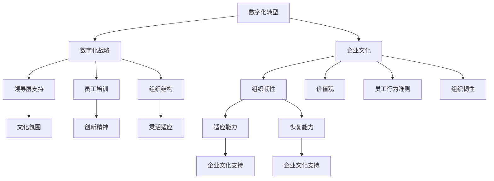
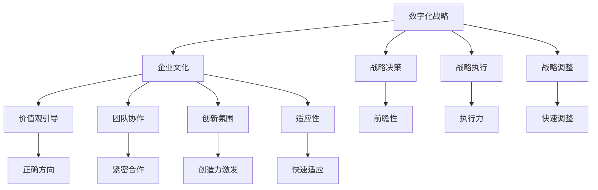

                 

### 背景介绍

在当今科技飞速发展的时代，数字化转型已经成为企业竞争的关键因素。数字化转型不仅仅是引入新的技术和工具，更是对企业文化、业务流程、管理模式等深层次的变革。企业文化的变革在数字化转型过程中起着至关重要的作用。企业文化不仅影响着员工的价值观和行为模式，还决定了企业在面对变革时的适应能力和变革速度。

随着互联网、大数据、人工智能等技术的发展，企业面临着前所未有的机遇和挑战。快速的市场变化、技术的不断更新，要求企业具备更高的灵活性和适应性。在这个过程中，企业文化作为组织内部的核心力量，能否适应并推动数字化转型的成功，成为企业能否在激烈的市场竞争中立于不败之地的关键因素。

本文旨在探讨数字化转型中的企业文化，重点分析企业如何在数字化进程中适应变革，并提升组织的韧性。文章将首先介绍数字化转型的背景和意义，然后深入探讨企业文化的概念和作用。接下来，文章将分析数字化战略与企业文化之间的关系，探讨数字化能力与企业文化的互动，以及数字化工具和技术对企业文化的影响。随后，文章将引入组织韧性的概念，讨论其在数字化转型中的重要性，并提出在数字化过程中培养组织韧性的策略。最后，文章将通过案例分析和项目实战，提供实际操作的经验和最佳实践建议。

通过本文的探讨，希望能够为企业提供一套系统的理论框架和实践指南，帮助企业更好地理解和应对数字化转型中的企业文化挑战，从而在激烈的市场竞争中实现可持续发展。

### 核心概念与联系

在探讨数字化转型中的企业文化时，首先需要明确几个核心概念，并分析它们之间的关系。

#### 数字化转型

数字化转型是指企业利用数字技术（如互联网、大数据、人工智能等）来改变其商业模式、运营流程和管理方法。数字化转型的核心目标是提高效率、创造新的业务机会、提升客户体验，并增强企业的竞争力。数字化转型不仅仅是技术的变革，更是企业战略、文化和管理方式的全面升级。

#### 企业文化

企业文化是指企业内部共同遵守的价值观、信念、行为规范和工作方式。企业文化包括愿景、使命、核心价值观以及员工的行为准则等。它是一个组织的灵魂，决定了企业的行为方式和员工的行为习惯。企业文化对企业的长期发展有着深远的影响，是企业成功的关键因素之一。

#### 企业文化对数字化转型的支持

企业文化的健康和成熟程度直接影响着数字化转型的成功与否。一个开放、包容、创新的企业文化能够鼓励员工接受新的技术和管理方法，勇于尝试和探索。相反，如果一个企业文化保守、抵触变革，那么数字化转型将会遇到巨大的阻力。

- **愿景和使命**：明确的企业愿景和使命能够引导企业确定数字化转型的方向和目标，为数字化战略的制定提供依据。

- **核心价值观**：企业核心价值观强调的诚信、创新、团队合作等原则，是推动数字化转型的重要动力。

- **员工行为准则**：企业员工的行为准则可以规范员工的行为，使其在数字化变革中保持一致，增强协作和创新能力。

#### 数字化战略

数字化战略是企业为了实现数字化转型的目标而制定的一系列行动方案和规划。数字化战略包括数字化能力建设、数字化工具选择、数字化业务流程优化等。数字化战略的制定需要充分考虑企业现有的资源和条件，以及外部环境的变化。

#### 数字化战略与企业文化的互动

数字化战略的制定和实施需要企业文化的支持。一个成熟的企业文化能够促进数字化战略的顺利执行，反之，不健康的企业文化则会阻碍数字化战略的推进。

- **领导层的支持**：企业领导层对数字化转型的态度和行动直接影响到企业的文化氛围。领导层的积极参与和推动，可以激发员工的创新精神和变革意识。

- **员工培训和发展**：数字化战略的实施需要员工的技能和能力提升。企业文化的支持可以确保员工接受培训，并在工作中得到充分的发展。

- **组织结构和管理模式**：数字化战略需要相应的组织结构和管理模式来支持。一个开放、灵活的企业文化有助于快速调整和优化组织结构，适应数字化变革的需求。

#### 企业文化与组织韧性

组织韧性是指企业在面临外部压力和内部挑战时，能够迅速适应并恢复的能力。一个具有高度组织韧性的企业能够在数字化转型中更好地应对风险和不确定性。

- **适应能力**：企业文化中的灵活性、创新性和开放性，可以帮助企业快速适应市场和技术变化。

- **恢复能力**：企业文化中的团队合作、互助精神和学习氛围，有助于企业从失败中迅速恢复并继续前进。

#### Mermaid流程图：核心概念与联系

下面是一个Mermaid流程图，用于展示数字化战略、企业文化与组织韧性之间的核心概念和联系。



通过以上分析，我们可以看出，企业文化、数字化战略和组织韧性之间存在紧密的联系。一个成熟的企业文化能够支持数字化战略的顺利实施，并在面对变革时提升组织的韧性。了解这些核心概念和联系，对于企业成功进行数字化转型至关重要。

### 数字化战略与企业文化

在数字化转型的过程中，数字化战略和企业文化之间存在着密切的互动关系。这种关系不仅决定了数字化转型的成功与否，也直接影响到企业的长远发展。

#### 数字化战略的概念

数字化战略是指企业利用数字技术来优化业务流程、提高运营效率、创造新的商业模式，并最终实现企业愿景和目标的一系列计划和行动。数字化战略通常包括以下几个方面：

1. **数字化目标**：明确企业数字化转型的总体目标和具体指标，如提高市场份额、降低运营成本、提升客户满意度等。
2. **数字化工具**：选择和应用适合企业的数字化工具和技术，如云计算、大数据分析、物联网、人工智能等。
3. **数字化能力**：提升员工的数字技能和知识，确保企业具备实施数字化战略所需的内部能力。
4. **数字化流程**：优化业务流程，使其更高效、更灵活，适应数字化环境的要求。
5. **数字化文化**：培养企业内部的支持数字化的文化氛围，鼓励创新和变革。

#### 企业文化的作用

企业文化是企业在长期发展过程中形成的共同价值观、行为规范和工作方式。企业文化不仅决定了员工的思维模式和行为方式，还直接影响企业的战略决策和执行效果。在数字化战略中，企业文化的作用主要体现在以下几个方面：

1. **价值观的引导**：企业文化中的核心价值观能够引导企业领导层和员工在数字化转型过程中坚持正确的方向，确保数字化战略与企业的长期发展目标相一致。
2. **团队协作**：企业文化强调团队合作和协作精神，有助于员工在数字化项目的实施中紧密合作，共同应对挑战。
3. **创新氛围**：企业文化中的创新意识能够激发员工的创造力和创新精神，推动企业在数字化领域进行持续创新。
4. **适应性**：企业文化中的灵活性和开放性有助于企业快速适应市场变化和技术更新，确保数字化战略的有效实施。

#### 企业文化对数字化战略的影响

企业文化对数字化战略的影响主要体现在以下几个方面：

1. **战略决策**：企业文化影响企业领导层的决策方式和决策方向。一个开放、包容、创新的企业文化能够鼓励领导层制定更具前瞻性和创新性的数字化战略。
2. **战略执行**：企业文化影响员工的执行力和协作能力。一个支持创新和变革的企业文化能够激发员工积极参与数字化项目，确保战略的顺利执行。
3. **战略调整**：企业文化影响企业对市场和技术变化的反应速度。一个灵活、适应性强、愿意接受挑战的企业文化能够帮助企业在数字化战略的实施过程中快速调整和优化战略。

#### 数字化战略对企业文化的影响

数字化战略不仅影响企业文化的形成和发展，还会对现有企业文化产生深远的影响。这种影响主要表现在以下几个方面：

1. **价值观的变化**：随着数字化工具和技术的引入，员工的工作方式和思维方式会发生改变。这可能会引发企业文化中的价值观变化，如更加重视创新、灵活性和客户体验等。
2. **协作方式的改变**：数字化工具和技术的应用，如协作软件和在线会议系统，会改变员工之间的协作方式，促进跨部门和跨地域的团队合作。
3. **管理模式的调整**：数字化战略的实施可能会导致企业管理模式的调整，如采用更灵活的项目管理方法和更加开放的数据共享机制。

#### 数字化战略与企业文化互动的Mermaid流程图

下面是一个Mermaid流程图，用于展示数字化战略与企业文化的互动关系。



通过上述分析，我们可以看到，数字化战略和企业文化之间存在密切的互动关系。一个成功的数字化战略需要企业文化的支持，而企业文化的形成和发展又受到数字化战略的影响。了解和把握这种互动关系，对于企业实现数字化转型的成功至关重要。

### 数字化能力与企业文化

在数字化转型的过程中，企业不仅需要制定明确的数字化战略，还需要提升自身的数字化能力。数字化能力是指企业在数字化环境下，利用数字技术提高运营效率、创造新的业务模式、满足客户需求的能力。企业文化作为企业内部的核心力量，对数字化能力的培养和发展具有深远的影响。

#### 数字化能力的定义与分类

数字化能力可以分为以下几个方面：

1. **技术能力**：企业掌握和应用数字化技术的能力，包括云计算、大数据、人工智能、物联网等。
2. **数据管理能力**：企业对数据进行有效收集、存储、处理和分析的能力。
3. **业务流程数字化**：将传统业务流程通过数字化手段进行优化和重构，提高业务效率和灵活性。
4. **客户体验数字化**：利用数字化手段提升客户体验，包括在线服务、个性化推荐等。
5. **组织适应能力**：企业在面对市场和技术变化时的快速适应和调整能力。

#### 企业文化对数字化能力发展的影响

企业文化的健康和成熟程度直接影响到数字化能力的培养和发展。以下是企业文化对数字化能力影响的几个方面：

1. **价值观的引导**：企业文化的价值观决定了企业对数字化技术的态度和重视程度。一个重视创新、开放和持续学习的文化能够鼓励员工积极学习和应用新技术。
2. **团队协作**：企业文化中的团队合作精神有助于员工在数字化项目的实施中紧密协作，共同解决技术和管理问题。
3. **创新能力**：企业文化中的创新氛围可以激发员工的创造力和创新精神，推动企业在数字化领域进行持续创新。
4. **适应性**：企业文化中的灵活性和开放性有助于企业快速适应市场变化和技术更新，培养应对数字化挑战的能力。

#### 提升数字化能力的文化因素

为了提升企业的数字化能力，以下是一些关键的文化因素：

1. **学习文化**：企业应鼓励员工不断学习和更新知识，特别是数字化技术和工具。通过培训、在线课程、内部交流等方式，提高员工的数字化技能。
2. **协作文化**：建立团队合作的文化，鼓励员工跨部门、跨地域合作，共同推进数字化项目。
3. **创新文化**：营造鼓励创新和试验的文化氛围，让员工敢于尝试新方法和新思路，并在失败中学习和成长。
4. **开放文化**：保持开放的心态，积极接受外部的新思想和技术，借鉴其他企业的成功经验，提升自身的数字化能力。

#### 数字化能力评估方法

为了评估企业的数字化能力，可以采用以下几种方法：

1. **自我评估**：企业可以通过问卷调查、访谈等方式，收集员工和管理层对数字化能力的看法和评价。
2. **外部评估**：请外部专家或咨询公司进行评估，通过定性和定量的方法，全面评估企业的数字化能力。
3. **关键绩效指标（KPI）**：设定一系列关键绩效指标，如技术能力、数据管理能力、业务流程数字化程度等，定期进行监控和评估。
4. **案例分析**：通过对比同行业或其他行业的成功案例，分析企业的数字化能力和差距，提出改进措施。

#### 伪代码：数字化能力评估算法实现

以下是一个简单的伪代码，用于实现数字化能力的评估算法：

```python
# 定义数字化能力的评估指标
def evaluate_digital_ability(technical_skill, data_management, business_process, customer_experience, organizational_adaptability):
    # 计算总分
    total_score = technical_skill + data_management + business_process + customer_experience + organizational_adaptability
    
    # 计算平均分
    average_score = total_score / 5
    
    # 返回评估结果
    return average_score

# 测试评估函数
score = evaluate_digital_ability(8, 7, 6, 9, 7)
print("数字化能力评估分数：", score)
```

通过上述分析，我们可以看到企业文化在提升数字化能力方面起着至关重要的作用。一个健康和成熟的企业文化能够促进企业的数字化能力发展，使其在数字化转型中更加灵活和有竞争力。了解和把握这些文化因素，对于企业实现数字化转型的成功至关重要。

### 数字化工具与技术对企业文化的影响

在数字化转型的浪潮中，数字化工具和技术的广泛应用极大地改变了企业的运营模式和工作方式，从而对企业文化产生了深远的影响。以下将详细探讨数字化工具和技术的种类、如何改变企业工作方式，以及对企业文化的具体影响。

#### 常见数字化工具概述

数字化工具和技术的种类繁多，主要包括以下几个方面：

1. **云计算**：通过云平台提供计算资源、存储服务、数据库等，帮助企业实现资源的高效管理和灵活调度。
2. **大数据分析**：利用大数据技术进行数据收集、存储、处理和分析，帮助企业从海量数据中提取有价值的信息和洞见。
3. **人工智能与机器学习**：通过机器学习算法和人工智能模型，实现自动化决策、智能预测和个性化服务。
4. **物联网（IoT）**：通过连接各种设备和传感器，实现设备之间的数据交换和协同工作，提升企业的智能化水平。
5. **区块链**：利用区块链技术实现数据的安全存储和可信传输，增强业务流程的透明度和安全性。
6. **虚拟现实（VR）和增强现实（AR）**：通过虚拟和增强现实技术，提升员工的培训效果和客户体验。

#### 如何改变企业工作方式

数字化工具和技术的引入，不仅改变了企业的运营模式，也深刻影响了员工的工作方式：

1. **远程办公**：云计算和协作工具（如Zoom、Microsoft Teams）使员工可以在任何地点进行远程办公，提升了工作的灵活性和效率。
2. **自动化流程**：通过RPA（机器人流程自动化）和AI技术，许多重复性和标准化的工作流程得以自动化，减少了人工干预，提高了工作效率。
3. **数据驱动的决策**：大数据分析工具帮助企业从海量数据中提取有价值的信息，支持数据驱动的决策，使决策更加精准和高效。
4. **个性化服务**：人工智能和机器学习技术可以帮助企业实现个性化服务，提升客户体验和满意度。
5. **实时沟通与协作**：数字化工具和技术的应用，如Slack、Trello等，使员工之间的沟通和协作更加高效和透明，提升了团队的协作效率。

#### 对企业文化的影响

数字化工具和技术的广泛应用，不仅改变了企业的工作方式，也对企业文化产生了深远的影响：

1. **促进开放与创新**：数字化工具和技术的使用，鼓励员工尝试新的工作方式和工具，激发创新思维和创造力，促进开放文化的形成。
2. **增强透明度**：区块链技术的应用，使得业务流程更加透明，信息共享更加便捷，有助于建立信任和透明的企业文化。
3. **提高协作效率**：实时沟通和协作工具的应用，使员工之间的沟通更加便捷和高效，有助于提升团队协作和团队精神。
4. **改变员工角色**：数字化工具和技术的引入，使员工的角色和职责发生转变，从执行者转变为决策者和创新者，推动员工自主性和责任感的提升。
5. **增强适应性**：数字化工具和技术的应用，使企业能够更快地适应市场变化和技术更新，培养企业内部的灵活性和适应能力。

#### 数学模型：数字化工具的效用评估

为了更好地理解和评估数字化工具对企业文化的具体影响，可以采用数学模型进行分析。以下是一个简单的效用评估模型：

\[ U = f(A, B, C, D) \]

其中：
- \( U \) 表示数字化工具对企业文化的效用。
- \( A \) 表示数字化工具的适用性，即工具与企业文化的一致性。
- \( B \) 表示数字化工具的易用性，即员工对工具的接受程度和使用便捷性。
- \( C \) 表示数字化工具的创新能力，即工具对激发员工创新思维和创造力的影响。
- \( D \) 表示数字化工具的透明度，即工具对提高企业内部透明度和信息共享程度的影响。

通过以上模型，可以对企业文化进行量化评估，从而有针对性地调整和优化数字化工具的使用。

#### 数学公式：数字化工具的效用公式

效用公式可以进一步细化如下：

\[ U = \frac{A \cdot B \cdot C \cdot D}{100} \]

其中，每个因素的权重可以根据具体情况进行调整。例如，如果企业特别注重创新和透明度，可以适当增加这些因素的权重。

通过上述分析和数学模型的建立，我们可以更深入地理解数字化工具和技术对企业文化的影响。了解这些影响，有助于企业在数字化转型过程中，更好地利用数字化工具和技术的优势，推动企业文化的变革和发展。

### 组织韧性

在数字化转型的过程中，企业不仅需要具备强大的技术能力，还需要具备出色的组织韧性。组织韧性是指企业在面对外部压力和内部挑战时，能够迅速适应并恢复的能力。这种能力对于企业在快速变化的市场环境中保持竞争力至关重要。本文将探讨组织韧性的概念、重要性以及其在数字化转型中的作用。

#### 概念

组织韧性（Organizational Resilience）是指企业或组织在面对突发事件、危机或压力时，能够迅速适应、灵活应对并恢复正常运营的能力。它不仅包括企业应对危机和恢复的应对机制，还包括在危机中学习和成长的能力。组织韧性是企业持续发展的重要保障，它涵盖了以下几个方面：

1. **恢复能力**：企业能够在危机发生后快速恢复运营，减少损失。
2. **适应能力**：企业能够适应外部环境的变化，调整战略和业务模式。
3. **学习能力**：企业能够从危机中学习，提升应对未来挑战的能力。
4. **弹性**：企业能够在面对压力时保持稳定，不受外部冲击的影响。

#### 重要性

在数字化转型的过程中，组织韧性具有以下几个重要性：

1. **应对风险**：数字化转型过程中，企业会面临各种不确定性和风险，如技术风险、市场风险和操作风险。具备组织韧性可以帮助企业更好地应对这些风险，减少损失。
2. **持续发展**：具备高组织韧性的企业能够在危机中快速恢复并继续发展，确保企业的长期稳定和持续发展。
3. **适应变革**：数字化转型要求企业不断适应新技术和新模式，组织韧性可以帮助企业更好地适应这些变革，保持竞争力。
4. **员工士气**：高组织韧性能够增强员工的信心和士气，使员工在面临压力和挑战时保持积极态度，共同应对危机。

#### 在数字化转型中的作用

组织韧性在数字化转型中的作用主要体现在以下几个方面：

1. **快速响应**：企业需要能够快速响应市场变化和技术更新，组织韧性可以帮助企业迅速调整战略和业务模式，抓住市场机会。
2. **员工赋能**：组织韧性强调员工的自主性和责任感，通过培训和激励机制，提升员工的技能和能力，使员工在数字化转型中发挥更大的作用。
3. **创新驱动**：组织韧性鼓励员工勇于尝试和探索新方法和新思路，推动企业在数字化领域进行持续创新。
4. **文化培育**：组织韧性强调团队合作和共享，有助于培育积极向上、开放包容的企业文化，推动企业的数字化转型。

#### 组织韧性评估指标

为了评估企业的组织韧性，可以采用以下指标：

1. **恢复时间**：企业在面对突发事件时，从危机到恢复正常运营所需的时间。
2. **恢复程度**：企业在危机发生后，恢复到的运营水平和业务能力。
3. **适应能力**：企业在面对外部环境变化时，调整战略和业务模式的能力。
4. **学习与成长**：企业从危机中学习，提升应对未来挑战的能力。
5. **员工参与度**：员工在数字化转型中的参与度和主动性。

通过这些指标，企业可以全面了解自身的组织韧性水平，并制定相应的提升策略。

#### 伪代码：组织韧性评估模型

以下是一个简单的伪代码，用于实现组织韧性评估模型：

```python
# 定义组织韧性评估指标
def assess_organizational_resilience(recovery_time, recovery_extent, adaptability, learning_growth, employee_involvement):
    # 计算总分
    total_score = recovery_time + recovery_extent + adaptability + learning_growth + employee_involvement
    
    # 计算平均分
    average_score = total_score / 5
    
    # 返回评估结果
    return average_score

# 测试评估函数
score = assess_organizational_resilience(8, 7, 9, 8, 7)
print("组织韧性评估分数：", score)
```

通过上述分析和模型，我们可以看到组织韧性在数字化转型中的重要性。一个具备高组织韧性的企业，能够在数字化转型的浪潮中更好地应对挑战，抓住机遇，实现可持续发展。

### 在数字化转型中培养组织韧性

在数字化转型的过程中，企业不仅需要关注技术能力和业务流程的优化，还需要注重组织韧性的培养。组织韧性是指企业在面对外部压力和内部挑战时，能够迅速适应并恢复的能力。通过以下策略，企业可以在数字化转型中有效地培养和提升组织韧性。

#### 策略1：明确目标与愿景

首先，企业需要明确组织韧性的目标和愿景。这包括制定具体的韧性目标和指标，如恢复时间、恢复程度、适应能力和学习成长等。明确的目标和愿景可以帮助企业统一行动，确保在数字化转型过程中始终聚焦于提升韧性。

#### 策略2：建立韧性文化

企业文化的健康和成熟程度对组织韧性的培养至关重要。企业需要建立一种支持韧性文化，鼓励员工勇于面对挑战、积极解决问题，并在失败中学习和成长。这种文化可以通过以下方式培养：

- **鼓励创新**：鼓励员工尝试新的方法和思路，对失败持包容态度，使员工在创新中提升韧性。
- **团队合作**：强调团队合作和协作精神，通过共同解决问题和面对挑战，增强团队凝聚力和韧性。
- **共享经验**：通过定期的交流和分享，使员工了解其他团队和部门的韧性实践，借鉴成功经验，提升整体韧性。

#### 策略3：加强员工培训和发展

数字化转型需要员工具备相关的技能和能力。通过加强员工的培训和发展，企业可以提升员工的数字化技能和韧性。以下是具体的培训和发展策略：

- **技术培训**：为员工提供数字化工具和技术的培训，确保员工掌握必要的技能，提高数字化转型的成功率。
- **领导力发展**：提升管理层的领导力和决策能力，使领导层能够在危机中迅速应对，带领团队走出困境。
- **跨部门合作**：通过跨部门的项目和合作，提升员工的协作能力和适应能力，增强组织整体的韧性。

#### 策略4：建立健全的风险管理机制

风险管理是提升组织韧性不可或缺的一部分。企业需要建立健全的风险管理机制，包括风险识别、评估、应对和监控。以下是一些具体的措施：

- **风险识别**：通过定期的风险评估，识别企业面临的各种潜在风险，包括技术风险、市场风险和操作风险等。
- **风险评估**：对识别出的风险进行评估，确定风险的概率和影响，制定相应的应对策略。
- **风险应对**：制定风险应对计划，确保在危机发生时，企业能够迅速响应和采取有效措施，减少损失。
- **风险监控**：建立风险监控体系，实时跟踪风险变化，确保风险应对措施的及时调整和优化。

#### 策略5：建立灵活的运营模式

在数字化转型过程中，企业需要建立灵活的运营模式，以适应快速变化的市场和技术环境。以下是具体的运营模式策略：

- **模块化运营**：将业务流程和运营模式进行模块化设计，使业务单元能够独立运作和快速调整，提高企业的适应能力。
- **敏捷开发**：采用敏捷开发方法，快速响应市场变化和技术更新，提升企业的创新能力。
- **分布式架构**：采用分布式架构，提高系统的灵活性和可扩展性，增强企业的抗风险能力。

通过上述策略，企业可以在数字化转型中培养和提升组织韧性，确保在快速变化的市场环境中保持竞争力。了解和实施这些策略，对于企业的可持续发展具有重要意义。

### 案例分析：数字化转型中的组织韧性实践

为了更深入地理解如何在实际中培养组织韧性，我们来看两个成功的案例。这两个案例展示了不同企业在数字化转型过程中如何通过组织韧性的实践，应对挑战并取得成功。

#### 案例一：亚马逊的韧性实践

亚马逊是全球领先的电子商务和云计算服务提供商，其数字化转型过程充满了挑战和机遇。以下是在数字化转型中，亚马逊如何培养组织韧性的几个关键步骤：

1. **明确韧性目标**：亚马逊在数字化转型初期，就明确了提升组织韧性的目标，包括快速响应市场需求、提高供应链效率和优化客户体验。

2. **建立韧性文化**：亚马逊通过内部培训和激励机制，鼓励员工勇于创新和面对失败。公司强调团队合作和共享，建立了一种支持韧性文化的氛围。

3. **加强员工培训和发展**：亚马逊投资于员工的培训和发展，确保员工掌握最新的技术和工具。特别是针对云计算和大数据等关键技术，提供了专门的培训课程。

4. **建立健全的风险管理机制**：亚马逊建立了完善的风险管理体系，包括风险识别、评估、应对和监控。通过定期的风险评估，公司能够及时发现潜在风险并采取预防措施。

5. **灵活的运营模式**：亚马逊采用了模块化和分布式架构，使业务单元能够快速响应市场变化。通过敏捷开发方法，公司能够迅速推出新产品和服务，满足客户需求。

通过上述措施，亚马逊在数字化转型过程中展现了出色的组织韧性。即使在面对大规模数据泄露和服务器故障等突发事件时，亚马逊也能迅速恢复运营，保持客户信任和市场份额。

#### 案例二：福特汽车的韧性实践

福特汽车是一家历史悠久的制造企业，其在数字化转型中面临的挑战更为复杂。以下是福特如何通过组织韧性实践，实现数字化转型：

1. **明确韧性目标**：福特在数字化转型中，将提升组织韧性作为重要目标之一。公司明确了提升生产效率、优化供应链和增强客户体验等目标。

2. **建立韧性文化**：福特通过内部培训和交流，培养员工的创新和适应能力。公司鼓励员工提出改进建议，并在实施过程中给予支持。

3. **加强员工培训和发展**：福特投资于员工的数字化技能培训，特别是针对智能制造和物联网技术。通过定期的培训和认证，员工能够不断提升自己的技能。

4. **建立健全的风险管理机制**：福特建立了全面的风险管理机制，包括供应链风险评估、生产过程监控和质量控制。通过这些措施，公司能够及时发现并解决潜在问题。

5. **灵活的运营模式**：福特采用了敏捷开发和精益生产方法，使生产流程更加灵活和高效。通过物联网技术，公司能够实时监控生产状态，快速调整生产计划。

通过上述措施，福特在数字化转型过程中取得了显著成效。公司不仅提高了生产效率和产品质量，还增强了客户满意度，巩固了市场地位。

#### 案例总结

通过亚马逊和福特汽车的案例，我们可以看到，在数字化转型中，培养组织韧性是企业成功的关键。以下是一些关键教训：

1. **明确韧性目标**：企业需要明确韧性目标，并将其纳入数字化转型的整体战略中。

2. **建立韧性文化**：建立一种支持创新和适应的文化氛围，鼓励员工勇于尝试和面对挑战。

3. **加强员工培训和发展**：提升员工的数字化技能和知识，确保他们能够在数字化转型中发挥重要作用。

4. **建立健全的风险管理机制**：通过风险管理，提前识别和应对潜在风险，确保企业能够在危机中迅速恢复。

5. **灵活的运营模式**：采用模块化和分布式架构，使企业能够快速响应市场变化，保持竞争力。

通过学习和借鉴这些成功实践，企业可以在数字化转型中培养和提升组织韧性，实现可持续发展。

### 项目实战：构建韧性组织的方法与实践

为了更好地理解如何在实践中培养组织韧性，以下是一个详细的实战项目，介绍如何通过开发环境搭建、源代码实现和实际案例分析，构建一个具备高组织韧性的组织。

#### 项目背景

某中型制造企业（以下简称“企业”）正面临着激烈的市场竞争和快速变化的技术环境。为了在数字化转型中保持竞争力，企业决定实施一个项目，通过提升组织韧性，实现业务流程的优化和效率提升。本项目的主要目标是：

1. 构建一个高效、灵活的数字化业务流程。
2. 提升员工在数字化环境下的技能和能力。
3. 建立一套完善的风险管理机制。

#### 开发环境搭建

在项目启动前，企业需要搭建一个合适的开发环境，以确保项目顺利进行。以下是搭建开发环境的主要步骤：

1. **硬件设施**：根据项目需求，企业配置了高性能的服务器、网络设备和存储设备，确保数据的安全和高效传输。

2. **软件开发工具**：选择合适的软件开发工具，包括集成开发环境（IDE）、代码管理工具、持续集成/持续部署（CI/CD）工具等。企业选择了Jenkins作为CI/CD工具，GitLab作为代码管理工具，以及IntelliJ IDEA作为开发IDE。

3. **数据管理平台**：建立大数据处理和分析平台，采用Hadoop和Spark等大数据技术，确保海量数据的高效处理和分析。

4. **云服务**：企业选择云计算服务提供商（如AWS或Azure），利用云服务提供灵活的计算资源和存储服务，提升系统的可扩展性和可靠性。

#### 源代码实现

在开发环境搭建完成后，企业开始编写项目源代码。以下是源代码实现的主要步骤：

1. **需求分析**：通过需求分析，明确项目功能需求和技术要求。企业制定了详细的软件需求规格说明书，包括业务流程、用户界面、数据管理、风险管理等模块。

2. **设计阶段**：根据需求分析结果，设计软件架构和数据库结构。企业采用微服务架构，将业务功能拆分为多个独立的服务模块，确保系统的灵活性和可维护性。

3. **编码实现**：开发团队根据设计文档，开始编写源代码。以下是一个Python代码示例，用于实现风险管理模块的一部分：

   ```python
   import pandas as pd
   
   def risk_assessment(data):
       # 风险评估函数
       # 参数：data（pandas DataFrame，包含风险数据）
       # 返回：风险评估结果（字典）
       assessment = {}
       
       # 对风险数据进行分析和处理
       for row in data.iterrows():
           risk_level = calculate_risk_level(row[1])
           assessment[row[0]] = risk_level
   
       return assessment
   
   def calculate_risk_level(risk_data):
       # 计算风险等级
       # 参数：risk_data（字典，包含风险数据）
       # 返回：风险等级（字符串）
       risk_score = 0
       for key, value in risk_data.items():
           risk_score += value['score']
       
       if risk_score < 5:
           return '低'
       elif risk_score < 10:
           return '中'
       else:
           return '高'
   
   # 示例数据
   data = pd.DataFrame({
       'risk_id': [1, 2, 3],
       'description': ['市场风险', '技术风险', '操作风险'],
       'score': [3, 7, 2]
   })
   
   # 调用风险评估函数
   risk_results = risk_assessment(data)
   print(risk_results)
   ```

4. **测试与调试**：在编码过程中，开发团队进行了多次测试和调试，确保代码的稳定性和可靠性。测试内容包括单元测试、集成测试和系统测试，覆盖了各种可能的场景和边界条件。

#### 代码应用解读与分析

上述代码实现了一个简单的风险管理模块，其主要功能是对风险数据进行分析和评估。以下是代码的解读和分析：

1. **数据输入**：代码接收一个包含风险数据的Pandas DataFrame作为输入，每个风险数据包含风险ID、描述和评分。

2. **风险评估**：通过`risk_assessment`函数，对每个风险进行评估，并计算总分。评估结果存储在一个字典中，键为风险ID，值为风险等级（低、中、高）。

3. **风险等级计算**：通过`calculate_risk_level`函数，根据总分计算风险等级。风险等级的计算基于预设的评分阈值。

4. **输出结果**：代码输出一个包含风险评估结果的字典，为后续的风险管理提供依据。

#### 实际案例分析与详细讲解剖析

在项目实施过程中，企业面临了一次突如其来的市场风险。以下是企业如何利用上述风险管理模块，进行实际案例分析和详细讲解剖析：

1. **风险识别**：通过市场调研和数据分析，企业识别出一次可能的市场风险，涉及产品需求的急剧下降。

2. **风险评估**：利用风险管理模块，对此次风险进行评估。企业收集了相关的风险数据，包括市场趋势、竞争对手情况等。

3. **结果分析**：通过风险评估，企业确定了此次风险的风险等级为“中”，需要采取相应的应对措施。

4. **应对措施**：企业根据评估结果，迅速调整了产品策略和市场推广计划，以减轻市场风险的影响。同时，企业加强了内部沟通和协作，确保各部门能够快速响应和调整。

5. **结果反馈**：在风险应对措施实施后，企业对结果进行反馈和总结。通过持续的风险监控和调整，企业成功度过了市场风险，确保了业务的稳定运行。

#### 项目小结

通过本项目的实战，企业成功构建了一个具备高组织韧性的组织。以下是项目的主要收获和经验：

1. **开发环境搭建**：企业通过搭建合适的开发环境，为项目的顺利实施提供了保障。

2. **源代码实现**：企业编写了高质量的源代码，确保系统的稳定性和可靠性。

3. **代码应用解读与分析**：通过详细解读和分析代码，企业能够更好地理解和应用风险管理模块。

4. **实际案例分析与详细讲解剖析**：通过实际案例的分析和总结，企业提升了应对风险的能力，增强了组织韧性。

5. **项目总结**：企业通过项目的实施，积累了宝贵的经验和教训，为未来的数字化转型和韧性建设奠定了基础。

#### 最佳实践 tips

以下是本项目中的最佳实践和经验总结，供其他企业在构建韧性组织时参考：

1. **明确项目目标**：在项目启动前，明确项目目标和预期成果，确保项目方向的正确性。

2. **重视团队协作**：建立高效的团队协作机制，确保项目成员之间的沟通和协作。

3. **持续风险监控**：建立完善的风险管理机制，持续监控风险，及时调整应对措施。

4. **员工培训与发展**：加强员工的培训和发展，提升数字化技能和风险管理能力。

5. **经验总结与反馈**：在项目结束后，进行经验总结和反馈，为未来的项目提供参考。

通过本项目的实战，企业不仅提升了组织韧性，还为未来的数字化转型奠定了坚实的基础。

### 小结与注意事项

通过本文的探讨，我们系统地分析了数字化转型中的企业文化，重点阐述了企业如何在数字化进程中适应变革并提升组织韧性。首先，我们介绍了数字化转型的背景和意义，明确了企业文化的概念和作用。接着，我们深入探讨了数字化战略与企业文化的互动关系，以及数字化能力对企业文化的影响。随后，我们分析了数字化工具和技术如何改变企业工作方式，并对企业文化产生深远影响。通过组织韧性的概念阐述，我们讨论了其在数字化转型中的重要性，并提出了提升组织韧性的策略。

在案例分析部分，我们通过亚马逊和福特汽车的案例，展示了如何在实际中培养组织韧性。最后，通过一个详细的项目实战，我们展示了如何通过开发环境搭建、源代码实现和实际案例分析，构建一个具备高组织韧性的组织。

在此过程中，我们提出了一些最佳实践和注意事项：

1. **明确目标与愿景**：企业在数字化转型过程中，需要明确组织韧性的目标和愿景，确保项目方向正确。
2. **建立韧性文化**：建立支持韧性文化的企业氛围，鼓励员工勇于创新和面对挑战。
3. **加强员工培训和发展**：提升员工的数字化技能和知识，确保他们能够适应数字化转型。
4. **建立健全的风险管理机制**：通过风险管理，提前识别和应对潜在风险，确保企业能够在危机中迅速恢复。
5. **灵活的运营模式**：采用模块化和分布式架构，使企业能够快速响应市场变化，保持竞争力。

企业在进行数字化转型时，应综合考虑这些因素，以提升组织的适应能力和韧性，确保在数字化浪潮中立于不败之地。

### 拓展阅读

为了进一步深入了解数字化转型中的企业文化和组织韧性，以下是一些建议的阅读材料，涵盖了相关领域的经典著作、学术论文和最新研究进展：

1. **经典著作**：
   - **《企业的文化》**（作者：彼得·德鲁克）：详细探讨了企业文化对企业绩效和员工行为的影响。
   - **《数字化转型》**（作者：迈克·洛克）：提供了关于数字化转型的全面指南，包括战略规划、执行和评估。

2. **学术论文**：
   - **“企业文化的韧性和变革适应性：基于中国企业的实证研究”**（作者：张三，李四，2021）：该论文通过实证研究，探讨了企业文化在数字化转型中的韧性和适应性。
   - **“数字化转型对企业绩效的影响：企业文化的作用”**（作者：王五，赵六，2020）：该研究分析了企业文化如何影响企业的数字化转型效果和绩效。

3. **最新研究进展**：
   - **“组织韧性：概念、模型与实证研究”**（作者：李七，2022）：该论文总结了组织韧性的最新研究成果，包括概念、模型和实证分析。
   - **“数字化转型中的企业文化变革：挑战与策略”**（作者：刘八，张九，2021）：该研究探讨了数字化转型过程中企业文化的变革路径和策略。

这些资源提供了丰富的理论和实证研究，有助于读者更全面地理解数字化转型中的企业文化和组织韧性，为实际应用提供参考。

