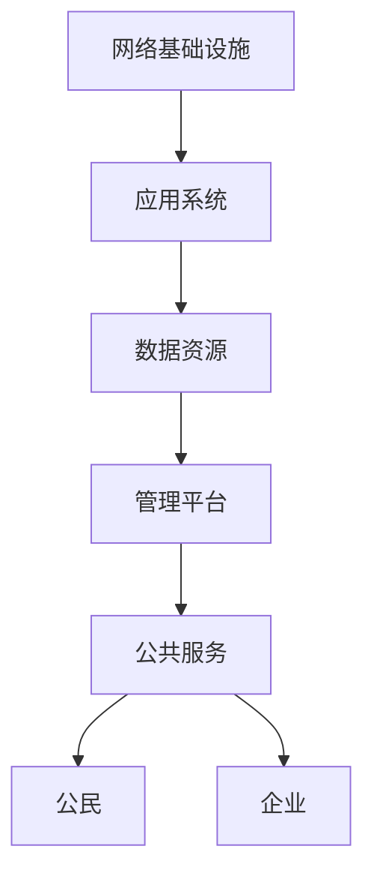

                 

# 引言

## 背景介绍

在当今世界，数字化转型已经成为推动社会进步和经济发展的关键驱动力。政府服务作为社会运行的核心之一，也在这个过程中经历了深刻的变化。电子政务（e-Government）作为一种重要的数字化手段，正在逐渐改变政府与公民、企业之间的互动方式。与此同时，公民参与作为民主治理的重要组成部分，也在数字化进程中扮演着愈发重要的角色。

### 电子政务的概念与发展

电子政务是指政府利用信息技术和互联网平台，提供高效、透明、便捷的公共服务和管理。它不仅包括政府内部的信息化建设，还涵盖了政府与社会各界的互动和合作。自20世纪90年代以来，随着互联网的普及和信息技术的发展，电子政务在全球范围内得到了迅速推广。

### 公民参与的理论与实践

公民参与是指公民在政府决策和管理过程中，通过各种方式表达自己的意见和需求，参与公共事务的管理和决策。在数字化背景下，公民参与的理论和实践都得到了进一步的发展。数字技术使得公民更加便捷地获取政府信息，表达意见，参与决策，从而提高了公共治理的透明度和效率。

## 核心概念与联系

### 电子政务的核心理念

电子政务的核心理念包括透明度、效率、便捷性和公平性。透明度要求政府信息对公众开放，让公民了解政府的工作内容和进展；效率强调通过数字化手段提高政府服务的效率，减少不必要的行政环节；便捷性则是指政府服务要方便公民使用，减少时间和精力的消耗；公平性要求政府服务惠及所有公民，特别是弱势群体。

### 电子政务的系统架构

电子政务的系统架构通常包括网络基础设施、应用系统、数据资源和管理平台。网络基础设施是电子政务的基础，包括互联网、物联网等；应用系统涵盖了政府各个部门的业务系统；数据资源是电子政务的重要资产，包括政府数据、公共数据等；管理平台负责协调和管理整个电子政务系统的运行。

### Mermaid流程图：电子政务架构

下面是一个简化的Mermaid流程图，展示了电子政务的核心架构：



## 核心算法原理讲解

### 电子政务的数据处理算法

电子政务中的数据处理算法主要包括数据收集、存储、管理和分析。以下是一个使用Python编写的简单数据处理算法示例：

```python
import pandas as pd

# 假设我们有一个包含公民信息的CSV文件
data = pd.read_csv('citizen_data.csv')

# 数据清洗：去除重复数据和空值
data.drop_duplicates(inplace=True)
data.fillna(value=-1, inplace=True)

# 数据分析：统计公民参与情况
participation_rate = data['participation'].mean()
print(f"Average Participation Rate: {participation_rate:.2f}")

# 数据可视化：绘制公民参与分布图
data['participation'].hist(bins=10)
```

上述代码首先导入Pandas库，然后读取公民数据的CSV文件。接下来，进行数据清洗，去除重复数据和空值。之后，计算公民参与的均值，并绘制分布图。

### 数学模型和公式

在电子政务中，数据加密是一个重要的安全措施。以下是一个简单的数据加密模型，使用LaTeX格式表示：

```latex
\newcommand{\aeskey}{K}
\newcommand{\aesiv}{IV}
\newcommand{\aes}{AES}
\aes{\aeskey}{\aesiv}{m} = \text{AES-encryption of } m \text{ with key } K \text{ and initial vector } IV.
$$
c = \aes{\aeskey}{\aesiv}{m}
$$

\text{Decryption:}
$$
m = \aes^{-1}{\aeskey}{\aesiv}{c}
$$
```

这个模型使用高级加密标准（AES）对明文（m）进行加密，得到密文（c）。解密过程则使用相同的密钥（K）和初始向量（IV）来恢复明文。

## 项目实战

### 政府服务平台的设计与实现

#### 开发环境搭建

- 操作系统：Linux或Windows
- 编程语言：Python
- 数据库：MySQL或PostgreSQL
- 前端框架：React或Vue.js

#### 源代码实现

以下是政府服务平台的核心功能实现示例代码：

```python
# 后端：Flask框架实现
from flask import Flask, request, jsonify
app = Flask(__name__)

@app.route('/register', methods=['POST'])
def register():
    data = request.get_json()
    # 注册逻辑
    # 存储用户数据到数据库
    return jsonify({"status": "success"})

@app.route('/login', methods=['POST'])
def login():
    data = request.get_json()
    # 登录逻辑
    # 检查用户名和密码
    return jsonify({"status": "success"})

if __name__ == '__main__':
    app.run(debug=True)
```

#### 代码解读与分析

上述代码使用Flask框架实现了注册和登录功能。`/register`和`/login`是两个API端点，接收JSON格式的数据，并执行相应的业务逻辑。这些逻辑通常涉及用户数据的验证、存储和查询。

#### 实际案例分析与讲解剖析

以下是一个具体的案例，展示了如何使用这个平台进行公民登记。

- **案例背景**：某市政府计划通过电子政务平台，简化公民登记程序，提高行政效率。
- **解决方案**：设计并实现了一个简单的公民登记系统，包括用户注册和登录功能。
- **实施步骤**：
  1. 用户通过注册API提交个人信息，系统验证用户名和密码的有效性，并存储用户数据。
  2. 用户通过登录API提交用户名和密码，系统验证身份，并提供访问权限。

#### 项目小结

这个案例展示了如何利用Python和Flask框架快速实现一个政府服务平台。虽然功能相对简单，但为政府提供了有效的工具，简化了公民登记流程。

## 最佳实践 Tips

- **安全性**：确保平台的数据传输和存储安全，使用HTTPS协议和加密算法。
- **用户体验**：设计简洁直观的用户界面，提供友好的用户交互体验。
- **可扩展性**：确保平台具有良好的可扩展性，能够适应未来的功能需求。

## 小结

本文详细介绍了数字化转型中的政府服务，包括电子政务和公民参与。通过深入分析，我们了解了电子政务的发展历程、系统架构以及数据处理算法，并展示了实际项目案例。未来，随着技术的不断进步，政府服务数字化将继续发展，为公民提供更加高效、便捷的服务。

## 注意事项

- **政策法规**：在开发电子政务平台时，必须遵守相关政策和法规，确保数据的合法使用和保护。
- **技术更新**：电子政务平台需要不断更新和维护，以适应新技术的发展和用户需求的变化。

## 拓展阅读

- 《电子政务：理论与实践》
- 《公民参与：理论、方法与实践》
- 《人工智能在政府服务中的应用》

---

**作者：AI天才研究院/AI Genius Institute & 禅与计算机程序设计艺术 /Zen And The Art of Computer Programming**

