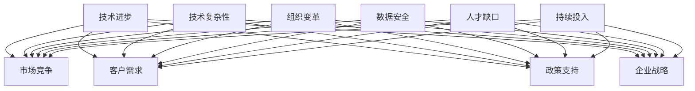
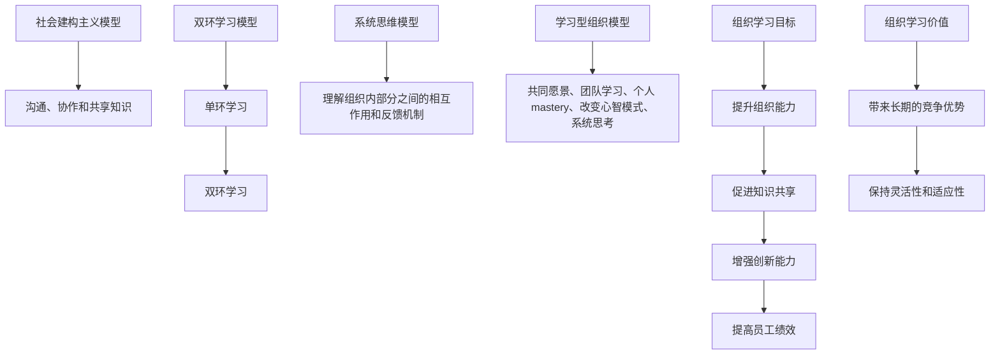
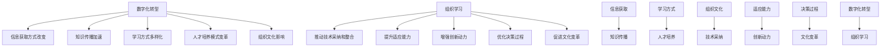
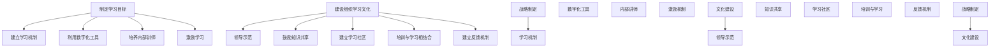

                 

### 1.1 数字化转型的背景

#### 数字化转型的定义与意义

数字化转型是指组织利用数字技术和数据资源，对其业务模式、运营流程和组织文化进行系统性的改变和优化，以实现更高效、更灵活、更具创新性的运作方式。数字化转型不仅仅涉及技术层面的升级，更是一次全面的战略转型，旨在通过数字技术的应用，提升组织的核心竞争力，创造新的价值。

数字化转型的重要性体现在以下几个方面：

1. **提升效率**：通过自动化和智能化，减少人力成本，提高工作效率和响应速度。
2. **增强灵活性**：数字化转型使组织能够快速适应市场变化，灵活调整业务策略。
3. **创造新价值**：数字技术提供了新的商业模式和产品服务，为组织创造了新的价值增长点。
4. **提升客户体验**：数字化工具和服务能够提供更加个性化和高效的客户体验，增强客户黏性。
5. **提高决策质量**：数据驱动的决策能够减少不确定性，提高决策的准确性和效率。

#### 数字化转型的驱动因素

数字化转型主要受到以下几大驱动因素：

1. **技术进步**：互联网、大数据、云计算、人工智能等技术的发展，为数字化转型提供了强大的技术支撑。
2. **市场竞争**：面对激烈的市场竞争，企业需要通过数字化转型来提升竞争力，保持市场地位。
3. **客户需求**：客户对个性化、智能化和高效化的需求不断增长，推动企业进行数字化转型。
4. **政策支持**：政府出台的数字化转型相关政策，为企业提供了方向和资源支持。
5. **企业战略**：企业高层对数字化转型的战略规划和投入，是推动数字化转型的重要力量。

#### 数字化转型的挑战与机遇

数字化转型在带来巨大机遇的同时，也伴随着一系列挑战：

1. **技术复杂性**：数字化技术种类繁多，企业需要投入大量资源进行技术学习和应用。
2. **组织变革**：数字化转型需要改变传统的组织结构和运营模式，这可能引起组织内部的阻力和冲突。
3. **数据安全**：数字化过程中涉及大量数据，数据安全成为企业面临的一大挑战。
4. **人才缺口**：数字化转型需要大量的数字技术和业务人才，但人才供给不足是一个普遍问题。
5. **持续投入**：数字化转型是一个长期的过程，需要持续的资金和资源投入。

然而，只要企业能够有效应对这些挑战，数字化转型就能够带来巨大的机遇，实现业务模式的创新和竞争力的提升。

#### 背景总结

数字化转型已经成为现代企业发展的必然趋势，它不仅涉及技术的升级，更是一次全面的战略变革。企业需要从战略高度出发，全面规划和推进数字化转型，以实现更高效、更灵活、更具创新性的发展。在这个过程中，组织学习、持续创新和知识管理发挥着至关重要的作用，将在下一部分中详细探讨。

#### Mermaid 流程图

以下是数字化转型的驱动因素和挑战的Mermaid流程图：



通过这个流程图，我们可以清晰地看到数字化转型面临的驱动因素和挑战，为接下来的讨论奠定了基础。

### 1.2 组织学习的概念

#### 组织学习的定义与重要性

组织学习是指组织在运营过程中，通过知识、技能和经验的积累、传播和应用，实现个人和团队的能力提升，从而提高组织整体绩效和适应能力的过程。组织学习不仅仅是个体学习的简单叠加，而是通过系统化的方法，将个体的知识和经验转化为组织共同的智慧和财富。

组织学习的重要性体现在以下几个方面：

1. **提高适应能力**：在快速变化的市场环境中，组织学习可以帮助企业快速适应新形势，保持竞争优势。
2. **促进创新**：组织学习鼓励员工分享创意和经验，激发创新思维，推动产品和服务的持续改进。
3. **增强团队协作**：通过组织学习，团队成员能够更好地理解彼此的工作，提高协作效率和团队凝聚力。
4. **提升员工满意度**：组织学习为员工提供成长和发展的机会，增加员工的职业满意度和忠诚度。
5. **提高决策质量**：组织学习通过积累和共享知识，帮助组织在复杂的市场环境中做出更加明智和高效的决策。

#### 组织学习的不同模型与理论

组织学习有不同的模型与理论，其中最著名的包括以下几种：

1. **社会建构主义模型**：社会建构主义认为，知识是在社会互动中建构的，组织学习是通过成员之间的交流和合作实现的。这个模型强调沟通、协作和共享知识的重要性。
   
2. **双环学习模型**：由阿吉里斯（Argyris）和施翁特（Schön）提出，双环学习包括“单环学习”和“双环学习”。单环学习是指纠正错误和优化现有知识的过程，而双环学习则涉及挑战和改变现有的价值观和思维模式。

3. **系统思维模型**：系统思维模型认为，组织是一个复杂的系统，学习不仅是个体层面的，也是组织层面的。这个模型强调理解组织内各个部分之间的相互作用和反馈机制。

4. **学习型组织模型**：彼得·圣吉（Peter Senge）提出的“学习型组织”模型，强调通过共同愿景、团队学习、个人 mastery、改变心智模式和系统思考等五个方面的努力，建立一种能够持续学习和适应变化的组织文化。

#### 组织学习的目标与价值

组织学习的目标包括：

1. **提升组织能力**：通过学习，组织能够提升其整体竞争力，更好地应对外部环境的挑战。
2. **促进知识共享**：组织学习鼓励知识和经验的传播，使整个组织能够从个体的智慧中获益。
3. **增强创新能力**：组织学习为创新提供了丰富的资源，促进新想法和解决方案的产生。
4. **提高员工绩效**：通过不断学习和提升技能，员工能够更好地完成工作任务，提高绩效。

组织学习的价值体现在其能够为组织带来长期的竞争优势，帮助企业在不断变化的市场环境中保持灵活性和适应性。组织学习不仅是一种手段，更是一种组织文化，它渗透到组织的方方面面，成为组织持续发展的动力。

#### Mermaid 流程图

以下是组织学习不同模型与理论的Mermaid流程图：



通过这个流程图，我们可以清晰地看到组织学习不同模型与理论的核心概念及其目标与价值，为后续内容的深入讨论提供了结构框架。

### 1.3 持续创新与知识管理的联系

#### 持续创新的概念与模式

持续创新是指组织通过不断地探索、实验和优化，推动产品和服务的创新，以适应市场变化和客户需求。持续创新不仅仅是新产品的研发，更包括业务模式、运营流程、管理方法等多方面的创新。

持续创新的模式主要包括以下几种：

1. **渐进式创新**：通过持续的改进和优化，逐步提升产品和服务的性能、质量和用户体验。
2. **颠覆式创新**：通过引入全新的技术或商业模式，彻底颠覆现有市场和竞争格局。
3. **组合创新**：将现有的技术和资源进行重新组合，创造出新的价值。
4. **开放式创新**：通过外部合作和开放平台，吸收外部创新资源和知识，实现更广泛的创新合作。

持续创新的核心在于不断挑战现状，寻找新的增长点和竞争优势。

#### 知识管理的角色与功能

知识管理是指组织通过系统化的方法，对知识进行收集、存储、共享、应用和更新，以提高组织整体效率和创新能力的过程。知识管理在持续创新中扮演着关键角色，其功能包括：

1. **知识收集**：通过内部和外部渠道，收集各种形式的知识，包括文献资料、实践经验、最佳实践等。
2. **知识存储**：建立有效的知识库和存储系统，确保知识的可访问性和可维护性。
3. **知识共享**：通过共享平台和协作工具，促进知识的传播和应用，实现知识的最大化利用。
4. **知识应用**：将知识应用于实际工作中，提升员工的决策能力和工作效率。
5. **知识更新**：定期对知识库进行更新和维护，确保知识的准确性和时效性。

#### 持续创新与知识管理的关系

持续创新与知识管理密切相关，两者相互促进，共同推动组织的持续发展。具体体现在以下几个方面：

1. **知识是创新的基础**：持续创新需要大量的知识支持，知识管理通过收集、共享和更新知识，为创新提供了丰富的资源。
2. **创新促进知识积累**：通过持续创新，组织能够积累新的知识和经验，这些知识和经验又通过知识管理得以传播和应用，形成良性循环。
3. **知识共享推动创新**：知识共享使组织内部的创新思想得以传播和交流，激发更多的创新灵感，促进创新的实现。
4. **知识管理优化创新流程**：有效的知识管理可以帮助组织优化创新流程，减少创新过程中的重复劳动和错误，提高创新的效率和成功率。

总之，持续创新与知识管理是相辅相成的，持续创新驱动知识管理的发展，而知识管理为持续创新提供坚实的基础和持续的动力。在数字化转型中，这两者的紧密结合，将助力组织在复杂多变的市场环境中保持竞争优势。

#### Mermaid 流程图

以下是持续创新与知识管理的关系的Mermaid流程图：

```mermaid
graph TD
    A[持续创新] --> B[知识收集] --> C[知识存储]
    A --> D[知识共享] --> E[知识应用]
    A --> F[知识更新]
    G[知识管理] --> B --> C --> D --> E --> F
    H[知识积累] --> I[创新灵感] --> J[创新实现]
    K[创新效率] --> L[创新成功率]
    M[竞争优势] --> N[持续发展]
    O[知识是创新的基础] --> P[创新驱动知识管理]
    Q[知识管理优化创新流程] --> R[减少重复劳动] --> S[提高效率]
    T[促进创新] --> U[实现创新]
    V[竞争优势] --> W[持续发展]
    X[创新与知识管理相互促进] --> Y[Z[良性循环]]
```

通过这个流程图，我们可以清晰地看到持续创新与知识管理之间的相互关系及其对组织发展的积极影响，为下一部分内容的深入探讨奠定了基础。

### 2.1 数字化转型与组织学习的关系

#### 数字化转型对组织学习的影响

数字化转型对组织学习产生了深远的影响，具体体现在以下几个方面：

1. **信息获取方式的改变**：数字化转型使得获取信息变得更加便捷和快速，员工可以通过各种数字工具和平台轻松地获取到最新的行业动态、技术进展和市场信息，这大大增强了组织学习的广度和深度。
   
2. **知识传播的加速**：数字化转型推动了知识的快速传播和共享。通过内部网络、知识库和协作平台，员工可以随时随地获取和分享知识，减少了信息孤岛现象，提高了知识传播的效率和覆盖范围。

3. **学习方式的多样化**：数字化技术为组织学习提供了多样化的学习方式，如在线课程、虚拟培训、在线讨论等。这些方式不仅打破了时间和空间的限制，还提供了互动和反馈的机会，使学习更加灵活和高效。

4. **人才培养模式的变革**：数字化转型改变了人才培养的模式。通过数据分析和人工智能技术，企业可以更精准地识别员工的培训需求，制定个性化的培训计划，提高培训的针对性和有效性。

5. **组织文化的影响**：数字化转型推动组织文化的变革，鼓励创新和开放。数字化工具和平台为员工提供了更多的交流和学习机会，促进了知识共享和团队协作，增强了组织的凝聚力和创新能力。

#### 组织学习在数字化转型中的作用

组织学习在数字化转型中扮演着至关重要的角色，其具体作用包括：

1. **推动技术采纳和整合**：组织学习帮助员工理解和掌握新技术的应用，促进技术的快速采纳和整合。通过培训和学习，员工能够更好地利用新技术提升工作效率，实现业务流程的优化。

2. **提升适应能力**：数字化转型往往伴随着环境的变化和不确定性的增加，组织学习能够提高员工的适应能力，帮助组织在快速变化的市场环境中保持敏捷和灵活性。

3. **增强创新动力**：组织学习激发员工的创新思维，推动新产品、新服务和新商业模式的开发。通过不断学习和知识共享，组织能够不断创新，保持竞争优势。

4. **优化决策过程**：组织学习通过积累和共享知识，提高员工的决策能力，使决策过程更加科学和高效。基于数据驱动的决策能够减少不确定性，提高决策的准确性和及时性。

5. **促进文化变革**：组织学习推动组织文化的变革，鼓励员工接受和适应数字化时代的要求。通过共同学习和实践，员工能够更好地理解和认同组织的数字化转型战略，提高整体执行力。

总之，数字化转型与组织学习相互促进，共同推动组织的持续发展和创新。在数字化转型过程中，组织学习不仅是提高员工技能和知识的重要手段，更是实现组织战略目标的关键因素。

#### Mermaid 流程图

以下是数字化转型与组织学习关系的Mermaid流程图：



通过这个流程图，我们可以清晰地看到数字化转型对组织学习的影响以及组织学习在数字化转型中的重要作用，为后续内容的深入讨论提供了结构框架。

### 2.2 数字化转型中的组织学习策略

#### 组织学习战略的制定

制定有效的组织学习战略是数字化转型成功的关键。以下是一些关键步骤和方法：

1. **明确学习目标**：组织需要明确学习目标，确保学习活动与组织的战略目标和业务需求紧密相关。学习目标应具体、可衡量，并与短期和长期目标相结合。

2. **建立学习机制**：组织应建立系统化的学习机制，包括学习计划、学习评估和反馈机制。学习计划应涵盖培训内容、培训方式和培训资源，确保学习活动的有序进行。

3. **利用数字化工具**：数字化工具如在线学习平台、虚拟课堂、协作工具等，可以提高学习效率和质量。通过这些工具，组织可以提供个性化的学习体验，实现实时反馈和互动。

4. **培养内部讲师**：内部讲师是组织学习的重要资源，他们不仅熟悉组织内部的具体情况和需求，还能通过分享实际工作经验和最佳实践，促进知识的传递和共享。

5. **激励学习**：通过建立激励机制，如学习积分、奖励和晋升机会等，激发员工的学习积极性和主动性。激励机制应公平、透明，并与组织的价值观和目标相一致。

#### 组织学习文化的建设

组织学习文化是组织学习成功的关键因素，以下是一些关键步骤和方法：

1. **领导示范**：领导层应树立学习榜样，通过积极参与学习活动和分享学习经验，展示对组织学习的重视。领导的支持和参与能够营造良好的学习氛围。

2. **鼓励知识共享**：组织应鼓励员工分享知识和经验，通过内部网络、知识库、分享会等形式，促进知识的传递和共享。知识共享不仅能够提升个人和团队的能力，还能增强组织的整体竞争力。

3. **建立学习社区**：通过建立学习社区，如学习小组、兴趣小组等，为员工提供交流和学习的平台。学习社区可以促进员工之间的互动和协作，激发创新思维和团队精神。

4. **培训和学习相结合**：组织应将培训和学习相结合，不仅通过正式的培训课程提升员工的技能和知识，还通过日常工作和项目实践，提供持续的学习机会。

5. **建立反馈机制**：建立有效的反馈机制，收集员工对学习活动的反馈和建议，及时调整和优化学习策略。反馈机制应确保员工的声音被听到，并能够促进持续改进。

通过制定有效的组织学习战略和建设积极的学习文化，组织可以更好地应对数字化转型的挑战，提升整体竞争力和创新能力。

#### Mermaid 流程图

以下是数字化转型中的组织学习策略的Mermaid流程图：



通过这个流程图，我们可以清晰地看到数字化转型中组织学习策略的关键步骤和方法，为实际操作提供了指导。

### 2.3 数字化转型中的知识管理

#### 知识管理的定义与目标

知识管理是指组织通过系统化的方法，对知识进行收集、存储、共享、应用和更新，以提高组织整体效率和创新能力的过程。知识管理的目标主要包括以下几个方面：

1. **提高知识利用率**：通过有效的知识管理，确保知识能够被充分利用，避免知识浪费和重复劳动。
2. **促进知识共享**：鼓励员工分享知识和经验，打破信息孤岛，提升组织整体的知识水平和创新能力。
3. **支持决策**：提供准确、及时的知识支持，帮助组织在复杂的市场环境中做出明智和高效的决策。
4. **提升创新能力**：通过知识管理和创新机制的结合，激发员工的创新思维，推动新产品的研发和商业模式的创新。
5. **增强组织竞争力**：通过积累和传播知识，提升组织的核心竞争力，保持长期的竞争优势。

#### 知识共享与知识创造

知识共享和知识创造是知识管理的核心内容，以下是一些关键方法和实践：

1. **知识共享平台**：建立统一的、易于访问的知识共享平台，如企业内网、知识库、论坛等，为员工提供交流和分享知识的场所。通过平台，员工可以方便地获取所需信息，进行互动和协作。

2. **社区学习**：鼓励员工加入专业社区或兴趣小组，通过共同学习和讨论，促进知识的传播和共享。社区学习不仅可以提升个人的专业水平，还能增强团队的凝聚力和协作能力。

3. **知识创造**：通过组织内部的项目、研讨会和头脑风暴等活动，激发员工的创新思维，推动新知识、新观点和新方案的生成。知识创造不仅需要个人的努力，还需要团队的合作和资源的支持。

4. **知识认证与奖励**：对在知识共享和知识创造中表现突出的员工进行认证和奖励，提高员工参与知识管理的积极性。认证和奖励可以包括荣誉称号、奖金、晋升机会等。

5. **跨部门协作**：通过跨部门的项目和团队，促进不同部门之间的知识共享和协作，打破部门壁垒，提升整体的知识利用效率。

#### 知识存储与检索技术

知识存储和检索技术在知识管理中起着至关重要的作用，以下是一些关键技术和方法：

1. **数据存储**：采用分布式存储技术，如云存储和分布式数据库，确保知识的安全存储和快速访问。分布式存储可以提高系统的可靠性和扩展性，适应大数据环境下的知识存储需求。

2. **数据检索**：利用搜索引擎、自然语言处理（NLP）和机器学习（ML）等技术，提供智能化的知识检索服务。智能检索技术可以帮助员工快速找到所需信息，提高知识利用效率。

3. **知识图谱**：通过构建知识图谱，将不同来源的知识进行整合和关联，形成一个全局的知识网络。知识图谱可以揭示知识之间的关系，帮助员工更全面地理解和应用知识。

4. **数据安全与隐私保护**：在知识存储和检索过程中，确保数据的安全和隐私保护至关重要。采用加密技术、访问控制和安全审计等手段，保护知识的机密性和完整性。

5. **数据备份与恢复**：定期进行数据备份，确保在意外情况发生时，知识可以及时恢复。同时，制定详细的灾难恢复计划，提高组织的应急响应能力。

通过有效的知识管理，组织可以更好地应对数字化转型的挑战，提升整体竞争力和创新能力。知识共享和知识创造不仅是知识管理的核心，也是组织持续发展的动力源泉。

#### Mermaid 流程图

以下是数字化转型中知识管理关键要素的Mermaid流程图：

```mermaid
graph TD
    A[知识管理定义] --> B[知识利用率提高]
    A --> C[知识共享促进]
    A --> D[支持决策]
    A --> E[提升创新能力]
    A --> F[增强组织竞争力]

    G[知识共享与创造] --> H[知识共享平台]
    G --> I[社区学习]
    G --> J[知识认证与奖励]
    G --> K[跨部门协作]

    L[知识存储与检索] --> M[数据存储]
    L --> N[数据检索]
    L --> O[知识图谱]
    L --> P[数据安全与隐私保护]
    L --> Q[数据备份与恢复]

    R[定义] --> S[利用率]
    T[共享]
    U[支持]
    V[创新]
    W[竞争力]

    X[共享与创造] --> Y[Z[平台]]
    Z --> A[B[社区]]
    Z --> C[D[认证]]
    Z --> E[F[跨部门]]

    R --> G
    R --> L

    H[平台] --> I[J[K[L[M[N[O[P[Q[R[知识管理]]
```

通过这个流程图，我们可以清晰地看到知识管理在数字化转型中的关键要素及其相互关系，为实际操作提供了指导。

### 3.1 持续创新的方法与工具

#### 设计思维与创新方法论

设计思维是一种以人为本的创新方法论，强调从用户的角度出发，通过迭代和实验，创造出符合用户需求的新产品和服务。设计思维包括以下五个关键步骤：

1. **观察**：深入了解用户的需求和行为，通过观察、访谈和用户调研，收集第一手资料。
2. **定义问题**：将观察到的用户需求转化为明确的问题陈述，明确创新的目标。
3. **发散思维**：围绕问题，进行无限制的创意思维，提出各种可能的解决方案。
4. **原型制作**：将创意转化为可操作的模型或原型，通过快速原型制作，验证解决方案的可行性和效果。
5. **测试与迭代**：通过用户测试和反馈，不断优化和改进原型，直到满足用户需求。

设计思维的核心在于将用户需求和创新过程紧密结合，通过迭代和实验，逐步找到最佳解决方案。

#### 创新过程管理

创新过程管理是确保创新项目顺利推进和成功实施的关键。以下是一些关键步骤和工具：

1. **创新项目立项**：明确创新项目的目标和范围，制定项目计划和预算，组建创新团队，确保项目有明确的起点和终点。
2. **资源分配**：合理分配项目所需的资源，包括人力、资金、技术和时间等，确保项目有足够的支持。
3. **风险管理**：识别和创新项目可能面临的风险，制定相应的风险管理计划，确保项目能够应对各种不确定性。
4. **进度监控**：定期监控项目进度，通过关键绩效指标（KPI）和里程碑，确保项目按计划进行。
5. **反馈与改进**：定期收集项目进展和用户反馈，及时调整项目方向和策略，确保项目能够持续改进和优化。

创新过程管理不仅需要系统的规划和执行，还需要灵活应对变化和挑战，确保创新项目的成功实施。

#### 创新激励机制

创新激励机制是激发员工创新活力和创造力的关键。以下是一些常见的创新激励机制：

1. **奖励制度**：设立创新奖励制度，对在创新项目中表现突出的个人和团队进行奖励，包括奖金、晋升机会和荣誉称号等。
2. **职位晋升**：将创新成果纳入员工职位晋升的评价指标，鼓励员工积极参与创新项目，提升整体创新能力。
3. **培训和发展**：为创新团队成员提供专门的培训和职业发展机会，提高其专业素养和创新能力。
4. **工作环境**：营造开放、包容和创新的工作环境，鼓励员工自由表达观点和提出创意，激发创新思维。
5. **认可与表彰**：定期举办创新表彰活动，对创新成果进行展示和宣传，提升员工荣誉感和成就感。

有效的创新激励机制不仅能激发员工的创新潜力，还能提升组织的整体创新能力和竞争力。

#### 总结

持续创新是企业保持竞争力的关键，通过设计思维与创新方法论、创新过程管理和创新激励机制，组织可以系统地推动创新活动，实现持续的进步和成长。在数字化转型过程中，持续创新与知识管理的紧密结合，将为组织带来更广阔的发展空间和无限的可能性。

### 3.2 知识管理实践案例

#### 知识管理项目实例

在数字化转型过程中，知识管理项目的成功实施对于组织的持续发展和创新至关重要。以下是一个典型的知识管理项目实例：

**项目背景**：某大型制造企业为了应对市场竞争和客户需求的不断变化，决定实施知识管理项目，以提高整体竞争力和创新能力。

**项目目标**：通过建立知识共享平台和知识管理体系，实现以下目标：
1. 提高知识利用率，减少重复劳动。
2. 促进知识在组织内部的传播和共享。
3. 提升员工的技能和知识水平。
4. 支持决策，提高决策质量和效率。

**项目实施过程**：

1. **需求调研**：首先，项目团队对各部门进行了深入的需求调研，了解员工的知识需求和使用习惯，为后续的知识管理平台设计和功能规划提供依据。

2. **平台设计**：基于调研结果，项目团队设计了一个集知识存储、共享、检索和应用于一体的知识管理平台。平台包括文档管理、知识库、问答社区、学习模块等多个功能模块。

3. **数据收集与整理**：项目团队从各部门收集了大量的文档资料、培训材料、最佳实践等，并对这些数据进行了分类、整理和数字化处理，确保数据的高质量和可用性。

4. **平台建设与上线**：在平台设计完成后，项目团队进行了系统的开发和测试，最终成功上线。平台上线后，进行了全面的员工培训，确保员工能够熟练使用知识管理平台。

5. **持续优化与更新**：平台上线后，项目团队定期收集用户反馈，对平台进行优化和更新，确保平台的持续改进和高效运行。

**项目效果**：

1. **知识利用率提高**：知识管理平台实现了知识的系统化管理和高效共享，员工可以方便地获取所需知识，减少了重复劳动和信息孤岛现象。

2. **员工技能提升**：通过知识管理平台的学习模块，员工可以随时随地进行学习和培训，提高了专业技能和知识水平。

3. **决策支持**：知识管理平台提供了丰富的数据支持和最佳实践案例，为管理层和员工在决策过程中提供了重要的参考依据，提高了决策质量和效率。

4. **创新能力增强**：知识共享和知识创造活动激发了员工的创新思维，推动了新产品和新服务的开发，增强了企业的竞争力。

#### 知识共享平台的建设与运营

知识共享平台是知识管理的重要工具，其建设和运营需要系统化的规划和持续的努力。以下是一些关键步骤和方法：

1. **需求分析**：在建设知识共享平台前，需要对组织的知识需求和使用习惯进行深入分析，确保平台的功能和设计能够满足实际需求。

2. **平台规划**：基于需求分析结果，制定平台的功能模块和架构设计，确保平台具有高效的知识存储、检索和共享功能。

3. **技术选型**：选择合适的开发技术栈和平台，确保平台的稳定性和可扩展性。常用的技术包括云计算、大数据、人工智能和区块链等。

4. **数据整合**：将组织内部的各种数据资源进行整合，包括文档、视频、图像、音频等多种形式的知识，建立统一的知识库。

5. **用户培训**：在平台上线前，对用户进行全面的培训，确保他们能够熟练使用平台的各种功能。

6. **运营管理**：建立完善的平台运营管理制度，包括数据维护、用户管理、内容审核等，确保平台的正常运行和知识的高质量。

7. **持续优化**：根据用户反馈和实际使用情况，定期对平台进行优化和更新，提升用户体验和平台的效率。

#### 知识生命周期管理

知识生命周期管理是指对知识从创建、传播、应用到最终更新的整个过程进行系统化管理。以下是一些关键步骤和方法：

1. **知识创建**：鼓励员工积极创建和分享知识，提供相应的工具和平台，如知识库、博客、论坛等，支持知识的生成和存储。

2. **知识传播**：通过知识共享平台和社区，促进知识在组织内部的传播和共享，提高知识的利用率和影响力。

3. **知识应用**：将知识应用于实际工作中，提升员工的决策能力和工作效率。通过实践验证知识的有效性，不断优化和改进。

4. **知识更新**：定期对知识库进行更新和维护，确保知识的时效性和准确性。采用自动化工具和人工审核相结合的方式，提高更新效率和质量。

5. **知识归档**：对不再使用或过时的知识进行归档，避免占用存储资源。同时，保留重要知识的备份，确保知识的安全性和可恢复性。

通过有效的知识生命周期管理，组织可以确保知识的高效利用和持续更新，提高整体的知识管理水平和创新能力。

#### 总结

知识管理实践案例和知识共享平台的建设与运营，为数字化转型中的组织提供了宝贵的经验和指导。通过系统化的知识管理，组织可以更好地应对变化，提升整体竞争力，实现持续的创新和发展。

### 3.3 持续创新与知识管理的整合

#### 整合的挑战与机遇

持续创新与知识管理的整合是数字化转型中的一项重要任务，它既带来了巨大的机遇，也面临诸多挑战。以下是对这些挑战与机遇的详细分析：

#### 挑战

1. **组织文化的矛盾**：持续创新往往需要打破传统的组织结构和运营模式，这可能与现有的组织文化产生矛盾。例如，过于强调稳定性和流程规范的企业文化可能会抑制创新思维和快速反应。

2. **知识管理的复杂度**：知识管理涉及到数据的收集、存储、共享、应用和更新等多个环节，每一个环节都存在复杂性和技术挑战。如何在大量数据中快速找到有价值的信息，确保知识的高质量和准确性，是知识管理面临的重要问题。

3. **技术选型的难度**：为了支持持续创新和知识管理，组织需要选择合适的技术工具和平台。不同技术之间的兼容性和集成难度较大，这要求组织具备较高的技术水平和专业能力。

4. **人才短缺**：持续创新和知识管理需要具备跨学科知识和技能的复合型人才，但现实中，这类人才较为稀缺。人才短缺会限制创新和知识管理的发展。

#### 机遇

1. **增强组织竞争力**：通过整合持续创新和知识管理，组织可以更快速地响应市场变化，开发出更具竞争力的产品和服务，提升整体市场地位。

2. **提高知识利用率**：知识管理的有效实施可以确保知识的高效利用，减少信息孤岛和重复劳动，提高组织的运行效率和创新能力。

3. **优化决策过程**：整合持续创新和知识管理，可以为决策过程提供更加全面和准确的数据支持，减少决策失误和不确定性，提高决策质量和效率。

4. **推动文化变革**：持续创新和知识管理可以推动组织文化的变革，鼓励开放、分享和创新，建立更加灵活和敏捷的组织结构，提升组织的适应能力和创新能力。

#### 整合策略与实施步骤

为了实现持续创新与知识管理的有效整合，组织可以采取以下策略和步骤：

1. **制定整合战略**：首先，组织需要明确整合的目标和方向，制定详细的整合战略。战略应包括整合的愿景、目标和实施计划，确保各环节之间的协同和一致性。

2. **建立整合架构**：建立整合的技术架构和管理架构，确保各个系统之间的兼容性和数据共享。技术架构应包括数据存储、检索、分析和共享等模块，管理架构应涵盖知识管理流程、组织结构和决策机制。

3. **培养复合型人才**：组织应加大对复合型人才的培养和引进力度，提供跨学科的学习和培训机会，提高员工的专业能力和创新能力。

4. **建立激励机制**：通过设立创新奖励和知识共享奖励，激励员工积极参与创新和知识管理，提高整体创新能力。

5. **加强沟通与协作**：建立有效的沟通和协作机制，促进不同部门和团队之间的信息共享和协作，打破部门壁垒，提升整体协同效应。

6. **持续优化与改进**：通过定期评估和反馈，持续优化整合过程，不断改进和创新，确保整合效果的最大化。

#### 整合效果的评估与优化

为了确保持续创新与知识管理的整合效果，组织可以采取以下方法进行评估和优化：

1. **关键绩效指标（KPI）**：设立关键绩效指标，如创新项目成功率、知识利用率、员工满意度等，定期进行评估和监控。

2. **用户反馈**：收集用户对知识管理平台和创新工具的反馈，了解用户的需求和使用体验，及时调整和改进。

3. **数据分析**：利用数据分析工具，对整合过程中的数据进行分析，识别问题和优化点，提出改进措施。

4. **定期评估**：定期组织整合效果的评估会议，邀请相关利益相关者参与，对整合效果进行综合评估，并根据评估结果制定改进计划。

通过有效的整合策略和持续优化，组织可以实现持续创新与知识管理的深度融合，提升整体竞争力和创新能力，为数字化转型提供强有力的支持。

### 4.1 案例分析概述

#### 案例选择标准

在选择数字化转型中的组织学习、持续创新与知识管理案例时，我们主要考虑以下几个标准：

1. **代表性**：案例应具有广泛的代表性，能够反映数字化转型中组织学习的普遍挑战和解决方案。
2. **成功性**：案例的成功性是其重要评估标准，成功的案例能够提供有效的实践经验和可复制的模型。
3. **创新性**：案例的创新性体现在其采用的新方法、新技术和新策略，以及这些方法在实践中的实际效果。
4. **适用性**：案例的解决方案应具有广泛的适用性，能够为其他组织提供借鉴和参考。
5. **数据支持**：案例应提供充分的数据支持，包括定量和定性的数据，以证明其效果和可行性。

#### 案例分析方法

在分析这些案例时，我们将采用以下方法：

1. **文献分析**：通过对相关文献的梳理和回顾，了解案例的背景、理论基础和实践过程。
2. **访谈与问卷调查**：与案例中的关键利益相关者进行深入访谈和问卷调查，获取第一手的实践经验和反馈。
3. **数据挖掘与分析**：利用数据分析工具，对案例中的数据进行分析，识别关键成功因素和潜在问题。
4. **对比分析**：将案例与其他类似案例进行对比分析，探讨其独特性和适用性。
5. **模型构建**：通过构建分析模型，系统化地总结和归纳案例中的核心要素和关键步骤，为其他组织提供参考。

#### 案例研究的结构

每个案例研究将按照以下结构展开：

1. **案例背景**：介绍案例的组织背景、面临的挑战和数字化转型目标。
2. **组织学习策略**：详细描述组织学习的方法、工具和实践过程，包括学习文化的建设、知识共享机制和人才培养等。
3. **持续创新实践**：分析组织在持续创新方面的具体行动，如设计思维应用、创新过程管理和激励机制等。
4. **知识管理实践**：探讨组织的知识管理策略，包括知识收集、存储、共享和应用等，以及所采用的技术工具和平台。
5. **效果评估**：通过定量和定性的方法，评估数字化转型、组织学习和知识管理的实际效果，包括对组织绩效、员工满意度和市场竞争力的影响。
6. **案例分析总结**：总结案例中的成功经验和教训，提出可借鉴的实践建议和改进方向。

通过这些结构化的案例研究，我们希望能够为数字化转型中的组织提供有价值的参考和指导，推动其在组织学习、持续创新和知识管理方面的深入实践。

### 4.2 案例研究

#### 案例一：公司A的数字化转型与组织学习

**案例背景**

公司A是一家传统制造业企业，面对激烈的市场竞争和不断变化的技术环境，公司决定进行全面的数字化转型。数字化转型的主要目标包括提升生产效率、优化供应链管理、增强客户体验以及推动组织学习，以实现持续创新。

**组织学习策略**

1. **构建学习文化**：公司A高度重视组织学习，将学习文化融入企业核心价值观。公司通过领导层的示范作用和内部宣传，鼓励员工持续学习和分享知识。

2. **建立学习平台**：公司A建立了内部学习平台，提供在线课程、电子书、培训视频等多种学习资源。员工可以通过平台进行自主学习，并根据个人发展需求选择课程。

3. **知识共享机制**：公司A通过定期的内部交流会、分享会和团队讨论，促进知识的传播和共享。同时，公司鼓励员工在内部论坛上分享经验和见解，形成良好的知识共享氛围。

4. **人才培养**：公司A实施了一系列的人才培养计划，包括内部培训、外部培训和职业发展规划。通过这些计划，员工不仅能够提升专业技能，还能适应数字化转型的需求。

**持续创新实践**

1. **设计思维应用**：公司A采用设计思维方法论，从客户需求出发，进行产品和服务创新。通过用户调研、原型制作和迭代测试，公司能够快速响应市场变化，推出符合客户需求的新产品。

2. **创新过程管理**：公司A建立了创新项目管理办公室，负责创新项目的立项、资源分配、进度监控和风险管理。通过这一机制，公司能够确保创新项目的高效推进和成功实施。

3. **激励机制**：公司A设立了创新奖励制度，对在创新项目中表现突出的员工和团队进行奖励。这些奖励包括奖金、晋升机会和荣誉表彰，激发员工的创新热情。

**知识管理实践**

1. **知识收集与存储**：公司A建立了企业内部知识库，收集和存储各部门的专业知识和经验。这些知识包括操作流程、技术文档、最佳实践等，为员工提供便捷的查阅和使用。

2. **知识共享与传播**：公司A通过内部网络和知识共享平台，定期发布知识和经验，促进组织内部的交流和协作。员工可以通过平台分享自己的经验和见解，提高整体的知识水平。

3. **知识更新与维护**：公司A定期对知识库进行更新和维护，确保知识的时效性和准确性。同时，公司引入了知识管理软件，实现知识的自动分类、标签管理和智能检索，提高知识管理的效率。

**效果评估**

1. **员工满意度提升**：通过组织学习和培训，员工的技能水平和工作满意度显著提升。公司通过员工满意度调查，发现员工的积极性和参与度明显增加。

2. **创新成果增加**：数字化转型和持续创新策略的实施，使公司创新成果显著增加。新产品和新服务的推出，赢得了市场的认可，提升了公司的竞争力。

3. **运营效率提升**：通过数字化工具和自动化流程，公司的生产效率和管理效率得到显著提升。供应链管理的优化，降低了成本，提高了客户满意度。

**案例分析总结**

公司A的数字化转型与组织学习实践，为其带来了显著的成效。通过构建学习文化、建立学习平台、实施知识共享机制和人才培养计划，公司成功推动了持续创新和知识管理。其经验表明，数字化转型不仅需要技术支持，更需要组织学习和文化变革的支撑。公司A的做法为其他企业提供了有益的借鉴，尤其是在推动数字化转型和组织学习方面。

#### 案例二：公司B的持续创新与知识管理

**案例背景**

公司B是一家高科技企业，主要从事智能硬件的研发和制造。面对日益激烈的市场竞争，公司B认识到持续创新和知识管理对于企业生存和发展的至关重要性，因此决定将其作为数字化转型的重要组成部分。

**组织学习策略**

1. **构建开放的学习环境**：公司B鼓励员工积极参与外部培训和学术交流，通过邀请行业专家进行讲座和培训，提升员工的专业知识和技能。

2. **内部知识共享平台**：公司B建立了内部知识共享平台，员工可以在这个平台上发布和共享自己的研究项目、技术文档和实验结果。平台支持版本控制和协作编辑，确保知识的准确性和完整性。

3. **跨部门协作**：公司B通过项目管理和协作工具，促进跨部门的知识交流和协作。跨部门的团队可以共享资源和信息，提高项目执行效率和创新能力。

4. **创新激励机制**：公司B设立了创新奖项，对在创新项目中表现突出的员工和团队进行奖励。这些奖励不仅包括物质奖励，还涉及职业晋升和荣誉表彰，激励员工积极参与创新活动。

**持续创新实践**

1. **设计思维方法论**：公司B采用设计思维方法论，从用户需求出发，进行产品设计和创新。通过用户调研、原型设计和用户测试，公司B能够快速验证和优化产品设计，确保产品满足市场需求。

2. **创新过程管理**：公司B建立了创新过程管理体系，包括项目立项、资源分配、进度控制和风险管理等环节。通过这个过程，公司能够确保创新项目的顺利推进和成功实施。

3. **激励机制**：公司B通过创新激励机制，鼓励员工提出创新想法和解决方案。这些激励机制包括创新奖金、专利奖励和晋升机会，激发员工的创新热情。

**知识管理实践**

1. **知识收集与存储**：公司B建立了企业级的知识库，收集和存储员工的专业知识、技术文档和研发成果。知识库支持全文检索和智能推荐，帮助员工快速找到所需信息。

2. **知识共享与传播**：公司B通过内部邮件、会议和在线论坛，定期发布知识更新和经验分享。员工可以通过这些渠道，了解最新的研究成果和行业动态。

3. **知识更新与维护**：公司B定期对知识库进行更新和维护，确保知识库中的信息准确和及时。同时，公司引入了知识管理软件，实现知识的自动化分类和标签管理，提高知识管理的效率。

**效果评估**

1. **员工满意度提升**：通过组织学习和知识管理，员工的技能水平和职业满意度显著提升。公司通过员工满意度调查，发现员工对公司的认同感和归属感增强。

2. **创新成果增加**：公司B在持续创新策略的推动下，创新成果显著增加。新产品和新服务的推出，提高了公司的市场竞争力，带来了可观的商业收益。

3. **运营效率提升**：通过数字化工具和自动化流程，公司的运营效率和管理效率得到显著提升。知识管理的实施，减少了信息孤岛现象，提高了团队协作效率。

**案例分析总结**

公司B通过构建开放的学习环境、内部知识共享平台、跨部门协作和激励机制，成功实现了持续创新和知识管理的有机结合。其经验表明，持续创新和知识管理需要从多个方面入手，包括组织学习策略、创新过程管理、知识管理和激励机制等。公司B的做法为其他高科技企业提供了有益的借鉴，特别是在推动持续创新和知识管理方面，具有很高的参考价值。

### 4.2 案例三：公司C的知识共享与知识创造实践

**案例背景**

公司C是一家全球知名的信息技术服务公司，在数字化转型过程中，公司C高度重视知识共享与知识创造，将其视为提升组织竞争力和创新能力的关键。公司C的业务范围涵盖软件开发、IT咨询和数据分析等多个领域，面对快速变化的市场和技术环境，公司C希望通过有效的知识共享与知识创造实践，实现业务的持续创新和增长。

**组织学习策略**

1. **构建学习型组织**：公司C倡导学习型组织文化，通过领导层的示范作用和持续的员工培训，鼓励员工不断学习和提升个人能力。公司定期举办内部培训和研讨会，邀请外部专家进行专题讲座，提升员工的专业知识和技能。

2. **搭建知识共享平台**：公司C建立了内部知识共享平台，支持文档存储、知识库建设和在线协作。平台提供全文检索、标签分类和智能推荐功能，使员工能够方便地获取所需的知识和信息。

3. **知识管理流程**：公司C制定了系统化的知识管理流程，包括知识的收集、整理、存储、共享和更新等环节。通过规范化的流程，确保知识的及时更新和高质量存储。

4. **鼓励知识分享**：公司C通过奖励机制和荣誉表彰，鼓励员工积极参与知识分享。公司定期评选“知识分享达人”和“最佳知识贡献者”，提高员工分享知识的积极性。

**持续创新实践**

1. **设计思维应用**：公司C采用设计思维方法论，从用户需求出发，进行产品设计和创新。通过用户调研、原型设计和用户测试，公司能够快速验证和优化产品设计，确保产品满足市场需求。

2. **创新激励机制**：公司C设立了创新项目奖励基金，对成功孵化的创新项目进行奖励。同时，公司鼓励员工提出创新建议，通过内部创新竞赛，选拔出有潜力的创新项目。

3. **跨部门协作**：公司C通过跨部门的项目团队，促进不同部门和团队之间的知识交流和协作。跨部门的团队可以共享资源和信息，提高项目执行效率和创新能力。

**知识管理实践**

1. **知识收集与存储**：公司C建立了企业级的知识库，涵盖技术文档、项目经验、客户案例和最佳实践等多种类型的信息。知识库支持全文检索和智能推荐，帮助员工快速找到所需知识。

2. **知识共享与传播**：公司C通过内部邮件、知识共享平台和团队会议，定期发布知识更新和经验分享。公司鼓励员工在平台上发布自己的研究成果和见解，促进知识的传播和应用。

3. **知识更新与维护**：公司C定期对知识库进行更新和维护，确保知识的时效性和准确性。公司引入了知识管理软件，实现知识的自动化分类和标签管理，提高知识管理的效率。

**效果评估**

1. **员工满意度提升**：通过组织学习和知识管理，员工的技能水平和职业满意度显著提升。公司通过员工满意度调查，发现员工的积极性和参与度明显增加。

2. **创新成果增加**：公司C在持续创新策略的推动下，创新成果显著增加。新产品和新服务的推出，提高了公司的市场竞争力，带来了可观的商业收益。

3. **运营效率提升**：通过数字化工具和自动化流程，公司的运营效率和管理效率得到显著提升。知识管理的实施，减少了信息孤岛现象，提高了团队协作效率。

**案例分析总结**

公司C通过构建学习型组织、搭建知识共享平台、实施知识管理流程和鼓励知识分享，成功实现了知识共享与知识创造的有机结合。公司C的经验表明，知识共享与知识创造需要从组织文化、知识管理流程、激励机制和跨部门协作等多个方面入手，才能实现组织的持续创新和增长。公司C的做法为其他企业提供了有益的借鉴，特别是在推动知识共享与知识创造方面，具有很高的参考价值。

### 5.1 数字化转型中的组织学习趋势

#### 技术驱动的组织学习

随着技术的不断进步，技术驱动的组织学习成为数字化转型中的一个重要趋势。以下是一些关键技术及其对组织学习的影响：

1. **人工智能（AI）**：人工智能技术可以在组织学习过程中提供智能推荐系统、自动化培训和知识图谱等功能。通过AI技术，组织可以更好地理解员工的学习需求，提供个性化的学习资源，提高学习效果。

2. **大数据**：大数据技术可以帮助组织分析和挖掘学习数据，识别学习行为模式和学习效果，优化学习策略。通过大数据分析，组织可以更准确地评估学习效果，制定针对性的改进措施。

3. **区块链**：区块链技术可以提高知识共享和知识认证的透明度和安全性。通过区块链，知识可以更加可靠地存储和共享，确保知识的真实性和可追溯性。

4. **虚拟现实（VR）和增强现实（AR）**：VR和AR技术为组织学习提供了沉浸式体验，使学习过程更加生动和有趣。通过VR和AR技术，员工可以参与虚拟的培训和实践，提升学习效果。

#### 跨界合作的组织学习

跨界合作是数字化转型中的另一个重要趋势，通过跨界合作，组织可以共享资源和知识，实现知识的集成和创新。以下是一些跨界合作的模式：

1. **合作伙伴关系**：组织可以通过与合作伙伴建立长期合作关系，共享技术和知识资源，实现共同创新。这种模式有助于提升组织的创新能力，扩大市场影响力。

2. **开放创新平台**：组织可以建立开放创新平台，邀请外部合作伙伴和用户参与创新过程。通过开放创新平台，组织可以获取更多的创意和资源，加速创新成果的转化。

3. **外部专家参与**：组织可以邀请外部专家参与组织的学习和培训，为员工提供专业知识和经验。通过外部专家的参与，组织可以提升员工的技能和知识水平，促进知识的更新和传播。

#### 人机协同的组织学习

人机协同是数字化转型中组织学习的一个重要方向，通过人机协同，组织可以更高效地管理和利用知识。以下是人机协同组织学习的一些关键要素：

1. **智能助理**：智能助理可以帮助员工快速获取所需信息，进行知识检索和问题解答。通过智能助理，员工可以节省大量时间，提高工作效率。

2. **知识自动化**：通过自动化工具，如机器人流程自动化（RPA）和自然语言处理（NLP），组织可以自动完成知识收集、分类和整理等工作，提高知识管理的效率。

3. **协作平台**：协作平台可以帮助员工进行实时沟通和协作，共同解决复杂问题。通过协作平台，员工可以更好地共享知识和经验，实现知识的协同创新。

#### 趋势总结

数字化转型中的组织学习趋势，主要体现在技术驱动、跨界合作和人机协同等方面。这些趋势不仅提高了组织学习的效率和质量，还为组织创造了更多的创新机会。随着技术的不断进步，组织学习将继续向智能化、协同化和多样化方向发展，为数字化转型提供强有力的支持。

### 5.2 持续创新与知识管理的发展方向

#### 新型知识管理模型的探索

随着数字化转型的深入推进，传统的知识管理模型已经无法满足组织在复杂多变环境中的需求。新型知识管理模型正成为持续创新与知识管理的发展方向。以下是一些新兴的知识管理模型：

1. **动态知识管理**：动态知识管理强调知识的实时性、灵活性和适应性。通过引入实时数据分析和人工智能技术，组织可以动态调整知识管理策略，快速响应市场变化和用户需求。

2. **社会化知识管理**：社会化知识管理利用社交媒体和协作工具，促进知识的传播和共享。通过社会化知识管理，员工可以更方便地分享经验和见解，形成强大的知识社区，推动知识创新。

3. **开放性知识管理**：开放性知识管理倡导知识的开放性、共享性和透明性。通过开放平台和开源社区，组织可以吸引外部合作伙伴和用户参与知识创造和共享，实现知识的集成和创新。

4. **情景化知识管理**：情景化知识管理关注知识的实际应用场景，通过将知识嵌入到具体的工作流程中，提高知识的实用性和有效性。情景化知识管理有助于提升员工的实际工作能力和问题解决能力。

#### 持续创新的生态系统建设

持续创新生态系统是指组织通过内部和外部资源的整合，构建一个支持创新活动的生态系统。以下是一些关键步骤：

1. **构建创新网络**：组织可以通过与外部合作伙伴、供应商、客户和学术机构建立紧密联系，构建广泛的创新网络。创新网络可以帮助组织获取更多的创新资源和知识，促进跨领域合作和知识交流。

2. **创新文化培育**：组织需要建立鼓励创新的文化，营造开放、包容和创新的氛围。通过举办创新竞赛、创意研讨会和开放式讨论，组织可以激发员工的创新思维和创造力。

3. **创新激励机制**：组织应设立创新奖励和激励机制，鼓励员工积极参与创新活动。通过奖励制度，如奖金、晋升机会和荣誉表彰，组织可以激发员工的创新热情，提升整体创新能力。

4. **创新流程优化**：组织应优化创新流程，建立高效、灵活的创新管理体系。通过简化流程、降低壁垒，组织可以加快创新项目从构思到市场化的速度。

#### 组织学习与创新的未来

随着技术的不断进步和组织学习的深入发展，组织学习与创新的未来将呈现以下几个趋势：

1. **智能化与个性化**：随着人工智能和大数据技术的发展，组织学习将更加智能化和个性化。智能学习系统能够根据员工的学习习惯和需求，提供个性化的学习资源和培训方案。

2. **跨界与融合**：组织学习与创新将更加跨界和融合。通过跨界合作，组织可以整合不同领域的知识和资源，实现知识创新和业务模式的创新。

3. **实时与动态**：组织学习与创新将更加实时和动态。通过实时数据分析和动态调整，组织可以快速响应市场变化和用户需求，实现知识的实时更新和应用。

4. **生态化与全球化**：组织学习与创新将呈现生态化和全球化的趋势。通过构建创新生态系统和全球化合作，组织可以拓展视野，吸引全球资源，推动创新活动的全球化发展。

总之，持续创新与知识管理的发展方向将更加智能化、跨界化、动态化和生态化，为组织的持续发展和竞争力提升提供强大支撑。随着技术的不断进步和组织的深入探索，组织学习与创新的未来将更加光明。

### 附录A: 相关资源与工具

#### 数字化转型相关资源

1. **书籍**：
   - 《数字化转型：理论与实践》（作者：王兴元）
   - 《数字化转型全景手册》（作者：李明杰）
   - 《数字化转型：企业家的视角》（作者：杰克·韦尔奇）

2. **在线课程**：
   - Coursera: "Digital Transformation: Driving Success in the Digital Age"
   - edX: "Digital Transformation: Strategy, Execution and Impact"
   - Udemy: "Digital Transformation for Business Leaders"

3. **报告与白皮书**：
   - Gartner: "The Future of Digital Transformation"
   - IDC: "IDC FutureScape: Worldwide Digital Transformation 2023 Predictions"

4. **行业论坛与会议**：
   - 麦肯锡全球研讨会：数字化转型与创新论坛
   - 世界经济论坛：全球数字化转型峰会

#### 组织学习与知识管理工具

1. **知识管理平台**：
   - Confluence（Atlassian）
   - SharePoint（Microsoft）
   - Wiki（MediaWiki）

2. **在线学习平台**：
   - Moodle（Moodle）
   - Blackboard（Blackboard）
   - Coursera（Coursera）

3. **协作工具**：
   - Slack（Slack）
   - Microsoft Teams（Microsoft）
   - Google Workspace（Google）

4. **数据分析和可视化工具**：
   - Tableau（Tableau）
   - Power BI（Microsoft）
   - QlikView（Qlik）

5. **人工智能和机器学习工具**：
   - TensorFlow（Google）
   - PyTorch（Facebook）
   - Scikit-learn（Scikit-learn）

通过上述资源和工具，组织可以更好地推进数字化转型、组织学习和知识管理，提升整体竞争力和创新能力。

### 结论

本文通过系统地分析数字化转型中的组织学习、持续创新与知识管理，探讨了这些关键因素在数字化转型中的重要作用和相互关系。我们首先介绍了数字化转型的背景、定义与意义，分析了数字化转型对组织学习的影响以及组织学习在数字化转型中的作用。随后，我们详细阐述了组织学习战略的制定、组织学习文化的建设、数字化转型中的知识管理策略，并介绍了持续创新的方法与工具。通过实际案例研究，我们展示了不同组织在数字化转型中成功实践组织学习和知识管理的经验。

展望未来，随着技术的不断进步，组织学习与创新的趋势将更加智能化、跨界化、动态化和生态化。技术驱动的组织学习、跨界合作的组织学习以及人机协同的组织学习将成为重要方向。新型知识管理模型和持续创新的生态系统建设也将为组织提供更强大的支持。通过不断创新和实践，组织可以在数字化转型中保持竞争优势，实现持续发展。

在数字化转型的大潮中，组织学习、持续创新与知识管理不仅是应对挑战的有力武器，更是推动组织变革和发展的关键动力。我们呼吁读者们积极拥抱数字化转型，深入探索组织学习与知识管理的实践，以创新的思维和科学的方法，为组织的未来发展奠定坚实基础。

### 作者信息

**作者：** AI天才研究院（AI Genius Institute） & 禅与计算机程序设计艺术（Zen And The Art of Computer Programming）  
**简介：** AI天才研究院是一家专注于人工智能和计算机科学研究的国际化机构，致力于推动人工智能技术的发展和应用。禅与计算机程序设计艺术是一本经典的计算机科学著作，由著名计算机科学家唐纳·克努特（Donald Knuth）撰写，深刻阐述了计算机程序设计的哲学和艺术。

