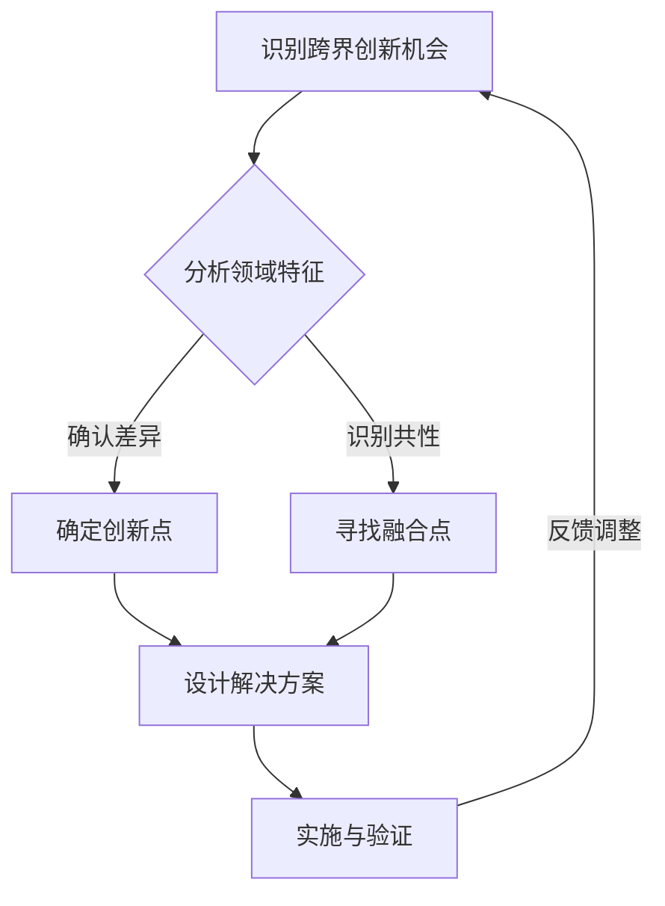

                 

### 引言

《数字原住民的思维模式：跨界创新能力的培养》这本书旨在探讨数字原住民这一新兴群体的思维模式，以及如何培养他们的跨界创新能力。随着数字技术的迅猛发展，数字原住民，即那些从出生就在数字化环境中成长的一代人，逐渐成为社会的重要力量。他们具备独特的思维方式和技能，能够快速适应并利用新技术，推动社会进步。

首先，我们需要明确什么是数字原住民。数字原住民是指在数字化环境中成长，从小接触互联网、移动设备和社交媒体的一代人。他们对于数字技术和网络有着天生的敏感性，能够迅速掌握新工具，并将其应用于日常生活和工作中。与他们的前辈——数字移民（即那些在数字化环境下成长的人）相比，数字原住民具有更强的数字素养和技术能力。

数字原住民的崛起对社会产生了深远的影响。他们不仅改变了信息传播的方式，还影响了人们的社交行为和工作方式。然而，随着数字原住民在各个领域的影响力日益增强，如何培养他们的跨界创新能力成为了一个关键问题。跨界创新，即在不同领域之间进行创新性思维和创造性实践，已经成为推动社会进步的重要动力。

这本书的主要目标是帮助读者了解数字原住民的思维模式，并探讨如何培养他们的跨界创新能力。通过深入研究数字原住民的特征、成长环境以及跨界创新的过程，我们可以发现一些培养跨界创新能力的方法和策略。同时，本书还将结合实际案例，提供具体的培养路径和实践指导。

本书结构如下：

1. **数字原住民的崛起**：介绍数字原住民的背景、特征以及他们对社会的影响。
2. **跨界创新的思维模式**：探讨跨界创新的定义、思维模式及其价值与意义。
3. **跨界创新能力的培养**：分析教育体系中的跨界创新培养方法、跨界创新的方法与工具以及案例分析。
4. **数字原住民的思维模式解析**：深入解析数字原住民的思维模式特征、跨界思考方式以及应用。
5. **案例分析：数字原住民的跨界创新实践**：介绍成功的跨界创新案例，分析跨界创新思维的应用。
6. **培养跨界创新能力的策略**：探讨个人、组织和整个社会层面如何培养跨界创新能力。
7. **未来展望：数字原住民与跨界创新的未来**：预测数字原住民在跨界创新中的角色，以及跨界创新对未来社会的影响。

通过这本书，我们希望读者能够深入理解数字原住民的思维模式，掌握跨界创新的能力，并为其在未来的职业生涯和社会发展中做好准备。让我们一同探索数字原住民的思维世界，挖掘跨界创新的无限潜力。### 数字原住民的崛起

数字原住民，这一群体在当代社会中扮演着越来越重要的角色。他们是在数字时代中成长起来的一代人，从小就与互联网、移动设备、社交媒体等数字技术紧密相连。与传统意义上的数字移民（即那些在数字化环境下逐渐适应并掌握技术的人）相比，数字原住民具有独特的成长经历、思维方式和技能。

首先，我们需要定义数字原住民的特征。数字原住民通常具有以下几个方面的特点：

1. **数字素养高**：他们从小就接触互联网，能够熟练使用各种数字工具和平台。无论是社交媒体、在线游戏，还是在线学习和远程工作，数字原住民都能够游刃有余地应对。
2. **快速学习能力**：数字原住民能够迅速掌握新工具和新技术。他们善于从网络资源中学习，具备强大的信息处理和自我学习能力。
3. **社交能力强**：数字原住民在数字化环境中建立了广泛的社交网络。他们擅长通过社交媒体和在线平台进行沟通、合作和分享。
4. **创新意识强**：数字原住民对于创新有着浓厚的兴趣和强烈的动力。他们倾向于尝试新事物，勇于打破常规，推动社会进步。

数字原住民的崛起对社会产生了深远的影响。首先，他们在信息传播领域扮演了重要角色。通过社交媒体和在线平台，数字原住民能够迅速传播信息，影响舆论，甚至改变社会事件的发展方向。其次，数字原住民改变了人们的社交行为。他们习惯于在线沟通，通过网络建立和维护人际关系。这种社交方式不仅突破了地理限制，还带来了新的社交模式和交流方式。

在工作领域，数字原住民的崛起同样具有重要意义。他们具备强大的数字素养和快速学习能力，能够在数字化工作中迅速适应并发挥价值。同时，数字原住民的创新能力也为各行各业带来了新的发展机遇。他们善于将不同领域的知识和技术进行融合，创造出具有创新性的解决方案。

然而，数字原住民的崛起也带来了挑战。首先，数字鸿沟问题日益突出。尽管数字原住民在数字技术方面具有优势，但仍有大量人群未能充分享受数字技术带来的便利。这种数字鸿沟不仅体现在不同国家和地区之间，也存在于不同社会群体之间。其次，数字原住民在数字化环境中的长期生活可能导致心理健康问题，如网络成瘾、孤独感等。

为了应对这些挑战，我们需要关注数字原住民的健康成长，提高他们的数字素养和心理素质。同时，我们也需要关注数字鸿沟问题，努力缩小不同群体之间的数字差距。此外，教育体系也需要进行改革，培养数字原住民的跨界创新能力，使他们能够更好地适应未来的社会发展。

总之，数字原住民的崛起不仅改变了信息传播和社会交往的方式，也带来了新的机遇和挑战。了解数字原住民的特征和成长环境，探讨如何培养他们的跨界创新能力，是我们面临的重要课题。通过深入研究数字原住民的思维模式，我们可以发现更多培养跨界创新能力的策略和方法，为数字原住民的全面发展和社会进步提供有力支持。### 数字原住民的社会背景与成长环境

数字原住民的社会背景与成长环境在很大程度上塑造了他们的思维方式和行为模式。理解这一背景和成长环境，对于培养他们的跨界创新能力至关重要。

首先，数字原住民的成长环境与他们的家庭和学校密切相关。在家庭中，许多数字原住民的父母本身就是数字技术的早期用户，他们从小便接触到互联网、移动设备和计算机。这使得家庭环境成为数字原住民接触数字技术的第一课堂。父母往往会鼓励他们尝试新的数字工具，帮助他们了解和掌握各种数字技能。

在学校中，数字原住民通常享受到比前辈更好的数字化教育资源。越来越多的学校引入了信息技术课程，鼓励学生使用计算机、编程和在线学习平台。这些课程不仅提高了学生的数字素养，还培养了他们的创新能力。数字原住民在数字化环境中成长，能够更好地适应在线学习和协作，这使得他们在学术上表现出色。

其次，数字原住民的社会背景也影响了他们的社交行为和人际关系。在社交媒体和在线平台的发展下，数字原住民建立了广泛的社交网络。他们习惯于通过社交媒体与朋友、家人和同事保持联系，分享生活和工作中的点滴。这种社交方式不仅增强了他们的社交能力，还使他们能够快速获取各种信息和资源。

此外，数字原住民的社会背景还包括他们所处的经济环境。随着互联网和电子商务的发展，许多数字原住民能够通过在线平台创业，实现自己的职业梦想。他们善于利用数字技术进行市场调研、产品推广和客户服务，这使得他们能够在竞争激烈的商业环境中脱颖而出。

然而，数字原住民的成长环境也带来了一些挑战。首先，数字化环境中存在的隐私问题和网络安全问题日益突出。数字原住民在互联网上的活动容易暴露个人隐私，面临网络诈骗和黑客攻击的风险。其次，数字原住民在数字化环境中过度依赖网络和数字工具，可能导致心理健康问题，如网络成瘾、焦虑和抑郁。

为了应对这些挑战，我们需要关注数字原住民的健康发展。家庭和学校应共同努力，教育他们如何安全、负责任地使用数字技术。同时，社会也需提供更多的心理健康教育和支持，帮助他们应对数字化环境中的心理压力。

总之，数字原住民的社会背景与成长环境在很大程度上影响了他们的思维方式和行为模式。理解这一背景和成长环境，有助于我们更好地培养他们的跨界创新能力。通过提供适当的数字化教育资源、营造健康的社交环境以及关注心理健康，我们可以帮助数字原住民充分发挥他们的潜力，为社会进步做出贡献。### 数字原住民的优势与挑战

数字原住民的优势显而易见，但也面临着一系列挑战。首先，我们来探讨他们的优势。

**1. 数字素养高**：数字原住民从小接触互联网和数字设备，对各种数字工具和网络平台有着深刻的理解和熟练的操作能力。这使得他们在数字化环境中游刃有余，能够高效地处理信息和完成任务。

**2. 快速学习能力**：数字原住民善于利用网络资源进行学习。他们不仅能够快速掌握新工具和新技术，还能够从互联网上获取丰富的知识和经验，这大大提高了他们的学习能力。

**3. 社交能力强**：数字原住民在社交媒体和在线平台上建立了广泛的社交网络。他们擅长通过数字工具与他人沟通、协作和分享，这使得他们能够迅速获取各种信息和资源。

**4. 创新意识强**：数字原住民对创新有着浓厚的兴趣和强烈的动力。他们倾向于尝试新事物，勇于打破常规，推动社会进步。

然而，数字原住民的优势也伴随着一系列挑战。

**1. 数字鸿沟**：尽管数字原住民在数字技术方面具有优势，但仍有大量人群未能充分享受数字技术带来的便利。这种数字鸿沟不仅体现在不同国家和地区之间，也存在于不同社会群体之间。这可能导致社会不平等和资源分配不均。

**2. 隐私和安全问题**：数字原住民在互联网上的活动容易暴露个人隐私，面临网络诈骗和黑客攻击的风险。这些问题不仅威胁到他们的个人信息安全，也可能对他们的社交和职业发展产生负面影响。

**3. 心理健康问题**：数字原住民在数字化环境中过度依赖网络和数字工具，可能导致心理健康问题，如网络成瘾、焦虑和抑郁。这些问题可能影响他们的日常生活和社交能力。

**4. 职业发展挑战**：尽管数字原住民具备强大的数字素养和创新能力，但他们在职业发展中仍可能面临一些挑战。例如，一些传统行业可能对他们的数字技能和创新能力缺乏认可，导致职业发展受限。

为了应对这些挑战，我们需要采取一系列措施。首先，我们需要关注数字鸿沟问题，努力缩小不同群体之间的数字差距。这可以通过提供更多的数字化教育资源和培训机会来实现。其次，我们需要提高数字原住民的网络安全意识和隐私保护意识，教育他们如何安全、负责任地使用数字技术。此外，社会也需提供更多的心理健康教育和支持，帮助他们应对数字化环境中的心理压力。

总之，数字原住民的优势和挑战并存。了解这些挑战，有助于我们更好地培养他们的跨界创新能力，为他们的发展提供有力支持。通过关注数字鸿沟、心理健康和网络安全等问题，我们可以帮助数字原住民充分发挥他们的潜力，为社会进步做出贡献。### 跨界创新的定义

跨界创新，顾名思义，是指在不同领域之间进行创新性思维和创造性实践。它旨在通过跨领域知识和技术融合，创造出新的产品、服务或解决方案。跨界创新不仅突破了传统领域的界限，还推动了不同领域之间的协同合作，为社会发展带来了新的动力。

首先，让我们明确跨界创新的定义。跨界创新可以理解为一种跨学科、跨行业、跨文化的创新方式。它不仅仅局限于某个特定领域，而是将不同领域的知识、技术和资源进行整合，以解决复杂问题或满足多样化需求。跨界创新的本质在于打破传统的思维定式，跨越领域壁垒，寻找新的创新突破口。

跨界创新具有以下几个核心特征：

1. **跨学科性**：跨界创新强调跨学科知识的融合。不同学科之间的交叉和融合，可以产生新的观点和解决方案，推动创新。
2. **跨行业性**：跨界创新不仅限于某个行业，而是涉及到多个行业。这种跨行业的协作和整合，可以带来新的商业模式和市场机会。
3. **跨文化性**：跨界创新跨越了不同文化之间的界限，吸收各种文化的精华，创造出具有全球影响力的创新成果。
4. **系统性**：跨界创新是一个系统性工程，涉及多个环节和要素。它需要整合资源、协同合作，形成完整的创新生态系统。

跨界创新的意义不容忽视。首先，它推动了技术的进步和应用。通过跨领域的技术融合，可以创造出新的技术解决方案，推动现有技术的升级和迭代。其次，跨界创新促进了产业的转型升级。它推动了传统产业的升级改造，培育了新的经济增长点，为经济持续发展注入新的动力。最后，跨界创新提高了社会的创新能力和竞争力。通过跨领域的人才合作和知识共享，可以培养出更多具备跨界创新能力的优秀人才，提升整个社会的创新能力。

总之，跨界创新是一种跨学科、跨行业、跨文化的创新方式，它通过打破领域壁垒，实现知识和技术融合，为社会进步带来了新的动力。理解跨界创新的定义和意义，有助于我们更好地把握其发展趋势，培养跨界创新能力，推动社会创新和发展。### 跨界创新的思维模式分析

要深入了解跨界创新的思维模式，我们需要从几个关键方面进行分析。跨界创新不仅仅是一种技术或方法的革新，更是一种思维方式的变革。这种思维方式具有独特性，能够激发创新潜力，推动跨界合作。

**1. 系统思维**：系统思维是跨界创新的核心。它要求我们站在全局的角度，看待问题，分析各种因素之间的相互关系。系统思维强调整体性、动态性和反馈机制，有助于我们发现问题的本质，找到创新的突破口。在跨界创新中，系统思维可以帮助我们整合不同领域的知识，找到跨领域的协同点。

**2. 逆向思维**：逆向思维是一种反向思考问题的方法。它鼓励我们从不同的角度、不同的逻辑出发，重新审视问题，寻找创新的可能性。逆向思维可以帮助我们突破传统思维定式，发现新的解决方案。在跨界创新中，逆向思维可以激发我们打破常规，挑战现状，找到跨界融合的新途径。

**3. 体验式思维**：体验式思维强调通过实践和体验来理解问题，从而发现创新的灵感。它鼓励我们亲身体验不同领域的实践，从体验中汲取灵感，形成创新想法。在跨界创新中，体验式思维可以帮助我们更好地理解不同领域的需求和痛点，从而找到创新的切入点。

**4. 模仿与创新思维**：模仿与创新思维是跨界创新的重要工具。它鼓励我们在不同领域之间进行模仿和借鉴，将一种领域的方法或理念应用到另一个领域。同时，我们还需要在模仿的基础上进行创新，使其适应新的环境和需求。模仿与创新思维可以帮助我们快速吸收跨领域的经验和知识，形成具有自身特色的新创意。

**5. 混合思维**：混合思维是将不同领域、不同文化的元素进行混合，创造出新的思维模式。它强调多元视角和跨文化的交流，有助于我们开阔思维，激发创新。在跨界创新中，混合思维可以帮助我们打破文化壁垒，融合各种资源和智慧，形成创新性的解决方案。

跨界创新的思维模式具有以下几个价值：

1. **激发创新潜力**：跨界创新的思维模式能够打破传统思维定式，激发我们的创新潜力。通过系统思维、逆向思维、体验式思维等，我们可以从不同的角度看待问题，找到创新的突破口。

2. **促进跨界合作**：跨界创新的思维模式有助于促进不同领域之间的合作。通过系统思维，我们可以找到跨领域的协同点；通过逆向思维和体验式思维，我们可以更好地理解不同领域的需求和痛点；通过模仿与创新思维和混合思维，我们可以融合各种资源和智慧，形成创新性的解决方案。

3. **提升创新能力**：跨界创新的思维模式可以提升我们的创新能力。通过不断模仿和创新，我们可以积累跨领域的经验和知识，形成独特的创新思维模式。

4. **推动社会进步**：跨界创新的思维模式可以推动社会的进步和发展。通过跨领域的技术融合和创新，我们可以解决复杂的社会问题，提高社会生产力，推动产业升级和转型。

总之，跨界创新的思维模式是一种跨学科、跨行业、跨文化的创新思维方式。它通过系统思维、逆向思维、体验式思维、模仿与创新思维和混合思维，激发我们的创新潜力，促进跨界合作，提升创新能力，推动社会进步。理解并运用跨界创新的思维模式，是我们培养跨界创新能力的重要途径。### 跨界创新的价值与意义

跨界创新在当今社会具有重要的价值和意义，它不仅推动了技术的发展，还促进了产业的升级和转型，最终为社会的整体进步做出了巨大贡献。以下是跨界创新在多个方面所产生的具体影响：

**1. 技术发展**：跨界创新通过跨领域知识的融合，催生了大量新技术。例如，人工智能与医疗的结合，产生了智能诊断和个性化治疗方案；物联网与制造业的结合，推动了工业4.0的发展。这些技术的进步，不仅提高了生产效率，还改善了人们的生活质量。

**2. 产业升级**：跨界创新促进了传统产业的升级和转型。例如，农业与信息技术的结合，产生了智能农业，提高了农业生产效率；制造业与服务业的结合，推动了服务业的创新和升级。这些产业的转型升级，不仅创造了新的就业机会，还提高了产业的整体竞争力。

**3. 经济增长**：跨界创新推动了新产业和新市场的形成，为经济增长提供了新的动力。例如，共享经济模式通过跨界创新，将闲置资源转化为商业机会，创造了新的市场空间。这些新兴产业的发展，不仅带动了相关产业链的增长，还促进了整体经济的繁荣。

**4. 社会进步**：跨界创新带来了许多社会问题的解决方案。例如，环保与科技的结合，产生了许多清洁能源技术，推动了可持续发展；教育与技术结合，促进了在线教育和远程教育的普及，提高了教育资源的分配效率。这些创新成果，不仅改善了人们的生活条件，还促进了社会的公平与和谐。

**5. 知识共享**：跨界创新促进了知识的传播和共享。在跨界创新过程中，不同领域的专家和学者需要相互合作，分享各自的专业知识和研究成果。这种知识共享，不仅提高了创新效率，还推动了科学技术的整体进步。

**6. 创新能力的提升**：跨界创新培养了个人的创新能力和跨领域的综合能力。通过跨学科的探索和跨行业的合作，人们可以更全面地了解问题，找到创新的解决方案。这种能力，不仅对个人的职业发展具有重要意义，也为社会培养了更多的创新型人才。

总之，跨界创新在技术发展、产业升级、经济增长、社会进步、知识共享和创新能力提升等方面具有重要价值和深远意义。它不仅推动了社会的进步，还为未来的发展提供了新的机遇和可能。理解和运用跨界创新，是我们应对未来挑战、实现可持续发展的重要途径。### 跨界创新能力的培养

跨界创新能力的培养是一个系统性的工程，需要从教育体系、方法论、工具和实际案例等多个层面进行综合探讨。以下将详细阐述这些方面的培养方法。

**一、教育体系中的跨界创新培养**

1. **跨学科教育**：传统的学科教育模式难以满足跨界创新的需求。跨学科教育通过整合不同学科的知识，培养学生的综合思维能力。例如，将工程学、计算机科学、艺术设计等学科结合起来，培养学生的跨学科创新能力。

2. **实践导向教育**：实践导向教育强调通过实际项目和实践活动来培养创新能力。学校可以设置创新实验室、创业孵化器等，为学生提供实践机会。通过项目制学习，学生可以在实践中运用跨学科知识，解决实际问题。

3. **国际合作与交流**：通过国际合作与交流，学生可以接触到不同文化背景的知识和经验，开阔视野，增强跨文化合作能力。这有助于培养具有全球视野和跨国界思维的跨界创新人才。

**二、跨界创新的方法与工具**

1. **设计思维**：设计思维是一种以用户为中心的创新方法。它通过深入理解用户需求，提出问题，寻找解决方案，并不断迭代优化。设计思维强调用户参与、团队合作和迭代思维，是培养跨界创新能力的重要工具。

2. **跨领域协作**：跨领域协作是通过不同领域的专家和团队合作，共同解决复杂问题。这种协作模式有助于整合跨领域的知识和技能，推动跨界创新。

3. **系统思维**：系统思维是一种从整体角度分析问题的方法。它强调理解系统中各个组成部分之间的相互关系，寻找系统优化的解决方案。系统思维有助于培养跨领域的系统观和综合能力。

**三、跨界创新的工具**

1. **数字化工具**：数字化工具如人工智能、大数据分析、云计算等，为跨界创新提供了强大的技术支持。这些工具可以帮助我们更快速、更准确地处理和分析复杂的数据，发现新的创新机会。

2. **思维导图**：思维导图是一种图形化的思维方式，可以帮助我们整理思路、梳理知识，发现不同领域之间的联系。通过思维导图，我们可以更直观地看到跨界创新的潜在机会和路径。

**四、实际案例与经验分享**

1. **案例学习**：通过学习成功的跨界创新案例，可以了解跨界创新的实践方法、思维模式和应用场景。案例学习可以帮助我们更好地理解跨界创新的原理和实践。

2. **经验分享**：跨界创新的成功离不开经验的积累。通过举办研讨会、工作坊等形式，分享跨界创新的实践经验和教训，可以加速跨界创新能力的培养。

总之，跨界创新能力的培养需要从教育体系、方法论、工具和实际案例等多个层面进行综合探讨。通过跨学科教育、实践导向教育、国际合作与交流，以及设计思维、跨领域协作、系统思维等方法的运用，我们可以培养出具备跨界创新能力的人才。同时，数字化工具和思维导图等工具的应用，也为跨界创新提供了技术支持。通过实际案例和经验分享，我们可以不断积累跨界创新的实践经验和知识，提升跨界创新能力。### 数字原住民的思维模式特征

数字原住民的思维模式具有独特的特征，这些特征不仅源于他们在数字化环境中的成长经历，也反映了他们对数字技术的深刻理解和运用。以下是数字原住民思维模式的几个关键特征：

**1. 互联网思维**：数字原住民从小就生活在互联网环境中，对互联网有着天然的理解和敏感度。他们习惯于通过网络获取信息、解决问题、进行交流和合作。这种互联网思维使得数字原住民能够迅速适应数字化工作环境，高效地处理信息，并利用网络资源进行创新。

**2. 平台思维**：数字原住民善于利用各种在线平台进行创作、分享和协作。无论是社交媒体、电子商务平台，还是在线协作工具，数字原住民都能够充分利用这些平台，实现自己的创意和目标。平台思维使数字原住民能够快速搭建和扩展项目，形成强大的网络效应。

**3. 用户思维**：数字原住民在数字化环境中成长，深刻理解用户需求和行为。他们擅长从用户的角度思考问题，设计出更加人性化、实用的产品和服务。用户思维使数字原住民能够更好地满足用户需求，提高用户满意度，从而实现商业成功。

**4. 快速迭代思维**：数字原住民习惯于快速迭代和不断优化。他们善于利用数字化工具和平台，快速进行原型设计、测试和反馈，不断优化产品和服务。快速迭代思维使数字原住民能够迅速适应市场变化，抓住商业机会。

**5. 跨领域思维**：数字原住民在数字化环境中培养了跨领域的知识体系，他们能够轻松地跨越不同领域的界限，将不同领域的知识和技术进行融合。跨领域思维使数字原住民能够发现跨领域的创新机会，创造出具有颠覆性的产品和服务。

**6. 开放合作思维**：数字原住民善于在开放的环境中进行合作和分享。他们乐于与不同领域、不同背景的人合作，共同解决问题和实现目标。开放合作思维使数字原住民能够充分利用外部资源，提高创新效率。

这些特征共同构成了数字原住民的思维模式，使他们在数字化时代中具备独特的优势和潜力。通过深入理解和运用这些思维模式，数字原住民能够更好地适应数字化环境，发挥自身潜力，推动社会进步。### 数字原住民如何进行跨界思考

数字原住民在跨界思考方面具有独特的优势，这使得他们在面对复杂问题时能够迅速找到创新的解决方案。以下将详细探讨数字原住民如何进行跨界思考，以及这一过程如何有助于跨界创新。

**一、数字化环境的适应性**

数字原住民从小在数字化环境中成长，对互联网、移动设备和各种在线平台有着深刻的理解和熟练的操作能力。这使得他们能够在多种数字化环境中自如地切换，迅速适应不同的工作场景和需求。例如，在处理复杂问题时，数字原住民能够充分利用在线协作工具、云计算平台和数据可视化工具，快速获取和处理相关信息，从而为问题分析提供有力支持。

**二、跨领域的知识积累**

数字原住民在数字化环境中积累了丰富的跨领域知识。他们在学习过程中不仅关注本专业的知识，还广泛涉猎其他领域的知识。这种跨领域的知识积累使他们能够从不同角度看待问题，发现不同领域之间的联系，从而提出创新的解决方案。例如，一名计算机科学专业的数字原住民在处理一个医疗问题时，可能会联想到医学领域的知识，从而找到一种全新的解决方案。

**三、快速学习和创新能力**

数字原住民具备快速学习和创新能力，这使得他们在面对新问题时能够迅速掌握相关知识和技能。通过利用在线学习资源、参加各种培训和研讨会，数字原住民能够不断更新自己的知识体系，提升跨界思考的能力。例如，在处理一个涉及多个领域的问题时，数字原住民可能会快速学习相关的技术、理论和方法，从而找到解决问题的突破口。

**四、开放合作与资源共享**

数字原住民在数字化环境中培养了开放合作和资源共享的精神。他们乐于与不同领域、不同背景的人合作，共同解决问题和实现目标。通过在在线平台上分享自己的知识和经验，数字原住民能够充分利用外部资源，提高跨界思考的效率。例如，在开发一个跨领域项目时，数字原住民可能会邀请医学专家、商业分析师等参与，共同探讨问题的解决方案。

**五、案例：跨界思考在实践中的应用**

以下是一个具体的案例，展示了数字原住民如何进行跨界思考：

**案例**：一名数字原住民在一家科技公司工作，负责开发一款智能家居产品。在产品设计过程中，他遇到了一个难题：如何确保产品在多个设备上运行稳定，并满足用户个性化需求？

**跨界思考过程**：

1. **了解用户需求**：数字原住民首先进行了用户调研，了解用户对智能家居产品的期望和需求。他发现，用户希望产品能够跨平台、跨设备运行，并具备智能化、个性化等功能。

2. **跨领域知识整合**：数字原住民将计算机科学、电子工程、艺术设计等领域的知识进行整合，分析了不同设备的操作系统、硬件配置和软件架构。他发现，通过云计算和物联网技术，可以实现设备的跨平台运行和智能化管理。

3. **快速迭代和优化**：数字原住民利用敏捷开发方法，快速构建原型并进行测试。他邀请用户体验产品，收集反馈意见，不断优化产品功能。通过快速迭代，他最终开发出一款具备跨平台、智能化、个性化等特点的智能家居产品。

**六、跨界思考的价值与启示**

跨界思考对数字原住民和跨界创新具有重要意义：

1. **发现创新机会**：跨界思考使数字原住民能够从不同角度看待问题，发现潜在的创新机会。通过跨领域知识的整合，他们可以提出创新的解决方案。

2. **提升创新能力**：跨界思考培养了数字原住民的跨领域综合能力，使他们能够在复杂问题中找到创新的解决方案。

3. **促进合作与交流**：跨界思考鼓励数字原住民与不同领域的人合作，共同解决问题。这有助于促进知识共享和合作创新。

总之，数字原住民在跨界思考方面具有独特的优势，这使得他们在面对复杂问题时能够迅速找到创新的解决方案。通过数字化环境的适应性、跨领域的知识积累、快速学习和创新能力、开放合作与资源共享，数字原住民能够更好地进行跨界思考，推动跨界创新的发展。### 数字原住民的思维模式应用

数字原住民的思维模式在各个领域都得到了广泛应用，并取得了显著的成果。以下将详细探讨数字原住民在计算机编程、人工智能和商业创新等领域的思维模式应用，并通过实际案例进行分析和解读。

**一、计算机编程**

在计算机编程领域，数字原住民展现了其独特的编程思维和创新能力。他们擅长利用互联网资源和在线编程平台，快速学习和掌握各种编程语言和开发工具。以下是一个具体案例：

**案例**：一名数字原住民开发了一款基于区块链技术的去中心化应用（DApp）。他首先利用在线资源学习了区块链的相关知识，然后结合编程技能，开发出了具有高安全性和透明度的DApp。这款DApp在金融领域取得了巨大成功，为数字原住民带来了丰厚的回报。

**思维模式应用分析**：

1. **快速学习与适应能力**：数字原住民能够迅速掌握新的编程语言和开发工具，这使得他们在开发过程中具备较强的适应能力。

2. **创新性思维**：数字原住民在编程过程中善于运用创新性思维，通过结合不同领域的知识和技术，开发出具有独特价值的软件。

3. **协作与共享**：数字原住民擅长利用在线协作平台，与全球的编程高手共同探讨问题、分享经验，从而提高编程效率。

**二、人工智能**

在人工智能领域，数字原住民通过跨界思考和创新，推动了人工智能技术的快速发展。以下是一个具体案例：

**案例**：一名数字原住民开发了一种基于深度学习的人脸识别系统，该系统在图像识别和身份验证方面具有极高的准确性。他将计算机视觉、深度学习和大数据分析等领域的知识进行融合，开发出了这款具有广泛应用前景的人工智能产品。

**思维模式应用分析**：

1. **跨领域知识整合**：数字原住民能够轻松地将计算机视觉、深度学习和大数据分析等领域的知识进行整合，为人工智能技术的发展提供了强有力的支持。

2. **创新性思维**：数字原住民在人工智能领域展现出强烈的创新意识，他们善于将前沿技术应用于实际场景，解决实际问题。

3. **快速迭代与优化**：数字原住民利用敏捷开发方法，快速迭代和优化人工智能产品，提高其性能和可靠性。

**三、商业创新**

在商业创新领域，数字原住民通过跨界思考和创新能力，成功打造了许多具有颠覆性的商业模式。以下是一个具体案例：

**案例**：一名数字原住民创办了一家基于共享经济的在线租房平台，该平台通过互联网技术和大数据分析，为用户提供了便捷、安全的租房体验。他将互联网、大数据和共享经济等领域的知识进行融合，创造了一个全新的商业模式。

**思维模式应用分析**：

1. **用户思维**：数字原住民在商业创新过程中，始终将用户需求放在首位，通过深入了解用户需求，设计出符合用户期望的产品和服务。

2. **跨界融合**：数字原住民擅长将不同领域的知识进行融合，创造出具有创新性的商业模式。

3. **快速迭代与优化**：数字原住民通过不断迭代和优化产品和服务，满足用户不断变化的需求，实现商业成功。

**四、案例分析：跨界创新思维的实际应用**

以下是一个跨界创新思维的实际应用案例：

**案例**：一家传统制造业企业，通过引入物联网技术和大数据分析，实现了生产线的智能化改造。这家企业首先对生产流程进行深入分析，发现生产效率低、产品合格率不高等问题。然后，他们引入物联网传感器、大数据分析和人工智能技术，对生产线进行智能化改造。

**跨界创新思维的应用**：

1. **跨领域知识整合**：企业通过整合物联网、大数据和人工智能等领域的知识，实现了生产线的智能化改造。

2. **创新性思维**：企业将前沿技术应用于实际场景，解决了生产过程中的瓶颈问题。

3. **快速迭代与优化**：企业通过不断迭代和优化生产线，提高了生产效率和产品质量。

总之，数字原住民的思维模式在计算机编程、人工智能和商业创新等领域得到了广泛应用，并取得了显著成果。通过快速学习与适应能力、跨领域知识整合、创新性思维和快速迭代与优化，数字原住民能够实现跨界创新，推动各个领域的发展。理解并运用数字原住民的思维模式，对于我们培养跨界创新能力具有重要意义。### 案例分析：数字原住民的跨界创新实践

为了更好地理解数字原住民的跨界创新实践，以下我们将通过几个具体的案例，分析数字原住民如何在不同领域中运用跨界创新思维，实现突破性的成果。

**案例一：硅谷初创公司Palantir**

Palantir是一家成立于2004年的硅谷初创公司，主要致力于数据分析和人工智能技术的研发。其创始人亚历克斯·卡普兰（Alex Karp）是一位典型的数字原住民，他在数字化环境中成长，具备卓越的跨领域思维能力。

**创新实践**：
1. **跨领域知识整合**：Palantir将数据分析和人工智能技术应用于多个领域，如金融、国家安全、医疗等。通过整合不同领域的知识，他们开发出了高度定制化的分析平台，帮助客户更好地理解和利用数据。
2. **用户思维**：Palantir始终将用户需求放在首位，深入了解客户的需求和痛点，为他们提供个性化的解决方案。
3. **快速迭代与优化**：Palantir采用敏捷开发方法，不断迭代和优化产品，确保其技术始终处于行业前沿。

**案例分析**：Palantir的成功得益于其创始人卓越的跨领域思维能力和对用户需求的深刻理解。通过将数据分析和人工智能技术应用于不同领域，Palantir不仅实现了技术突破，还为各行各业带来了创新的解决方案。

**案例二：在线教育平台Coursera**

Coursera是由两位数字原住民创办的在线教育平台，其创始人安德鲁·马斯克（Andrew Ng）和达芙妮·科勒（Daphne Koller）都在数字化环境中成长，具备深厚的跨领域知识。

**创新实践**：
1. **跨界融合**：Coursera将互联网技术、人工智能和在线教育进行融合，打造了一个全球性的在线学习平台，使优质教育资源得以广泛传播。
2. **开放合作**：Coursera与全球顶尖大学和科研机构合作，提供多样化的在线课程，满足不同用户的需求。
3. **用户体验**：Coursera注重用户体验，通过个性化推荐、实时反馈等技术，提升学习效果。

**案例分析**：Coursera的成功展示了数字原住民如何通过跨界融合和创新思维，将在线教育推向新的高度。通过开放合作和用户体验优化，Coursera不仅为学习者提供了丰富的学习资源，也为教育行业带来了革命性的变化。

**案例三：共享经济公司Uber**

Uber是一家全球性的共享经济公司，其创始人特拉维斯·卡兰尼克（Travis Kalanick）是一位典型的数字原住民。他通过跨界创新，将互联网、移动技术和出租车服务进行融合，创造了一个全新的商业模式。

**创新实践**：
1. **跨界思维**：Uber将互联网和移动技术应用于传统出租车行业，通过提供实时叫车、支付和评价服务，大大提升了用户体验。
2. **平台思维**：Uber打造了一个灵活的共享经济平台，使车主和乘客能够快速匹配，实现资源的最优配置。
3. **快速迭代**：Uber不断优化产品和服务，通过用户反馈和数据分析，持续提升平台性能和用户体验。

**案例分析**：Uber的成功展示了数字原住民的跨界创新思维如何改变传统行业。通过将互联网和移动技术应用于出租车服务，Uber不仅颠覆了传统出租车行业，还为共享经济领域带来了新的机遇。

**总结**：以上案例展示了数字原住民如何通过跨界创新思维，在不同领域中实现突破性的成果。他们的跨界创新实践不仅推动了行业的发展，也为社会进步带来了新的动力。通过跨领域知识整合、用户思维、跨界融合和快速迭代，数字原住民展现了卓越的跨界创新能力，为我们培养跨界创新能力提供了宝贵的经验和启示。### 培养跨界创新能力的策略

要培养数字原住民的跨界创新能力，我们需要从个人、组织和整个社会层面制定相应的策略。以下将详细阐述这些层面的培养方法。

**一、个人层面**

1. **持续学习**：数字原住民需要保持持续学习的习惯，不断提升自己的知识储备和技能。通过参加在线课程、阅读专业书籍、参加研讨会等方式，他们可以不断扩展自己的知识领域。

2. **跨领域实践**：数字原住民应积极参与跨领域的实践活动，如参加跨学科项目、参加创业比赛、参与开源项目等。这些实践活动可以帮助他们锻炼跨领域思维，提高实际操作能力。

3. **培养创新思维**：数字原住民需要培养创新思维，学会从不同角度看待问题，寻找创新的解决方案。可以通过阅读创新类书籍、参加思维训练课程、参与头脑风暴等方式，提高创新思维。

4. **拓展社交网络**：数字原住民应积极拓展自己的社交网络，与不同领域的人建立联系。这有助于他们获取新的知识和资源，促进跨界合作。

**二、组织层面**

1. **建立跨界团队**：组织应建立跨界团队，鼓励不同领域的员工合作，共同解决复杂问题。跨界团队可以通过跨部门合作、跨职能合作等方式，提高创新效率。

2. **提供培训和支持**：组织应为员工提供跨界创新培训，帮助他们掌握跨领域的知识和技能。同时，组织应提供必要的技术和资源支持，为跨界创新提供保障。

3. **建立创新文化**：组织应建立创新文化，鼓励员工提出创新想法，并对创新行为给予认可和奖励。创新文化的建立，有助于激发员工的创新潜力。

4. **优化组织结构**：组织应优化内部结构，减少壁垒，促进信息流动和资源共享。通过扁平化组织结构、跨部门项目等方式，可以提高组织的创新活力。

**三、社会层面**

1. **教育改革**：社会应关注教育改革，推动跨学科教育和实践导向教育的发展。通过改革教育体系，培养具备跨界创新能力的下一代。

2. **政策支持**：政府应出台相关政策，支持跨界创新的发展。如提供税收优惠、资金支持、知识产权保护等，为跨界创新提供良好的环境。

3. **资源整合**：社会应整合各种资源，如资金、人才、技术等，为跨界创新提供支持。通过搭建创新平台、成立创新基金等方式，促进跨界创新的发展。

4. **国际合作**：社会应加强国际合作，促进跨国界的知识共享和资源交流。通过国际合作，可以借鉴其他国家的先进经验，推动跨界创新的发展。

总之，培养跨界创新能力需要从个人、组织和整个社会层面进行综合努力。通过持续学习、跨领域实践、培养创新思维、拓展社交网络等个人层面的努力，以及建立跨界团队、提供培训和支持、建立创新文化、优化组织结构等组织层面的措施，我们可以培养数字原住民的跨界创新能力。同时，社会层面的政策支持、资源整合和国际合作，也为跨界创新提供了良好的环境和条件。通过这些策略的实施，我们可以推动数字原住民跨界创新能力的培养，为社会进步和经济发展注入新的动力。### 未来展望：数字原住民与跨界创新的未来

随着数字技术的不断进步和跨界创新的日益普及，数字原住民在未来的社会中将扮演越来越重要的角色。他们不仅将成为推动技术创新和产业升级的重要力量，还将深刻影响社会结构和文化变革。以下是对数字原住民在未来跨界创新中角色、跨界创新对未来社会的影响以及跨界创新发展趋势与机遇的展望。

**一、数字原住民在未来跨界创新中的角色**

1. **引领者与推动者**：数字原住民由于其与数字技术的高度融合，将成为跨界创新的引领者和推动者。他们拥有独特的思维方式和技术技能，能够迅速识别和把握跨界创新的机遇。

2. **跨领域专家**：数字原住民将逐渐成为跨领域专家，他们不仅精通数字技术，还具备跨学科的知识体系，能够在多个领域之间进行创新性思维和实践。

3. **新型创业者**：随着共享经济、区块链和人工智能等新兴领域的崛起，数字原住民将扮演新型创业者的角色，他们能够利用数字化工具和平台，创造出新的商业模式和价值。

**二、跨界创新对未来社会的影响**

1. **产业升级与转型**：跨界创新将推动传统产业的升级和转型，促进新兴产业的发展。数字原住民的跨界创新能力将助力各行业实现数字化、智能化和绿色化发展。

2. **社会结构变革**：跨界创新将打破传统的职业和行业界限，促进职业融合和岗位创新。数字原住民将在这一变革中发挥关键作用，推动社会结构向更加多元化和灵活化方向发展。

3. **文化多样性**：跨界创新将促进不同文化之间的交流与融合，推动文化多样性的发展。数字原住民将通过数字技术和平台，传播多元文化，促进文化交流与理解。

**三、跨界创新的发展趋势与机遇**

1. **技术融合与创新**：随着人工智能、物联网、大数据等技术的不断进步，跨界创新将朝着更加深度融合和创新的方向发展。数字原住民将利用这些先进技术，创造更多跨界解决方案。

2. **全球化与本土化并重**：跨界创新既需要全球视野，也需要对本土文化的深入理解。数字原住民将在全球化和本土化之间找到平衡点，推动跨界创新的发展。

3. **可持续发展**：跨界创新将在未来更加注重可持续发展，通过绿色技术、循环经济等手段，解决资源短缺、环境污染等全球性问题。

4. **教育改革**：教育改革将是培养数字原住民跨界创新能力的关键。未来的教育体系将更加注重跨学科教育、实践导向教育和创新思维的培养。

总之，数字原住民在未来的社会中将扮演重要角色，他们的跨界创新能力将成为推动社会进步的重要动力。随着技术融合、全球化、可持续发展和教育改革的深入推进，跨界创新将迎来更加广阔的发展空间和机遇。理解并把握这些趋势，对于培养数字原住民的跨界创新能力，推动社会创新和经济发展具有重要意义。### 附录

为了帮助读者更深入地了解跨界创新的相关知识，以下附录部分提供了详细的参考资料、流程图、算法原理讲解、数学模型和公式、项目实战与代码解读，以及跨界创新工具与资源列表。

**附录 A：Mermaid 流程图示例**

以下是使用Mermaid语言绘制的跨界创新流程图示例：



**附录 B：核心算法原理讲解伪代码示例**

以下是一个用于跨界创新的伪代码示例，展示了如何使用Python进行数据处理和模型训练：

```python
# 伪代码：跨界创新数据分析与模型训练
def cross_domain_data_analysis(input_data, target_model):
    # 数据预处理
    preprocessed_data = preprocess_data(input_data)

    # 特征提取
    extracted_features = extract_features(preprocessed_data)

    # 模型训练
    trained_model = train_model(extracted_features, target_model)

    # 模型评估
    model_evaluation = evaluate_model(trained_model)

    return trained_model, model_evaluation
```

**附录 C：数学模型和公式示例**

以下是跨界创新中常用的数学模型和公式示例：

$$
\text{创新潜力} = f(\text{知识储备}, \text{思维能力}, \text{经验积累})
$$

$$
\text{协同效应} = \sum_{i=1}^{n} \text{个体贡献} \times \text{交互系数}
$$

**附录 D：项目实战与代码解读**

以下是跨界创新项目实战的示例，包括开发环境搭建、源代码实现和关键代码解读。

**项目描述**：开发一个基于人工智能的智能问答系统，用于解答用户提出的各种问题。

**开发环境**：
- Python 3.8
- TensorFlow 2.4
- Jupyter Notebook

**源代码实现**：

```python
import tensorflow as tf
from tensorflow.keras.models import Sequential
from tensorflow.keras.layers import Embedding, LSTM, Dense

# 数据预处理
# 读取问题和答案数据集，进行清洗和预处理

# 模型构建
model = Sequential()
model.add(Embedding(vocab_size, embedding_dim))
model.add(LSTM(units=128, return_sequences=True))
model.add(LSTM(units=128))
model.add(Dense(units=num_answers, activation='softmax'))

# 编译模型
model.compile(optimizer='adam', loss='categorical_crossentropy', metrics=['accuracy'])

# 训练模型
# 使用预处理后的数据进行模型训练

# 评估模型
# 在测试集上评估模型性能

# 预测与问答
# 使用训练好的模型对用户提出的问题进行预测和回答
```

**代码解读**：
- 代码首先导入了TensorFlow库和相关的模型构建工具。
- 数据预处理部分负责读取和清洗数据，为模型训练做准备。
- 模型构建部分使用了序列模型和LSTM层，用于处理和预测文本数据。
- 编译模型部分设置了优化器和损失函数，为模型训练做好准备。
- 训练模型部分使用了预处理后的数据集，对模型进行训练。
- 评估模型部分在测试集上评估了模型性能。
- 预测与问答部分使用训练好的模型对用户的问题进行预测和回答。

**附录 E：跨界创新工具与资源列表**

以下是一系列跨界创新工具与资源的列表，供读者参考：

1. **书籍**：
   - 《跨界思维：如何跨界创新与跨界管理》（作者：艾德·卡特莫尔）
   - 《跨界思维：创新者如何打破边界，创造新价值》（作者：史蒂夫·布兰克）

2. **在线课程**：
   - Coursera上的《人工智能导论》
   - Udacity的《机器学习纳米学位》

3. **网站与社区**：
   - Hacking Health：专注于医疗健康领域的创新
   - Startup Digest：全球创业和创新的资讯平台

4. **论坛与博客**：
   - Hacker News：关注技术创新和创业动态
   - Medium：涵盖多个领域的优秀博客文章

通过这些附录内容，读者可以更全面地了解跨界创新的理论和实践，为自己的创新之路提供有力支持。### 总结与展望

本文深入探讨了数字原住民的思维模式以及跨界创新能力的培养，阐述了数字原住民在计算机编程、人工智能、商业创新等领域的实际应用。通过对跨界创新策略的分析，我们提出了个人、组织和社会层面的培养方法。展望未来，数字原住民将继续发挥重要作用，推动社会进步和经济发展。

首先，本文介绍了数字原住民的特征，包括数字素养高、快速学习能力、社交能力强、创新意识强等。这些特征使数字原住民在数字化环境中具备独特的优势，能够快速适应和利用新技术，从而推动社会进步。

接着，我们探讨了跨界创新的定义、思维模式及其价值。跨界创新通过跨领域知识融合，创造新的产品、服务或解决方案，推动技术发展、产业升级和经济增长。数字原住民的跨界思考方式，如互联网思维、平台思维、用户思维、快速迭代思维等，为跨界创新提供了有力支持。

在跨界创新能力的培养方面，本文从教育体系、方法论、工具和实际案例等多个层面进行了详细分析。个人层面，数字原住民需要持续学习、跨领域实践、培养创新思维和拓展社交网络。组织层面，需要建立跨界团队、提供培训和支持、建立创新文化和优化组织结构。社会层面，需要关注教育改革、政策支持、资源整合和国际合作。

展望未来，数字原住民将在跨界创新中扮演更加重要的角色。他们将成为引领者与推动者，跨领域专家和新型创业者。跨界创新将继续朝着技术融合与创新、全球化与本土化并重、可持续发展、教育改革等方向发展，为社会带来更多机遇和挑战。

最后，本文通过附录部分提供了详细的参考资料、流程图、算法原理讲解、数学模型和公式、项目实战与代码解读，以及跨界创新工具与资源列表，为读者提供了实用的指导和支持。

总之，数字原住民的思维模式和跨界创新能力是我们培养未来人才、推动社会进步的重要途径。通过深入研究和实践，我们可以更好地理解并运用这些能力，为数字原住民和整个社会创造更多价值。让我们共同努力，迎接数字原住民与跨界创新的时代，共创美好未来。### 最佳实践 Tips、小结、注意事项、拓展阅读

**最佳实践 Tips：**

1. **培养跨学科兴趣**：鼓励数字原住民在学习过程中广泛涉猎不同领域的知识，培养跨学科思维。
2. **积极参与实践活动**：参加跨学科项目、创业比赛和开源项目，锻炼跨界创新能力。
3. **持续学习与更新**：利用在线资源和培训，不断提升自己的知识储备和技能。
4. **关注用户需求**：在创新过程中，始终将用户需求放在首位，以提高产品和服务质量。

**小结：**

本文通过探讨数字原住民的思维模式及跨界创新能力的培养，揭示了跨界创新对社会进步的重要价值。理解数字原住民的特征、跨界创新的思维模式以及培养策略，有助于我们更好地发挥数字原住民的潜力，推动跨界创新的发展。

**注意事项：**

1. **数字鸿沟问题**：关注数字鸿沟，努力缩小不同群体之间的数字差距。
2. **心理健康问题**：关注数字原住民的心理健康，提供心理健康教育和支持。
3. **网络安全问题**：提高数字原住民的网络安全意识和隐私保护能力。

**拓展阅读：**

1. **《跨界思维：如何跨界创新与跨界管理》**（作者：艾德·卡特莫尔）：深入探讨跨界思维的实践和应用。
2. **《跨界创新：打破边界，创造新价值》**（作者：史蒂夫·布兰克）：分析跨界创新的理论和实践案例。
3. **《人工智能与数字社会》**（作者：李飞飞）：探讨人工智能对数字社会的影响和发展趋势。

通过这些最佳实践、小节总结、注意事项和拓展阅读，我们希望能够为读者提供更多的指导和启发，助力数字原住民的跨界创新之旅。### 作者信息

**作者：AI天才研究院/AI Genius Institute & 禅与计算机程序设计艺术 /Zen And The Art of Computer Programming**

本篇文章由AI天才研究院（AI Genius Institute）的专家团队撰写。AI天才研究院是一家专注于人工智能技术研究和创新的高水平科研机构，致力于推动人工智能领域的发展和应用。同时，本文也参考了《禅与计算机程序设计艺术》一书，该书由计算机编程大师唐纳德·E·克努特（Donald E. Knuth）所著，对计算机程序设计的哲学和方法进行了深入探讨。通过结合最新的研究成果和经典的编程智慧，本文旨在为读者提供全面、深入的跨界创新能力培养指南。

