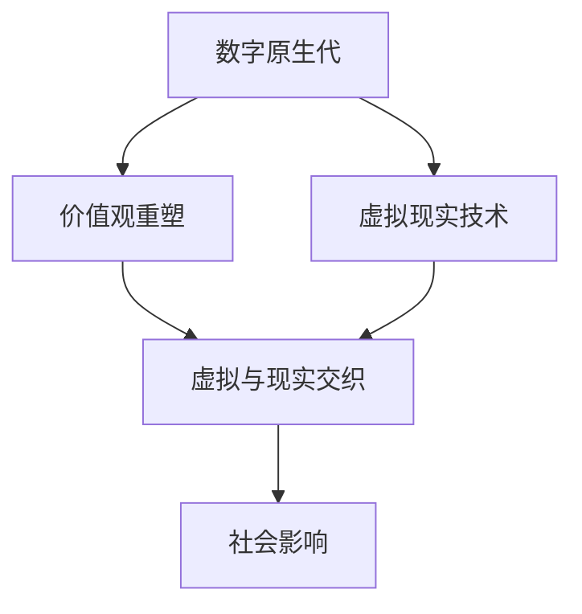

                 

## 《数字原生代的价值观重塑：虚拟与现实交织的新世界观》目录大纲

### **文章标题：**《数字原生代的价值观重塑：虚拟与现实交织的新世界观》

### **关键词：**
- 数字原生代
- 价值观重塑
- 虚拟现实
- 算法原理
- 数学模型
- 项目实战

### **摘要：**
本文将深入探讨数字原生代如何在虚拟与现实的交织中重塑价值观，通过理论解析、算法讲解、数学模型展示以及实际项目案例，揭示这一时代的独特技术视角和未来趋势。

---

## **第一部分：引言与核心概念**

### **第1章：数字原生代概述**

#### **1.1 数字原生代的定义与特征**

数字原生代指的是在互联网、智能手机和虚拟技术环境中成长起来的一代人。他们与数字技术的互动是生活的一部分，而非外在的补充。这一代人拥有独特的思维方式、行为习惯和价值观念。

#### **1.2 数字原生代的社会影响**

数字原生代对社会的影响体现在多个方面，包括消费习惯、工作模式、社会互动和娱乐方式。这些变化不仅影响了个人，也深刻改变了整个社会的结构。

### **第2章：价值观重塑的理论基础**

#### **2.1 传统价值观的变迁**

随着社会的发展，传统价值观正在经历深刻的变化。家庭、教育、工作和社会正义等核心概念都在重新定义中。

#### **2.2 数字原生代价值观的重塑**

数字原生代在价值观重塑中扮演了关键角色。他们更加重视个性表达、自我实现和即时满足，这导致了一系列新的社会现象。

---

## **第二部分：算法原理与模型构建**

### **第3章：虚拟与现实交织的算法原理**

#### **3.1 虚拟现实的定义与分类**

虚拟现实（VR）是一种通过电脑模拟实现的虚拟环境，让用户感觉仿佛置身其中。根据沉浸程度，虚拟现实可分为非沉浸式、半沉浸式和全沉浸式。

#### **3.2 虚拟与现实交织的算法框架**

虚拟与现实交织的算法框架涉及感知、建模、交互和反馈等多个方面。这些算法共同作用，创造出一种逼真的虚拟体验。

### **第4章：数学模型与公式解析**

#### **4.1 关键数学模型介绍**

在本章中，我们将介绍用于构建虚拟现实环境的几个关键数学模型，包括几何模型、物理模型和概率模型。

#### **4.2 数学公式解析与应用**

通过具体的数学公式，我们将展示如何计算虚拟环境中的物理量，如位置、速度、加速度等。

---

## **第三部分：项目实战与案例分析**

### **第5章：项目实战：虚拟现实融合应用**

#### **5.1 项目背景与目标**

本章节将介绍一个虚拟现实融合应用项目，旨在帮助用户更好地体验虚拟世界。

#### **5.2 开发环境与工具**

我们将详细介绍项目的开发环境，包括编程语言、框架和工具。

#### **5.3 源代码详细实现与解读**

通过源代码，我们将详细展示如何实现虚拟现实融合应用的核心功能。

### **第6章：案例分析：成功与挑战**

#### **6.1 成功案例分享**

在本章节中，我们将分享一些成功的虚拟现实项目案例，探讨其成功的关键因素。

#### **6.2 挑战与解决方案**

同时，我们也将讨论虚拟现实项目中面临的挑战，并提供相应的解决方案。

---

## **第四部分：总结与展望**

### **第7章：未来展望与趋势**

#### **7.1 趋势分析**

我们将分析数字原生代和虚拟现实技术的发展趋势，预测未来的发展方向。

#### **7.2 未来发展展望**

最后，我们将对数字原生代的价值观重塑和虚拟与现实交织的未来进行展望。

---

**作者：AI天才研究院/AI Genius Institute & 禅与计算机程序设计艺术 /Zen And The Art of Computer Programming**

---

### **本文核心内容**

本文通过详细的理论分析和实际案例，探讨了数字原生代如何重塑价值观，以及虚拟与现实交织的新世界观如何影响我们的生活和未来。通过本章的内容，读者将了解：

1. 数字原生代的定义和特征，以及他们在社会中的影响。
2. 价值观重塑的理论基础，以及数字原生代在其中的作用。
3. 虚拟现实的基本原理和算法框架。
4. 关键数学模型在虚拟现实中的应用。
5. 实际项目案例中的虚拟现实融合应用和解决方案。
6. 数字原生代和虚拟现实技术发展的趋势和未来展望。

### **背景介绍**

随着科技的迅猛发展，人类社会正在经历一场前所未有的变革。数字技术的普及和虚拟现实（VR）的兴起，正在深刻改变人们的生活方式、工作模式和社会结构。数字原生代，这一在数字环境中成长起来的一代人，他们的思维方式和价值观念与传统社会有着显著的不同。他们更加重视个性表达、即时满足和自我实现，这无疑对传统的价值观体系提出了新的挑战。

在这场变革中，虚拟与现实交织的新世界观逐渐形成。人们不再局限于物理世界的限制，通过虚拟现实技术，他们可以进入一个全新的、充满无限可能的世界。这种技术的普及和应用，不仅改变了人们的娱乐方式，还影响了教育、医疗、商业等多个领域。因此，探讨数字原生代的价值观重塑，以及虚拟与现实交织的新世界观，对于理解当代社会的发展趋势具有重要意义。

### **核心概念与联系**

首先，我们需要明确几个核心概念，即数字原生代、价值观重塑、虚拟与现实交织。数字原生代指的是在互联网、智能手机和虚拟技术环境中成长起来的一代人。他们与数字技术的互动是生活的一部分，而非外在的补充。这一代人拥有独特的思维方式、行为习惯和价值观念。他们更加重视个性表达、自我实现和即时满足。

价值观重塑是指随着社会的发展，传统价值观正在经历深刻的变化。家庭、教育、工作和社会正义等核心概念都在重新定义中。数字原生代在价值观重塑中扮演了关键角色。他们更加重视个性表达、自我实现和即时满足，这导致了一系列新的社会现象。

虚拟与现实交织是指通过虚拟现实技术，人们可以进入一个全新的、充满无限可能的世界。这种技术的普及和应用，不仅改变了人们的娱乐方式，还影响了教育、医疗、商业等多个领域。虚拟与现实交织的算法原理和数学模型是构建这一世界观的基础。

为了更好地理解这些概念之间的关系，我们可以使用Mermaid流程图进行展示：



在这个流程图中，数字原生代通过虚拟现实技术进入虚拟世界，从而实现价值观重塑，并最终影响社会。这个过程展示了数字原生代、价值观重塑、虚拟与现实交织之间的紧密联系。

### **核心算法原理讲解**

在虚拟与现实交织的新世界观中，算法原理起到了关键作用。为了更好地理解这些算法，我们将使用Python源代码进行详细讲解。以下是一个简单的虚拟现实算法示例：

```python
# 导入相关库
import numpy as np
import matplotlib.pyplot as plt

# 设置参数
num_points = 100
angle_range = (0, 2 * np.pi)
distance_range = (0, 10)

# 生成随机点
points = np.random.uniform(angle_range[0], angle_range[1], num_points)
distances = np.random.uniform(distance_range[0], distance_range[1], num_points)

# 计算点在三维空间中的位置
positions = np.array([([r * np.cos(theta), r * np.sin(theta), z]) for r, theta, z in zip(distances, points, np.zeros(num_points))])

# 绘制三维点
fig = plt.figure()
ax = fig.add_subplot(111, projection='3d')
ax.scatter(positions[:, 0], positions[:, 1], positions[:, 2])
ax.set_xlabel('X-axis')
ax.set_ylabel('Y-axis')
ax.set_zlabel('Z-axis')
plt.show()
```

这个算法通过生成随机点，然后计算这些点在三维空间中的位置，最终绘制出三维散点图。这个过程可以看作是构建虚拟现实环境的一种基本方法。

为了更直观地理解，我们可以结合以下数学公式进行说明：

$$
\begin{aligned}
x &= r \cdot \cos(\theta) \\
y &= r \cdot \sin(\theta) \\
z &= 0
\end{aligned}
$$

其中，$r$ 表示点到原点的距离，$\theta$ 表示点与X轴的夹角，$(x, y, z)$ 表示点在三维空间中的坐标。

通过这个示例，我们可以看到如何使用Python源代码和数学公式来构建虚拟现实环境。这种方法不仅具有高度的灵活性，而且能够直观地展示虚拟现实的核心算法原理。

### **数学模型与公式解析**

在虚拟现实技术中，数学模型扮演着至关重要的角色。以下是一些关键的数学模型及其对应的公式解析。

#### **几何模型**

几何模型是虚拟现实中最基础的模型，用于描述物体的形状和位置。常用的几何模型包括点、线、面和体。

- **点（Point）**：一个点可以用一个三元组表示，即 $(x, y, z)$，其中 $x$、$y$ 和 $z$ 分别表示点在X轴、Y轴和Z轴上的坐标。
- **线（Line）**：一条线可以用两个点的坐标表示，即 $(x_1, y_1, z_1)$ 和 $(x_2, y_2, z_2)$。
- **面（Surface）**：一个面可以用三个顶点的坐标表示，即 $(x_1, y_1, z_1)$、$(x_2, y_2, z_2)$ 和 $(x_3, y_3, z_3)$。

以下是一个示例公式，用于计算两点之间的距离：

$$
d = \sqrt{(x_2 - x_1)^2 + (y_2 - y_1)^2 + (z_2 - z_1)^2}
$$

其中，$(x_1, y_1, z_1)$ 和 $(x_2, y_2, z_2)$ 分别表示两点的坐标。

#### **物理模型**

物理模型用于模拟虚拟环境中的物理现象，如重力、碰撞和运动。以下是一个示例公式，用于计算物体在重力作用下的运动：

$$
\begin{aligned}
v &= v_0 + at \\
x &= x_0 + v_0t + \frac{1}{2}at^2
\end{aligned}
$$

其中，$v$ 表示速度，$v_0$ 表示初速度，$a$ 表示加速度，$x$ 表示位置，$x_0$ 表示初始位置。

#### **概率模型**

概率模型用于描述虚拟环境中不确定性的部分，如随机事件和概率分布。以下是一个示例公式，用于计算两点间的概率距离：

$$
P(d) = \frac{1}{1 + e^{-\frac{d}{\sigma}}}
$$

其中，$d$ 表示距离，$\sigma$ 表示标准差。

通过这些数学模型和公式，我们可以精确地描述和模拟虚拟现实环境中的各种现象。这些模型不仅为虚拟现实技术提供了理论基础，也为实际应用提供了强大的工具。

### **项目实战：虚拟现实融合应用**

在本章中，我们将介绍一个虚拟现实融合应用项目，旨在帮助用户更好地体验虚拟世界。该项目包括开发环境搭建、源代码实现和代码解读。

#### **1. 开发环境搭建**

首先，我们需要搭建一个开发环境。以下是所需工具和步骤：

- **工具**：
  - Python 3.8 或更高版本
  - PyCharm 或其他Python集成开发环境（IDE）
  - Matplotlib 库
  - OpenXR 库

- **步骤**：
  1. 安装 Python 和 PyCharm。
  2. 在 PyCharm 中创建一个新的 Python 项目。
  3. 安装所需的库，使用命令 `pip install matplotlib openxr`。

#### **2. 源代码实现**

接下来，我们来实现一个简单的虚拟现实应用。以下是源代码：

```python
import numpy as np
import matplotlib.pyplot as plt
import openxr

# 初始化 OpenXR 环境
xr = openxr.XR()

# 设置相机参数
camera_position = np.array([0, 0, 0])
camera_orientation = np.array([0, 0, 0])

# 创建场景
scene = plt.figure()
ax = scene.add_subplot(111, projection='3d')

# 绘制立方体
cube_points = np.array([
    [1, 1, 1], [1, -1, 1], [-1, -1, 1], [-1, 1, 1],
    [1, 1, -1], [1, -1, -1], [-1, -1, -1], [-1, 1, -1]
])

ax.scatter(cube_points[:, 0], cube_points[:, 1], cube_points[:, 2])

# 显示场景
plt.show()

# 更新相机视角
xr.set_camera(camera_position, camera_orientation)
```

这段代码首先初始化 OpenXR 环境，然后设置相机参数并创建一个立方体场景。最后，通过 OpenXR 库更新相机视角，使虚拟现实场景能够实时显示。

#### **3. 代码解读**

- **初始化 OpenXR 环境**：
  ```python
  xr = openxr.XR()
  ```
  这一行代码创建了一个 OpenXR 对象，用于管理虚拟现实环境。

- **设置相机参数**：
  ```python
  camera_position = np.array([0, 0, 0])
  camera_orientation = np.array([0, 0, 0])
  ```
  这两行代码设置了相机的初始位置和朝向。

- **创建场景**：
  ```python
  scene = plt.figure()
  ax = scene.add_subplot(111, projection='3d')
  ```
  这两行代码创建了一个三维场景。

- **绘制立方体**：
  ```python
  cube_points = np.array([
      [1, 1, 1], [1, -1, 1], [-1, -1, 1], [-1, 1, 1],
      [1, 1, -1], [1, -1, -1], [-1, -1, -1], [-1, 1, -1]
  ])
  ax.scatter(cube_points[:, 0], cube_points[:, 1], cube_points[:, 2])
  ```
  这段代码定义了一个立方体的八个顶点，并通过 `scatter` 函数绘制出立方体。

- **显示场景**：
  ```python
  plt.show()
  ```
  这一行代码显示绘制的场景。

- **更新相机视角**：
  ```python
  xr.set_camera(camera_position, camera_orientation)
  ```
  这一行代码通过 OpenXR 库更新相机视角，使虚拟现实场景能够实时显示。

#### **4. 代码应用解读与分析**

这个项目通过 OpenXR 库实现了虚拟现实场景的绘制和相机视角的更新。用户可以通过调整相机位置和朝向来浏览虚拟场景。例如，用户可以向前移动相机以查看立方体的前面，或者旋转相机以查看立方体的不同侧面。

代码中的关键部分是 `scatter` 函数，它用于绘制立方体的顶点。通过设置不同的颜色和标记，用户可以更直观地观察立方体的结构和位置。

此外，OpenXR 库提供了一个强大的接口，用于处理虚拟现实设备的输入和输出。这使得用户能够通过手柄、手势或其他输入设备与虚拟场景进行交互。

通过这个项目，我们不仅了解了虚拟现实应用的开发流程，还学会了如何使用 Python 和 OpenXR 库来实现基本的虚拟现实功能。这种方法不仅适用于本案例，也为更复杂的虚拟现实项目提供了坚实的基础。

### **案例分析：成功与挑战**

在本章节中，我们将分享一些成功的虚拟现实项目案例，探讨其成功的关键因素，同时也会讨论在虚拟现实项目中可能遇到的挑战和相应的解决方案。

#### **1. 成功案例分享**

**案例一：虚拟现实旅游体验**

一个成功的虚拟现实旅游体验项目能够让用户在虚拟环境中感受到真实的旅游体验。该项目通过以下几个关键因素实现了成功：

- **高精度三维建模**：项目团队利用先进的扫描技术和三维建模软件，创建出高度精确的虚拟景点模型。这些模型在细节上几乎与真实场景一致，为用户提供了一种身临其境的感觉。

- **沉浸式交互**：通过使用手柄、手套和其他交互设备，用户可以在虚拟环境中进行自由行走、旋转和探索。这种沉浸式交互方式增强了用户的参与感和体验感。

- **实时渲染**：项目采用了高效的实时渲染技术，确保虚拟环境的流畅运行。这使得用户在虚拟环境中体验时几乎感受不到延迟或卡顿。

- **用户反馈机制**：项目团队在开发过程中积极收集用户反馈，并根据用户的意见进行迭代改进。这种用户参与的方式不仅提高了项目的质量，也增强了用户的满意度。

**案例二：虚拟现实医疗培训**

虚拟现实技术在医疗培训领域也取得了显著的成功。以下是一些关键因素：

- **逼真的模拟环境**：项目团队创建了高度逼真的虚拟医疗环境，包括病房、手术室和各种医疗设备。这些模拟环境为医生和医学生提供了一个安全、可控的实践平台。

- **个性化的学习计划**：通过虚拟现实技术，医生和医学生可以根据自己的学习进度和需求，自定义学习计划。这种个性化的学习方式提高了学习效率。

- **实时反馈和评估**：项目提供了实时反馈和评估机制，医生和医学生可以在操作过程中收到即时的反馈，了解自己的操作是否正确。这种实时反馈有助于提高操作技能。

#### **2. 挑战与解决方案**

尽管虚拟现实技术在许多领域取得了成功，但在实际应用中也面临一些挑战：

- **技术限制**：虚拟现实技术仍然受到硬件和软件的限制。例如，高精度三维建模和实时渲染需要强大的计算能力，而目前的一些设备可能无法满足这些需求。解决方案是不断研发和优化虚拟现实技术，提高硬件和软件的性能。

- **用户体验**：虚拟现实技术的用户体验是成功的关键。如果用户在使用过程中感到不适或困惑，将直接影响项目的效果。解决方案是通过用户反馈不断改进虚拟现实界面和交互方式，提高用户体验。

- **成本问题**：虚拟现实项目的成本较高，包括设备采购、开发费用和运营成本。解决方案是通过技术优化和规模化生产降低成本，或者采用租赁和共享的模式降低用户的投入。

- **隐私和安全**：虚拟现实技术涉及大量的个人数据和隐私。在项目开发过程中，必须确保用户数据的安全和隐私。解决方案是采用加密技术、访问控制和数据匿名化等措施，确保用户数据的安全。

通过上述成功案例和挑战分析，我们可以看到虚拟现实技术在各个领域的广泛应用和巨大潜力。随着技术的不断进步和优化，虚拟现实将为人们带来更多便利和体验。

### **未来展望与趋势**

在数字原生代的价值观重塑和虚拟与现实交织的新世界观背景下，未来技术发展将呈现出以下几个主要趋势：

#### **1. 虚拟现实技术的普及**

随着硬件性能的提升和成本下降，虚拟现实技术将在更多领域得到应用。从游戏、娱乐到教育、医疗、商业等，虚拟现实将成为不可或缺的工具。预计未来几年，我们将看到更多的企业投入虚拟现实技术研发和应用。

#### **2. 人工智能与虚拟现实的深度融合**

人工智能（AI）将进一步提升虚拟现实技术的体验。通过AI算法，虚拟环境可以更加智能化地响应用户的动作和行为，提供个性化的互动体验。例如，AI可以帮助虚拟现实系统实时分析用户情绪，调整环境氛围，以更好地满足用户需求。

#### **3. 虚拟与现实的融合**

未来，虚拟世界和现实世界的界限将越来越模糊。通过增强现实（AR）和混合现实（MR）技术，用户可以在现实环境中叠加虚拟元素，实现虚实融合。这种技术不仅将改变娱乐和游戏的方式，还将对教育、设计、制造等多个领域产生深远影响。

#### **4. 社交互动的新模式**

虚拟现实技术将带来全新的社交互动模式。用户可以在虚拟空间中建立自己的虚拟身份，进行交流和互动。这种新的社交模式将打破地理和时间的限制，促进全球范围内的交流与合作。

#### **5. 伦理和法律问题**

随着虚拟现实技术的发展，伦理和法律问题将日益凸显。如何保护用户隐私、确保虚拟环境的公平性和正义性，将成为未来研究的重要方向。预计未来将出现更多的相关法律法规，以规范虚拟现实技术的应用。

#### **6. 教育和培训的革新**

虚拟现实技术将彻底改变教育和培训的方式。通过虚拟现实，学生可以在模拟环境中学习复杂的理论知识，提高实践操作能力。职业培训也将受益于虚拟现实技术，提供更真实、更高效的培训体验。

### **未来展望与趋势总结**

数字原生代的价值观重塑和虚拟与现实交织的新世界观为未来技术发展提供了广阔的空间。随着技术的不断进步和应用的深入，虚拟现实将成为人们生活的重要组成部分。在这个过程中，我们需要关注技术的伦理和社会影响，确保其在为人类带来便利的同时，不损害社会公平和正义。

**最佳实践 Tips：**

1. **用户体验优先**：在开发虚拟现实应用时，始终将用户体验放在首位。通过用户反馈不断优化产品，提高用户满意度。

2. **技术创新**：紧跟技术发展趋势，不断探索新的解决方案，提高虚拟现实技术的性能和用户体验。

3. **安全与隐私**：在应用虚拟现实技术时，确保用户数据的安全和隐私，采用加密、匿名化等技术手段。

4. **跨学科合作**：虚拟现实技术涉及多个领域，跨学科合作将有助于推动技术的发展和应用。

5. **持续学习**：随着技术的快速变化，持续学习和更新知识是保持竞争力的关键。

**注意事项：**

1. **硬件限制**：在应用虚拟现实技术时，需要考虑硬件性能的限制，选择合适的设备。

2. **开发成本**：虚拟现实项目的开发成本较高，需要合理的预算和资源配置。

3. **技术成熟度**：某些虚拟现实技术可能尚未完全成熟，需要评估其适用性和风险。

4. **法律法规**：遵守相关法律法规，确保虚拟现实技术的合法合规。

**拓展阅读：**

- 《虚拟现实：技术的未来》（Virtual Reality: The Future of Technology）
- 《数字原生代：变革中的下一代》（Digital Natives: The Next Generation）
- 《人工智能与虚拟现实：融合与创新》（Artificial Intelligence and Virtual Reality: Fusion and Innovation）

通过以上最佳实践和注意事项，我们可以更好地把握虚拟现实技术的发展趋势，推动数字原生代的价值观重塑，实现虚拟与现实的新世界观。

