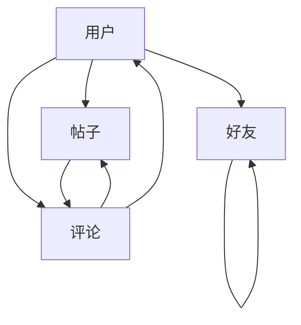

                 

## 数字原生代的社交模式：线上互动与线下连接的融合

> 关键词：数字原生代、社交模式、线上互动、线下连接、融合

在数字技术迅猛发展的时代，人们的生活方式、社交习惯正在经历前所未有的变革。数字原生代，即成长于互联网时代的一代人，他们的社交模式具有显著的数字化特征。本文旨在探讨数字原生代的社交模式，深入分析线上互动与线下连接的融合，从而揭示这一代人在社交互动中的独特行为模式和未来发展趋势。

本文将从以下几个方面展开：

1. **数字原生代的社交文化**
   - 社交行为的数字化特征
   - 社交文化的演变
   - 社交网络对人际关系的重塑

2. **线上互动技术基础**
   - 社交网络的架构与协议
   - 社交网络数据结构
   - 线上互动案例分析

3. **线下连接的挑战与策略**
   - 数字原生代线下社交的困境
   - 线下社交的重建策略
   - 社交焦虑与应对策略

4. **线上线下融合的社交模式**
   - 融合社交模式的定义与特征
   - 融合社交模式的优势
   - 融合社交模式的发展趋势

5. **融合社交模式的案例分析**
   - 社交平台的双线运营
   - 双线运营的成功案例

6. **未来社交模式的展望**
   - 新型社交技术的探索
   - 社交数据的隐私保护与利用

通过上述内容，我们将全面解析数字原生代的社交模式，探讨线上互动与线下连接的融合，为未来的社交发展提供有益的参考。

## 摘要

本文围绕数字原生代的社交模式展开，首先介绍了数字原生代的定义及其社交行为的数字化特征，探讨了社交文化的演变和社交网络对人际关系的重塑。接着，文章深入剖析了线上互动技术的基础，包括社交网络的架构与协议、数据结构，并通过具体案例分析展示了线上互动的实际效果。随后，文章探讨了线下连接的挑战，提出了重建线下社交的策略和应对社交焦虑的方法。在此基础上，文章提出了线上线下融合的社交模式，分析了其定义、优势和发展趋势，并通过案例分析展示了这种模式的实际应用。最后，文章展望了未来社交模式的发展，探讨了新型社交技术的潜力以及社交数据隐私保护的重要性。通过本文的探讨，希望为读者提供对数字原生代社交模式的深入理解，为未来的社交发展提供有价值的思考。

## 1. 数字原生代的社交文化

数字原生代，指的是那些在互联网和数字技术高度普及的时代成长起来的一代人。他们的生活方式、学习方式、工作方式以及社交方式都深刻地受到数字技术的影响。在这一章中，我们将探讨数字原生代的社交文化，分析其数字化特征、社交文化的演变以及社交网络对人际关系的重塑。

### 1.1 社交行为的数字化特征

数字原生代的社交行为具有显著的数字化特征。首先，数字化社交行为高度依赖于移动设备和互联网。他们更倾向于使用社交媒体、即时通讯应用和在线社区进行社交互动，这些工具为他们提供了一个即时的、方便的交流平台。例如，微信、Facebook、Instagram等平台已经成为数字原生代社交互动的主要场所。

其次，数字化社交行为表现出高度的碎片化和即时性。数字原生代通常在碎片化时间内进行社交互动，例如在通勤途中、午餐时间或休息间隙，通过短信、社交媒体评论、点赞等方式快速完成社交活动。这种碎片化的社交行为使得他们的社交网络更加分散，同时也增加了社交互动的频率。

此外，数字化社交行为具有高度的虚拟性。数字原生代通过数字平台建立起的社交关系往往比传统面对面的关系更为虚拟，他们在网络上分享信息、表达观点，但这种虚拟性也带来了一定的社交疏离感。例如，在社交媒体上，人们可能更愿意表达自己的观点和情感，但在现实生活中却缺乏真实的交流和互动。

### 1.2 社交文化的演变

数字原生代的社交文化经历了显著的演变。传统社交文化强调面对面的互动、情感交流和社会纽带，而数字原生代的社交文化则更注重数字化平台上的互动、信息分享和虚拟社交。

首先，数字原生代的社交文化强调即时性和效率。在数字化平台上，人们可以快速获取信息、交流意见，这种即时性使得社交互动更加高效。例如，通过社交媒体平台，人们可以在几秒钟内了解到朋友或公众人物的最新动态，并迅速做出回应。

其次，数字原生代的社交文化更加注重个人表达和自我展示。在社交媒体上，人们可以通过文字、图片、视频等形式展示自己的生活和观点，这种自我展示成为一种社交文化的一部分。例如，Instagram和Twitter等平台鼓励用户分享自己的日常生活和见解，从而形成了一种展示自我和社交互动的亚文化。

此外，数字原生代的社交文化也表现出更加开放和包容的特点。在数字化平台上，人们可以接触到来自不同背景和地域的人，这种多样性使得社交文化更加丰富和多元。例如，在线社区和论坛为人们提供了一个分享兴趣和观点的场所，促进了跨文化、跨地域的交流和合作。

### 1.3 社交网络对人际关系的重塑

社交网络对数字原生代的人际关系产生了深远的影响。首先，社交网络扩大了人们的社交圈子，使得人们能够接触到更多不同背景和兴趣的人。这种社交圈子的扩大不仅增加了人们的社交机会，也带来了更多的社交选择。

其次，社交网络改变了人际关系的建立和维持方式。在传统社交中，人际关系的建立通常需要面对面的互动和长期的交往，而在社交网络中，人们可以通过简单的点击和关注迅速建立联系。这种快速建立的关系虽然减少了建立关系的成本，但也可能导致关系的脆弱性。例如，在社交媒体上，人们可能会因为某些观点或行为的相似性而迅速成为朋友，但也可能在观点或行为出现分歧时迅速断绝关系。

此外，社交网络也对人际关系的深度和真实性产生了影响。在社交网络中，人们的互动往往更加表面化，他们更多地关注信息的分享和观点的表达，而缺乏深度的情感交流和真实的互动。这种表面化的社交互动可能导致人际关系的浅薄化，使得人们更难以建立和维护深厚的人际关系。

总的来说，数字原生代的社交文化具有显著的数字化特征，社交文化的演变和社交网络对人际关系的重塑使得这一代人的社交互动方式发生了深刻的变化。理解这些变化有助于我们更好地把握数字原生代的社交行为模式，为未来的社交发展提供有益的参考。

### 1.4 数字原生代社交行为模式对社交网络的影响

数字原生代的社交行为模式对社交网络产生了深远的影响，不仅改变了人们的社交方式，也对社交网络的运营和未来发展带来了新的挑战和机遇。以下是几个关键方面：

#### 1.4.1 社交网络使用频率和时长

数字原生代对社交网络的依赖程度非常高，他们习惯于频繁地使用各种社交媒体平台、即时通讯工具和在线社区。这种高频次的使用不仅延长了用户在社交网络上的停留时间，也增加了社交网络用户活跃度。对于社交网络平台来说，如何保持用户的高参与度和粘性成为重要的课题。

#### 1.4.2 社交网络内容的生成和消费

数字原生代倾向于生成和消费多元化的内容。他们习惯于通过社交媒体平台分享自己的生活、观点和兴趣爱好，这种内容生产方式丰富了社交网络的内容库，也为平台带来了更多的用户互动机会。同时，数字原生代也更愿意消费个性化的内容，这要求社交网络平台能够提供更加精准的内容推荐和个性化服务。

#### 1.4.3 社交网络关系网络的扩展和收缩

社交网络的扩展和收缩是数字原生代社交行为的一个重要特征。他们通过社交网络平台迅速建立联系，也容易因为某些原因迅速断绝关系。这种动态的关系网络对社交网络平台的用户管理提出了新的要求，平台需要提供更加灵活和高效的社交关系管理工具，以便用户能够更好地管理和维护自己的社交网络。

#### 1.4.4 社交网络对现实人际关系的补充和替代

数字原生代在社交网络上的互动往往成为现实人际关系的重要补充。他们通过社交网络与朋友、家人和同事保持联系，分享生活点滴和情感体验。然而，这也引发了对社交网络是否能够完全替代现实人际关系的讨论。一些研究表明，尽管社交网络能够提供即时的、方便的社交互动，但面对面的交流和深层次的人际关系仍然是无法替代的。

#### 1.4.5 社交网络隐私和安全问题

数字原生代的社交行为模式也对社交网络的隐私和安全提出了更高的要求。他们习惯于在社交网络上分享个人信息和敏感内容，这使得社交网络平台在隐私保护和安全防范方面面临更大的挑战。平台需要采取更加有效的措施来保护用户的隐私，防止信息泄露和滥用。

综上所述，数字原生代的社交行为模式对社交网络产生了深刻的影响，不仅改变了人们的社交方式，也对社交网络的运营和发展提出了新的挑战。理解这些影响有助于社交网络平台更好地满足用户需求，优化用户体验，同时确保平台的健康和可持续发展。

### 1.5 社交网络平台的发展趋势

随着数字原生代的成长和影响力的增加，社交网络平台也在不断演变和发展。以下是几个关键趋势：

#### 1.5.1 个性化推荐和精准营销

社交网络平台越来越注重个性化推荐和精准营销。通过大数据分析和机器学习算法，平台能够更准确地了解用户的需求和偏好，从而提供个性化的内容推荐和广告推送。这种个性化服务不仅提高了用户满意度，也为平台创造了更多的商业机会。

#### 1.5.2 社交电商的融合

社交电商正成为社交网络平台的新趋势。平台通过集成电商功能，使得用户可以在社交环境中直接购买商品。这种融合模式不仅提升了用户的购物体验，也为平台带来了更多的收入来源。

#### 1.5.3 虚拟现实（VR）和增强现实（AR）的应用

虚拟现实和增强现实技术在社交网络平台的应用日益普及。这些技术为用户提供了更加沉浸式的社交体验，使得线上互动更加真实和生动。例如，虚拟社交平台允许用户在虚拟空间中见面和互动，增强了社交的趣味性和互动性。

#### 1.5.4 社交网络平台生态的多元化

社交网络平台正逐渐形成多元化的生态系统。平台不仅提供基础的社交功能，还集成各种第三方应用和服务，例如游戏、音乐、视频等。这种多元化不仅丰富了用户的社交体验，也为平台创造了更多的增值服务机会。

#### 1.5.5 社交网络隐私保护和数据安全

随着用户对隐私和安全问题的关注不断增加，社交网络平台在隐私保护和数据安全方面的投入也在加大。平台需要采取更加严格的数据保护措施，确保用户信息的隐私和安全。

总的来说，社交网络平台的发展趋势呈现出个性化、多元化、沉浸式和安全性等特点。这些趋势不仅影响了用户的社交行为，也对社交网络平台的设计和运营提出了新的挑战和机遇。

## 2. 线上互动技术基础

在深入探讨数字原生代的社交模式之前，理解线上互动技术的基础至关重要。这一部分将介绍社交网络的架构与协议、社交网络数据结构，以及线上互动案例分析，帮助读者全面了解数字原生代在线社交的运作机制和技术支持。

### 2.1 社交网络的架构与协议

社交网络作为数字原生代社交互动的主要平台，其架构与协议的设计直接影响用户体验和平台性能。以下是几个关键方面：

#### 2.1.1 社交网络的基本架构

社交网络通常采用分布式架构，包括客户端（用户端）、服务器端和数据库三部分。客户端负责用户界面和功能操作，服务器端负责处理业务逻辑和存储数据，数据库则用于存储用户信息和社交关系等数据。

1. **客户端**：用户通过客户端与社交网络进行交互，常见的客户端形式有移动应用、Web 应用等。客户端负责展示用户界面、处理用户输入、发送请求和接收响应等。
   
2. **服务器端**：服务器端是社交网络的“大脑”，负责处理用户的请求、执行业务逻辑、管理数据和提供各种服务。常见的服务器端技术包括Web服务器、应用服务器等。

3. **数据库**：数据库用于存储用户数据、社交关系、帖子内容等。常用的数据库技术包括关系型数据库（如MySQL、PostgreSQL）和NoSQL数据库（如MongoDB、Cassandra）。

#### 2.1.2 主要社交网络的协议与标准

社交网络平台通常采用一系列协议和标准来确保数据传输的可靠性和安全性。以下是几个重要的协议和标准：

1. **HTTP/HTTPS**：超文本传输协议（HTTP）是Web应用的基础，用于客户端和服务器之间的数据传输。HTTPS（HTTP over TLS）是HTTP的安全版本，用于加密数据传输，确保通信安全。
   
2. **RESTful API**：表示性状态转移（REST）是一种设计Web服务的架构风格，RESTful API是按照REST风格设计的API，用于客户端和服务器之间的数据交互。

3. **GraphQL**：GraphQL是一种查询语言，允许客户端指定需要的数据，从而提高数据查询的效率。相比传统的REST API，GraphQL可以减少不必要的网络请求和数据传输。

4. **WebSockets**：WebSockets是一种全双工通信协议，允许服务器和客户端之间进行实时、双向通信。在社交网络中，WebSockets常用于实现即时消息推送、实时数据更新等功能。

#### 2.1.3 社交网络数据结构

社交网络数据结构是构建社交网络平台的基础。以下是几个关键的数据结构：

1. **用户关系图**：社交网络的核心是用户关系，用户关系图用于表示用户之间的连接关系。在用户关系图中，每个节点代表一个用户，边表示用户之间的关系（如好友、关注等）。

2. **数据存储模型**：社交网络平台需要高效地存储和管理大量用户数据，常见的数据存储模型包括用户表、帖子表、评论表等。关系型数据库常用于存储这些数据，而NoSQL数据库则适用于处理大规模的、非结构化数据。

3. **索引和缓存**：为了提高数据查询的效率，社交网络平台通常会使用索引和缓存技术。索引用于加速数据查询，而缓存则用于存储频繁访问的数据，减少数据库访问压力。

### 2.2 线上互动案例分析

通过具体案例，我们可以更深入地了解线上互动的运作机制和技术实现。

#### 2.2.1 微信：即时通讯与社交网络

微信是中国最流行的社交应用之一，其核心功能是即时通讯。以下是微信的线上互动技术实现：

1. **客户端架构**：微信客户端采用多线程架构，能够同时处理多种任务，如消息传输、音频/视频通话、朋友圈等。客户端使用TLS协议加密通讯数据，确保通信安全。

2. **服务器端架构**：微信服务器端采用分布式架构，处理用户请求、存储数据和管理社交关系。服务器端使用RESTful API和WebSockets协议，实现实时消息推送和双向通信。

3. **数据存储**：微信使用关系型数据库（如MySQL）存储用户数据和社交关系，使用缓存技术（如Redis）提高数据查询效率。

#### 2.2.2 Facebook：社交网络与数据分析

Facebook是全球最大的社交网络平台，其线上互动技术实现包括以下几个方面：

1. **用户关系图**：Facebook使用用户关系图来表示用户之间的社交关系，通过图算法实现好友推荐和社交圈子划分。

2. **数据存储**：Facebook使用分布式数据库（如HBase、Cassandra）存储大量用户数据和社交媒体内容，利用NoSQL数据库的灵活性处理大规模、非结构化数据。

3. **数据分析**：Facebook通过大数据分析和机器学习技术，分析用户行为和偏好，提供个性化内容推荐和广告服务。

### 2.3 线上互动技术对社交模式的影响

线上互动技术不仅改变了人们的社交方式，还对社交模式产生了深远影响：

1. **即时性与便利性**：线上互动技术提供了即时通讯和实时数据更新，使得社交互动更加高效和便利。

2. **互动方式多样化**：线上互动不仅限于文字和图片，还包括音频、视频等多种形式，丰富了社交互动的内容和方式。

3. **隐私和安全挑战**：线上互动带来了隐私和安全挑战，社交网络平台需要采取有效措施保护用户信息。

4. **社交范围的扩展**：线上互动技术使得社交范围不再受限于地理位置，用户可以与全球用户建立联系。

综上所述，理解线上互动技术的基础对深入探讨数字原生代的社交模式至关重要。通过分析社交网络的架构与协议、数据结构以及具体案例，我们可以更好地理解线上互动的运作机制，为未来的社交发展提供有益的参考。

### 2.4 社交网络中的核心概念与联系

在社交网络中，存在一些核心概念，它们共同构成了社交网络的运作基础。以下是这些核心概念及其相互关系架构的详细解析。

#### 2.4.1 用户（User）

用户是社交网络中的基本元素，每个用户都有一个唯一的标识符，如用户ID。用户不仅是社交网络的服务对象，也是内容的创作者和消费者。用户关系是社交网络中最基本的关系，它定义了用户之间的连接方式。

#### 2.4.2 好友（Friend）

好友关系是社交网络中最常见的关系类型。当两个用户互相关注或添加为好友时，他们之间就会建立好友关系。好友关系可以用一个无向图来表示，其中每个节点代表一个用户，每条边代表一个好友关系。

#### 2.4.3 帖子（Post）

帖子是用户在社交网络上发布的内容，可以是文字、图片、视频等多种形式。帖子是用户表达观点和分享生活的重要载体。每条帖子都与发布它的用户相关联，形成一个信息流，供其他用户浏览和互动。

#### 2.4.4 评论（Comment）

评论是用户对帖子内容进行反馈的一种方式。每个评论都与它所评论的帖子相关联，形成一个互动链条。评论不仅丰富了帖子的内容，也为用户之间的交流和讨论提供了平台。

#### 2.4.5 核心概念关系架构

为了更清晰地展示社交网络中的核心概念及其关系，我们可以使用Mermaid流程图来表示。以下是社交网络中的核心概念与联系架构的示例：



在这个图中，用户（User）是中心节点，与其他核心概念（好友、帖子、评论）通过不同的关系连接。好友（Friend）关系形成一个无向图，表示用户之间的社交网络。帖子（Post）和评论（Comment）通过关联关系相互连接，形成帖子的互动链条。

通过这个架构图，我们可以直观地理解社交网络中的核心概念及其相互关系，这对于分析和设计社交网络系统具有重要意义。

### 2.5 核心算法原理讲解

在社交网络中，核心算法的原理是确保用户能够高效、精准地获取所需信息，提升用户体验。以下将结合Python源代码和数学模型，详细阐述社交网络中常用的核心算法原理。

#### 2.5.1 图算法

图算法在社交网络中用于分析用户关系和推荐好友。以下是图算法的基本原理和实现。

**基本原理：**图算法通过分析节点（用户）和边（关系）之间的连接关系，可以识别出社交网络中的关键节点和社区结构。

**实现示例：**使用Python实现一个简单的图算法——邻接表存储和深度优先搜索（DFS）算法。

```python
class Graph:
    def __init__(self):
        self.adj_list = {}

    def add_edge(self, u, v):
        if u not in self.adj_list:
            self.adj_list[u] = []
        if v not in self.adj_list:
            self.adj_list[v] = []
        self.adj_list[u].append(v)
        self.adj_list[v].append(u)

    def dfs(self, node, visited):
        visited.add(node)
        print(node, end=' ')
        for neighbor in self.adj_list[node]:
            if neighbor not in visited:
                self.dfs(neighbor, visited)

g = Graph()
g.add_edge(1, 2)
g.add_edge(2, 3)
g.add_edge(3, 1)
g.add_edge(3, 4)
g.dfs(1, set())
```

**算法分析：**DFS算法通过递归遍历图中的节点，找到与给定节点直接相连的所有节点，从而构建社交网络中的连接关系。

#### 2.5.2 矩阵计算

矩阵计算在社交网络中用于处理大规模用户数据，如用户行为矩阵、兴趣矩阵等。

**基本原理：**矩阵计算通过矩阵乘法、矩阵分解等方法，可以高效地处理大规模数据，提取关键信息。

**实现示例：**使用Python实现用户行为矩阵的创建和矩阵分解。

```python
import numpy as np

# 用户行为矩阵示例
user_actions = np.array([[1, 0, 1, 0],
                         [1, 1, 0, 1],
                         [0, 1, 1, 1]])

# 矩阵分解（如SVD）
U, Sigma, Vt = np.linalg.svd(user_actions, full_matrices=False)

# 矩阵分解结果
print("U:\n", U)
print("Sigma:\n", Sigma)
print("Vt:\n", Vt)
```

**算法分析：**通过SVD（奇异值分解）算法，可以将用户行为矩阵分解为三个矩阵，其中U和Vt分别表示用户和物品的特征向量，Sigma表示奇异值，用于提取关键特征。

#### 2.5.3 推荐算法

推荐算法在社交网络中用于向用户推荐好友、内容和广告等。

**基本原理：**推荐算法通过分析用户行为和偏好，预测用户可能感兴趣的内容，提高推荐的相关性和精准度。

**实现示例：**使用Python实现基于协同过滤的推荐算法。

```python
from sklearn.metrics.pairwise import cosine_similarity

# 用户行为矩阵示例
user_actions = np.array([[1, 0, 1, 0],
                         [1, 1, 0, 1],
                         [0, 1, 1, 1]])

# 计算用户行为矩阵的余弦相似度矩阵
similarity_matrix = cosine_similarity(user_actions)

# 推荐结果
print("Similarity Matrix:\n", similarity_matrix)

# 基于相似度矩阵推荐好友
for i in range(len(similarity_matrix)):
    for j in range(len(similarity_matrix[i])):
        if i != j and similarity_matrix[i][j] > 0.5:
            print(f"User {i+1} recommends User {j+1}")
```

**算法分析：**通过计算用户行为矩阵的余弦相似度，可以找到与给定用户行为相似的其它用户，从而实现好友推荐。

通过上述示例，我们可以看到核心算法在社交网络中的应用和实现。这些算法不仅提高了社交网络的性能和用户体验，也为社交网络的发展提供了强大的技术支持。

### 2.6 线上互动案例分析

为了更深入地理解线上互动的实际效果，本节将通过具体案例展示数字原生代在社交网络中的互动方式，分析这些互动对用户关系和社交网络结构的影响。

#### 2.6.1 微信群聊：社交互动的新形式

微信群聊是微信平台中的一个重要功能，它允许用户创建和加入多个群组，进行实时沟通和互动。以下是一个微信群聊的案例：

**案例背景：**一家公司决定通过微信群聊来加强内部沟通和团队协作。

**案例过程：**
1. **创建微信群聊**：公司领导创建了一个名为“公司内部交流”的微信群聊，邀请所有员工加入。
2. **日常沟通**：员工在微信群聊中分享工作进度、讨论项目问题，并互相提供帮助。
3. **活动组织**：公司定期在微信群聊中组织线上会议、分享会和团队建设活动，增强团队凝聚力。

**案例分析：**
- **增强团队协作**：微信群聊使得员工可以随时随地进行沟通，解决了传统面对面沟通的时间和空间限制，提高了工作效率和团队协作。
- **促进关系建立**：通过日常交流和活动组织，员工之间的联系更加紧密，关系更加融洽，有助于形成良好的团队文化。
- **信息共享**：微信群聊提供了一个集中的信息共享平台，员工可以及时获取公司动态和工作信息，减少了信息传递的滞后。

#### 2.6.2 社交媒体挑战赛：互动与竞争的结合

社交媒体平台上的挑战赛是一种流行的互动方式，它结合了社交互动和竞争元素，吸引了大量用户的参与。以下是一个社交媒体挑战赛的案例：

**案例背景：**一个知名品牌在社交媒体上发起了“最美风景照片”挑战赛，鼓励用户分享自己的旅游照片。

**案例过程：**
1. **发布挑战**：品牌在社交媒体上发布挑战，邀请用户参与，并提供奖品。
2. **用户参与**：大量用户上传自己的旅游照片，参与挑战。
3. **互动投票**：用户对照片进行点赞和评论，品牌工作人员评选出优胜者。

**案例分析：**
- **增加用户粘性**：挑战赛吸引了大量用户参与，增加了用户在平台上的活跃度，提高了平台的用户粘性。
- **社交互动**：用户通过上传照片、点赞和评论，与其他用户进行互动，促进了社交关系的建立和深化。
- **品牌曝光**：品牌通过挑战赛获得了大量曝光，增强了品牌知名度和用户影响力。

#### 2.6.3 线上学习小组：知识共享与自我提升

线上学习小组是一种利用社交媒体或在线学习平台进行知识共享和自我提升的方式。以下是一个线上学习小组的案例：

**案例背景：**一群对编程感兴趣的人决定在社交媒体上组建一个编程学习小组，共同学习和进步。

**案例过程：**
1. **组建学习小组**：小组成员通过社交媒体平台加入学习小组，共同设定学习目标和计划。
2. **共享资源**：小组成员分享学习资源、代码示例和项目案例，互相帮助解决问题。
3. **定期讨论**：小组定期进行线上讨论，分享学习心得和经验。

**案例分析：**
- **知识共享**：通过资源共享和讨论，小组成员可以快速获取所需知识和技能，提高了学习效率。
- **自我提升**：小组成员通过互相学习和反馈，不断改进自己的技能，实现了自我提升。
- **社交互动**：学习小组提供了一个社交平台，成员之间可以建立深厚的友谊，共同成长。

通过这些案例，我们可以看到线上互动在数字原生代社交中的重要作用。无论是微信群聊、社交媒体挑战赛还是线上学习小组，这些互动方式不仅增强了用户的社交体验，也促进了知识共享和团队协作。同时，这些互动也对社交网络的结构和用户关系产生了深远的影响，推动了社交网络的发展和变革。

### 2.7 数字原生代线下社交的困境与重建策略

数字原生代在享受线上社交的便捷和丰富互动的同时，也面临着线下社交的困境。这些困境不仅影响了他们的社交体验，也对个人成长和社会交往产生了负面影响。本节将探讨数字原生代线下社交的困境，并提出相应的重建策略。

#### 2.7.1 数字依赖带来的社交障碍

数字依赖是数字原生代线下社交困境的主要原因之一。由于习惯于在线上社交，他们往往忽视了现实生活中的人际交往，导致以下几个方面的问题：

1. **社交技能退化**：数字原生代在虚拟世界中积累了大量的社交经验，但在现实生活中却缺乏面对面的交流机会，这导致他们的社交技能退化，无法自如地与人交往。
2. **面对面交流障碍**：长时间依赖线上交流，使得数字原生代在面对面交流时感到不自在，容易出现沟通障碍和误解。
3. **时间管理问题**：线上社交通常不受时间和地点的限制，导致数字原生代在现实生活中的时间管理出现混乱，难以抽出时间进行线下社交。

#### 2.7.2 线下社交的重建策略

为了克服数字依赖带来的社交障碍，数字原生代需要采取一系列重建策略，以恢复和加强线下社交能力。以下是几个关键策略：

1. **制定社交计划**：数字原生代可以制定一个详细的社交计划，包括固定的线下聚会、活动安排等。通过制定计划，他们可以更好地管理时间，确保有足够的线下社交时间。
2. **参与现实活动**：数字原生代应积极参与各种现实活动，如社区活动、运动比赛、艺术展览等。这些活动不仅可以提供丰富的社交机会，还可以帮助他们结识新朋友，拓宽社交圈子。
3. **提高面对面交流能力**：数字原生代可以通过参加公共演讲、辩论赛、社交舞会等社交活动，提高自己的面对面交流能力。这些活动不仅有助于提升他们的沟通技巧，还能增强自信心和社交能力。

#### 2.7.3 社交焦虑与应对策略

社交焦虑是数字原生代线下社交的另一大困境。由于长期依赖线上社交，他们在面对现实生活中的人际交往时，常常感到紧张、不安和自卑。以下是几个应对社交焦虑的策略：

1. **认知行为疗法**：数字原生代可以通过认知行为疗法（CBT）来减轻社交焦虑。CBT帮助个体识别和改变消极思维模式，提高应对社交情境的能力。
2. **逐步面对**：数字原生代可以逐步面对社交情境，从较小、较容易的社交开始，逐渐增加难度。通过逐步面对，他们可以逐渐适应现实社交，减少焦虑感。
3. **积极社交练习**：数字原生代可以通过参加社交练习班、模拟社交情境等方式，积极练习社交技能。这些练习不仅有助于提升他们的社交能力，还能增强他们在现实社交中的自信心。

#### 2.7.4 社交融合策略

为了实现线上互动与线下连接的融合，数字原生代需要采取以下融合策略：

1. **双线运营**：数字原生代可以在线上和线下同时进行社交活动，如通过社交媒体平台预告线下聚会，或者在线上组织讨论，为线下活动做准备。
2. **线上线下互动**：数字原生代可以通过线上互动来增加线下社交的机会，如通过社交媒体平台寻找共同兴趣的朋友，相约线下见面。
3. **利用技术工具**：数字原生代可以利用各种技术工具，如虚拟现实（VR）、增强现实（AR）等，创造更加真实、沉浸的线下社交体验。

总的来说，数字原生代线下社交的困境是一个复杂的问题，需要从多个方面进行解决。通过制定社交计划、参与现实活动、提高面对面交流能力和应对社交焦虑，数字原生代可以逐步克服线下社交的困境，实现线上互动与线下连接的融合。

### 3. 社交焦虑与应对策略

社交焦虑，又称社交恐惧，是一种常见的心理障碍，主要表现为在社交场合中的极度紧张、不安和自卑。数字原生代在长期依赖线上社交的过程中，容易产生社交焦虑，进而影响他们的线下社交能力。本节将深入探讨社交焦虑的表现、成因以及应对策略。

#### 3.1 社交焦虑的表现

社交焦虑主要表现在以下几个方面：

1. **紧张感**：在社交场合中，个体会感到紧张、心跳加速、手心出汗等生理反应。
2. **自我怀疑**：个体在社交场合中常常怀疑自己的言行是否合适，担心自己的表现被他人评判。
3. **社交逃避**：个体为了避免社交场合，可能会采取逃避的策略，如频繁使用线上社交工具，减少面对面交流。
4. **社交障碍**：个体在社交场合中容易出现沟通障碍，难以顺畅地表达自己的想法和感受。

#### 3.2 社交焦虑的成因

数字原生代社交焦虑的形成主要有以下几个原因：

1. **线上社交的过度依赖**：数字原生代习惯于在虚拟世界中进行社交互动，导致他们缺乏面对现实社交的机会，无法充分发展自己的社交技能。
2. **社交技能的退化**：由于长时间依赖线上交流，数字原生代在面对面的社交场合中，往往缺乏有效的沟通技巧和表达能力，进而产生社交焦虑。
3. **社交信息的泛滥**：在社交媒体上，个体可以获取大量社交信息，这些信息有时会给他们带来压力，加剧社交焦虑。
4. **自我认同的缺失**：数字原生代在成长过程中，可能因为现实社交的不足而缺乏自我认同感，进而对现实社交产生抵触情绪。

#### 3.3 应对策略

为了有效应对社交焦虑，数字原生代可以采取以下策略：

1. **认知行为疗法（CBT）**：认知行为疗法是一种科学的心理治疗方法，通过帮助个体识别和改变消极思维模式，提高应对社交情境的能力。CBT可以帮助数字原生代认识到线上社交和现实社交的差异，并学会在现实中进行有效的社交互动。
   
2. **逐步面对**：应对社交焦虑的一个有效策略是逐步面对。数字原生代可以从较小、较容易的社交场合开始，如与熟悉的朋友或家人交流，逐渐增加社交的难度和复杂度。通过逐步面对，他们可以逐渐适应现实社交，减少焦虑感。

3. **社交技能培训**：数字原生代可以通过参加社交技能培训课程，学习如何进行有效的沟通和表达。这些培训课程通常包括如何建立信任、如何倾听他人、如何表达自己的想法和感受等，有助于提升他们的社交技能。

4. **积极社交练习**：数字原生代可以通过参加各种社交活动，如社交舞会、公共演讲、辩论赛等，积极练习社交技能。这些活动不仅提供了丰富的社交机会，还可以帮助他们在现实社交中积累经验，提高自信心。

5. **利用技术工具**：数字原生代可以利用各种技术工具，如虚拟现实（VR）、增强现实（AR）等，创造更加真实、沉浸的线下社交体验。这些技术工具可以帮助他们逐步适应现实社交，减少焦虑感。

6. **寻求专业帮助**：如果社交焦虑严重影响了数字原生代的生活质量，他们可以寻求专业心理咨询师的帮助。心理咨询师可以通过专业的治疗方法，帮助他们减轻焦虑，提高社交能力。

总的来说，社交焦虑是数字原生代在现实社交中面临的一个挑战，但通过采取有效的应对策略，他们可以逐步克服这一困境，实现线上互动与线下连接的融合。

### 4. 线上线下融合的社交模式

随着数字技术的快速发展，社交模式也在经历深刻的变革。传统单一的线上或线下社交方式已无法满足数字原生代多样化的社交需求。线上线下融合的社交模式应运而生，成为数字时代的一种新型社交形态。本文将从定义、优势和发展趋势等方面探讨线上线下融合的社交模式，为理解这一新兴社交模式提供全面视角。

#### 4.1 融合社交模式的定义

线上线下融合的社交模式，是指通过数字技术和现实活动的结合，实现线上互动与线下连接的社交方式。这种模式不仅保留了线上社交的便捷性和即时性，还融合了线下社交的真实性和互动性。具体来说，融合社交模式包括以下几个关键特征：

1. **线上互动的延伸**：通过社交媒体、即时通讯工具和在线社区等平台，用户可以在线上进行实时交流、分享信息和互动。
2. **线下活动的组织**：通过线下聚会、活动、会议等现实活动，用户可以进行面对面的交流、互动和体验。
3. **双线同步**：线上互动和线下活动相互关联，实现双线同步推进，增强用户的社交体验和参与感。

#### 4.2 融合社交模式的优势

融合社交模式具有以下几大优势，使其在数字原生代中受到广泛关注：

1. **提高社交效率**：融合社交模式结合了线上和线下的优势，用户可以灵活选择互动方式，节省时间和精力，提高社交效率。
2. **增强互动体验**：线上互动提供了即时性和丰富性，而线下互动则提供了真实性和互动性，两者结合能够提供更加丰富和深刻的社交体验。
3. **扩大社交范围**：通过线上平台，用户可以接触到来自不同地区和背景的人，线下活动则有助于建立和深化现实中的社交关系，实现社交范围的扩大。
4. **降低社交成本**：线上互动降低了地理和时间的限制，使得社交成本大大降低，用户可以更便捷地进行社交。
5. **多元化社交形式**：融合社交模式支持多种社交形式的组合，如线上讨论、线下聚会、线上直播等，为用户提供多样化的社交选择。

#### 4.3 融合社交模式的发展趋势

线上线下融合的社交模式正处于快速发展阶段，未来将呈现出以下几个趋势：

1. **技术融合**：随着人工智能、虚拟现实（VR）和增强现实（AR）等技术的进步，融合社交模式将更加智能化和沉浸式，提供更丰富的互动体验。
2. **社交平台集成**：社交平台将进一步集成线上线下功能，提供一站式社交服务，用户可以在同一个平台上完成线上互动和线下活动。
3. **社区化发展**：融合社交模式将推动社交社区的形成，用户不仅在虚拟世界中互动，还将在线下形成具有共同兴趣和价值观的社交圈子。
4. **商业机会**：融合社交模式将为企业和商家提供新的商业机会，如线上营销、线下活动策划、虚拟商品销售等，为企业带来更多盈利模式。
5. **隐私保护**：随着隐私保护意识的增强，融合社交模式将更加注重用户隐私保护，采用更严格的隐私政策和安全技术，保障用户信息安全。

总的来说，线上线下融合的社交模式是数字原生代应对社交需求变化的必然选择。通过不断创新和发展，这一模式将在未来社交领域中发挥越来越重要的作用。

### 5. 融合社交模式的案例分析

融合社交模式作为一种新兴的社交方式，已经在多个领域取得了显著的应用成果。以下将通过对具体案例的分析，深入探讨融合社交模式在实践中的应用效果。

#### 5.1 社交平台的双线运营

社交平台的双线运营是融合社交模式的重要体现。以下是一个成功案例——微信的双线运营策略。

**案例背景：**微信作为一款综合性的社交平台，不仅提供线上即时通讯功能，还组织线下活动，实现了线上互动与线下连接的有机结合。

**案例过程：**
1. **线上互动**：微信通过微信聊天、朋友圈、公众号等线上功能，提供便捷的即时通讯和信息分享平台。用户可以随时随地发送文字、图片、视频等内容，与朋友、家人和同事保持联系。
2. **线下活动**：微信还组织了各种线下活动，如“微信运动挑战赛”、“微信读书线下分享会”等，吸引了大量用户参与。这些活动不仅增强了用户之间的互动，也提高了平台的用户粘性。

**案例分析：**
- **双线互动**：通过线上和线下的有机结合，微信实现了用户在不同场景下的互动，增强了社交体验。用户不仅可以通过线上平台保持联系，还可以通过线下活动加深彼此的关系。
- **用户粘性**：微信的双线运营策略提高了用户对平台的依赖度，增强了用户粘性。用户在享受线上便捷的同时，也积极参与线下活动，形成了良好的用户生态。

#### 5.2 跨界融合的社交活动

跨界融合的社交活动是融合社交模式的另一种应用形式。以下是一个成功案例——网易云音乐与线下音乐节的结合。

**案例背景：**网易云音乐作为一款音乐社交平台，通过组织线下音乐节，将线上音乐爱好者的互动延伸至现实世界。

**案例过程：**
1. **线上互动**：网易云音乐用户可以通过平台分享自己的音乐喜好、评论和推荐，形成独特的音乐社交圈。平台还推出了“私人FM”等个性化服务，为用户推荐符合其口味的音乐。
2. **线下音乐节**：网易云音乐定期举办线下音乐节，邀请知名音乐人和新兴乐队演出。用户可以通过平台报名参加音乐节，与志同道合的音乐爱好者面对面交流。

**案例分析：**
- **跨界融合**：通过将线上音乐社交与线下音乐节相结合，网易云音乐不仅提供了丰富的线上互动体验，还为用户创造了线下体验和交流的机会。这种跨界融合模式极大地提升了用户的音乐社交体验。
- **品牌影响力**：网易云音乐通过跨界融合活动，增强了品牌影响力，吸引了更多用户和音乐人的关注。活动不仅提高了平台的用户活跃度，也提升了品牌的知名度。

#### 5.3 虚拟现实（VR）与社交融合

虚拟现实（VR）技术的发展为社交融合提供了新的可能。以下是一个成功案例——VR社交平台的兴起。

**案例背景：**VR社交平台如AltspaceVR和Rec Room，通过虚拟现实技术，为用户提供了沉浸式的社交体验。

**案例过程：**
1. **虚拟空间**：用户可以通过VR设备进入虚拟空间，与其他用户进行互动。虚拟空间设计了多种场景，如客厅、咖啡店、游乐场等，用户可以在这些场景中聊天、玩游戏、参加活动。
2. **实时互动**：VR社交平台提供了实时语音和视频通话功能，用户可以在虚拟空间中实时交流，增强互动体验。

**案例分析：**
- **沉浸式体验**：通过VR技术，用户可以在虚拟空间中获得高度沉浸的社交体验，仿佛置身于真实环境中。这种沉浸式体验极大地提升了社交的趣味性和互动性。
- **拓展社交圈**：VR社交平台为用户提供了丰富的社交场景和互动方式，使用户可以轻松拓展社交圈，结识新朋友。平台不仅增强了用户的社交体验，也为用户提供了更多的社交机会。

总的来说，融合社交模式在具体案例中的应用表明，通过线上线下互动的有机结合，可以显著提升用户的社交体验和参与感。这种模式不仅丰富了社交形式，也为企业和平台带来了新的发展机遇。

### 6. 未来社交模式的展望

随着数字技术的不断进步，未来社交模式将迎来一系列重大变革，这些变革不仅会改变人们的社交方式，还将深刻影响社会的方方面面。以下是几个关键方向：

#### 6.1 新型社交技术的探索

未来社交模式的发展将依赖于新型社交技术的探索和应用。以下是几个值得关注的领域：

1. **虚拟现实（VR）与增强现实（AR）**：随着VR和AR技术的成熟，这些技术将为社交互动提供更加真实和沉浸式的体验。用户可以通过VR头盔或AR眼镜进入虚拟社交环境，进行面对面的互动和体验。例如，虚拟现实社交平台允许用户在虚拟空间中见面、交流和参加活动，从而打破了地理和时间的限制。

2. **人工智能（AI）与机器学习**：AI和机器学习技术将进一步提升社交平台的智能化水平。通过大数据分析和机器学习算法，社交平台可以更准确地了解用户的需求和偏好，提供个性化的内容推荐和社交匹配。例如，AI可以分析用户的互动行为，推荐新的朋友和兴趣小组，从而优化社交体验。

3. **区块链技术**：区块链技术具有去中心化和数据透明化的特点，可以用于构建去中心化的社交平台。在这种平台上，用户可以拥有对自己数据和隐私的完全控制权，避免了传统社交平台的数据泄露和滥用风险。此外，区块链技术还可以用于数字身份验证和虚拟货币支付，为社交互动提供更安全和便捷的支付方式。

#### 6.2 社交数据的隐私保护与利用

社交数据是未来社交模式中的重要资产，但同时也带来了隐私保护的重大挑战。以下是几个关键方面：

1. **隐私保护技术**：随着隐私保护意识的增强，社交平台需要采用更严格的隐私保护技术。例如，加密技术可以用于保护用户数据在传输过程中的安全性，隐私计算技术可以在不泄露用户隐私的前提下分析数据。此外，社交平台可以建立用户隐私设置，让用户能够自主选择分享数据的内容和范围。

2. **用户数据管理**：社交平台需要建立透明、公正的数据管理机制，让用户了解自己的数据是如何被收集、使用和共享的。用户应该有权查看和修改自己的数据，甚至可以选择删除自己的账户。平台还应定期进行数据安全审计，确保用户数据的安全和合规性。

3. **数据利用与伦理**：尽管隐私保护至关重要，但社交平台仍然需要利用用户数据来提供更优质的服务。在数据利用方面，平台需要遵守伦理规范，确保数据的合理使用，避免数据滥用和歧视行为。例如，平台可以通过匿名化处理和聚合分析，从大量数据中提取有价值的信息，同时保护用户的隐私。

#### 6.3 社交模式的个性化与多样性

未来社交模式将更加注重个性化与多样性，满足不同用户群体的需求。以下是几个发展方向：

1. **个性化推荐**：社交平台将继续优化个性化推荐系统，通过分析用户的行为、兴趣和社交网络，提供个性化的内容和社交建议。例如，推荐用户可能感兴趣的好友、活动、内容和广告，从而提高用户满意度和平台粘性。

2. **多元文化社区**：随着全球化的推进，社交平台将吸引来自不同文化背景的用户，形成多元文化社区。平台需要提供支持多种语言和文化的功能，促进不同文化之间的交流和融合。例如，提供多语言翻译、文化活动和交流平台，帮助用户更好地理解和接纳其他文化。

3. **虚拟身份与个性化表达**：未来社交模式将更加注重用户的虚拟身份和个性化表达。用户可以通过自定义头像、皮肤、声音等元素，展示自己的个性和风格。此外，虚拟现实和增强现实技术将提供更多个性化的互动体验，如虚拟演唱会、虚拟旅游等，满足用户的个性化需求。

总的来说，未来社交模式的发展将依赖于新型技术的探索、社交数据隐私保护与利用，以及个性化与多样性的实现。这些变革将推动社交模式不断创新，为用户提供更加丰富和多样化的社交体验。

### 8. 总结与展望

本文围绕数字原生代的社交模式进行了全面探讨，从数字原生代的社交文化、线上互动技术基础，到线下连接的挑战与策略，再到线上线下融合的社交模式，以及未来社交模式的展望，我们系统地分析了这一代人的社交行为模式及其对社交网络的影响。

首先，数字原生代的社交文化具有显著的数字化特征，他们倾向于通过社交媒体和即时通讯工具进行社交互动，表现出碎片化、虚拟化和即时化的特点。其次，线上互动技术基础为数字原生代提供了便捷的社交平台，包括社交网络的架构与协议、数据结构以及核心算法原理，这些技术支持了他们的在线社交行为。然而，数字原生代在享受线上社交便捷的同时，也面临着线下社交的困境，如社交技能退化、社交焦虑等，这些问题需要通过制定社交计划、参与现实活动和提高面对面交流能力等策略来应对。

线上线下融合的社交模式为解决数字原生代线下社交困境提供了新的思路。通过结合线上互动和线下活动，这一模式不仅提高了社交效率，还增强了互动体验，为数字原生代提供了一个多元化的社交平台。未来社交模式的发展趋势将依赖于新型社交技术的探索，如虚拟现实、人工智能和区块链技术，这些技术将为社交互动带来更加真实、智能化和隐私保护的经验。

总体而言，数字原生代的社交模式不仅影响了他们的社交行为，也对社交网络的发展产生了深远的影响。随着技术的不断进步，社交模式将变得更加多样化、个性化，为用户提供更加丰富和优质的社交体验。未来的社交网络将不仅是人与人之间的连接，还将是技术与人类的深度融合，为构建一个更加互联、开放和包容的社交世界提供有力支持。通过不断探索和创新，我们可以期待一个更加美好的社交未来。作者：AI天才研究院/AI Genius Institute & 禅与计算机程序设计艺术 /Zen And The Art of Computer Programming。

