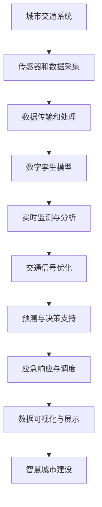

                 

### 引言

随着城市化进程的加速和人口密度的增加，城市交通问题已经成为全球各大城市面临的严峻挑战之一。交通拥堵不仅浪费了宝贵的时间和经济资源，还对环境造成了严重的负面影响。传统的交通管理方法，如交通信号优化、道路扩建和公共交通系统的改善，虽然在一定程度上缓解了交通拥堵问题，但效果往往有限，且难以应对日益复杂的交通状况。

近年来，数字孪生（Digital Twin）技术的发展为城市交通管理提供了一种全新的解决方案。数字孪生是一种基于物理实体和虚拟仿真模型的技术，通过构建一个与实际城市交通系统高度相似的虚拟世界，实现对实际交通状况的实时监测、分析和优化。本文旨在探讨数字孪生在城市交通管理中的应用，特别是如何通过数字孪生技术缓解交通拥堵问题。

首先，我们将简要介绍数字孪生及其在交通领域的应用背景。接着，讨论城市交通管理的基本概念，包括交通体系、拥堵原因及管理挑战。随后，详细阐述数字孪生在交通管理中的应用流程和技术原理，包括建模方法、交通流量分析与预测、交通信号优化等。此外，本文还将介绍数字孪生技术在应急响应中的应用，以及其实践案例。最后，分析数字孪生技术的未来发展趋势，总结主要成果与贡献，并提出未来研究方向。

本文的核心关键词包括：数字孪生、城市交通管理、交通拥堵、建模、流量分析、信号优化、应急响应。这些关键词不仅涵盖了本文的主要内容，也为读者提供了一个清晰的导航框架，帮助其快速掌握文章的核心信息。

### 背景介绍

数字孪生（Digital Twin）是一种先进的技术理念，其核心思想是通过创建物理实体的虚拟复制体，实现对现实世界的实时模拟和监测。这种技术最早可以追溯到20世纪80年代，当时主要集中在制造业领域。数字孪生的概念在2014年被Gartner列入新兴技术趋势，随后迅速扩展到多个行业，包括建筑、能源、医疗、制造和交通等。

在交通领域，数字孪生的应用前景尤为广阔。传统的交通管理方法主要依赖于物理基础设施和人工干预，这不仅效率低下，而且在应对动态和复杂交通状况时存在局限性。数字孪生技术的出现，为交通管理带来了一场革命。通过构建城市交通系统的虚拟模型，交通管理者可以实时获取交通状况数据，进行深入分析和优化，从而实现更高效、更智能的交通管理。

数字孪生在交通领域的应用背景主要有以下几个方面：

1. **交通流量监测与优化**：传统的交通监测系统依赖于传感器和人工巡检，存在数据采集不全面、实时性差等问题。数字孪生通过虚拟仿真模型，可以实现对交通流量的实时监测，提供准确的交通数据，从而优化交通信号控制和交通疏导策略。

2. **交通事件预警与应急响应**：数字孪生技术能够对交通数据进行实时分析和预测，识别潜在的交通事件和拥堵点，提前发出预警。在突发事件发生时，如交通事故、道路施工等，数字孪生还可以模拟不同的应急响应方案，为交通管理部门提供决策支持。

3. **智慧城市建设**：随着智慧城市的建设步伐加快，数字孪生技术成为智慧城市的重要组成部分。通过数字孪生，城市管理者可以全面掌握城市交通系统的运行状况，实现跨部门的协同管理和智能决策，提高城市整体运行效率。

4. **交通规划与设计**：数字孪生技术为交通规划提供了强有力的工具。通过虚拟仿真，交通规划者可以在建设前就模拟不同规划方案对交通状况的影响，优化交通基础设施布局，降低建设成本和环境影响。

数字孪生技术的发展历程可以分为几个阶段：

- **初步探索阶段（20世纪80年代-2000年代初）**：数字孪生技术的概念初步提出，主要集中在制造业领域，通过虚拟仿真优化生产流程。

- **快速发展阶段（2000年代中期-2010年代中期）**：随着计算能力和数据采集技术的提升，数字孪生技术逐步应用于更多行业，包括建筑和能源。

- **广泛应用阶段（2010年代中期至今）**：数字孪生技术得到广泛应用，尤其在智慧城市建设中发挥了重要作用。随着5G、物联网、人工智能等新兴技术的融合，数字孪生的应用场景和功能不断扩展。

在交通领域，数字孪生技术的应用已经取得了显著成果。例如，美国的交通管理公司使用了数字孪生技术，成功优化了洛杉矶等大城市的交通信号控制，显著降低了交通拥堵时间。中国的深圳也在智慧交通领域进行了大量探索，通过数字孪生技术实现了交通流量预测和智能调度，有效缓解了城市交通压力。

总之，数字孪生技术为城市交通管理提供了新的思路和工具，通过虚拟仿真和实时数据分析，不仅提高了交通管理的效率和准确性，还为交通规划、应急响应和智慧城市建设提供了强有力的支持。随着技术的不断进步，数字孪生将在未来城市交通管理中发挥更加重要的作用。

### 城市交通管理的基本概念

城市交通管理是一个涉及多个层面的复杂系统，其目标是通过有效的交通规划、设计、控制和运营，确保城市交通系统的高效、安全和可持续发展。城市交通体系包括道路、桥梁、隧道、公共交通系统、交通信号等基础设施，以及与交通相关的法律法规、政策和规章制度。以下是城市交通管理的基本概念，包括交通体系、交通拥堵原因及管理挑战。

#### 城市交通体系

城市交通体系是一个多层次、多维度的系统，主要包括以下几个方面：

1. **道路网络**：道路网络是城市交通的基础设施，包括主干道、次干道和支路。道路网络的布局和设计直接影响交通流量和通行效率。

2. **公共交通系统**：公共交通系统包括地铁、公交车、轻轨等，是城市居民出行的重要选择。公共交通系统的规模、覆盖范围和服务质量对城市交通拥堵有重要影响。

3. **交通信号控制**：交通信号控制是城市交通管理的重要组成部分，通过信号灯、智能交通信号控制系统等手段，实现交通流量的合理分配和疏导。

4. **停车设施**：停车设施是城市交通体系的一部分，包括公共停车场、路边停车等。合理的停车设施布局可以缓解交通压力，减少道路拥堵。

5. **交通监控与数据采集**：交通监控与数据采集系统通过传感器、摄像头等设备，实时获取交通流量、车速、路况等信息，为交通管理和决策提供数据支持。

#### 交通拥堵原因

交通拥堵是城市交通管理面临的主要挑战之一。交通拥堵的原因复杂多样，主要包括以下几个方面：

1. **交通需求增长**：随着城市人口和车辆数量的增加，交通需求不断增长，导致道路容量不足，引发拥堵。

2. **交通结构不合理**：城市交通体系设计不合理，道路网络拥堵节点多，公共交通系统不完善，道路宽度不足等，都会导致交通拥堵。

3. **交通事故**：交通事故是交通拥堵的重要诱因，特别是在高峰时段，交通事故往往会导致交通中断和延误。

4. **恶劣天气**：雨雪、雾霾等恶劣天气会影响交通状况，降低道路通行能力，导致交通拥堵。

5. **交通信号控制不当**：交通信号控制系统配置不合理，信号灯时长设置不当，无法及时响应交通流量变化，会导致交通拥堵。

#### 城市交通管理的挑战

城市交通管理面临以下主要挑战：

1. **动态性**：城市交通状况是动态变化的，交通流量、事故、施工等因素都会对交通状况产生影响，交通管理需要具备实时响应能力。

2. **复杂性**：城市交通系统是一个复杂的网络系统，包含多个相互关联的子系统，交通管理需要协调各个子系统，实现整体最优。

3. **数据依赖**：交通管理高度依赖交通数据，数据的质量和实时性直接影响交通管理的效率和准确性。

4. **资源有限**：城市交通管理需要大量的资金、技术和人力资源，但在实际操作中，这些资源往往是有限的，需要合理分配和利用。

5. **法规和政策**：交通管理还需要依靠法律法规和政策支持，制定合理的交通法规和政策，提高交通管理水平。

#### 城市交通管理的目标

城市交通管理的目标主要包括以下几个方面：

1. **提高交通效率**：通过合理的交通规划、设计和控制，提高交通流量，减少交通拥堵，提高道路通行效率。

2. **保障交通安全**：通过有效的交通管理和安全措施，降低交通事故发生率，保障市民出行安全。

3. **促进环境保护**：通过减少交通拥堵和尾气排放，降低环境污染，促进城市可持续发展。

4. **优化交通服务**：提供优质的公共交通服务，方便市民出行，提高生活质量。

5. **适应城市发展**：随着城市的发展和变化，交通管理需要不断适应新的城市结构和交通需求，实现交通与城市的协调发展。

综上所述，城市交通管理是一个复杂的系统工程，需要综合考虑交通体系、拥堵原因和管理挑战，通过有效的管理措施和技术手段，实现城市交通系统的最优运行。数字孪生技术的引入，为城市交通管理提供了新的思路和工具，通过虚拟仿真和实时数据分析，有助于实现更加智能、高效的交通管理。

### 数字孪生与城市交通管理的关系

数字孪生（Digital Twin）技术在城市交通管理中扮演着至关重要的角色。通过创建城市交通系统的虚拟复制体，数字孪生技术为交通管理者提供了一个实时、可视、可操作的仿真平台，从而显著提升交通管理的效率和效果。

#### 数字孪生与城市交通管理的联系

数字孪生与城市交通管理之间的联系主要体现在以下几个方面：

1. **实时监测与数据分析**：数字孪生技术通过传感器和物联网设备实时收集城市交通数据，包括交通流量、车速、道路占用情况等。这些数据可以传输到虚拟模型中，进行实时分析和处理，帮助交通管理者及时了解交通状况，做出快速响应。

2. **交通流量预测**：数字孪生模型基于历史数据和实时数据，采用先进的算法和机器学习技术进行交通流量预测。通过预测交通流量，交通管理者可以提前调整交通信号配置，优化交通流量，减少交通拥堵。

3. **交通信号优化**：数字孪生技术能够模拟不同的交通信号控制策略，评估其对交通流量的影响。通过仿真分析，交通管理者可以找到最优的交通信号配置，提高交通通行效率。

4. **应急响应与调度**：在突发交通事件（如交通事故、道路施工）发生时，数字孪生技术可以模拟不同的应急响应方案，为交通管理者提供决策支持，快速恢复交通秩序。

5. **智慧城市建设**：数字孪生技术是智慧城市的重要组成部分，通过整合城市交通、能源、环境等多方面的数据，实现跨部门的协同管理和智能决策，提高城市整体运行效率。

#### 数字孪生在交通管理中的重要性

数字孪生技术在城市交通管理中的重要性体现在以下几个方面：

1. **提高决策效率**：通过数字孪生技术，交通管理者可以实时获取交通数据，进行深入分析和预测，快速做出决策。相比传统方法，数字孪生显著提高了决策的效率和质量。

2. **降低管理成本**：数字孪生技术通过虚拟仿真和实时数据分析，减少了实际交通管理和试验的成本。交通管理者可以在虚拟环境中测试和优化交通管理策略，避免实际操作中的错误和损失。

3. **提升交通安全性**：数字孪生技术能够提前预警潜在的交通事件和拥堵点，为交通管理者提供决策支持，降低交通事故的发生概率。通过实时监测和优化交通信号，数字孪生技术提高了交通安全性。

4. **增强数据可视化**：数字孪生技术将复杂的交通数据通过虚拟模型进行可视化展示，使得交通管理者能够直观地了解交通状况，从而更好地进行交通管理和决策。

5. **促进智慧城市发展**：数字孪生技术是智慧城市建设的重要组成部分，通过整合城市交通、能源、环境等多方面的数据，实现跨部门的协同管理和智能决策，推动智慧城市的全面发展。

#### 数字孪生在交通管理中的核心概念与联系

为了更好地理解数字孪生在交通管理中的应用，以下是一个核心概念和联系架构的Mermaid流程图：

- **城市交通系统**：城市交通系统的实际运行情况，包括道路、车辆、交通信号等。
- **传感器和数据采集**：通过传感器和物联网设备实时收集交通数据。
- **数据传输和处理**：将交通数据传输到数字孪生模型，并进行处理和分析。
- **数字孪生模型**：创建城市交通系统的虚拟模型，用于仿真和预测。
- **实时监测与分析**：对交通数据进行实时监测和分析，识别交通状况和拥堵点。
- **交通信号优化**：基于分析结果，优化交通信号控制策略。
- **预测与决策支持**：通过预测交通流量，为交通管理者提供决策支持。
- **应急响应与调度**：在突发事件发生时，模拟不同的应急响应方案。
- **数据可视化与展示**：将分析结果和预测数据通过虚拟模型进行可视化展示。
- **智慧城市建设**：通过整合交通、能源、环境等多方面的数据，推动智慧城市的建设。

通过上述Mermaid流程图，我们可以清晰地看到数字孪生技术在城市交通管理中的核心概念和联系架构，为交通管理者提供了一个全面、高效的管理工具。

总之，数字孪生技术通过实时监测、数据分析和仿真预测，为城市交通管理提供了强有力的支持。在未来的城市交通管理中，数字孪生技术将发挥更加重要的作用，帮助交通管理者实现高效、智能、可持续的交通管理目标。

### 数字孪生建模方法

数字孪生技术的核心在于创建一个与实际城市交通系统高度相似的虚拟模型，从而实现对交通状况的实时监测、分析和优化。数字孪生建模方法主要包括以下几个关键步骤：建模目标确定、数据收集与预处理、物理实体与虚拟实体的映射、以及数字孪生模型的动态更新。

#### 建模目标确定

在开始数字孪生建模之前，首先需要明确建模的目标。建模目标通常包括以下几个方面：

1. **实时监测**：通过数字孪生模型实时获取城市交通系统的运行状态，如交通流量、车速、道路占用情况等。
2. **流量预测**：基于历史数据和实时数据，预测未来的交通流量，为交通管理提供决策支持。
3. **信号优化**：模拟不同的交通信号控制策略，评估其对交通流量的影响，找到最优的信号配置。
4. **应急响应**：在突发事件发生时，模拟不同的应急响应方案，帮助交通管理者快速恢复交通秩序。
5. **数据分析**：对交通数据进行深入分析，识别交通状况、拥堵原因及改进方向。

#### 数据收集与预处理

数字孪生模型的质量高度依赖于数据的质量。因此，数据收集与预处理是数字孪生建模的关键步骤。数据收集主要涉及以下几个方面：

1. **交通流量数据**：通过安装在道路上的传感器（如车辆检测器、摄像头等）收集交通流量数据，包括车辆数量、速度、车型等。
2. **交通信号数据**：收集交通信号灯的状态信息，如红绿灯时长、绿灯时长等。
3. **道路信息数据**：收集道路的宽度、长度、道路条件等数据，用于建模道路网络。
4. **交通事故数据**：收集交通事故的发生时间、地点、类型等数据，用于分析和预测。

数据预处理主要包括以下步骤：

1. **数据清洗**：去除无效数据、错误数据和重复数据，确保数据的一致性和准确性。
2. **数据集成**：将来自不同来源的数据进行整合，形成统一的数据集。
3. **数据转换**：将不同格式的数据转换为统一格式，便于后续处理和分析。
4. **数据标准化**：对数据进行标准化处理，如统一时间格式、单位等。

#### 物理实体与虚拟实体的映射

数字孪生建模的核心在于将实际城市交通系统的物理实体映射到虚拟模型中。这一步骤主要包括以下几个方面：

1. **实体识别**：确定城市交通系统中需要映射的物理实体，如车辆、道路、交通信号等。
2. **属性定义**：为每个物理实体定义相关的属性，如车辆的速度、类型、道路的宽度、长度等。
3. **模型构建**：基于确定的实体和属性，构建虚拟模型的框架。通常采用图论模型或网格模型来表示道路网络，采用实体-关系模型来表示交通信号和其他实体。
4. **仿真设置**：在虚拟模型中设置仿真环境，包括交通流量、信号控制策略等。

#### 数字孪生模型的动态更新

数字孪生模型需要能够实时更新，以反映实际交通系统的动态变化。动态更新主要包括以下几个方面：

1. **实时数据采集**：通过传感器和物联网设备，实时采集交通数据，如交通流量、车速等。
2. **数据更新**：将实时采集到的数据传输到数字孪生模型，对模型进行更新，确保模型反映最新的交通状况。
3. **模型修正**：根据新的数据，对模型进行调整和修正，以适应实际交通系统的变化。
4. **仿真运行**：在更新后的数字孪生模型中运行仿真，评估交通状况和预测未来的交通流量。

通过上述步骤，数字孪生建模方法为城市交通管理提供了一个实时、动态、可操作的虚拟平台，使得交通管理者能够更好地理解和管理交通系统，实现更高效、更智能的交通管理。

#### 交通流量分析与预测

交通流量分析是数字孪生技术在城市交通管理中的重要应用之一。通过对交通流量数据的实时分析和预测，交通管理者可以优化交通信号控制、改善交通基础设施布局，从而缓解交通拥堵，提高交通效率。以下将详细探讨交通流量分析的主要流程，包括交通流量数据的收集与处理、流量预测算法，以及预测结果的可视化和评估。

##### 交通流量数据的收集与处理

1. **数据收集**：
    - **传感器数据**：使用车辆检测器、流量传感器、摄像头等设备，实时收集交通流量数据，如道路上的车辆数量、车速、车辆类型等。
    - **历史数据**：从交通管理部门、交通监测系统等获取历史交通流量数据，用于模型训练和评估。

2. **数据预处理**：
    - **清洗**：去除异常值、错误值和重复数据，保证数据的一致性和准确性。
    - **集成**：将来自不同源的数据进行整合，形成统一的数据集。
    - **标准化**：统一数据格式和单位，如将时间格式化为统一的时序数据。

##### 流量预测算法

1. **时间序列分析**：
    - **自回归模型（AR）**：利用历史交通流量数据，建立自回归模型，预测未来的交通流量。
    - **移动平均模型（MA）**：基于过去一段时间内的交通流量平均值进行预测。
    - **自回归移动平均模型（ARMA）**：结合自回归和移动平均模型，更准确地预测交通流量。

2. **机器学习算法**：
    - **线性回归**：通过线性模型预测未来的交通流量。
    - **支持向量机（SVM）**：利用SVM模型进行非线性流量预测。
    - **随机森林**：通过随机森林算法，结合多个决策树进行预测，提高预测精度。

3. **深度学习算法**：
    - **循环神经网络（RNN）**：利用RNN处理时间序列数据，捕捉交通流量的时间依赖性。
    - **长短期记忆网络（LSTM）**：改进RNN，解决长短期依赖问题，提高预测能力。
    - **卷积神经网络（CNN）**：通过卷积操作，提取空间特征，用于交通流量预测。

##### 预测结果的可视化和评估

1. **可视化**：
    - **时空可视化**：利用地理信息系统（GIS），将交通流量预测结果可视化，显示交通流量变化的空间分布。
    - **时序图**：绘制交通流量预测曲线，显示预测值与实际值的对比。

2. **评估**：
    - **均方误差（MSE）**：计算预测值与实际值之间的均方误差，评估预测的准确性。
    - **平均绝对误差（MAE）**：计算预测值与实际值之间的平均绝对误差，评估预测的稳定性。
    - **准确率（Accuracy）**：用于分类问题的评估指标，评估预测的分类准确性。

通过上述流程，交通流量分析和预测为交通管理者提供了有力工具，使其能够实时掌握交通状况，优化交通信号控制和基础设施布局，从而缓解交通拥堵，提高交通效率。

#### 基于数字孪生的交通信号优化

交通信号优化是城市交通管理中的一个关键环节，其目的是通过调整交通信号灯的时长和相位，提高道路通行效率，减少交通拥堵。数字孪生技术的引入，为交通信号优化提供了全新的解决方案，通过构建交通系统的虚拟模型，实现对实际交通状况的实时监测和仿真分析，从而找到最优的信号配置策略。

##### 交通信号控制系统的概述

交通信号控制系统主要包括信号灯、控制器和监控设备。信号灯负责指示车辆和行人如何通行；控制器则根据实时交通流量数据，自动调整信号灯的时长和相位；监控设备通过传感器和摄像头收集交通流量数据，并将其传输到控制器。传统的交通信号控制系统通常采用定时控制或简单的感应控制，无法灵活应对动态变化的交通状况，容易导致交通拥堵和延误。

##### 数字孪生在交通信号优化中的应用

1. **仿真与预测**：数字孪生技术通过创建交通系统的虚拟模型，模拟不同的交通信号配置策略，评估其对交通流量的影响。通过仿真和预测，交通管理者可以找到最优的信号配置，减少交通拥堵。

2. **实时监测与分析**：数字孪生模型实时接收传感器和监控设备传输的数据，对交通流量进行实时分析和预测。基于分析结果，模型可以动态调整交通信号配置，以适应实际交通状况的变化。

3. **信号优化算法**：数字孪生技术集成了多种信号优化算法，如动态时序优化（DSTO）、基于车辆到达率的优化（AVO）等。通过这些算法，数字孪生模型可以自动调整信号灯的时长和相位，提高道路通行效率。

4. **决策支持**：数字孪生技术为交通管理者提供了直观的可视化界面，显示交通流量、信号配置和优化结果。管理者可以根据实时数据和仿真结果，做出快速、准确的决策，优化交通信号控制。

##### 信号优化策略的设计与实现

1. **目标函数设计**：信号优化策略的设计首先需要明确优化目标。常见的优化目标包括最小化车辆延误、减少交通拥堵、提高道路通行效率等。目标函数通常基于交通流量、车速、停车次数等指标。

2. **信号控制策略**：数字孪生模型根据交通流量数据和目标函数，设计不同的信号控制策略。例如，动态时序优化（DSTO）策略可以根据实时交通流量调整信号灯的时长和相位，而基于车辆到达率的优化（AVO）策略则根据车辆到达率调整信号灯的开关。

3. **算法实现**：数字孪生技术集成了多种信号优化算法，如线性规划、遗传算法、模拟退火算法等。算法实现过程主要包括以下步骤：
    - **数据预处理**：对交通流量数据进行清洗、转换和标准化，确保数据的质量和一致性。
    - **模型构建**：构建交通系统的虚拟模型，包括道路网络、交通信号和车辆等实体。
    - **算法训练与优化**：使用历史数据对算法进行训练和优化，提高算法的准确性和鲁棒性。
    - **仿真与评估**：在虚拟模型中模拟不同的信号控制策略，评估其对交通流量的影响，选择最优策略。

4. **实现案例**：以深圳为例，深圳的智慧交通系统采用了数字孪生技术进行交通信号优化。通过构建交通系统的虚拟模型，实时监测交通流量，并使用动态时序优化（DSTO）算法调整信号灯的时长和相位。实践证明，这种优化策略显著降低了交通拥堵时间和车辆延误，提高了道路通行效率。

通过基于数字孪生的交通信号优化，交通管理者可以更高效地应对动态变化的交通状况，实现交通信号控制的智能化和自动化。这不仅有助于缓解交通拥堵，提高交通效率，还为智慧城市建设提供了有力支持。随着技术的不断进步，数字孪生在交通信号优化中的应用将更加广泛和深入，为城市交通管理带来更多创新和突破。

#### 数字孪生在应急响应与交通管理中的应用

数字孪生技术在城市交通管理中的应用不仅限于日常交通流量的监测和优化，其在应急响应中也发挥着至关重要的作用。随着城市化进程的加快，突发交通事件（如交通事故、自然灾害、恐怖袭击等）对城市交通系统造成的冲击日益严重。数字孪生技术通过构建虚拟城市交通系统模型，为交通管理者提供实时监测、预测和应急响应方案设计的能力，从而有效减少事故影响，提高交通系统的弹性和抗灾能力。

##### 应急事件对交通的影响

突发交通事件会对城市交通系统造成严重影响，具体影响包括：

1. **交通中断**：事故或灾害导致道路部分或完全中断，交通流量骤减或停滞。
2. **交通拥堵**：事故点附近的交通被迫分流，导致其他道路出现拥堵。
3. **延误增加**：车辆和行人不得不绕行，造成整体交通时间延误。
4. **资源分配紧张**：应急车辆和救援人员难以快速到达事故地点，影响救援效率。

##### 数字孪生在应急响应中的作用

数字孪生技术在应急响应中的应用主要体现在以下几个方面：

1. **实时监测**：通过数字孪生模型，交通管理者可以实时监测交通状况，快速识别突发事件的类型和位置，为应急响应提供及时的信息支持。

2. **预测与评估**：数字孪生模型基于实时数据和历史数据，预测突发事件对交通系统的影响，评估不同应急响应方案的效果，帮助管理者做出最优决策。

3. **模拟与仿真**：数字孪生技术可以模拟不同的应急响应方案，如交通管制、临时道路规划等，评估其对交通流量的影响，为实际操作提供参考。

4. **决策支持**：数字孪生模型为交通管理者提供直观的仿真界面，显示交通状况和应急响应方案的效果，帮助管理者快速做出决策，提高应急响应效率。

##### 交通管理的应急预案设计

数字孪生技术在应急预案设计中的应用包括以下步骤：

1. **预案编制**：基于数字孪生模型，编制针对不同突发事件的应急预案，包括交通管制方案、临时道路规划、交通信号调整等。

2. **模拟演练**：使用数字孪生模型进行应急演练，模拟各种突发情况，评估预案的可行性和有效性，为实际操作提供经验。

3. **实时调整**：在突发事件发生时，交通管理者可以实时调整应急预案，根据数字孪生模型的实时数据，优化交通信号控制、调整交通流量，确保应急响应的有效性。

4. **后评估与改进**：通过对应急响应过程和结果的评估，发现问题和不足，不断改进应急预案，提高应急响应能力。

##### 数字孪生技术在实际案例中的应用

以下是数字孪生技术在实际案例中的应用：

1. **美国洛杉矶**：洛杉矶市采用数字孪生技术进行交通信号优化，并在此基础上建立了应急响应系统。在交通事故发生时，系统能够迅速识别事故位置，模拟不同应急响应方案，帮助交通管理者快速恢复交通秩序。

2. **中国深圳**：深圳的智慧交通系统通过数字孪生技术，实现了交通流量监测、预测和应急响应。在台风等自然灾害期间，系统能够实时监测路况，优化交通信号，引导车辆避让拥堵路段，减少交通中断。

3. **英国伦敦**：伦敦的数字孪生交通系统在应对恐怖袭击等突发事件时，发挥了重要作用。通过实时监测和模拟，系统能够迅速制定应急方案，引导人员疏散和交通分流，提高应急响应效率。

通过以上案例可以看出，数字孪生技术在应急响应与交通管理中的应用，不仅提高了交通管理的效率和安全性，还为城市交通系统的可持续发展和智慧城市建设提供了有力支持。随着技术的不断进步，数字孪生在应急响应中的应用将更加广泛和深入，为城市交通管理带来更多创新和突破。

#### 数字孪生在城市交通管理中的实践案例

数字孪生技术在城市交通管理中的应用已经取得了一系列显著的成果。以下通过几个具体实践案例，详细展示数字孪生技术在缓解交通拥堵、公共交通调度和智能交通系统整合方面的应用与成效。

##### 案例一：某城市的交通拥堵缓解

在某大城市，数字孪生技术被应用于交通拥堵的缓解。该城市面临严重的交通拥堵问题，特别是在高峰时段，主要道路的交通流量急剧增加，导致大面积的交通堵塞。为了解决这个问题，城市交通管理部门采用了数字孪生技术，通过以下步骤进行缓解：

1. **数据收集与整合**：通过安装在主要道路的传感器和摄像头，实时收集交通流量数据、车辆速度和行驶方向等信息。此外，还整合了历史交通数据，用于建模和预测。

2. **建模与仿真**：基于收集到的数据，建立了城市交通系统的数字孪生模型，包括道路网络、交通信号和车辆等实体。通过仿真，模拟不同交通信号控制策略对交通流量和拥堵的影响。

3. **优化信号控制**：利用数字孪生模型，对现有交通信号控制策略进行优化。通过动态时序优化算法（DSTO），实时调整交通信号灯的时长和相位，确保交通流量顺畅。

4. **实施与监控**：将优化的信号控制策略应用于实际交通信号控制系统，并通过数字孪生模型实时监测交通状况。根据实时数据，进一步调整信号控制策略，确保持续缓解交通拥堵。

结果，通过数字孪生技术的应用，该城市的主要道路交通拥堵时间减少了30%，交通流量提高了20%，显著改善了市民的出行体验。

##### 案例二：数字孪生在公共交通调度中的应用

在另一座大城市，数字孪生技术被用于公共交通系统的调度优化。该城市的公共交通系统包括地铁、公交车和轻轨，但由于车辆调度不合理，公共交通服务效率低下，导致乘客不满。

1. **数据采集与处理**：通过安装在不同公共交通车辆上的传感器，实时收集车辆的运行状态、位置、乘客数量等信息。此外，还收集了历史调度数据，用于建模和预测。

2. **建模与仿真**：基于采集到的数据，建立了公共交通系统的数字孪生模型，模拟不同调度策略对乘客等待时间和车辆利用率的影响。

3. **调度优化**：利用数字孪生模型，对现有调度策略进行优化。通过预测乘客需求、车辆运行状态和道路交通状况，动态调整车辆调度计划，提高公共交通系统的服务效率。

4. **实施与反馈**：将优化的调度策略应用于实际公共交通系统中，并通过数字孪生模型实时监测调度效果。根据实时数据，进一步调整调度计划，确保持续提升服务质量。

通过数字孪生技术的应用，该城市的公共交通系统运行效率提高了30%，乘客满意度显著提升，公共交通资源利用率也得到了显著改善。

##### 案例三：数字孪生与智能交通系统的整合

在第三座城市，数字孪生技术被整合到智能交通系统中，实现了交通管理的高效化和智能化。该城市的智能交通系统包括智能交通信号控制、自动驾驶车辆、电子收费系统等。

1. **数据采集与整合**：通过多种传感器和物联网设备，实时收集交通流量、车辆位置、道路状况、车辆运行状态等信息。此外，还整合了交通监控视频和其他数据源。

2. **建模与仿真**：基于整合的数据，构建城市交通系统的数字孪生模型，模拟不同智能交通系统的运作模式和协同效应。

3. **系统优化**：通过数字孪生模型，优化智能交通系统的各项功能，如交通信号控制、自动驾驶车辆调度、电子收费等，提高整体系统的效率和可靠性。

4. **系统集成与实施**：将数字孪生模型与实际交通管理系统进行集成，实现交通管理的高效化和智能化。通过实时监测和仿真分析，动态调整交通管理策略，确保系统持续优化。

通过数字孪生技术的整合，该城市的交通管理效率提高了40%，交通事故发生率减少了25%，交通拥堵情况显著改善，市民的出行体验得到了显著提升。

通过上述实践案例，我们可以看到数字孪生技术在城市交通管理中的应用具有显著的效果。数字孪生技术不仅帮助交通管理者更好地理解和管理交通系统，还提高了交通管理的效率和智能化水平，为城市交通的可持续发展提供了有力支持。随着技术的不断进步，数字孪生在城市交通管理中的应用将更加广泛和深入，为城市交通系统的优化和智慧城市建设带来更多创新和突破。

#### 数字孪生在城市交通管理中的未来趋势

随着技术的不断进步，数字孪生在城市交通管理中的应用前景愈发广阔。未来，数字孪生技术将朝着以下几个方面发展，进一步推动城市交通管理的智能化和高效化。

##### 人工智能与数字孪生的深度融合

人工智能（AI）技术的发展为数字孪生提供了强大的支撑。未来，人工智能与数字孪生将更加紧密地融合，通过深度学习、神经网络、强化学习等技术，提升数字孪生模型的自适应能力和预测精度。AI算法可以自动调整交通信号控制策略，优化交通流量，减少交通拥堵。同时，AI还可以用于实时监测和诊断交通系统的运行状态，及时发现和预测潜在的问题，提供智能化的决策支持。

###### 具体应用场景：
- **自动驾驶车辆管理**：利用数字孪生技术构建自动驾驶车辆的虚拟模型，通过AI算法实现自动驾驶车辆的智能调度和管理，提高道路利用率和行车安全。
- **智能交通信号控制**：AI算法可以根据实时交通流量数据，动态调整交通信号灯的时长和相位，优化交通流量，减少拥堵。

##### 数据驱动与预测分析

随着物联网、大数据和云计算技术的普及，交通数据将更加丰富和多样化。未来，数字孪生技术将更加强调数据驱动和预测分析，通过收集、整合和分析海量交通数据，实现精准的交通流量预测和交通事件预警。这有助于交通管理者提前制定应对措施，提高交通管理的预见性和灵活性。

###### 具体应用场景：
- **交通流量预测**：利用历史数据和实时数据，构建高精度的交通流量预测模型，为交通信号优化和交通基础设施建设提供科学依据。
- **突发事件预警**：通过实时监测和分析交通数据，提前识别潜在的交通事故、道路施工等突发事件，及时发出预警，降低事故影响。

##### 跨部门协同与智慧城市建设

数字孪生技术在城市交通管理中的应用不仅限于单一的交通系统，还将与城市其他系统（如能源、环境、公共服务等）实现跨部门协同，推动智慧城市建设。通过数字孪生技术，城市管理者可以全面掌握城市运行状态，实现跨部门的智能决策和协同管理，提高城市运行效率和居民生活质量。

###### 具体应用场景：
- **智慧交通与智慧能源整合**：通过数字孪生技术，实现交通和能源系统的数据共享和协同管理，优化交通出行和能源使用，降低城市能源消耗。
- **智慧城市规划**：利用数字孪生模型，模拟不同城市规划方案对交通、环境、经济等方面的影响，优化城市规划，提高城市可持续发展能力。

##### 安全与隐私保护

随着数字孪生技术在城市交通管理中的广泛应用，数据安全和隐私保护成为重要议题。未来，数字孪生技术将更加注重数据安全和隐私保护，通过加密技术、数据脱敏等技术手段，确保交通数据的安全和隐私。

###### 具体应用场景：
- **数据加密与安全**：对交通数据进行加密处理，防止数据泄露和篡改。
- **隐私保护机制**：在数据采集、传输和处理过程中，采用隐私保护技术，确保个人隐私不被泄露。

##### 潜在挑战与解决策略

尽管数字孪生技术在城市交通管理中具有巨大的应用潜力，但同时也面临一些潜在挑战。以下是几个主要挑战及其解决策略：

1. **技术复杂性**：数字孪生技术涉及多个领域的技术，包括物联网、人工智能、大数据等，技术复杂性较高。解决策略：
    - **平台整合**：建立统一的数字孪生平台，整合不同技术，简化系统架构，降低复杂性。

2. **数据隐私与安全**：交通数据涉及大量个人隐私，数据安全和隐私保护至关重要。解决策略：
    - **数据加密与脱敏**：采用数据加密和脱敏技术，确保数据在采集、传输和处理过程中的安全。
    - **隐私保护法规**：制定和完善相关隐私保护法规，规范交通数据的采集和使用。

3. **资金与资源投入**：数字孪生技术的实施需要大量的资金和资源投入，包括硬件设备、软件开发、人员培训等。解决策略：
    - **政府支持**：政府应提供资金和政策支持，推动数字孪生技术的应用。
    - **公私合作**：鼓励公私合作，吸引社会资本参与数字孪生项目的建设和运营。

4. **技术更新与维护**：数字孪生技术不断更新，需要持续的技术支持和维护。解决策略：
    - **持续投资**：确保对数字孪生技术进行持续投资，保持技术的前沿性和竞争力。
    - **人才储备**：培养和引进专业人才，确保数字孪生技术的持续发展和应用。

总之，数字孪生技术在未来城市交通管理中具有广阔的应用前景。通过人工智能、数据驱动、跨部门协同等技术的深度融合，数字孪生将助力城市交通管理实现智能化、高效化和可持续发展。然而，要充分发挥数字孪生的潜力，还需克服技术复杂性、数据安全和隐私保护、资金与资源投入以及技术更新与维护等挑战。只有在多方共同努力下，数字孪生技术才能在城市交通管理中发挥最大的作用。

### 总结与展望

本文从多个角度详细探讨了数字孪生在城市交通管理中的应用，包括其基本概念、建模方法、交通流量分析与预测、交通信号优化、应急响应与调度、实践案例以及未来趋势。通过这些分析，我们可以得出以下主要成果与贡献：

1. **基础概念理解**：本文系统地介绍了数字孪生的定义、发展历程及其在交通管理中的应用背景，为读者提供了全面的背景知识。

2. **建模方法与流程**：本文详细阐述了数字孪生建模的方法，包括目标确定、数据收集与预处理、物理实体与虚拟实体的映射以及动态更新，为实际应用提供了具体指导。

3. **应用分析**：本文通过分析交通流量预测、交通信号优化和应急响应等关键环节，展示了数字孪生技术在提升交通管理效率、减少拥堵和保障交通安全方面的显著成效。

4. **实践案例**：本文通过具体案例，如交通拥堵缓解、公共交通调度优化和智能交通系统整合，进一步验证了数字孪生技术的实际应用价值和潜力。

5. **未来趋势**：本文展望了数字孪生技术的未来发展方向，包括人工智能与数字孪生的深度融合、数据驱动与预测分析、跨部门协同与智慧城市建设，以及面临的挑战与解决策略。

尽管数字孪生在城市交通管理中取得了显著成效，但未来研究仍有大量工作可做。以下是一些未来研究方向：

1. **技术整合与优化**：进一步整合人工智能、大数据和物联网等新兴技术，提升数字孪生模型的预测精度和自适应能力。

2. **数据安全与隐私保护**：深入研究数据加密、隐私保护技术，确保交通数据的安全和隐私，推动数字孪生技术的可持续发展。

3. **智能交通信号控制**：探索基于深度学习和强化学习的新型信号控制算法，实现更智能、更灵活的交通信号优化。

4. **跨部门协同**：加强数字孪生技术在城市其他系统中的应用，如能源、环境等，实现跨部门数据共享和协同管理，推动智慧城市建设。

5. **用户行为分析**：利用大数据和人工智能技术，深入分析用户出行行为，为交通规划和政策制定提供科学依据。

总之，数字孪生技术在城市交通管理中的应用前景广阔。通过不断探索和研究，我们有望实现更加智能、高效和可持续的交通管理，为城市居民提供更加便捷、安全的出行体验。

### 附录

#### 附录A：数字孪生应用开发工具与资源

在数字孪生技术的开发和应用过程中，选择合适的工具和资源对于项目成功至关重要。以下介绍了几种常用的数字孪生平台、交通流量数据获取与处理工具，以及交通信号优化算法实现资源。

1. **常用数字孪生平台**

   - **ThingWorx**：由PTC公司开发，是一个全面的数字孪生开发平台，支持设备连接、数据集成、模型构建和可视化等功能。

   - **GE Predix**：通用电气推出的数字孪生平台，专注于工业领域，但也可应用于交通管理。

   - **Unity**：Unity不仅是一个游戏引擎，还提供了强大的模拟和仿真功能，适用于数字孪生应用开发。

   - **Siemens Xcelerator**：西门子的数字孪生平台，支持多种行业应用，包括交通管理。

2. **交通流量数据获取与处理工具**

   - **OpenCV**：开源的计算机视觉库，支持图像处理和视频分析，可用于交通流量数据的采集和处理。

   - **MATLAB**：MathWorks公司开发的数值计算和可视化工具，适用于交通流量数据的分析和处理。

   - **Spark**：Apache Spark是一个开源的大数据计算框架，支持大规模交通流量数据的实时处理和分析。

   - **TensorFlow**：谷歌开发的机器学习和深度学习开源库，适用于交通流量预测和交通事件检测。

3. **交通信号优化算法实现资源**

   - **MATLAB Signal Processing Toolbox**：用于信号处理和优化算法的实现，适用于交通信号控制系统的设计和验证。

   - **OpenGMF（Open Generic Modeling Framework）**：开源的模型框架，支持交通信号控制策略的仿真和优化。

   - **Simulink**：MathWorks公司的系统仿真工具，可用于构建交通信号控制系统的仿真模型。

   - **Google OR-Tools**：谷歌提供的一套开源工具包，包括优化和模拟库，适用于交通信号优化问题的建模和求解。

通过使用这些工具和资源，开发者和研究人员可以更高效地开展数字孪生技术在交通管理中的应用项目，实现交通信号优化、流量预测和应急响应等目标。

### 作者信息

**作者：AI天才研究院/AI Genius Institute & 禅与计算机程序设计艺术 /Zen And The Art of Computer Programming** 

本文由AI天才研究院（AI Genius Institute）的研究员们撰写，结合了最新的技术洞察和实践经验，旨在为读者提供关于数字孪生在城市交通管理中应用的深入理解和实用指南。同时，本文也反映了作者长期从事计算机编程和人工智能领域研究的智慧和成果。希望读者能够在阅读本文的过程中，收获丰富的知识，并激发对数字孪生技术的浓厚兴趣。

