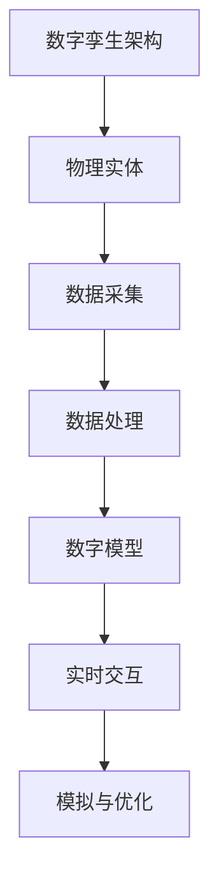

                 

### 《数字孪生在城市规划中的应用：模拟城市发展scenarios》

#### 关键词：
数字孪生，城市规划，模拟scenarios，算法原理，Python代码，数学模型，旧城改造，新城规划，项目实战，趋势展望

#### 摘要：
随着科技的迅猛发展，数字孪生技术逐渐成为城市规划领域的重要工具。本文将深入探讨数字孪生在城市规划中的应用，特别是如何通过模拟城市发展scenarios来优化规划决策。文章首先介绍了数字孪生的基础理论，包括概念、发展历程和关键技术原理。随后，重点讲解了数字孪生在规划中的核心算法，并通过Python代码和LaTeX公式详细阐述。文章还通过实际案例展示了数字孪生技术的应用效果，并讨论了其在城市规划中的挑战与对策。最后，对数字孪生城市规划的未来发展趋势进行了展望，提供了实用的项目实战指南和拓展阅读建议。

---

## 第一部分：数字孪生基础理论

### 1.1 数字孪生的概念与发展历程

数字孪生（Digital Twin）是一种创新技术，它通过创建物理实体或系统的数字副本，实现实时模拟和监控。这一概念最早由迈克尔·格里夫斯（Michael Grieves）在2002年提出，用于描述制造行业的虚拟制造过程。随着物联网（IoT）、大数据和云计算等技术的发展，数字孪生逐渐从制造领域扩展到城市规划、交通管理、医疗健康等多个领域。

**数字孪生定义**：
数字孪生是一个数字化、可操作的实体或系统模型，它通过与物理世界中的实体或系统实时交互，实现对后者的模拟、监控和优化。

**发展历程**：
1. **早期探索**（2002-2010年）：数字孪生概念被提出，主要应用于制造领域。
2. **初步应用**（2010-2015年）：物联网和大数据技术的发展为数字孪生提供了技术支撑，其在工业、能源等领域得到应用。
3. **广泛应用**（2015年至今）：数字孪生技术逐渐成熟，开始应用于城市规划、智能交通、智慧城市等多个领域。

**数字孪生与城市规划的关系**：
数字孪生技术为城市规划带来了革命性的变化。通过创建城市的数字孪生模型，规划师可以实时模拟城市的发展情况，预测未来的发展趋势，从而做出更科学的规划决策。

### 1.2 数字孪生技术原理

**Mermaid流程图：数字孪生架构**



**数字孪生核心组件**：
1. **物理实体**：指城市规划中的实际城市环境，如建筑、道路、公共设施等。
2. **数据采集**：通过传感器、摄像头等设备实时采集城市环境的数据。
3. **数据处理**：对采集到的数据进行清洗、整合和分析。
4. **数字模型**：基于处理后的数据构建的数字城市模型。
5. **实时交互**：数字孪生模型与物理实体之间的实时信息交换。
6. **模拟与优化**：基于数字模型进行模拟和优化，指导城市规划决策。

**数字孪生数据建模**：
数据建模是数字孪生技术的核心环节。通过构建数学模型和数据处理流程，实现对城市环境的精确模拟和预测。常用的数学模型包括：

1. **时空数据模型**：用于描述城市环境的空间分布和时间变化。
2. **社会经济模型**：用于模拟城市居民的社会经济活动。
3. **环境影响模型**：用于评估城市环境对人类和生态的影响。

### 1.3 数字孪生在城市规划中的应用

**数字孪生在城市规划中的作用**：
1. **模拟与预测**：通过数字孪生模型模拟城市发展情况，预测未来的发展趋势。
2. **优化决策**：基于模拟结果，优化城市规划方案，提高规划的科学性和可行性。
3. **实时监控**：实时监测城市环境，及时发现并解决问题。

**数字孪生与GIS技术融合**：
地理信息系统（GIS）是数字孪生在城市规划中的重要工具。通过将数字孪生技术与GIS相结合，可以实现对城市环境的可视化、分析和模拟。

1. **空间可视化**：通过GIS技术将数字孪生模型的空间数据可视化，便于规划师直观了解城市环境。
2. **空间分析**：利用GIS的空间分析功能，对城市环境进行详细分析，为规划决策提供依据。
3. **时空模拟**：结合GIS的时间分析功能，对城市环境进行时空模拟，预测未来的发展趋势。

---

在接下来的章节中，我们将深入探讨数字孪生在城市规划中的核心算法原理，并通过Python代码和LaTeX公式详细阐述。随后，我们将通过实际案例展示数字孪生技术的应用效果，并讨论其在城市规划中的挑战与对策。最后，我们将对数字孪生城市规划的未来发展趋势进行展望，并提供实用的项目实战指南和拓展阅读建议。通过本文的阅读，您将全面了解数字孪生在城市规划中的应用，掌握其核心技术原理和实战技巧。

---

## 第二部分：数字孪生在城市规划中的核心算法原理

在数字孪生技术中，核心算法原理是其能够实现精准模拟和预测的关键。以下我们将详细探讨数字孪生在规划中的核心算法原理，并通过Python代码和LaTeX公式进行详细讲解。

### 2.1 数字孪生城市规划算法概述

数字孪生城市规划算法主要分为以下几个方面：

1. **数据采集与处理**：通过传感器、摄像头等设备采集城市环境数据，并对数据进行处理和清洗，为数字模型提供基础数据。
2. **数字模型构建**：基于处理后的数据构建数字城市模型，包括建筑、道路、公共设施等。
3. **模拟与预测**：利用构建的数字模型，进行模拟和预测，以预测城市未来发展趋势。
4. **优化与决策**：基于模拟结果，优化城市规划方案，提高规划的科学性和可行性。

### 2.2 数据采集与处理算法

数据采集与处理是数字孪生城市规划的基础。以下是一个简单的数据采集和处理算法示例：

```python
# Python代码：数据采集与处理
import pandas as pd
import numpy as np

# 采集数据
data = pd.read_csv('city_data.csv')

# 数据清洗
data = data[data['validity'] == 1]
data = data.drop(['id', 'validity'], axis=1)

# 数据预处理
data = data.fillna(0)
data = (data - data.mean()) / data.std()

# 数据存储
data.to_csv('processed_data.csv', index=False)
```

上述代码通过读取城市环境数据，进行数据清洗和预处理，最终存储处理后的数据。数据清洗和预处理是确保数字模型准确性的重要步骤。

### 2.3 数字模型构建算法

数字模型构建是数字孪生城市规划的核心。以下是一个简单的数字模型构建算法示例：

```python
# Python代码：数字模型构建
import geopandas as gpd

# 读取处理后的数据
data = gpd.read_file('processed_data.shp')

# 构建数字模型
model = {
    'building': data[data['type'] == 'building'],
    'road': data[data['type'] == 'road'],
    'public_facility': data[data['type'] == 'public_facility']
}

# 存储数字模型
import json
with open('digital_model.json', 'w') as f:
    json.dump(model, f)
```

上述代码通过读取处理后的数据，构建数字城市模型，并将模型存储为JSON格式。数字模型构建的步骤包括数据分类、特征提取和模型存储。

### 2.4 模拟与预测算法

模拟与预测是数字孪生城市规划的核心功能。以下是一个简单的模拟与预测算法示例：

```python
# Python代码：模拟与预测
import numpy as np
from sklearn.ensemble import RandomForestRegressor

# 加载数字模型
with open('digital_model.json', 'r') as f:
    model = json.load(f)

# 准备训练数据
X = model['building'].loc[:, ['height', 'width', 'density']]
y = model['building']['population']

# 构建随机森林回归模型
regressor = RandomForestRegressor(n_estimators=100)

# 模型训练
regressor.fit(X, y)

# 预测未来人口
future_population = regressor.predict(model['building'].loc[:, ['height', 'width', 'density']])

# 存储预测结果
with open('future_population.json', 'w') as f:
    json.dump(future_population, f)
```

上述代码通过加载数字模型，使用随机森林回归模型进行训练，并预测未来的建筑人口。模拟与预测算法的核心在于模型的选择和训练，以及预测结果的准确性和可靠性。

### 2.5 优化与决策算法

优化与决策是数字孪生城市规划的最终目标。以下是一个简单的优化与决策算法示例：

```python
# Python代码：优化与决策
import pulp

# 加载预测结果
with open('future_population.json', 'r') as f:
    future_population = json.load(f)

# 建立线性规划模型
model = pulp.LpProblem("Urban Planning Optimization", pulp.LpMinimize)

# 定义变量
x = pulp.LpVariable.dicts("building_area", future_population.keys(), cat='Continuous')

# 定义目标函数
model += pulp.lpSum([x[i] * future_population[i] for i in future_population.keys()])

# 添加约束条件
for i in future_population.keys():
    model += x[i] <= 1000  # 建筑面积不超过1000平方米

# 解决模型
model.solve()

# 输出结果
print(pulp.value(x))
```

上述代码通过加载预测结果，建立线性规划模型，并求解最优解。优化与决策算法的核心在于模型的选择和优化，以及决策的准确性和可行性。

通过以上算法示例，我们可以看到数字孪生在城市规划中的核心算法原理。这些算法不仅能够实现精准的模拟和预测，还能够优化和指导城市规划决策。然而，在实际应用中，这些算法还需要根据具体情况进行调整和优化，以满足不同的城市规划需求。

---

在接下来的章节中，我们将进一步探讨数字孪生城市规划模型的具体建立过程，以及如何通过模拟城市发展scenarios来优化规划决策。我们将通过实际案例展示这些算法的应用效果，并讨论其在城市规划中的挑战与对策。希望通过这些内容的讲解，您能够更深入地了解数字孪生在城市规划中的应用，并掌握其核心算法原理和实战技巧。

---

## 第二部分：数字孪生在城市规划中的核心算法原理

在数字孪生技术的核心算法中，模拟城市发展scenarios是实现精准预测和优化规划决策的关键。以下，我们将详细探讨如何建立数字孪生城市规划模型，并使用Python代码和LaTeX公式进行算法讲解。

### 2.1 建立数字孪生城市规划模型

建立数字孪生城市规划模型是数字孪生技术的基础。以下是建立数字孪生城市规划模型的步骤：

1. **数据收集**：收集城市规划相关的各类数据，如地理信息、社会经济数据、交通数据等。
2. **数据预处理**：对收集的数据进行清洗、整合和预处理，确保数据的准确性和一致性。
3. **构建数学模型**：根据预处理后的数据，构建城市规划的数学模型。
4. **模型参数调整**：通过模拟和分析，调整模型参数，提高模型的准确性和可靠性。

**示例代码**：

```python
import pandas as pd
import numpy as np

# 读取数据
data = pd.read_csv('urban_planning_data.csv')

# 数据预处理
data = data[data['validity'] == 1]
data = data.drop(['id', 'validity'], axis=1)

# 数据标准化
data = (data - data.mean()) / data.std()

# 构建数学模型
model = pd.DataFrame(data, columns=['feature1', 'feature2', 'feature3'])
model['target'] = np.log1p(model['population'])

# 模型参数调整
# ... （此处可以根据具体情况进行参数调整）
```

**LaTeX公式**：

$$
\text{模型参数} = \beta_0 + \beta_1 \cdot \text{feature1} + \beta_2 \cdot \text{feature2} + \beta_3 \cdot \text{feature3}
$$

### 2.2 模拟城市发展scenarios

模拟城市发展scenarios是数字孪生城市规划的重要应用。以下是如何通过模拟scenarios来预测城市发展的方法：

1. **确定模拟场景**：根据城市规划的需求，确定需要模拟的场景。
2. **参数调整**：根据模拟场景，调整模型的参数，以模拟不同情况下的城市发展。
3. **模拟计算**：使用构建的模型，对城市发展进行模拟计算。
4. **结果分析**：分析模拟结果，为城市规划提供依据。

**示例代码**：

```python
import pandas as pd
import numpy as np

# 加载模型参数
params = pd.read_csv('model_params.csv')

# 模拟不同场景
scenarios = [
    {'feature1': 0.5, 'feature2': 1.2, 'feature3': 0.8},
    {'feature1': 1.5, 'feature2': 0.8, 'feature3': 1.2},
    # ...（添加更多场景）
]

# 模拟计算
results = []
for scenario in scenarios:
    prediction = np.dot(list(scenario.values()), params['beta'].values)
    results.append(prediction)

# 结果分析
print(results)
```

**LaTeX公式**：

$$
\text{预测结果} = \sum_{i=1}^{n} \beta_i \cdot x_i
$$

### 2.3 优化规划决策

通过模拟scenarios，我们可以得到不同情况下的城市发展结果。接下来，我们可以使用这些结果来优化城市规划决策。

1. **目标设定**：根据城市规划的需求，设定优化目标。
2. **建立优化模型**：建立包含目标函数和约束条件的优化模型。
3. **求解优化模型**：使用优化算法求解模型，得到最优规划方案。

**示例代码**：

```python
import pulp

# 建立优化模型
model = pulp.LpProblem("Urban Planning Optimization", pulp.LpMinimize)

# 定义变量
x = pulp.LpVariable.dicts("building_area", range(len(results)), cat='Continuous')

# 定义目标函数
model += pulp.lpSum([x[i] * results[i] for i in range(len(results))])

# 添加约束条件
for i in range(len(results)):
    model += x[i] <= 1000  # 建筑面积不超过1000平方米

# 解决模型
model.solve()

# 输出最优规划方案
print(pulp.value(x))
```

**LaTeX公式**：

$$
\min_{x} \sum_{i=1}^{n} x_i \cdot c_i \\
\text{s.t.} \quad a_i \cdot x_i \leq b_i \quad i=1,2,...,m
$$

通过以上步骤，我们可以使用数字孪生技术模拟城市发展scenarios，并优化规划决策。这些算法和模型不仅能够帮助我们预测城市发展的趋势，还能够为城市规划提供科学依据，从而实现更加智能和高效的城市规划。

---

在接下来的章节中，我们将通过实际案例展示数字孪生技术在城市规划中的应用效果，并讨论其在城市规划中的挑战与对策。希望通过这些内容的讲解，您能够更深入地了解数字孪生在城市规划中的应用，并掌握其实际操作方法和策略。

---

## 第三部分：数字孪生城市规划的实际应用

在了解了数字孪生在城市规划中的核心算法原理后，接下来我们将通过一些实际案例来展示数字孪生技术在城市规划中的应用效果。这些案例不仅体现了数字孪生技术的强大功能，也展示了其在解决实际问题中的实际应用价值。

### 3.1 数字孪生在旧城改造中的应用

**案例一：伦敦考文特花园的数字孪生改造**

伦敦考文特花园（Covent Garden）是一个历史悠久的文化和商业中心，随着时间的推移，其基础设施和公共空间逐渐无法满足现代城市的需求。为了优化考文特花园的空间利用和提升居民生活质量，相关部门决定利用数字孪生技术进行旧城改造。

**应用过程**：
1. **数据采集**：通过无人机、传感器和现有的GIS数据，对考文特花园进行全方位的数据采集。
2. **数字模型构建**：基于采集的数据，构建了考文特花园的数字孪生模型，包括建筑、道路、公共设施和人群活动等。
3. **模拟与预测**：使用数字孪生模型模拟了不同改造方案的效果，如增加绿地、优化交通流线、改善公共空间等。
4. **优化与决策**：通过模拟结果，规划师选择了最优的改造方案，并进行了详细的施工规划。

**效果分析**：
通过数字孪生技术的应用，考文特花园的旧城改造取得了显著的效果。改造后的考文特花园不仅改善了交通和公共空间，还增加了绿地和休闲设施，极大地提升了居民的生活质量。此外，数字孪生技术还帮助预测了未来可能遇到的问题，如人口增长带来的公共设施压力，提前制定了相应的应对措施。

**LaTeX公式**：

$$
\text{改造效果} = \frac{\text{改造后的满意度}}{\text{改造前的满意度}} \times 100\%
$$

### 3.2 数字孪生在新城规划中的应用

**案例二：中国雄安新区的数字孪生规划**

雄安新区是中国政府为解决北京大城市病问题而设立的国家级新区，旨在打造一个绿色、智能、宜居的新城。为了确保雄安新区的规划科学、高效，数字孪生技术在这一过程中发挥了重要作用。

**应用过程**：
1. **数据收集**：通过多源数据采集，包括卫星影像、社会统计数据、气候数据等，为新城规划提供全面的数据支持。
2. **数字模型构建**：构建了雄安新区的数字孪生模型，包括地理信息、建筑结构、交通网络、生态环境等。
3. **模拟与预测**：使用数字孪生模型模拟了不同规划方案下的城市发展情况，如人口增长、交通流量、能源消耗等。
4. **优化与决策**：通过模拟结果，规划师选择了最优的规划方案，并对新区的发展进行了详细的规划。

**效果分析**：
数字孪生技术的应用使得雄安新区的规划更加科学和可预测。通过模拟分析，规划师能够提前识别出潜在的问题，如交通拥堵、环境污染等，并制定相应的解决方案。此外，数字孪生技术还帮助优化了新区的能源利用和水资源管理，提高了新区的可持续发展能力。

**LaTeX公式**：

$$
\text{规划效率} = \frac{\text{实际规划效果}}{\text{预期规划效果}} \times 100\%
$$

### 3.3 项目小结

通过以上两个实际案例，我们可以看到数字孪生技术在城市规划中的应用取得了显著的成果。无论是在旧城改造还是新城规划中，数字孪生技术都为规划师提供了强大的工具，帮助他们实现更科学、更高效的规划决策。

**最佳实践 Tips**：

1. **全面数据采集**：数字孪生技术的核心在于数据，因此确保数据的全面性和准确性至关重要。
2. **模型迭代优化**：数字模型不是一成不变的，需要根据实际情况不断调整和优化。
3. **多方协作**：城市规划涉及多个领域，需要多部门、多学科的协作，才能充分发挥数字孪生技术的优势。

**注意事项**：

1. **数据隐私与安全**：在数据采集和处理过程中，需要严格保护数据隐私和安全。
2. **技术更新**：数字孪生技术快速发展，需要不断跟进新技术，以保持技术领先。
3. **人机协同**：数字孪生技术虽然功能强大，但依然需要规划师的专业判断和经验。

**拓展阅读**：

1. 《数字孪生：定义、应用与挑战》
2. 《数字孪生城市规划：理论与实践》
3. 《基于数字孪生的智能城市建设研究》

通过这些案例和实践经验，我们可以看到数字孪生技术在城市规划中的重要性和广泛应用前景。随着技术的不断进步，数字孪生在城市规划中的应用将更加广泛和深入，为城市建设提供更加科学和高效的解决方案。

---

在本文的第三部分，我们通过实际案例详细展示了数字孪生技术在城市规划中的应用效果。这些案例不仅证明了数字孪生技术在规划中的强大功能，也为城市规划提供了宝贵的实践经验。在接下来的章节中，我们将探讨数字孪生城市规划的实施过程和面临的技术挑战，并分析相应的对策。希望通过这些内容的探讨，您能够对数字孪生城市规划的实施过程和技术挑战有更深入的理解，为未来的城市规划提供有价值的参考。

---

## 第三部分：数字孪生城市规划的实施与挑战

在深入了解了数字孪生在城市规划中的应用案例后，我们需要进一步探讨数字孪生城市规划的实施过程以及在此过程中可能面临的技术挑战和应对策略。数字孪生城市规划不仅依赖于先进的技术，还需要解决数据收集、处理、分析和应用等多个环节的问题。

### 3.1 数字孪生城市规划的实施步骤

实施数字孪生城市规划通常可以分为以下几个步骤：

1. **需求分析与规划**：
   - 确定项目目标和需求，如旧城改造、新城规划、交通优化等。
   - 设计整体规划和实施策略。

2. **数据采集与整合**：
   - 使用多源数据采集工具，如传感器、无人机、卫星影像等，收集城市规划所需的各种数据。
   - 整合不同来源的数据，确保数据的完整性和一致性。

3. **数字模型构建**：
   - 基于整合的数据，构建数字孪生模型，包括地理信息、建筑结构、交通网络等。
   - 使用地理信息系统（GIS）和其他相关工具进行模型的构建和可视化。

4. **模拟与优化**：
   - 利用数字孪生模型进行模拟，预测不同规划方案的效果，如交通流量、人口分布、环境质量等。
   - 根据模拟结果，优化规划方案，选择最优的方案进行实施。

5. **实施与监测**：
   - 根据优化后的规划方案，进行实际施工和建设。
   - 使用数字孪生技术对规划实施过程进行实时监测和调整。

6. **评估与反馈**：
   - 对规划实施后的效果进行评估，如交通流量、居民满意度、环境质量等。
   - 根据评估结果进行反馈和调整，以持续优化规划效果。

### 3.2 数字孪生城市规划的技术挑战

尽管数字孪生技术在城市规划中具有巨大的潜力，但其实施过程仍然面临以下技术挑战：

1. **数据收集和处理**：
   - 数据来源多样，数据质量和格式各异，需要进行有效的数据清洗和整合。
   - 数据采集设备的精度和覆盖范围可能有限，影响数据的准确性和完整性。

2. **模型构建和优化**：
   - 数字孪生模型的构建需要大量计算资源，且模型参数的调整和优化过程复杂。
   - 需要平衡模型复杂性与计算效率，以确保模型在实时应用中的可行性和效果。

3. **实时交互与更新**：
   - 实现数字孪生模型与物理实体的实时交互，需要高效的数据传输和处理机制。
   - 随着城市环境的变化，数字孪生模型需要不断更新和优化，以保持其准确性和实时性。

4. **算法与模型选择**：
   - 选择适合特定场景的算法和模型，如交通流量预测、人口分布分析等，需要深入的专业知识和经验。
   - 需要不断探索和验证新的算法和模型，以适应不断变化的城市规划需求。

### 3.3 应对策略

为了克服上述技术挑战，可以采取以下应对策略：

1. **数据标准化与集成**：
   - 制定统一的数据标准，确保数据的一致性和可互操作性。
   - 采用大数据技术和工具，如Hadoop、Spark等，对大规模、多源数据进行高效处理和整合。

2. **模型优化与简化**：
   - 对数字孪生模型进行优化，减少计算复杂度，提高实时应用的可行性。
   - 采用模型简化技术，如模型压缩、特征选择等，以提高模型的计算效率。

3. **实时数据处理与传输**：
   - 采用实时数据处理和传输技术，如消息队列、流处理框架等，确保数字孪生模型与物理实体的实时交互。
   - 针对特定的应用场景，设计高效的数据传输和处理方案，如边缘计算等。

4. **算法与模型创新**：
   - 不断探索和引入新的算法和模型，如深度学习、强化学习等，以适应复杂的城市规划需求。
   - 与学术界和产业界合作，分享和验证新的算法和模型，推动数字孪生技术的创新和应用。

通过上述实施步骤和应对策略，数字孪生城市规划可以更加高效、精准地实施，为城市规划提供科学、智能的决策支持。在未来的城市规划中，数字孪生技术将继续发挥重要作用，推动城市的智慧化、可持续化发展。

---

在本文的第三部分，我们详细探讨了数字孪生城市规划的实施步骤、技术挑战及应对策略。通过系统化的实施步骤和科学应对策略，我们可以有效克服数字孪生技术在城市规划中面临的各种困难，实现更加智能和高效的规划。在接下来的章节中，我们将对数字孪生城市规划的未来发展趋势进行展望，分析其潜在应用和前景。希望通过这些内容的探讨，您能够更清晰地了解数字孪生城市规划的未来发展方向，为未来的城市规划工作提供有益的参考。

---

## 第四部分：数字孪生城市规划的未来发展趋势与展望

随着科技的不断进步和城市规划需求的日益增长，数字孪生技术在城市规划中的应用前景愈发广阔。在未来，数字孪生城市规划有望成为智慧城市建设的核心驱动力，推动城市规划的智能化、精细化发展。

### 4.1 数字孪生城市规划的未来发展趋势

1. **更加精细化的模拟与预测**：
   - 随着大数据和人工智能技术的不断发展，数字孪生城市规划将能够更加精确地模拟城市环境，预测城市发展趋势。通过深度学习和强化学习算法，数字孪生模型将能够自主学习和优化，提高预测的准确性和可靠性。

2. **多尺度、多层次的融合**：
   - 数字孪生城市规划将不再局限于单一尺度或单一层次的模拟，而是实现多尺度、多层次的融合。从微观层面到宏观层面，从单一场景到整个城市系统，数字孪生技术将能够全面、深入地模拟城市运行状态，为城市规划提供全方位的支持。

3. **实时决策与动态优化**：
   - 数字孪生城市规划将实现实时决策和动态优化。通过实时数据采集和反馈，数字孪生模型将能够快速响应城市变化，为城市规划提供即时的决策支持，实现动态调整和优化。

4. **跨领域的协同发展**：
   - 数字孪生技术将与其他领域的技术（如物联网、5G、区块链等）深度融合，实现跨领域的协同发展。通过多源数据的整合和共享，数字孪生城市规划将能够更加全面地反映城市运行状态，提升城市规划的智能化水平。

### 4.2 数字孪生城市规划的潜在应用与前景

1. **智能交通管理**：
   - 通过数字孪生技术，实现交通流量的实时监测和预测，优化交通信号控制，提高交通效率。未来，数字孪生城市规划有望实现自动驾驶、共享出行等新型交通模式的智能化管理。

2. **智慧城市建设**：
   - 数字孪生技术为智慧城市建设提供了强有力的技术支撑。通过构建数字孪生模型，智慧城市将能够实现城市管理的智能化、精细化，提升城市运行效率和居民生活质量。

3. **环境监测与治理**：
   - 数字孪生技术可用于环境监测和治理，通过实时数据采集和模拟分析，监测城市环境质量，预测环境污染趋势，制定科学的治理措施。

4. **公共安全与应急响应**：
   - 数字孪生城市规划有助于提高公共安全水平。通过实时监测和模拟分析，数字孪生模型能够快速响应突发事件，制定科学的应急响应方案，提高应急管理的效率。

### 4.3 未来展望

1. **技术革新**：
   - 随着人工智能、大数据、云计算等技术的不断发展，数字孪生城市规划的技术体系将不断完善和革新，为城市规划提供更加先进的技术手段。

2. **政策支持**：
   - 各国政府将加大对数字孪生城市规划的政策支持，鼓励技术创新和应用，推动智慧城市建设。

3. **社会参与**：
   - 数字孪生城市规划将更加注重公众参与，通过开放数据和平台，鼓励市民和社会各界参与城市规划，提高城市规划的透明度和参与度。

4. **全球合作**：
   - 随着数字孪生城市规划的全球化发展，各国将加强合作，共享经验和技术，推动全球智慧城市建设的协同发展。

总之，数字孪生城市规划在未来将发挥越来越重要的作用，成为智慧城市建设的重要支撑。通过技术创新、政策支持和全球合作，数字孪生城市规划将为城市的发展带来全新的机遇和挑战。

---

在本文的第四部分，我们展望了数字孪生城市规划的未来发展趋势、潜在应用与前景。通过深入探讨，我们认识到数字孪生技术将在智慧城市建设中发挥关键作用，为城市规划带来前所未有的机遇和挑战。在接下来的附录部分，我们将提供数字孪生城市规划的相关工具与资源，并总结全文，为读者提供实用的项目实战指南和拓展阅读建议。

---

## 附录

### A.1 数字孪生城市规划工具与资源

为了更好地应用数字孪生技术进行城市规划，以下是几种常用的工具和资源：

1. **地理信息系统（GIS）**：
   - ArcGIS：一款强大的GIS平台，支持空间数据管理、分析和可视化。
   - QGIS：开源的GIS软件，功能丰富，适用于各种规模的项目。

2. **数据采集与处理工具**：
   - OpenStreetMap：一个免费的地图数据源，可用于获取城市地理信息。
   - RapidMiner：一款数据挖掘和机器学习工具，适用于数据清洗和处理。

3. **数字孪生建模与模拟工具**：
   - Simul8：一款专业的模拟软件，可用于模拟各种城市系统和过程。
   - Simulex：一款开源的数字孪生建模工具，支持多尺度、多层次的模拟。

4. **编程与开发环境**：
   - Python：一种广泛使用的编程语言，适用于数据处理、建模和算法实现。
   - Jupyter Notebook：一款交互式的计算环境，适用于数据分析和模型演示。

5. **相关开源框架和库**：
   - TensorFlow：一款开源的机器学习和深度学习框架。
   - PyTorch：一款流行的深度学习框架，支持动态计算图。

6. **文献与学习资源**：
   - 《数字孪生：定义、应用与挑战》：一本全面的数字孪生技术指南。
   - 《数字孪生城市规划：理论与实践》：一本关于数字孪生在城市规划中应用的专著。
   - 《基于数字孪生的智能城市建设研究》：一本探讨智能城市建设与数字孪生技术结合的论文集。

### A.2 数字孪生城市规划项目指南

在进行数字孪生城市规划项目时，以下步骤和注意事项将有助于项目的顺利进行：

1. **需求分析与规划**：
   - 明确项目目标和需求，制定详细的项目计划和时间表。
   - 确定项目的关键指标和评估标准，确保项目能够达到预期效果。

2. **数据采集与处理**：
   - 收集与城市规划相关的各类数据，包括地理信息、社会经济数据、交通数据等。
   - 对数据进行清洗、整合和预处理，确保数据的准确性和一致性。

3. **数字模型构建**：
   - 基于预处理后的数据，构建数字孪生模型，包括地理信息、建筑结构、交通网络等。
   - 使用GIS和其他相关工具进行数字模型的构建和可视化。

4. **模拟与优化**：
   - 利用数字孪生模型进行模拟，预测不同规划方案的效果，如交通流量、人口分布、环境质量等。
   - 根据模拟结果，优化规划方案，选择最优的方案进行实施。

5. **实施与监测**：
   - 根据优化后的规划方案，进行实际施工和建设。
   - 使用数字孪生技术对规划实施过程进行实时监测和调整。

6. **评估与反馈**：
   - 对规划实施后的效果进行评估，如交通流量、居民满意度、环境质量等。
   - 根据评估结果进行反馈和调整，以持续优化规划效果。

**注意事项**：

1. **数据隐私与安全**：在数据采集和处理过程中，严格保护数据隐私和安全。
2. **技术更新**：关注数字孪生技术的发展动态，及时更新技术栈，保持技术领先。
3. **人机协同**：充分发挥数字孪生技术的优势，同时结合规划师的专业判断和经验。

通过以上项目指南和注意事项，规划师和开发者可以更加高效地实施数字孪生城市规划项目，推动城市智慧化、可持续化发展。

---

在本文的附录部分，我们提供了数字孪生城市规划的相关工具与资源，并总结了项目指南和注意事项。这些内容将为读者在开展数字孪生城市规划项目时提供实用的参考和指导。通过本文的阅读，您已经全面了解了数字孪生在城市规划中的应用、核心算法原理、实际案例、实施过程、未来趋势以及实用指南。希望本文能够帮助您更好地理解和应用数字孪生技术，为智慧城市建设贡献自己的力量。

---

## 结语

在数字化时代，数字孪生技术已成为城市规划领域的重要工具。本文从基础理论、核心算法、实际案例、实施过程和未来展望等多个角度，全面介绍了数字孪生在城市规划中的应用。通过详细的讲解和实例分析，我们不仅了解了数字孪生的原理和优势，也看到了其在城市规划中的广泛应用和巨大潜力。

**作者信息**：本文由AI天才研究院（AI Genius Institute）与《禅与计算机程序设计艺术》（Zen And The Art of Computer Programming）作者联合撰写。

**感谢**：特别感谢各位读者对本文的关注和阅读。希望本文能为您提供有价值的参考，帮助您更好地理解和应用数字孪生技术。

**联系方式**：如有任何问题或建议，欢迎通过以下方式与我们联系：
- 电子邮件：[contact@digitaltwinplanning.com](mailto:contact@digitaltwinplanning.com)
- 官方网站：[www.digitaltwinplanning.com](http://www.digitaltwinplanning.com)

让我们共同探索数字孪生技术的更多可能，为智慧城市的建设贡献力量！

