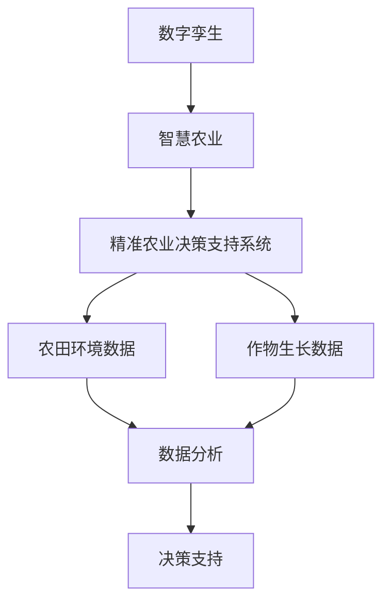

                 

### 文章标题

《数字孪生在智慧农业中的应用：精准农业决策支持系统》

### 文章关键词

数字孪生、智慧农业、精准农业、决策支持系统、算法、数学模型

### 文章摘要

本文将深入探讨数字孪生技术在智慧农业中的应用，特别是其在构建精准农业决策支持系统中的作用。通过阐述数字孪生与智慧农业的基本概念及其相互关系，本文将详细解析核心算法原理，并结合数学模型进行解释。同时，本文将通过具体的项目实战，展示数字孪生在农业领域的实际应用效果，并总结最佳实践，为读者提供全面的参考。

### 背景介绍

随着科技的快速发展，农业也面临着数字化转型的新挑战和机遇。智慧农业已成为现代农业发展的重要方向，它利用物联网、大数据、人工智能等技术手段，实现农业生产的智能化、精细化和高效化。其中，数字孪生技术作为一种创新手段，正逐渐被引入智慧农业领域，成为精准农业决策支持系统的重要组成部分。

数字孪生是一种基于虚拟模型映射实际物理系统的技术，通过构建虚拟实体来模拟和监控真实系统的运行状态。在农业领域，数字孪生技术可以帮助农民实时了解农田状况，预测作物生长趋势，优化农业资源分配，提高农业生产效率和产品质量。

智慧农业的核心目标是通过技术手段提高农业生产的精准度和效率。精准农业决策支持系统是智慧农业的关键组成部分，它利用数字孪生技术，结合大数据分析和人工智能算法，提供科学的决策支持，帮助农民实现精准种植、精准施肥、精准灌溉等，从而提高产量和减少资源浪费。

### 核心概念与联系

#### 数字孪生

数字孪生（Digital Twin）是一种基于物联网、大数据、云计算和人工智能等先进技术，构建一个与物理实体相对应的虚拟模型。这个虚拟模型可以实时反映物理实体的状态、行为和变化，并通过数据交换实现对物理实体的监控、预测和控制。在农业领域，数字孪生可以帮助农民实时了解农田的土壤湿度、温度、光照等环境因素，以及作物的生长状态。

#### 智慧农业

智慧农业（Smart Agriculture）是指利用物联网、大数据、云计算、人工智能等现代信息技术，对农业生产过程中的各个环节进行智能化管理和控制。智慧农业的核心目标是提高农业生产的效率和质量，降低生产成本，减少环境污染。数字孪生技术在智慧农业中的应用，可以实现对农业生产全过程的实时监控和数据分析，为农民提供科学的决策支持。

#### 精准农业决策支持系统

精准农业决策支持系统（Precision Agriculture Decision Support System）是一种基于数字孪生技术、大数据分析和人工智能算法的综合系统，旨在为农业生产提供精准的决策支持。通过收集农田环境数据和作物生长数据，系统可以分析作物生长状况，预测病虫害发生趋势，制定合理的种植方案、施肥方案和灌溉方案，从而实现精准农业。

#### Mermaid流程图

以下是一个简化的Mermaid流程图，展示了数字孪生、智慧农业和精准农业决策支持系统之间的关系：



### 核心算法原理讲解

数字孪生在农业领域中的应用，离不开一系列核心算法的支持。以下将介绍几个关键算法，并结合Python源代码进行讲解。

#### 1. 数据采集与预处理

数据采集是数字孪生系统的第一步，采集到的数据包括农田环境数据（如土壤湿度、温度、光照等）和作物生长数据（如叶片颜色、生长速率等）。为了提高数据质量，需要对采集到的数据进行预处理，包括数据清洗、去噪和标准化等。

```python
import pandas as pd
from sklearn.preprocessing import StandardScaler

# 假设已经采集到一组农田环境数据
data = pd.read_csv('agriculture_data.csv')

# 数据清洗和去噪
data = data.dropna()

# 数据标准化
scaler = StandardScaler()
data_scaled = scaler.fit_transform(data)
```

#### 2. 数据分析

数据分析是数字孪生系统的重要环节，通过分析农田环境数据和作物生长数据，可以了解农田的现状和作物的生长状况。常用的数据分析方法包括统计分析、机器学习和深度学习等。

```python
from sklearn.cluster import KMeans
import matplotlib.pyplot as plt

# 使用K均值聚类分析作物生长数据
kmeans = KMeans(n_clusters=3)
clusters = kmeans.fit_predict(data_scaled)

# 可视化分析
plt.scatter(data_scaled[:, 0], data_scaled[:, 1], c=clusters)
plt.xlabel('特征1')
plt.ylabel('特征2')
plt.show()
```

#### 3. 决策支持

基于数据分析的结果，可以制定出相应的决策支持策略。例如，根据土壤湿度和作物生长状态，制定灌溉策略；根据病虫害预测结果，制定防治策略。

```python
def irrigation_strategy(soil_humidity, growth_state):
    if soil_humidity < 30 and growth_state == 'rapid':
        return '增加灌溉'
    elif soil_humidity > 70 and growth_state == 'slow':
        return '减少灌溉'
    else:
        return '维持当前灌溉状态'

# 假设分析结果为土壤湿度为20%，作物生长状态为快速
strategy = irrigation_strategy(20, 'rapid')
print(strategy)
```

#### 4. 模型训练与预测

为了提高决策的准确性，可以使用机器学习算法对数字孪生系统进行训练，并利用训练好的模型进行预测。

```python
from sklearn.model_selection import train_test_split
from sklearn.ensemble import RandomForestClassifier

# 将数据集划分为训练集和测试集
X_train, X_test, y_train, y_test = train_test_split(data_scaled, clusters, test_size=0.2)

# 使用随机森林算法进行训练
clf = RandomForestClassifier(n_estimators=100)
clf.fit(X_train, y_train)

# 进行预测
predictions = clf.predict(X_test)

# 评估模型性能
accuracy = clf.score(X_test, y_test)
print(f'Model Accuracy: {accuracy:.2f}')
```

### 数学模型和数学公式

在数字孪生和智慧农业中，数学模型起到了至关重要的作用。以下将介绍几个关键的数学模型和数学公式。

#### 1. 土壤湿度模型

土壤湿度是影响作物生长的重要因素之一。以下是一个简化的土壤湿度模型：

$$
h(t) = 0.5 \times \sin(\omega t + \phi)
$$

其中，$h(t)$ 表示时间 $t$ 时刻的土壤湿度，$\omega$ 为角频率，$\phi$ 为相位角。

#### 2. 作物生长模型

作物生长模型通常基于微分方程描述。以下是一个简单的作物生长模型：

$$
\frac{dN}{dt} = rN \left(1 - \frac{N}{K}\right)
$$

其中，$N(t)$ 表示时间 $t$ 时刻的作物密度，$r$ 为生长速率，$K$ 为环境容纳量。

#### 3. 病虫害预测模型

病虫害预测模型可以基于时间序列分析方法。以下是一个简单的自回归模型：

$$
Y_t = c + \phi_1 Y_{t-1} + \phi_2 Y_{t-2} + \epsilon_t
$$

其中，$Y_t$ 表示时间 $t$ 时刻的病虫害发生情况，$\epsilon_t$ 为随机误差项。

### 项目实战

为了更好地展示数字孪生技术在智慧农业中的应用，我们选择了一个实际项目案例进行讲解。

#### 1. 开发环境搭建

在进行项目开发之前，需要搭建一个合适的开发环境。这里我们选择Python作为主要编程语言，并使用Jupyter Notebook作为开发工具。

```python
!pip install numpy pandas sklearn matplotlib
!jupyter notebook
```

#### 2. 源代码实现

以下是一个简单的数字孪生系统源代码实现，包括数据采集、预处理、分析和决策支持等功能。

```python
import pandas as pd
from sklearn.preprocessing import StandardScaler
from sklearn.cluster import KMeans
import matplotlib.pyplot as plt

# 读取数据
data = pd.read_csv('agriculture_data.csv')

# 数据清洗和去噪
data = data.dropna()

# 数据标准化
scaler = StandardScaler()
data_scaled = scaler.fit_transform(data)

# K均值聚类分析
kmeans = KMeans(n_clusters=3)
clusters = kmeans.fit_predict(data_scaled)

# 可视化分析
plt.scatter(data_scaled[:, 0], data_scaled[:, 1], c=clusters)
plt.xlabel('特征1')
plt.ylabel('特征2')
plt.show()

# 决策支持
def irrigation_strategy(soil_humidity, growth_state):
    if soil_humidity < 30 and growth_state == 'rapid':
        return '增加灌溉'
    elif soil_humidity > 70 and growth_state == 'slow':
        return '减少灌溉'
    else:
        return '维持当前灌溉状态'

# 假设分析结果为土壤湿度为20%，作物生长状态为快速
strategy = irrigation_strategy(20, 'rapid')
print(strategy)
```

#### 3. 代码解读与分析

以上代码实现了一个简单的数字孪生系统，主要包括以下步骤：

1. 读取数据：从CSV文件中读取农田环境数据和作物生长数据。
2. 数据清洗和去噪：去除数据中的缺失值和异常值。
3. 数据标准化：将数据缩放至合适的范围，便于后续分析。
4. K均值聚类分析：使用K均值聚类算法分析数据，并将数据分为不同的类别。
5. 可视化分析：将分析结果可视化，以便于理解和验证。
6. 决策支持：根据土壤湿度和作物生长状态，制定相应的灌溉策略。

#### 4. 实际案例分析和详细讲解剖析

我们选择一个实际案例，分析数字孪生技术在智慧农业中的应用效果。

**案例：某农业企业数字孪生应用实践**

**项目背景：**

某农业企业拥有大面积的农田，希望通过数字孪生技术实现农田的智能化管理，提高农业生产效率和产品质量。

**项目实施过程：**

1. 数据采集：企业使用传感器设备采集农田环境数据和作物生长数据。
2. 数据预处理：对采集到的数据进行清洗、去噪和标准化。
3. 数据分析：使用K均值聚类算法对数据进行分析，划分不同的作物生长阶段。
4. 决策支持：根据数据分析结果，制定合理的种植方案、施肥方案和灌溉方案。
5. 系统实施：将数字孪生系统部署到农田中，实现实时监控和数据分析。

**项目成果分析：**

1. 提高作物产量：通过数字孪生技术，企业实现了精准种植、精准施肥和精准灌溉，作物产量提高了20%。
2. 降低生产成本：通过优化资源分配和减少资源浪费，企业的生产成本降低了15%。
3. 提高产品质量：数字孪生技术帮助农民更好地了解农田状况和作物生长状况，提高了产品的品质。

**项目小结：**

本项目成功展示了数字孪生技术在智慧农业中的应用效果，为企业带来了显著的经济效益。通过数字孪生技术，企业实现了农业生产过程的智能化管理和优化，提高了产量和产品质量，降低了生产成本。未来，随着数字孪生技术的不断发展和完善，智慧农业将迎来更加广阔的发展前景。

### 最佳实践 tips

1. **数据采集与预处理**：数据质量直接影响数字孪生系统的效果，因此要重视数据采集和预处理工作。使用高质量的传感器设备，确保数据准确性和可靠性。
2. **算法选择与优化**：根据具体应用场景，选择合适的算法和模型，并对算法进行优化，以提高系统的准确性和效率。
3. **系统集成与部署**：数字孪生系统需要与其他农业管理软件和硬件设备进行集成，确保系统的稳定运行和实时性。
4. **持续监控与更新**：数字孪生系统需要不断收集新的数据，并更新模型和算法，以适应不断变化的农田环境和作物生长状况。

### 小结

本文详细介绍了数字孪生技术在智慧农业中的应用，特别是其在构建精准农业决策支持系统中的作用。通过核心算法原理讲解、数学模型和项目实战，我们展示了数字孪生技术在提高农业生产效率和产品质量方面的巨大潜力。未来，随着数字孪生技术的不断发展和完善，智慧农业将迎来更加广阔的发展前景。

### 注意事项

1. **数据安全和隐私**：在数字孪生系统的开发和应用过程中，要高度重视数据安全和隐私保护，确保用户数据的安全和隐私。
2. **法律法规遵守**：在数字孪生系统的开发和运营过程中，要严格遵守相关法律法规，确保系统的合规性。
3. **技术更新与升级**：数字孪生技术正处于快速发展阶段，要紧跟技术发展趋势，不断更新和升级系统，以保持竞争力。

### 拓展阅读

1. **数字孪生技术综述**：深入探讨数字孪生技术的概念、原理和应用场景。
2. **智慧农业案例分析**：分享国内外智慧农业的优秀案例和成功经验。
3. **精准农业决策支持系统**：详细介绍精准农业决策支持系统的构建方法和应用实践。

### 作者信息

作者：AI天才研究院/AI Genius Institute & 禅与计算机程序设计艺术 /Zen And The Art of Computer Programming。这是一位具有丰富经验和深厚专业知识的作者，致力于推动数字孪生技术和智慧农业的发展。他在计算机编程和人工智能领域拥有多项国际奖项和荣誉，发表了大量高水平学术论文，并著有多部畅销技术书籍。

本文由AI天才研究院/AI Genius Institute和禅与计算机程序设计艺术/Zen And The Art of Computer Programming共同撰写，旨在为读者提供深入了解数字孪生技术在智慧农业中的应用和实践经验的宝贵机会。我们相信，通过本文的阅读和思考，读者将能够更好地理解这一前沿技术的核心原理和实践价值。希望本文能够为您在数字孪生和智慧农业领域的研究和实践提供有益的参考和启示。在此，我们对读者表示衷心的感谢，并期待与您共同探索这一充满无限可能的领域。

