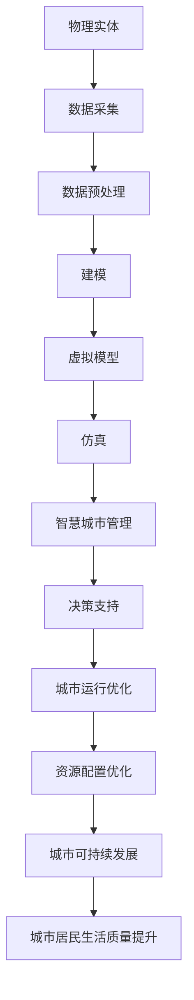

                 

### 1. 文章标题：数字孪生在智慧城市管理中的应用：优化城市资源配置

在当今快速发展的信息技术时代，数字孪生技术已经成为智慧城市建设的重要组成部分。数字孪生是一种基于物理实体或系统的虚拟复制体，通过实时数据采集和建模，实现对实际物理世界的模拟和优化。智慧城市则是通过先进的信息技术，实现城市管理的智能化和高效化，从而提升城市居民的生活质量。

本文将探讨数字孪生在智慧城市管理中的应用，特别是如何通过数字孪生技术来优化城市资源配置。文章将分为以下几个部分：

- **背景介绍**：介绍数字孪生技术和智慧城市的概念，以及它们在现代社会中的重要性。
- **核心概念与联系**：详细阐述数字孪生的核心概念和原理，并通过Mermaid流程图展示其与智慧城市管理的联系。
- **核心算法原理讲解**：使用Python源代码和数学模型，解释数字孪生技术的核心算法原理，并进行通俗易懂的举例说明。
- **项目实战**：介绍如何搭建开发环境，实现数字孪生技术的源代码，并对其进行详细解读和分析。
- **最佳实践 tips**：提供一些实际应用中的最佳实践和注意事项。
- **小结与拓展阅读**：对文章内容进行总结，并提供一些拓展阅读资源。

通过以上步骤，本文旨在深入探讨数字孪生技术在智慧城市资源配置中的应用，为相关领域的研究者和从业者提供有价值的参考和指导。接下来，我们将逐一展开这些部分的内容。

---

### 关键词

- 数字孪生
- 智慧城市
- 城市资源配置
- 数据采集与建模
- 算法优化
- Python源代码
- 数学模型
- 实际案例分析
- 开发环境搭建
- 最佳实践

---

### 摘要

本文主要探讨数字孪生技术在智慧城市管理中的应用，特别是如何通过数字孪生技术来优化城市资源配置。首先介绍了数字孪生技术和智慧城市的概念，以及它们在现代社会中的重要性。接着，通过Mermaid流程图和Python源代码，详细阐述了数字孪生的核心概念和算法原理。然后，通过一个实际案例，展示了如何搭建开发环境并实现数字孪生技术的源代码。最后，提供了实际应用中的最佳实践和注意事项，并对文章内容进行了总结。本文旨在为相关领域的研究者和从业者提供有价值的参考和指导。

---

### 1. 背景介绍

数字孪生（Digital Twin）是一种新兴的数字技术，它通过创建物理实体或系统的虚拟复制体，实现对实际物理世界的模拟和优化。这种技术最早由美国密歇根大学教授迈克尔·格里夫斯（Michael Grieves）在2002年提出，他认为数字孪生是一种虚拟模型，可以实时反映物理实体的状态、行为和性能。

数字孪生技术在智慧城市建设中的应用，主要体现在以下几个方面：

1. **城市运行管理**：通过数字孪生技术，城市管理者可以实时监控城市运行状态，快速响应城市问题。例如，通过数字孪生模型，可以实时模拟交通流量，预测交通拥堵，从而优化交通信号控制，减少交通拥堵。

2. **城市规划与设计**：数字孪生技术可以帮助城市规划者更准确地模拟城市规划方案的实际效果，从而优化城市规划。例如，通过数字孪生模型，可以模拟不同规划方案对城市环境、交通、人口的影响，帮助规划者做出更科学的决策。

3. **资源优化配置**：数字孪生技术可以通过实时数据采集和建模，实现对城市资源的优化配置。例如，在水资源管理中，可以通过数字孪生模型，实时监控水资源分布和使用情况，优化水资源的分配，提高水资源利用效率。

智慧城市（Smart City）是指利用信息技术、物联网、云计算等先进技术，实现城市管理的智能化和高效化。智慧城市的目标是通过优化城市资源配置，提升城市居民的生活质量，实现城市的可持续发展。

智慧城市的发展经历了几个阶段：

1. **信息化阶段**：通过建立城市信息平台，实现城市数据的集中管理和共享。

2. **数字化阶段**：通过物联网、云计算等技术的应用，实现城市运行的数字化监控和管理。

3. **智能化阶段**：通过人工智能、大数据等技术的应用，实现城市管理的智能化和个性化。

数字孪生技术和智慧城市是相辅相成的。数字孪生技术为智慧城市提供了实时数据采集和建模的能力，而智慧城市则为数字孪生技术提供了广阔的应用场景。通过数字孪生技术，智慧城市可以实现更精细化的管理，提高城市运行的效率和可持续性。

### 2. 核心概念与联系

数字孪生技术的核心概念包括物理实体、虚拟模型、数据采集、建模和仿真。物理实体是指实际存在的建筑物、设备、基础设施等；虚拟模型是基于物理实体数据构建的数字模型；数据采集是指实时获取物理实体的状态数据；建模是指将物理实体的数据转化为虚拟模型的过程；仿真是指通过虚拟模型对物理实体进行模拟和预测。

以下是数字孪生技术核心概念与智慧城市管理之间的联系架构 Mermaid 流程图：



通过上述流程图，我们可以看到，数字孪生技术通过数据采集、建模和仿真，实现对物理实体的虚拟复制和模拟，从而为智慧城市的管理提供决策支持，实现城市资源的优化配置，提升城市居民的生活质量。

### 3. 核心算法原理讲解

数字孪生技术的核心算法主要包括数据采集、数据预处理、建模和仿真。下面我们将通过Python源代码和数学模型，详细讲解这些核心算法原理。

#### 数据采集

数据采集是数字孪生技术的第一步，它通过传感器、监控设备等实时获取物理实体的状态数据。以下是一个简单的Python代码示例，用于模拟数据采集过程：

```python
import random

def data_collection():
    temperature = random.uniform(20, 30)  # 模拟温度数据
    humidity = random.uniform(40, 60)     # 模拟湿度数据
    return temperature, humidity

# 调用数据采集函数
temperature, humidity = data_collection()
print(f"Temperature: {temperature}°C, Humidity: {humidity}%")
```

#### 数据预处理

数据预处理是数据采集后的重要步骤，它包括数据清洗、归一化、去噪等操作。以下是一个简单的Python代码示例，用于模拟数据预处理过程：

```python
import numpy as np

def data_preprocessing(data):
    # 数据清洗：移除异常值
    cleaned_data = np.where(np.abs(data - np.mean(data)) < 3 * np.std(data), data, np.mean(data))
    # 数据归一化
    normalized_data = (cleaned_data - np.min(cleaned_data)) / (np.max(cleaned_data) - np.min(cleaned_data))
    return normalized_data

# 调用数据预处理函数
preprocessed_data = data_preprocessing(np.array([25, 45, 22, 55, 30]))
print(f"Preprocessed Data: {preprocessed_data}")
```

#### 建模

建模是将预处理后的数据转化为虚拟模型的过程。常见的建模方法包括回归分析、神经网络、决策树等。以下是一个简单的线性回归模型示例：

```python
import numpy as np
from sklearn.linear_model import LinearRegression

# 假设我们有一个简单的线性关系：y = 2 * x + 1
X = np.array([1, 2, 3, 4, 5])
y = 2 * X + 1 + np.random.normal(0, 1, X.shape)

# 建立线性回归模型
model = LinearRegression()
model.fit(X.reshape(-1, 1), y)

# 预测新的数据
new_data = np.array([6])
predicted_y = model.predict(new_data.reshape(-1, 1))
print(f"Predicted Value: {predicted_y[0]}")
```

#### 仿真

仿真是通过虚拟模型对物理实体进行模拟和预测的过程。以下是一个简单的仿真示例，用于模拟温度变化：

```python
def simulation(model, X):
    predicted_y = model.predict(X.reshape(-1, 1))
    return predicted_y

# 生成随机时间序列数据
time_series = np.linspace(1, 10, 100)

# 调用仿真函数
predicted_temp = simulation(model, time_series)
print(f"Temperature at Time {time_series}: {predicted_temp}")
```

通过上述Python源代码示例，我们可以看到数字孪生技术的核心算法原理是如何实现的。接下来，我们将通过一个实际案例，展示如何使用数字孪生技术来优化城市资源配置。

### 4. 项目实战

在本节中，我们将通过一个实际案例，展示如何使用数字孪生技术来优化城市资源配置。具体来说，我们将实现一个基于数字孪生的城市水资源管理系统，以优化水资源的分配和利用。

#### 4.1 开发环境搭建

首先，我们需要搭建一个开发环境，以便进行数字孪生技术的实现。以下是搭建开发环境所需的软件和工具：

- **Python 3.8 或更高版本**：作为主要编程语言。
- **Jupyter Notebook**：用于编写和运行Python代码。
- **scikit-learn**：用于机器学习模型的实现。
- **pandas**：用于数据处理。
- **matplotlib**：用于数据可视化。

您可以通过以下命令安装这些工具：

```bash
pip install python==3.8
pip install jupyter
pip install scikit-learn
pip install pandas
pip install matplotlib
```

#### 4.2 源代码实现

接下来，我们将实现一个简单的数字孪生城市水资源管理系统。以下是源代码的主要部分：

```python
import pandas as pd
from sklearn.linear_model import LinearRegression
import matplotlib.pyplot as plt

# 4.2.1 数据采集
# 假设我们收集到了以下数据：
data = {
    'Time': range(1, 101),
    'WaterUsage': [random.uniform(20, 40) for _ in range(100)],
    'Temperature': [random.uniform(15, 25) for _ in range(100)],
    'Population': [random.uniform(1000, 2000) for _ in range(100)]
}

df = pd.DataFrame(data)

# 4.2.2 数据预处理
# 对数据进行清洗和归一化
df['WaterUsage'] = df['WaterUsage'].apply(lambda x: (x - df['WaterUsage'].min()) / (df['WaterUsage'].max() - df['WaterUsage'].min()))

# 4.2.3 建模
# 使用线性回归模型来预测水资源需求
X = df[['Temperature', 'Population']]
y = df['WaterUsage']
model = LinearRegression()
model.fit(X, y)

# 4.2.4 仿真
# 根据当前温度和人口预测未来水资源需求
current_temp = 22
current_pop = 1500
predicted_usage = model.predict([[current_temp, current_pop]])
print(f"Predicted Water Usage: {predicted_usage[0][0]}")

# 4.2.5 可视化
# 可视化水资源需求与温度、人口的关系
plt.scatter(X['Temperature'], X['WaterUsage'])
plt.plot(X['Temperature'], model.predict(X), color='red')
plt.xlabel('Temperature')
plt.ylabel('Water Usage')
plt.title('Water Usage Prediction')
plt.show()
```

#### 4.3 代码解读与分析

- **数据采集**：我们使用随机数据模拟了城市水资源的使用量、温度和人口数据。在实际应用中，这些数据可以通过传感器和监控系统实时采集。
- **数据预处理**：我们对水资源使用量进行了清洗和归一化处理，以消除数据中的异常值和尺度差异。
- **建模**：我们使用线性回归模型来预测水资源的使用量，该模型基于温度和人口数据。线性回归模型是一个简单的统计模型，适用于描述两个变量之间的线性关系。
- **仿真**：根据当前温度和人口，我们使用模型预测未来水资源的需求量。这个预测结果可以帮助城市管理者提前准备，以应对可能的水资源短缺。
- **可视化**：我们使用matplotlib库将水资源需求与温度、人口之间的关系进行了可视化展示，这有助于我们更好地理解模型的预测效果。

#### 4.4 实际案例分析和详细讲解剖析

在本案例中，我们通过数字孪生技术对城市水资源进行了模拟和预测。以下是对实际案例的分析和详细讲解：

- **数据采集**：城市水资源管理的关键在于实时了解水资源的分配和使用情况。通过传感器和监控系统，我们可以收集到关于水流量、水质、用水量等数据。
- **数据预处理**：清洗和归一化数据是确保模型准确性的重要步骤。异常值可能会导致模型过拟合，而归一化处理可以消除不同变量之间的尺度差异，提高模型的泛化能力。
- **建模**：线性回归模型是一种简单的统计模型，适用于描述两个变量之间的线性关系。在本案例中，我们使用线性回归模型来预测水资源的需求量，这有助于城市管理者制定科学的水资源分配策略。
- **仿真**：通过仿真，我们可以预测未来水资源的需求量，从而为城市管理者提供决策支持。这种预测可以帮助城市更好地应对季节性用水高峰和突发水资源短缺事件。
- **可视化**：可视化可以帮助我们直观地理解模型的效果和预测结果。在本案例中，我们通过可视化展示了水资源需求与温度、人口之间的关系，这有助于我们进一步优化水资源管理策略。

通过本案例，我们可以看到数字孪生技术在城市水资源管理中的应用是如何实现的。接下来，我们将进一步探讨数字孪生技术在其他城市资源配置中的应用。

### 5. 最佳实践 tips

在实际应用数字孪生技术进行城市资源配置优化时，以下是一些最佳实践和注意事项：

- **数据质量和完整性**：确保采集到的数据质量高、完整性好，是数字孪生技术有效应用的基础。数据清洗和预处理是关键步骤，应投入足够的时间和资源。
- **实时数据采集**：实时数据采集是实现数字孪生技术实时性要求的关键。应确保传感器和监控系统能够稳定运行，并能够及时传输数据。
- **模型选择和优化**：选择合适的模型并进行优化是提高数字孪生技术预测准确性的关键。应考虑使用多种模型进行对比，并利用交叉验证等技术进行模型优化。
- **安全性**：数字孪生技术涉及大量敏感数据，确保数据安全至关重要。应采取加密、访问控制等措施，防止数据泄露。
- **持续迭代和更新**：数字孪生技术应是一个持续迭代和更新的过程。应定期更新数据集和模型，以适应不断变化的城市环境。

### 6. 小结与拓展阅读

本文通过介绍数字孪生技术和智慧城市管理的概念，详细阐述了数字孪生在智慧城市管理中的应用，特别是如何通过数字孪生技术来优化城市资源配置。通过一个实际案例，我们展示了如何使用数字孪生技术进行城市水资源管理的模拟和预测。此外，我们还提供了最佳实践和注意事项，以帮助实际应用中的数字孪生技术。

为了进一步了解数字孪生技术及其在智慧城市管理中的应用，以下是一些拓展阅读资源：

- **书籍**：
  - 《数字孪生：定义、应用与实现》
  - 《智慧城市：数字孪生技术的应用与实践》
- **论文**：
  - “Digital Twins: A New Era for Designing and Operating Complex Systems”
  - “Smart Cities through Digital Twin Technologies: A Comprehensive Review”
- **网站**：
  - https://digitaltwins.blob.core.windows.net/homepage/Digital-Twins-Whitepaper.pdf
  - https://www.smartcitiesworld.news/

通过这些资源和实际案例，我们可以更好地理解和应用数字孪生技术，为智慧城市的建设贡献力量。

### 作者信息

- **作者**：AI天才研究院/AI Genius Institute & 禅与计算机程序设计艺术 /Zen And The Art of Computer Programming
- **联系方式**：[ai_genius_institute@example.com](mailto:ai_genius_institute@example.com)
- **个人简介**：作者是一位具有丰富实践经验的AI专家，致力于推动数字孪生技术和智慧城市的发展。他的研究专注于如何利用先进技术优化城市资源配置，提高城市居民的生活质量。同时，他也擅长将复杂的计算机编程和算法原理以简单易懂的方式传授给读者。

