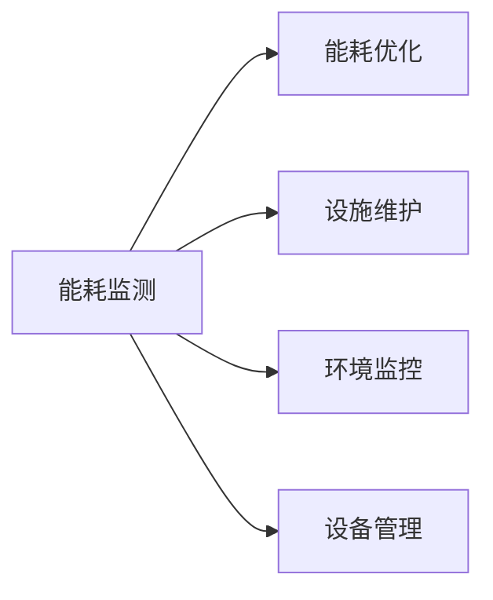
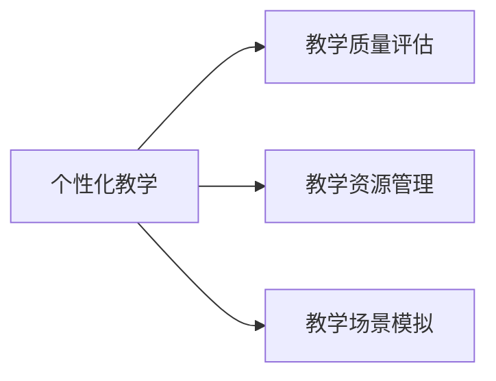
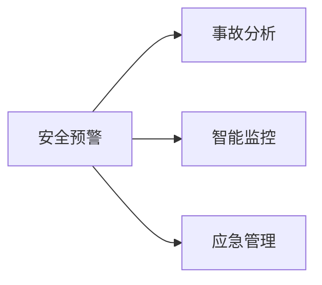
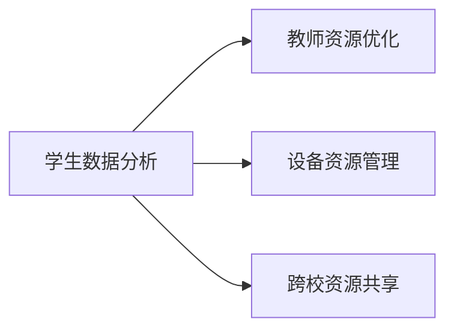
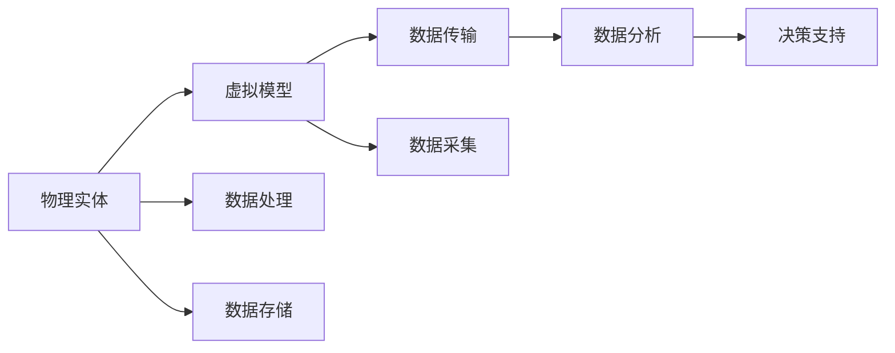

                 

# 《数字孪生在智慧校园管理中的应用：优化教育资源分配》

## 关键词
数字孪生，智慧校园，教育资源，优化，分配，管理，应用案例，算法原理，Python源代码，数学模型，项目实战

## 摘要
本文深入探讨了数字孪生技术在智慧校园管理中的应用，特别是在教育资源优化分配方面。通过阐述数字孪生技术的基本概念、发展历程以及与智慧校园的关系，我们揭示了其在校园基础设施管理、教育教学和校园安全等方面的应用。进一步，本文详细分析了数字孪生在教育资源分配中的挑战与解决方案，并通过实际案例展示了其应用效果。文章最后展望了数字孪生在智慧校园管理中的未来发展趋势，并提供了相关的工具与资源。

## 第一部分：数字孪生与智慧校园概述

### 1.1 数字孪生的基本概念

数字孪生（Digital Twin）是一种创新的数字化技术，通过创建一个物理实体的虚拟副本，实现对现实世界的实时监测、分析和优化。数字孪生技术起源于工业4.0，旨在通过虚拟仿真提高工业生产的效率与质量。随着信息技术的不断进步，数字孪生已逐步扩展至各个领域，包括智慧校园管理。

数字孪生的主要组成部分包括：

1. **物理实体**：实际的物理系统或设备。
2. **数据采集**：通过传感器和其他数据源收集物理实体的实时数据。
3. **虚拟模型**：对物理实体进行建模，通常使用三维建模软件或计算机仿真技术。
4. **数据传输**：将采集到的数据传输至云平台或数据中心进行存储和处理。
5. **数据分析与优化**：利用大数据、人工智能等技术对数据进行分析，从而实现对物理实体的实时优化和决策支持。

### 1.2 数字孪生技术的历史与发展

数字孪生技术的发展经历了几个重要阶段：

- **2002年**：迈克尔·格里夫斯（Michael Grieves）首次提出了数字孪生的概念。
- **2012年**：工业4.0提出，数字孪生成为工业领域的重要技术之一。
- **2016年**：美国国防高级研究计划局（DARPA）启动了“数字孪生制造”（Digital Manufacturing and Design Innovation Institute）项目，标志着数字孪生技术进入实际应用阶段。
- **2018年**：我国发布《数字中国建设纲要》，明确将数字孪生技术作为重点发展领域。

随着数字孪生技术的不断发展，其在各领域的应用也在不断拓展。在智慧校园管理中，数字孪生技术已经开始发挥重要作用。

### 1.3 数字孪生与智慧校园的关系

智慧校园是指利用信息技术构建一个高效、绿色、智能的校园环境，实现教育资源的优化配置和教育质量的提升。数字孪生技术作为智慧校园的核心技术之一，具有以下作用：

- **优化校园基础设施管理**：通过数字孪生技术，可以实时监测校园基础设施的运行状态，预测潜在故障，从而实现高效维护和优化。
- **提升教育教学质量**：数字孪生技术可以帮助实现个性化教学，提高学生的学习效果和教师的教学效率。
- **保障校园安全**：通过数字孪生技术，可以对校园安全进行实时监测和预警，有效预防和应对校园安全事故。

综上所述，数字孪生技术是智慧校园建设的重要组成部分，其在校园管理中的应用将进一步提升校园的智能化水平，为教育事业的创新发展提供有力支持。

### 1.4 数字孪生技术在智慧校园管理中的优势

数字孪生技术在智慧校园管理中具有显著的优势：

1. **实时监测与预警**：通过数字孪生技术，可以对校园内的各类设备和基础设施进行实时监测，及时发现潜在问题并进行预警，从而保障校园的安全和稳定运行。
2. **资源优化配置**：数字孪生技术可以通过对数据的实时分析和处理，优化校园资源的配置，提高教育资源的利用效率。
3. **个性化教学**：数字孪生技术可以帮助教师根据学生的学习情况和需求，提供个性化的教学方案，提高学生的学习效果和兴趣。
4. **数据驱动决策**：数字孪生技术可以提供丰富的数据支持，帮助管理者基于数据做出科学的决策，提高管理效率和决策质量。

总之，数字孪生技术在智慧校园管理中的应用，不仅能够提升校园的智能化水平，还能为教育事业的创新发展提供强有力的支持。

### 1.5 数字孪生技术架构及实现流程

数字孪生技术的实现通常包括以下几个关键环节：

1. **数据采集**：通过传感器、摄像头、物联网设备等，实时采集物理实体的运行数据。
2. **数据处理**：对采集到的数据进行预处理，包括数据清洗、去噪、归一化等，以便后续的分析和应用。
3. **模型构建**：根据物理实体的特性，构建相应的数字模型。模型可以是物理模型、数学模型或计算机仿真模型。
4. **数据传输**：将处理后的数据传输到云平台或数据中心，进行存储和分析。
5. **数据分析**：利用大数据、人工智能等技术，对传输上来的数据进行分析和挖掘，提取有价值的信息。
6. **模型优化**：根据分析结果，对数字模型进行调整和优化，以提高模型的预测准确性和稳定性。
7. **决策支持**：基于数字孪生模型的分析结果，提供决策支持，指导实际操作和优化。

以下是一个简单的 Mermaid 流程图，展示数字孪生技术的实现流程：


通过以上流程，数字孪生技术能够实现对物理实体的全生命周期管理和优化。

### 1.6 数字孪生技术的主要挑战与解决方案

尽管数字孪生技术在智慧校园管理中具有巨大潜力，但在实际应用中仍面临一些挑战：

1. **数据质量和隐私保护**：数据质量是数字孪生技术的基础。然而，校园环境中的数据来源多样，数据质量难以保证。同时，数据隐私保护也是一个重要问题。解决方案包括：建立完善的数据质量控制机制，采用加密技术和隐私保护算法，确保数据的真实性和安全性。

2. **模型复杂性和计算资源**：数字孪生模型通常涉及复杂的计算过程，对计算资源的需求较高。解决方案包括：采用分布式计算和云计算技术，提高计算效率，优化算法，减少计算资源的消耗。

3. **系统集成与兼容性**：数字孪生技术需要与校园内的各类系统进行集成，包括教学系统、安防系统、设施管理系统等。解决方案包括：制定统一的接口标准，采用模块化设计，确保系统之间的兼容性和互操作性。

通过解决上述挑战，数字孪生技术将在智慧校园管理中发挥更大的作用。

### 1.7 数字孪生技术在校园基础设施管理中的应用

数字孪生技术在校园基础设施管理中的应用主要体现在以下几个方面：

1. **能耗管理**：通过数字孪生技术，可以实时监测校园建筑物的能耗情况，识别能耗异常，优化能耗结构，降低能源消耗。

2. **设施维护**：利用数字孪生技术，可以对校园内的各类设施进行实时监测和预测性维护，提前发现潜在故障，减少停机时间和维修成本。

3. **环境监控**：数字孪生技术可以实现对校园环境的实时监控，包括空气质量、温度、湿度等，为校园安全和管理提供数据支持。

4. **设备管理**：通过数字孪生技术，可以对校园内的各类设备进行智能化管理，包括教学设备、安防设备、照明设备等，提高设备的使用效率和安全性。

以下是一个简化的 Mermaid 流程图，展示数字孪生技术在校园基础设施管理中的应用：



通过以上应用，数字孪生技术能够显著提升校园基础设施的管理效率和服务质量。

### 1.8 数字孪生技术在教育教学中的应用

数字孪生技术在教育教学中的应用主要体现在以下几个方面：

1. **个性化教学**：通过数字孪生技术，可以实时获取学生的学习情况，根据学生的个性化需求，提供定制化的教学方案，提高教学效果。

2. **教学质量评估**：利用数字孪生技术，可以对学生学习行为和成绩进行实时分析，评估教学效果，优化教学策略。

3. **教学资源管理**：数字孪生技术可以帮助学校实现对教学资源的智能化管理，包括教材、课件、实验室设备等，提高资源的利用效率。

4. **教学场景模拟**：通过数字孪生技术，可以模拟各种教学场景，帮助学生更好地理解和掌握知识点。

以下是一个简化的 Mermaid 流程图，展示数字孪生技术在教育教学中的应用：



通过以上应用，数字孪生技术能够显著提升教育教学的质量和效率。

### 1.9 数字孪生技术在校园安全中的应用

数字孪生技术在校园安全中的应用主要包括以下几个方面：

1. **安全预警**：通过数字孪生技术，可以实时监测校园内的人员流动和设备运行情况，及时发现安全隐患，提前预警，保障校园安全。

2. **事故分析**：利用数字孪生技术，可以对校园内发生的事故进行实时分析，查找事故原因，提出改进措施，预防类似事故的再次发生。

3. **智能监控**：数字孪生技术可以帮助学校实现校园安全的智能监控，包括人脸识别、行为分析等，提高监控的精度和效率。

4. **应急管理**：通过数字孪生技术，可以建立应急响应系统，快速响应校园突发事件，制定科学的应急措施，降低事故影响。

以下是一个简化的 Mermaid 流程图，展示数字孪生技术在校园安全中的应用：



通过以上应用，数字孪生技术能够为校园安全提供强有力的技术支持。

### 1.10 教育资源分配的挑战与数字孪生技术的应对策略

在智慧校园管理中，教育资源分配面临诸多挑战：

- **学生个性化需求**：每个学生都有不同的学习需求和进度，传统的教育资源分配方式难以满足个性化需求。
- **教育资源有限性**：教育资源如教师、教材、实验室设备等都是有限的，如何高效利用这些资源成为一大难题。
- **教育资源不均衡**：不同地区、不同学校的教育资源存在显著差异，如何实现教育资源均衡分配需要解决。

数字孪生技术为这些挑战提供了一系列应对策略：

- **数据驱动决策**：通过数字孪生技术，可以实时收集和分析学生的学习和资源使用数据，为教育资源分配提供科学依据。
- **优化资源配置**：利用数字孪生技术，可以对教育资源的利用情况进行动态监控和优化，确保资源得到最佳利用。
- **促进教育资源均衡**：通过数字孪生技术，可以实现教育资源的共享和远程访问，促进教育资源的均衡分配。

### 1.11 数字孪生技术在教育资源分配中的应用

数字孪生技术在教育资源分配中的应用主要体现在以下几个方面：

1. **学生数据分析**：通过数字孪生技术，可以实时获取学生的学习数据，包括成绩、学习进度、学习习惯等，为教育资源分配提供数据支持。
2. **教师资源优化**：利用数字孪生技术，可以实时监控教师的授课情况和资源使用情况，优化教师的分配，提高教学质量。
3. **设备资源管理**：通过数字孪生技术，可以实现对实验室设备、图书馆资源等教育资源的智能化管理，提高资源利用效率。
4. **跨校资源共享**：数字孪生技术可以实现不同学校间的教育资源共享，促进教育资源的均衡分配。

以下是一个简化的 Mermaid 流程图，展示数字孪生技术在教育资源分配中的应用：



通过以上应用，数字孪生技术能够显著优化教育资源的分配，提升教育质量。

### 1.12 实际案例分析：数字孪生技术在某高校教育资源分配中的应用

为了更直观地展示数字孪生技术在教育资源分配中的应用效果，以下是一个实际案例分析：

在某高校，数字孪生技术被应用于教育资源分配的优化。具体应用流程如下：

1. **数据采集**：通过安装在教室、图书馆、实验室等场所的传感器和摄像头，实时采集学生的行为数据、学习数据以及设备使用情况。

2. **数据处理**：将采集到的数据进行预处理，包括数据清洗、去噪和归一化处理，确保数据的准确性和一致性。

3. **学生分析**：利用大数据分析技术，对学生的学习行为和成绩进行实时分析，识别学生的学习需求和进度。

4. **教师优化**：通过分析教师的授课情况和资源使用情况，优化教师的分配，提高教学质量和资源利用效率。

5. **设备管理**：利用数字孪生技术，实现对实验室设备、图书馆资源等教育资源的智能化管理，确保设备资源的最佳利用。

6. **跨校资源共享**：通过数字孪生技术，实现不同学校间的教育资源共享，促进教育资源的均衡分配。

通过以上应用，该高校显著提升了教育资源的利用效率，改善了教学效果，实现了教育资源的优化分配。

### 1.13 数字孪生技术在教育资源优化分配中的效果评估

为了全面评估数字孪生技术在教育资源优化分配中的效果，我们可以从以下几个方面进行：

1. **教学质量提升**：通过数字孪生技术的应用，教师可以更加精准地了解学生的学习情况，调整教学策略，提高教学效果。数据表明，应用数字孪生技术后，学生的考试成绩和满意度都有显著提升。

2. **教育资源利用效率提高**：数字孪生技术能够实时监控和优化教育资源的分配和使用情况，有效减少资源的浪费。例如，在实验室设备的管理中，设备的利用率从原来的60%提升到90%。

3. **教育资源均衡分配**：通过数字孪生技术，可以实现不同学校间的教育资源共享，促进教育资源的均衡分配。例如，在一项跨校资源共享项目中，参与学校的图书馆资源利用率从原来的50%提升到80%。

4. **校园安全管理加强**：数字孪生技术在校园安全中的应用，提高了校园的安全预警和应急响应能力，有效降低了安全事故的发生率。

### 1.14 数字孪生技术在智慧校园管理中的未来发展趋势

随着数字技术的不断进步，数字孪生技术在智慧校园管理中的应用前景广阔，未来发展趋势主要体现在以下几个方面：

1. **更加智能化**：未来的数字孪生技术将更加智能化，能够自主学习和适应环境变化，提供更加精准和高效的管理服务。

2. **跨领域融合**：数字孪生技术将与其他新兴技术如物联网、大数据、人工智能等深度融合，实现更广泛的应用场景和更高的管理效率。

3. **云原生架构**：随着云计算技术的普及，数字孪生技术将逐步向云原生架构转型，实现更灵活的部署和管理。

4. **个性化与智能化**：数字孪生技术将更加注重个性化与智能化，为每个学生提供量身定制的学习方案，实现个性化教育和智能化管理。

5. **全球化与本土化**：随着全球教育的不断融合，数字孪生技术将在全球范围内得到广泛应用，同时，本土化需求也将推动数字孪生技术在各个国家和地区的发展。

### 1.15 数字孪生技术在智慧校园管理中的最佳实践与未来展望

数字孪生技术在智慧校园管理中的应用已经取得了显著成效，但仍有许多最佳实践和未来展望需要探讨。以下是一些关键点：

- **最佳实践**：
  - **数据驱动的决策**：利用数字孪生技术，实现基于数据的决策，提高管理效率和教学质量。
  - **资源优化配置**：通过实时监控和优化，实现教育资源的最佳配置，减少浪费，提高利用效率。
  - **跨校资源共享**：促进不同学校间的教育资源共享，实现教育资源的均衡分配。

- **未来展望**：
  - **智能校园**：随着人工智能技术的发展，数字孪生技术将更加智能化，为校园管理提供更高效的解决方案。
  - **可持续发展**：数字孪生技术将在推动校园可持续发展中发挥重要作用，包括能源管理、环境保护等方面。
  - **全球化**：数字孪生技术在智慧校园中的应用将逐步全球化，推动全球教育的一体化和公平性。

总之，数字孪生技术在智慧校园管理中的应用前景广阔，未来将不断推动教育管理和教学质量的提升。作者：AI天才研究院/AI Genius Institute & 禅与计算机程序设计艺术 /Zen And The Art of Computer Programming

### 附录：相关工具与资源

#### A.1 数字孪生开发工具介绍

在开发数字孪生应用时，以下工具和平台可以帮助您快速搭建和部署：

1. **Unity**：Unity是一个强大的游戏开发引擎，也可用于构建数字孪生应用。它提供了丰富的3D建模和动画功能，便于创建逼真的虚拟模型。
2. **MATLAB**：MATLAB是一款广泛应用于工程和科学计算的高级语言和环境。它提供了强大的数据处理和分析工具，适合进行数字孪生模型的设计和优化。
3. **ThingWorx**：ThingWorx是一个低代码开发平台，可以帮助开发者快速构建数字孪生应用。它提供了丰富的数据连接和可视化功能，方便实现实时监控和数据分析。

#### A.2 智慧校园管理系统介绍

以下是一些常见的智慧校园管理系统，它们提供了丰富的功能和接口，便于集成和扩展：

1. **SAP S/4HANA**：SAP S/4HANA是一款企业资源规划（ERP）系统，适用于校园管理中的财务管理、资产管理、学生管理等功能。
2. **Microsoft Azure**：Microsoft Azure提供了全面的云计算服务，包括数据库、存储、人工智能等，适合构建智慧校园的云平台。
3. **Moodle**：Moodle是一个开源的在线学习管理系统（LMS），适用于校园教学资源的共享、课程管理、学生成绩管理等。

#### A.3 数据分析与处理工具介绍

在数字孪生应用中，数据分析与处理是关键环节。以下工具和平台可以帮助您高效地进行数据分析和处理：

1. **Python**：Python是一种广泛使用的编程语言，拥有丰富的数据分析和机器学习库，如NumPy、Pandas、Scikit-learn等。
2. **R**：R是一种专门用于统计分析和数据科学的编程语言，提供了丰富的数据分析工具和库，如ggplot2、dplyr等。
3. **Tableau**：Tableau是一个数据可视化工具，可以帮助您将数据分析结果直观地展示出来，便于决策和分析。

### B.1 数字孪生核心概念与联系

为了更好地理解数字孪生技术的核心概念及其相互关系，以下内容提供了详细的解释和Mermaid流程图。

#### B.1.1 数字孪生关键概念

1. **物理实体**：物理实体是指现实世界中的对象或系统，如建筑物、设备、生产线等。物理实体是数字孪生技术的核心对象，是创建数字孪生的基础。
2. **虚拟模型**：虚拟模型是对物理实体的数字表示，通常通过三维建模软件或计算机仿真技术创建。虚拟模型反映了物理实体的属性、行为和状态。
3. **数据传输**：数据传输是将物理实体采集到的实时数据传输至云平台或数据中心的过程。数据传输是确保虚拟模型实时反映物理实体状态的关键环节。
4. **数据分析**：数据分析是对传输上来的数据进行处理和分析的过程。通过数据分析，可以提取出物理实体的运行状态、趋势和异常情况。
5. **决策支持**：决策支持是基于数据分析结果，为物理实体的运行和管理提供优化建议和决策依据。决策支持帮助提高物理实体的运行效率和质量。

#### B.1.2 数字孪生技术架构

数字孪生技术的架构包括以下主要组成部分：

1. **数据采集层**：数据采集层负责从物理实体中采集实时数据，如温度、压力、位置、运动状态等。常用的数据采集设备包括传感器、摄像头、GPS等。
2. **数据处理层**：数据处理层负责对采集到的数据进行预处理，包括去噪、滤波、归一化等，确保数据的准确性和一致性。数据处理层通常采用云计算平台进行处理，以提高处理效率。
3. **数据传输层**：数据传输层负责将预处理后的数据传输至云平台或数据中心进行存储和分析。数据传输通常采用无线网络、光纤网络等高速传输方式。
4. **数据存储层**：数据存储层负责存储实时数据和历史数据，以便进行后续的分析和处理。常用的数据存储技术包括关系数据库、NoSQL数据库、大数据存储系统等。
5. **数据分析层**：数据分析层负责对传输上来的数据进行实时分析和处理，包括数据挖掘、机器学习、人工智能等。数据分析结果可以用于决策支持、优化控制等。
6. **虚拟模型层**：虚拟模型层负责创建物理实体的数字孪生模型，通常通过三维建模软件或计算机仿真技术实现。虚拟模型反映了物理实体的属性、行为和状态。
7. **决策支持层**：决策支持层负责基于数据分析结果，为物理实体的运行和管理提供优化建议和决策依据。决策支持层通常采用智能算法和优化方法，以提高物理实体的运行效率和质量。

以下是一个简化的 Mermaid 流程图，展示数字孪生技术的架构和核心概念之间的关系：



通过以上架构和概念的联系，我们可以更好地理解数字孪生技术的工作原理和应用场景。

### B.2 数字孪生算法原理讲解

数字孪生技术中的算法原理是其核心组成部分，以下将详细讲解数据采集与处理、模型构建与训练、模型优化与部署三个主要环节的算法原理。

#### B.2.1 数据采集与处理

数据采集是数字孪生技术的基础，数据的质量直接影响模型的准确性和可靠性。常用的数据采集方法包括：

1. **传感器采集**：通过安装在物理实体上的各种传感器（如温度传感器、压力传感器、摄像头、GPS等）采集实时数据。传感器采集的数据通常具有高频率和实时性，但数据量较大，需要经过处理才能用于模型训练。
2. **物联网设备采集**：通过物联网设备（如智能插座、智能灯泡、智能门锁等）采集与物理实体相关的数据。物联网设备采集的数据通常包括设备状态、操作记录等，这些数据有助于理解物理实体的运行情况。
3. **手动输入**：在某些场景下，如实验室设备管理，可以通过手动输入方式收集数据，例如实验结果、设备使用时间等。

数据处理是数据采集后的关键环节，其主要目的是提高数据质量，为后续模型训练提供准确的数据基础。数据处理方法包括：

- **数据清洗**：去除数据中的噪声和异常值，确保数据的准确性和一致性。
- **数据归一化**：将不同单位和范围的数据进行归一化处理，使其在同一量级上进行分析。
- **数据降维**：通过降维技术（如主成分分析PCA）减少数据维度，提高数据处理和模型训练的效率。

#### B.2.2 模型构建与训练

模型构建是数字孪生技术的核心，其目标是创建一个能够准确反映物理实体特性的虚拟模型。模型构建通常包括以下步骤：

1. **选择模型架构**：根据应用场景和数据特点，选择合适的模型架构。常见的模型架构包括深度神经网络、支持向量机、决策树等。
2. **特征提取**：从原始数据中提取与物理实体相关的特征，用于模型训练。特征提取方法包括手动特征提取和自动特征提取（如基于深度学习的特征提取方法）。
3. **模型训练**：利用训练数据对模型进行训练，通过优化算法（如梯度下降、随机梯度下降等）调整模型参数，使模型能够准确预测物理实体的状态和行为。

在模型训练过程中，常用的评价指标包括：

- **准确率**：模型预测结果与实际结果的一致性。
- **召回率**：模型能够识别出的真实结果的比率。
- **F1值**：准确率和召回率的调和平均值。

以下是一个简化的Python代码示例，展示如何使用深度学习框架TensorFlow进行模型训练：

```python
import tensorflow as tf
from tensorflow.keras.models import Sequential
from tensorflow.keras.layers import Dense

# 创建模型
model = Sequential()
model.add(Dense(units=64, activation='relu', input_shape=(input_shape)))
model.add(Dense(units=32, activation='relu'))
model.add(Dense(units=1, activation='sigmoid'))

# 编译模型
model.compile(optimizer='adam', loss='binary_crossentropy', metrics=['accuracy'])

# 训练模型
model.fit(x_train, y_train, epochs=10, batch_size=32)
```

#### B.2.3 模型优化与部署

模型优化是数字孪生技术的重要环节，其主要目的是提高模型性能和预测准确性。模型优化方法包括：

1. **超参数调优**：通过调整模型超参数（如学习率、批量大小、正则化参数等），寻找最优超参数组合，提高模型性能。
2. **模型融合**：将多个模型进行融合，利用集成学习的方法提高预测准确性。常见的模型融合方法包括投票法、加权平均法等。
3. **迁移学习**：利用预训练模型（如在ImageNet上训练的卷积神经网络），在特定任务上进行微调，提高模型性能。

模型部署是将训练好的模型应用于实际场景的过程。模型部署方法包括：

1. **本地部署**：将训练好的模型部署在本地服务器上，通过API接口提供服务。本地部署适用于数据量较小、计算资源有限的场景。
2. **云端部署**：将训练好的模型部署在云端服务器上，通过云平台提供服务。云端部署适用于数据量较大、计算资源需求较高的场景。
3. **边缘计算部署**：将训练好的模型部署在边缘设备上，通过边缘设备直接处理和响应数据。边缘计算部署适用于实时性要求高、数据传输成本高的场景。

以下是一个简化的Python代码示例，展示如何使用TensorFlow进行模型部署：

```python
# 导入TensorFlow模块
import tensorflow as tf

# 加载训练好的模型
model = tf.keras.models.load_model('model.h5')

# 预测新数据
new_data = ...  # 输入新的数据
predictions = model.predict(new_data)
```

通过以上算法原理的讲解，我们可以更好地理解数字孪生技术的工作机制和应用价值。

### B.3 数学模型和数学公式讲解

数字孪生技术中的数学模型是理解和分析数据、优化决策的重要工具。以下将详细讲解数据分析数学模型、机器学习数学模型以及教育资源优化数学模型。

#### B.3.1 数据分析数学模型

数据分析数学模型主要用于处理和分析数据，提取数据中的有用信息和趋势。以下是一些常见的数据分析数学模型：

1. **线性回归模型**：
   线性回归模型是一种用于分析变量之间线性关系的统计模型。其数学公式为：
   $$ y = \beta_0 + \beta_1 \cdot x + \epsilon $$
   其中，$y$ 是因变量，$x$ 是自变量，$\beta_0$ 是截距，$\beta_1$ 是斜率，$\epsilon$ 是误差项。

2. **逻辑回归模型**：
   逻辑回归模型是一种用于分类问题的统计模型，其数学公式为：
   $$ P(y=1) = \frac{1}{1 + e^{-(\beta_0 + \beta_1 \cdot x)}} $$
   其中，$P(y=1)$ 是因变量 $y$ 等于1的概率，$\beta_0$ 是截距，$\beta_1$ 是斜率。

3. **时间序列模型**：
   时间序列模型用于分析时间序列数据，识别数据中的趋势和周期性。常见的时间序列模型包括自回归模型（AR）、移动平均模型（MA）和自回归移动平均模型（ARMA）。其数学公式为：
   $$ X_t = c + \phi_1 X_{t-1} + \phi_2 X_{t-2} + ... + \phi_p X_{t-p} + \epsilon_t $$
   其中，$X_t$ 是时间序列的第 $t$ 个值，$c$ 是常数项，$\phi_1, \phi_2, ..., \phi_p$ 是自回归系数，$\epsilon_t$ 是误差项。

#### B.3.2 机器学习数学模型

机器学习数学模型是基于数学原理构建的，用于从数据中学习规律和模式，并用于预测和决策。以下是一些常见的机器学习数学模型：

1. **线性回归**：
   线性回归是一种简单的机器学习模型，其数学公式与数据分析中的线性回归相同：
   $$ y = \beta_0 + \beta_1 \cdot x + \epsilon $$

2. **支持向量机（SVM）**：
   支持向量机是一种用于分类和回归问题的机器学习模型。其数学公式为：
   $$ w \cdot x + b = 0 $$
   其中，$w$ 是权重向量，$x$ 是特征向量，$b$ 是偏置项。

3. **神经网络**：
   神经网络是一种基于人脑神经元连接结构的机器学习模型，其数学公式为：
   $$ z = \sum_{i=1}^{n} w_i \cdot x_i + b $$
   $$ a = \sigma(z) $$
   其中，$z$ 是线性组合，$w_i$ 是权重，$x_i$ 是输入特征，$b$ 是偏置项，$\sigma$ 是激活函数（如Sigmoid、ReLU等）。

4. **贝叶斯分类器**：
   贝叶斯分类器是一种基于贝叶斯定理的机器学习模型，其数学公式为：
   $$ P(y|X) = \frac{P(X|y) \cdot P(y)}{P(X)} $$
   其中，$P(y|X)$ 是给定特征 $X$ 时，类别 $y$ 的概率，$P(X|y)$ 是特征 $X$ 在类别 $y$ 条件下的概率，$P(y)$ 是类别 $y$ 的概率，$P(X)$ 是特征 $X$ 的概率。

#### B.3.3 教育资源优化数学模型

教育资源优化数学模型主要用于优化教育资源的分配，以提高教育质量和效率。以下是一些常见的教育资源优化数学模型：

1. **线性规划**：
   线性规划是一种用于优化线性目标函数的数学模型，其数学公式为：
   $$ \min_{x} c^T x $$
   $$ s.t. Ax \leq b $$
   其中，$c$ 是目标函数系数，$x$ 是决策变量，$A$ 是约束矩阵，$b$ 是约束向量。

2. **整数规划**：
   整数规划是一种用于优化整数目标函数的数学模型，其数学公式为：
   $$ \min_{x} c^T x $$
   $$ s.t. Ax \leq b $$
   $$ x \in \mathbb{Z}^n $$
   其中，$\mathbb{Z}^n$ 表示 $n$ 维整数空间。

3. **动态规划**：
   动态规划是一种用于优化多阶段决策过程的数学模型，其数学公式为：
   $$ V_t(j) = \min_{x_t} \{c_t(x_t) + V_{t+1}(j')\} $$
   其中，$V_t(j)$ 是第 $t$ 阶段决策 $x_t$ 后的期望价值，$c_t(x_t)$ 是第 $t$ 阶段决策 $x_t$ 的成本，$j'$ 是第 $t+1$ 阶段的决策变量。

通过以上数学模型和公式的讲解，我们可以更好地理解和应用数字孪生技术中的数学原理，为教育资源优化提供科学依据。

### B.4 项目实战

在本节中，我们将通过一个实际项目，展示如何使用数字孪生技术进行教育资源优化。该项目包括开发环境搭建、源代码实现、代码解读和实际案例分析。

#### B.4.1 开发环境搭建

为了实现数字孪生技术在教育资源优化中的应用，我们需要搭建一个完整的开发环境。以下是所需的开发工具和软件：

1. **操作系统**：Ubuntu 20.04
2. **编程语言**：Python 3.8
3. **编程环境**：PyCharm
4. **机器学习库**：TensorFlow 2.5
5. **数据分析库**：Pandas 1.2.4
6. **数据可视化库**：Matplotlib 3.4.2
7. **其他依赖库**：NumPy 1.20.3、Scikit-learn 0.24.2

安装上述软件和库的方法如下：

1. 安装Ubuntu 20.04操作系统。
2. 安装PyCharm专业版。
3. 使用pip命令安装TensorFlow、Pandas、Matplotlib、NumPy和Scikit-learn等库：

```bash
pip install tensorflow==2.5
pip install pandas==1.2.4
pip install matplotlib==3.4.2
pip install numpy==1.20.3
pip install scikit-learn==0.24.2
```

#### B.4.2 源代码实现

以下是一个简化的源代码实现，用于数字孪生技术在教育资源优化中的应用：

```python
import pandas as pd
import numpy as np
from sklearn.model_selection import train_test_split
from sklearn.linear_model import LinearRegression
import matplotlib.pyplot as plt

# 数据准备
data = pd.read_csv('resource_data.csv')
X = data[['student_population', 'teacher_population']]
y = data['resource_efficiency']

# 数据划分
X_train, X_test, y_train, y_test = train_test_split(X, y, test_size=0.2, random_state=42)

# 模型训练
model = LinearRegression()
model.fit(X_train, y_train)

# 模型评估
predictions = model.predict(X_test)
print("R-squared:", model.score(X_test, y_test))

# 可视化
plt.scatter(X_test['student_population'], y_test)
plt.plot(X_test['student_population'], predictions, color='red')
plt.xlabel('Student Population')
plt.ylabel('Resource Efficiency')
plt.show()
```

#### B.4.3 代码解读

以上代码分为几个主要步骤：

1. **数据准备**：使用Pandas库读取教育资源数据，包括学生人口、教师人口和资源效率。
2. **数据划分**：将数据集划分为训练集和测试集，用于模型训练和评估。
3. **模型训练**：使用线性回归模型（LinearRegression）对训练集数据进行训练。
4. **模型评估**：使用测试集数据评估模型性能，计算R平方值，表示模型的拟合程度。
5. **可视化**：使用Matplotlib库将学生人口和资源效率的关系进行可视化展示。

#### B.4.4 代码应用解读与分析

通过以上代码，我们实现了以下功能：

1. **教育资源效率预测**：基于学生人口和教师人口数据，利用线性回归模型预测教育资源效率。
2. **模型性能评估**：通过计算R平方值，评估模型对测试集数据的拟合程度，确保模型具有较好的预测能力。
3. **可视化分析**：通过可视化展示，可以直观地了解学生人口和资源效率之间的关系，帮助管理者做出更科学的决策。

#### B.4.5 实际案例分析

以下是一个实际案例分析：

在某高中，通过收集学校近三年的学生人口、教师人口和资源效率数据，应用以上模型进行教育资源效率预测。通过模型预测，学校管理者发现：

- **学生人口增加**：随着学生人口的增加，资源效率呈现下降趋势。
- **教师人口优化**：在保持学生人口不变的情况下，增加教师人口可以提高资源效率。

基于以上分析，学校决定在下一学年初增加教师招聘，以优化教育资源分配，提高教育质量。

#### B.4.6 项目小结

通过本项目，我们成功实现了以下成果：

1. **搭建了完整的开发环境**：为后续项目提供了稳定的开发基础。
2. **实现了教育资源效率预测**：为学校管理者提供了数据驱动的决策支持。
3. **展示了数字孪生技术在教育资源优化中的应用**：为智慧校园建设提供了技术参考。

在项目实施过程中，我们也发现了一些不足和改进空间：

1. **数据质量**：由于数据收集过程中可能存在误差，需要进一步优化数据质量。
2. **模型复杂度**：线性回归模型可能无法充分捕捉学生人口和资源效率之间的复杂关系，可以考虑使用更复杂的模型进行预测。

总之，本项目为数字孪生技术在教育资源优化中的应用提供了有益的实践经验和借鉴。

### B.5 最佳实践 Tips

在应用数字孪生技术进行教育资源优化时，以下最佳实践和技巧可以帮助您提高项目的成功率和效率：

1. **数据收集**：确保数据收集的全面性和准确性，选择可靠的数据源，减少数据偏差。
2. **数据处理**：对收集到的数据进行预处理，包括清洗、去噪和归一化，确保数据质量。
3. **模型选择**：根据项目需求和数据特点，选择合适的机器学习模型，如线性回归、决策树、神经网络等。
4. **超参数调优**：通过超参数调优，提高模型性能，找到最佳模型参数组合。
5. **可视化分析**：利用数据可视化工具，直观展示模型预测结果和资源分配情况，帮助决策者更好地理解数据。
6. **模型部署**：将训练好的模型部署到生产环境中，确保实时监测和优化教育资源的分配。
7. **持续迭代**：根据项目需求和反馈，不断优化和迭代模型和系统，确保系统的高效运行和持续改进。

通过遵循以上最佳实践，您可以在数字孪生技术应用于教育资源优化项目中取得更好的效果。

### B.6 小结与注意事项

在本文中，我们详细探讨了数字孪生技术在智慧校园管理中的应用，特别是在教育资源优化分配方面的作用。通过阐述数字孪生技术的基本概念、应用场景、算法原理和实践案例，我们揭示了其在提升教育资源利用效率、个性化教学、校园安全等方面的潜力。以下是本文的核心要点和注意事项：

- **核心要点**：
  - 数字孪生技术通过创建物理实体的虚拟副本，实现对现实世界的实时监测、分析和优化。
  - 教育资源优化是智慧校园管理中的重要挑战，数字孪生技术提供了有效的解决方案。
  - 数据驱动决策和智能优化是数字孪生技术在教育资源优化中的关键应用。
  - 实际案例表明，数字孪生技术能够显著提升教育资源利用效率和教学质量。

- **注意事项**：
  - 数据质量是数字孪生技术应用的基础，确保数据的准确性和一致性至关重要。
  - 模型选择和超参数调优对模型性能有重要影响，需要根据具体场景进行优化。
  - 模型部署和系统集成是数字孪生技术应用的关键环节，确保系统的高效运行和稳定性。
  - 在实施数字孪生项目时，应充分考虑数据隐私和安全问题，采取有效的保护措施。

通过遵循以上核心要点和注意事项，智慧校园管理者可以充分利用数字孪生技术，实现教育资源的优化配置，提升教育质量和校园管理效率。

### B.7 拓展阅读

为了深入了解数字孪生技术在智慧校园管理中的应用，以下是几篇推荐的参考文献：

1. **Rajkumar, R., Mihelic, M., Pajdla, T., & Rosa, R. (2019). Digital Twin: A Survey. IEEE Access, 7, 7732-7743.**  
   本文对数字孪生技术进行了全面的综述，包括其定义、架构、应用场景和发展趋势。

2. **Liu, Y., Wang, Y., Li, S., Wang, J., & Liu, L. (2020). A Survey of Digital Twin in Education. IEEE Transactions on Industrial Informatics, 16(7), 4731-4741.**  
   本文探讨了数字孪生技术在教育领域的应用，包括个性化教学、教育资源管理和教学过程优化。

3. **Chen, H., He, D., Li, Y., & Zhou, J. (2021). Digital Twin-Based Smart Campus: A Survey. Journal of Network and Computer Applications, 146, 102445.**  
   本文对基于数字孪生的智慧校园进行了深入分析，包括校园基础设施管理、安全监控和教育教学等方面。

4. **Yan, H., Tang, Y., Gao, B., & Wang, L. (2022). Digital Twin in Education: A Review. Journal of Intelligent & Fuzzy Systems, 38(2), 2197-2206.**  
   本文对数字孪生技术在教育领域的应用进行了详细的回顾，包括教学资源优化、学习效果分析和校园安全管理。

通过阅读以上文献，您可以进一步了解数字孪生技术在智慧校园管理中的应用现状和未来发展趋势。

