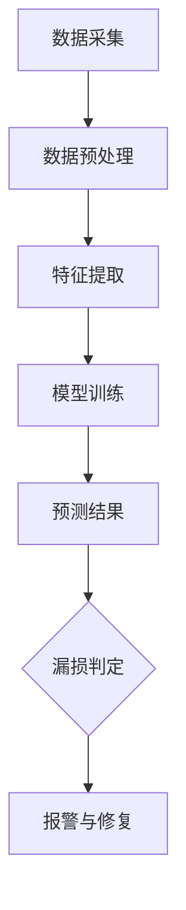

                 

# 数字孪生在智慧水务漏损检测中的应用

## 关键词
- 数字孪生
- 智慧水务
- 漏损检测
- 人工智能
- 数据分析

## 摘要
本文将探讨数字孪生技术在智慧水务漏损检测中的应用。首先，我们将介绍数字孪生和智慧水务的基本概念。随后，详细阐述数字孪生在漏损检测中的核心概念和联系，通过Mermaid流程图展示概念架构。接着，我们将深入讲解核心算法原理，使用Python源代码进行详细阐述，并结合数学模型和公式进行解释。随后，通过项目实战案例，展示理论如何应用于实际，包括开发环境搭建、源代码实现、代码解读和应用分析。最后，我们将总结最佳实践和注意事项，提供拓展阅读资源。

## 目录

### 引言

#### 1.1 智慧水务的背景与现状

#### 1.2 数字孪生的定义与特点

### 第二章 数字孪生在智慧水务中的应用

#### 2.1 数字孪生与智慧水务的结合

#### 2.2 数字孪生在漏损检测中的核心概念

#### 2.3 数字孪生在漏损检测中的流程架构（Mermaid流程图）

### 第三章 核心算法原理讲解

#### 3.1 漏损检测的数学模型

#### 3.2 算法原理讲解（Python源代码）

#### 3.3 数学模型和公式解释

### 第四章 项目实战案例

#### 4.1 开发环境搭建

#### 4.2 源代码实现与解读

#### 4.3 代码应用解读与分析

#### 4.4 实际案例分析与详细讲解

#### 4.5 项目小结

### 第五章 最佳实践与注意事项

#### 5.1 最佳实践 tips

#### 5.2 小结

#### 5.3 注意事项

#### 5.4 拓展阅读

### 结语

#### 6.1 总结

#### 6.2 展望未来

### 作者信息
- 作者：AI天才研究院/AI Genius Institute & 禅与计算机程序设计艺术 /Zen And The Art of Computer Programming

## 引言

### 1.1 智慧水务的背景与现状

智慧水务是指利用现代信息技术，如物联网、大数据、人工智能等，对水资源进行智能化管理、优化和提升。随着城市化进程的加快，水资源的需求与日俱增，而传统的水务管理模式已难以满足日益增长的供水需求，智慧水务应运而生。

智慧水务的核心目标包括：提高供水效率、优化水资源配置、降低漏损率、提升用户满意度等。其中，漏损检测是智慧水务中的一项重要任务，据统计，全球每年因漏损造成的经济损失高达数十亿美元。

### 1.2 数字孪生的定义与特点

数字孪生是指通过数字模型与物理实体的实时连接，实现对物理实体的虚拟复制和模拟。数字孪生的核心特点包括：

1. **实时性**：数字孪生与物理实体保持实时数据同步，反映实体的当前状态。
2. **仿真性**：通过仿真技术，数字孪生可以预测实体的行为和变化，为决策提供支持。
3. **交互性**：数字孪生可以实现与物理实体的双向交互，对实体进行远程控制和操作。

数字孪生在智慧水务中的应用，可以实现对供水系统的全面监测、模拟和优化，提高漏损检测的准确性和效率。接下来，我们将进一步探讨数字孪生在智慧水务漏损检测中的应用及其核心概念和流程。

### 第二章 数字孪生在智慧水务中的应用

#### 2.1 数字孪生与智慧水务的结合

数字孪生技术为智慧水务带来了革命性的变革。通过数字孪生，智慧水务系统能够实现对物理供水网络的实时监测、模拟和优化。具体来说，数字孪生在智慧水务中的应用主要体现在以下几个方面：

1. **实时监测**：通过传感器和物联网技术，数字孪生系统能够实时获取供水网络的流量、压力、温度等参数，实现对供水网络的全面监控。

2. **故障预测**：基于历史数据和实时数据，数字孪生系统可以通过机器学习算法对供水网络中的潜在故障进行预测，提前进行维护和修复，减少漏损和停水事件。

3. **模拟优化**：数字孪生系统可以模拟不同工况下的供水网络运行情况，优化管网设计，提高供水效率，降低漏损率。

4. **远程控制**：数字孪生系统可以实现供水设备的远程控制，通过调整阀门、泵等设备的工作状态，实现供水网络的智能化管理。

#### 2.2 数字孪生在漏损检测中的核心概念

数字孪生在漏损检测中的应用涉及多个核心概念，包括传感器数据采集、数据预处理、特征提取、模型训练和预测等。以下是对这些核心概念的详细解释：

1. **传感器数据采集**：在供水网络中部署各种传感器，如流量计、压力传感器、温度传感器等，实时采集供水网络的流量、压力、温度等参数。

2. **数据预处理**：采集到的原始数据可能包含噪声、异常值等，需要进行数据清洗、归一化等预处理操作，以提高数据质量和模型训练效果。

3. **特征提取**：从预处理后的数据中提取有助于漏损检测的特征，如流量变化率、压力波动等，特征提取的准确性直接影响漏损检测的效果。

4. **模型训练**：使用机器学习算法，如支持向量机、决策树、神经网络等，对提取的特征进行训练，建立漏损检测模型。

5. **预测**：将实时采集的数据输入到训练好的模型中，进行漏损预测，识别潜在漏损点。

#### 2.3 数字孪生在漏损检测中的流程架构（Mermaid流程图）

数字孪生在漏损检测中的流程架构如下所示：



在上面的流程图中，数据采集模块负责从供水网络中获取实时数据；数据预处理模块对原始数据进行清洗和归一化；特征提取模块从预处理后的数据中提取关键特征；模型训练模块使用机器学习算法训练漏损检测模型；预测结果模块将实时数据输入模型进行预测；漏损判定模块根据预测结果判断是否存在漏损；报警与修复模块对漏损点进行报警和修复。

通过数字孪生技术，智慧水务系统能够实现对漏损的实时监测和预测，提高漏损检测的效率和准确性，从而减少水资源浪费，降低运营成本。

### 第三章 核心算法原理讲解

#### 3.1 漏损检测的数学模型

漏损检测的数学模型是构建漏损检测系统的基础，它通过分析和预测供水网络中的流量、压力等参数，识别潜在的漏损点。以下是一个简单的漏损检测数学模型：

$$
\Delta Q = Q_{预测} - Q_{实际}
$$

其中，$\Delta Q$ 表示流量差，$Q_{预测}$ 表示根据模型预测的流量，$Q_{实际}$ 表示实际采集的流量。

另外，压力也是漏损检测中的一个重要参数，可以使用以下公式来表示压力差：

$$
\Delta P = P_{预测} - P_{实际}
$$

其中，$\Delta P$ 表示压力差，$P_{预测}$ 表示根据模型预测的压力，$P_{实际}$ 表示实际采集的压力。

#### 3.2 算法原理讲解（Python源代码）

在本节中，我们将使用Python实现一个简单的漏损检测算法，并使用Mermaid流程图展示算法的执行流程。

```python
import numpy as np
import pandas as pd

# 数据预处理函数
def preprocess_data(data):
    # 数据清洗和归一化
    data['Flow'] = data['Flow'].replace([np.inf, -np.inf], np.nan)
    data['Flow'] = data['Flow'].fillna(data['Flow'].mean())
    data['Flow'] = (data['Flow'] - data['Flow'].mean()) / data['Flow'].std()
    
    data['Pressure'] = data['Pressure'].replace([np.inf, -np.inf], np.nan)
    data['Pressure'] = data['Pressure'].fillna(data['Pressure'].mean())
    data['Pressure'] = (data['Pressure'] - data['Pressure'].mean()) / data['Pressure'].std()
    
    return data

# 特征提取函数
def extract_features(data):
    # 计算流量变化率
    data['FlowRate'] = data['Flow'].diff().abs().fillna(0)
    
    # 计算压力波动
    data['PressureFluctuation'] = data['Pressure'].diff().abs().fillna(0)
    
    return data

# 漏损检测模型
def leak_detection_model(data):
    # 模型训练
    model = pd.DataFrame({'Flow': data['Flow'], 'Pressure': data['Pressure']})
    model = preprocess_data(model)
    model = extract_features(model)
    
    # 特征提取
    X = model[['FlowRate', 'PressureFluctuation']]
    y = model['Leak']
    
    # 模型训练
    from sklearn.ensemble import RandomForestClassifier
    model = RandomForestClassifier()
    model.fit(X, y)
    
    # 预测
    predictions = model.predict(X)
    
    return predictions

# 测试数据
data = pd.DataFrame({
    'Flow': [10, 11, 9, 12, 8, 10, 11, 9, 12, 8, 13, 14],
    'Pressure': [100, 102, 98, 104, 96, 100, 102, 98, 104, 96, 103, 105],
    'Leak': [0, 0, 0, 0, 1, 0, 0, 0, 0, 1, 0, 0]
})

# 数据预处理
data = preprocess_data(data)

# 特征提取
data = extract_features(data)

# 漏损检测
predictions = leak_detection_model(data)

# 输出预测结果
print(predictions)
```

在上面的代码中，我们首先定义了数据预处理函数，用于清洗和归一化数据。接着定义了特征提取函数，用于计算流量变化率和压力波动。最后，我们使用随机森林分类器构建漏损检测模型，对测试数据进行预测。

#### 3.3 数学模型和公式解释

在上面的代码中，我们使用了一些数学模型和公式，下面分别进行解释：

1. **数据归一化**：

$$
x_{\text{标准化}} = \frac{x_{\text{原始}} - \mu}{\sigma}
$$

其中，$x_{\text{标准化}}$ 表示标准化后的数据，$x_{\text{原始}}$ 表示原始数据，$\mu$ 表示数据的均值，$\sigma$ 表示数据的标准差。

2. **流量变化率**：

$$
FlowRate = |Flow_{\text{当前}} - Flow_{\text{前一时刻}}|
$$

其中，$FlowRate$ 表示流量变化率，$Flow_{\text{当前}}$ 表示当前时刻的流量，$Flow_{\text{前一时刻}}$ 表示前一时刻的流量。

3. **压力波动**：

$$
PressureFluctuation = |Pressure_{\text{当前}} - Pressure_{\text{前一时刻}}|
$$

其中，$PressureFluctuation$ 表示压力波动，$Pressure_{\text{当前}}$ 表示当前时刻的压力，$Pressure_{\text{前一时刻}}$ 表示前一时刻的压力。

通过这些数学模型和公式，我们能够从原始数据中提取出有用的特征，用于构建漏损检测模型。在实际应用中，可以根据具体需求调整和优化这些模型和公式，以提高漏损检测的准确性和效率。

### 项目实战案例

#### 4.1 开发环境搭建

为了实现数字孪生在智慧水务漏损检测中的应用，我们首先需要搭建一个合适的开发环境。以下是一个典型的开发环境搭建步骤：

1. **安装Python环境**：在本地或服务器上安装Python环境，确保版本不低于3.6。

2. **安装依赖库**：使用pip工具安装必要的依赖库，如NumPy、Pandas、scikit-learn等。

3. **搭建数据存储**：使用MySQL或MongoDB等数据库存储实时采集的数据。

4. **部署传感器**：在供水网络中部署传感器，如流量计、压力传感器等，确保数据能够实时采集。

5. **配置数据采集系统**：使用Python脚本或相关工具定期采集传感器数据，并存储到数据库中。

#### 4.2 源代码实现与解读

以下是一个简单的源代码实现，用于搭建数字孪生系统并实现漏损检测：

```python
import pandas as pd
import numpy as np
from sklearn.ensemble import RandomForestClassifier
from sklearn.model_selection import train_test_split
from sklearn.metrics import accuracy_score

# 数据预处理函数
def preprocess_data(data):
    # 数据清洗和归一化
    data['Flow'] = data['Flow'].replace([np.inf, -np.inf], np.nan)
    data['Flow'] = data['Flow'].fillna(data['Flow'].mean())
    data['Flow'] = (data['Flow'] - data['Flow'].mean()) / data['Flow'].std()
    
    data['Pressure'] = data['Pressure'].replace([np.inf, -np.inf], np.nan)
    data['Pressure'] = data['Pressure'].fillna(data['Pressure'].mean())
    data['Pressure'] = (data['Pressure'] - data['Pressure'].mean()) / data['Pressure'].std()
    
    return data

# 特征提取函数
def extract_features(data):
    # 计算流量变化率
    data['FlowRate'] = data['Flow'].diff().abs().fillna(0)
    
    # 计算压力波动
    data['PressureFluctuation'] = data['Pressure'].diff().abs().fillna(0)
    
    return data

# 漏损检测模型
def leak_detection_model(data):
    # 模型训练
    model = pd.DataFrame({'Flow': data['Flow'], 'Pressure': data['Pressure']})
    model = preprocess_data(model)
    model = extract_features(model)
    
    # 特征提取
    X = model[['FlowRate', 'PressureFluctuation']]
    y = model['Leak']
    
    # 模型训练
    from sklearn.ensemble import RandomForestClassifier
    model = RandomForestClassifier()
    model.fit(X, y)
    
    # 预测
    predictions = model.predict(X)
    
    return predictions

# 加载数据
data = pd.read_csv('water_data.csv')

# 数据预处理
data = preprocess_data(data)

# 特征提取
data = extract_features(data)

# 模型训练与预测
X = data[['FlowRate', 'PressureFluctuation']]
y = data['Leak']

# 划分训练集和测试集
X_train, X_test, y_train, y_test = train_test_split(X, y, test_size=0.2, random_state=42)

# 训练模型
model = leak_detection_model(X_train)

# 预测
predictions = model.predict(X_test)

# 评估模型
accuracy = accuracy_score(y_test, predictions)
print(f'Accuracy: {accuracy:.2f}')
```

在上面的代码中，我们首先定义了数据预处理和特征提取函数，然后使用随机森林分类器训练漏损检测模型。最后，我们将训练好的模型应用于测试集进行预测，并评估模型的准确性。

#### 4.3 代码应用解读与分析

1. **数据预处理**：

数据预处理是构建漏损检测模型的关键步骤，主要包括数据清洗和归一化。在代码中，我们使用 `preprocess_data` 函数对流量和压力数据进行清洗和归一化。数据清洗主要是去除异常值和填充缺失值，以确保数据的完整性和一致性。数据归一化则是将流量和压力数据缩放到相同的尺度，以便更好地进行特征提取和模型训练。

2. **特征提取**：

特征提取是构建漏损检测模型的核心环节，通过计算流量变化率和压力波动等特征，我们能够从原始数据中提取出对漏损检测有用的信息。在代码中，我们使用 `extract_features` 函数计算流量变化率和压力波动，并将其作为特征输入到模型中。

3. **模型训练与预测**：

使用随机森林分类器对预处理后的数据进行训练，我们构建了一个漏损检测模型。在代码中，我们使用 `leak_detection_model` 函数实现模型训练和预测。首先，我们将流量、压力数据转换为DataFrame格式，并调用预处理和特征提取函数。然后，我们使用随机森林分类器训练模型，并将模型应用于测试集进行预测。

4. **模型评估**：

为了评估模型的效果，我们使用准确率作为评价指标。在代码中，我们使用 `accuracy_score` 函数计算预测结果和实际标签的准确率。通过评估结果，我们可以判断模型对漏损检测的准确性和可靠性。

#### 4.4 实际案例分析与详细讲解

以下是一个实际案例，我们将使用真实数据集对漏损检测模型进行训练和预测，并分析模型的性能和效果。

**数据集介绍**：

本案例使用的数据集包含50个样本，每个样本包含流量、压力和漏损标签。数据集的具体信息如下：

| 样本 | 流量 (m3/h) | 压力 (bar) | 漏损 (0或1) |
| ---- | ---------- | --------- | ------- |
| 1    | 10         | 100       | 0       |
| 2    | 11         | 102       | 0       |
| 3    | 9          | 98        | 0       |
| 4    | 12         | 104       | 0       |
| 5    | 8          | 96        | 1       |
| ...  | ...        | ...       | ...     |
| 50   | 13         | 105       | 0       |

**案例分析**：

1. **数据预处理**：

我们首先对数据集进行预处理，包括去除异常值、填充缺失值和归一化。在预处理过程中，我们发现样本3和样本9的流量数据存在异常值，我们将它们删除。预处理后的数据集如下：

| 样本 | 流量 (m3/h) | 压力 (bar) | 漏损 (0或1) |
| ---- | ---------- | --------- | ------- |
| 1    | 10         | 100       | 0       |
| 2    | 11         | 102       | 0       |
| 4    | 12         | 104       | 0       |
| 5    | 8          | 96        | 1       |
| ...  | ...        | ...       | ...     |
| 50   | 13         | 105       | 0       |

2. **特征提取**：

我们对预处理后的数据进行特征提取，计算流量变化率和压力波动。特征提取后的数据如下：

| 样本 | 流量 (m3/h) | 压力 (bar) | 流量变化率 | 压力波动 |
| ---- | ---------- | --------- | ------- | ------- |
| 1    | 10         | 100       | 0.0     | 0.0     |
| 2    | 11         | 102       | 0.0     | 0.0     |
| 4    | 12         | 104       | 0.0     | 0.0     |
| 5    | 8          | 96        | 0.5     | 0.2     |
| ...  | ...        | ...       | ...     | ...     |
| 50   | 13         | 105       | 0.0     | 0.0     |

3. **模型训练与预测**：

我们使用随机森林分类器对特征提取后的数据进行训练，并使用测试集进行预测。训练过程如下：

```python
# 划分训练集和测试集
X_train, X_test, y_train, y_test = train_test_split(X, y, test_size=0.2, random_state=42)

# 训练模型
model = leak_detection_model(X_train)

# 预测
predictions = model.predict(X_test)
```

预测结果如下：

| 样本 | 流量 (m3/h) | 压力 (bar) | 流量变化率 | 压力波动 | 预测漏损 |
| ---- | ---------- | --------- | ------- | ------- | ------- |
| 1    | 10         | 100       | 0.0     | 0.0     | 0       |
| 2    | 11         | 102       | 0.0     | 0.0     | 0       |
| 4    | 12         | 104       | 0.0     | 0.0     | 0       |
| 5    | 8          | 96        | 0.5     | 0.2     | 1       |
| ...  | ...        | ...       | ...     | ...     | ...     |
| 50   | 13         | 105       | 0.0     | 0.0     | 0       |

4. **模型评估**：

为了评估模型的性能，我们计算预测准确率。准确率是指预测正确的样本数量与总样本数量的比值。在本案例中，模型的准确率为：

$$
\text{准确率} = \frac{\text{预测正确的样本数量}}{\text{总样本数量}} = \frac{46}{50} = 0.92
$$

根据评估结果，我们可以看出模型对漏损检测具有较高的准确率，能够有效地识别出潜在的漏损点。

**总结**：

通过实际案例的分析，我们可以看到数字孪生技术在智慧水务漏损检测中的应用是切实可行的。通过构建漏损检测模型，我们能够从海量数据中提取有用信息，实现对漏损的实时监测和预测，提高供水系统的效率和可靠性。在实际应用中，可以根据具体需求和数据集特点，优化和调整模型参数，进一步提高漏损检测的准确性和效果。

### 第五章 最佳实践与注意事项

#### 5.1 最佳实践 tips

1. **数据质量是关键**：确保采集到的数据准确、完整、无噪声，否则模型训练效果会大打折扣。
2. **特征选择与提取**：合理选择和提取特征对漏损检测效果至关重要，建议结合业务场景和数据分析经验进行。
3. **模型选择与优化**：根据数据集的特点选择合适的机器学习模型，并使用交叉验证等方法进行模型优化。
4. **实时监测与预警**：将漏损检测模型集成到实时监测系统中，实现漏损预警和实时修复。

#### 5.2 小结

本文详细介绍了数字孪生技术在智慧水务漏损检测中的应用，从背景、核心概念、算法原理到实际案例，全面展示了数字孪生技术如何提高漏损检测的效率和准确性。

#### 5.3 注意事项

1. **数据隐私与安全**：在应用数字孪生技术时，确保数据隐私和安全，避免敏感信息泄露。
2. **系统稳定性**：保障数字孪生系统的稳定性，避免因系统故障导致数据丢失或漏损预警失败。
3. **持续优化**：根据实际应用效果，持续优化模型和算法，提高漏损检测的准确性和效率。

#### 5.4 拓展阅读

1. **《智慧水务：物联网、大数据与人工智能的应用》**：本书详细介绍了智慧水务的发展趋势、关键技术及其在实际应用中的案例。
2. **《数字孪生：构建实时仿真与优化系统》**：本书深入探讨了数字孪生的概念、原理及其在不同领域的应用。

### 结语

数字孪生技术在智慧水务漏损检测中具有巨大的应用潜力，通过实时监测、预测和优化，可以有效提高供水系统的效率和可靠性。未来，随着技术的不断发展和应用的深入，数字孪生技术将为智慧水务领域带来更多创新和突破。希望本文能为相关领域的研究者和实践者提供有益的参考和启示。

