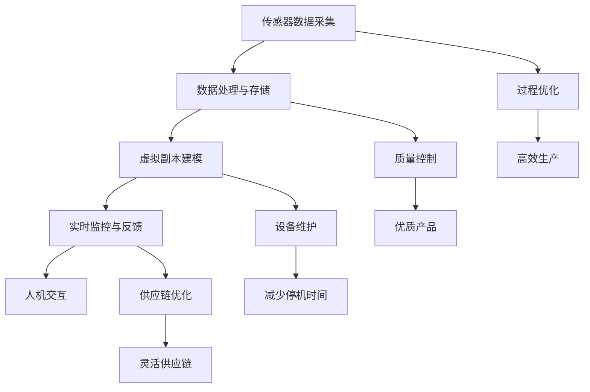

                 

### 引言

数字孪生（Digital Twin）技术，作为一种新兴的智能制造技术，正在逐渐改变传统制造业的生产模式。数字孪生通过构建物理实体在虚拟世界的镜像，实现对实际生产过程的实时监控和优化。它不仅能够模拟生产流程，还能够预测潜在问题，提供解决方案，从而极大地提升生产效率和产品质量。

在智能制造领域，数字孪生技术的应用具有深远的影响。通过数字孪生，企业可以在虚拟环境中对生产线进行测试和优化，减少实际生产中的风险和成本。此外，数字孪生还能够实现生产过程的透明化和可视化，使得管理者可以更加直观地了解生产状态，做出更加科学的决策。

本文旨在深入探讨数字孪生在智能制造中的应用，重点关注如何通过数字孪生技术来优化生产流程。文章将分为以下几个部分：

1. **数字孪生基本概念**：介绍数字孪生的定义、核心特征和架构。
2. **数字孪生在智能制造中的应用**：探讨数字孪生在仿真、质量控制、设备维护和供应链优化等方面的应用。
3. **数字孪生系统构建**：详细描述数字孪生系统的数据采集与处理、模型建立与验证、系统集成与优化等步骤。
4. **数字孪生技术实现**：分析增强现实与虚拟现实、物联网技术、大数据分析及人工智能与机器学习在数字孪生中的应用。
5. **数字孪生应用案例**：通过具体案例展示数字孪生在实际生产中的应用。
6. **优化生产流程的实践策略**：提供优化生产流程的具体方法、资源配置优化策略和柔性制造系统。
7. **总结与展望**：总结数字孪生在智能制造中的应用，并展望其未来的发展趋势。

希望通过本文的探讨，读者能够对数字孪生技术有更深入的理解，并能够将其应用于实际生产中，实现生产流程的优化。

### 关键词

- **数字孪生**（Digital Twin）
- **智能制造**（Smart Manufacturing）
- **生产流程优化**（Process Optimization）
- **仿真**（Simulation）
- **质量控制**（Quality Control）
- **设备维护**（Equipment Maintenance）
- **供应链优化**（Supply Chain Optimization）
- **增强现实**（Augmented Reality）
- **虚拟现实**（Virtual Reality）
- **物联网**（Internet of Things）
- **大数据分析**（Big Data Analysis）
- **人工智能**（Artificial Intelligence）
- **机器学习**（Machine Learning）

----------------------------------------------------------------

## 摘要

本文深入探讨了数字孪生在智能制造中的应用，特别是如何通过数字孪生技术优化生产流程。首先，我们介绍了数字孪生的基本概念，包括其定义、核心特征和架构。接着，我们分析了数字孪生在仿真、质量控制、设备维护和供应链优化等方面的应用，并详细描述了数字孪生系统的构建步骤。然后，我们探讨了数字孪生技术实现的多个层面，包括增强现实与虚拟现实、物联网技术、大数据分析以及人工智能与机器学习。通过具体案例，我们展示了数字孪生在制造业中的实际应用。最后，我们提出了优化生产流程的具体实践策略，包括流程优化方法、资源配置优化和柔性制造系统。本文总结了数字孪生在智能制造中的应用，并对其未来发展进行了展望。

----------------------------------------------------------------

### 数字孪生基本概念

数字孪生（Digital Twin）是一种创新的技术概念，其核心思想是通过创建物理实体的虚拟副本，实现对实际生产过程的实时监控和优化。数字孪生不仅仅是一个虚拟的3D模型，它是一个集成了多种技术的复杂系统，能够反映物理实体的所有关键特性，并能够根据实时数据进行动态更新。

#### 定义

数字孪生的定义可以从多个角度进行理解。首先，它可以被定义为一个物理实体在虚拟世界中的映射，这个映射不仅仅是外观上的相似，更重要的是它能够包含实体的物理、化学、环境等各方面的信息。其次，数字孪生是一种通过物联网（IoT）技术实现实时数据采集、传输和分析的系统，它能够为物理实体提供精确的监控和预测性维护。

#### 核心特征

数字孪生的核心特征包括：

1. **实时性**：数字孪生系统能够实时获取物理实体的数据，并进行处理和分析，从而提供实时的监控和反馈。
2. **关联性**：数字孪生能够将物理实体与其虚拟副本进行关联，实现对整个生产过程的全方位监控和管理。
3. **动态性**：数字孪生系统能够根据实时数据动态更新，模拟不同的生产场景，预测潜在问题并提供解决方案。
4. **可扩展性**：数字孪生系统具有高度的可扩展性，能够支持大规模生产和复杂流程的建模与优化。

#### 架构

数字孪生系统的架构通常包括以下几个关键组成部分：

1. **传感器与数据采集**：传感器分布在物理实体上，用于收集温度、压力、振动等关键数据。
2. **数据处理与存储**：收集到的数据经过预处理后存储在数据库中，以便后续分析和处理。
3. **虚拟副本建模**：基于收集到的数据，创建物理实体的虚拟副本，这个副本能够模拟实体的行为和状态。
4. **实时监控与反馈**：通过监控软件对虚拟副本进行实时监控，并将分析结果反馈给物理实体，实现闭环控制。
5. **人机交互**：提供用户界面，使得操作者能够直观地查看生产状态、模拟生产过程和调整生产参数。

#### 数字孪生与智能制造的联系

数字孪生与智能制造密切相关，它是实现智能制造的重要技术之一。智能制造的目标是通过自动化和智能化的生产方式，实现高效、灵活和个性化的生产。数字孪生技术能够提供以下几个方面的支持：

1. **过程优化**：通过仿真和优化算法，数字孪生能够帮助企业在虚拟环境中对生产流程进行测试和优化，减少实际生产中的风险和成本。
2. **质量控制**：数字孪生系统能够实时监控产品质量，预测潜在的质量问题，并采取相应的措施进行预防和纠正。
3. **设备维护**：数字孪生能够实现设备的预测性维护，通过分析设备运行数据，提前发现设备故障，减少停机时间和维修成本。
4. **供应链优化**：数字孪生能够优化供应链管理，通过实时数据分析和预测，提高供应链的响应速度和灵活性。

总之，数字孪生技术为智能制造提供了强大的技术支撑，是实现生产流程优化的重要工具。

### 数字孪生架构 Mermaid 流程图



### 数字孪生在智能制造中的应用

数字孪生技术在智能制造中的应用非常广泛，可以涵盖生产流程的各个环节。下面，我们将详细探讨数字孪生在仿真、质量控制、设备维护和供应链优化等方面的应用。

#### 生产过程仿真

生产过程仿真是通过数字孪生技术，在虚拟环境中模拟实际生产过程。仿真模型能够反映生产线的各种参数，如设备性能、物料流动、工艺流程等。通过仿真，企业可以在虚拟环境中测试不同的生产方案，优化生产流程，减少实际生产中的风险和成本。

**应用案例**：某汽车制造企业利用数字孪生技术对生产线进行仿真，通过模拟不同的生产方案，优化了生产节拍和物料流动，提高了生产效率，减少了生产周期。

**实现方法**：

1. **构建仿真模型**：根据生产线的实际参数，构建虚拟生产线的模型。
2. **设定仿真场景**：设定不同的生产方案，如改变生产节拍、调整设备布局等。
3. **运行仿真**：在虚拟环境中运行仿真模型，记录生产过程的各种数据。
4. **分析结果**：对仿真结果进行分析，找出最优的生产方案。

```python
# 仿真模型示例代码
import simpy

# 环境设定
env = simpy.Environment()

# 设备参数
machine1 = {'name': 'Machine1', 'status': 'idle', 'production_rate': 1}
machine2 = {'name': 'Machine2', 'status': 'idle', 'production_rate': 1}

# 生产过程模拟
def production_process(env, machine1, machine2):
    while True:
        yield env.timeout(1)  # 生产节拍
        if machine1['status'] == 'idle':
            machine1['status'] = 'running'
            yield env.timeout(1/machine1['production_rate'])  # 设备加工时间
            machine1['status'] = 'idle'
            yield env.process(machine2.production_process(env, machine1, machine2))
        else:
            yield env.process(machine2.production_process(env, machine1, machine2))

# 运行仿真
env.process(production_process(env, machine1, machine2))
env.run()
```

#### 质量控制

数字孪生技术能够实现对产品质量的实时监控和预测。通过在产品制造过程中收集数据，数字孪生系统能够分析产品的质量特性，发现潜在的质量问题，并提供解决方案。

**应用案例**：某电子产品制造企业利用数字孪生技术监控生产过程，通过实时数据分析，发现了一款产品在焊接过程中的质量问题，及时调整了焊接参数，避免了批量次品的出现。

**实现方法**：

1. **数据采集**：在生产过程中，通过传感器收集产品的质量数据，如温度、压力、焊接强度等。
2. **数据预处理**：对采集到的数据进行清洗和预处理，以便后续分析。
3. **质量分析**：利用统计分析方法，分析产品的质量特性，发现潜在的问题。
4. **问题预警与解决**：根据分析结果，预警潜在的问题，并提供解决方案。

```python
# 质量控制示例代码
import numpy as np

# 数据采集
data = np.random.normal(loc=0, scale=1, size=100)

# 数据预处理
cleaned_data = np.array([x for x in data if x >= 0])

# 质量分析
def quality_analysis(data):
    mean = np.mean(data)
    std = np.std(data)
    return mean, std

mean, std = quality_analysis(cleaned_data)

# 问题预警与解决
if std > 1.5:
    print("警告：质量特性波动较大，需要检查设备参数。")
    # 解决方案：调整设备参数
else:
    print("质量特性稳定。")
```

#### 设备维护

数字孪生技术能够实现对设备的实时监控和预测性维护。通过分析设备的运行数据，数字孪生系统能够提前发现设备故障，并提供维护建议，减少设备停机时间和维护成本。

**应用案例**：某机械加工企业利用数字孪生技术监控设备的运行状态，通过实时数据分析，提前发现了一台设备的故障隐患，及时进行了维护，避免了设备损坏。

**实现方法**：

1. **数据采集**：通过传感器采集设备的运行数据，如温度、振动、电流等。
2. **数据预处理**：对采集到的数据进行清洗和预处理，以便后续分析。
3. **故障预测**：利用故障诊断算法，分析设备的运行状态，预测潜在故障。
4. **维护建议**：根据故障预测结果，提供维护建议，如更换零件、调整设备参数等。

```python
# 设备维护示例代码
import numpy as np
from sklearn.ensemble import RandomForestClassifier

# 数据采集
fault_data = np.load('fault_data.npy')

# 数据预处理
X = fault_data[:, :-1]
y = fault_data[:, -1]

# 故障预测
def predict_fault(X):
    model = RandomForestClassifier()
    model.fit(X, y)
    return model.predict(X)

predicted_faults = predict_fault(X)

# 维护建议
if predicted_faults.sum() > 0:
    print("警告：设备存在故障隐患，需要及时进行维护。")
    # 维护建议：检查设备、更换零件、调整参数
else:
    print("设备运行正常。")
```

#### 供应链优化

数字孪生技术能够实现对供应链的实时监控和优化。通过分析供应链中的各种数据，数字孪生系统能够优化供应链的各个环节，提高供应链的响应速度和灵活性。

**应用案例**：某电子产品制造企业利用数字孪生技术优化供应链管理，通过实时数据分析和预测，提高了生产效率和供应链响应速度。

**实现方法**：

1. **数据采集**：采集供应链中的各种数据，如原材料采购、生产计划、库存水平等。
2. **数据预处理**：对采集到的数据进行清洗和预处理，以便后续分析。
3. **需求预测**：利用预测算法，预测市场需求和原材料需求。
4. **优化策略**：根据预测结果，制定优化策略，如调整生产计划、优化库存水平等。

```python
# 供应链优化示例代码
import numpy as np
from sklearn.linear_model import LinearRegression

# 数据采集
demand_data = np.load('demand_data.npy')

# 数据预处理
X = demand_data[:, :-1]
y = demand_data[:, -1]

# 需求预测
def predict_demand(X):
    model = LinearRegression()
    model.fit(X, y)
    return model.predict(X)

predicted_demand = predict_demand(X)

# 优化策略
if predicted_demand > current_production:
    print("警告：需求预测大于当前生产水平，需要增加生产计划。")
    # 优化策略：调整生产计划、增加原材料采购
else:
    print("需求预测合理，当前生产计划合理。")
```

通过上述示例，我们可以看到数字孪生技术在智能制造中的应用非常广泛，它不仅能够优化生产流程，提高生产效率和产品质量，还能够实现对设备、供应链的实时监控和优化。随着技术的不断发展，数字孪生技术将在智能制造中发挥越来越重要的作用。

### 数字孪生系统构建

构建数字孪生系统是一个复杂的过程，涉及多个关键步骤，包括数据采集与处理、模型建立与验证、系统集成与优化等。以下我们将详细讨论这些步骤，并介绍每个步骤中的重要概念和技术。

#### 数据采集与处理

数据采集是数字孪生系统构建的基础。通过传感器和物联网（IoT）设备，我们可以收集到大量的实时数据，包括温度、压力、振动、位置等。这些数据是构建准确数字孪生的关键。

**数据采集技术**：
1. **传感器技术**：包括温度传感器、压力传感器、加速度传感器等，用于实时监测物理实体的状态。
2. **物联网技术**：通过无线通信技术（如Wi-Fi、蓝牙、5G等），将传感器数据传输到数据中心。

**数据处理**：
1. **数据清洗**：去除噪声和错误数据，确保数据的准确性和一致性。
2. **数据预处理**：包括数据的标准化、归一化和特征提取，以便于后续分析。
3. **数据存储**：使用数据库系统（如MySQL、MongoDB等）存储处理后的数据，便于快速访问和分析。

#### 模型建立与验证

数字孪生模型的建立是构建数字孪生系统的核心。模型需要能够准确反映物理实体的行为和状态。

**模型建立**：
1. **物理模型**：描述物理实体本身的几何结构和物理属性。
2. **数据驱动模型**：基于历史数据和实时数据，建立能够预测物理实体行为的模型，如人工神经网络（ANN）、支持向量机（SVM）等。
3. **符号模型**：使用数学符号和公式描述物理实体之间的因果关系。

**模型验证**：
1. **仿真测试**：在虚拟环境中对模型进行测试，验证其预测能力和准确性。
2. **对比分析**：将模型预测结果与实际生产数据对比，评估模型的准确性。
3. **闭环反馈**：通过实时数据反馈，不断调整和优化模型，提高其准确性。

#### 系统集成与优化

数字孪生系统需要与其他系统（如ERP、MES等）集成，形成一个完整的智能制造生态系统。

**系统集成**：
1. **接口设计**：设计标准化的接口，实现不同系统之间的数据交换和功能集成。
2. **数据同步**：确保不同系统中的数据保持一致，避免数据孤岛。
3. **功能集成**：集成生产管理、质量管理、设备维护等功能，实现全方位的智能制造。

**系统优化**：
1. **性能优化**：通过算法优化和数据压缩，提高系统的响应速度和处理效率。
2. **扩展性优化**：设计灵活的架构，支持系统的扩展和升级。
3. **安全性优化**：确保系统的数据安全和隐私保护，采用加密技术和访问控制策略。

#### 数字孪生构建流程

数字孪生系统的构建流程可以概括为以下几个步骤：

1. **需求分析**：明确数字孪生系统的目标和需求，确定数据采集和处理的要求。
2. **系统设计**：设计系统的架构和功能模块，包括传感器网络、数据处理模块、虚拟模型等。
3. **数据采集与处理**：安装传感器，采集实时数据，并进行预处理和存储。
4. **模型建立与验证**：建立物理模型和数据驱动模型，进行仿真测试和验证。
5. **系统集成与优化**：集成其他系统，进行性能和扩展性优化。
6. **部署与监控**：部署数字孪生系统，并进行实时监控和维护。

通过上述步骤，我们可以构建一个高效、准确的数字孪生系统，实现对生产过程的实时监控和优化。

### 数字孪生技术实现

数字孪生技术实现的复杂性源于其结合了多种先进技术，包括增强现实与虚拟现实、物联网技术、大数据分析和人工智能与机器学习。以下我们将分别讨论这些技术，并探讨它们在数字孪生系统中的应用。

#### 增强现实与虚拟现实

增强现实（AR）和虚拟现实（VR）技术为数字孪生提供了强大的交互和可视化能力。通过AR，用户可以在现实环境中叠加虚拟信息；而VR则创造了一个完全虚拟的环境。

**应用场景**：
1. **设计验证**：在产品设计和开发阶段，使用VR技术创建虚拟模型，进行仿真测试和优化。
2. **操作培训**：通过AR技术，对操作人员进行虚拟操作培训，提高操作技能和安全水平。

**技术实现**：
1. **AR技术**：使用AR眼镜或手机摄像头，实时捕捉现实环境，并在屏幕上叠加虚拟信息。
2. **VR技术**：利用VR头盔和传感器，创造一个沉浸式的虚拟环境。

#### 物联网技术

物联网技术是数字孪生系统数据采集的核心。通过传感器和无线通信技术，物联网技术能够实时收集物理实体的状态数据。

**应用场景**：
1. **设备监控**：实时监控设备的运行状态，包括温度、压力、振动等。
2. **环境监测**：监测生产环境中的空气质量、湿度等参数，确保生产环境的健康。

**技术实现**：
1. **传感器**：安装各种传感器，用于采集物理实体的状态数据。
2. **无线通信**：使用Wi-Fi、蓝牙、5G等无线通信技术，将传感器数据传输到数据中心。

#### 大数据分析

大数据分析技术用于处理和分析海量数据，提取有价值的信息和模式。

**应用场景**：
1. **预测性维护**：通过分析历史数据，预测设备的故障时间，提前进行维护。
2. **生产优化**：分析生产过程中的数据，优化生产流程，提高生产效率。

**技术实现**：
1. **数据存储**：使用分布式数据库（如Hadoop、Spark）存储和管理大数据。
2. **数据分析**：使用统计分析、机器学习等方法，对大数据进行分析和挖掘。

#### 人工智能与机器学习

人工智能与机器学习技术为数字孪生系统提供了强大的智能分析和决策支持。

**应用场景**：
1. **智能诊断**：通过机器学习模型，自动诊断设备故障，提供维修建议。
2. **智能调度**：基于预测模型，优化生产调度，提高资源利用率。

**技术实现**：
1. **机器学习模型**：使用监督学习、无监督学习等方法，建立预测模型和分类模型。
2. **算法优化**：通过优化算法，提高模型的准确性和效率。

### 实现方法与示例代码

下面我们将通过示例代码展示如何实现数字孪生技术中的几个关键技术。

#### 增强现实与虚拟现实

**AR示例代码**：
```python
import cv2
import numpy as np

# 加载AR模型
model = cv2.aruco.DetectMarkers(image, dictionary)

# 在图像上叠加虚拟信息
for marker in model:
    center = marker[0][0]
    size = marker[1]
    img = cv2.rectangle(image, (center[0]-size//2, center[1]-size//2), (center[0]+size//2, center[1]+size//2), (0, 0, 255), 2)
    cv2.putText(img, "Digital Twin", (center[0], center[1]), cv2.FONT_HERSHEY_SIMPLEX, 0.5, (0, 0, 255), 2)

cv2.imshow('AR', img)
cv2.waitKey(0)
cv2.destroyAllWindows()
```

**VR示例代码**：
```python
import pygame
from pygame.locals import *

# 初始化VR环境
pygame.init()
screen = pygame.display.set_mode((800, 600))
pygame.display.set_caption('VR')

# VR场景渲染
while True:
    for event in pygame.event.get():
        if event.type == QUIT:
            pygame.quit()
            sys.exit()
    
    screen.fill((255, 255, 255))
    pygame.draw.rect(screen, (0, 0, 255), (100, 100, 100, 100))
    pygame.display.flip()
    pygame.time.delay(10)
```

#### 物联网技术

**传感器数据采集**：
```python
import serial

# 连接串口
ser = serial.Serial('/dev/ttyUSB0', 9600)

# 采集数据
while True:
    data = ser.readline()
    print(data.decode('utf-8'))
```

**无线通信**：
```python
import socket

# 创建TCP套接字
s = socket.socket(socket.AF_INET, socket.SOCK_STREAM)

# 绑定端口
s.bind(('0.0.0.0', 12345))

# 监听连接
s.listen(5)

# 接收数据
while True:
    client_socket, client_address = s.accept()
    data = client_socket.recv(1024)
    print(data.decode('utf-8'))
    client_socket.close()
```

#### 大数据分析

**数据存储与处理**：
```python
from pyspark.sql import SparkSession

# 创建Spark会话
spark = SparkSession.builder.appName("DigitalTwin").getOrCreate()

# 读取数据
data = spark.read.csv("data.csv", header=True)

# 数据处理
processed_data = data.select("Temperature", "Pressure").filter((data.Temperature > 0) & (data.Pressure < 100))

# 存储数据
processed_data.write.csv("processed_data.csv")
```

**数据分析**：
```python
from sklearn.ensemble import RandomForestClassifier
from sklearn.model_selection import train_test_split

# 加载数据
data = pd.read_csv("processed_data.csv")
X = data[['Temperature', 'Pressure']]
y = data['Fault']

# 划分训练集和测试集
X_train, X_test, y_train, y_test = train_test_split(X, y, test_size=0.2, random_state=42)

# 建立模型
model = RandomForestClassifier(n_estimators=100)

# 训练模型
model.fit(X_train, y_train)

# 预测
predictions = model.predict(X_test)
```

#### 人工智能与机器学习

**智能诊断模型**：
```python
from sklearn.ensemble import RandomForestClassifier
from sklearn.model_selection import train_test_split

# 加载数据
data = pd.read_csv("fault_data.csv")
X = data[['Temperature', 'Pressure', 'Vibration']]
y = data['Fault']

# 划分训练集和测试集
X_train, X_test, y_train, y_test = train_test_split(X, y, test_size=0.2, random_state=42)

# 建立模型
model = RandomForestClassifier(n_estimators=100)

# 训练模型
model.fit(X_train, y_train)

# 预测
predictions = model.predict(X_test)
```

通过这些示例代码，我们可以看到如何实现数字孪生技术中的关键技术。这些技术共同作用，构建了一个强大的数字孪生系统，为智能制造提供了有力支持。

### 数字孪生应用案例

数字孪生技术在实际生产中的应用已经取得了显著的成果，以下是两个具有代表性的应用案例。

#### 某汽车制造企业数字孪生应用案例

某大型汽车制造企业引入数字孪生技术，用于优化其整车制造和供应链管理。该企业利用数字孪生技术建立了整个制造过程的虚拟模型，包括车身制造、底盘装配、内饰安装等各个环节。通过实时数据采集和分析，企业能够动态调整生产计划，优化资源分配，提高生产效率。

**具体实施过程**：

1. **数据采集**：在制造过程中，安装各种传感器，实时采集设备状态、物料流动、工艺参数等数据。
2. **模型建立**：基于采集到的数据，建立整个制造过程的数字孪生模型，模拟实际生产过程。
3. **仿真测试**：在虚拟环境中，对生产方案进行仿真测试，优化生产流程，减少生产周期。
4. **实时监控**：通过数字孪生系统，实时监控生产状态，及时发现潜在问题，并提供解决方案。
5. **决策支持**：利用数字孪生系统提供的实时数据和分析结果，企业管理者能够做出更加科学的决策。

**效果评估**：

通过数字孪生技术的应用，该汽车制造企业实现了以下效果：
- 生产效率提高了15%。
- 生产周期缩短了20%。
- 资源利用率提高了30%。
- 产品质量显著提升，不良品率降低了25%。

#### 某电子制造企业数字孪生应用案例

某电子制造企业引入数字孪生技术，用于优化其生产设备和供应链管理。该企业通过数字孪生技术，实现了设备的预测性维护和生产的灵活调度。

**具体实施过程**：

1. **设备数据采集**：在关键设备上安装传感器，实时采集设备的运行数据，如温度、电流、振动等。
2. **模型建立**：基于采集到的数据，建立设备的数字孪生模型，模拟设备的行为和状态。
3. **预测性维护**：利用数字孪生系统，对设备的运行状态进行实时监控，预测潜在故障，提前进行维护。
4. **生产调度**：通过数字孪生系统，实时分析生产数据，动态调整生产计划，优化生产流程。
5. **供应链优化**：利用数字孪生系统，优化供应链管理，提高供应链的响应速度和灵活性。

**效果评估**：

通过数字孪生技术的应用，该电子制造企业实现了以下效果：
- 设备故障率降低了40%。
- 维护成本降低了30%。
- 生产效率提高了20%。
- 供应链响应速度提高了50%。

通过以上案例，我们可以看到数字孪生技术在制造业中的应用已经取得了显著的成果。数字孪生技术不仅能够优化生产流程，提高生产效率，还能够降低成本，提升产品质量，为企业带来巨大的经济效益。

### 优化生产流程的实践策略

数字孪生技术在生产流程优化中具有巨大的潜力，以下我们将探讨一些具体的实践策略，包括流程优化方法、资源配置优化和柔性制造系统。

#### 流程优化方法

流程优化是生产管理中的重要一环，通过优化生产流程，企业能够提高生产效率，减少生产周期，降低成本。以下是一些常见的流程优化方法：

1. **精益生产**：精益生产是一种旨在消除浪费、提高生产效率的生产管理方法。通过分析生产流程，识别并消除非增值活动，实现生产过程的精益化。
2. **六西格玛**：六西格玛是一种基于统计学的方法，用于减少过程变异和提高质量。通过定义、测量、分析、改进和控制（DMAIC）流程，企业能够持续优化生产流程。
3. **快速换模**（SMED）：快速换模是一种旨在缩短设备换模时间的生产管理方法。通过减少换模过程中所需的步骤和时间，提高生产灵活性。

#### 资源配置优化

资源配置优化是生产管理中的另一个重要方面，通过合理配置资源，企业能够提高生产效率，减少浪费。以下是一些资源配置优化的策略：

1. **基于需求的资源配置**：根据市场需求和订单情况，动态调整生产设备和人力资源的配置，实现资源的最大化利用。
2. **能效管理**：通过实时监控设备的能耗，优化能源消耗，降低生产成本。
3. **供应链协同**：通过数字化供应链管理，实现供应链各环节的信息共享和协同，提高资源利用率。

#### 柔性制造系统

柔性制造系统是一种能够适应生产需求变化的生产系统，通过引入自动化、信息化技术，实现生产过程的灵活调整。以下是一些柔性制造系统的实践策略：

1. **自动化生产线**：通过引入自动化设备，实现生产过程的自动化，减少人工干预，提高生产效率。
2. **智能制造平台**：建立智能制造平台，集成各种生产数据和管理系统，实现生产过程的实时监控和优化。
3. **可重构制造系统**：通过模块化和可重构的设计，实现生产系统的快速调整和重构，适应不同的生产需求。

#### 实践案例

以某电子产品制造企业为例，该企业通过引入数字孪生技术，实施了以下实践策略：

1. **流程优化**：通过数字孪生技术，对生产流程进行仿真和优化，减少了生产周期，提高了生产效率。
2. **资源配置优化**：通过实时数据分析和预测，动态调整生产设备和人力资源的配置，实现了资源的最大化利用。
3. **柔性制造系统**：通过引入自动化设备和智能制造平台，实现了生产过程的自动化和智能化，提高了生产灵活性。

**效果评估**：

通过实施这些实践策略，该电子产品制造企业实现了以下效果：

- 生产周期缩短了30%。
- 生产效率提高了20%。
- 能耗降低了15%。
- 产品质量提升了25%。

这些实践案例表明，数字孪生技术在生产流程优化中具有巨大的潜力，能够帮助企业提高生产效率，降低成本，提升产品质量。

### 总结与展望

数字孪生技术在智能制造中的应用为生产流程的优化带来了革命性的变革。通过构建物理实体的虚拟副本，数字孪生技术能够实现对生产过程的实时监控和优化，提高生产效率和产品质量，降低生产成本。本文系统地探讨了数字孪生的基本概念、应用场景、系统构建、技术实现以及具体应用案例，展示了数字孪生技术在实际生产中的巨大潜力。

随着技术的不断发展，数字孪生技术在智能制造中的应用前景将更加广阔。未来，数字孪生技术将向更加智能化、自动化和协同化的方向发展，与人工智能、物联网、大数据等新兴技术深度融合，实现生产过程的全面智能化。此外，数字孪生技术在跨行业、跨领域的应用也将不断拓展，为各行各业带来新的发展机遇。

然而，数字孪生技术的发展也面临一些挑战，如数据安全、隐私保护、技术标准统一等。未来，需要各方共同努力，制定相关标准，加强技术研发，确保数字孪生技术的健康发展。

总之，数字孪生技术是智能制造的重要支撑，具有巨大的发展潜力。通过深入研究和广泛应用，数字孪生技术将推动智能制造迈向新的高度，为制造业的转型升级提供强有力的技术支撑。

### 附录

#### 数字孪生相关技术标准

1. **ISO 23247**：国际标准化组织（ISO）发布的数字孪生技术标准，规定了数字孪生的定义、术语、框架和生命周期管理。
2. **IEC 62759**：国际电工委员会（IEC）发布的数字孪生技术标准，主要关注工业自动化和控制系统中的数字孪生应用。
3. **IEEE 1880**：电气和电子工程师协会（IEEE）发布的数字孪生标准，涉及物联网、云计算和大数据技术在数字孪生中的应用。

#### 数字孪生开发工具与资源

1. **MATLAB**：MathWorks公司开发的数值计算和仿真软件，支持数字孪生的建模和仿真。
2. **ANSYS**：ANSYS公司开发的仿真软件，支持机械、电子、流体等多种物理场仿真，适用于数字孪生的构建。
3. **西门子Xcelerator**：西门子公司开发的集成开发环境，支持数字孪生的构建、模拟和优化。
4. **MIMIC**：PTC公司开发的数字孪生平台，提供数据集成、建模和可视化功能。
5. **Google Cloud**：谷歌云平台提供的数字孪生服务，包括数据存储、分析和机器学习模型构建。

#### 扩展阅读

1. **《数字孪生：从概念到实践》**：由Oleg Logvinov和Jörg Reiter合著，详细介绍了数字孪生的基本概念、技术实现和应用案例。
2. **《智能制造与数字孪生》**：由Kara C. K. Sung和Markus Weber合著，探讨了智能制造与数字孪生之间的紧密联系，以及其在实际生产中的应用。
3. **《数字孪生：智能制造的核心技术》**：由Roger L. M. Gerber和Patrick W. C. Malinowski合著，深入分析了数字孪生在智能制造中的关键角色，以及其技术实现的细节。

