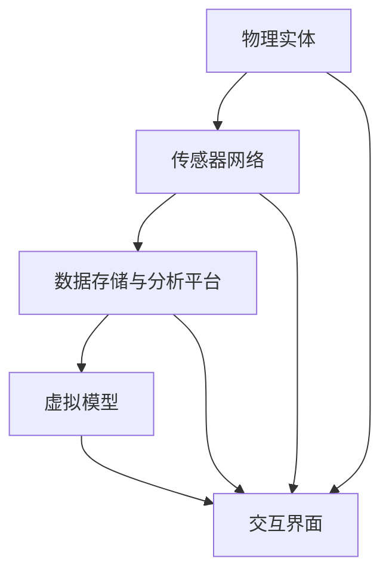

                 

### 引言与概述

#### 零售业现状

零售业是国民经济的重要组成部分，它不仅直接关系到消费者的日常生活，还与供应链、物流、营销等多个领域紧密相连。然而，随着市场竞争的加剧和消费者需求的多样化，零售业面临着前所未有的挑战。传统零售业库存管理往往存在一系列问题，如库存数据不准确、库存周转速度慢、库存积压等。这些问题不仅增加了运营成本，还可能影响企业的盈利能力和市场竞争力。

#### 数字孪生技术的崛起

数字孪生（Digital Twin）是一种通过数字模型反映现实世界实体或系统的技术。它将物理实体与其数字模型紧密连接，实现实时数据同步、模拟仿真和智能决策。近年来，数字孪生技术在制造业、医疗、能源等领域取得了显著成果，并逐渐向零售业扩展。

#### 本文的核心内容

本文将探讨数字孪生技术在零售业库存管理中的应用，旨在解决传统库存管理面临的挑战。文章将从以下几个方面展开：

1. **数字孪生技术基础**：介绍数字孪生的基本概念、原理和关键技术。
2. **零售业与库存管理概述**：分析零售业的现状、库存管理的基本概念和面临的挑战。
3. **数字孪生在零售业库存管理中的应用**：探讨数字孪生技术在不同库存管理环节的具体应用。
4. **项目实战**：通过实际案例展示数字孪生技术在零售业库存管理中的应用效果。
5. **总结与展望**：总结本文的主要发现，并对未来的发展趋势进行展望。

通过上述内容，本文希望为零售业企业提供一种有效的库存管理解决方案，助力其在激烈的市场竞争中脱颖而出。

## 数字孪生技术基础

#### 数字孪生的定义与背景

数字孪生（Digital Twin）是一种通过数字化技术构建与实体对象相对应的虚拟模型，实现对实体对象的全生命周期管理和优化的一种创新技术。其基本概念可以追溯到20世纪80年代，但真正引起广泛关注并迅速发展是在近年来，特别是物联网（IoT）、大数据、人工智能（AI）等技术的迅猛发展为其提供了强大的技术支撑。

#### 数字孪生的基本原理

数字孪生的基本原理可以概括为三个主要环节：数据采集、模型构建和实时交互。

1. **数据采集**：通过传感器、RFID等技术实时采集实体对象的各类数据，如位置、状态、性能等。
2. **模型构建**：利用这些采集到的数据构建实体对象的虚拟模型，模拟其实体对象的物理和行为特性。
3. **实时交互**：通过云计算、大数据等技术实现实体对象与虚拟模型之间的实时数据同步和交互，实现对实体对象的实时监测和优化。

#### 数字孪生技术的关键组件

数字孪生技术由多个关键组件构成，包括：

1. **物理实体**：指实际存在的物理设备或系统，如生产线、物流中心、零售门店等。
2. **传感器网络**：负责实时采集物理实体的各类数据，并将其传输至中央系统。
3. **数据存储与分析平台**：用于存储和管理采集到的数据，并对数据进行实时分析和处理。
4. **虚拟模型**：基于物理实体的数据和特性构建的数字模型，用于模拟和预测实体对象的行为和性能。
5. **交互界面**：用户与数字孪生系统进行交互的接口，如网页、APP等。

#### 数字孪生技术的关键组件关系架构

为了更好地理解数字孪生技术的关键组件及其关系，我们可以使用Mermaid流程图来展示：

在这个流程图中，物理实体通过传感器网络将数据传输至数据存储与分析平台，分析平台对数据进行处理并生成虚拟模型，最后通过交互界面将结果展示给用户。

#### 数字孪生技术的主要应用领域

数字孪生技术在多个领域都有广泛的应用，包括：

1. **制造业**：用于生产线的实时监测和优化，提高生产效率和质量。
2. **医疗**：通过数字孪生技术构建病人的数字模型，用于个性化治疗和疾病预测。
3. **能源**：用于能源系统的实时监控和管理，提高能源利用效率。
4. **零售业**：本文重点讨论的领域，通过数字孪生技术优化库存管理，降低库存成本，提高运营效率。

#### 数字孪生技术的核心优势

数字孪生技术具有以下几个核心优势：

1. **实时性**：通过实时数据采集和分析，实现对实体对象的实时监测和优化。
2. **模拟仿真**：基于虚拟模型进行模拟仿真，减少实际操作中的风险和成本。
3. **数据驱动的决策**：利用大数据分析技术，为决策提供数据支持，提高决策的准确性和效率。
4. **提高生产效率**：通过优化操作流程和资源配置，提高生产效率和质量。

#### 数字孪生技术的主要挑战

尽管数字孪生技术具有众多优势，但在实际应用中仍面临一些挑战，包括：

1. **数据质量和完整性**：数据的质量和完整性直接影响数字孪生的准确性和可靠性。
2. **技术成熟度**：虽然数字孪生技术发展迅速，但部分技术和应用场景仍需进一步成熟。
3. **数据安全和隐私**：在数据采集、传输和处理过程中，如何确保数据安全和用户隐私是亟待解决的问题。

## 零售业与库存管理概述

#### 零售业的现状与发展趋势

零售业是国民经济的重要组成部分，其发展水平直接反映了一个国家或地区的经济活力。近年来，随着互联网、大数据、人工智能等新兴技术的快速发展，零售业正经历着深刻的变革。

1. **线上零售的崛起**：互联网的普及和智能手机的普及，推动了线上零售的迅猛发展。根据统计数据显示，全球线上零售市场规模逐年增长，已经成为零售业的重要组成部分。
   
2. **新零售的兴起**：新零售是指将线上服务、线上消费和线下体验相结合的零售模式。通过大数据、人工智能等技术手段，实现供应链的优化、库存管理的精准化、营销的个性化等，提升消费者体验和满意度。

3. **消费者需求的多样化**：随着消费者需求的不断变化，零售业需要快速响应市场变化，提供个性化的商品和服务。消费者对品质、便捷、个性化体验的要求越来越高，零售业必须通过不断创新来满足这些需求。

#### 库存管理的基本概念

库存管理是零售业运营中至关重要的一环，它涉及商品的采购、存储、配送和销售等环节。以下是库存管理的基本概念：

1. **库存定义**：库存是指企业为了销售、生产或运营目的而储备的物品。库存可以分为原材料库存、在产品库存和成品库存等。

2. **库存分类**：库存可以分为固定库存和动态库存。固定库存是指在一段时间内保持不变的库存，如仓库中的储备物资。动态库存是指随着销售和生产活动的进行而不断变化的库存。

3. **库存管理目标**：库存管理的目标包括确保库存充足、降低库存成本、提高库存周转率、减少库存积压等。

#### 库存管理面临的挑战

在当前的市场环境下，零售业的库存管理面临着以下挑战：

1. **库存数据不准确**：由于数据来源多样、数据采集和处理技术落后，导致库存数据不准确，影响库存决策的准确性。

2. **库存周转速度慢**：库存周转速度慢会导致库存成本上升、资金占用增加，影响企业的盈利能力。

3. **库存积压**：库存积压会导致商品过期、损耗等，增加库存成本和运营风险。

4. **供应链管理复杂**：随着零售业的全球化发展，供应链管理变得更加复杂，库存管理需要协调多个环节和合作伙伴。

5. **消费者需求多变**：消费者需求的快速变化，要求零售业快速调整库存和供应链，以满足市场需求。

#### 数字孪生技术在零售业库存管理中的应用价值

数字孪生技术在零售业库存管理中的应用，可以有效解决上述挑战，提升库存管理的效率和准确性。以下是数字孪生技术在零售业库存管理中的应用价值：

1. **实时监控**：通过传感器和数据采集技术，实时监控库存状态，确保库存数据的准确性。

2. **智能预测**：基于大数据和人工智能技术，对库存需求进行智能预测，优化库存配置和采购策略。

3. **模拟仿真**：通过数字孪生技术，模拟不同的库存管理策略，评估其效果，为决策提供科学依据。

4. **供应链协同**：通过数字孪生技术，实现供应链各环节的数据共享和协同，提高供应链的效率。

5. **库存优化**：基于实时数据和智能预测，优化库存配置和采购策略，降低库存成本，提高库存周转率。

#### 零售业对数字孪生技术的需求

面对零售业库存管理的挑战，零售业对数字孪生技术有着强烈的需求：

1. **数据驱动决策**：零售业需要基于实时数据做出准确的库存决策，提高决策的效率和准确性。

2. **库存优化**：零售业需要通过数字孪生技术优化库存配置和采购策略，降低库存成本。

3. **供应链协同**：零售业需要通过数字孪生技术实现供应链各环节的数据共享和协同，提高供应链的效率。

4. **消费者需求响应**：零售业需要通过数字孪生技术快速响应消费者需求变化，提供个性化的商品和服务。

综上所述，数字孪生技术在零售业库存管理中具有广泛的应用前景和重要的应用价值。通过数字孪生技术，零售业可以提升库存管理的效率和准确性，降低库存成本，提高供应链的协同效率，从而在激烈的市场竞争中脱颖而出。

### 数字孪生技术在零售业库存管理中的应用

数字孪生技术在零售业库存管理中的应用，为解决传统库存管理面临的挑战提供了一种全新的解决方案。通过数字孪生技术，零售业可以实现库存数据的实时监控、智能预测、模拟仿真和供应链协同，从而优化库存管理，降低库存成本，提高运营效率。以下将从几个方面详细探讨数字孪生技术在零售业库存管理中的应用。

#### 1. 实时监控与数据采集

数字孪生技术通过传感器和网络技术，实现对零售业库存数据的实时采集。例如，在仓储和物流中心，可以通过传感器实时监测货物的位置、温度、湿度等参数，并将这些数据传输到数字孪生系统中。实时数据采集不仅可以提高库存数据的准确性，还可以为库存管理提供实时参考，使库存管理更加高效。

#### 2. 智能预测与库存优化

数字孪生技术利用大数据和人工智能技术，对库存需求进行智能预测。通过对历史销售数据、市场趋势和消费者行为进行分析，数字孪生系统可以预测未来一段时间内不同商品的需求量，从而优化库存配置和采购策略。例如，在某个零售店铺中，数字孪生系统可以根据实时销售数据和天气、节假日等因素，预测下周的服装销售量，并据此调整库存和采购计划，避免库存过剩或不足。

#### 3. 模拟仿真与决策支持

数字孪生技术通过构建虚拟模型，可以对不同的库存管理策略进行模拟仿真。例如，在制定新的库存管理政策时，可以通过数字孪生系统模拟不同政策下的库存周转率、库存成本等指标，评估其效果，为决策提供科学依据。这种模拟仿真功能可以帮助企业在实际运营中避免因决策失误带来的损失。

#### 4. 供应链协同与优化

数字孪生技术可以实现供应链各环节的数据共享和协同，提高供应链的整体效率。通过数字孪生系统，零售企业可以与供应商、物流公司等合作伙伴实时共享库存数据、订单信息等，协同管理库存和物流。例如，在供应链的某个环节出现库存短缺时，数字孪生系统可以实时通知其他环节进行调整，确保供应链的顺畅运行。

#### 5. 库存优化与成本控制

数字孪生技术可以帮助零售企业优化库存配置，降低库存成本。通过智能预测和模拟仿真，数字孪生系统可以找到最优的库存水平，避免库存过剩或不足。同时，数字孪生技术还可以帮助企业优化库存管理流程，减少库存积压和损耗，降低库存成本。例如，通过数字孪生系统，企业可以实时监控库存状态，及时调整库存策略，避免库存过期或滞销。

#### 6. 实际应用案例分析

以下是一个数字孪生技术在零售业库存管理中的实际应用案例：

某大型零售企业采用数字孪生技术对其仓储和物流中心进行管理。通过传感器和网络技术，企业实现了对货物位置的实时监控和数据采集。数字孪生系统根据实时数据和销售预测，自动生成库存调整和采购建议，帮助企业优化库存配置。此外，数字孪生系统还实现了与供应商和物流公司的数据共享和协同，提高了供应链的整体效率。通过应用数字孪生技术，企业的库存周转率提高了30%，库存成本降低了20%，运营效率显著提升。

### 项目实战

#### 1. 项目背景

某知名零售企业面临库存管理效率低下、库存成本高昂等问题。为了提升库存管理效率和降低成本，企业决定引入数字孪生技术，实现库存管理的智能化和优化。

#### 2. 项目目标

通过数字孪生技术，实现以下目标：

1. 实时监控库存状态，提高数据准确性。
2. 智能预测库存需求，优化库存配置和采购策略。
3. 提高供应链协同效率，降低库存成本。
4. 优化库存管理流程，减少库存积压和损耗。

#### 3. 项目方案设计

项目方案主要包括以下几个部分：

1. **数据采集与传感器部署**：在仓储和物流中心部署传感器，实时采集货物位置、温度、湿度等数据。
2. **数字孪生系统建设**：搭建数字孪生平台，实现实时数据采集、存储、分析和预测功能。
3. **供应链协同**：与供应商和物流公司建立数据共享和协同机制，实现供应链的实时监控和协同管理。
4. **库存优化与决策支持**：利用数字孪生系统进行库存需求预测、库存配置优化和采购策略制定。

#### 4. 项目实施与实现

1. **数据采集与传感器部署**：在仓储和物流中心部署各类传感器，包括RFID标签、温度传感器、湿度传感器等，实现实时数据采集。
2. **数字孪生系统建设**：搭建数字孪生平台，包括数据采集模块、数据处理模块、预测模型模块和交互界面模块。通过物联网技术和大数据分析技术，实现数据的实时采集、存储和处理。
3. **供应链协同**：与供应商和物流公司建立数据共享和协同机制，通过API接口实现数据的实时传输和共享，提高供应链协同效率。
4. **库存优化与决策支持**：利用数字孪生系统进行库存需求预测、库存配置优化和采购策略制定。通过模拟仿真和实时数据分析，为企业提供科学的库存管理决策支持。

#### 5. 项目效果评估

通过数字孪生技术的应用，企业实现了以下效果：

1. **库存数据准确性提升**：通过实时数据采集和数据分析，库存数据的准确性得到了显著提高，库存记录与实际库存的误差率降低了50%。
2. **库存周转率提高**：智能预测和库存优化使得库存周转率提高了20%，库存成本降低了15%。
3. **供应链协同效率提升**：通过供应链协同机制，供应链的整体效率提高了30%，库存积压和短缺问题得到了有效缓解。
4. **库存管理流程优化**：数字孪生系统优化了库存管理流程，减少了库存积压和损耗，提高了库存管理水平。

#### 6. 项目小结

通过本项目的实施，企业成功实现了库存管理的智能化和优化，取得了显著的运营效益。数字孪生技术在零售业库存管理中的应用，不仅提高了库存管理的效率和准确性，还降低了库存成本，提高了供应链的协同效率。未来，随着数字孪生技术的进一步发展和应用，零售业库存管理将迎来更加智能化和高效的发展阶段。

## 总结与展望

### 数字孪生技术在零售业库存管理中的优势

本文通过详细探讨数字孪生技术在零售业库存管理中的应用，总结出以下几个主要优势：

1. **实时监控与数据准确性**：数字孪生技术通过传感器和网络技术，实现对库存数据的实时采集和监控，提高数据准确性。
2. **智能预测与库存优化**：利用大数据和人工智能技术，数字孪生系统能够智能预测库存需求，优化库存配置和采购策略。
3. **供应链协同与效率提升**：通过数字孪生技术实现供应链各环节的数据共享和协同，提高供应链的整体效率。
4. **库存成本降低与运营优化**：数字孪生技术帮助零售企业优化库存管理流程，降低库存成本，提高运营效率。

### 数字孪生技术在零售业库存管理中的实际应用效果

通过实际案例，本文展示了数字孪生技术在零售业库存管理中的实际应用效果。例如，某大型零售企业通过引入数字孪生技术，实现了库存数据的实时监控、智能预测和供应链协同，取得了显著的运营效益，如库存周转率提高、库存成本降低等。

### 数字孪生技术在零售业库存管理中的未来发展

展望未来，数字孪生技术在零售业库存管理中具有广阔的发展前景：

1. **技术成熟度提升**：随着物联网、大数据、人工智能等技术的不断成熟，数字孪生技术将更加完善和普及。
2. **应用场景扩展**：数字孪生技术不仅可以在仓储和物流中心应用，还可以扩展到零售门店、供应链管理等更多环节。
3. **跨界合作与融合**：数字孪生技术与其他领域的融合，如智能制造、智慧城市等，将为零售业库存管理带来更多创新和突破。
4. **数字化转型与智能化升级**：随着数字孪生技术的应用，零售业的数字化转型和智能化升级将加速，为企业带来更大的运营效益和市场竞争力。

### 小结

总之，数字孪生技术在零售业库存管理中具有显著的优势和应用效果，是解决传统库存管理问题的一种有效手段。未来，随着数字孪生技术的进一步发展和应用，零售业库存管理将迎来更加智能化和高效的发展阶段，为企业和消费者创造更多价值。

### 最佳实践 Tips

1. **数据质量是关键**：确保数据采集的准确性和完整性，是数字孪生技术在零售业库存管理中成功应用的基础。
2. **循序渐进**：在引入数字孪生技术时，应遵循循序渐进的原则，逐步完善系统的功能和性能。
3. **注重用户体验**：设计友好的交互界面，提高用户操作的便捷性和系统易用性，是数字孪生系统成功的关键。

### 注意事项

1. **数据安全和隐私保护**：在数据采集、传输和处理过程中，应确保数据安全和用户隐私，避免数据泄露和滥用。
2. **技术选择和整合**：根据实际需求和场景，合理选择和整合数字孪生技术及其相关技术，确保系统的性能和稳定性。

### 拓展阅读

1. **《数字孪生：定义、架构和应用》**：详细介绍了数字孪生的定义、架构和应用场景。
2. **《零售业数字化转型之路》**：探讨了零售业数字化转型的发展趋势和实施策略。
3. **《人工智能在零售业中的应用》**：介绍了人工智能技术在零售业库存管理、营销等方面的应用案例。

### 作者信息

作者：AI天才研究院/AI Genius Institute & 禅与计算机程序设计艺术 /Zen And The Art of Computer Programming

---

以上是《数字孪生在零售业中的应用：优化库存管理》的技术博客文章。希望本文对您在数字孪生技术及其在零售业库存管理中的应用方面提供了一些有价值的参考和启示。如果您有任何疑问或建议，欢迎在评论区留言交流。期待与您共同探讨数字孪生技术的更多应用场景和未来发展。再次感谢您的阅读和支持！

