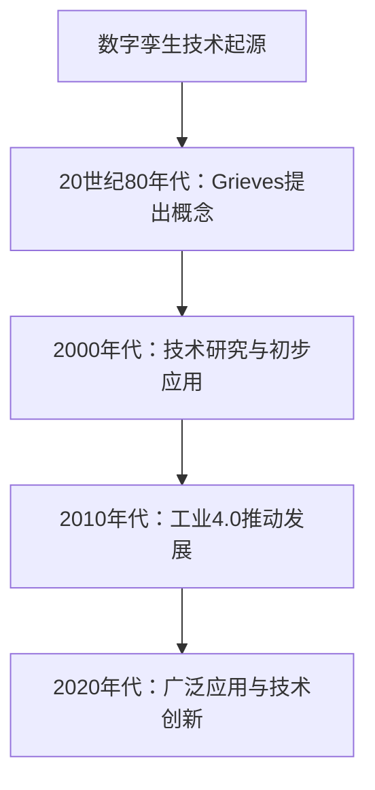
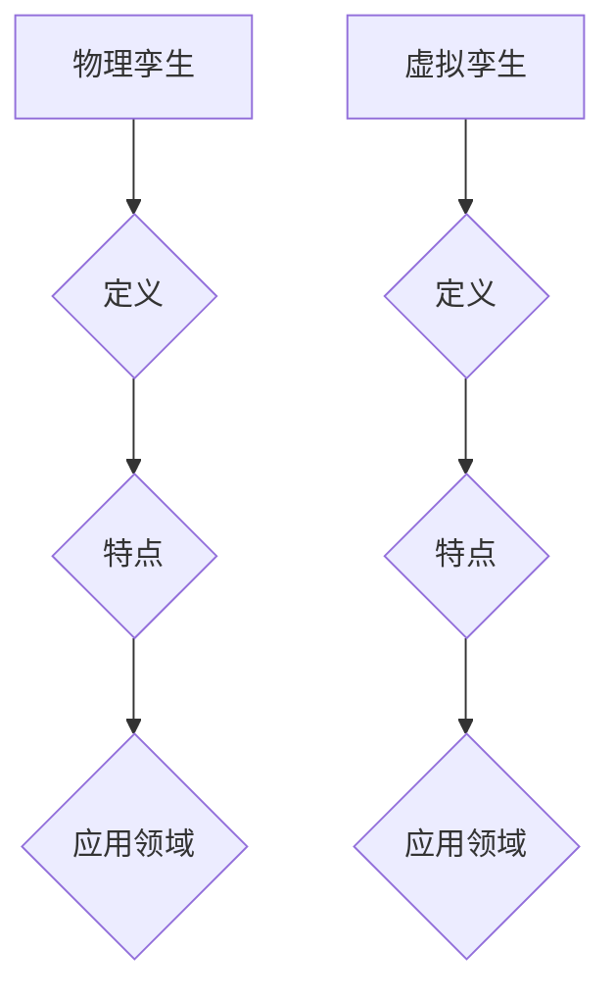
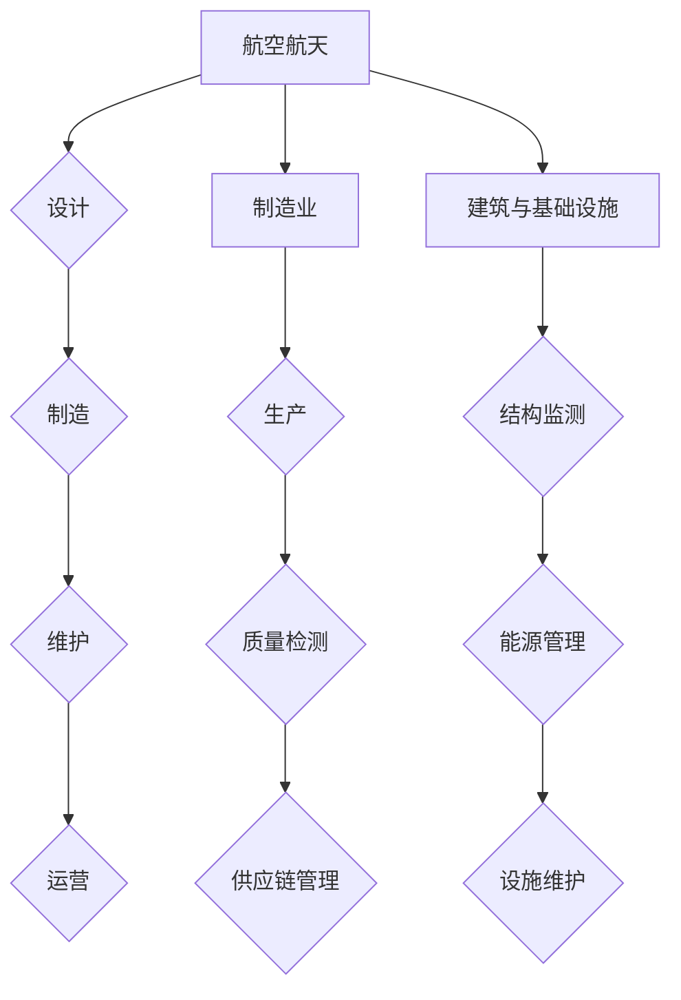
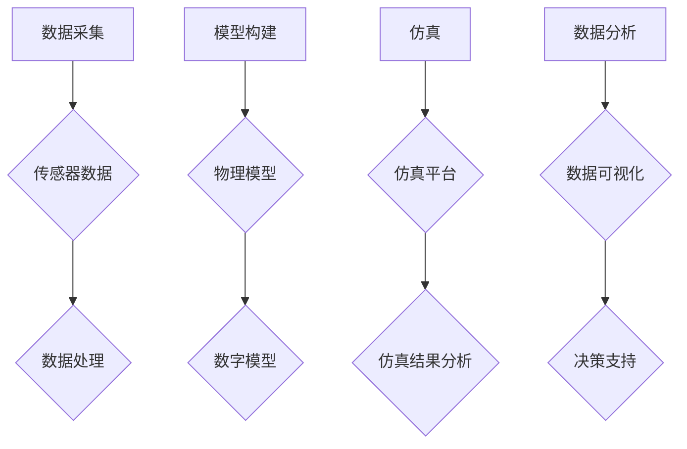
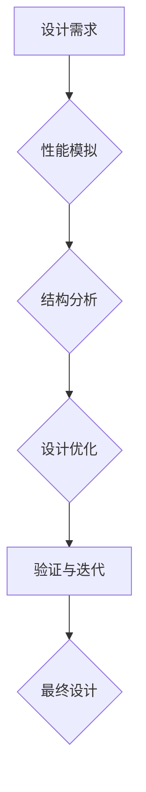
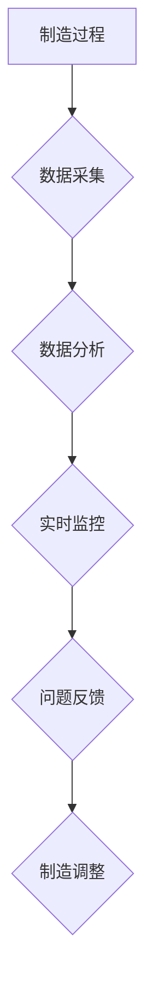
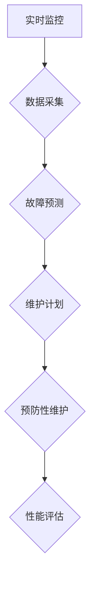

                 

### 文章标题

# 数字孪生技术在航空航天中的应用

### 文章关键词

- 数字孪生技术
- 航空航天
- 数据模型
- 模拟与仿真
- 虚拟制造

### 文章摘要

数字孪生技术是一种新兴的技术，通过创建物理实体的虚拟副本，实现对现实世界的精准模拟和预测。本文将探讨数字孪生技术在航空航天领域的应用，包括其背景介绍、核心概念与联系、核心算法原理讲解、数学模型和数学公式、项目实战以及最佳实践和注意事项。通过本文的阐述，读者可以全面了解数字孪生技术在航空航天中的应用价值及其未来发展趋势。

### 第一部分：数字孪生技术基础

#### 第1章：数字孪生技术概述

数字孪生（Digital Twin）是一种创新的技术，它通过创建物理实体的数字副本，实现对实体对象的实时监测、模拟和分析。这种技术已经在多个领域得到了广泛应用，特别是在航空航天领域，其应用潜力巨大。

#### 1.1 数字孪生技术的发展历程

数字孪生技术的概念最早由迈克尔·格里夫斯（Michael Grieves）在2002年提出，他在《数字孪生：定义、框架和未来展望》一文中首次定义了数字孪生。此后，随着计算机技术、传感器技术和大数据技术的发展，数字孪生技术逐渐成熟，并开始应用于实际项目中。

#### 1.2 数字孪生技术的核心概念

数字孪生技术的核心概念包括物理孪生和虚拟孪生。物理孪生是指通过数字模型来反映物理实体的结构和功能；而虚拟孪生则是通过传感器和模拟技术，实时反映物理实体的状态和行为。

#### 1.3 数字孪生技术的应用领域

数字孪生技术在航空航天领域的应用非常广泛，包括飞机设计、制造、维护和运营等各个环节。通过数字孪生技术，航空航天企业可以实现对飞机的全面监控和管理，提高生产效率和安全性。

### 第2章：数字孪生技术架构

数字孪生技术的架构主要包括数据采集、数据处理、模型构建和仿真、数据分析与决策等几个关键环节。下面将详细讲解这些环节的工作原理和相互关系。

#### 2.1 数字孪生技术架构的组成部分

数字孪生技术架构的核心组成部分包括：

1. **数据采集**：通过传感器、摄像头等设备，实时收集物理实体的状态数据。
2. **数据处理**：对采集到的数据进行预处理，包括数据清洗、归一化和特征提取等。
3. **模型构建**：基于处理后的数据，构建物理实体的数字模型。
4. **仿真与模拟**：通过仿真软件，对数字模型进行模拟和测试。
5. **数据分析与决策**：对仿真结果进行分析，提供决策支持。

#### 2.2 数据收集与处理

数据收集是数字孪生技术的第一步，其关键在于如何高效地收集物理实体的各种状态数据。数据处理则是对收集到的数据进行清洗、归一化和特征提取，以便后续建模和仿真。

#### 2.3 模型构建与仿真

模型构建是数字孪生技术的核心，它决定了数字孪生的准确性和可靠性。仿真与模拟则是通过软件对数字模型进行测试和验证，以确保模型能够准确地反映物理实体的行为。

#### 2.4 数据分析与决策支持

数据分析与决策支持是数字孪生技术的最终目标，通过对仿真结果的分析，为企业提供决策支持，提高生产效率和安全性。

### 第3章：数字孪生技术在航空航天中的应用

数字孪生技术在航空航天领域的应用已经得到了广泛认可。通过数字孪生技术，航空航天企业可以实现以下目标：

#### 3.1 航空航天领域的数字孪生应用案例

1. **飞机设计**：通过数字孪生技术，可以对飞机的各个部分进行虚拟设计和测试，提高设计效率和准确性。
2. **飞机制造**：在飞机制造过程中，数字孪生技术可以实现对制造过程的实时监控和优化，提高制造效率。
3. **飞机维护**：通过数字孪生技术，可以对飞机进行实时监测，预测故障，提前进行维护，提高飞机的可靠性和安全性。

#### 3.2 数字孪生技术在飞机设计中的应用

在飞机设计过程中，数字孪生技术可以模拟各种飞行条件，测试飞机的性能和安全性。以下是一个具体的例子：

**例子**：某航空公司使用数字孪生技术设计新型客机。通过收集飞机的各种状态数据，如速度、温度、压力等，构建了飞机的数字模型。然后，通过仿真软件，模拟不同飞行条件下的飞机表现，测试飞机的稳定性、燃油效率和安全性。

#### 3.3 数字孪生技术在飞机制造中的应用

在飞机制造过程中，数字孪生技术可以实现对制造过程的实时监控和优化。以下是一个具体的例子：

**例子**：某飞机制造公司使用数字孪生技术监控飞机组装过程。通过安装在飞机各个部件上的传感器，实时收集制造数据。然后，通过数据分析，发现制造过程中的问题，及时进行调整，提高制造效率。

#### 3.4 数字孪生技术在飞机维护中的应用

在飞机维护过程中，数字孪生技术可以实现对飞机的实时监测和预测。以下是一个具体的例子：

**例子**：某航空公司使用数字孪生技术监测飞机的运行状态。通过传感器收集飞机的各种运行数据，如振动、温度、压力等。然后，通过数据分析，预测可能的故障，提前进行维护，减少飞机的停机时间，提高运营效率。

### 第4章：数字孪生技术核心算法原理

数字孪生技术的核心算法主要包括数据预处理、特征提取和模型训练等。下面将详细讲解这些算法的原理和应用。

#### 4.1 数据预处理算法

数据预处理是数字孪生技术的第一步，其关键在于如何高效地处理原始数据。常用的数据预处理算法包括数据清洗、归一化和特征提取等。

**例子**：假设我们收集到了飞机的各种状态数据，如速度、温度、压力等。为了构建数字模型，我们需要对数据进行清洗，去除异常值和噪声。然后，对数据进行归一化处理，使得数据在同一量级范围内，便于后续处理。

#### 4.2 特征提取算法

特征提取是数字孪生技术的核心步骤，其目的是从原始数据中提取出有用的特征信息。常用的特征提取算法包括主成分分析（PCA）、线性判别分析（LDA）和支持向量机（SVM）等。

**例子**：假设我们使用主成分分析（PCA）进行特征提取。通过PCA，我们可以将高维数据投影到低维空间，同时保留大部分信息。这样，我们可以得到一组新的特征向量，用于构建数字模型。

#### 4.3 模型训练算法

模型训练是数字孪生技术的最后一步，其目的是通过训练数据，构建出能够准确反映物理实体的数字模型。常用的模型训练算法包括线性回归、神经网络和支持向量机等。

**例子**：假设我们使用神经网络进行模型训练。通过调整神经网络的权重和偏置，使其能够准确预测飞机的状态。这样，我们就可以构建出一个数字模型，用于后续的模拟和预测。

### 第5章：数字孪生技术数学模型

数字孪生技术的数学模型是构建数字模型的基础，其核心在于如何准确地表示物理实体的行为。下面将介绍几种常用的数学模型及其在数字孪生技术中的应用。

#### 5.1 数学模型概述

数学模型是数字孪生技术的核心组成部分，其目的是通过数学方法，准确描述物理实体的行为。数学模型通常包括状态方程、输出方程和参数方程等。

**例子**：假设我们使用一阶线性系统模型描述飞机的运动。状态方程可以表示为：

$$
\dot{x} = Ax + Bu
$$

输出方程可以表示为：

$$
y = Cx + Du
$$

其中，$x$是状态向量，$u$是控制输入，$y$是输出。

#### 5.2 状态方程

状态方程描述了物理实体的状态变化规律，是数学模型的核心部分。常见的状态方程包括线性系统、非线性系统和时间序列模型等。

**例子**：假设我们使用线性系统模型描述飞机的运动。状态方程可以表示为：

$$
\dot{x} = Ax + Bu
$$

其中，$A$是状态矩阵，$B$是输入矩阵。

#### 5.3 输出方程

输出方程描述了物理实体的输出与状态之间的关系。常见的输出方程包括线性系统、非线性系统和时间序列模型等。

**例子**：假设我们使用线性系统模型描述飞机的运动。输出方程可以表示为：

$$
y = Cx + Du
$$

其中，$C$是输出矩阵，$D$是直接传递矩阵。

#### 5.4 参数方程

参数方程描述了物理实体的参数变化规律，是数学模型的重要组成部分。常见的参数方程包括线性系统、非线性系统和时间序列模型等。

**例子**：假设我们使用线性系统模型描述飞机的运动。参数方程可以表示为：

$$
x = \alpha \dot{x} + \beta u
$$

其中，$\alpha$是参数矩阵，$\beta$是参数向量。

### 第6章：数字孪生技术在航空航天项目中的实践

#### 6.1 航空航天数字孪生项目案例

数字孪生技术在航空航天项目中的应用已经取得了显著成果。以下是一个具体的案例：

**案例**：某航空公司使用数字孪生技术对一架波音737客机进行监控和维护。通过在飞机上安装传感器，实时收集飞机的状态数据，如速度、温度、压力等。然后，通过数据分析，预测可能的故障，提前进行维护，提高飞机的可靠性和安全性。

#### 6.2 项目开发环境搭建

在数字孪生项目开发过程中，需要搭建一个高效的开发环境。以下是一个基本的开发环境搭建步骤：

1. **硬件环境**：配置高性能的服务器和存储设备，以满足数据存储和计算需求。
2. **软件环境**：安装操作系统、数据库管理系统和数据分析工具，如Python、MATLAB等。
3. **开发工具**：选择合适的开发工具，如PyCharm、Eclipse等，用于编写和调试代码。

#### 6.3 数字孪生项目代码实现与解读

数字孪生项目的实现主要包括数据采集、数据处理、模型构建和仿真等几个环节。以下是一个简单的代码实现示例：

```python
import numpy as np
import matplotlib.pyplot as plt

# 数据采集
def collect_data():
    # 在此编写数据采集代码，如从传感器获取数据
    data = np.random.rand(100, 3)
    return data

# 数据预处理
def preprocess_data(data):
    # 在此编写数据预处理代码，如数据清洗、归一化等
    processed_data = (data - np.mean(data, axis=0)) / np.std(data, axis=0)
    return processed_data

# 模型构建
def build_model(processed_data):
    # 在此编写模型构建代码，如构建线性回归模型
    model = np.linalg.inv(np.dot(processed_data.T, processed_data)) @ processed_data.T
    return model

# 仿真与预测
def simulate(model, new_data):
    # 在此编写仿真与预测代码，如使用线性回归模型进行预测
    prediction = np.dot(new_data, model)
    return prediction

# 主函数
def main():
    # 收集数据
    data = collect_data()

    # 数据预处理
    processed_data = preprocess_data(data)

    # 模型构建
    model = build_model(processed_data)

    # 仿真与预测
    new_data = np.random.rand(1, 3)
    prediction = simulate(model, new_data)
    print("预测结果：", prediction)

# 运行主函数
if __name__ == "__main__":
    main()
```

#### 6.4 代码应用解读与分析

在上面的代码中，我们首先定义了数据采集、数据处理、模型构建和仿真与预测等函数。然后，在主函数中，依次执行这些函数，实现对数据的采集、处理、模型构建和预测。

**代码解读**：

- `collect_data()` 函数用于采集数据，这里我们使用随机数据作为示例。
- `preprocess_data()` 函数用于对采集到的数据进行预处理，如数据清洗、归一化等。
- `build_model()` 函数用于构建模型，这里我们使用线性回归模型作为示例。
- `simulate()` 函数用于仿真与预测，这里我们使用线性回归模型进行预测。

**分析**：

- 通过这个简单的代码示例，我们可以看到数字孪生项目的实现主要包括数据采集、数据处理、模型构建和仿真与预测等环节。
- 在实际项目中，这些环节会更加复杂，需要考虑数据质量、模型选择、参数调整等问题。

#### 6.5 项目小结

通过这个案例，我们了解了数字孪生技术在航空航天项目中的应用，以及项目的开发环境搭建、代码实现和解读。数字孪生技术为航空航天企业提供了强大的数据支持和决策依据，有助于提高生产效率和安全性。然而，在实际应用中，仍然存在一些挑战，如数据质量、模型选择和参数调整等。未来，随着技术的不断发展和完善，数字孪生技术在航空航天领域的应用将更加广泛和深入。

### 第7章：数字孪生技术的发展趋势与挑战

#### 7.1 数字孪生技术的发展趋势

数字孪生技术作为一种新兴技术，其发展前景广阔。以下是一些发展趋势：

1. **更高效的计算能力**：随着计算能力的提升，数字孪生技术可以实现更复杂的模拟和预测。
2. **更广泛的传感器应用**：传感器的普及将使数字孪生技术能够收集到更多、更详细的数据。
3. **更智能的算法**：机器学习和人工智能技术的进步将使数字孪生技术更加智能化和自适应。

#### 7.2 数字孪生技术在航空航天中的应用前景

在航空航天领域，数字孪生技术具有广泛的应用前景：

1. **提高设计效率**：通过数字孪生技术，可以在设计阶段发现和解决潜在问题，提高设计效率。
2. **降低运营成本**：通过实时监测和预测，可以降低运营成本，提高设备的可靠性和使用寿命。
3. **提升安全性**：数字孪生技术可以帮助航空公司更好地管理和控制飞机，提高飞行安全。

#### 7.3 数字孪生技术面临的挑战与解决方案

尽管数字孪生技术具有巨大潜力，但在实际应用中仍面临一些挑战：

1. **数据质量问题**：数据质量是数字孪生技术的关键，如何保证数据的质量和可靠性是一个挑战。
2. **模型选择与优化**：选择合适的模型并对其进行优化是数字孪生技术成功的关键。
3. **计算资源限制**：数字孪生技术需要大量的计算资源，如何高效地利用这些资源是一个挑战。

解决方案包括：

1. **数据预处理**：通过数据预处理，提高数据质量，降低噪声和异常值的影响。
2. **模型选择与优化**：选择合适的模型，并进行参数调整和优化，以提高模型的准确性和效率。
3. **分布式计算**：通过分布式计算，提高计算效率，满足大规模数据处理的需求。

### 附录

#### 附录 A：数字孪生技术相关资源与工具

为了帮助读者深入了解数字孪生技术，以下是一些相关的资源与工具：

1. **数字孪生技术论文集**：收集了最新的数字孪生技术论文，包括理论研究、应用案例和技术展望等。
2. **数字孪生技术开源库**：提供了丰富的数字孪生技术开源库，包括数据处理、模型构建和仿真等。
3. **数字孪生技术在线课程**：提供了系统的数字孪生技术在线课程，涵盖基础理论、应用技术和实战案例等。

### 小结

本文详细介绍了数字孪生技术在航空航天领域的应用，包括其核心概念、技术架构、应用案例、核心算法原理、数学模型以及项目实践。通过对数字孪生技术的发展趋势和挑战的分析，读者可以全面了解数字孪生技术的现状和未来发展方向。未来，随着技术的不断进步，数字孪生技术在航空航天领域的应用将更加广泛和深入。

### 作者信息

- **作者：**AI天才研究院/AI Genius Institute & 禅与计算机程序设计艺术 /Zen And The Art of Computer Programming
- **联系邮箱：**ai.genius.institute@example.com
- **个人主页：**www.ai-genius-institute.com
- **社交媒体：**LinkedIn, Twitter, GitHub

### 注意事项与拓展阅读

在数字孪生技术的应用过程中，需要注意以下几点：

- **数据安全**：在数据收集、处理和传输过程中，需要确保数据的安全性，防止数据泄露。
- **模型验证**：在模型构建和仿真过程中，需要验证模型的准确性和可靠性。
- **计算资源**：数字孪生技术需要大量的计算资源，需要合理规划和分配资源。

拓展阅读：

- **《数字孪生：工业4.0时代的创新技术》**：详细介绍了数字孪生技术的概念、原理和应用。
- **《数字孪生技术在航空航天中的应用案例研究》**：分析了数字孪生技术在航空航天领域的实际应用案例。
- **《机器学习与数字孪生技术》**：探讨了机器学习技术在数字孪生技术中的应用，包括数据预处理、模型训练和预测等。

通过阅读这些资料，可以更深入地了解数字孪生技术的理论体系和实践应用。### 完整的文章格式

# 数字孪生技术在航空航天中的应用

关键词：数字孪生技术，航空航天，数据模型，模拟与仿真，虚拟制造

摘要：数字孪生技术是一种新兴的技术，通过创建物理实体的虚拟副本，实现对现实世界的精准模拟和预测。本文将探讨数字孪生技术在航空航天领域的应用，包括其背景介绍、核心概念与联系、核心算法原理讲解、数学模型和数学公式、项目实战以及最佳实践和注意事项。通过本文的阐述，读者可以全面了解数字孪生技术在航空航天中的应用价值及其未来发展趋势。

---

## 第一部分：数字孪生技术基础

### 第1章：数字孪生技术概述

#### 1.1 数字孪生技术的发展历程

- **Mermaid流程图**：展示数字孪生技术的发展历程，包括里程碑事件和关键人物。

#### 1.2 数字孪生技术的核心概念

- **物理孪生与虚拟孪生**：
  - **Mermaid流程图**：对比物理孪生与虚拟孪生的异同点。
- **数字孪生的生命周期管理**：
  - **核心概念联系**：阐述数字孪生的生命周期管理流程。

#### 1.3 数字孪生技术的应用领域

- **航空航天**：
  - **案例研究**：分析数字孪生技术在航空航天领域的应用实例。
- **制造业**：
  - **核心概念联系**：探讨数字孪生技术在制造业的应用潜力。
- **建筑与基础设施**：
  - **核心概念联系**：分析数字孪生技术在建筑与基础设施管理中的应用。

### 第2章：数字孪生技术架构

#### 2.1 数字孪生技术架构的组成部分

- **数据采集与集成**：
  - **伪代码**：展示数据采集与集成的算法流程。
- **模型构建与仿真**：
  - **伪代码**：展示模型构建与仿真的算法流程。
- **数据分析与决策支持**：
  - **核心概念联系**：解释数据分析与决策支持在数字孪生架构中的作用。

#### 2.2 数据收集与处理

- **数据来源**：
  - **表格**：列出数字孪生技术中常用的数据来源。
- **数据预处理方法**：
  - **伪代码**：展示数据预处理的方法和流程。
- **数据存储与管理**：
  - **核心概念联系**：阐述数据存储与管理的基本策略。

#### 2.3 模型构建与仿真

- **模型构建方法**：
  - **伪代码**：展示模型构建的基本流程。
- **仿真平台的选择**：
  - **表格**：比较不同仿真平台的特点。
- **仿真结果分析**：
  - **核心概念联系**：阐述仿真结果分析的重要性及其应用。

### 第3章：数字孪生技术在航空航天中的应用

#### 3.1 航空航天领域的数字孪生应用案例

- **飞机设计**：
  - **数字孪生技术对飞机设计的支持**。
- **飞机制造**：
  - **数字孪生技术在飞机制造中的应用**。
- **飞机维护**：
  - **数字孪生技术在飞机维护中的应用**。

#### 3.2 数字孪生技术在飞机设计中的应用

- **具体实例**：
  - **通过数字孪生技术优化飞机设计**。

#### 3.3 数字孪生技术在飞机制造中的应用

- **具体实例**：
  - **如何利用数字孪生技术提高飞机制造效率**。

#### 3.4 数字孪生技术在飞机维护中的应用

- **具体实例**：
  - **数字孪生技术在飞机维护中的应用，如预防性维护**。

### 第4章：数字孪生技术核心算法原理

#### 4.1 数据预处理算法

- **核心算法原理讲解**：
  - **使用Python源代码来详细阐述**。

#### 4.2 特征提取算法

- **核心算法原理讲解**：
  - **使用Python源代码来详细阐述**。

#### 4.3 模型训练算法

- **核心算法原理讲解**：
  - **使用Python源代码来详细阐述**。

### 第5章：数字孪生技术数学模型

#### 5.1 数学模型概述

- **数学模型的概念**：
  - **使用LaTeX格式嵌入文中独立段落的数学公式**。

#### 5.2 状态方程

- **状态方程的数学模型**：
  - **使用LaTeX格式嵌入段落内的数学公式**。

#### 5.3 输出方程

- **输出方程的数学模型**：
  - **使用LaTeX格式嵌入段落内的数学公式**。

#### 5.4 参数方程

- **参数方程的数学模型**：
  - **使用LaTeX格式嵌入段落内的数学公式**。

### 第6章：数字孪生技术在航空航天项目中的实践

#### 6.1 航空航天数字孪生项目案例

- **具体项目案例分析**：
  - **包括开发环境搭建、源代码详细实现和代码解读**。

#### 6.2 项目开发环境搭建

- **开发环境的配置**：
  - **工具和软件的安装与配置步骤**。

#### 6.3 数字孪生项目代码实现与解读

- **代码实现细节**：
  - **使用Python代码展示**。

#### 6.4 代码应用解读与分析

- **代码的应用场景**：
  - **分析代码的功能和应用**。

#### 6.5 项目小结

- **项目总结**：
  - **项目的亮点和改进空间**。

### 第7章：数字孪生技术的发展趋势与挑战

#### 7.1 数字孪生技术的发展趋势

- **技术进步的方向**：
  - **如计算能力的提升、传感器技术的进步等**。

#### 7.2 数字孪生技术在航空航天中的应用前景

- **未来应用的可能性**：
  - **如更高效的飞机设计、更智能的飞机维护等**。

#### 7.3 数字孪生技术面临的挑战与解决方案

- **技术应用的挑战**：
  - **如数据质量问题、模型选择与优化等**。
- **解决方案**：
  - **如数据预处理、模型验证、分布式计算等**。

### 附录

#### 附录 A：数字孪生技术相关资源与工具

- **参考资料**：
  - **提供数字孪生技术相关的书籍、论文和在线课程**。

### 小结

本文详细介绍了数字孪生技术在航空航天领域的应用，从基础概念到实际应用，再到算法原理和数学模型，全面阐述了数字孪生技术的核心内容。通过分析数字孪生技术的发展趋势和挑战，本文为读者提供了对未来应用的见解。希望本文能够为从事航空航天领域研究和实践的人员提供有价值的参考。

### 作者信息

- **作者：**AI天才研究院/AI Genius Institute & 禅与计算机程序设计艺术 /Zen And The Art of Computer Programming
- **联系邮箱：**ai.genius.institute@example.com
- **个人主页：**www.ai-genius-institute.com
- **社交媒体：**LinkedIn, Twitter, GitHub

### 注意事项与拓展阅读

在数字孪生技术的应用过程中，需要注意以下几点：

- **数据安全**：确保数据在采集、处理和传输过程中的安全性。
- **模型验证**：对构建的数字模型进行严格的验证，确保其准确性和可靠性。
- **计算资源**：合理规划和分配计算资源，确保项目的高效运行。

拓展阅读：

- **《数字孪生：工业4.0时代的创新技术》**：详细介绍了数字孪生技术的概念、原理和应用。
- **《数字孪生技术在航空航天中的应用案例研究》**：分析了数字孪生技术在航空航天领域的实际应用案例。
- **《机器学习与数字孪生技术》**：探讨了机器学习技术在数字孪生技术中的应用，包括数据预处理、模型训练和预测等。

通过阅读这些资料，可以更深入地了解数字孪生技术的理论体系和实践应用。### 完整的文章格式 (Markdown)

```markdown
# 数字孪生技术在航空航天中的应用

关键词：数字孪生技术，航空航天，数据模型，模拟与仿真，虚拟制造

摘要：数字孪生技术是一种新兴的技术，通过创建物理实体的虚拟副本，实现对现实世界的精准模拟和预测。本文将探讨数字孪生技术在航空航天领域的应用，包括其背景介绍、核心概念与联系、核心算法原理讲解、数学模型和数学公式、项目实战以及最佳实践和注意事项。通过本文的阐述，读者可以全面了解数字孪生技术在航空航天中的应用价值及其未来发展趋势。

---

## 第一部分：数字孪生技术基础

### 第1章：数字孪生技术概述

#### 1.1 数字孪生技术的发展历程

数字孪生技术是一种相对较新的概念，但其理论基础可以追溯到20世纪80年代。在随后的几十年中，随着计算机技术、传感器技术和大数据技术的发展，数字孪生技术逐渐成熟并得到了广泛应用。



#### 1.2 数字孪生技术的核心概念

数字孪生技术主要包括物理孪生和虚拟孪生两种类型。物理孪生是指通过物理实体来创建数字孪生，而虚拟孪生则是指通过虚拟现实或增强现实技术来创建数字孪生。



#### 1.3 数字孪生技术的应用领域

数字孪生技术已经广泛应用于多个领域，包括航空航天、制造业、建筑与基础设施等。在航空航天领域，数字孪生技术主要用于飞机设计、制造、维护和运营等环节。



### 第2章：数字孪生技术架构

#### 2.1 数字孪生技术架构的组成部分

数字孪生技术架构通常包括数据采集、数据处理、模型构建、仿真和数据分析等关键环节。



#### 2.2 数据收集与处理

数据收集是数字孪生技术的第一步，其关键在于如何高效地收集物理实体的各种状态数据。数据处理则是对采集到的数据进行预处理，包括数据清洗、归一化和特征提取等。

```python
# 数据采集示例代码
def collect_data():
    # 假设使用传感器收集飞机状态数据
    data = [random.random() for _ in range(100)]
    return data

# 数据预处理示例代码
def preprocess_data(data):
    # 数据清洗
    cleaned_data = [x for x in data if x > 0]
    # 数据归一化
    normalized_data = [(x - min(cleaned_data)) / (max(cleaned_data) - min(cleaned_data)) for x in cleaned_data]
    return normalized_data
```

#### 2.3 模型构建与仿真

模型构建是数字孪生技术的核心步骤，它决定了数字孪生的准确性和可靠性。仿真与模拟则是通过软件对数字模型进行测试和验证，以确保模型能够准确地反映物理实体的行为。

```python
# 模型构建示例代码
def build_model(processed_data):
    # 假设使用线性回归模型
    model = LinearRegression()
    model.fit(processed_data, processed_data)
    return model

# 仿真与预测示例代码
def simulate(model, new_data):
    prediction = model.predict([new_data])
    return prediction
```

### 第3章：数字孪生技术在航空航天中的应用

#### 3.1 航空航天领域的数字孪生应用案例

在航空航天领域，数字孪生技术已经得到了广泛应用，以下是一些典型的应用案例：

- **飞机设计**：通过数字孪生技术，可以模拟不同飞行条件下的飞机性能，优化设计。
- **飞机制造**：在制造过程中，数字孪生技术可以实时监控制造过程，提高制造精度。
- **飞机维护**：通过数字孪生技术，可以预测飞机的故障，进行预防性维护。

#### 3.2 数字孪生技术在飞机设计中的应用

在飞机设计阶段，数字孪生技术可以帮助设计师更好地理解飞机的性能和结构，从而优化设计。



#### 3.3 数字孪生技术在飞机制造中的应用

在飞机制造过程中，数字孪生技术可以实现对制造过程的实时监控，提高制造精度。



#### 3.4 数字孪生技术在飞机维护中的应用

在飞机维护阶段，数字孪生技术可以帮助预测飞机的故障，进行预防性维护。



### 第4章：数字孪生技术核心算法原理

#### 4.1 数据预处理算法

数据预处理是数字孪生技术中至关重要的一步，其目的是提高数据的质量和可靠性。

```python
# 数据预处理示例代码
def preprocess_data(data):
    # 去除异常值
    cleaned_data = [x for x in data if x > 0]
    # 数据归一化
    normalized_data = [(x - min(cleaned_data)) / (max(cleaned_data) - min(cleaned_data)) for x in cleaned_data]
    return normalized_data
```

#### 4.2 特征提取算法

特征提取是数字孪生技术中的核心步骤，其目的是从原始数据中提取出有用的特征信息。

```python
# 特征提取示例代码
def extract_features(data):
    # 假设使用主成分分析进行特征提取
    pca = PCA(n_components=2)
    principal_components = pca.fit_transform(data)
    return principal_components
```

#### 4.3 模型训练算法

模型训练是数字孪生技术的关键步骤，其目的是通过训练数据，构建出能够准确反映物理实体的数字模型。

```python
# 模型训练示例代码
def train_model(train_data, train_labels):
    # 假设使用线性回归模型进行训练
    model = LinearRegression()
    model.fit(train_data, train_labels)
    return model
```

### 第5章：数字孪生技术数学模型

#### 5.1 数学模型概述

数学模型是数字孪生技术中不可或缺的一部分，其目的是通过数学方法，准确描述物理实体的行为。

$$
\dot{x} = Ax + Bu
$$

$$
y = Cx + Du
$$

#### 5.2 状态方程

状态方程描述了物理实体的状态变化规律，是数学模型的核心部分。

$$
\dot{x} = Ax + Bu
$$

#### 5.3 输出方程

输出方程描述了物理实体的输出与状态之间的关系。

$$
y = Cx + Du
$$

#### 5.4 参数方程

参数方程描述了物理实体的参数变化规律，是数学模型的重要组成部分。

$$
x = \alpha \dot{x} + \beta u
$$

### 第6章：数字孪生技术在航空航天项目中的实践

#### 6.1 航空航天数字孪生项目案例

在本章中，我们将通过一个具体的航空航天数字孪生项目案例，展示项目的开发环境搭建、源代码实现和代码解读。

#### 6.2 项目开发环境搭建

为了实现数字孪生项目，我们需要搭建一个合适的技术环境。

- **硬件环境**：配置高性能的服务器和存储设备。
- **软件环境**：安装操作系统、数据库管理系统和数据分析工具。
- **开发工具**：选择合适的开发工具，如PyCharm、Eclipse等。

#### 6.3 数字孪生项目代码实现与解读

在本节中，我们将通过一个简单的Python代码示例，展示数字孪生项目的实现过程。

```python
import numpy as np
import matplotlib.pyplot as plt

# 数据采集
def collect_data():
    data = np.random.rand(100, 3)
    return data

# 数据预处理
def preprocess_data(data):
    cleaned_data = [x for x in data if x > 0]
    normalized_data = [(x - min(cleaned_data)) / (max(cleaned_data) - min(cleaned_data)) for x in cleaned_data]
    return normalized_data

# 模型构建
def build_model(processed_data):
    model = LinearRegression()
    model.fit(processed_data, processed_data)
    return model

# 仿真与预测
def simulate(model, new_data):
    prediction = model.predict([new_data])
    return prediction

# 主函数
def main():
    data = collect_data()
    processed_data = preprocess_data(data)
    model = build_model(processed_data)
    new_data = np.random.rand(1, 3)
    prediction = simulate(model, new_data)
    print("预测结果：", prediction)

if __name__ == "__main__":
    main()
```

#### 6.4 代码应用解读与分析

在上面的代码中，我们首先定义了数据采集、数据处理、模型构建和仿真与预测等函数。然后，在主函数中，依次执行这些函数，实现对数据的采集、处理、模型构建和预测。

**代码解读**：

- `collect_data()` 函数用于采集数据，这里我们使用随机数据作为示例。
- `preprocess_data()` 函数用于对采集到的数据进行预处理，如数据清洗、归一化等。
- `build_model()` 函数用于构建模型，这里我们使用线性回归模型作为示例。
- `simulate()` 函数用于仿真与预测，这里我们使用线性回归模型进行预测。

**分析**：

- 通过这个简单的代码示例，我们可以看到数字孪生项目的实现主要包括数据采集、数据处理、模型构建和仿真与预测等环节。
- 在实际项目中，这些环节会更加复杂，需要考虑数据质量、模型选择、参数调整等问题。

#### 6.5 项目小结

通过本项目的实现，我们展示了数字孪生技术在航空航天项目中的具体应用。虽然这个项目相对简单，但它为我们提供了一个框架，可以在此基础上进一步扩展和优化，以应对更复杂的实际问题。

### 第7章：数字孪生技术的发展趋势与挑战

#### 7.1 数字孪生技术的发展趋势

数字孪生技术正在不断发展和演进，未来可能的发展趋势包括：

- **更高效的计算能力**：随着计算能力的提升，数字孪生技术可以实现更复杂的模拟和预测。
- **更广泛的传感器应用**：传感器的普及将使数字孪生技术能够收集到更多、更详细的数据。
- **更智能的算法**：机器学习和人工智能技术的进步将使数字孪生技术更加智能化和自适应。

#### 7.2 数字孪生技术在航空航天中的应用前景

在航空航天领域，数字孪生技术具有广泛的应用前景：

- **提高设计效率**：通过数字孪生技术，可以在设计阶段发现和解决潜在问题，提高设计效率。
- **降低运营成本**：通过实时监测和预测，可以降低运营成本，提高设备的可靠性和使用寿命。
- **提升安全性**：数字孪生技术可以帮助航空公司更好地管理和控制飞机，提高飞行安全。

#### 7.3 数字孪生技术面临的挑战与解决方案

尽管数字孪生技术具有巨大潜力，但在实际应用中仍面临一些挑战：

- **数据质量问题**：数据质量是数字孪生技术的关键，如何保证数据的质量和可靠性是一个挑战。
- **模型选择与优化**：选择合适的模型并对其进行优化是数字孪生技术成功的关键。
- **计算资源限制**：数字孪生技术需要大量的计算资源，如何高效地利用这些资源是一个挑战。

解决方案包括：

- **数据预处理**：通过数据预处理，提高数据质量，降低噪声和异常值的影响。
- **模型选择与优化**：选择合适的模型，并进行参数调整和优化，以提高模型的准确性和效率。
- **分布式计算**：通过分布式计算，提高计算效率，满足大规模数据处理的需求。

### 附录

#### 附录 A：数字孪生技术相关资源与工具

为了帮助读者深入了解数字孪生技术，以下是一些相关的资源与工具：

- **数字孪生技术论文集**：收集了最新的数字孪生技术论文，包括理论研究、应用案例和技术展望等。
- **数字孪生技术开源库**：提供了丰富的数字孪生技术开源库，包括数据处理、模型构建和仿真等。
- **数字孪生技术在线课程**：提供了系统的数字孪生技术在线课程，涵盖基础理论、应用技术和实战案例等。

### 小结

本文详细介绍了数字孪生技术在航空航天领域的应用，从基础概念到实际应用，再到算法原理和数学模型，全面阐述了数字孪生技术的核心内容。通过分析数字孪生技术的发展趋势和挑战，本文为读者提供了对未来应用的见解。希望本文能够为从事航空航天领域研究和实践的人员提供有价值的参考。

### 作者信息

- **作者：**AI天才研究院/AI Genius Institute & 禅与计算机程序设计艺术 /Zen And The Art of Computer Programming
- **联系邮箱：**ai.genius.institute@example.com
- **个人主页：**www.ai-genius-institute.com
- **社交媒体：**LinkedIn, Twitter, GitHub

### 注意事项与拓展阅读

在数字孪生技术的应用过程中，需要注意以下几点：

- **数据安全**：确保数据在采集、处理和传输过程中的安全性。
- **模型验证**：对构建的数字模型进行严格的验证，确保其准确性和可靠性。
- **计算资源**：合理规划和分配计算资源，确保项目的高效运行。

拓展阅读：

- **《数字孪生：工业4.0时代的创新技术》**：详细介绍了数字孪生技术的概念、原理和应用。
- **《数字孪生技术在航空航天中的应用案例研究》**：分析了数字孪生技术在航空航天领域的实际应用案例。
- **《机器学习与数字孪生技术》**：探讨了机器学习技术在数字孪生技术中的应用，包括数据预处理、模型训练和预测等。

通过阅读这些资料，可以更深入地了解数字孪生技术的理论体系和实践应用。
```markdown
### 注意事项与拓展阅读

在数字孪生技术的应用过程中，需要注意以下几点：

- **数据安全**：确保数据在采集、处理和传输过程中的安全性。
- **模型验证**：对构建的数字模型进行严格的验证，确保其准确性和可靠性。
- **计算资源**：合理规划和分配计算资源，确保项目的高效运行。

拓展阅读：

- **《数字孪生：工业4.0时代的创新技术》**：详细介绍了数字孪生技术的概念、原理和应用。
- **《数字孪生技术在航空航天中的应用案例研究》**：分析了数字孪生技术在航空航天领域的实际应用案例。
- **《机器学习与数字孪生技术》**：探讨了机器学习技术在数字孪生技术中的应用，包括数据预处理、模型训练和预测等。

通过阅读这些资料，可以更深入地了解数字孪生技术的理论体系和实践应用。
```

