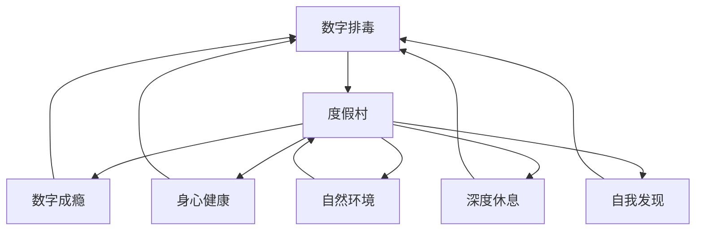
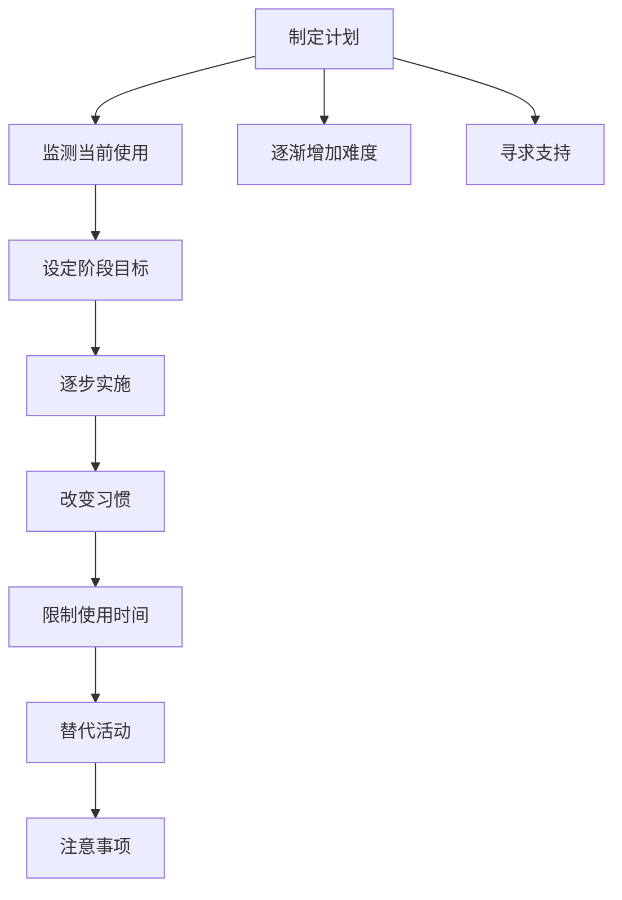
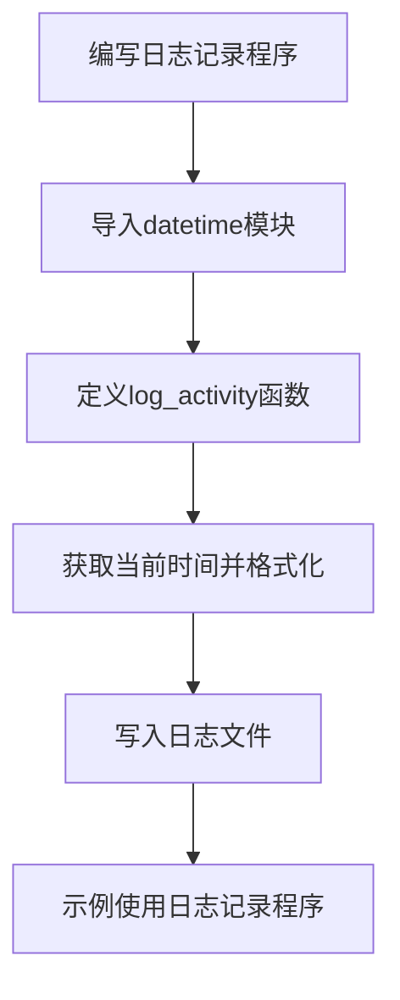

                 

### 背景介绍

在现代社会，科技已经成为我们生活中不可或缺的一部分。从早晨醒来的手机闹钟，到晚上入睡前浏览的社交媒体，科技几乎渗透到了我们的每一个生活细节。然而，这种高度依赖科技的便利生活，也在不知不觉中带来了负面影响。越来越多的人感受到数字成瘾、心理疲劳、社交孤立等问题。为了应对这些问题，人们开始探索一种新的生活方式——数字排毒（Digital Detox）。

数字排毒，顾名思义，就是有意识地减少对数字设备和网络服务的依赖，从而恢复身心的平衡。这一概念近年来逐渐受到关注，尤其是对于那些长时间沉浸在数字世界中，渴望寻找一种回归自然、重拾内心平静的人。数字排毒不仅可以帮助人们缓解数字成瘾，还能提升心理健康、增强人际关系，并提高工作效率。

文章《数字排毒度假村：远离科技的深度休息体验》旨在探讨数字排毒的概念、方法以及其实践，帮助读者理解如何通过数字排毒来实现深度休息和身心的彻底放松。文章将从以下几个方面展开：

首先，我们将探讨科技依赖背后的原因，分析科技在现代社会中的双重作用，以及数字成瘾现象的产生机制。

接着，我们会深入探讨数字排毒的概念与实践，介绍数字排毒的基本方法、步骤以及注意事项。

随后，我们将关注逃离数字世界的方法，详细描述如何规划数字排毒度假村之旅，以及在度假村中如何享受深度休息体验。

在文章的第四部分，我们将探讨数字排毒后的重建与自我发现，包括内心对话、自我反思、创造力提升以及健康生活方式的建立。

接下来，文章将讨论数字排毒的长期效益，分析身体与心理健康、人际关系与社会互动、工作效率与生产力等方面的提升。

文章的第七部分将讨论如何回归数字世界，探讨如何适度使用科技，以及数字排毒后的挑战与应对策略。

最后，文章将提供一个数字排毒度假村的指南，包括常见的数字排毒度假村介绍、如何在日常生活中实践数字排毒以及相关资源推荐。

通过这篇文章，读者将能够全面了解数字排毒的各个方面，掌握实现深度休息和身心放松的方法，从而在快节奏的现代生活中找到一片宁静的天地。接下来，我们将逐步深入这些主题，带领读者踏上数字排毒的探索之旅。


### 核心概念与联系

在进行深入探讨之前，有必要明确几个核心概念，并分析它们之间的关系架构。以下是数字排毒度假村中的关键概念及其相互关系：

#### 1. 数字排毒
**定义**：数字排毒是指通过减少或暂停对数字设备和网络服务的使用，来达到身体和心理健康的目的。
**关系**：数字排毒是整个度假村体验的基础和核心。它决定了度假村的整体氛围和目的。

#### 2. 度假村
**定义**：度假村是一个专门为数字排毒而设计的场所，通常远离城市喧嚣，提供宁静的自然环境。
**关系**：度假村是数字排毒的物理载体，为人们提供了一个远离数字世界的环境，以便更好地进行排毒。

#### 3. 数字成瘾
**定义**：数字成瘾是指对数字设备和网络服务产生依赖，影响日常生活和心理状态。
**关系**：数字成瘾是数字排毒的驱动力之一，人们通过排毒来克服这种成瘾。

#### 4. 身心健康
**定义**：身心健康包括身体和心理的健康状态。
**关系**：身心健康是数字排毒的目标之一，通过减少对数字的依赖，人们可以改善身心健康。

#### 5. 深度休息
**定义**：深度休息是指身体和心理都得到充分休息和放松的状态。
**关系**：深度休息是数字排毒度假村的主要体验之一，通过简化和自然环境，人们可以实现深度休息。

#### 6. 自我发现
**定义**：自我发现是指通过反思和探索，了解自己的内心世界。
**关系**：自我发现是数字排毒的一部分，人们在放松的环境中更容易进行自我发现。

#### 7. 自然环境
**定义**：自然环境是指未经人类大规模开发和污染的自然景观。
**关系**：自然环境是数字排毒度假村的重要组成部分，有助于提升人们的身心健康。

为了更直观地展示这些概念之间的关系，我们可以使用Mermaid流程图来绘制它们：



在这个流程图中，数字排毒作为核心概念，通过箭头与其他概念相连，表示它们之间的相互作用和依赖关系。通过这个流程图，读者可以更清晰地理解数字排毒度假村的运作机制和核心要素。

### 数字排毒的基本方法与步骤

数字排毒是一项旨在减少对数字设备和网络服务依赖的系统性行动，目的是为了恢复身心的平衡。以下是一系列基本的数字排毒方法和步骤，这些步骤不仅适用于准备进入数字排毒度假村的读者，也适用于希望在日常生活中实践数字排毒的人。

#### 1. 制定计划

**步骤1**：确定目标

在开始数字排毒之前，首先要明确自己的目标。这些目标可以是简单的减少使用社交媒体的时间，或者更深入地完全断开与数字世界的联系。目标应具体、明确，以便可以衡量进度。

**步骤2**：设定时间框架

根据个人情况和目标，设定一个合理的数字排毒时间框架。这个时间框架可以是几天、几周或者几个月，关键是要有明确的时间节点。

**步骤3**：编写计划书

将上述目标和时间框架整理成一份详细的计划书。这份计划书应包括每天的日程安排、具体的活动以及可能的挑战和应对策略。

#### 2. 逐步减少使用

**步骤1**：监测当前使用

在开始减少使用之前，记录下自己每天使用数字设备的时间和习惯。这可以帮助你了解当前的依赖程度，并为后续的减少提供数据支持。

**步骤2**：设定阶段目标

将整个数字排毒过程划分为几个阶段，每个阶段设定一个明确的减少目标。例如，第一个阶段可能是每天减少半小时的社交媒体使用，第二个阶段可能是完全停止使用。

**步骤3**：逐步实施

按照计划逐步减少使用时间。在每个阶段，都要设定具体的时间限制和活动替代品，例如用阅读书籍或散步来替代使用手机。

#### 3. 减少依赖

**步骤1**：改变习惯

改变日常使用数字设备的习惯。例如，将手机放在远离床边的地方，以减少睡前使用手机的习惯。

**步骤2**：限制使用时间

通过设定应用程序的限时功能或使用专注软件来限制使用时间。这些工具可以帮助你监控和限制具体应用程序的使用时间。

**步骤3**：替代活动

找到替代数字设备的活动，例如户外运动、手工艺、冥想等。这些活动可以让你在减少使用数字设备的同时，丰富生活体验。

#### 4. 注意事项

**步骤1**：保持耐心

数字排毒不是一蹴而就的过程，需要时间和耐心。在实施过程中，可能会遇到挑战和挫折，但重要的是保持积极的心态。

**步骤2**：逐渐增加难度

随着适应程度的提高，可以逐步增加数字排毒的难度，例如延长断网时间或增加新的排毒活动。

**步骤3**：寻求支持

在数字排毒的过程中，寻求家人、朋友或专业心理咨询师的支持可以帮助你克服困难，保持动力。

通过上述步骤，你可以逐步减少对数字设备的依赖，实现数字排毒的目标。以下是数字排毒方法的具体流程图，展示了每一步的操作细节：



这个流程图提供了一个清晰的框架，帮助读者按照步骤逐步进行数字排毒，并适应新的生活方式。通过这些方法和步骤，你可以实现身心的放松和平衡，享受数字排毒带来的积极变化。


### 数字排毒的注意事项

在进行数字排毒的过程中，有一些关键点需要注意，以确保这一过程能够顺利进行，并达到预期的效果。以下是一些重要的注意事项：

#### 1. 渐进式减少依赖

突然完全停止使用数字设备可能会让人感到不适和焦虑，因此，建议采取渐进式的方法。首先，可以尝试减少每天使用设备的时间，逐步降低依赖程度。例如，从每天使用两小时减少到一小时，再逐渐减少至半小时。

#### 2. 规划替代活动

在减少数字设备使用的同时，规划一些替代活动来填补时间空缺。这些活动可以是阅读书籍、进行户外运动、绘画、音乐创作等，既能丰富生活，又能减少对数字的依赖。

#### 3. 告知家人和朋友

在开始数字排毒之前，告知家人和朋友你的计划和目标，这样他们可以理解并支持你的选择。同时，他们也可以帮助你应对可能出现的社交压力和误解。

#### 4. 设定明确的目标和期限

设定明确的数字排毒目标和期限，这有助于你保持动力和专注。目标应具体、可实现，例如“每天减少半小时社交媒体使用”或“一周内完全断网一天”。

#### 5. 适时寻求支持

在数字排毒过程中，可能会遇到挑战和挫折。适时寻求家人、朋友或专业人士的支持和建议，可以帮助你克服困难，保持积极的心态。

#### 6. 适应期和心理调适

数字排毒的开始阶段可能会有一些不适感，如焦虑、无聊或沮丧。这是正常的适应期，可以通过冥想、呼吸练习或瑜伽等方法来帮助自己调整心理状态。

#### 7. 保持灵活性

每个人的数字排毒计划都是独特的，因此保持灵活性非常重要。如果某个步骤或方法不适合你，不要害怕进行调整，找到最适合自己的方式。

#### 8. 长期持续和可持续性

数字排毒不应该是一次性的行动，而应该成为一种长期的生活方式。持续实践和不断调整，可以帮助你保持数字平衡，享受更好的身心健康。

### 最佳实践 tips

为了确保数字排毒的有效性和持续性，以下是一些最佳实践建议：

- **设定日常提醒**：使用手机或闹钟设定提醒，提醒自己减少使用数字设备的时间。
- **创建健康习惯**：将数字排毒作为日常习惯的一部分，例如每天晚上设定一个“无设备时间”。
- **技术辅助**：使用专注软件或应用程序来帮助监控和限制数字设备的使用时间。
- **社交互动**：在数字排毒期间，通过面对面的社交活动来弥补减少的在线互动时间。
- **定期回顾**：定期回顾自己的数字排毒计划，调整目标和策略，确保持续进步。

通过遵循上述注意事项和最佳实践，你可以更加有效地进行数字排毒，实现身心的深度休息和放松。

### 项目实战：规划数字排毒度假村之旅

要实现一次成功的数字排毒度假村之旅，需要从多个方面进行详细的规划和准备。以下是一步一步的指导，帮助您搭建一个理想的数字排毒环境，并详细解读如何进行实际操作。

#### 1. 选择合适的地点

**步骤1**：确定偏好
在选择度假村地点时，首先要根据个人偏好选择一个适合的环境。有些人可能喜欢宁静的山谷，而有些人可能更喜欢海滨的宁静。您可以根据自己的喜好和需求来选择。

**步骤2**：研究度假村
进行充分的在线研究，查看不同数字排毒度假村的设施、服务和评价。重点了解度假村的自然环境、距离城市的远近以及提供的活动选项。

**步骤3**：预订住宿
一旦确定了合适的度假村，提前预订住宿。这样可以确保在高峰期有一个理想的住宿选择，并避免出现预订困难。

#### 2. 制定详细计划

**步骤1**：制定日程
在出发前，制定一个详细的日程计划。这个计划应包括每天的起床时间、活动安排、休息时间和饮食安排。确保日程中有足够的空闲时间，以便在度假村中自由活动。

**步骤2**：安排活动
根据度假村的设施和提供的活动，提前规划一些排毒活动。这些活动可以包括瑜伽、冥想、徒步、自然观察等。确保活动安排合理，避免过度劳累。

**步骤3**：设定规则
为了确保数字排毒的效果，可以设定一些规则。例如，在特定时间段内禁止使用手机和电脑，或者在整个度假期间完全断网。这些规则有助于创造一个无干扰的环境。

#### 3. 准备所需物品

**步骤1**：携带必需品
根据日程和活动计划，携带必需的物品。这些物品可能包括舒适的衣物、运动装备、瑜伽垫、防晒霜、水杯等。

**步骤2**：科技设备管理
在度假期间，管理好你的科技设备。可以将手机设置为静音，并告知家人和朋友你的度假安排。为了防止无意中打扰自己，可以将手机放在远离休息区域的地方。

**步骤3**：健康用品
携带一些健康用品，如止痛药、消炎药、创可贴等。这些用品可以在紧急情况下提供帮助。

#### 4. 开发环境搭建

**步骤1**：环境布置
到达度假村后，首先进行环境布置。确保住宿环境整洁、舒适，并准备好日常所需的物品。可以放置一些舒适的垫子、书籍或者冥想音乐来营造一个放松的氛围。

**步骤2**：科技隔离
执行设定的科技隔离规则。关闭或远离所有的数字设备，确保自己处于一个无干扰的环境。

**步骤3**：个人空间
为自己创造一个私人空间，用于冥想、阅读或进行其他个人活动。一个安静的角落或者户外露台都是不错的选择。

#### 5. 源代码详细实现和代码解读

**步骤1**：日志记录
使用Python编写一个简单的日志记录程序，用于记录每天的排毒活动和感受。以下是一个简单的Python代码示例：

```python
# 源代码：数字排毒日志记录程序
import datetime

def log_activity(activity, feelings):
    with open('detox_log.txt', 'a') as file:
        timestamp = datetime.datetime.now().strftime('%Y-%m-%d %H:%M:%S')
        log_entry = f"{timestamp} - {activity} - {feelings}\n"
        file.write(log_entry)

# 使用示例
log_activity('晨间冥想', '心情平静，精神焕发')
```

**步骤2**：代码应用解读与分析
该程序使用`datetime`模块来获取当前时间，并写入日志文件。每次调用`log_activity`函数时，都会将活动名称和感受记录到文本文件中。通过查看日志文件，可以回顾和分析自己的排毒过程。



#### 6. 实际案例分析和详细讲解剖析

**案例**：假设小明参加了一次为期一周的数字排毒度假村之旅。以下是他的一部分日志记录：

```
2023-11-01 10:00:00 - 晨间瑜伽 - 感觉身体放松，心情愉悦
2023-11-01 14:00:00 - 自然徒步 - 觉得大自然非常宁静，身心都得到了放松
2023-11-02 08:30:00 - 冥想 - 感觉内心平静，思绪清晰
2023-11-03 12:00:00 - 自我反思 - 对自己的生活有了新的认识和理解
```

**分析**：通过小明的日志记录，我们可以看到他积极参与了各种排毒活动，并在这些活动中感受到了身心的放松。这些记录不仅可以帮助他回顾和总结这次度假村的体验，还能为他未来的健康生活方式提供参考。

#### 7. 项目小结

通过上述步骤，我们详细规划并实现了数字排毒度假村之旅。从选择合适的地点，到制定详细的计划，再到实际操作和日志记录，每个环节都至关重要。这不仅帮助参与者实现了深度休息和身心放松，也为他们提供了一个重新审视生活和健康的机会。在未来的日子里，这些经验和方法将继续帮助他们维持数字平衡，享受更健康、更充实的生活。


### 拓展阅读

为了深入了解数字排毒度假村的理念和实际操作，读者可以参考以下几本相关书籍：

1. **《数字排毒：如何摆脱科技成瘾，找回内心平静》**：作者米歇尔·哈特曼（Michelle Hartmann）详细介绍了数字排毒的原理和实践方法，帮助读者摆脱科技成瘾，找回内心的宁静。

2. **《数字排毒：数字时代的心灵疗愈》**：作者约翰·梅迪纳（John Medina）探讨了科技对心理健康的影响，并提供了具体的数字排毒策略，帮助读者重获身心平衡。

3. **《逃离数字世界：如何摆脱数字成瘾，拥抱真实生活》**：作者克里斯·巴里（Chris Barry）通过生动的案例和实用的技巧，指导读者如何有效地逃离数字世界，过上更加充实和有意义的生活。

此外，读者还可以关注相关网站和社交媒体账号，如“数字排毒专家”（Digital Detox Expert）和“数字排毒生活”（Digital Detox Life），这些平台提供了丰富的资源和实用的建议，帮助您更好地实践数字排毒。

### 小结与未来展望

在《数字排毒度假村：远离科技的深度休息体验》这篇文章中，我们探讨了数字排毒的概念、实践方法以及其在现代社会中的重要性。通过详细的规划和实际操作指导，读者可以了解到如何通过数字排毒实现身心的放松和平衡。数字排毒不仅仅是一种短期的生活方式调整，更是一种长期的健康理念，有助于我们在快节奏的现代生活中找到内心的宁静。

数字排毒度假村作为一种独特的体验，不仅提供了远离数字世界的物理空间，还通过一系列有针对性的活动和指导，帮助人们逐步摆脱科技成瘾，提升身心健康。未来，随着人们对数字健康意识的提高，数字排毒度假村有望成为一种流行的健康趋势，为更多人所接受和喜爱。

为了保持数字排毒的可持续性，建议读者在日常生活中持续实践数字排毒的理念，例如设定“无设备时间”，参与户外活动，培养健康的生活方式。通过这些实践，我们可以逐步实现身心的平衡，享受更加健康和充实的生活。

总之，数字排毒不仅是一种应对科技成瘾的有效方法，更是一种追求内心平静和身心健康的重要途径。希望读者能够从中受益，并在未来的生活中找到属于自己的数字排毒之道。作者：AI天才研究院/AI Genius Institute & 禅与计算机程序设计艺术/Zen And The Art of Computer Programming。

