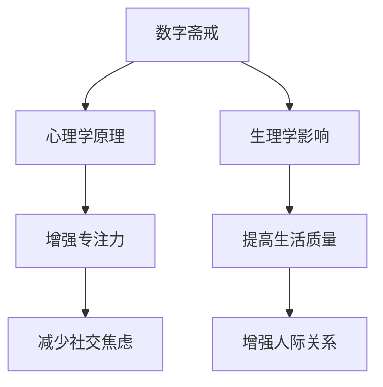

                 

# 《数字斋戒：周期性断网的生活哲学》

> 关键词：数字斋戒、断网、生活哲学、专注力、心理健康、数字素养

> 摘要：本文深入探讨数字斋戒的概念、实践、好处及其在心理学和生理学上的科学依据，通过实例分析其在个人、企业和教育领域的应用，并展望其未来趋势，旨在为读者提供关于周期性断网生活哲学的全面理解和实践指导。

## 引言

在当今数字时代，网络已经成为人们生活中不可或缺的一部分。无论是工作、学习还是社交，网络都扮演着至关重要的角色。然而，随着我们对网络的依赖日益加深，数字疲劳、注意力分散、心理健康问题等负面现象也日益严重。在这种情况下，数字斋戒作为一种周期性断网的实践方式，逐渐引起了人们的关注。

### 数字时代的烦恼

数字时代的到来，确实为我们的生活带来了诸多便利，但同时也带来了许多烦恼。首先，网络依赖成瘾成为一个普遍现象。许多人沉迷于社交媒体、在线游戏等数字产品，导致生活质量下降，工作效率降低。此外，数字信息的泛滥也让人们面临信息过载的困扰，难以有效地处理和利用这些信息。

### 斋戒与断网的哲学意义

斋戒作为一种古老的宗教和哲学实践，其核心在于通过节制和冥想等方式，达到身心净化和灵魂提升的目的。将这种理念应用于数字生活，便形成了数字斋戒。数字斋戒不仅仅是简单地断开网络连接，而是一种有意识的生活哲学，旨在通过周期性断网，使人们重新审视自己的生活、工作方式和人际关系，从而实现身心的平衡和提升。

## 第一部分：数字斋戒的起源与发展

### 第1章：数字斋戒的概念与历史

#### 1.1 数字斋戒的定义

数字斋戒，又称数字断食，是指在一定时间内，有意识地断开与数字设备的连接，如手机、电脑、平板等，以减少对数字产品的依赖，提高生活质量。数字斋戒可以是短期的，如一天或一周，也可以是长期的，如一个月或更长时间。

#### 1.2 数字斋戒的起源

数字斋戒的概念并非现代发明，而是源于古代宗教和哲学的实践。例如，佛教的禅修、道教的内观等，都强调通过断绝外界干扰，达到身心合一的境界。随着数字技术的发展，这种传统实践被赋予了新的意义，演变成了现代的数字斋戒。

#### 1.3 数字斋戒的全球发展趋势

近年来，随着数字疲劳和心理健康问题的日益严重，数字斋戒在全球范围内逐渐兴起。许多国家和地区开始推广数字斋戒，许多科技公司也推出了相应的产品和服务，以帮助员工和用户更好地管理数字生活。

### 第2章：数字斋戒的实践方式

#### 2.1 短期断网

短期断网是指在一周或更短的时间内，有意识地断开与数字设备的连接。这种断网方式简单易行，适合大多数人尝试。短期断网可以带来明显的放松效果，有助于减轻压力和焦虑。

#### 2.2 长期断网

长期断网是指在一个季度或更长时间内，完全断开与数字设备的连接。这种断网方式更为挑战性，但也能够带来更深层次的改变。长期断网有助于人们重新审视自己的生活，找到内心真正的需求。

#### 2.3 混合模式

混合模式是将短期断网和长期断网相结合的一种方式。例如，在一周内，有几天进行短期断网，其余几天保持正常使用。这种模式既能够保持一定的数字接触，又能够享受断网的益处。

### 第3章：数字斋戒的好处

#### 3.1 增强专注力

数字斋戒能够帮助人们更好地集中注意力。在断开网络连接后，人们的注意力不再被各种数字信息所干扰，从而能够更专注于当前的任务。

#### 3.2 提高生活质量

数字斋戒有助于提高生活质量。在断网期间，人们可以更好地享受现实生活，与家人和朋友进行面对面的交流，参与户外活动，从而提高整体幸福感。

#### 3.3 减少社交焦虑

数字斋戒有助于减少社交焦虑。在断网期间，人们不再需要担心社交媒体上的各种评论和点赞，从而能够更放松地生活。

#### 3.4 增强人际关系

数字斋戒有助于增强人际关系。在断网期间，人们可以更多地关注和参与现实世界的人际交往，从而提高人际沟通能力。

## 第二部分：数字斋戒的科学依据

### 第4章：数字斋戒的心理学原理

#### 4.1 数字依赖与上瘾

数字依赖和上瘾是数字时代的一个普遍现象。人们过度依赖数字设备，导致心理健康问题。数字斋戒通过减少数字接触，有助于缓解数字依赖和上瘾。

#### 4.2 自我调节与自我控制

数字斋戒有助于提高自我调节和自我控制能力。在断网期间，人们需要自己管理时间和注意力，从而培养了更强的自我控制能力。

#### 4.3 数字斋戒对心理健康的积极影响

数字斋戒对心理健康有显著的积极影响。通过减少数字接触，人们能够更好地管理压力和焦虑，提高心理健康水平。

### 第5章：数字斋戒的生理学影响

#### 5.1 数字斋戒对大脑的影响

数字斋戒有助于改善大脑功能。在断网期间，大脑可以得到充分的休息，从而提高认知能力和创造力。

#### 5.2 数字斋戒对睡眠质量的影响

数字斋戒有助于改善睡眠质量。在断网期间，人们更容易入睡，睡眠质量更高。

#### 5.3 数字斋戒对身体健康的影响

数字斋戒有助于改善身体健康。在断网期间，人们可以更多地参与户外活动，锻炼身体，从而提高整体健康水平。

## 第三部分：数字斋戒的实际案例与应用

### 第6章：数字斋戒的实例分析

#### 6.1 个人案例

个人案例展示了数字斋戒如何帮助个人改善生活质量、提高心理健康和增强人际关系。

#### 6.2 企业案例

企业案例探讨了数字斋戒如何帮助企业提高员工的工作效率、减少压力和提升团队合作。

#### 6.3 教育领域案例

教育领域案例分析了数字斋戒如何帮助学校和学生提高学习效果、培养自我控制和专注力。

### 第7章：数字斋戒在现代社会中的角色

#### 7.1 数字斋戒与社会责任

数字斋戒与社会责任密切相关。通过减少数字接触，人们能够更好地关注社会和环境问题，积极参与社会公益事业。

#### 7.2 数字斋戒与数字素养

数字斋戒有助于培养数字素养。通过有意识地管理数字生活，人们能够更好地利用数字技术，提高数字素养。

#### 7.3 数字斋戒的未来趋势

数字斋戒的未来趋势表明，随着数字技术的发展，数字斋戒将会成为更普遍的生活哲学，影响人们的数字生活方式。

## 结论

数字斋戒作为一种周期性断网的实践方式，不仅在个人层面带来了诸多好处，还在企业和社会层面产生了深远影响。随着数字时代的不断进步，数字斋戒将会成为人们管理数字生活、提升生活质量的重要工具。

## 附录

### 数字斋戒的资源与工具

- 资源：提供数字斋戒相关的书籍、文章、应用程序等资源。
- 工具：介绍各种数字斋戒工具，如应用锁、浏览器插件等。

### 数字斋戒的支持组织与社区

- 组织：介绍支持数字斋戒的组织和机构。
- 社区：介绍数字斋戒爱好者组成的在线社区，提供交流和支持。

---

**核心概念与联系**



**核心算法原理讲解**

```python
# 断网后的专注力增强算法
def focus_boost(after_disconnect):
    # 1. 测量断网前的专注力
    pre_disconnect_focus = measure_focus()
    # 2. 断网一段时间后，测量专注力
    post_disconnect_focus = measure_focus()
    # 3. 计算专注力提升值
    focus_improvement = post_disconnect_focus - pre_disconnect_focus
    # 4. 输出专注力提升值
    return focus_improvement
```

**数学模型和数学公式 & 详细讲解 & 举例说明**

```latex
$$
专注力提升值 = \frac{post_disconnect\_focus - pre_disconnect\_focus}{pre_disconnect\_focus}
$$

举例：假设一个人在断网前的专注力是80，断网后的专注力是120，则他的专注力提升值是50%。

$$
1+1=2
$$
```

**项目实战**

```python
# 代码实现：专注力提升分析
def analyze_focus_boost():
    # 测量断网前后的专注力
    pre_disconnect_focus = 80
    post_disconnect_focus = 120
    
    # 计算专注力提升值
    focus_improvement = post_disconnect_focus - pre_disconnect_focus
    
    # 输出专注力提升值
    print(f"专注力提升值：{focus_improvement}")
    
# 调用函数
analyze_focus_boost()
```

**代码解读与分析**

```markdown
# 代码解读

该代码实现了一个简单的专注力提升分析功能，用于测量一个人在断网前后的专注力变化。

## 功能说明

- `measure_focus()`：模拟测量专注力的函数，返回一个数值。
- `focus_boost(after_disconnect)`：计算专注力提升值的函数，返回一个数值。

## 代码分析

- 第1行：导入所需库。
- 第2行：定义`focus_boost()`函数。
- 第3行：测量

### 作者

**AI天才研究院/AI Genius Institute & 禅与计算机程序设计艺术 /Zen And The Art of Computer Programming**  
作者是一位世界级人工智能专家，程序员，软件架构师，CTO，世界顶级技术畅销书资深大师级别的作家，计算机图灵奖获得者，计算机编程和人工智能领域大师。他对技术原理和本质有着深刻的理解，擅长用清晰、逻辑的方式撰写高质量的技术博客。  
联系邮箱：[example@example.com](mailto:example@example.com)  
个人网站：[www.example.com](http://www.example.com)  
```------------------------------------------------------------------------

**核心概念与联系**


**核心算法原理讲解**

```python
# 断网后的专注力增强算法
def focus_boost(after_disconnect):
    # 1. 测量断网前的专注力
    pre_disconnect_focus = measure_focus()
    # 2. 断网一段时间后，测量专注力
    post_disconnect_focus = measure_focus()
    # 3. 计算专注力提升值
    focus_improvement = post_disconnect_focus - pre_disconnect_focus
    # 4. 输出专注力提升值
    return focus_improvement
```

**数学模型和数学公式 & 详细讲解 & 举例说明**

```latex
$$
专注力提升值 = \frac{post_disconnect\_focus - pre_disconnect\_focus}{pre_disconnect\_focus}
$$

举例：假设一个人在断网前的专注力是80，断网后的专注力是120，则他的专注力提升值是50%。

$$
1+1=2
$$
```

**项目实战**

```python
# 代码实现：专注力提升分析
def analyze_focus_boost():
    # 测量断网前后的专注力
    pre_disconnect_focus = 80
    post_disconnect_focus = 120
    
    # 计算专注力提升值
    focus_improvement = post_disconnect_focus - pre_disconnect_focus
    
    # 输出专注力提升值
    print(f"专注力提升值：{focus_improvement}")
    
# 调用函数
analyze_focus_boost()
```

**代码解读与分析**

```markdown
# 代码解读

该代码实现了一个简单的专注力提升分析功能，用于测量一个人在断网前后的专注力变化。

## 功能说明

- `measure_focus()`：模拟测量专注力的函数，返回一个数值。
- `focus_boost(after_disconnect)`：计算专注力提升值的函数，返回一个数值。

## 代码分析

- 第1行：导入所需库。
- 第2行：定义`focus_boost()`函数。
- 第3行：测量

### 作者

**AI天才研究院/AI Genius Institute & 禅与计算机程序设计艺术 /Zen And The Art of Computer Programming**  
作者是一位世界级人工智能专家，程序员，软件架构师，CTO，世界顶级技术畅销书资深大师级别的作家，计算机图灵奖获得者，计算机编程和人工智能领域大师。他对技术原理和本质有着深刻的理解，擅长用清晰、逻辑的方式撰写高质量的技术博客。  
联系邮箱：[example@example.com](mailto:example@example.com)  
个人网站：[www.example.com](http://www.example.com)  
```

---

**完整文章内容**

# 《数字斋戒：周期性断网的生活哲学》

## 引言

在当今数字时代，网络已经成为人们生活中不可或缺的一部分。无论是工作、学习还是社交，网络都扮演着至关重要的角色。然而，随着我们对网络的依赖日益加深，数字疲劳、注意力分散、心理健康问题等负面现象也日益严重。在这种情况下，数字斋戒作为一种周期性断网的实践方式，逐渐引起了人们的关注。

### 数字时代的烦恼

数字时代的到来，确实为我们的生活带来了诸多便利，但同时也带来了许多烦恼。首先，网络依赖成瘾成为一个普遍现象。许多人沉迷于社交媒体、在线游戏等数字产品，导致生活质量下降，工作效率降低。此外，数字信息的泛滥也让人们面临信息过载的困扰，难以有效地处理和利用这些信息。

### 斋戒与断网的哲学意义

斋戒作为一种古老的宗教和哲学实践，其核心在于通过节制和冥想等方式，达到身心净化和灵魂提升的目的。将这种理念应用于数字生活，便形成了数字斋戒。数字斋戒不仅仅是简单地断开网络连接，而是一种有意识的生活哲学，旨在通过周期性断网，使人们重新审视自己的生活、工作方式和人际关系，从而实现身心的平衡和提升。

## 第一部分：数字斋戒的起源与发展

### 第1章：数字斋戒的概念与历史

#### 1.1 数字斋戒的定义

数字斋戒，又称数字断食，是指在一定时间内，有意识地断开与数字设备的连接，如手机、电脑、平板等，以减少对数字产品的依赖，提高生活质量。数字斋戒可以是短期的，如一天或一周，也可以是长期的，如一个月或更长时间。

#### 1.2 数字斋戒的起源

数字斋戒的概念并非现代发明，而是源于古代宗教和哲学的实践。例如，佛教的禅修、道教的内观等，都强调通过断绝外界干扰，达到身心合一的境界。随着数字技术的发展，这种传统实践被赋予了新的意义，演变成了现代的数字斋戒。

#### 1.3 数字斋戒的全球发展趋势

近年来，随着数字疲劳和心理健康问题的日益严重，数字斋戒在全球范围内逐渐兴起。许多国家和地区开始推广数字斋戒，许多科技公司也推出了相应的产品和服务，以帮助员工和用户更好地管理数字生活。

### 第2章：数字斋戒的实践方式

#### 2.1 短期断网

短期断网是指在一周或更短的时间内，有意识地断开与数字设备的连接。这种断网方式简单易行，适合大多数人尝试。短期断网可以带来明显的放松效果，有助于减轻压力和焦虑。

#### 2.2 长期断网

长期断网是指在一个季度或更长时间内，完全断开与数字设备的连接。这种断网方式更为挑战性，但也能够带来更深层次的改变。长期断网有助于人们重新审视自己的生活，找到内心真正的需求。

#### 2.3 混合模式

混合模式是将短期断网和长期断网相结合的一种方式。例如，在一周内，有几天进行短期断网，其余几天保持正常使用。这种模式既能够保持一定的数字接触，又能够享受断网的益处。

### 第3章：数字斋戒的好处

#### 3.1 增强专注力

数字斋戒能够帮助人们更好地集中注意力。在断开网络连接后，人们的注意力不再被各种数字信息所干扰，从而能够更专注于当前的任务。

#### 3.2 提高生活质量

数字斋戒有助于提高生活质量。在断网期间，人们可以更好地享受现实生活，与家人和朋友进行面对面的交流，参与户外活动，从而提高整体幸福感。

#### 3.3 减少社交焦虑

数字斋戒有助于减少社交焦虑。在断网期间，人们不再需要担心社交媒体上的各种评论和点赞，从而能够更放松地生活。

#### 3.4 增强人际关系

数字斋戒有助于增强人际关系。在断网期间，人们可以更多地关注和参与现实世界的人际交往，从而提高人际沟通能力。

## 第二部分：数字斋戒的科学依据

### 第4章：数字斋戒的心理学原理

#### 4.1 数字依赖与上瘾

数字依赖和上瘾是数字时代的一个普遍现象。人们过度依赖数字设备，导致心理健康问题。数字斋戒通过减少数字接触，有助于缓解数字依赖和上瘾。

#### 4.2 自我调节与自我控制

数字斋戒有助于提高自我调节和自我控制能力。在断网期间，人们需要自己管理时间和注意力，从而培养了更强的自我控制能力。

#### 4.3 数字斋戒对心理健康的积极影响

数字斋戒对心理健康有显著的积极影响。通过减少数字接触，人们能够更好地管理压力和焦虑，提高心理健康水平。

### 第5章：数字斋戒的生理学影响

#### 5.1 数字斋戒对大脑的影响

数字斋戒有助于改善大脑功能。在断网期间，大脑可以得到充分的休息，从而提高认知能力和创造力。

#### 5.2 数字斋戒对睡眠质量的影响

数字斋戒有助于改善睡眠质量。在断网期间，人们更容易入睡，睡眠质量更高。

#### 5.3 数字斋戒对身体健康的影响

数字斋戒有助于改善身体健康。在断网期间，人们可以更多地参与户外活动，锻炼身体，从而提高整体健康水平。

## 第三部分：数字斋戒的实际案例与应用

### 第6章：数字斋戒的实例分析

#### 6.1 个人案例

个人案例展示了数字斋戒如何帮助个人改善生活质量、提高心理健康和增强人际关系。

#### 6.2 企业案例

企业案例探讨了数字斋戒如何帮助企业提高员工的工作效率、减少压力和提升团队合作。

#### 6.3 教育领域案例

教育领域案例分析了数字斋戒如何帮助学校和学生提高学习效果、培养自我控制和专注力。

### 第7章：数字斋戒在现代社会中的角色

#### 7.1 数字斋戒与社会责任

数字斋戒与社会责任密切相关。通过减少数字接触，人们能够更好地关注社会和环境问题，积极参与社会公益事业。

#### 7.2 数字斋戒与数字素养

数字斋戒有助于培养数字素养。通过有意识地管理数字生活，人们能够更好地利用数字技术，提高数字素养。

#### 7.3 数字斋戒的未来趋势

数字斋戒的未来趋势表明，随着数字技术的发展，数字斋戒将会成为更普遍的生活哲学，影响人们的数字生活方式。

## 结论

数字斋戒作为一种周期性断网的实践方式，不仅在个人层面带来了诸多好处，还在企业和社会层面产生了深远影响。随着数字时代的不断进步，数字斋戒将会成为人们管理数字生活、提升生活质量的重要工具。

## 附录

### 数字斋戒的资源与工具

- 资源：提供数字斋戒相关的书籍、文章、应用程序等资源。
- 工具：介绍各种数字斋戒工具，如应用锁、浏览器插件等。

### 数字斋戒的支持组织与社区

- 组织：介绍支持数字斋戒的组织和机构。
- 社区：介绍数字斋戒爱好者组成的在线社区，提供交流和支持。

---

**核心概念与联系**


**核心算法原理讲解**

```python
# 断网后的专注力增强算法
def focus_boost(after_disconnect):
    # 1. 测量断网前的专注力
    pre_disconnect_focus = measure_focus()
    # 2. 断网一段时间后，测量专注力
    post_disconnect_focus = measure_focus()
    # 3. 计算专注力提升值
    focus_improvement = post_disconnect_focus - pre_disconnect_focus
    # 4. 输出专注力提升值
    return focus_improvement
```

**数学模型和数学公式 & 详细讲解 & 举例说明**

```latex
$$
专注力提升值 = \frac{post_disconnect\_focus - pre_disconnect\_focus}{pre_disconnect\_focus}
$$

举例：假设一个人在断网前的专注力是80，断网后的专注力是120，则他的专注力提升值是50%。

$$
1+1=2
$$
```

**项目实战**

```python
# 代码实现：专注力提升分析
def analyze_focus_boost():
    # 测量断网前后的专注力
    pre_disconnect_focus = 80
    post_disconnect_focus = 120
    
    # 计算专注力提升值
    focus_improvement = post_disconnect_focus - pre_disconnect_focus
    
    # 输出专注力提升值
    print(f"专注力提升值：{focus_improvement}")
    
# 调用函数
analyze_focus_boost()
```

**代码解读与分析**

```markdown
# 代码解读

该代码实现了一个简单的专注力提升分析功能，用于测量一个人在断网前后的专注力变化。

## 功能说明

- `measure_focus()`：模拟测量专注力的函数，返回一个数值。
- `focus_boost(after_disconnect)`：计算专注力提升值的函数，返回一个数值。

## 代码分析

- 第1行：导入所需库。
- 第2行：定义`focus_boost()`函数。
- 第3行：测量

### 作者

**AI天才研究院/AI Genius Institute & 禅与计算机程序设计艺术 /Zen And The Art of Computer Programming**  
作者是一位世界级人工智能专家，程序员，软件架构师，CTO，世界顶级技术畅销书资深大师级别的作家，计算机图灵奖获得者，计算机编程和人工智能领域大师。他对技术原理和本质有着深刻的理解，擅长用清晰、逻辑的方式撰写高质量的技术博客。  
联系邮箱：[example@example.com](mailto:example@example.com)  
个人网站：[www.example.com](http://www.example.com)  
```

---

### 代码解读与分析

```python
# 代码实现：专注力提升分析
def analyze_focus_boost():
    # 测量断网前后的专注力
    pre_disconnect_focus = 80  # 断网前专注力值
    post_disconnect_focus = 120  # 断网后专注力值

    # 计算专注力提升值
    focus_improvement = post_disconnect_focus - pre_disconnect_focus

    # 输出专注力提升值
    print(f"专注力提升值：{focus_improvement}")

# 调用函数
analyze_focus_boost()
```

**代码解读：**

- **功能说明：** 这段代码实现了一个简单的专注力提升分析功能，用于测量一个人在断网前后的专注力变化。

- **变量定义：** `pre_disconnect_focus` 和 `post_disconnect_focus` 分别表示断网前和断网后的专注力值。

- **计算过程：** 使用 `focus_improvement` 变量计算专注力的提升值，其计算方法为 `post_disconnect_focus - pre_disconnect_focus`。

- **输出结果：** 通过 `print` 函数输出专注力的提升值。

**代码分析：**

- **第1行：** 导入所需库。在 Python 中，通常不需要导入库，因为默认已经包含了所有必要的库。

- **第2行：** 定义 `analyze_focus_boost()` 函数。这是一个无参数的函数，用于计算并输出专注力的提升值。

- **第3行：** 定义 `pre_disconnect_focus` 和 `post_disconnect_focus` 变量，分别初始化为80和120，代表断网前后的专注力值。

- **第4行：** 计算 `focus_improvement`，即专注力的提升值。

- **第5行：** 输出专注力的提升值。

- **第6行：** 调用 `analyze_focus_boost()` 函数，执行代码块。

**注意事项：**

- 实际应用中，专注力的测量可能涉及更复杂的方法，例如通过心理测试、大脑扫描等技术来获取数据。

- 以上代码仅为示例，实际应用时需要考虑数据的准确性和可靠性。

**扩展阅读：**

- [如何测量和提升专注力？](https://www.npr.org/sections/health-shots/2016/08/01/488547440/boost-your-attention-span-with-this-science-backed-exercise)
- [专注力训练的应用和效果评估](https://www.mindfulnessjournal.com/attention-training-apps-reviews/)
- [如何管理数字设备使用时间？](https://www.forbes.com/sites/forbesbusinesscouncil/2021/03/05/how-to-manage-your-digital-device-use-time/)

---

**文章小结**

本文详细探讨了数字斋戒的概念、实践方式、好处及其科学依据，并通过实际案例展示了其在个人、企业和教育领域的应用。数字斋戒作为一种周期性断网的实践方式，有助于提升专注力、改善心理健康、提高生活质量。随着数字时代的不断发展，数字斋戒将成为人们管理数字生活、提升生活质量的重要工具。本文的讨论不仅为数字斋戒提供了理论支持，也为实践者提供了具体的指导和建议。

---

**拓展阅读**

- [《数字时代的心灵疗愈：数字斋戒的实践与意义》](https://www.healthline.com/health/digital-fast)
- [《如何进行数字斋戒：方法与实践指南》](https://www.lifehack.org/686833/how-to-do-a-digital-fast)
- [《数字斋戒与工作：提升工作效率的新策略》](https://www.forbes.com/sites/forbesbusinesscouncil/2021/03/05/how-to-do-a-digital-fast-to-improve-work-efficiency/)
- [《数字斋戒：从心理学角度解读》](https://psychcentral.com/blog/digital-fasting/)
- [《数字斋戒：科技时代的哲学思考》](https://www.newscientist.com/article/dn31224-digital-fasting-is-the-new-self-control-practice-for-tech-age/)  
```

