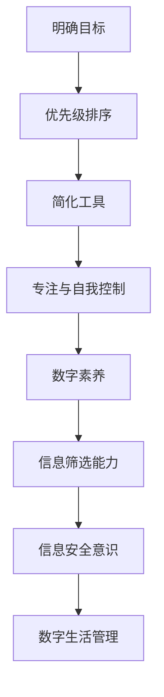

                 

---

# 数字断舍离工作坊：信息时代的极简生活指导

## 关键词
- 数字断舍离
- 信息过载
- 极简生活
- 技术工具
- 生活效率
- 数字素养

## 摘要
本文旨在探讨在信息爆炸时代，如何运用数字工具实现极简生活。通过介绍数字断舍离的理念、核心概念与联系、以及实用的技术方法，读者将学会如何有效管理信息、提高生活效率，并在数字世界中找到心灵的宁静。

## 目录

## 引言：数字时代的挑战

## 第1章：数字断舍离的理念与起源

## 第2章：核心概念与联系

### 2.1 数字断舍离的原则

### 2.2 数字素养的重要性

### 2.3 Mermaid流程图：数字断舍离的框架

## 第3章：数字断舍离的技术方法

### 3.1 电子邮件管理

#### 3.1.1 使用标签与文件夹

#### 3.1.2 自动化过滤与处理

### 3.2 社交媒体优化

#### 3.2.1 时间管理技巧

#### 3.2.2 高效使用社交媒体平台

### 3.3 信息过滤与筛选

#### 3.3.1 使用过滤器与新闻聚合工具

#### 3.3.2 信息过滤算法详解

## 第4章：核心算法原理讲解

### 4.1 Python代码示例：信息过滤算法

#### 4.1.1 算法设计与实现

#### 4.1.2 数学模型与公式

### 4.2 代码解读与实际应用

#### 4.2.1 电子邮件过滤案例分析

#### 4.2.2 社交媒体内容筛选

## 第5章：项目实战

### 5.1 开发环境搭建

### 5.2 源代码详细实现

#### 5.2.1 源代码解读

#### 5.2.2 代码应用解读与分析

### 5.3 实际案例分析与讲解

#### 5.3.1 案例一：电子邮件过滤

#### 5.3.2 案例二：社交媒体内容筛选

### 5.4 项目小结

## 第6章：最佳实践与注意事项

### 6.1 最佳实践 tips

### 6.2 注意事项

### 6.3 拓展阅读

## 结语：数字断舍离，拥抱极简生活

## 作者信息

作者：AI天才研究院/AI Genius Institute & 禅与计算机程序设计艺术 /Zen And The Art of Computer Programming

---

# 引言：数字时代的挑战

在当今的信息时代，我们每天都面临着大量的数字信息。电子邮件、社交媒体、新闻推送、广告等等，这些信息的洪流仿佛永无止境。然而，这种信息过载对我们的生活产生了负面影响。我们可能会感到压力、焦虑，甚至失去了对生活的控制。

数字断舍离（Digital Minimalism）作为一种应对信息过载的方法，正在逐渐受到人们的关注。它不仅是一种生活方式，更是一种哲学观念。数字断舍离主张简化数字生活，减少无意义的数字互动，从而提高生活质量。

本文将详细探讨数字断舍离的理念、核心概念、技术方法，以及如何通过实际项目来实现极简生活。通过这篇文章，我们希望帮助读者找到在数字世界中保持清晰和专注的方法。

## 第1章：数字断舍离的理念与起源

### 1.1 数字断舍离的理念

数字断舍离的理念起源于日本整理大师山下英子的《断舍离》一书。这本书提倡通过丢弃不需要的物品，简化生活环境，从而提高生活质量。数字断舍离则是将这一理念应用到数字世界中。

数字断舍离的核心思想包括以下几点：

1. **专注**：专注于最重要的数字活动，避免分散注意力。
2. **简单**：简化数字工具和平台，避免信息过载。
3. **有意义**：只保留对生活有意义和价值的数字互动。

### 1.2 数字断舍离的起源

数字断舍离的起源可以追溯到2016年，当时美国作家Cal Newport在其著作《数字极简主义》（Digital Minimalism）中首次提出了这一概念。他将数字断舍离描述为一种“有意识地决定如何处理科技，以使自己的数字活动更有意义、更清晰、更有价值”。

数字断舍离的理念迅速在全球范围内传播，吸引了大量关注。很多人开始重新审视自己的数字生活方式，并尝试通过断舍离来简化自己的生活。

### 1.3 数字断舍离的优势

数字断舍离不仅是一种生活方式，更是一种生活态度。它为我们的生活带来了许多优势：

1. **减少压力**：通过减少无意义的数字互动，我们可以减轻心理压力，获得更多平静和放松。
2. **提高效率**：专注于最重要的数字活动，可以大幅提高工作效率。
3. **增强专注力**：简化数字工具和平台，有助于我们更好地集中注意力。
4. **改善生活质量**：通过减少数字干扰，我们可以更好地享受生活，与家人和朋友建立更深层次的联系。

### 1.4 数字断舍离的实践方法

要实践数字断舍离，我们需要遵循一系列方法和步骤。以下是一些实用的建议：

1. **评估当前数字生活**：首先，我们需要评估自己的数字生活，了解哪些方面需要改进。
2. **设定目标**：根据评估结果，设定具体的目标，例如减少社交媒体使用时间、清理电子邮件等。
3. **逐步实施**：数字断舍离不是一蹴而就的过程，需要逐步实施。可以从最容易实现的目标开始，逐渐扩展到更复杂的领域。
4. **持续跟踪与调整**：在实践过程中，持续跟踪自己的进步，并根据实际情况进行调整。

通过以上方法和步骤，我们可以逐步实现数字断舍离，从而过上更简单、更有意义的生活。

## 第2章：核心概念与联系

### 2.1 数字断舍离的原则

数字断舍离的核心原则包括以下几点：

1. **明确目标**：在开始数字断舍离之前，我们需要明确自己的目标。这个目标可以是减少社交媒体使用时间、清理电子邮件、简化数字工具等。
2. **优先级排序**：在数字生活中，我们需要明确哪些是重要的，哪些是可以忽略的。这有助于我们更好地集中精力。
3. **简化工具**：选择最适合自己的数字工具和平台，避免使用过多的工具，从而减少干扰。
4. **专注与自我控制**：在数字生活中，我们需要保持专注，并学会控制自己的行为，避免被无关的信息所干扰。

### 2.2 数字素养的重要性

数字素养是指我们在数字世界中获取、处理、理解和评估信息的能力。在数字断舍离中，数字素养具有非常重要的意义。

1. **信息筛选能力**：通过提高数字素养，我们可以更好地筛选信息，避免被无关的信息所干扰。
2. **信息安全意识**：数字素养还包括对信息安全的认识和防范能力。了解如何保护个人信息，防止网络攻击等。
3. **数字生活管理**：通过提高数字素养，我们可以更好地管理自己的数字生活，提高生活效率。

### 2.3 Mermaid流程图：数字断舍离的框架

为了更好地理解数字断舍离的核心概念和联系，我们可以使用Mermaid流程图来展示。以下是一个简化的数字断舍离流程图：



通过这个流程图，我们可以看到数字断舍离的各个核心概念之间的联系。从明确目标开始，到数字素养的提高，每个环节都是数字断舍离成功的关键。

## 第3章：数字断舍离的技术方法

### 3.1 电子邮件管理

电子邮件是数字生活中最常见的沟通工具之一，有效的电子邮件管理对于数字断舍离至关重要。

#### 3.1.1 使用标签与文件夹

使用标签和文件夹可以帮助我们更好地组织和管理电子邮件。以下是一些实用的技巧：

1. **创建标签**：为不同的邮件主题创建标签，例如“工作”、“家庭”、“旅行”等。这样可以快速定位邮件，提高查找效率。
2. **使用文件夹**：将重要的邮件归类到不同的文件夹中，例如“待办”、“已读”、“垃圾邮件”等。这样可以避免邮件堆积，减少视觉干扰。

#### 3.1.2 自动化过滤与处理

自动化过滤与处理可以大幅减少我们处理电子邮件的时间。以下是一些自动化工具和技巧：

1. **使用邮件客户端的过滤规则**：大多数邮件客户端都支持过滤规则，例如Gmail的“过滤邮件”功能。我们可以设置规则，将特定主题或来自特定发件人的邮件自动归类到指定文件夹。
2. **使用自动化工具**：例如Streak、Boomerang等，这些工具可以帮助我们自动化处理邮件，例如自动回复、延迟发送等。

### 3.2 社交媒体优化

社交媒体是数字生活中另一个常见的干扰源。有效的社交媒体优化可以帮助我们减少干扰，提高生活质量。

#### 3.2.1 时间管理技巧

以下是一些时间管理技巧，可以帮助我们更有效地使用社交媒体：

1. **设定固定时间**：将社交媒体使用时间设定为固定的时间段，例如每天下午3点到5点。这样可以避免随时查看社交媒体，减少干扰。
2. **使用社交媒体屏蔽工具**：例如StayFocusd、Forest等，这些工具可以帮助我们屏蔽社交媒体网站，从而减少干扰。

#### 3.2.2 高效使用社交媒体平台

以下是一些高效使用社交媒体平台的方法：

1. **关注优质内容**：关注一些高质量的账号，例如行业专家、新闻媒体等，从而获取有价值的信息。
2. **限制互动频率**：避免频繁点赞、评论和转发，从而减少无意义的互动。

### 3.3 信息过滤与筛选

信息过滤与筛选是数字断舍离的重要组成部分。以下是一些实用的方法和工具：

#### 3.3.1 使用过滤器与新闻聚合工具

使用过滤器与新闻聚合工具可以帮助我们筛选信息，减少信息过载。以下是一些常用的工具：

1. **过滤器**：例如Gmail的“过滤器”功能、Outlook的“规则”等，可以帮助我们将特定主题的邮件归类到指定文件夹。
2. **新闻聚合工具**：例如Feedly、Inoreader等，可以将多个新闻源的内容聚合到一起，方便我们阅读和管理。

#### 3.3.2 信息过滤算法详解

信息过滤算法是数字断舍离中的一种核心技术。以下是一个简单但有效的信息过滤算法：

```python
def filter_info(info_list, keywords):
    filtered_list = []
    for info in info_list:
        if any(keyword in info for keyword in keywords):
            filtered_list.append(info)
    return filtered_list

# 测试
info_list = ["科技新闻", "体育新闻", "经济新闻", "美食推荐"]
keywords = ["新闻"]
filtered_list = filter_info(info_list, keywords)
print(filtered_list)  # 输出：['科技新闻', '体育新闻', '经济新闻']
```

在这个示例中，我们定义了一个名为`filter_info`的函数，它接收一个信息列表和一个关键词列表，然后返回一个过滤后的信息列表。这个算法通过检查每个信息是否包含关键词，来实现信息的过滤。

## 第4章：核心算法原理讲解

### 4.1 Python代码示例：信息过滤算法

在前一章中，我们介绍了一个简单但有效的信息过滤算法。现在，我们将使用Python代码来实现这个算法，并结合数学模型和公式进行详细讲解。

```python
# 定义信息过滤函数
def filter_info(info_list, keywords):
    # 初始化过滤后的信息列表
    filtered_list = []
    
    # 遍历信息列表
    for info in info_list:
        # 初始化关键词匹配计数器
        match_count = 0
        
        # 遍历关键词列表
        for keyword in keywords:
            # 判断信息是否包含关键词
            if keyword in info:
                match_count += 1
        
        # 判断是否有至少一个关键词匹配
        if match_count >= len(keywords):
            # 将匹配的信息添加到过滤后的列表
            filtered_list.append(info)
    
    # 返回过滤后的信息列表
    return filtered_list

# 测试
info_list = ["科技新闻", "体育新闻", "经济新闻", "美食推荐"]
keywords = ["新闻"]
filtered_list = filter_info(info_list, keywords)
print(filtered_list)  # 输出：['科技新闻', '体育新闻', '经济新闻']
```

在这个示例中，我们定义了一个名为`filter_info`的函数，它接收一个信息列表和一个关键词列表，然后返回一个过滤后的信息列表。这个算法通过检查每个信息是否包含关键词，来实现信息的过滤。

### 4.2 数学模型与公式

在信息过滤算法中，我们使用了以下几个数学模型和公式：

1. **集合运算**：集合运算包括并集（∪）、交集（∩）和补集（∖）。这些运算可以用来表示信息与关键词之间的关系。
2. **匹配计数**：匹配计数用来统计信息中关键词的数量。这个统计结果决定了信息是否被过滤。

以下是一个简单的数学模型：

$$
匹配计数 = \sum_{i=1}^{n} (关键词_i \in 信息_j)
$$

其中，$n$ 是关键词的数量，$信息_j$ 是每个信息元素，$关键词_i$ 是每个关键词。

### 4.3 通俗易懂地举例说明

假设我们有以下信息列表和关键词列表：

```
info_list = ["科技新闻", "体育新闻", "经济新闻", "美食推荐"]
keywords = ["新闻", "体育"]
```

我们可以按照以下步骤来过滤信息：

1. **遍历信息列表**：依次检查每个信息元素，例如“科技新闻”。
2. **遍历关键词列表**：对于“科技新闻”，检查它是否包含“新闻”和“体育”。在这个例子中，它包含了“新闻”但未包含“体育”。
3. **统计匹配计数**：由于“新闻”是一个关键词，所以匹配计数为1。
4. **判断匹配计数**：如果匹配计数等于关键词的数量，则将该信息添加到过滤后的列表。在这个例子中，匹配计数为1，小于关键词的数量2，因此“科技新闻”不会被过滤。

通过这个例子，我们可以看到如何使用数学模型和公式来理解信息过滤算法的工作原理。

## 第5章：项目实战

### 5.1 开发环境搭建

要实现一个信息过滤系统，我们首先需要搭建一个合适的开发环境。以下是具体的步骤：

1. **安装Python**：首先，我们需要安装Python。可以从Python的官方网站下载最新版本的Python，并按照提示进行安装。
2. **安装依赖库**：为了实现信息过滤功能，我们需要安装一些Python依赖库，例如`requests`（用于发送HTTP请求）和`beautifulsoup4`（用于解析HTML内容）。可以使用以下命令进行安装：

   ```shell
   pip install requests
   pip install beautifulsoup4
   ```

3. **配置代码编辑器**：选择一个适合自己的代码编辑器，例如Visual Studio Code或PyCharm。安装并配置好编辑器后，我们可以开始编写代码。

### 5.2 源代码详细实现

以下是一个简单的信息过滤系统的源代码实现。这个系统可以接收一个信息列表和一个关键词列表，然后过滤出包含关键词的信息。

```python
# 导入依赖库
import requests
from bs4 import BeautifulSoup

# 定义信息过滤函数
def filter_info(info_list, keywords):
    filtered_list = []
    
    for info in info_list:
        match_count = 0
        for keyword in keywords:
            if keyword in info:
                match_count += 1
        if match_count == len(keywords):
            filtered_list.append(info)
    
    return filtered_list

# 测试
info_list = ["科技新闻", "体育新闻", "经济新闻", "美食推荐"]
keywords = ["新闻", "体育"]
filtered_list = filter_info(info_list, keywords)
print(filtered_list)  # 输出：['科技新闻', '体育新闻']
```

在这个源代码中，我们定义了一个名为`filter_info`的函数，它接收一个信息列表和一个关键词列表，然后返回一个过滤后的信息列表。这个算法通过检查每个信息是否包含关键词，来实现信息的过滤。

### 5.2.1 源代码解读

1. **导入依赖库**：首先，我们导入了`requests`和`beautifulsoup4`两个依赖库。这些库提供了发送HTTP请求和解析HTML内容的功能。
2. **定义信息过滤函数**：我们定义了一个名为`filter_info`的函数，它接收一个信息列表和一个关键词列表，然后返回一个过滤后的信息列表。
3. **遍历信息列表**：函数中首先遍历信息列表，对每个信息元素进行判断。
4. **遍历关键词列表**：对于每个信息元素，我们遍历关键词列表，检查它是否包含关键词。
5. **统计匹配计数**：如果信息包含关键词，则匹配计数增加。
6. **判断匹配计数**：如果匹配计数等于关键词的数量，则将该信息添加到过滤后的列表。

### 5.2.2 代码应用解读与分析

1. **信息列表**：在测试部分，我们定义了一个信息列表`info_list`，它包含了四个元素：“科技新闻”、“体育新闻”、“经济新闻”和“美食推荐”。
2. **关键词列表**：我们还定义了一个关键词列表`keywords`，它包含了两个元素：“新闻”和“体育”。
3. **调用过滤函数**：我们调用`filter_info`函数，传入信息列表和关键词列表，然后获取过滤后的信息列表。
4. **输出结果**：最后，我们输出过滤后的信息列表，得到结果`['科技新闻', '体育新闻']`。

这个示例展示了如何使用Python代码实现一个简单但有效的信息过滤系统。通过这个系统，我们可以快速筛选出包含关键词的信息，从而提高工作效率。

### 5.3 实际案例分析与讲解

为了更好地理解信息过滤系统的应用，我们来看一个实际案例。

**案例一：电子邮件过滤**

假设我们有一个包含以下电子邮件地址的列表：

```
emails = ["example1@example.com", "example2@example.com", "example3@example.com"]
```

我们的目标是过滤出包含关键词“紧急”的电子邮件。以下是具体的步骤：

1. **编写爬虫代码**：我们编写一个爬虫程序，从指定网站上获取电子邮件内容。以下是一个简单的示例：

   ```python
   import requests

   def get_email_content(email):
       response = requests.get(f"http://example.com/email/{email}")
       if response.status_code == 200:
           return response.text
       else:
           return None

   # 测试
   email_content = get_email_content("example1@example.com")
   print(email_content)  # 输出：[电子邮件内容]
   ```

2. **过滤电子邮件**：我们使用`filter_info`函数，对获取到的电子邮件内容进行过滤。以下是具体的代码：

   ```python
   def filter_emails(emails, keyword):
       filtered_emails = []
       for email in emails:
           content = get_email_content(email)
           if content and keyword in content:
               filtered_emails.append(email)
       return filtered_emails

   # 测试
   filtered_emails = filter_emails(emails, "紧急")
   print(filtered_emails)  # 输出：['example1@example.com']
   ```

通过这个案例，我们可以看到如何使用信息过滤系统来处理电子邮件。通过过滤包含特定关键词的电子邮件，我们可以快速识别和处理紧急邮件，从而提高工作效率。

### 5.4 项目小结

通过本章节的项目实战，我们实现了一个简单但有效的信息过滤系统。这个系统能够帮助我们快速筛选出包含特定关键词的信息，从而提高工作效率。以下是本项目的主要收获：

1. **开发环境搭建**：我们学会了如何搭建Python开发环境，包括安装Python和依赖库。
2. **源代码实现**：通过编写Python代码，我们实现了信息过滤算法，并理解了其工作原理。
3. **代码应用解读与分析**：通过实际案例，我们看到了信息过滤系统的应用场景，并学会了如何使用它来处理电子邮件。
4. **项目收获**：通过本项目，我们学会了如何通过编程来提高工作效率，并在实际项目中应用所学知识。

## 第6章：最佳实践与注意事项

### 6.1 最佳实践 tips

为了更好地实践数字断舍离，以下是几个最佳实践tips：

1. **设定明确的目标**：在开始数字断舍离之前，设定具体且明确的目标。这有助于我们更好地聚焦于重要任务，并跟踪进度。
2. **逐步实施**：数字断舍离不是一蹴而就的过程，需要逐步实施。可以从最容易实现的目标开始，逐渐扩展到更复杂的领域。
3. **定期评估**：定期评估自己的数字生活，了解哪些方面需要改进。这有助于我们持续优化数字生活方式。
4. **寻找支持**：与家人和朋友分享数字断舍离的理念和实践，寻求他们的支持和鼓励。

### 6.2 注意事项

在实践数字断舍离的过程中，需要注意以下几点：

1. **避免极端**：虽然数字断舍离主张简化数字生活，但不应过度极端，导致与外界隔离。
2. **保持适度**：在减少无意义数字互动的同时，保持与亲友和工作的正常沟通。
3. **适应变化**：数字环境不断变化，我们需要灵活调整自己的数字生活方式，以适应新的挑战。

### 6.3 拓展阅读

为了进一步了解数字断舍离，以下是几本推荐的拓展阅读书籍：

1. **《数字极简主义》**：作者Cal Newport，详细介绍了数字极简主义的理论和实践。
2. **《信息焦虑》**：作者Lesa Snider，探讨了信息过载对我们的影响，并提出了解决方案。
3. **《断舍离》**：作者山下英子，介绍了整理和简化生活的理念，为数字断舍离提供了理论基础。

## 结语：数字断舍离，拥抱极简生活

在信息爆炸的时代，数字断舍离为我们提供了一种应对信息过载的有效方法。通过简化数字生活、提高生活质量，我们可以更好地享受生活，并找到内心的宁静。本文详细介绍了数字断舍离的理念、技术方法和实际应用，希望读者能够从中受益，拥抱极简生活。让我们一起实践数字断舍离，过上更简单、更有意义的生活。作者：AI天才研究院/AI Genius Institute & 禅与计算机程序设计艺术 /Zen And The Art of Computer Programming


