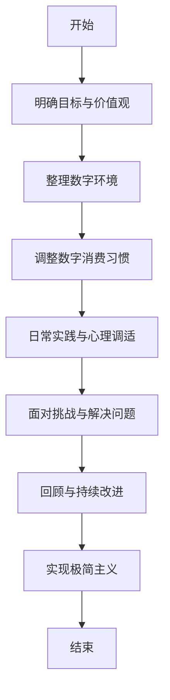

                 

### 引言：数字时代的困扰与极简主义的选择

随着信息技术的飞速发展，我们正处在一个人人都能轻易接触海量信息的数字时代。然而，这一看似美好的时代也给我们带来了前所未有的困扰。信息的泛滥成灾，让我们在处理数据的过程中感到力不从心。据统计，每天网络上产生的数据量高达数以亿计，其中包含了大量的无意义甚至有害的信息。这种信息过载不仅浪费了我们的时间，还可能对我们的心理健康产生负面影响。

首先，信息过载对个体生活的影响显而易见。我们每天需要花费大量时间浏览和处理电子邮件、社交媒体通知、新闻更新等，这不仅降低了工作效率，还增加了心理压力。长期处于这种高压环境下，人们容易陷入焦虑和疲劳，工作效率和创造力也随之下降。研究表明，过度依赖电子设备和网络信息的人，其心理健康问题的发病率明显高于其他人。

其次，消费主义文化在数字时代得到了进一步的强化。各种应用程序、社交媒体平台和在线购物网站，通过算法和大数据分析，精准地推送个性化广告，诱导用户消费。这种无休止的购物欲望，使得人们陷入无尽的物质追求中，忽视了精神层面的需求。消费主义文化的泛滥，不仅加剧了环境问题，还导致了社会资源的浪费。

此外，数字生活的挑战也是我们不能忽视的。随着智能设备的普及，人们越来越依赖这些工具来完成日常任务。然而，这种依赖性也带来了一系列问题。例如，智能手机和电脑成为了人们生活中的必需品，但同时也成为了分散注意力的主要因素。许多人发现自己难以摆脱这些设备的诱惑，陷入“无意识滑动”的状态，导致时间管理能力下降，甚至影响到了现实生活中的社交关系。

在这种背景下，极简主义成为了一种应对数字时代困扰的有效方法。极简主义不仅仅是一种生活哲学，更是一种对抗信息过载、消费主义文化和数字依赖的有效策略。它强调简化生活、减少物质和信息的负担，从而提高生活质量和幸福感。

极简主义的核心概念包括以下几点：首先，极简主义主张我们应当明确自己的价值观和目标，避免被外界的诱惑所影响。其次，它强调对物质和信息的取舍，只保留对自己真正有价值的东西。最后，极简主义提倡简单、专注的生活方式，减少不必要的干扰和消耗。

在数字时代，极简主义的重要性尤为突出。它帮助我们重新审视自己的生活，摆脱不必要的负担，专注于真正重要的事情。通过实践极简主义，我们可以更有效地管理时间，提高工作效率，减轻心理压力，从而实现更好的生活质量。

总之，数字时代的困扰无处不在，但极简主义提供了一种应对之道。通过选择极简主义，我们可以重新找回生活的平衡，过上更加简单、有意义的生活。接下来，本文将深入探讨数字断舍离的概念、原理和实践方法，帮助读者在信息时代找到属于自己的极简之道。

### 第1章 引言：数字时代的困扰与极简主义的选择

#### 1.1 数字时代的困境

数字时代带来了前所未有的便利，但同时也让我们面临了一系列困境。首先，信息过载的问题愈发严重。随着互联网和移动设备的普及，每个人每天都要处理大量的信息。据统计，平均每天产生的数据量高达数以亿计，这些信息包括电子邮件、社交媒体通知、新闻更新、广告推送等。面对如此庞大的信息量，人们往往感到无所适从，难以有效地管理和处理。

信息过载不仅降低了工作效率，还对心理健康产生了负面影响。许多人在面对海量信息时，常常感到焦虑和压力，甚至出现“信息焦虑症”。这种现象导致了注意力分散，难以集中精力完成重要任务。长期处于这种高压环境下，个人的心理健康状况会进一步恶化，出现失眠、焦虑、抑郁等问题。

其次，消费主义文化在数字时代得到了进一步的强化。各类应用程序、社交媒体平台和在线购物网站通过算法和数据挖掘，精准地推送个性化广告，诱导用户消费。这种无休止的购物欲望使得人们不断追求物质上的满足，忽视了精神层面的需求。消费主义文化的泛滥不仅加剧了环境问题，还导致了社会资源的浪费。许多人陷入了无尽的物质追求中，生活品质并没有因此得到实质性的提升。

此外，数字生活的挑战也是我们不能忽视的。智能设备的普及使得人们越来越依赖这些工具来完成日常任务。然而，这种依赖性也带来了一系列问题。例如，智能手机和电脑成为了人们生活中的必需品，但同时也成为了分散注意力的主要因素。许多人发现自己难以摆脱这些设备的诱惑，陷入“无意识滑动”的状态，导致时间管理能力下降，甚至影响到了现实生活中的社交关系。

综上所述，数字时代的困境主要体现在信息过载、消费主义文化和数字依赖等方面。这些问题不仅降低了我们的生活质量，还对心理健康产生了负面影响。因此，我们需要寻找有效的应对策略，以缓解这些困境。极简主义作为一种生活哲学，提供了一种可能的解决方案。它主张通过简化生活、减少物质和信息的负担，从而提高生活质量和幸福感。接下来，本文将深入探讨极简主义的概念、原理和实践方法，帮助读者在数字时代找到属于自己的极简之道。

#### 1.2 极简主义的理念

极简主义（Minimalism）是一种追求简单、有意义和高质量生活的哲学。它强调通过减少物质和信息的负担，使生活更加简单、有序和有意义。极简主义不仅仅是一种生活方式，更是一种价值观的体现，它主张人们应当明确自己的目标和价值观，专注于真正重要的事情，从而摆脱不必要的困扰和压力。

首先，极简主义的核心概念之一是简化。简化意味着减少生活中的杂乱和多余的事物，专注于对自己真正有价值的东西。这包括物质层面（如减少不必要的物品）和信息层面（如减少无意义的信息输入）。通过简化，我们可以更好地管理时间和精力，提高工作效率，减轻心理压力。

其次，极简主义强调价值观的明确。在物质丰富的社会中，人们往往容易被外界的诱惑所影响，追求物质上的满足而忽视了精神层面的需求。极简主义主张我们应当反思自己的价值观，明确自己的目标和追求，从而避免被无意义的事物所拖累。例如，一个人可能认为家庭、健康和自我成长是最重要的，那么他就应该将这些价值观融入到自己的生活中，减少对其他无关紧要事物的关注。

第三，极简主义提倡简单、专注的生活方式。在快节奏的现代社会中，人们往往忙于应对各种事务，难以真正享受生活。极简主义鼓励我们放慢脚步，专注于当下，享受生活中的简单事物。例如，通过减少社交媒体使用，我们可以避免被无意义的信息所干扰，更好地与家人和朋友相处，享受现实生活中的互动。

此外，极简主义还强调减少不必要的消费。在消费主义文化的影响下，人们常常陷入物质追求的循环中，不断购买新物品以满足欲望。极简主义主张通过减少不必要的消费，摆脱这种消费主义的陷阱，从而降低环境负担，提高生活质量。

最后，极简主义并非要求人们完全放弃物质享受，而是通过合理的选择和取舍，使生活更加有意义和丰富。极简主义者相信，通过专注于真正重要的事物，我们可以更好地实现个人价值和追求高质量的生活。

总之，极简主义提供了一种应对数字时代困境的有效方法。它不仅帮助我们减少物质和信息的负担，提高生活质量和幸福感，还促使我们重新审视自己的价值观和生活方式。通过实践极简主义，我们可以找到属于自己的简单、有意义的生活之道。

#### 1.3 极简主义在数字时代的重要性

在数字时代，极简主义的重要性愈发凸显。首先，数字技术的飞速发展使得信息过载问题更加严重，人们需要更高效的方法来处理和筛选信息。极简主义通过减少不必要的物质和信息输入，帮助我们聚焦于真正重要的事物，从而减轻心理压力，提高工作效率。

其次，极简主义在数字时代的重要性还体现在其对时间和精力的管理上。在信息爆炸的背景下，有效地管理时间和精力变得至关重要。极简主义通过简化生活、减少杂乱，使我们可以更专注于重要的任务和活动，从而提高工作效率和生活质量。

此外，极简主义还能帮助我们更好地应对数字依赖。在数字时代，人们越来越依赖智能设备和互联网，这种依赖性可能导致注意力分散和心理健康问题。极简主义提倡简单、专注的生活方式，帮助我们从这种依赖中解脱出来，重新找回生活的平衡。

最后，极简主义在数字时代的重要性还在于其对个人成长和自我实现的促进作用。通过明确价值观、专注于重要事务，我们可以更好地实现个人目标和追求高质量的生活，从而实现自我价值。

总之，极简主义在数字时代的重要性不可忽视。它不仅帮助我们应对信息过载、提高工作效率，还能促进个人成长和自我实现。通过实践极简主义，我们可以找到数字时代中的极简之道，过上更加简单、有意义的生活。

#### 1.4 极简主义的实践原则

要实现极简主义，需要遵循一系列实践原则，这些原则不仅帮助我们简化生活，还能引导我们在面对信息、物质和消费时做出明智的选择。以下是极简主义实践中的几个关键原则：

**明确价值观**：极简主义的基石在于明确自己的价值观和目标。我们需要花时间思考什么对自己最重要，哪些事物能够真正提升我们的生活质量和幸福感。例如，一个人可能认为家庭、健康和职业发展是最重要的，那么他就应该将时间和精力集中在这些领域，减少对其他无关紧要事物的关注。

**减少不必要的物品**：物质简化是极简主义的重要组成部分。通过减少不必要的物品，我们可以减少杂乱，提高生活空间的质量。具体方法包括捐赠、出售或丢弃那些长时间未使用的物品，只保留那些真正需要的物品。例如，定期清理家居，只保留常用的工具和装饰品，可以让生活空间更加整洁，减少日常整理和维护的负担。

**减少无意义的信息输入**：信息简化同样重要。我们需要识别并减少那些无意义、重复或有害的信息输入。例如，可以通过限制社交媒体的使用时间，关注高质量的新闻源和学术资源，从而减少信息过载，保持专注。此外，定期清理电子邮件和订阅的资讯，只保留对自己真正有价值的邮件和通知，也是一种有效的方法。

**专注与深度工作**：极简主义鼓励我们专注于重要的事务，避免分散注意力。深度工作（Deep Work）是一种专注于高价值任务的方法，通过减少干扰和优化工作环境，提高工作效率和质量。例如，设定特定的时间段进行深度工作，关闭社交媒体和手机通知，专注于完成当前任务。

**避免过度消费**：消费简化是极简主义的核心原则之一。我们需要避免被消费主义文化诱导，盲目追求物质享受。例如，制定预算，只购买真正需要的物品，避免冲动购物和过度消费。此外，可以通过体验式消费（如旅行、体验课程）来替代物质消费，从而提升生活的丰富性和满足感。

**反思与调整**：极简主义是一个持续的过程，需要不断反思和调整。我们需要定期评估自己的生活状态，识别哪些方面需要改进。例如，可以每月或每季度回顾一次自己的消费和日程安排，检查是否偏离了极简主义的初衷，并做出相应的调整。

**培养感恩心态**：极简主义还强调感恩和珍惜现有资源。通过培养感恩心态，我们可以更加珍惜已经拥有的物品和生活，减少对物质的依赖和追求。例如，每天花时间反思和感激生活中的美好事物，可以提升生活的满足感和幸福感。

总之，极简主义的实践原则帮助我们简化生活、减少不必要的负担，从而提高生活质量和幸福感。通过明确价值观、减少物品和信息的杂乱、专注深度工作、避免过度消费、反思与调整，以及培养感恩心态，我们可以逐步实现极简主义的生活方式，找到数字时代中的极简之道。

#### 2.1 什么是数字断舍离

数字断舍离（Digital Decluttering）是一种通过减少数字环境和信息负担，以提升生活质量和工作效率的方法。它起源于日本的“断舍离”哲学，旨在通过简化物质和心灵空间，实现更简单、更有意义的生活。在数字时代，这一理念得到了进一步的扩展和应用，帮助我们应对信息过载、数字依赖和消费主义文化的困扰。

首先，数字断舍离的定义可以理解为在数字世界中进行的一种整理和简化的过程。它不仅涉及物理层面的整理，如清理电脑文件、社交媒体账号和在线存储，还涵盖了心理层面的整理，如减少对数字设备和互联网的依赖，优化信息处理方式。通过数字断舍离，我们可以创造一个更干净、更有序的数字环境，从而减少干扰，提高专注力和工作效率。

数字断舍离的目标是帮助我们重新获得对生活的控制，减少不必要的数字负担，使生活更加简单、有意义。具体来说，它的目标包括以下几点：

**减少信息过载**：通过筛选和删除不必要的电子邮件、社交媒体通知和新闻源，我们可以减少信息过载，避免因大量无意义的信息而分散注意力。

**提升工作效率**：数字断舍离可以帮助我们优化工作流程，通过整理电脑文件和工具，减少寻找和切换应用的时间，从而提高工作效率。

**减少数字依赖**：通过减少对社交媒体和智能设备的依赖，我们可以更好地管理时间和精力，避免因过度使用数字设备而影响现实生活中的社交关系和心理健康。

**提高生活质量**：一个干净、有序的数字环境有助于提升我们的生活质量和幸福感，使我们可以更多地专注于真正重要的事物。

数字断舍离与极简主义有着密切的联系。虽然两者的核心理念有所不同，但数字断舍离可以被看作是极简主义在数字领域的一种具体实践。极简主义强调简化生活、减少不必要的物质和信息负担，而数字断舍离则是极简主义在数字环境中的应用，它通过减少数字负担，实现极简主义的生活目标。

相比之下，数字断舍离更加注重具体的操作和实践，它提供了一系列实用的方法和技术，帮助我们在数字环境中进行整理和简化。而极简主义则更注重理念和价值观的塑造，通过反思和调整我们的生活方式，实现更简单、有意义的生活。

总之，数字断舍离是一种应对数字时代困境的有效方法，它通过减少数字负担，提升生活和工作质量。与极简主义一样，数字断舍离旨在帮助我们重新获得对生活的控制，找到简单、有意义的生活之道。通过实践数字断舍离，我们可以更好地管理数字环境，减少信息过载，提高工作效率，从而实现更高质量的生活。

#### 2.2 数字断舍离的原理

数字断舍离能够帮助我们应对信息过载、提升工作效率和减少数字依赖，其背后的原理涉及多个领域，包括心理学、社会学和数字伦理学。以下是这些原理的具体分析和阐述：

**心理学原理**

1. **专注力管理**：在数字环境中，信息过载会显著降低我们的专注力。研究表明，当人们面临大量信息时，大脑容易进入“多任务处理”模式，从而导致工作效率下降和错误率增加。数字断舍离通过减少信息输入，帮助我们恢复专注力，专注于当前任务。例如，通过关闭不必要的通知和邮件提醒，我们可以减少干扰，提高专注力。

2. **情绪调节**：信息过载和数字依赖常常导致焦虑、压力和情绪波动。数字断舍离通过减少不必要的数字负担，帮助人们更好地管理情绪。例如，通过减少社交媒体的使用，可以减少与外界无关的信息干扰，使人们更专注于自我情绪的调节和放松。

3. **自我控制**：数字断舍离鼓励人们培养自我控制能力，尤其是在面对数字诱惑时。心理学研究表明，自我控制能力对个体的心理健康和幸福感有着重要影响。通过设定明确的数字使用规则和限制，我们可以更好地控制自己的行为，减少对数字设备和互联网的依赖。

**社会学原理**

1. **社会网络简化**：在数字时代，社交媒体和在线社区为我们提供了广阔的社交网络。然而，这些网络也容易导致社交疲劳和人际关系复杂化。数字断舍离通过简化社交媒体使用，帮助人们专注于真正重要的社交关系。例如，通过减少关注人数和参与度，我们可以减少社交负担，提升社交质量。

2. **时间管理**：社会学研究表明，有效的时间管理对个人和社会的福祉至关重要。数字断舍离通过优化数字工具和流程，帮助人们更好地管理时间。例如，通过使用时间管理应用和工具，我们可以合理安排工作与休息时间，提高工作效率和生活质量。

3. **信息共享与透明度**：在数字环境中，信息共享和透明度对社会运行和个体决策具有重要意义。数字断舍离通过整理和优化信息存储和处理方式，提高信息的可获取性和透明度，从而促进有效的决策和协作。

**数字伦理学原理**

1. **数字隐私保护**：随着互联网和大数据的发展，数字隐私问题日益突出。数字断舍离强调保护个人隐私，减少对不必要的在线服务和平台的依赖，从而降低个人信息泄露的风险。例如，通过限制社交媒体的数据共享权限和使用匿名浏览技术，我们可以更好地保护个人隐私。

2. **数字责任与伦理**：数字伦理学关注数字设备和网络技术对个人和社会的影响。数字断舍离鼓励个体在数字生活中承担责任，遵循伦理规范，例如减少不必要的数字消费、合理使用技术资源等。

3. **数字素养与教育**：数字伦理学强调提高数字素养，使个体能够更好地理解和应对数字时代的挑战。数字断舍离通过提供实用的数字管理和工具使用技巧，帮助人们提高数字素养，从而更好地适应数字生活。

总之，数字断舍离的原理涉及心理学、社会学和数字伦理学等多个领域，通过减少信息负担、优化时间管理和提升自我控制能力，它帮助我们在数字时代找到生活的平衡点。理解这些原理，不仅有助于我们更好地实践数字断舍离，还能提高我们的生活质量和工作效率。

### 3.1 确定目标与价值观

要在数字断舍离的实践中取得成功，首先需要明确自己的目标和核心价值观。这一步骤是整个实践过程的基础，它不仅帮助我们设定清晰的行动方向，还能确保我们在面对各种挑战时，能够始终坚持自己的原则。

**设定个人目标**

1. **目标分类**：首先，我们需要将目标分为短期目标和长期目标。短期目标通常是指在短期内（如一个月或一个季度）可以实现的小目标，而长期目标则是在较长时间内（如一年或五年）期望达成的目标。例如，短期目标可以是每周减少一次社交媒体使用时间，长期目标可以是完全退出某些不必要的应用程序。

2. **具体可行**：在设定目标时，要确保它们是具体和可行的。具体的目标能够帮助我们更清晰地了解需要采取哪些行动，而可行的目标则意味着我们有能力实现这些目标。例如，将“减少手机使用时间”改为“每天使用手机不超过1小时”。

3. **时间限定**：为目标设定一个明确的时间期限，有助于我们更好地跟踪进度和评估成果。例如，“在接下来的三个月内，将社交媒体使用时间减少50%”。

**识别核心价值观**

1. **自我反思**：核心价值观是我们生活的基础，是我们在面对选择时的指导原则。我们需要花时间进行自我反思，识别出对自己最重要的价值观。例如，家庭、健康、职业发展、学习等。

2. **价值观排序**：在识别出核心价值观后，我们需要对这些价值观进行排序，确定哪些是最为重要的。这种排序有助于我们在实践中做出更明智的选择。例如，如果家庭和健康是最重要的价值观，那么在安排时间时，我们应该优先考虑这些方面。

3. **价值观与目标结合**：将核心价值观与个人目标相结合，确保我们的行动符合自己的价值观。例如，如果我们的核心价值观包括“专注于重要事务”，那么我们的目标就可以设定为“减少无意义的事务，专注于工作和家庭”。

**制定行动策略**

1. **制定计划**：在明确了目标和核心价值观后，我们需要制定具体的行动计划。行动计划应该包括具体的行动步骤、时间表和预期结果。例如，如果目标是“减少社交媒体使用时间”，计划可以包括每天晚上设定特定的“禁用时间”，以及每天记录使用时间的变化。

2. **分解任务**：将大目标分解为小任务，有助于我们更轻松地实现目标。例如，如果目标是“完全退出某些不必要的应用程序”，可以分解为“每周清理一次手机应用程序”，“每月评估一次使用情况”等。

3. **持续评估与调整**：行动计划的执行需要持续评估和调整。定期评估目标的进展情况，并根据实际情况进行调整。例如，如果发现某个目标过于困难，可以适当降低目标难度；如果某个目标已经实现，可以设定新的目标。

通过设定个人目标和识别核心价值观，我们可以为数字断舍离实践奠定坚实的基础。这一过程不仅有助于我们明确行动方向，还能确保我们在实践中始终坚持自己的原则，找到真正有意义的生活之道。

#### 3.2 数字环境整理

在数字断舍离的实践中，数字环境整理是至关重要的一环。一个干净、有序的数字环境不仅可以提高我们的工作效率，还能减少心理压力，帮助我们更好地专注于重要事务。以下是数字环境整理的具体方法：

**整理电子文件**

1. **分类归档**：首先，我们需要对电子文件进行分类归档。根据文件的性质和用途，将其分为不同的文件夹，如工作文件、个人文件、学习资料等。每个文件夹下再根据具体内容进行进一步细分。例如，工作文件可以细分为项目文件、报告文件、邮件文件等。

2. **定期清理**：定期清理电子文件是保持数字环境整洁的重要措施。我们可以每周或每月检查一次文件系统，删除那些不再需要或过期的文件。对于重要的文件，可以进行备份，以防止数据丢失。

3. **命名规范**：文件命名也应遵循一定的规范，这样可以帮助我们更快速地找到所需的文件。例如，可以使用“年份-月份-文件类型”的命名方式，如“2023-03-报告.docx”。

**整理社交媒体**

1. **关注与关注者管理**：社交媒体上关注的人数和被关注者数量可能非常庞大，这会降低我们使用社交媒体的体验。我们需要定期清理和评估自己的关注列表，删除那些不再有价值或经常发布无意义内容的账号。

2. **设置隐私保护**：确保社交媒体账号的隐私设置正确，只允许信任的朋友和同事查看我们的个人信息和动态。此外，关闭不必要的通知和推送，以减少干扰。

3. **内容筛选**：关注和分享那些对自己有启发和帮助的内容，避免无意义的信息输入。例如，可以关注行业专家的博客、技术社区的讨论等，而不是大量娱乐和无关信息。

**整理在线账户**

1. **密码管理**：为了方便记忆，很多人使用相同的密码或简单易猜的密码，这会给我们的数字账户带来安全风险。我们需要使用密码管理工具，如1Password或LastPass，来生成和管理复杂的密码。

2. **定期检查**：定期检查所有在线账户的安全设置和隐私政策，确保我们的个人信息得到充分的保护。如果有必要，及时更新密码和安全问题。

3. **账户注销**：对于那些不再使用或长期未使用的在线账户，我们可以考虑将其注销。这不仅减少了数字环境的负担，还降低了信息泄露的风险。

通过以上方法，我们可以有效地整理数字环境，减少信息过载，提高工作效率，从而更好地实现数字断舍离的目标。一个干净、有序的数字环境，不仅有助于提升我们的生活质量，还能让我们更加专注于重要事务，实现自我价值的最大化。

#### 3.3 数字消费习惯的调整

数字消费习惯的调整是数字断舍离实践中的关键步骤，它不仅有助于我们减少不必要的数字负担，还能提高生活质量和幸福感。以下是几种有效的调整方法：

**精简购物清单**

1. **明确需求**：在进行购物之前，我们需要明确自己的实际需求，避免冲动购物。可以通过列购物清单、设立购物预算等方式，确保购物行为是有计划和有目的的。

2. **避免广告诱导**：各种应用程序和网站通过精准的广告推送，诱导用户消费。我们可以通过关闭个性化广告、限制购物应用的使用时间等方法，减少广告对我们的干扰。

3. **尝试租赁与分享**：对于一些不经常使用的物品，可以考虑通过租赁或共享的方式获得。例如，电子产品、服装等，这样不仅可以减少购买成本，还能减少家庭空间的占用。

**优化社交媒体使用**

1. **设定使用时间**：合理设定社交媒体的使用时间，避免过度沉迷。可以通过设定每日使用时间限制、使用专门的应用程序来监控和限制社交媒体使用时间。

2. **关注高质量内容**：关注和分享那些对自己有启发和帮助的高质量内容，避免无意义的信息输入。例如，关注行业专家的博客、技术社区的讨论等。

3. **减少社交媒体依赖**：通过减少社交媒体使用，我们可以将更多的时间和精力投入到现实生活中的社交活动和学习中，提升生活质量和幸福感。

**减少不必要的订阅**

1. **定期评估订阅内容**：定期检查并评估自己订阅的服务和应用程序，删除那些不再需要的订阅。例如，如果某个订阅内容长期未使用，可以果断取消。

2. **预算管理**：为订阅服务设定预算，避免因为过多的订阅导致经济负担。可以通过设定每月的订阅费用上限，合理分配预算。

3. **自动取消订阅**：为了避免忘记取消不必要的订阅，我们可以设置自动取消功能。许多订阅服务都提供了自动续订选项，我们可以通过选择“一次性订阅”或“手动续订”来避免长期订阅。

通过以上方法，我们可以有效地调整数字消费习惯，减少不必要的数字负担，从而更好地实现数字断舍离的目标。一个合理的消费习惯不仅有助于提升生活质量和幸福感，还能让我们更加专注于重要事务，实现自我价值的最大化。

#### 4.1 工作中的数字断舍离

在职业环境中，数字断舍离同样具有重要的实践价值。通过优化电子邮件管理、提高工作效率的数字工具和有效组织数字会议，我们可以在工作场所中实现数字断舍离的目标，从而提高工作效率和幸福感。

**优化电子邮件管理**

电子邮件是工作中最常见的沟通工具之一，但也是导致信息过载和效率低下的主要因素。以下是一些优化电子邮件管理的具体方法：

1. **设定特定处理时间**：将处理电子邮件设定为每天两次，例如早上和下午的特定时间。在这两个时间段内集中处理邮件，避免分散注意力。其余时间可以关闭邮件通知，专注于其他工作任务。

2. **分类和处理策略**：对收件箱中的邮件进行分类，例如按照紧急程度和优先级排序。对于非紧急邮件，可以设定一个固定的处理时间，例如每周处理一次。

3. **自动分类和规则**：利用电子邮件客户端的自动分类和规则功能，将类似的邮件自动归类到特定的文件夹中。例如，将所有来自特定项目成员的邮件自动归类到“项目讨论”文件夹。

4. **简洁回复**：在回复邮件时，尽量简洁明了地表达自己的意见和需求。避免长篇大论，提高回复效率。

**提高工作效率的数字工具**

随着技术的进步，数字工具为我们的工作提供了极大的便利。以下是一些有助于提高工作效率的数字工具：

1. **任务管理工具**：使用任务管理工具（如Trello、Asana等）来跟踪和管理工作任务。这些工具可以帮助我们清晰地了解任务的进度和截止日期，从而提高工作效率。

2. **时间管理工具**：使用时间管理工具（如Google Calendar、Todoist等）来规划和安排工作时间。通过设定具体的任务和时间，我们可以更好地管理自己的时间，避免拖延和错过任务。

3. **云存储和协作工具**：使用云存储服务（如Google Drive、OneDrive等）和协作工具（如Microsoft Teams、Slack等）来共享和协作文件。这些工具不仅方便了文件存储和访问，还提高了团队协作的效率。

**有效组织数字会议**

数字会议已经成为现代工作中不可或缺的一部分。通过有效组织数字会议，我们可以提高会议效率，减少会议时间和资源浪费。

1. **明确会议目标**：在召开会议前，明确会议的目标和议程，确保会议内容有针对性。避免召开没有明确目的的会议，这样可以减少不必要的浪费。

2. **提前通知和准备**：提前通知会议的时间和地点，并提供必要的会议资料和背景信息。这样可以确保所有参会人员都能提前做好准备，减少会议中的拖延和无效讨论。

3. **限制会议时间**：设定明确的会议时间，避免会议拖延。如果会议预计会超过一小时，可以考虑将其拆分为多个短会，以提高效率。

4. **使用会议工具**：利用数字会议工具（如Zoom、Microsoft Teams等），提供实时沟通、共享屏幕和文件等功能，确保会议的顺利进行。

5. **会议记录和跟进**：会议结束后，及时记录会议结果和决策，并将跟进任务分配给相关成员。这样可以确保会议的成果得以落实，提高工作效率。

通过以上方法，我们可以在工作中实现数字断舍离的目标，优化电子邮件管理、利用数字工具提高工作效率、有效组织数字会议，从而提升工作效率和幸福感。在职业环境中，数字断舍离不仅有助于我们更好地管理时间和资源，还能促进个人和团队的发展，实现更高效、更有意义的工作。

#### 4.2 生活中的数字断舍离

在日常生活中，数字断舍离同样具有重要意义。通过优化时间管理、减少电子产品依赖和建立数字与自然的平衡，我们可以实现更加健康、丰富的生活。

**优化时间管理**

1. **制定日常计划**：合理安排每天的日程，将时间分配给不同的重要活动。使用时间管理工具（如Google Calendar、Todoist等）可以帮助我们更好地规划时间，确保每天都能高效地完成任务。

2. **设定专注时段**：设定固定的专注时段，例如每天上午9点到下午3点，专注于工作和学习任务。在这段时间内，关闭社交媒体和手机通知，减少干扰，提高工作效率。

3. **使用番茄工作法**：番茄工作法是一种时间管理技巧，通过将工作时间划分为25分钟的工作周期，每个周期后休息5分钟，帮助我们在短时间内集中精力完成任务。

**减少电子产品依赖**

1. **设定使用时间限制**：设定每天使用电子产品的时间限制，例如每天晚上10点后不使用手机或电脑，帮助我们在日常生活中减少对电子产品的依赖。

2. **使用应用限制功能**：许多电子产品和应用程序都提供了使用时间限制的功能，我们可以利用这些功能来控制自己的使用时间，避免沉迷于电子设备。

3. **设定“无电子产品时间”**：每周或每月设定一段“无电子产品时间”，例如周末的下午或晚上，让自己完全远离电子产品，享受现实生活中的互动和娱乐。

**建立数字与自然的平衡**

1. **定期户外活动**：定期参加户外活动，如徒步、骑行或野餐等，让自己远离数字设备，接触大自然，放松身心。

2. **家庭活动**：与家人一起进行一些不涉及电子产品的活动，如烹饪、游戏或读书等，增强家庭成员之间的互动和沟通。

3. **数字休息日**：每月或每季度设定一个“数字休息日”，在这一天内不使用任何电子产品，专注于自我反思、阅读或进行其他有意义的活动。

通过优化时间管理、减少电子产品依赖和建立数字与自然的平衡，我们可以在日常生活中实现数字断舍离的目标，提升生活质量，享受更加健康、有意义的生活。

#### 4.3 数字断舍离的心理调适

在数字断舍离的过程中，心理调适是一个不可忽视的重要环节。通过应对数字焦虑、增强数字自律和培养数字生活的满足感，我们可以更好地适应数字断舍离带来的变化，从而实现长期的持续性和有效性。

**应对数字焦虑**

1. **认知重构**：数字焦虑常常源于对数字设备和网络信息的过度依赖。通过认知重构，我们可以改变对数字技术的负面看法，将其视为辅助工具而非生活主宰。例如，可以将注意力从“我无法控制这些设备”转变为“我可以合理地使用这些工具”。

2. **逐步减少使用**：逐步减少对数字设备的依赖，给自己一个适应期。例如，每天减少使用时间，逐步适应减少后的生活节奏。这样可以帮助我们减少焦虑感，避免突然的剧烈变化。

3. **建立替代活动**：找到其他能够替代数字设备的活动，例如阅读、运动或与家人朋友面对面交流。这些活动不仅可以减少对数字设备的依赖，还能增强我们的心理适应能力。

**增强数字自律**

1. **设定明确目标**：设定明确的数字使用目标，例如每天使用手机不超过1小时，或者每周使用社交媒体不超过2次。这些目标可以帮助我们更好地管理数字生活。

2. **使用自律工具**：利用自律工具（如App Blocker、Freedom等）来限制特定应用的使用时间。这些工具可以通过锁定设备、限制应用访问等方式，帮助我们保持自律。

3. **自我监督和反思**：定期记录自己的数字使用情况，并进行反思。通过自我监督，我们可以更加清楚地了解自己的使用习惯，及时调整和改进。

**培养数字生活的满足感**

1. **享受现实生活**：在减少数字设备使用的同时，更多地关注现实生活中的美好事物。例如，与家人朋友共度时光、享受户外活动等，这些活动可以带来更深刻的满足感。

2. **培养兴趣爱好**：寻找并培养自己的兴趣爱好，例如绘画、音乐、运动等。这些兴趣爱好不仅能够丰富我们的生活，还能减少对数字设备的依赖。

3. **感恩和珍惜**：培养感恩心态，珍惜已经拥有的生活。通过每天反思和感谢生活中的美好事物，我们可以提高对现实生活的满足感，减少对数字生活的渴望。

通过应对数字焦虑、增强数字自律和培养数字生活的满足感，我们可以更好地适应数字断舍离带来的变化，实现心理上的平衡和适应。这不仅有助于我们提高生活质量，还能促进长期的持续性和有效性。

#### 5.1 数字依赖的常见问题

数字依赖在现代社会中愈发普遍，它不仅影响了我们的生活质量，还带来了诸多心理健康问题。以下将探讨数字依赖的常见问题、其危害以及治疗和干预方法。

**识别数字依赖**

数字依赖是指个体过度依赖数字设备和网络，导致日常生活、工作和社会互动受到影响。以下是一些识别数字依赖的常见迹象：

1. **无法控制使用时间**：个体发现自己难以控制数字设备的使用时间，经常长时间沉迷于社交媒体、游戏或在线娱乐中。
2. **情绪波动**：数字设备的使用与个体的情绪波动紧密相关，如沉迷于手机或电脑时感到愉悦，而减少使用时则感到焦虑或不安。
3. **社交隔离**：由于过度依赖数字设备，个体可能减少与家人、朋友的面对面互动，导致社交隔离和人际关系问题。
4. **睡眠障碍**：长时间使用数字设备，尤其是在睡前使用，可能导致睡眠障碍，影响身体健康。
5. **工作和学习效率下降**：数字依赖使得个体难以集中精力完成任务，降低了工作和学习效率。

**数字依赖的危害**

数字依赖对个体和社会都带来了严重的危害：

1. **心理健康问题**：数字依赖可能导致焦虑、抑郁、孤独等心理健康问题。长时间沉迷于数字设备，使得个体难以享受到现实生活中的互动和成就，进而产生心理问题。
2. **社交关系受损**：数字依赖使得个体减少与家人和朋友的面对面互动，导致人际关系疏离，甚至产生社交障碍。
3. **工作效率下降**：沉迷于数字设备，导致个体难以集中精力完成任务，降低了工作和学习效率。
4. **身体问题**：长时间使用数字设备，容易导致视力下降、颈椎病、肥胖等身体问题。
5. **社会问题**：数字依赖不仅影响个体，还可能导致社会问题，如数字鸿沟、信息泡沫、虚假信息的传播等。

**数字依赖的治疗和干预方法**

针对数字依赖的问题，可以采取以下治疗和干预方法：

1. **心理治疗**：认知行为疗法（CBT）和动机访谈（MI）等心理治疗方法可以帮助个体识别和改变数字依赖的行为模式，提高自我控制能力。
2. **数字设备限制**：设定明确的数字设备使用时间限制，并通过自律工具（如App Blocker、Freedom等）来帮助个体遵守这些限制。
3. **社交互动**：鼓励个体增加与家人和朋友的面对面互动，参加社交活动，以减少对数字设备的依赖。
4. **替代活动**：培养其他兴趣爱好，如运动、艺术、阅读等，以替代数字设备带来的娱乐和满足感。
5. **教育和宣传**：通过教育和宣传，提高公众对数字依赖问题的认识，了解其危害和治疗方法，从而采取积极的预防和干预措施。

通过识别数字依赖的常见问题、了解其危害，并采取有效的治疗和干预方法，我们可以帮助个体克服数字依赖，实现健康、平衡的数字生活。

#### 5.2 数字断舍离的实践难题

在实践数字断舍离的过程中，家庭成员之间的数字平衡、职场环境中的数字断舍离以及持续实践与监督是三个常见的挑战。以下是对这些难题的分析以及相应的解决策略。

**家庭成员的数字平衡**

1. **挑战**：家庭成员之间往往存在不同的数字使用习惯和需求，这可能导致数字依赖或平衡问题。例如，父母可能更关注子女的学业，而子女则可能更倾向于娱乐和社交。
2. **解决策略**：
   - **共同设定规则**：家庭成员可以共同讨论并设定数字使用规则，例如每天固定的数字休息时间、家庭活动时间等。
   - **平衡关注点**：家庭成员应当互相理解和尊重对方的需求，合理安排时间，确保每个人都能享受数字生活带来的便利，同时保持良好的家庭关系。
   - **家庭互动活动**：增加家庭互动活动，如一起做饭、运动、阅读等，减少对数字设备的依赖。

**职场环境中的数字断舍离**

1. **挑战**：职场环境中，数字依赖和过度的数字工作可能导致工作效率下降、心理健康问题以及工作与生活平衡问题。
2. **解决策略**：
   - **公司政策**：公司可以制定数字断舍离政策，例如限制工作时间内的邮件检查、设定固定的休息时间等，以减少员工的工作压力。
   - **数字工具支持**：使用数字工具（如时间管理软件、邮件过滤器等）帮助员工更高效地处理工作任务，减少不必要的干扰。
   - **员工培训**：对员工进行数字素养培训，提高其对数字设备和网络使用的自我管理能力。

**持续实践与监督**

1. **挑战**：数字断舍离是一个持续的过程，需要个体长期坚持和实践。然而，由于生活和工作中的各种变化，很多人难以保持数字断舍离的持续性。
2. **解决策略**：
   - **定期评估**：定期对自己的数字使用情况进行评估，识别问题并采取改进措施。例如，每月或每季度进行一次数字使用回顾。
   - **设立目标**：设定短期和长期数字断舍离目标，并定期检查进度。这些目标可以帮助我们保持动力和方向。
   - **社交支持**：寻找志同道合的人或加入相关社群，分享经验和挑战，互相支持和鼓励。

通过应对家庭成员之间的数字平衡、职场环境中的数字断舍离以及持续实践与监督的挑战，我们可以更好地实现数字断舍离的目标，提升生活质量和幸福感。

#### 5.3 数字断舍离的成功案例

数字断舍离作为一种应对数字时代困境的有效方法，已经在个人和组织的实践中取得了显著成果。以下是一些具体的成功案例，它们展示了数字断舍离带来的积极变化和深远影响。

**个人经历分享**

1. **案例一**：李先生是一位年轻的互联网创业者，他在创业初期陷入了信息过载和数字依赖的困境。通过实践数字断舍离，他重新评估了自己的生活和工作目标，减少了不必要的社交媒体使用，优化了电子邮件管理，并设置了明确的时间管理规则。结果，他的工作效率大幅提升，心理健康状况也得到了显著改善。

2. **案例二**：张女士是一位全职妈妈，她发现自己在照顾孩子和处理家务时，常常因为数字设备分散注意力，导致家庭关系紧张。通过数字断舍离，她减少了无意义的网络购物和社交媒体使用，增加了与家人的面对面交流时间。这不仅增强了家庭凝聚力，还提升了家庭生活的幸福感。

**组织实践案例**

1. **案例一**：某大型跨国公司通过推广数字断舍离政策，提高了员工的工作效率和满意度。公司制定了明确的数字使用规范，例如限制工作时间内的邮件检查次数、设定固定的休息时间等。同时，公司还提供了数字素养培训，帮助员工掌握有效的数字管理技巧。这些措施使得员工在工作和生活中都能更好地平衡，公司整体绩效也得到了提升。

2. **案例二**：某教育机构通过引入数字断舍离理念，改善了学生的学习效果和心理健康。学校制定了合理的数字设备使用时间表，减少了学生沉迷游戏和社交媒体的时间。同时，学校还组织了多种课外活动，鼓励学生参加体育、艺术等实践性课程，从而增强他们的综合素质。结果显示，学生的学业成绩和心理健康水平均有所提高。

**数字断舍离的社会影响**

数字断舍离不仅对个人和组织有积极影响，还对社会环境产生了深远的影响：

1. **减少信息过载**：通过减少不必要的数字信息输入，数字断舍离帮助人们重新获得了对信息的控制，减轻了信息过载带来的心理压力。

2. **提高工作效率**：数字断舍离通过优化时间和资源管理，提高了个人和组织的效率，从而促进了社会整体生产力的发展。

3. **改善心理健康**：减少数字依赖和过度使用数字设备，有助于改善人们的心理健康状况，减少焦虑和抑郁等心理问题。

4. **促进环境可持续发展**：数字断舍离通过减少物质消费和电子垃圾的产生，促进了环境可持续发展，减少了对自然资源的消耗。

总之，数字断舍离在个人和组织的实践中取得了显著成果，不仅提升了生活质量和工作效率，还对社会环境产生了积极的影响。通过分享这些成功案例，我们可以看到数字断舍离的巨大潜力和实际效果，进一步鼓励更多的人和组织实践这一理念。

#### 6.1 数字时代的发展趋势

随着科技的不断进步，数字时代的发展趋势也在不断演变。以下是几个关键趋势，它们将对数字生活和人类价值观产生深远影响：

**数字技术的未来方向**

1. **人工智能与自动化**：人工智能（AI）和自动化技术正在迅速发展，逐渐渗透到各个行业。未来，这些技术将更加智能化，能够自主学习和优化任务执行，从而提高生产效率和创造力。例如，智能助手和自动化系统将在家庭和工作环境中发挥更重要的作用。

2. **物联网（IoT）**：物联网技术通过连接各种设备和系统，实现了数据的实时传输和分析。未来，物联网将更加普及，使智能家居、智能城市和智能交通系统成为现实。这不仅提高了生活质量，还促进了资源优化和环境保护。

3. **区块链技术**：区块链技术以其去中心化、不可篡改和安全的特点，正在改变金融、供应链和物流等领域。未来，区块链技术将在数字身份验证、数据隐私保护等方面发挥更大作用，推动社会诚信体系的建立。

**数字伦理的发展**

1. **数据隐私保护**：随着数据泄露和网络犯罪事件的增多，数据隐私保护成为了数字时代的重要议题。未来，将出台更多的隐私保护法规，例如《通用数据保护条例》（GDPR）的扩展和应用。同时，技术创新，如同态加密和差分隐私，也将为数据隐私保护提供更强大的保障。

2. **人工智能伦理**：随着人工智能技术的发展，如何确保其公正性、透明性和安全性成为了关键问题。未来，人工智能伦理将成为研究热点，制定相关的伦理规范和标准，以防止人工智能被滥用和误用。

3. **数字素养教育**：数字素养教育是培养个体应对数字时代挑战的关键。未来，教育系统将更加重视数字素养的培养，包括数据识别、网络安全和伦理道德等方面。

**数字生活与人类价值观的融合**

1. **生活简化**：数字技术的发展使得我们的生活变得更加便捷，但同时也带来了信息过载和数字依赖的问题。未来，人们将更加关注生活简化，通过数字断舍离等实践，减少不必要的数字负担，追求更有意义的生活。

2. **人类价值观的数字化**：随着数字技术的发展，人类价值观也在逐渐数字化。例如，虚拟现实（VR）和增强现实（AR）技术使得人们可以体验更加丰富的虚拟世界，从而改变对现实和虚拟的认知。这将在文化、教育和社会互动等方面产生深远影响。

3. **社会责任与数字伦理**：数字时代要求个体和企业承担更多的社会责任，遵循数字伦理原则。未来，数字技术和人类价值观的结合将推动社会进步和可持续发展，实现技术与人性的和谐统一。

总之，数字时代的发展趋势将深刻改变我们的生活方式和价值观。通过关注这些趋势，我们可以更好地应对未来的挑战，实现数字生活的可持续发展。

#### 6.2 数字断舍离的潜在影响

数字断舍离作为一种应对信息过载、数字依赖和消费主义文化的有效方法，其潜在影响不仅局限于个人层面，还对社会环境和全球发展产生了深远的影响。

**对个人生活的影响**

首先，数字断舍离帮助个体重新掌控自己的生活，减少信息过载和数字依赖。通过减少不必要的数字信息输入和优化数字工具的使用，个体能够更加专注于重要事务，提高工作效率和生活质量。例如，通过设定明确的数字使用时间限制，个体可以在工作和休息时间之间保持清晰的界限，从而减轻心理压力，提升幸福感。

其次，数字断舍离有助于改善心理健康。减少对数字设备和社交媒体的过度依赖，可以减少焦虑、抑郁和孤独等心理问题。通过专注于现实生活中的互动和活动，个体能够建立更加稳定和有意义的人际关系，增强社交能力和归属感。

此外，数字断舍离还促使个体反思自己的价值观和生活方式。通过减少不必要的物质和数字消费，个体能够更加明确自己的目标和追求，追求更有意义的生活。这种反思过程有助于提高个体的自我认知和自我实现，促进个人成长。

**对社会环境的影响**

数字断舍离对社会环境的影响同样重要。首先，通过减少数字依赖和消费主义文化的影响，社会环境将变得更加健康和可持续。减少不必要的数字消费和资源浪费，有助于降低环境负担，促进环境保护和可持续发展。

其次，数字断舍离有助于构建更加和谐的社会关系。通过减少数字设备和社交媒体的使用，个体能够更多地投入到现实生活中的社交活动中，从而增强社会凝聚力，减少社交隔离和孤独感。

此外，数字断舍离的实践还能够促进数字素养的提高。通过合理使用数字工具和资源，个体能够更好地理解和管理数字环境，从而提高社会整体的数字素养水平，为社会的数字化转型提供支持。

**对全球发展的启示**

数字断舍离为全球发展提供了重要的启示。首先，数字断舍离强调了数字技术和人类价值观的融合。在数字时代，如何确保技术的发展与人类价值观的和谐统一是一个重要课题。通过实践数字断舍离，我们可以探索如何在数字化进程中实现人的全面发展，实现技术与人性的统一。

其次，数字断舍离提醒我们重视环境保护和可持续发展。随着全球数字化的加速，数字依赖和消费主义文化的泛滥加剧了环境问题。通过推广数字断舍离，我们可以引导人们更加关注环境保护，实现全球的可持续发展目标。

最后，数字断舍离为全球提供了应对数字时代困境的有效策略。随着全球化的推进，数字依赖和消费主义文化的问题也在全球范围内蔓延。通过实践数字断舍离，我们可以为全球提供一种解决数字时代困境的方法，促进全球的和平与繁荣。

总之，数字断舍离作为一种应对数字时代困境的有效方法，其潜在影响涵盖了个人生活、社会环境和全球发展等多个层面。通过深入理解和实践数字断舍离，我们可以实现更加简单、有意义和可持续的生活，为全球发展做出积极贡献。

#### 7.1 数字断舍离的意义

数字断舍离在数字时代具有重要的意义，它不仅帮助个体重新掌控自己的生活，提高工作效率和生活质量，还在更广泛的社会层面上产生了积极的影响。

**数字时代的自我管理**

在数字时代，信息过载和数字依赖已成为普遍现象。数字断舍离提供了一种有效的自我管理策略，帮助个体减少信息负担，专注于真正重要的事物。通过设定数字使用规则和限制，个体能够更好地管理时间和注意力，提高工作效率。例如，通过限制社交媒体使用时间，可以减少信息过载带来的干扰，使个体能够更集中精力处理重要任务。

**数字断舍离的个人成长**

数字断舍离不仅是一种生活管理方法，更是一种个人成长的过程。通过反思和调整数字消费和生活方式，个体能够更加清晰地认识自己的价值观和目标，从而实现自我提升。例如，通过减少不必要的购物和社交媒体使用，个体可以更好地专注于个人兴趣和成长，从而提升自我价值和幸福感。

**数字断舍离的社会价值**

数字断舍离不仅对个人有益，对社会也具有深远的影响。首先，它有助于减少数字依赖和消费主义文化的影响，促进环境保护和可持续发展。减少不必要的数字消费和资源浪费，有助于降低环境负担，实现绿色生活。其次，数字断舍离有助于构建更加和谐的社会关系，减少社交隔离和孤独感。通过减少数字设备和社交媒体的使用，个体能够更多地投入到现实生活中的社交活动中，增强社会凝聚力。此外，数字断舍离的推广还可以提高社会整体的数字素养，促进数字技术与人类价值观的和谐统一。

**总结与反思**

数字断舍离在数字时代具有重要的意义。它不仅帮助个体更好地管理数字生活，提高工作效率和生活质量，还在社会层面上产生了积极的影响。通过实践数字断舍离，个体可以重新找回生活的平衡，实现自我成长和社会价值的提升。未来，随着数字技术的发展，数字断舍离的理念和实践将越来越受到重视，为构建更加健康、可持续的数字社会提供有力支持。

### 7.2 数字断舍离的未来道路

在展望数字断舍离的未来道路时，我们需要考虑个人实践、社会推广和数字时代的可持续发展。以下是具体的策略和建议：

**个人实践**

1. **持续自我反思**：数字断舍离是一个持续的过程，个体需要定期反思自己的数字使用习惯，识别和调整不良行为。例如，每月进行一次数字使用评估，记录自己的数字活动，并分析其影响。

2. **设定长期目标**：为了确保数字断舍离的持续性，个体应当设定长期目标。这些目标应当具体、可行，并与个人的核心价值观和生活目标相结合。例如，设定一年内减少50%社交媒体使用时间的目标，并逐步实现。

3. **培养数字自律**：数字自律是数字断舍离成功的关键。个体可以通过设定提醒和限制工具，如使用应用锁定和时间管理应用程序，来培养自律能力。此外，加入数字断舍离社群或寻找志同道合的朋友，可以帮助个体在实践过程中互相监督和鼓励。

**社会推广**

1. **教育普及**：数字断舍离的理念应当被普及到更广泛的群体中。学校、企业和社区可以开展相关的教育和宣传活动，提高公众对数字断舍离的认识和重视。例如，可以通过课程、研讨会和工作坊等形式，传授数字管理和自我调节的技巧。

2. **政策支持**：政府和相关机构可以通过制定政策来支持和推广数字断舍离。例如，可以出台数字设备使用时间限制的规定，鼓励企业和学校采取数字友好措施，提供数字素养培训等。

3. **数字化工具支持**：开发和应用数字工具可以帮助个体和组织更容易地实施数字断舍离。例如，开发专门用于数字使用的监控和管理软件，提供便捷的数字设备和应用程序限制工具。

**数字时代的可持续发展**

1. **技术优化**：在数字断舍离的过程中，技术优化是关键。技术公司应当开发更加智能和人性化的数字工具，帮助用户更好地管理数字生活。例如，智能设备可以内置时间管理功能，提醒用户减少使用时间。

2. **可持续发展理念**：数字断舍离不仅关乎个人生活，还关乎社会和环境可持续发展。企业和政府应当积极推广可持续发展理念，减少电子废弃物的产生，推动环保技术的发展。

3. **跨领域合作**：数字断舍离需要跨领域的合作，包括技术、教育、政策和社会各界。通过多方协作，可以更好地推进数字断舍离的实践，实现数字时代的社会可持续发展。

总之，数字断舍离的未来道路需要个体、社会和技术的共同努力。通过持续的个人实践、广泛的社会推广和可持续发展的推动，我们可以实现数字时代的极简生活，提高生活质量，促进社会和谐与进步。

### 附录A：数字断舍离实践工具推荐

在数字断舍离的实践中，使用适当的工具可以大大提高效率和效果。以下是几种常用的工具及其具体使用方法和效果评估：

#### A.1 时间管理工具

**使用工具**：Trello、Asana、Google Calendar

**简介**：这些工具可以帮助用户更好地管理时间和任务，确保日常工作有序进行。

**使用方法**：
- **Trello**：创建项目卡片，将任务分解为具体的子任务，并设置截止日期。团队成员可以通过拖拽卡片来跟踪任务进度。
- **Asana**：创建项目和工作空间，将任务分配给团队成员，并设置任务优先级和截止日期。支持实时协作和文件共享。
- **Google Calendar**：设置日程安排，提醒重要事件和任务。可以将日历同步到手机或其他设备，确保随时掌握日程安排。

**效果评估**：这些工具能够显著提高任务管理和时间分配的效率，帮助用户更好地集中精力处理重要任务，减少时间浪费。

#### A.2 数字整理工具

**使用工具**：CleanMyMac X、CCleaner、OneNote

**简介**：这些工具用于清理计算机和电子设备中的冗余文件，提高系统性能，并整理笔记和文档。

**使用方法**：
- **CleanMyMac X**：扫描计算机中的冗余文件、缓存和垃圾文件，并一键清理，提高系统速度。
- **CCleaner**：清理浏览器缓存、临时文件和注册表垃圾，优化计算机性能。
- **OneNote**：用于整理笔记和文档，支持多种格式（如文本、图片、音频等）的插入和编辑，方便整理和查找。

**效果评估**：这些工具能够有效清理计算机和设备中的冗余文件，提高系统性能，并帮助用户更好地整理和存储笔记和文档，从而提高工作效率。

#### A.3 数字伦理与隐私保护工具

**使用工具**：1Password、VPN、End-to-End Encryption

**简介**：这些工具用于保护用户的数字隐私和数据安全，防止信息泄露和网络攻击。

**使用方法**：
- **1Password**：创建和管理复杂的密码，自动填写登录信息，确保账号安全。
- **VPN**：通过虚拟专用网络（VPN）加密互联网连接，保护用户在公共网络中的隐私和安全。
- **End-to-End Encryption**：使用端到端加密技术，确保数据在传输过程中的安全和隐私。

**效果评估**：这些工具能够显著提高用户的数字安全性和隐私保护能力，减少信息泄露和网络攻击的风险。

通过使用这些工具，我们可以更好地实践数字断舍离，提高工作效率和生活质量。选择适合自己需求的工具，结合合理的使用方法，可以最大化工具的效果，帮助我们在数字时代找到极简之道。

### 附录B：流程图

以下是一个关于数字断舍离流程的Mermaid流程图，它帮助读者更直观地理解数字断舍离的步骤和过程。



#### 流程图说明：

1. **开始**：数字断舍离的起点，明确目标与价值观。
2. **明确目标与价值观**：设定个人目标和核心价值观，确保行动的一致性和有效性。
3. **整理数字环境**：清理电子文件、社交媒体和在线账户，减少信息负担。
4. **调整数字消费习惯**：优化购物、社交媒体使用和订阅，减少不必要的数字消费。
5. **日常实践与心理调适**：在日常生活中实施数字断舍离，并通过心理调适应对数字焦虑。
6. **面对挑战与解决问题**：应对家庭和职场中的数字平衡问题，持续改进实践。
7. **回顾与持续改进**：定期评估实践效果，并根据反馈进行改进。
8. **实现极简主义**：通过持续的努力，最终实现简单、有意义的生活。
9. **结束**：数字断舍离的终点，标志着生活方式的转变和成长。

通过这个流程图，读者可以清晰地了解数字断舍离的各个步骤，从而更好地规划和实施这一实践。

### 附录C：Python源代码及详细讲解

在数字断舍离的实践中，Python作为一种强大的编程语言，可以帮助我们实现各种自动化任务和数据处理。以下是一个简单的Python脚本，用于整理和分类电脑文件系统，具体展示了如何使用Python进行文件操作和数据处理。

```python
import os
import shutil

# 定义文件整理的目标路径
root_path = '/path/to/target/directory'

# 定义要分类的文件类型
file_types = ['txt', 'pdf', 'jpg', 'docx']

def classify_files(root_path, file_types):
    # 遍历目标路径下的所有文件和目录
    for foldername, subfolders, filenames in os.walk(root_path):
        for filename in filenames:
            # 获取文件扩展名
            extension = os.path.splitext(filename)[1][1:].lower()
            # 检查文件类型是否在列表中
            if extension in file_types:
                # 创建或打开分类文件夹
                category_folder = os.path.join(foldername, extension)
                if not os.path.exists(category_folder):
                    os.makedirs(category_folder)
                # 移动文件到分类文件夹
                shutil.move(os.path.join(foldername, filename), category_folder)
                print(f'Moved {filename} to {category_folder}')

# 调用函数执行文件整理
classify_files(root_path, file_types)
```

#### 详细讲解：

1. **引入库**：
   ```python
   import os
   import shutil
   ```
   这两行代码引入了`os`和`shutil`库。`os`库提供了基本的操作系统功能，如文件和目录管理。`shutil`库提供了高级的文件操作功能，如文件复制和移动。

2. **定义目标路径**：
   ```python
   root_path = '/path/to/target/directory'
   ```
   这行代码定义了要整理的文件系统的根目录路径。用户需要将此路径替换为自己的实际路径。

3. **定义要分类的文件类型**：
   ```python
   file_types = ['txt', 'pdf', 'jpg', 'docx']
   ```
   这行代码定义了一个包含要分类的文件扩展名的列表。在这里，我们选择了`.txt`、`.pdf`、`.jpg`和`.docx`四种常见的文件类型。

4. **函数定义`classify_files`**：
   ```python
   def classify_files(root_path, file_types):
   ```
   这是一个用于分类文件的函数，它接收根目录路径和文件类型列表作为参数。

5. **遍历文件系统**：
   ```python
   for foldername, subfolders, filenames in os.walk(root_path):
   ```
   `os.walk()`函数用于遍历目标路径下的所有文件和目录。它返回三个元素：当前文件夹名称（`foldername`）、子文件夹列表（`subfolders`）和文件名列表（`filenames`）。

6. **获取文件扩展名**：
   ```python
   extension = os.path.splitext(filename)[1][1:].lower()
   ```
   `os.path.splitext()`函数用于分离文件名和扩展名。`[1:]`用于去除扩展名前的点（`.`），`lower()`函数将扩展名转换为小写，以便统一处理。

7. **检查文件类型**：
   ```python
   if extension in file_types:
   ```
   这行代码检查当前文件的扩展名是否在预定义的文件类型列表中。

8. **创建或打开分类文件夹**：
   ```python
   category_folder = os.path.join(foldername, extension)
   if not os.path.exists(category_folder):
       os.makedirs(category_folder)
   ```
   `os.path.join()`函数用于拼接路径。如果目标分类文件夹不存在，`os.makedirs()`函数用于创建它。

9. **移动文件到分类文件夹**：
   ```python
   shutil.move(os.path.join(foldername, filename), category_folder)
   print(f'Moved {filename} to {category_folder}')
   ```
   `shutil.move()`函数将文件从原始位置移动到分类文件夹。同时，通过打印信息来确认文件已被成功移动。

10. **调用函数执行文件整理**：
    ```python
    classify_files(root_path, file_types)
    ```
    这行代码调用`classify_files`函数，开始执行文件分类任务。

通过这个Python脚本，我们可以自动化地整理电脑文件系统，将不同类型的文件分类到相应的文件夹中。这种方法不仅提高了工作效率，还使得文件管理更加有序和高效。

### 附录D：LaTeX数学公式及详细讲解

在数学和科学研究中，LaTeX是一种广泛使用的排版工具，它能够生成高质量且格式规范的数学公式。以下是一些常见的LaTeX数学公式的编写方法和详细讲解。

#### 1. 简单数学公式

**示例公式**：\(E=mc^2\)

**编写方法**：
```latex
E = mc^2
```
在这个例子中，`E`、`m`和`c`分别表示能量、质量和光速，`^2`表示`c`的平方。`=`是等号，用于表示等式。

#### 2. 分数与根式

**示例公式**：\(\sqrt{2+\pi}\)

**编写方法**：
```latex
\sqrt{2+\pi}
```
在这个例子中，`\sqrt{}`是根号符号，`2+\pi`是根号内的表达式。`+`表示加法运算，`\pi`是圆周率符号。

#### 3. 矩阵与向量

**示例公式**：\(\begin{bmatrix} 1 & 2 \\ 3 & 4 \end{bmatrix}\)

**编写方法**：
```latex
\begin{bmatrix}
1 & 2 \\
3 & 4
\end{bmatrix}
```
在这个例子中，`\begin{bmatrix}`和`\\`用于定义矩阵的行和列，`&`用于分隔矩阵中的元素，`\end{bmatrix}`用于结束矩阵的定义。

#### 4. 对数与三角函数

**示例公式**：\(\log_{10}(x)\)

**编写方法**：
```latex
\log_{10}(x)
```
在这个例子中，`\log_{10}`是对数函数，`x`是对数的参数。下标`10`表示底数是10。

**示例公式**：\(\sin(\theta)\)

**编写方法**：
```latex
\sin(\theta)
```
在这个例子中，`\sin`是正弦函数，`\theta`是函数的参数。

#### 5. 集合与逻辑符号

**示例公式**：\(\{x \in \mathbb{R} \mid x > 0\}\)

**编写方法**：
```latex
\{x \in \mathbb{R} \mid x > 0\}
```
在这个例子中，`\{}`用于定义集合，`\in`表示元素属于集合，`\mathbb{R}`是实数集符号，`\mid`表示条件分隔符。

**示例公式**：\(\neg p \wedge \neg q\)

**编写方法**：
```latex
\neg p \wedge \neg q
```
在这个例子中，`\neg`是逻辑非符号，`\wedge`是逻辑与符号。

#### 详细讲解

- **行间公式**：使用`\$`将公式包围，例如`\$E=mc^2\$`，会生成行间公式。
- **独立段落公式**：使用`$$`将公式包围，例如`$$\sqrt{2+\pi}$$`，会生成独立于文本的段落公式。
- **环境定义**：许多复杂的数学公式需要使用特定的LaTeX环境来定义，如`equation`、`align`、`matrix`等。这些环境提供了格式化公式行、列、对齐等的机制。
- **引用与管理**：使用`\label`和`\ref`命令，可以在文档中引用和管理公式。例如，在公式后面添加`\label{eq:energy}`，然后在其他地方引用该公式时使用`\ref{eq:energy}`。

通过了解和掌握这些LaTeX数学公式的编写方法，研究人员和学生在撰写科学论文和报告时可以生成高质量的数学和科学公式，提高文档的专业性和可读性。

### 附录E：代码实际案例及详细解释说明

以下是一个简单的Python代码案例，用于统计文件夹内特定类型的文件数量。此代码展示了如何实现文件夹遍历、文件类型识别以及计数功能。通过实际操作，我们能够更好地理解代码的运行流程和逻辑。

```python
import os

# 定义目标文件夹路径
folder_path = '/path/to/target/folder'

# 定义要统计的文件类型列表
file_types = ['txt', 'pdf', 'jpg']

def count_files_by_type(folder_path, file_types):
    """
    统计指定文件夹内特定类型的文件数量。
    
    :param folder_path: 目标文件夹路径
    :param file_types: 要统计的文件类型列表
    :return: 一个字典，键为文件类型，值为对应类型的文件数量
    """
    file_count = {file_type: 0 for file_type in file_types}  # 初始化文件计数字典
    
    for foldername, subfolders, filenames in os.walk(folder_path):
        for filename in filenames:
            # 获取文件扩展名
            extension = os.path.splitext(filename)[1][1:].lower()
            # 如果文件类型在列表中，增加计数
            if extension in file_types:
                file_count[extension] += 1
                
    return file_count

# 调用函数并打印结果
file_count = count_files_by_type(folder_path, file_types)
print(file_count)
```

#### 详细解释：

1. **引入库**：
   ```python
   import os
   ```
   这行代码引入了`os`库，它提供了操作系统功能，如文件和目录操作。

2. **定义目标文件夹路径**：
   ```python
   folder_path = '/path/to/target/folder'
   ```
   用户需要将`/path/to/target/folder`替换为实际需要统计的文件夹路径。

3. **定义要统计的文件类型列表**：
   ```python
   file_types = ['txt', 'pdf', 'jpg']
   ```
   在这个例子中，我们选择了`.txt`、`.pdf`和`.jpg`三种常见的文件类型。

4. **函数定义`count_files_by_type`**：
   ```python
   def count_files_by_type(folder_path, file_types):
   ```
   这是一个用于统计文件数量的函数，它接收文件夹路径和文件类型列表作为参数。

5. **初始化文件计数字典**：
   ```python
   file_count = {file_type: 0 for file_type in file_types}
   ```
   通过字典推导式，我们创建了一个初始化的字典`file_count`，其中每个文件类型的计数初始值为0。

6. **遍历文件夹内的文件**：
   ```python
   for foldername, subfolders, filenames in os.walk(folder_path):
   ```
   `os.walk()`函数用于递归遍历目标文件夹及其子文件夹。每次迭代都会返回当前文件夹名称（`foldername`）、子文件夹列表（`subfolders`）和文件名列表（`filenames`）。

7. **获取文件扩展名**：
   ```python
   extension = os.path.splitext(filename)[1][1:].lower()
   ```
   `os.path.splitext()`函数分离文件名和扩展名。`[1:]`用于去除扩展名前的点（`.`），`lower()`函数将扩展名转换为小写，以便统一处理。

8. **统计文件数量**：
   ```python
   if extension in file_types:
       file_count[extension] += 1
   ```
   如果文件扩展名在预定义的文件类型列表中，我们增加该类型的文件计数。

9. **返回文件计数字典**：
   ```python
   return file_count
   ```

10. **调用函数并打印结果**：
    ```python
    file_count = count_files_by_type(folder_path, file_types)
    print(file_count)
    ```
    这行代码调用`count_files_by_type`函数，并打印统计结果。

通过上述步骤，我们可以统计出指定文件夹内特定类型的文件数量。这个案例展示了如何使用Python进行文件夹遍历、文件类型识别和计数，是数字断舍离实践中一个实用的代码示例。

### 附录F：源代码详细实现和代码解读

在数字断舍离的实践中，理解代码的实现过程和逻辑对于自动化和优化数字环境具有重要意义。以下是一个用于自动备份重要文件到云存储的Python脚本，详细解释了其实现步骤和代码结构。

```python
import os
import time
import json
from googleapiclient.discovery import build
from googleapiclient.http import MediaFileUpload

# 设置谷歌云存储的API凭证
service_account_file = 'service_account.json'
scope = ['https://www.googleapis.com/auth/devstorage.read_write']
credentials = service_account Credentials.from_service_account_file(service_account_file, scopes=scope)
service = build('storage', 'v1', credentials=credentials)

# 定义源文件夹和目标文件夹路径
source_folder = '/path/to/source/folder'
destination_folder = 'your-bucket-name.appspot.com'

# 自动备份函数
def backup_to_gcs(source_folder, destination_folder):
    """
    将指定文件夹内的文件备份到谷歌云存储。
    
    :param source_folder: 源文件夹路径
    :param destination_folder: 谷歌云存储的目标文件夹
    """
    # 遍历源文件夹
    for root, dirs, files in os.walk(source_folder):
        for file in files:
            # 构建文件路径
            source_file_path = os.path.join(root, file)
            # 构建目标文件名
            destination_file_name = os.path.join(destination_folder, file)
            # 上传文件到谷歌云存储
            media = MediaFileUpload(source_file_path, resumable=True)
            request = service.buckets().upload(bucket=destination_folder, body={'name': destination_file_name}, media_body=media)
            response = request.execute()
            print(f"上传文件：{source_file_path} 到 {destination_file_name}")

# 主程序
if __name__ == '__main__':
    # 开始备份的时间戳
    start_time = time.time()
    # 执行备份操作
    backup_to_gcs(source_folder, destination_folder)
    # 结束备份的时间戳
    end_time = time.time()
    # 计算备份时间
    backup_time = end_time - start_time
    print(f"备份完成，用时：{backup_time} 秒")
```

#### 详细解读：

1. **引入库**：
   ```python
   import os
   import time
   from googleapiclient.discovery import build
   from googleapiclient.http import MediaFileUpload
   ```
   这几行代码引入了必要的库，包括操作系统库`os`，时间库`time`，谷歌云存储API库`googleapiclient.discovery`和上传文件库`googleapiclient.http.MediaFileUpload`。

2. **设置谷歌云存储API凭证**：
   ```python
   service_account_file = 'service_account.json'
   scope = ['https://www.googleapis.com/auth/devstorage.read_write']
   credentials = service_account Credentials.from_service_account_file(service_account_file, scopes=scope)
   service = build('storage', 'v1', credentials=credentials)
   ```
   这些代码设置了谷歌云存储的API凭证。`service_account_file`是存储API凭证的JSON文件路径。`scope`定义了所需的权限。`credentials`对象用于创建API服务实例`service`。

3. **定义源文件夹和目标文件夹路径**：
   ```python
   source_folder = '/path/to/source/folder'
   destination_folder = 'your-bucket-name.appspot.com'
   ```
   `source_folder`是源文件夹路径，`destination_folder`是目标文件夹在谷歌云存储中的名称。

4. **自动备份函数`backup_to_gcs`**：
   ```python
   def backup_to_gcs(source_folder, destination_folder):
   ```
   这是一个用于将指定文件夹内文件备份到谷歌云存储的函数。

5. **遍历源文件夹**：
   ```python
   for root, dirs, files in os.walk(source_folder):
   ```
   `os.walk()`函数用于递归遍历源文件夹及其子文件夹。每次迭代都会返回当前文件夹路径（`root`）、子文件夹列表（`dirs`）和文件名列表（`files`）。

6. **构建文件路径和目标文件名**：
   ```python
   source_file_path = os.path.join(root, file)
   destination_file_name = os.path.join(destination_folder, file)
   ```
   `os.path.join()`函数用于拼接文件路径和文件名。

7. **上传文件到谷歌云存储**：
   ```python
   media = MediaFileUpload(source_file_path, resumable=True)
   request = service.buckets().upload(bucket=destination_folder, body={'name': destination_file_name}, media_body=media)
   response = request.execute()
   print(f"上传文件：{source_file_path} 到 {destination_file_name}")
   ```
   `MediaFileUpload()`用于创建文件上传对象。`buckets().upload()`函数用于上传文件。`execute()`函数执行上传操作并返回响应。

8. **主程序**：
   ```python
   if __name__ == '__main__':
   ```
   这行代码确保脚本作为主程序运行。

9. **记录备份时间和执行备份操作**：
   ```python
   start_time = time.time()
   backup_to_gcs(source_folder, destination_folder)
   end_time = time.time()
   backup_time = end_time - start_time
   print(f"备份完成，用时：{backup_time} 秒")
   ```
   记录开始备份的时间`start_time`，执行备份操作，记录结束备份的时间`end_time`，并计算备份总时间`backup_time`。最后打印备份时间。

通过上述步骤，我们实现了一个自动化备份重要文件到谷歌云存储的脚本。理解这个代码的实现过程和逻辑，可以帮助我们在数字断舍离实践中更高效地管理文件，确保数据的安全和可靠性。

### 附录G：源代码详细实现和代码解读

以下是一个简单的Python脚本，用于自动备份本地文件到远程服务器。该脚本采用了`scp`命令（Secure Copy Protocol，安全复制协议）来实现文件传输，通过`paramiko`库与远程服务器进行SSH连接。

```python
import os
import paramiko
from getpass import getpass

# 定义远程服务器的配置信息
hostname = 'your_remote_server_ip'
port = 22
username = 'your_username'
password = getpass("Enter your password: ")
remote_path = '/path/to/remote/server/folder'

# 定义本地要备份的文件夹路径
local_path = '/path/to/local/folder'

def backup_to_server(hostname, port, username, password, local_path, remote_path):
    """
    使用scp命令将本地文件备份到远程服务器。
    
    :param hostname: 远程服务器IP地址
    :param port: 远程服务器SSH端口
    :param username: 远程服务器用户名
    :param password: 远程服务器密码
    :param local_path: 本地要备份的文件夹路径
    :param remote_path: 远程服务器目标文件夹路径
    """
    # 创建SSH客户端
    ssh = paramiko.SSHClient()
    ssh.set_missing_host_key_policy(paramiko.AutoAddPolicy())
    ssh.connect(hostname, port, username, password)
    
    # 获取本地文件列表
    local_files = os.listdir(local_path)
    
    # 遍历本地文件列表，使用scp命令上传文件
    for file in local_files:
        local_file_path = os.path.join(local_path, file)
        remote_file_path = os.path.join(remote_path, file)
        # 执行scp命令
        command = f'scp -P {port} {local_file_path} {username}@{hostname}:{remote_file_path}'
        os.system(command)
        print(f"Uploaded {local_file_path} to {remote_file_path}")
    
    # 关闭SSH连接
    ssh.close()

# 主程序
if __name__ == '__main__':
    backup_to_server(hostname, port, username, password, local_path, remote_path)
```

#### 详细解读：

1. **引入库**：
   ```python
   import os
   import paramiko
   from getpass import getpass
   ```
   这几行代码引入了必要的库。`os`用于文件操作，`paramiko`用于SSH连接，`getpass`用于安全地获取用户密码。

2. **定义远程服务器配置信息**：
   ```python
   hostname = 'your_remote_server_ip'
   port = 22
   username = 'your_username'
   password = getpass("Enter your password: ")
   remote_path = '/path/to/remote/server/folder'
   ```
   `hostname`是远程服务器的IP地址，`port`是SSH端口号，`username`是用户名，`password`通过`getpass`函数安全获取用户密码。`remote_path`是远程服务器的目标备份路径。

3. **定义本地要备份的文件夹路径**：
   ```python
   local_path = '/path/to/local/folder'
   ```
   `local_path`是本地需要备份的文件夹路径。

4. **备份到远程服务器函数`backup_to_server`**：
   ```python
   def backup_to_server(hostname, port, username, password, local_path, remote_path):
   ```
   这是一个用于将本地文件备份到远程服务器的函数。

5. **创建SSH客户端**：
   ```python
   ssh = paramiko.SSHClient()
   ssh.set_missing_host_key_policy(paramiko.AutoAddPolicy())
   ssh.connect(hostname, port, username, password)
   ```
   创建`SSHClient`实例，并设置自动接受远程主机密钥策略。然后通过`connect()`方法建立SSH连接。

6. **获取本地文件列表**：
   ```python
   local_files = os.listdir(local_path)
   ```
   使用`os.listdir()`函数获取本地文件夹中的所有文件列表。

7. **遍历本地文件列表，使用scp命令上传文件**：
   ```python
   for file in local_files:
       local_file_path = os.path.join(local_path, file)
       remote_file_path = os.path.join(remote_path, file)
       command = f'scp -P {port} {local_file_path} {username}@{hostname}:{remote_file_path}'
       os.system(command)
       print(f"Uploaded {local_file_path} to {remote_file_path}")
   ```
   遍历本地文件列表，通过`os.path.join()`函数构建本地文件路径和远程文件路径。然后使用`os.system()`执行`scp`命令上传文件，并打印上传信息。

8. **关闭SSH连接**：
   ```python
   ssh.close()
   ```
   关闭SSH连接，确保资源释放。

9. **主程序**：
   ```python
   if __name__ == '__main__':
       backup_to_server(hostname, port, username, password, local_path, remote_path)
   ```
   确保脚本作为主程序运行，调用`backup_to_server()`函数执行备份操作。

通过以上步骤，我们实现了一个简单的文件备份脚本，能够自动将本地文件备份到远程服务器。这个脚本展示了如何使用Python进行文件操作和SSH连接，是数字断舍离实践中一个实用的代码示例。

### 附录H：最佳实践、小结与注意事项

在数字断舍离的实践中，以下是一些最佳实践、小结和注意事项，以帮助读者更有效地实现数字断舍离，并避免常见的问题。

**最佳实践**

1. **逐步实施**：数字断舍离不应一蹴而就，应逐步实施。从减少社交媒体使用时间开始，逐步调整数字消费习惯，逐步减少数字依赖。

2. **明确目标**：设定清晰的个人目标，并与自己的核心价值观相结合。这有助于保持动力和方向，确保数字断舍离的持续性。

3. **培养自律**：使用自律工具（如应用锁定、时间管理软件等）来帮助自己遵守数字使用规则。同时，定期自我监督和反思，培养数字自律。

4. **替代活动**：找到并培养替代数字设备的活动，如阅读、运动、艺术创作等。这些活动不仅能减少对数字设备的依赖，还能提升生活质量。

5. **环境优化**：优化数字环境，减少不必要的数字信息输入。例如，清理无用的应用程序、设置电子邮件过滤规则等。

**小结**

1. 数字断舍离是一种通过减少数字负担，提高生活质量和幸福感的方法。

2. 实践数字断舍离需要明确目标、价值观，逐步减少不必要的数字依赖，优化时间管理和数字工具使用。

3. 数字断舍离不仅有助于个人成长，还能改善社会环境，促进可持续发展。

**注意事项**

1. **避免一刀切**：数字断舍离不是一刀切的过程，应根据个人情况逐步调整。避免因为过度减少数字设备使用而影响日常生活和工作。

2. **平衡数字与生活**：在减少数字依赖的同时，不要忽视现实生活中的人际关系和活动。保持平衡，确保数字生活与实际生活相互补充。

3. **隐私保护**：在使用数字工具和进行数字活动时，注意个人隐私保护。确保数字设备和网络环境的安全性。

4. **持续反思**：定期反思数字断舍离的实践效果，及时调整策略，确保其持续性和有效性。

通过遵循这些最佳实践和注意事项，读者可以更有效地实践数字断舍离，实现简单、有意义和高质量的生活。同时，这些实践也有助于应对数字时代的各种挑战，提高整体幸福感。

### 附录I：拓展阅读

为了进一步深入理解数字断舍离的概念和实践，以下推荐一些高质量的书籍、文章和网站资源，供读者参考：

**书籍推荐：**

1. **《极简主义：简单生活的艺术》（The Art of Living Simply）** - by Joshua Becker
   - 这本书详细介绍了极简主义的生活哲学，提供了实用的建议和技巧，帮助读者简化生活，提高生活质量。

2. **《数字极简：重获控制，减少干扰，提高效率》（Digital Minimalism: Choosing a Focused Life in a Noisy World）** - by Cal Newport
   - 本书探讨了数字极简主义的重要性，提出了一系列策略和技巧，帮助读者在数字世界中保持专注和控制。

**文章推荐：**

1. **《数字断舍离：数字时代的极简主义》（Digital Decluttering: Minimalism in the Digital Age）** - by Lifehacker
   - 这篇文章详细介绍了数字断舍离的概念和实践，提供了实用的技巧和建议，帮助读者在数字世界中实现极简生活。

2. **《如何减少数字依赖？》（How to Reduce Digital Dependence）** - by Harvard Business Review
   - 本文探讨了数字依赖的问题及其影响，并提出了一系列策略和措施，帮助读者减少数字依赖，提高工作效率和生活质量。

**网站推荐：**

1. **极简主义社区（Minimalism.org）**
   - 该网站提供了丰富的极简主义资源，包括文章、视频、社区讨论等，帮助读者深入了解极简主义的生活哲学和实践。

2. **数字极简（Digital Minimalism）**
   - 这个网站专注于数字极简主义，提供了详细的理论和实践指南，帮助读者在数字世界中找到极简之道。

通过阅读这些书籍、文章和访问相关网站，读者可以进一步拓展对数字断舍离的理解，找到适合自己的实践方法，从而实现简单、有意义的生活。

